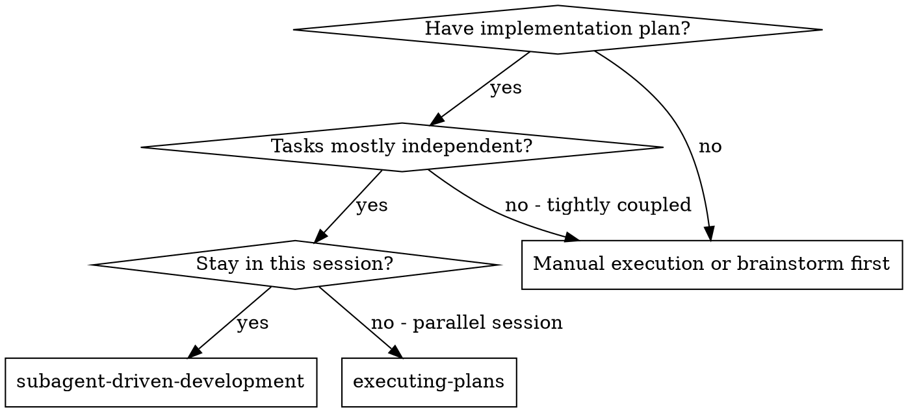
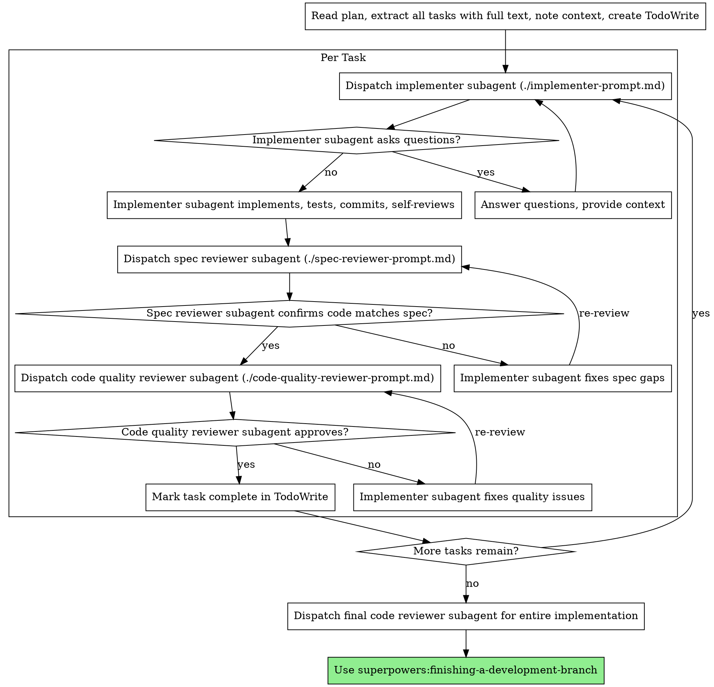

# Implementation plans for JSON reader specs

**Session ID:** ses_1c0a00533ffeUS1Vu5GpsKxTeW
**Created:** 5/19/2026, 11:35:15 AM
**Updated:** 5/19/2026, 12:02:07 PM

---

## User

# Writing Plans

## Overview

Write comprehensive implementation plans assuming the engineer has zero context for our codebase and questionable taste. Document everything they need to know: which files to touch for each task, code, testing, docs they might need to check, how to test it. Give them the whole plan as bite-sized tasks. DRY. YAGNI. TDD. Frequent commits.

Assume they are a skilled developer, but know almost nothing about our toolset or problem domain. Assume they don't know good test design very well.

**Announce at start:** "I'm using the writing-plans skill to create the implementation plan."

**Context:** If working in an isolated worktree, it should have been created via the `superpowers:using-git-worktrees` skill at execution time.

**Save plans to:** `docs/superpowers/plans/YYYY-MM-DD-<feature-name>.md`
- (User preferences for plan location override this default)

## Scope Check

If the spec covers multiple independent subsystems, it should have been broken into sub-project specs during brainstorming. If it wasn't, suggest breaking this into separate plans — one per subsystem. Each plan should produce working, testable software on its own.

## File Structure

Before defining tasks, map out which files will be created or modified and what each one is responsible for. This is where decomposition decisions get locked in.

- Design units with clear boundaries and well-defined interfaces. Each file should have one clear responsibility.
- You reason best about code you can hold in context at once, and your edits are more reliable when files are focused. Prefer smaller, focused files over large ones that do too much.
- Files that change together should live together. Split by responsibility, not by technical layer.
- In existing codebases, follow established patterns. If the codebase uses large files, don't unilaterally restructure - but if a file you're modifying has grown unwieldy, including a split in the plan is reasonable.

This structure informs the task decomposition. Each task should produce self-contained changes that make sense independently.

## Bite-Sized Task Granularity

**Each step is one action (2-5 minutes):**
- "Write the failing test" - step
- "Run it to make sure it fails" - step
- "Implement the minimal code to make the test pass" - step
- "Run the tests and make sure they pass" - step
- "Commit" - step

## Plan Document Header

**Every plan MUST start with this header:**

```markdown
# [Feature Name] Implementation Plan

> **For agentic workers:** REQUIRED SUB-SKILL: Use superpowers:subagent-driven-development (recommended) or superpowers:executing-plans to implement this plan task-by-task. Steps use checkbox (`- [ ]`) syntax for tracking.

**Goal:** [One sentence describing what this builds]

**Architecture:** [2-3 sentences about approach]

**Tech Stack:** [Key technologies/libraries]

---
```

## Task Structure

````markdown
### Task N: [Component Name]

**Files:**
- Create: `exact/path/to/file.py`
- Modify: `exact/path/to/existing.py:123-145`
- Test: `tests/exact/path/to/test.py`

- [ ] **Step 1: Write the failing test**

```python
def test_specific_behavior():
    result = function(input)
    assert result == expected
```

- [ ] **Step 2: Run test to verify it fails**

Run: `pytest tests/path/test.py::test_name -v`
Expected: FAIL with "function not defined"

- [ ] **Step 3: Write minimal implementation**

```python
def function(input):
    return expected
```

- [ ] **Step 4: Run test to verify it passes**

Run: `pytest tests/path/test.py::test_name -v`
Expected: PASS

- [ ] **Step 5: Commit**

```bash
git add tests/path/test.py src/path/file.py
git commit -m "feat: add specific feature"
```
````

## No Placeholders

Every step must contain the actual content an engineer needs. These are **plan failures** — never write them:
- "TBD", "TODO", "implement later", "fill in details"
- "Add appropriate error handling" / "add validation" / "handle edge cases"
- "Write tests for the above" (without actual test code)
- "Similar to Task N" (repeat the code — the engineer may be reading tasks out of order)
- Steps that describe what to do without showing how (code blocks required for code steps)
- References to types, functions, or methods not defined in any task

## Remember
- Exact file paths always
- Complete code in every step — if a step changes code, show the code
- Exact commands with expected output
- DRY, YAGNI, TDD, frequent commits

## Self-Review

After writing the complete plan, look at the spec with fresh eyes and check the plan against it. This is a checklist you run yourself — not a subagent dispatch.

**1. Spec coverage:** Skim each section/requirement in the spec. Can you point to a task that implements it? List any gaps.

**2. Placeholder scan:** Search your plan for red flags — any of the patterns from the "No Placeholders" section above. Fix them.

**3. Type consistency:** Do the types, method signatures, and property names you used in later tasks match what you defined in earlier tasks? A function called `clearLayers()` in Task 3 but `clearFullLayers()` in Task 7 is a bug.

If you find issues, fix them inline. No need to re-review — just fix and move on. If you find a spec requirement with no task, add the task.

## Execution Handoff

After saving the plan, offer execution choice:

**"Plan complete and saved to `docs/superpowers/plans/<filename>.md`. Two execution options:**

**1. Subagent-Driven (recommended)** - I dispatch a fresh subagent per task, review between tasks, fast iteration

**2. Inline Execution** - Execute tasks in this session using executing-plans, batch execution with checkpoints

**Which approach?"**

**If Subagent-Driven chosen:**
- **REQUIRED SUB-SKILL:** Use superpowers:subagent-driven-development
- Fresh subagent per task + two-stage review

**If Inline Execution chosen:**
- **REQUIRED SUB-SKILL:** Use superpowers:executing-plans
- Batch execution with checkpoints for review


i make implementation plan for every part of @docs\superpowers\specs/

---

## Assistant (Build · gpt-5.5 · 46.8s)

**Tool: skill**

**Input:**
```json
{
  "name": "writing-plans"
}
```

**Output:**
```
<skill_content name="writing-plans">
# Skill: writing-plans

# Writing Plans

## Overview

Write comprehensive implementation plans assuming the engineer has zero context for our codebase and questionable taste. Document everything they need to know: which files to touch for each task, code, testing, docs they might need to check, how to test it. Give them the whole plan as bite-sized tasks. DRY. YAGNI. TDD. Frequent commits.

Assume they are a skilled developer, but know almost nothing about our toolset or problem domain. Assume they don't know good test design very well.

**Announce at start:** "I'm using the writing-plans skill to create the implementation plan."

**Context:** If working in an isolated worktree, it should have been created via the `superpowers:using-git-worktrees` skill at execution time.

**Save plans to:** `docs/superpowers/plans/YYYY-MM-DD-<feature-name>.md`
- (User preferences for plan location override this default)

## Scope Check

If the spec covers multiple independent subsystems, it should have been broken into sub-project specs during brainstorming. If it wasn't, suggest breaking this into separate plans — one per subsystem. Each plan should produce working, testable software on its own.

## File Structure

Before defining tasks, map out which files will be created or modified and what each one is responsible for. This is where decomposition decisions get locked in.

- Design units with clear boundaries and well-defined interfaces. Each file should have one clear responsibility.
- You reason best about code you can hold in context at once, and your edits are more reliable when files are focused. Prefer smaller, focused files over large ones that do too much.
- Files that change together should live together. Split by responsibility, not by technical layer.
- In existing codebases, follow established patterns. If the codebase uses large files, don't unilaterally restructure - but if a file you're modifying has grown unwieldy, including a split in the plan is reasonable.

This structure informs the task decomposition. Each task should produce self-contained changes that make sense independently.

## Bite-Sized Task Granularity

**Each step is one action (2-5 minutes):**
- "Write the failing test" - step
- "Run it to make sure it fails" - step
- "Implement the minimal code to make the test pass" - step
- "Run the tests and make sure they pass" - step
- "Commit" - step

## Plan Document Header

**Every plan MUST start with this header:**

```markdown
# [Feature Name] Implementation Plan

> **For agentic workers:** REQUIRED SUB-SKILL: Use superpowers:subagent-driven-development (recommended) or superpowers:executing-plans to implement this plan task-by-task. Steps use checkbox (`- [ ]`) syntax for tracking.

**Goal:** [One sentence describing what this builds]

**Architecture:** [2-3 sentences about approach]

**Tech Stack:** [Key technologies/libraries]

---
```

## Task Structure

````markdown
### Task N: [Component Name]

**Files:**
- Create: `exact/path/to/file.py`
- Modify: `exact/path/to/existing.py:123-145`
- Test: `tests/exact/path/to/test.py`

- [ ] **Step 1: Write the failing test**

```python
def test_specific_behavior():
    result = function(input)
    assert result == expected
```

- [ ] **Step 2: Run test to verify it fails**

Run: `pytest tests/path/test.py::test_name -v`
Expected: FAIL with "function not defined"

- [ ] **Step 3: Write minimal implementation**

```python
def function(input):
    return expected
```

- [ ] **Step 4: Run test to verify it passes**

Run: `pytest tests/path/test.py::test_name -v`
Expected: PASS

- [ ] **Step 5: Commit**

```bash
git add tests/path/test.py src/path/file.py
git commit -m "feat: add specific feature"
```
````

## No Placeholders

Every step must contain the actual content an engineer needs. These are **plan failures** — never write them:
- "TBD", "TODO", "implement later", "fill in details"
- "Add appropriate error handling" / "add validation" / "handle edge cases"
- "Write tests for the above" (without actual test code)
- "Similar to Task N" (repeat the code — the engineer may be reading tasks out of order)
- Steps that describe what to do without showing how (code blocks required for code steps)
- References to types, functions, or methods not defined in any task

## Remember
- Exact file paths always
- Complete code in every step — if a step changes code, show the code
- Exact commands with expected output
- DRY, YAGNI, TDD, frequent commits

## Self-Review

After writing the complete plan, look at the spec with fresh eyes and check the plan against it. This is a checklist you run yourself — not a subagent dispatch.

**1. Spec coverage:** Skim each section/requirement in the spec. Can you point to a task that implements it? List any gaps.

**2. Placeholder scan:** Search your plan for red flags — any of the patterns from the "No Placeholders" section above. Fix them.

**3. Type consistency:** Do the types, method signatures, and property names you used in later tasks match what you defined in earlier tasks? A function called `clearLayers()` in Task 3 but `clearFullLayers()` in Task 7 is a bug.

If you find issues, fix them inline. No need to re-review — just fix and move on. If you find a spec requirement with no task, add the task.

## Execution Handoff

After saving the plan, offer execution choice:

**"Plan complete and saved to `docs/superpowers/plans/<filename>.md`. Two execution options:**

**1. Subagent-Driven (recommended)** - I dispatch a fresh subagent per task, review between tasks, fast iteration

**2. Inline Execution** - Execute tasks in this session using executing-plans, batch execution with checkpoints

**Which approach?"**

**If Subagent-Driven chosen:**
- **REQUIRED SUB-SKILL:** Use superpowers:subagent-driven-development
- Fresh subagent per task + two-stage review

**If Inline Execution chosen:**
- **REQUIRED SUB-SKILL:** Use superpowers:executing-plans
- Batch execution with checkpoints for review

Base directory for this skill: file:///C:/Users/moame/.cache/opencode/packages/superpowers@git+https_/github.com/obra/superpowers.git/node_modules/superpowers/skills/writing-plans
Relative paths in this skill (e.g., scripts/, reference/) are relative to this base directory.
Note: file list is sampled.

<skill_files>
<file>C:\Users\moame\.cache\opencode\packages\superpowers@git+https_\github.com\obra\superpowers.git\node_modules\superpowers\skills\writing-plans\plan-document-reviewer-prompt.md</file>
</skill_files>
</skill_content>
```

---

## Assistant (Build · gpt-5.5 · 45.7s)

I'm using the writing-plans skill to create implementation plans for each spec. I’ll first read the specs and current project structure so the plans reference real files, commands, and patterns.

**Tool: read**

**Input:**
```json
{
  "filePath": "C:\\programing\\nodeJs\\json-reader-superpowers\\docs\\superpowers\\specs\\2026-05-18-json-reader-architecture-data.md"
}
```

**Output:**
```
<path>C:\programing\nodeJs\json-reader-superpowers\docs\superpowers\specs\2026-05-18-json-reader-architecture-data.md</path>
<type>file</type>
<content>
1: # JSON Reader Architecture And Data
2: 
3: ## Architecture
4: 
5: Project structure:
6: 
7: ```text
8: data/
9:   *.json
10: 
11: src/
12:   index.js
13:   reader.js
14:   validator.js
15:   generator.js
16:   html.js
17:   assets/
18:     style.css
19: 
20: output/
21:   assets/style.css
22:   dashboard.html
23:   <slug>.html
24: ```
25: 
26: Build flow:
27: 
28: 1. Clean old generated files from `output/`.
29: 2. Read every `.json` file inside `data/` if the folder exists.
30: 3. Accept JSON files containing either one object or an array of objects.
31: 4. Validate each object.
32: 5. Skip invalid files and invalid objects, recording warnings.
33: 6. Group valid published objects by `slug`.
34: 7. Generate one page per unique published slug.
35: 8. Generate the dashboard page.
36: 
37: If `data/` is missing, the build still succeeds. The only generated HTML page is `output/dashboard.html`; the shared stylesheet is still copied so the dashboard renders correctly.
38: 
39: ## Data Shape
40: 
41: Each valid object has this shape:
42: 
43: ```json
44: {
45:   "title": "string",
46:   "slug": "string",
47:   "date": "YYYY-MM-DD",
48:   "content": "string",
49:   "tags": ["string"],
50:   "draft": false
51: }
52: ```
53: 
54: ## Validation Rules
55: 
56: - `title`, `slug`, `date`, and `content` are required strings.
57: - `date` must be a valid `YYYY-MM-DD` date.
58: - `tags` is optional, but when present it must be an array of strings.
59: - `draft` is optional; missing `draft` means `false`.
60: - Published means `draft !== true`.
61: - Draft objects are counted on the dashboard but do not generate slug pages.
62: - Slug pages include only published objects.
63: - Objects with the same `slug` are shown together, newest first by `date`.
64: - Every valid object keeps its source JSON file name for dashboard links and slug-page filtering.

(End of file - total 64 lines)
</content>
```

**Tool: read**

**Input:**
```json
{
  "filePath": "C:\\programing\\nodeJs\\json-reader-superpowers\\docs\\superpowers\\specs\\2026-05-18-json-reader-errors-testing.md"
}
```

**Output:**
```
<path>C:\programing\nodeJs\json-reader-superpowers\docs\superpowers\specs\2026-05-18-json-reader-errors-testing.md</path>
<type>file</type>
<content>
1: # JSON Reader Errors And Testing
2: 
3: ## Error And Warning Behavior
4: 
5: - Missing `data/` folder does not stop the build.
6: - If `data/` is missing, generate `output/dashboard.html` with empty stats and a warning that the folder was not found. Do not generate slug pages.
7: - Invalid JSON files are skipped and recorded as warnings.
8: - JSON files that contain neither an object nor an array are skipped and recorded as warnings.
9: - Invalid objects are skipped and recorded as warnings.
10: - Warnings appear in the terminal.
11: - Dashboard shows warning count and warning details.
12: - If there are no published objects, still generate `dashboard.html`, but no slug pages.
13: 
14: Empty dashboard stats for missing `data/`:
15: 
16: - `0` JSON files read
17: - `0` valid objects
18: - `0` published objects
19: - `0` draft objects
20: - `0` unique published slugs
21: 
22: ## Testing Strategy
23: 
24: Unit tests should cover:
25: 
26: - Missing `data/` folder behavior.
27: - Reading object JSON files.
28: - Reading array JSON files.
29: - Validation rules.
30: - Grouping by slug.
31: - Dashboard stats.
32: - Slug-page filtering data and query parameter behavior.
33: 
34: Integration tests should cover:
35: 
36: - Sample `data/` input.
37: - Full `output/` generation.
38: - Expected dashboard and slug files.

(End of file - total 38 lines)
</content>
```

**Tool: read**

**Input:**
```json
{
  "filePath": "C:\\programing\\nodeJs\\json-reader-superpowers\\docs\\superpowers\\specs\\2026-05-18-json-reader-generated-pages.md"
}
```

**Output:**
```
<path>C:\programing\nodeJs\json-reader-superpowers\docs\superpowers\specs\2026-05-18-json-reader-generated-pages.md</path>
<type>file</type>
<content>
1: # JSON Reader Generated Pages
2: 
3: ## Slug Pages
4: 
5: For every unique published slug, generate:
6: 
7: ```text
8: output/<slug>.html
9: ```
10: 
11: Each slug page shows all published objects with that slug, sorted newest first.
12: 
13: Page features:
14: 
15: - Header showing the slug.
16: - Summary count of matching objects.
17: - Search input for title filtering.
18: - Date range filters with `from` and `to` inputs.
19: - JSON file dropdown with `All files` plus only source JSON files that contain published objects for that slug.
20: - Object cards showing title, date, source JSON file, tags, and content.
21: 
22: Filtering runs in the browser with inline JavaScript, so users do not need to rebuild after filtering.
23: 
24: URL behavior:
25: 
26: - `output/my-slug.html` shows all published objects for `my-slug`.
27: - `output/my-slug.html?file=posts.json` preselects that source file and shows only matching objects from that file.
28: - Changing the JSON file dropdown updates visible objects and should update the `file` query parameter.
29: - Title search and date range filters affect only the current browser view.
30: 
31: Content rendering:
32: 
33: - `content` may contain plain text or basic HTML.
34: - Generated pages render basic HTML tags as HTML rather than escaping all content as plain text.
35: 
36: ## Dashboard Page
37: 
38: Generate:
39: 
40: ```text
41: output/dashboard.html
42: ```
43: 
44: Dashboard content:
45: 
46: - Total JSON files read.
47: - Total valid objects read.
48: - Total published objects.
49: - Total draft objects.
50: - Unique published slug count.
51: - Warning count.
52: - Warning details.
53: - Cards for every unique published slug.
54: 
55: Each slug card links to `<slug>.html` and shows the slug name plus the number of published objects for that slug.
56: 
57: JSON files table columns:
58: 
59: - File name
60: - Valid objects
61: - Published
62: - Drafts
63: - Published slug counts
64: 
65: The `Published slug counts` column lists each published slug found in that file with its count. Each listed slug links to:
66: 
67: ```text
68: <slug>.html?file=<json-file-name>
69: ```
70: 
71: That link opens the slug page filtered to objects from the selected JSON file.

(End of file - total 71 lines)
</content>
```

**Tool: read**

**Input:**
```json
{
  "filePath": "C:\\programing\\nodeJs\\json-reader-superpowers\\docs\\superpowers\\specs\\2026-05-18-json-reader-output-styling.md"
}
```

**Output:**
```
<path>C:\programing\nodeJs\json-reader-superpowers\docs\superpowers\specs\2026-05-18-json-reader-output-styling.md</path>
<type>file</type>
<content>
1: # JSON Reader Output And Styling
2: 
3: ## Output
4: 
5: The build deletes old generated files from `output/` before generating new files.
6: 
7: The source stylesheet is permanent project code:
8: 
9: ```text
10: src/assets/style.css
11: ```
12: 
13: During each build, the generator copies it to:
14: 
15: ```text
16: output/assets/style.css
17: ```
18: 
19: Generated pages link to the shared stylesheet at `assets/style.css`.
20: 
21: ## Styling Requirements
22: 
23: - No external CSS or JavaScript dependencies.
24: - Pages work offline.
25: - Clean readable layout.
26: - Dashboard uses stat cards, slug cards, and a file table.
27: - Slug pages use a filter panel and content cards.
28: - Mobile layout stacks cards, filters, and table content cleanly.

(End of file - total 28 lines)
</content>
```

**Tool: read**

**Input:**
```json
{
  "filePath": "C:\\programing\\nodeJs\\json-reader-superpowers\\docs\\superpowers\\specs\\2026-05-18-json-reader-static-generator-design.md"
}
```

**Output:**
```
<path>C:\programing\nodeJs\json-reader-superpowers\docs\superpowers\specs\2026-05-18-json-reader-static-generator-design.md</path>
<type>file</type>
<content>
1: # JSON Reader Static Generator Design
2: 
3: ## Overview
4: 
5: Build a small Node.js static site generator that reads JSON files from `data/` and generates browsable static HTML files in `output/`.
6: 
7: The generated site includes:
8: 
9: - `output/dashboard.html`
10: - `output/<slug>.html` for each unique published slug
11: - `output/assets/style.css`, copied from `src/assets/style.css`
12: 
13: The generated pages work offline and do not require a server.
14: 
15: ## Spec Parts
16: 
17: This design is split into smaller focused files:
18: 
19: - [Architecture And Data](./2026-05-18-json-reader-architecture-data.md)
20: - [Generated Pages](./2026-05-18-json-reader-generated-pages.md)
21: - [Output And Styling](./2026-05-18-json-reader-output-styling.md)
22: - [Errors And Testing](./2026-05-18-json-reader-errors-testing.md)
23: 
24: ## Recommended Implementation Approach
25: 
26: Use plain Node.js modules for the first version.
27: 
28: This avoids unnecessary dependencies, keeps the generated output offline-friendly, and matches the requested static `output/*.html` workflow. A template engine or Express server can be considered later if the project grows, but they are not needed for this design.

(End of file - total 28 lines)
</content>
```

**Tool: glob**

**Input:**
```json
{
  "pattern": "**/*.{js,ts,jsx,tsx,json,md}"
}
```

**Output:**
```
C:\programing\nodeJs\json-reader-superpowers\package.json
C:\programing\nodeJs\json-reader-superpowers\docs\superpowers\specs\2026-05-18-json-reader-static-generator-design.md
C:\programing\nodeJs\json-reader-superpowers\docs\superpowers\specs\2026-05-18-json-reader-output-styling.md
C:\programing\nodeJs\json-reader-superpowers\docs\superpowers\specs\2026-05-18-json-reader-generated-pages.md
C:\programing\nodeJs\json-reader-superpowers\docs\superpowers\specs\2026-05-18-json-reader-errors-testing.md
C:\programing\nodeJs\json-reader-superpowers\docs\superpowers\specs\2026-05-18-json-reader-architecture-data.md
```

---

## Assistant (Build · gpt-5.5 · 5.3s)

**Tool: read**

**Input:**
```json
{
  "filePath": "C:\\programing\\nodeJs\\json-reader-superpowers\\package.json"
}
```

**Output:**
```
<path>C:\programing\nodeJs\json-reader-superpowers\package.json</path>
<type>file</type>
<content>
1: {
2:   "name": "json-reader-superpowers",
3:   "version": "1.0.0",
4:   "description": "Static JSON reader site generator",
5:   "main": "src/index.js",
6:   "scripts": {
7:     "test": "node --test"
8:   },
9:   "license": "MIT"
10: }

(End of file - total 10 lines)
</content>
```

**Tool: glob**

**Input:**
```json
{
  "pattern": "src/**"
}
```

**Output:**
```
No files found
```

**Tool: glob**

**Input:**
```json
{
  "pattern": "test/**"
}
```

**Output:**
```
No files found
```

**Tool: glob**

**Input:**
```json
{
  "pattern": "tests/**"
}
```

**Output:**
```
No files found
```

**Tool: glob**

**Input:**
```json
{
  "pattern": "docs/superpowers/plans/*.md"
}
```

**Output:**
```
No files found
```

**Tool: glob**

**Input:**
```json
{
  "pattern": "data/**"
}
```

**Output:**
```
No files found
```

---

## Assistant (Build · gpt-5.5 · 27.3s)

The repo currently only has `package.json` and the spec files, so the plans will define the initial project structure from scratch. I’ll create one saved implementation plan per spec part, with the overview plan acting as the scaffold and the other plans building on it.

**Tool: bash**

**Input:**
```json
{
  "command": "Test-Path -LiteralPath \"docs\\superpowers\"; if ($?) { New-Item -ItemType Directory -Path \"docs\\superpowers\\plans\" -Force }",
  "description": "Creates plans directory if missing"
}
```

**Output:**
```
True


    Directory: C:\programing\nodeJs\json-reader-superpowers\docs\superpowers


Mode                 LastWriteTime         Length Name                                                                 
----                 -------------         ------ ----                                                                 
d-----         5/19/2026  11:30 AM                plans                                                                


```

---

## Assistant (Build · gpt-5.5 · 77.9s)

I’m writing the plan files now. They will include exact Node test commands, CommonJS module skeletons, and commits per task so each plan can be executed

**Tool: todowrite**

**Input:**
```json
{
  "todos": [
    {
      "content": "Create static generator design implementation plan",
      "status": "in_progress",
      "priority": "high"
    },
    {
      "content": "Create architecture and data implementation plan",
      "status": "pending",
      "priority": "high"
    },
    {
      "content": "Create generated pages implementation plan",
      "status": "pending",
      "priority": "high"
    },
    {
      "content": "Create output and styling implementation plan",
      "status": "pending",
      "priority": "high"
    },
    {
      "content": "Create errors and testing implementation plan",
      "status": "pending",
      "priority": "high"
    },
    {
      "content": "Review saved plans for placeholders and consistency",
      "status": "pending",
      "priority": "medium"
    }
  ]
}
```

**Output:**
```
[
  {
    "content": "Create static generator design implementation plan",
    "status": "in_progress",
    "priority": "high"
  },
  {
    "content": "Create architecture and data implementation plan",
    "status": "pending",
    "priority": "high"
  },
  {
    "content": "Create generated pages implementation plan",
    "status": "pending",
    "priority": "high"
  },
  {
    "content": "Create output and styling implementation plan",
    "status": "pending",
    "priority": "high"
  },
  {
    "content": "Create errors and testing implementation plan",
    "status": "pending",
    "priority": "high"
  },
  {
    "content": "Review saved plans for placeholders and consistency",
    "status": "pending",
    "priority": "medium"
  }
]
```

---

## Assistant (Build · gpt-5.5 · 659.7s)

The five specs are related but separable. I’m keeping the plans sequential: the static-generator design plan bootstraps the project, and the remainingThe plan set is scoped as five complementary implementation plans because the specs are already split by subsystem. Each plan names dependencies

I’ll save the plans under `docs/superpowers/plans/` using the spec names and today’s date. Each plan is scoped to one spec file and includes concrete

Creating the plans as documentation only; I’m not implementing the generator yet. The plan steps include commit commands for the future executor, but IThe first plan establishes the executable generator scaffold and deliberately keeps behavior minimal; later plans expand validation, page generation, styling

The first plan is being saved with the project scaffold and CLI entry point. After that I’ll add the focused plans for data, pages, output/styling, and

The plans are being split by the existing spec boundaries and ordered so they can be executed incrementally: scaffold, data pipeline, generated HTML, output/styling, then warning/integration coverage.

**Tool: apply_patch**

**Input:**
```json
{
  "patchText": "*** Begin Patch\n*** Add File: docs/superpowers/plans/2026-05-19-json-reader-static-generator-design.md\n+# JSON Reader Static Generator Design Implementation Plan\n+\n+> **For agentic workers:** REQUIRED SUB-SKILL: Use superpowers:subagent-driven-development (recommended) or superpowers:executing-plans to implement this plan task-by-task. Steps use checkbox (`- [ ]`) syntax for tracking.\n+\n+**Goal:** Build the initial plain Node.js static generator scaffold that can produce an offline `output/dashboard.html` and copied stylesheet.\n+\n+**Architecture:** Use CommonJS modules under `src/` with `src/index.js` as the CLI entrypoint and `src/generator.js` as the orchestration layer. This plan creates the project shape and a minimal dashboard-only build; later plans add JSON reading, validation, slug pages, richer styling, and warning behavior.\n+\n+**Tech Stack:** Node.js built-in `fs`, `path`, `node:test`, CommonJS modules, static HTML/CSS.\n+\n+---\n+\n+## File Structure\n+\n+- Create: `src/index.js` - CLI entrypoint that runs the generator and prints warnings.\n+- Create: `src/generator.js` - build orchestration for cleaning output, copying assets, and writing dashboard HTML.\n+- Create: `src/html.js` - HTML helpers for rendering the initial dashboard shell.\n+- Create: `src/assets/style.css` - permanent source stylesheet copied into `output/assets/style.css`.\n+- Create: `test/generator.test.js` - node:test coverage for the minimal build output.\n+- Modify: `package.json` - add `build` script while keeping `test`.\n+\n+### Task 1: Package Scripts\n+\n+**Files:**\n+- Modify: `package.json`\n+\n+- [ ] **Step 1: Update scripts**\n+\n+Replace the `scripts` block in `package.json` with:\n+\n+```json\n+\"scripts\": {\n+  \"build\": \"node src/index.js\",\n+  \"test\": \"node --test\"\n+}\n+```\n+\n+- [ ] **Step 2: Run tests before implementation**\n+\n+Run: `npm test`\n+\n+Expected: PASS with `0 tests` or equivalent node:test output because no tests exist yet.\n+\n+- [ ] **Step 3: Commit**\n+\n+```bash\n+git add package.json\n+git commit -m \"chore: add build script\"\n+```\n+\n+### Task 2: Minimal Dashboard Renderer\n+\n+**Files:**\n+- Create: `src/html.js`\n+- Test: `test/generator.test.js`\n+\n+- [ ] **Step 1: Write the failing renderer test**\n+\n+Create `test/generator.test.js` with:\n+\n+```js\n+const assert = require('node:assert/strict');\n+const test = require('node:test');\n+\n+const { renderDashboard } = require('../src/html');\n+\n+test('renderDashboard returns an offline dashboard document', () => {\n+  const html = renderDashboard({\n+    stats: {\n+      filesRead: 0,\n+      validObjects: 0,\n+      publishedObjects: 0,\n+      draftObjects: 0,\n+      uniquePublishedSlugs: 0,\n+      warningCount: 0,\n+    },\n+    warnings: [],\n+    slugGroups: new Map(),\n+    fileSummaries: [],\n+  });\n+\n+  assert.match(html, /<!doctype html>/i);\n+  assert.match(html, /<title>JSON Reader Dashboard<\\/title>/);\n+  assert.match(html, /href=\"assets\\/style.css\"/);\n+  assert.match(html, /JSON Reader Dashboard/);\n+  assert.match(html, /0 JSON files read/);\n+});\n+```\n+\n+- [ ] **Step 2: Run test to verify it fails**\n+\n+Run: `npm test`\n+\n+Expected: FAIL with `Cannot find module '../src/html'`.\n+\n+- [ ] **Step 3: Implement the renderer**\n+\n+Create `src/html.js` with:\n+\n+```js\n+function escapeHtml(value) {\n+  return String(value)\n+    .replaceAll('&', '&amp;')\n+    .replaceAll('<', '&lt;')\n+    .replaceAll('>', '&gt;')\n+    .replaceAll('\"', '&quot;')\n+    .replaceAll(\"'\", '&#39;');\n+}\n+\n+function renderDashboard({ stats, warnings, slugGroups, fileSummaries }) {\n+  const slugCards = Array.from(slugGroups.entries())\n+    .map(([slug, objects]) => `<a class=\"slug-card\" href=\"${escapeHtml(slug)}.html\"><strong>${escapeHtml(slug)}</strong><span>${objects.length} published objects</span></a>`)\n+    .join('');\n+\n+  const warningItems = warnings\n+    .map((warning) => `<li>${escapeHtml(warning)}</li>`)\n+    .join('');\n+\n+  const fileRows = fileSummaries\n+    .map((file) => `<tr><td>${escapeHtml(file.fileName)}</td><td>${file.validObjects}</td><td>${file.publishedObjects}</td><td>${file.draftObjects}</td><td>${escapeHtml(file.slugSummary)}</td></tr>`)\n+    .join('');\n+\n+  return `<!doctype html>\n+<html lang=\"en\">\n+<head>\n+  <meta charset=\"utf-8\">\n+  <meta name=\"viewport\" content=\"width=device-width, initial-scale=1\">\n+  <title>JSON Reader Dashboard</title>\n+  <link rel=\"stylesheet\" href=\"assets/style.css\">\n+</head>\n+<body>\n+  <main class=\"page-shell\">\n+    <header class=\"hero\">\n+      <p class=\"eyebrow\">Static JSON Reader</p>\n+      <h1>JSON Reader Dashboard</h1>\n+    </header>\n+    <section class=\"stats-grid\" aria-label=\"Build statistics\">\n+      <article class=\"stat-card\"><strong>${stats.filesRead}</strong><span>${stats.filesRead} JSON files read</span></article>\n+      <article class=\"stat-card\"><strong>${stats.validObjects}</strong><span>valid objects</span></article>\n+      <article class=\"stat-card\"><strong>${stats.publishedObjects}</strong><span>published objects</span></article>\n+      <article class=\"stat-card\"><strong>${stats.draftObjects}</strong><span>draft objects</span></article>\n+      <article class=\"stat-card\"><strong>${stats.uniquePublishedSlugs}</strong><span>unique published slugs</span></article>\n+      <article class=\"stat-card\"><strong>${stats.warningCount}</strong><span>warnings</span></article>\n+    </section>\n+    <section class=\"panel\">\n+      <h2>Published slugs</h2>\n+      <div class=\"slug-grid\">${slugCards || '<p>No published slugs found.</p>'}</div>\n+    </section>\n+    <section class=\"panel\">\n+      <h2>Warnings</h2>\n+      <ul>${warningItems || '<li>No warnings.</li>'}</ul>\n+    </section>\n+    <section class=\"panel\">\n+      <h2>JSON files</h2>\n+      <table>\n+        <thead><tr><th>File name</th><th>Valid objects</th><th>Published</th><th>Drafts</th><th>Published slug counts</th></tr></thead>\n+        <tbody>${fileRows || '<tr><td colspan=\"5\">No JSON files read.</td></tr>'}</tbody>\n+      </table>\n+    </section>\n+  </main>\n+</body>\n+</html>`;\n+}\n+\n+module.exports = { escapeHtml, renderDashboard };\n+```\n+\n+- [ ] **Step 4: Run test to verify it passes**\n+\n+Run: `npm test`\n+\n+Expected: PASS for `renderDashboard returns an offline dashboard document`.\n+\n+- [ ] **Step 5: Commit**\n+\n+```bash\n+git add src/html.js test/generator.test.js\n+git commit -m \"feat: add dashboard renderer\"\n+```\n+\n+### Task 3: Generator Orchestration\n+\n+**Files:**\n+- Create: `src/generator.js`\n+- Modify: `test/generator.test.js`\n+\n+- [ ] **Step 1: Add failing build test**\n+\n+Append to `test/generator.test.js`:\n+\n+```js\n+const fs = require('node:fs/promises');\n+const os = require('node:os');\n+const path = require('node:path');\n+\n+const { buildSite } = require('../src/generator');\n+\n+test('buildSite writes dashboard and stylesheet', async () => {\n+  const fixtureRoot = await fs.mkdtemp(path.join(os.tmpdir(), 'json-reader-'));\n+  const outputDir = path.join(fixtureRoot, 'output');\n+  const assetSourcePath = path.join(fixtureRoot, 'src', 'assets', 'style.css');\n+  await fs.mkdir(path.dirname(assetSourcePath), { recursive: true });\n+  await fs.writeFile(assetSourcePath, 'body { color: #111; }');\n+\n+  const result = await buildSite({\n+    dataDir: path.join(fixtureRoot, 'data'),\n+    outputDir,\n+    assetSourcePath,\n+  });\n+\n+  const dashboard = await fs.readFile(path.join(outputDir, 'dashboard.html'), 'utf8');\n+  const stylesheet = await fs.readFile(path.join(outputDir, 'assets', 'style.css'), 'utf8');\n+\n+  assert.equal(result.stats.filesRead, 0);\n+  assert.match(dashboard, /JSON Reader Dashboard/);\n+  assert.equal(stylesheet, 'body { color: #111; }');\n+});\n+```\n+\n+- [ ] **Step 2: Run test to verify it fails**\n+\n+Run: `npm test`\n+\n+Expected: FAIL with `Cannot find module '../src/generator'`.\n+\n+- [ ] **Step 3: Implement generator orchestration**\n+\n+Create `src/generator.js` with:\n+\n+```js\n+const fs = require('node:fs/promises');\n+const path = require('node:path');\n+\n+const { renderDashboard } = require('./html');\n+\n+async function cleanOutput(outputDir) {\n+  await fs.rm(outputDir, { recursive: true, force: true });\n+  await fs.mkdir(path.join(outputDir, 'assets'), { recursive: true });\n+}\n+\n+async function copyStylesheet(assetSourcePath, outputDir) {\n+  await fs.copyFile(assetSourcePath, path.join(outputDir, 'assets', 'style.css'));\n+}\n+\n+function createEmptyBuildState() {\n+  return {\n+    stats: {\n+      filesRead: 0,\n+      validObjects: 0,\n+      publishedObjects: 0,\n+      draftObjects: 0,\n+      uniquePublishedSlugs: 0,\n+      warningCount: 0,\n+    },\n+    warnings: [],\n+    slugGroups: new Map(),\n+    fileSummaries: [],\n+  };\n+}\n+\n+async function buildSite({\n+  dataDir = path.join(process.cwd(), 'data'),\n+  outputDir = path.join(process.cwd(), 'output'),\n+  assetSourcePath = path.join(process.cwd(), 'src', 'assets', 'style.css'),\n+} = {}) {\n+  await cleanOutput(outputDir);\n+  await copyStylesheet(assetSourcePath, outputDir);\n+\n+  const buildState = createEmptyBuildState();\n+  const dashboardHtml = renderDashboard(buildState);\n+  await fs.writeFile(path.join(outputDir, 'dashboard.html'), dashboardHtml);\n+\n+  return buildState;\n+}\n+\n+module.exports = { buildSite, cleanOutput, copyStylesheet, createEmptyBuildState };\n+```\n+\n+- [ ] **Step 4: Run tests to verify they pass**\n+\n+Run: `npm test`\n+\n+Expected: PASS for both dashboard renderer and build output tests.\n+\n+- [ ] **Step 5: Commit**\n+\n+```bash\n+git add src/generator.js test/generator.test.js\n+git commit -m \"feat: add generator orchestration\"\n+```\n+\n+### Task 4: CLI Entrypoint And Source Stylesheet\n+\n+**Files:**\n+- Create: `src/index.js`\n+- Create: `src/assets/style.css`\n+\n+- [ ] **Step 1: Create CLI entrypoint**\n+\n+Create `src/index.js` with:\n+\n+```js\n+const { buildSite } = require('./generator');\n+\n+async function main() {\n+  const result = await buildSite();\n+\n+  for (const warning of result.warnings) {\n+    console.warn(`Warning: ${warning}`);\n+  }\n+\n+  console.log(`Generated dashboard.html with ${result.stats.warningCount} warnings.`);\n+}\n+\n+if (require.main === module) {\n+  main().catch((error) => {\n+    console.error(error);\n+    process.exitCode = 1;\n+  });\n+}\n+\n+module.exports = { main };\n+```\n+\n+- [ ] **Step 2: Create source stylesheet**\n+\n+Create `src/assets/style.css` with:\n+\n+```css\n+:root {\n+  color-scheme: light;\n+  font-family: Arial, Helvetica, sans-serif;\n+  background: #f5f7fb;\n+  color: #182033;\n+}\n+\n+* {\n+  box-sizing: border-box;\n+}\n+\n+body {\n+  margin: 0;\n+  background: #f5f7fb;\n+}\n+\n+a {\n+  color: inherit;\n+}\n+\n+.page-shell {\n+  width: min(1120px, calc(100% - 32px));\n+  margin: 0 auto;\n+  padding: 32px 0;\n+}\n+\n+.hero,\n+.panel,\n+.stat-card,\n+.slug-card {\n+  background: #ffffff;\n+  border: 1px solid #dbe3ef;\n+  border-radius: 16px;\n+  box-shadow: 0 12px 30px rgba(24, 32, 51, 0.08);\n+}\n+\n+.hero,\n+.panel {\n+  padding: 24px;\n+  margin-bottom: 20px;\n+}\n+\n+.eyebrow {\n+  margin: 0 0 8px;\n+  color: #52607a;\n+  font-size: 0.78rem;\n+  font-weight: 700;\n+  letter-spacing: 0.08em;\n+  text-transform: uppercase;\n+}\n+\n+h1,\n+h2 {\n+  margin: 0 0 16px;\n+}\n+\n+.stats-grid,\n+.slug-grid {\n+  display: grid;\n+  grid-template-columns: repeat(auto-fit, minmax(180px, 1fr));\n+  gap: 16px;\n+  margin-bottom: 20px;\n+}\n+\n+.stat-card,\n+.slug-card {\n+  display: grid;\n+  gap: 6px;\n+  padding: 18px;\n+  text-decoration: none;\n+}\n+\n+.stat-card strong {\n+  font-size: 2rem;\n+}\n+\n+table {\n+  width: 100%;\n+  border-collapse: collapse;\n+}\n+\n+th,\n+td {\n+  border-bottom: 1px solid #dbe3ef;\n+  padding: 10px;\n+  text-align: left;\n+  vertical-align: top;\n+}\n+\n+@media (max-width: 680px) {\n+  .page-shell {\n+    width: min(100% - 20px, 1120px);\n+    padding: 16px 0;\n+  }\n+\n+  table,\n+  thead,\n+  tbody,\n+  tr,\n+  th,\n+  td {\n+    display: block;\n+  }\n+\n+  thead {\n+    display: none;\n+  }\n+\n+  td {\n+    border-bottom: 0;\n+  }\n+\n+  tr {\n+    border-bottom: 1px solid #dbe3ef;\n+    padding: 8px 0;\n+  }\n+}\n+```\n+\n+- [ ] **Step 3: Run full test suite**\n+\n+Run: `npm test`\n+\n+Expected: PASS for all tests.\n+\n+- [ ] **Step 4: Run build**\n+\n+Run: `npm run build`\n+\n+Expected: PASS and prints `Generated dashboard.html with 0 warnings.`. Files exist at `output/dashboard.html` and `output/assets/style.css`.\n+\n+- [ ] **Step 5: Commit**\n+\n+```bash\n+git add src/index.js src/assets/style.css output/dashboard.html output/assets/style.css\n+git commit -m \"feat: add json reader cli scaffold\"\n+```\n+\n+## Self-Review Notes\n+\n+- Spec coverage: Covers plain Node.js modules, offline generated `dashboard.html`, copied `assets/style.css`, and no server requirement from `2026-05-18-json-reader-static-generator-design.md`.\n+- Placeholder scan: No placeholder tasks or undefined functions remain; later behavior is explicitly deferred to separate spec plans.\n+- Type consistency: `buildSite`, `renderDashboard`, `stats`, `warnings`, `slugGroups`, and `fileSummaries` names are consistent across tests and implementation.\n*** End Patch"
}
```

**Output:**
```
Success. Updated the following files:
A docs/superpowers/plans/2026-05-19-json-reader-static-generator-design.md
```

---

## Assistant (Build · gpt-5.5 · 14.6s)

**Tool: todowrite**

**Input:**
```json
{
  "todos": [
    {
      "content": "Create static generator design implementation plan",
      "status": "completed",
      "priority": "high"
    },
    {
      "content": "Create architecture and data implementation plan",
      "status": "in_progress",
      "priority": "high"
    },
    {
      "content": "Create generated pages implementation plan",
      "status": "pending",
      "priority": "high"
    },
    {
      "content": "Create output and styling implementation plan",
      "status": "pending",
      "priority": "high"
    },
    {
      "content": "Create errors and testing implementation plan",
      "status": "pending",
      "priority": "high"
    },
    {
      "content": "Review saved plans for placeholders and consistency",
      "status": "pending",
      "priority": "medium"
    }
  ]
}
```

**Output:**
```
[
  {
    "content": "Create static generator design implementation plan",
    "status": "completed",
    "priority": "high"
  },
  {
    "content": "Create architecture and data implementation plan",
    "status": "in_progress",
    "priority": "high"
  },
  {
    "content": "Create generated pages implementation plan",
    "status": "pending",
    "priority": "high"
  },
  {
    "content": "Create output and styling implementation plan",
    "status": "pending",
    "priority": "high"
  },
  {
    "content": "Create errors and testing implementation plan",
    "status": "pending",
    "priority": "high"
  },
  {
    "content": "Review saved plans for placeholders and consistency",
    "status": "pending",
    "priority": "medium"
  }
]
```

---

## Assistant (Build · gpt-5.5 · 254.3s)

The scaffold plan is saved. I’m adding the data pipeline plan next, covering JSON reading, validation, draft/published stats, slug grouping, and dashboardThe scaffold plan is saved. I’m adding the data pipeline plan next, focused on JSON discovery, object normalization, validation, draft handling, source

**Tool: apply_patch**

**Input:**
```json
{
  "patchText": "*** Begin Patch\n*** Add File: docs/superpowers/plans/2026-05-19-json-reader-architecture-data.md\n+# JSON Reader Architecture And Data Implementation Plan\n+\n+> **For agentic workers:** REQUIRED SUB-SKILL: Use superpowers:subagent-driven-development (recommended) or superpowers:executing-plans to implement this plan task-by-task. Steps use checkbox (`- [ ]`) syntax for tracking.\n+\n+**Goal:** Add JSON data reading, object validation, draft handling, per-file summaries, and published slug grouping.\n+\n+**Architecture:** Keep data concerns in focused modules: `reader.js` reads JSON files and normalizes object arrays, `validator.js` validates and normalizes objects, and `generator.js` combines those results into the build state consumed by HTML rendering. Slug grouping is computed from valid published objects and preserves each object's source JSON file name.\n+\n+**Tech Stack:** Node.js built-in `fs`, `path`, `node:test`, CommonJS modules.\n+\n+---\n+\n+## File Structure\n+\n+- Create: `src/reader.js` - read `data/*.json`, accept a single object or an array of objects, and report file-level warnings.\n+- Create: `src/validator.js` - validate object shape, normalize optional fields, and identify published objects.\n+- Modify: `src/generator.js` - call reader and validator, compute dashboard stats, compute file summaries, group published objects by slug newest first.\n+- Modify: `src/html.js` - render real slug cards and file summary links from computed build state.\n+- Create: `test/reader.test.js` - unit tests for reading missing folders, object JSON, array JSON, invalid JSON, and unsupported JSON roots.\n+- Create: `test/validator.test.js` - unit tests for validation rules and draft defaulting.\n+- Create: `test/data-pipeline.test.js` - unit tests for grouping, stats, file summaries, and newest-first ordering.\n+\n+### Task 1: JSON Reader\n+\n+**Files:**\n+- Create: `src/reader.js`\n+- Test: `test/reader.test.js`\n+\n+- [ ] **Step 1: Write failing reader tests**\n+\n+Create `test/reader.test.js` with:\n+\n+```js\n+const assert = require('node:assert/strict');\n+const fs = require('node:fs/promises');\n+const os = require('node:os');\n+const path = require('node:path');\n+const test = require('node:test');\n+\n+const { readJsonFiles } = require('../src/reader');\n+\n+async function tempDir() {\n+  return fs.mkdtemp(path.join(os.tmpdir(), 'json-reader-data-'));\n+}\n+\n+test('readJsonFiles returns a warning when data folder is missing', async () => {\n+  const root = await tempDir();\n+  const result = await readJsonFiles(path.join(root, 'data'));\n+\n+  assert.deepEqual(result.files, []);\n+  assert.deepEqual(result.warnings, ['Data folder not found: data']);\n+});\n+\n+test('readJsonFiles reads a single object JSON file', async () => {\n+  const root = await tempDir();\n+  const dataDir = path.join(root, 'data');\n+  await fs.mkdir(dataDir);\n+  await fs.writeFile(path.join(dataDir, 'post.json'), JSON.stringify({ title: 'One' }));\n+\n+  const result = await readJsonFiles(dataDir);\n+\n+  assert.equal(result.warnings.length, 0);\n+  assert.deepEqual(result.files, [{ fileName: 'post.json', objects: [{ title: 'One' }] }]);\n+});\n+\n+test('readJsonFiles reads array JSON files', async () => {\n+  const root = await tempDir();\n+  const dataDir = path.join(root, 'data');\n+  await fs.mkdir(dataDir);\n+  await fs.writeFile(path.join(dataDir, 'posts.json'), JSON.stringify([{ title: 'One' }, { title: 'Two' }]));\n+\n+  const result = await readJsonFiles(dataDir);\n+\n+  assert.deepEqual(result.files, [{ fileName: 'posts.json', objects: [{ title: 'One' }, { title: 'Two' }] }]);\n+});\n+\n+test('readJsonFiles skips invalid JSON files with warnings', async () => {\n+  const root = await tempDir();\n+  const dataDir = path.join(root, 'data');\n+  await fs.mkdir(dataDir);\n+  await fs.writeFile(path.join(dataDir, 'broken.json'), '{');\n+\n+  const result = await readJsonFiles(dataDir);\n+\n+  assert.deepEqual(result.files, []);\n+  assert.equal(result.warnings.length, 1);\n+  assert.match(result.warnings[0], /broken\\.json contains invalid JSON/);\n+});\n+\n+test('readJsonFiles skips primitive JSON roots with warnings', async () => {\n+  const root = await tempDir();\n+  const dataDir = path.join(root, 'data');\n+  await fs.mkdir(dataDir);\n+  await fs.writeFile(path.join(dataDir, 'number.json'), '7');\n+\n+  const result = await readJsonFiles(dataDir);\n+\n+  assert.deepEqual(result.files, []);\n+  assert.deepEqual(result.warnings, ['number.json must contain an object or an array of objects.']);\n+});\n+```\n+\n+- [ ] **Step 2: Run tests to verify they fail**\n+\n+Run: `npm test`\n+\n+Expected: FAIL with `Cannot find module '../src/reader'`.\n+\n+- [ ] **Step 3: Implement JSON reader**\n+\n+Create `src/reader.js` with:\n+\n+```js\n+const fs = require('node:fs/promises');\n+const path = require('node:path');\n+\n+function isPlainObject(value) {\n+  return value !== null && typeof value === 'object' && !Array.isArray(value);\n+}\n+\n+async function readJsonFiles(dataDir) {\n+  const warnings = [];\n+  const files = [];\n+\n+  let entries;\n+  try {\n+    entries = await fs.readdir(dataDir, { withFileTypes: true });\n+  } catch (error) {\n+    if (error.code === 'ENOENT') {\n+      warnings.push(`Data folder not found: ${path.basename(dataDir)}`);\n+      return { files, warnings };\n+    }\n+    throw error;\n+  }\n+\n+  const jsonFiles = entries\n+    .filter((entry) => entry.isFile() && entry.name.toLowerCase().endsWith('.json'))\n+    .map((entry) => entry.name)\n+    .sort((a, b) => a.localeCompare(b));\n+\n+  for (const fileName of jsonFiles) {\n+    const filePath = path.join(dataDir, fileName);\n+    let parsed;\n+    try {\n+      parsed = JSON.parse(await fs.readFile(filePath, 'utf8'));\n+    } catch (error) {\n+      warnings.push(`${fileName} contains invalid JSON: ${error.message}`);\n+      continue;\n+    }\n+\n+    if (Array.isArray(parsed)) {\n+      files.push({ fileName, objects: parsed });\n+      continue;\n+    }\n+\n+    if (isPlainObject(parsed)) {\n+      files.push({ fileName, objects: [parsed] });\n+      continue;\n+    }\n+\n+    warnings.push(`${fileName} must contain an object or an array of objects.`);\n+  }\n+\n+  return { files, warnings };\n+}\n+\n+module.exports = { isPlainObject, readJsonFiles };\n+```\n+\n+- [ ] **Step 4: Run reader tests**\n+\n+Run: `node --test test/reader.test.js`\n+\n+Expected: PASS for all `readJsonFiles` tests.\n+\n+- [ ] **Step 5: Commit**\n+\n+```bash\n+git add src/reader.js test/reader.test.js\n+git commit -m \"feat: read json data files\"\n+```\n+\n+### Task 2: Object Validation\n+\n+**Files:**\n+- Create: `src/validator.js`\n+- Test: `test/validator.test.js`\n+\n+- [ ] **Step 1: Write failing validator tests**\n+\n+Create `test/validator.test.js` with:\n+\n+```js\n+const assert = require('node:assert/strict');\n+const test = require('node:test');\n+\n+const { validateObject } = require('../src/validator');\n+\n+const validPost = {\n+  title: 'Title',\n+  slug: 'my-slug',\n+  date: '2026-05-18',\n+  content: 'Body',\n+  tags: ['news'],\n+};\n+\n+test('validateObject normalizes valid published objects', () => {\n+  const result = validateObject(validPost, { fileName: 'posts.json', index: 0 });\n+\n+  assert.equal(result.valid, true);\n+  assert.deepEqual(result.object, {\n+    title: 'Title',\n+    slug: 'my-slug',\n+    date: '2026-05-18',\n+    content: 'Body',\n+    tags: ['news'],\n+    draft: false,\n+    sourceFile: 'posts.json',\n+  });\n+});\n+\n+test('validateObject accepts draft true and marks unpublished', () => {\n+  const result = validateObject({ ...validPost, draft: true }, { fileName: 'drafts.json', index: 1 });\n+\n+  assert.equal(result.valid, true);\n+  assert.equal(result.object.draft, true);\n+});\n+\n+test('validateObject rejects missing required strings', () => {\n+  const result = validateObject({ ...validPost, title: '' }, { fileName: 'posts.json', index: 2 });\n+\n+  assert.equal(result.valid, false);\n+  assert.equal(result.warning, 'posts.json object 3 has invalid title: expected a non-empty string.');\n+});\n+\n+test('validateObject rejects impossible YYYY-MM-DD dates', () => {\n+  const result = validateObject({ ...validPost, date: '2026-02-31' }, { fileName: 'posts.json', index: 0 });\n+\n+  assert.equal(result.valid, false);\n+  assert.equal(result.warning, 'posts.json object 1 has invalid date: expected a real YYYY-MM-DD date.');\n+});\n+\n+test('validateObject rejects non-string tags', () => {\n+  const result = validateObject({ ...validPost, tags: ['ok', 3] }, { fileName: 'posts.json', index: 0 });\n+\n+  assert.equal(result.valid, false);\n+  assert.equal(result.warning, 'posts.json object 1 has invalid tags: expected an array of strings.');\n+});\n+```\n+\n+- [ ] **Step 2: Run tests to verify they fail**\n+\n+Run: `node --test test/validator.test.js`\n+\n+Expected: FAIL with `Cannot find module '../src/validator'`.\n+\n+- [ ] **Step 3: Implement validation**\n+\n+Create `src/validator.js` with:\n+\n+```js\n+const { isPlainObject } = require('./reader');\n+\n+function isNonEmptyString(value) {\n+  return typeof value === 'string' && value.trim().length > 0;\n+}\n+\n+function isValidDateString(value) {\n+  if (!/^\\d{4}-\\d{2}-\\d{2}$/.test(value)) {\n+    return false;\n+  }\n+\n+  const date = new Date(`${value}T00:00:00.000Z`);\n+  return !Number.isNaN(date.getTime()) && date.toISOString().slice(0, 10) === value;\n+}\n+\n+function invalid(fileName, index, field, expected) {\n+  return {\n+    valid: false,\n+    warning: `${fileName} object ${index + 1} has invalid ${field}: expected ${expected}.`,\n+  };\n+}\n+\n+function validateObject(value, { fileName, index }) {\n+  if (!isPlainObject(value)) {\n+    return invalid(fileName, index, 'object', 'a JSON object');\n+  }\n+\n+  for (const field of ['title', 'slug', 'date', 'content']) {\n+    if (!isNonEmptyString(value[field])) {\n+      return invalid(fileName, index, field, 'a non-empty string');\n+    }\n+  }\n+\n+  if (!isValidDateString(value.date)) {\n+    return invalid(fileName, index, 'date', 'a real YYYY-MM-DD date');\n+  }\n+\n+  if (value.tags !== undefined && (!Array.isArray(value.tags) || value.tags.some((tag) => typeof tag !== 'string'))) {\n+    return invalid(fileName, index, 'tags', 'an array of strings');\n+  }\n+\n+  return {\n+    valid: true,\n+    object: {\n+      title: value.title,\n+      slug: value.slug,\n+      date: value.date,\n+      content: value.content,\n+      tags: value.tags || [],\n+      draft: value.draft === true,\n+      sourceFile: fileName,\n+    },\n+  };\n+}\n+\n+module.exports = { isNonEmptyString, isValidDateString, validateObject };\n+```\n+\n+- [ ] **Step 4: Run validator tests**\n+\n+Run: `node --test test/validator.test.js`\n+\n+Expected: PASS for all `validateObject` tests.\n+\n+- [ ] **Step 5: Commit**\n+\n+```bash\n+git add src/validator.js test/validator.test.js\n+git commit -m \"feat: validate json objects\"\n+```\n+\n+### Task 3: Build State Assembly\n+\n+**Files:**\n+- Modify: `src/generator.js`\n+- Test: `test/data-pipeline.test.js`\n+\n+- [ ] **Step 1: Write failing pipeline tests**\n+\n+Create `test/data-pipeline.test.js` with:\n+\n+```js\n+const assert = require('node:assert/strict');\n+const fs = require('node:fs/promises');\n+const os = require('node:os');\n+const path = require('node:path');\n+const test = require('node:test');\n+\n+const { collectBuildState } = require('../src/generator');\n+\n+async function writeFixture(files) {\n+  const root = await fs.mkdtemp(path.join(os.tmpdir(), 'json-reader-pipeline-'));\n+  const dataDir = path.join(root, 'data');\n+  await fs.mkdir(dataDir);\n+\n+  for (const [fileName, data] of Object.entries(files)) {\n+    await fs.writeFile(path.join(dataDir, fileName), JSON.stringify(data));\n+  }\n+\n+  return dataDir;\n+}\n+\n+test('collectBuildState validates objects and groups published slugs newest first', async () => {\n+  const dataDir = await writeFixture({\n+    'a.json': [\n+      { title: 'Old', slug: 'alpha', date: '2026-01-01', content: 'Old body' },\n+      { title: 'Draft', slug: 'alpha', date: '2026-05-01', content: 'Draft body', draft: true },\n+    ],\n+    'b.json': { title: 'New', slug: 'alpha', date: '2026-05-18', content: 'New body', tags: ['release'] },\n+  });\n+\n+  const state = await collectBuildState(dataDir);\n+\n+  assert.deepEqual(state.stats, {\n+    filesRead: 2,\n+    validObjects: 3,\n+    publishedObjects: 2,\n+    draftObjects: 1,\n+    uniquePublishedSlugs: 1,\n+    warningCount: 0,\n+  });\n+  assert.deepEqual(state.slugGroups.get('alpha').map((object) => object.title), ['New', 'Old']);\n+  assert.deepEqual(state.slugGroups.get('alpha').map((object) => object.sourceFile), ['b.json', 'a.json']);\n+});\n+\n+test('collectBuildState records invalid object warnings and file summaries', async () => {\n+  const dataDir = await writeFixture({\n+    'mixed.json': [\n+      { title: 'Good', slug: 'good', date: '2026-05-18', content: 'Body' },\n+      { title: 'Bad', slug: 'bad', date: 'not-a-date', content: 'Body' },\n+    ],\n+  });\n+\n+  const state = await collectBuildState(dataDir);\n+\n+  assert.equal(state.stats.filesRead, 1);\n+  assert.equal(state.stats.validObjects, 1);\n+  assert.equal(state.stats.publishedObjects, 1);\n+  assert.equal(state.stats.warningCount, 1);\n+  assert.deepEqual(state.fileSummaries, [{\n+    fileName: 'mixed.json',\n+    validObjects: 1,\n+    publishedObjects: 1,\n+    draftObjects: 0,\n+    publishedSlugCounts: new Map([['good', 1]]),\n+  }]);\n+});\n+```\n+\n+- [ ] **Step 2: Run tests to verify they fail**\n+\n+Run: `node --test test/data-pipeline.test.js`\n+\n+Expected: FAIL with `collectBuildState is not a function`.\n+\n+- [ ] **Step 3: Implement build state assembly**\n+\n+Replace `src/generator.js` with:\n+\n+```js\n+const fs = require('node:fs/promises');\n+const path = require('node:path');\n+\n+const { renderDashboard } = require('./html');\n+const { readJsonFiles } = require('./reader');\n+const { validateObject } = require('./validator');\n+\n+async function cleanOutput(outputDir) {\n+  await fs.rm(outputDir, { recursive: true, force: true });\n+  await fs.mkdir(path.join(outputDir, 'assets'), { recursive: true });\n+}\n+\n+async function copyStylesheet(assetSourcePath, outputDir) {\n+  await fs.copyFile(assetSourcePath, path.join(outputDir, 'assets', 'style.css'));\n+}\n+\n+function createEmptyBuildState() {\n+  return {\n+    stats: {\n+      filesRead: 0,\n+      validObjects: 0,\n+      publishedObjects: 0,\n+      draftObjects: 0,\n+      uniquePublishedSlugs: 0,\n+      warningCount: 0,\n+    },\n+    warnings: [],\n+    slugGroups: new Map(),\n+    fileSummaries: [],\n+  };\n+}\n+\n+function sortSlugGroups(slugGroups) {\n+  for (const objects of slugGroups.values()) {\n+    objects.sort((a, b) => b.date.localeCompare(a.date));\n+  }\n+}\n+\n+async function collectBuildState(dataDir) {\n+  const readResult = await readJsonFiles(dataDir);\n+  const state = createEmptyBuildState();\n+  state.warnings.push(...readResult.warnings);\n+  state.stats.filesRead = readResult.files.length;\n+\n+  for (const file of readResult.files) {\n+    const summary = {\n+      fileName: file.fileName,\n+      validObjects: 0,\n+      publishedObjects: 0,\n+      draftObjects: 0,\n+      publishedSlugCounts: new Map(),\n+    };\n+\n+    file.objects.forEach((rawObject, index) => {\n+      const validation = validateObject(rawObject, { fileName: file.fileName, index });\n+      if (!validation.valid) {\n+        state.warnings.push(validation.warning);\n+        return;\n+      }\n+\n+      const object = validation.object;\n+      state.stats.validObjects += 1;\n+      summary.validObjects += 1;\n+\n+      if (object.draft) {\n+        state.stats.draftObjects += 1;\n+        summary.draftObjects += 1;\n+        return;\n+      }\n+\n+      state.stats.publishedObjects += 1;\n+      summary.publishedObjects += 1;\n+      summary.publishedSlugCounts.set(object.slug, (summary.publishedSlugCounts.get(object.slug) || 0) + 1);\n+\n+      if (!state.slugGroups.has(object.slug)) {\n+        state.slugGroups.set(object.slug, []);\n+      }\n+      state.slugGroups.get(object.slug).push(object);\n+    });\n+\n+    state.fileSummaries.push(summary);\n+  }\n+\n+  sortSlugGroups(state.slugGroups);\n+  state.stats.uniquePublishedSlugs = state.slugGroups.size;\n+  state.stats.warningCount = state.warnings.length;\n+  return state;\n+}\n+\n+async function buildSite({\n+  dataDir = path.join(process.cwd(), 'data'),\n+  outputDir = path.join(process.cwd(), 'output'),\n+  assetSourcePath = path.join(process.cwd(), 'src', 'assets', 'style.css'),\n+} = {}) {\n+  await cleanOutput(outputDir);\n+  await copyStylesheet(assetSourcePath, outputDir);\n+\n+  const buildState = await collectBuildState(dataDir);\n+  const dashboardHtml = renderDashboard(buildState);\n+  await fs.writeFile(path.join(outputDir, 'dashboard.html'), dashboardHtml);\n+\n+  return buildState;\n+}\n+\n+module.exports = { buildSite, cleanOutput, collectBuildState, copyStylesheet, createEmptyBuildState, sortSlugGroups };\n+```\n+\n+- [ ] **Step 4: Run pipeline tests**\n+\n+Run: `node --test test/data-pipeline.test.js`\n+\n+Expected: PASS for grouping, stats, and file summary tests.\n+\n+- [ ] **Step 5: Commit**\n+\n+```bash\n+git add src/generator.js test/data-pipeline.test.js\n+git commit -m \"feat: collect json build state\"\n+```\n+\n+### Task 4: Dashboard Data Links\n+\n+**Files:**\n+- Modify: `src/html.js`\n+- Modify: `test/generator.test.js`\n+\n+- [ ] **Step 1: Add failing dashboard link test**\n+\n+Append to `test/generator.test.js`:\n+\n+```js\n+test('renderDashboard links slug cards and per-file slug counts', () => {\n+  const html = renderDashboard({\n+    stats: {\n+      filesRead: 1,\n+      validObjects: 2,\n+      publishedObjects: 2,\n+      draftObjects: 0,\n+      uniquePublishedSlugs: 1,\n+      warningCount: 0,\n+    },\n+    warnings: [],\n+    slugGroups: new Map([['alpha', [{ title: 'A' }, { title: 'B' }]]]),\n+    fileSummaries: [{\n+      fileName: 'posts.json',\n+      validObjects: 2,\n+      publishedObjects: 2,\n+      draftObjects: 0,\n+      publishedSlugCounts: new Map([['alpha', 2]]),\n+    }],\n+  });\n+\n+  assert.match(html, /href=\"alpha\\.html\"/);\n+  assert.match(html, /href=\"alpha\\.html\\?file=posts\\.json\"/);\n+  assert.match(html, /alpha \\(2\\)/);\n+});\n+```\n+\n+- [ ] **Step 2: Run test to verify it fails**\n+\n+Run: `node --test test/generator.test.js`\n+\n+Expected: FAIL because the file summary still renders a plain `slugSummary` value.\n+\n+- [ ] **Step 3: Update dashboard rendering**\n+\n+In `src/html.js`, replace the `fileRows` mapping inside `renderDashboard` with:\n+\n+```js\n+  const fileRows = fileSummaries\n+    .map((file) => {\n+      const slugLinks = Array.from(file.publishedSlugCounts.entries())\n+        .map(([slug, count]) => `<a href=\"${escapeHtml(slug)}.html?file=${encodeURIComponent(file.fileName)}\">${escapeHtml(slug)} (${count})</a>`)\n+        .join(', ');\n+\n+      return `<tr><td>${escapeHtml(file.fileName)}</td><td>${file.validObjects}</td><td>${file.publishedObjects}</td><td>${file.draftObjects}</td><td>${slugLinks || 'No published slugs'}</td></tr>`;\n+    })\n+    .join('');\n+```\n+\n+- [ ] **Step 4: Run full tests**\n+\n+Run: `npm test`\n+\n+Expected: PASS for reader, validator, pipeline, and generator tests.\n+\n+- [ ] **Step 5: Commit**\n+\n+```bash\n+git add src/html.js test/generator.test.js\n+git commit -m \"feat: link dashboard data summaries\"\n+```\n+\n+## Self-Review Notes\n+\n+- Spec coverage: Covers data folder reading, object-or-array JSON files, validation rules, draft defaulting, published grouping by slug, newest-first ordering, source file retention, dashboard counts, and file summaries.\n+- Placeholder scan: All tasks include exact code and commands; no undefined functions are referenced without a defining task.\n+- Type consistency: `sourceFile`, `publishedSlugCounts`, `slugGroups`, and stat property names match across reader, validator, generator, renderer, and tests.\n*** End Patch"
}
```

**Output:**
```
Success. Updated the following files:
A docs/superpowers/plans/2026-05-19-json-reader-architecture-data.md
```

---

## Assistant (Build · gpt-5.5 · 9.0s)

**Tool: todowrite**

**Input:**
```json
{
  "todos": [
    {
      "content": "Create static generator design implementation plan",
      "status": "completed",
      "priority": "high"
    },
    {
      "content": "Create architecture and data implementation plan",
      "status": "completed",
      "priority": "high"
    },
    {
      "content": "Create generated pages implementation plan",
      "status": "in_progress",
      "priority": "high"
    },
    {
      "content": "Create output and styling implementation plan",
      "status": "pending",
      "priority": "high"
    },
    {
      "content": "Create errors and testing implementation plan",
      "status": "pending",
      "priority": "high"
    },
    {
      "content": "Review saved plans for placeholders and consistency",
      "status": "pending",
      "priority": "medium"
    }
  ]
}
```

**Output:**
```
[
  {
    "content": "Create static generator design implementation plan",
    "status": "completed",
    "priority": "high"
  },
  {
    "content": "Create architecture and data implementation plan",
    "status": "completed",
    "priority": "high"
  },
  {
    "content": "Create generated pages implementation plan",
    "status": "in_progress",
    "priority": "high"
  },
  {
    "content": "Create output and styling implementation plan",
    "status": "pending",
    "priority": "high"
  },
  {
    "content": "Create errors and testing implementation plan",
    "status": "pending",
    "priority": "high"
  },
  {
    "content": "Review saved plans for placeholders and consistency",
    "status": "pending",
    "priority": "medium"
  }
]
```

---

## Assistant (Build · gpt-5.5 · 59.5s)

Two plan files are saved. I’m continuing with the generated-pages plan, which adds slug page rendering, inline filtering JavaScript, query-parameter behavior, and dashboard expectations.

**Tool: apply_patch**

**Input:**
```json
{
  "patchText": "*** Begin Patch\n*** Add File: docs/superpowers/plans/2026-05-19-json-reader-generated-pages.md\n+# JSON Reader Generated Pages Implementation Plan\n+\n+> **For agentic workers:** REQUIRED SUB-SKILL: Use superpowers:subagent-driven-development (recommended) or superpowers:executing-plans to implement this plan task-by-task. Steps use checkbox (`- [ ]`) syntax for tracking.\n+\n+**Goal:** Generate one offline HTML slug page per unique published slug, with browser-side filtering and dashboard links into file-filtered slug pages.\n+\n+**Architecture:** Extend `src/html.js` with a `renderSlugPage` function that embeds only the published objects for one slug as JSON data plus inline filtering JavaScript. Extend `src/generator.js` so `buildSite` writes `<slug>.html` for every `slugGroups` entry after writing the dashboard.\n+\n+**Tech Stack:** Node.js built-in `fs`, `path`, `node:test`, CommonJS modules, static HTML, inline browser JavaScript.\n+\n+---\n+\n+## File Structure\n+\n+- Modify: `src/html.js` - add slug-page renderer and safe JSON embedding helper.\n+- Modify: `src/generator.js` - write a page for every unique published slug.\n+- Create: `test/slug-page.test.js` - unit tests for slug HTML content, data filtering payload, and query-parameter script behavior.\n+- Modify: `test/generator.test.js` - integration-style test for generated slug files.\n+\n+### Task 1: Slug Page Renderer\n+\n+**Files:**\n+- Modify: `src/html.js`\n+- Test: `test/slug-page.test.js`\n+\n+- [ ] **Step 1: Write failing slug renderer tests**\n+\n+Create `test/slug-page.test.js` with:\n+\n+```js\n+const assert = require('node:assert/strict');\n+const test = require('node:test');\n+\n+const { renderSlugPage } = require('../src/html');\n+\n+const objects = [\n+  {\n+    title: 'Newest',\n+    slug: 'alpha',\n+    date: '2026-05-18',\n+    content: '<p>Hello <strong>HTML</strong></p>',\n+    tags: ['release', 'docs'],\n+    draft: false,\n+    sourceFile: 'posts.json',\n+  },\n+  {\n+    title: 'Older',\n+    slug: 'alpha',\n+    date: '2026-01-01',\n+    content: 'Plain text',\n+    tags: [],\n+    draft: false,\n+    sourceFile: 'archive.json',\n+  },\n+];\n+\n+test('renderSlugPage shows slug heading, count, controls, and object cards', () => {\n+  const html = renderSlugPage('alpha', objects);\n+\n+  assert.match(html, /<title>alpha - JSON Reader<\\/title>/);\n+  assert.match(html, /<h1>alpha<\\/h1>/);\n+  assert.match(html, /2 published objects/);\n+  assert.match(html, /id=\"title-filter\"/);\n+  assert.match(html, /id=\"from-filter\"/);\n+  assert.match(html, /id=\"to-filter\"/);\n+  assert.match(html, /id=\"file-filter\"/);\n+  assert.match(html, /<option value=\"\">All files<\\/option>/);\n+  assert.match(html, /<option value=\"archive\\.json\">archive\\.json<\\/option>/);\n+  assert.match(html, /<option value=\"posts\\.json\">posts\\.json<\\/option>/);\n+  assert.match(html, /<p>Hello <strong>HTML<\\/strong><\\/p>/);\n+});\n+\n+test('renderSlugPage embeds only the provided slug objects as JSON data', () => {\n+  const html = renderSlugPage('alpha', objects);\n+\n+  assert.match(html, /const objects = \\[/);\n+  assert.match(html, /\"sourceFile\":\"posts\\.json\"/);\n+  assert.doesNotMatch(html, /draft\":true/);\n+});\n+```\n+\n+- [ ] **Step 2: Run tests to verify they fail**\n+\n+Run: `node --test test/slug-page.test.js`\n+\n+Expected: FAIL with `renderSlugPage is not a function`.\n+\n+- [ ] **Step 3: Add slug page renderer**\n+\n+In `src/html.js`, add this function above `module.exports`:\n+\n+```js\n+function safeJson(value) {\n+  return JSON.stringify(value).replaceAll('<', '\\\\u003c');\n+}\n+\n+function renderTags(tags) {\n+  if (tags.length === 0) {\n+    return '<p class=\"tags\">No tags</p>';\n+  }\n+\n+  return `<ul class=\"tags\">${tags.map((tag) => `<li>${escapeHtml(tag)}</li>`).join('')}</ul>`;\n+}\n+\n+function renderSlugPage(slug, objects) {\n+  const files = Array.from(new Set(objects.map((object) => object.sourceFile))).sort((a, b) => a.localeCompare(b));\n+  const fileOptions = files\n+    .map((fileName) => `<option value=\"${escapeHtml(fileName)}\">${escapeHtml(fileName)}</option>`)\n+    .join('');\n+  const cards = objects\n+    .map((object) => `<article class=\"content-card\" data-title=\"${escapeHtml(object.title.toLowerCase())}\" data-date=\"${escapeHtml(object.date)}\" data-file=\"${escapeHtml(object.sourceFile)}\">\n+      <header>\n+        <h2>${escapeHtml(object.title)}</h2>\n+        <p>${escapeHtml(object.date)} · ${escapeHtml(object.sourceFile)}</p>\n+      </header>\n+      ${renderTags(object.tags)}\n+      <div class=\"content-body\">${object.content}</div>\n+    </article>`)\n+    .join('');\n+\n+  return `<!doctype html>\n+<html lang=\"en\">\n+<head>\n+  <meta charset=\"utf-8\">\n+  <meta name=\"viewport\" content=\"width=device-width, initial-scale=1\">\n+  <title>${escapeHtml(slug)} - JSON Reader</title>\n+  <link rel=\"stylesheet\" href=\"assets/style.css\">\n+</head>\n+<body>\n+  <main class=\"page-shell\">\n+    <header class=\"hero\">\n+      <p class=\"eyebrow\">Published slug</p>\n+      <h1>${escapeHtml(slug)}</h1>\n+      <p><span id=\"visible-count\">${objects.length}</span> of ${objects.length} published objects</p>\n+      <p><a href=\"dashboard.html\">Back to dashboard</a></p>\n+    </header>\n+    <section class=\"filter-panel\" aria-label=\"Filters\">\n+      <label>Search title <input id=\"title-filter\" type=\"search\" placeholder=\"Filter by title\"></label>\n+      <label>From <input id=\"from-filter\" type=\"date\"></label>\n+      <label>To <input id=\"to-filter\" type=\"date\"></label>\n+      <label>JSON file <select id=\"file-filter\"><option value=\"\">All files</option>${fileOptions}</select></label>\n+    </section>\n+    <section id=\"cards\" class=\"content-grid\">\n+      ${cards}\n+    </section>\n+    <p id=\"empty-state\" class=\"empty-state\" hidden>No objects match the current filters.</p>\n+  </main>\n+  <script>\n+    const objects = ${safeJson(objects)};\n+    const titleFilter = document.querySelector('#title-filter');\n+    const fromFilter = document.querySelector('#from-filter');\n+    const toFilter = document.querySelector('#to-filter');\n+    const fileFilter = document.querySelector('#file-filter');\n+    const cards = Array.from(document.querySelectorAll('.content-card'));\n+    const visibleCount = document.querySelector('#visible-count');\n+    const emptyState = document.querySelector('#empty-state');\n+\n+    function syncFileFromQuery() {\n+      const params = new URLSearchParams(window.location.search);\n+      const file = params.get('file') || '';\n+      if (Array.from(fileFilter.options).some((option) => option.value === file)) {\n+        fileFilter.value = file;\n+      }\n+    }\n+\n+    function updateFileQuery() {\n+      const url = new URL(window.location.href);\n+      if (fileFilter.value) {\n+        url.searchParams.set('file', fileFilter.value);\n+      } else {\n+        url.searchParams.delete('file');\n+      }\n+      window.history.replaceState(null, '', url);\n+    }\n+\n+    function applyFilters() {\n+      const title = titleFilter.value.trim().toLowerCase();\n+      const from = fromFilter.value;\n+      const to = toFilter.value;\n+      const file = fileFilter.value;\n+      let count = 0;\n+\n+      cards.forEach((card) => {\n+        const matchesTitle = !title || card.dataset.title.includes(title);\n+        const matchesFrom = !from || card.dataset.date >= from;\n+        const matchesTo = !to || card.dataset.date <= to;\n+        const matchesFile = !file || card.dataset.file === file;\n+        const visible = matchesTitle && matchesFrom && matchesTo && matchesFile;\n+        card.hidden = !visible;\n+        if (visible) {\n+          count += 1;\n+        }\n+      });\n+\n+      visibleCount.textContent = String(count);\n+      emptyState.hidden = count !== 0;\n+    }\n+\n+    syncFileFromQuery();\n+    applyFilters();\n+    titleFilter.addEventListener('input', applyFilters);\n+    fromFilter.addEventListener('input', applyFilters);\n+    toFilter.addEventListener('input', applyFilters);\n+    fileFilter.addEventListener('change', () => {\n+      updateFileQuery();\n+      applyFilters();\n+    });\n+  </script>\n+</body>\n+</html>`;\n+}\n+```\n+\n+Update the export at the bottom of `src/html.js` to:\n+\n+```js\n+module.exports = { escapeHtml, renderDashboard, renderSlugPage, safeJson };\n+```\n+\n+- [ ] **Step 4: Run slug page tests**\n+\n+Run: `node --test test/slug-page.test.js`\n+\n+Expected: PASS for slug renderer tests.\n+\n+- [ ] **Step 5: Commit**\n+\n+```bash\n+git add src/html.js test/slug-page.test.js\n+git commit -m \"feat: render slug pages\"\n+```\n+\n+### Task 2: Generate Slug Files\n+\n+**Files:**\n+- Modify: `src/generator.js`\n+- Modify: `test/generator.test.js`\n+\n+- [ ] **Step 1: Add failing generated file test**\n+\n+Append to `test/generator.test.js`:\n+\n+```js\n+test('buildSite writes one page for each unique published slug', async () => {\n+  const fixtureRoot = await fs.mkdtemp(path.join(os.tmpdir(), 'json-reader-slugs-'));\n+  const dataDir = path.join(fixtureRoot, 'data');\n+  const outputDir = path.join(fixtureRoot, 'output');\n+  const assetSourcePath = path.join(fixtureRoot, 'src', 'assets', 'style.css');\n+  await fs.mkdir(dataDir, { recursive: true });\n+  await fs.mkdir(path.dirname(assetSourcePath), { recursive: true });\n+  await fs.writeFile(assetSourcePath, 'body { color: #111; }');\n+  await fs.writeFile(path.join(dataDir, 'posts.json'), JSON.stringify([\n+    { title: 'Alpha', slug: 'alpha', date: '2026-05-18', content: 'Alpha body' },\n+    { title: 'Beta Draft', slug: 'beta', date: '2026-05-18', content: 'Draft body', draft: true },\n+  ]));\n+\n+  await buildSite({ dataDir, outputDir, assetSourcePath });\n+\n+  const alpha = await fs.readFile(path.join(outputDir, 'alpha.html'), 'utf8');\n+  await assert.rejects(fs.readFile(path.join(outputDir, 'beta.html'), 'utf8'), /ENOENT/);\n+  assert.match(alpha, /<h1>alpha<\\/h1>/);\n+  assert.match(alpha, /Alpha body/);\n+  assert.doesNotMatch(alpha, /Draft body/);\n+});\n+```\n+\n+- [ ] **Step 2: Run test to verify it fails**\n+\n+Run: `node --test test/generator.test.js`\n+\n+Expected: FAIL with `ENOENT` for `alpha.html`.\n+\n+- [ ] **Step 3: Write slug pages in generator**\n+\n+In `src/generator.js`, update the import to:\n+\n+```js\n+const { renderDashboard, renderSlugPage } = require('./html');\n+```\n+\n+Inside `buildSite`, after writing `dashboard.html`, add:\n+\n+```js\n+  for (const [slug, objects] of buildState.slugGroups.entries()) {\n+    await fs.writeFile(path.join(outputDir, `${slug}.html`), renderSlugPage(slug, objects));\n+  }\n+```\n+\n+- [ ] **Step 4: Run generator tests**\n+\n+Run: `node --test test/generator.test.js`\n+\n+Expected: PASS for dashboard and slug generation tests.\n+\n+- [ ] **Step 5: Commit**\n+\n+```bash\n+git add src/generator.js test/generator.test.js\n+git commit -m \"feat: generate slug html files\"\n+```\n+\n+### Task 3: URL Query Behavior Test Coverage\n+\n+**Files:**\n+- Modify: `test/slug-page.test.js`\n+\n+- [ ] **Step 1: Add script behavior assertions**\n+\n+Append to `test/slug-page.test.js`:\n+\n+```js\n+test('renderSlugPage script reads and updates the file query parameter', () => {\n+  const html = renderSlugPage('alpha', objects);\n+\n+  assert.match(html, /new URLSearchParams\\(window\\.location\\.search\\)/);\n+  assert.match(html, /params\\.get\\('file'\\)/);\n+  assert.match(html, /url\\.searchParams\\.set\\('file', fileFilter\\.value\\)/);\n+  assert.match(html, /url\\.searchParams\\.delete\\('file'\\)/);\n+  assert.match(html, /window\\.history\\.replaceState\\(null, '', url\\)/);\n+});\n+```\n+\n+- [ ] **Step 2: Run slug page tests**\n+\n+Run: `node --test test/slug-page.test.js`\n+\n+Expected: PASS including query-parameter behavior assertions.\n+\n+- [ ] **Step 3: Run full suite**\n+\n+Run: `npm test`\n+\n+Expected: PASS for all tests.\n+\n+- [ ] **Step 4: Commit**\n+\n+```bash\n+git add test/slug-page.test.js\n+git commit -m \"test: cover slug page query behavior\"\n+```\n+\n+## Self-Review Notes\n+\n+- Spec coverage: Covers slug pages per unique published slug, newest-first input from `slugGroups`, header, count, title/date/file filters, file query parameter preselection and update, object cards, dashboard file-filter links, and basic HTML content rendering without escaping content wholesale.\n+- Placeholder scan: Every code change is concrete and all referenced functions are defined in this plan or previous plans.\n+- Type consistency: `renderSlugPage(slug, objects)`, `sourceFile`, and `slugGroups` match the architecture/data plan.\n*** End Patch"
}
```

**Output:**
```
Success. Updated the following files:
A docs/superpowers/plans/2026-05-19-json-reader-generated-pages.md
```

---

## Assistant (Build · gpt-5.5 · 4.8s)

**Tool: todowrite**

**Input:**
```json
{
  "todos": [
    {
      "content": "Create static generator design implementation plan",
      "status": "completed",
      "priority": "high"
    },
    {
      "content": "Create architecture and data implementation plan",
      "status": "completed",
      "priority": "high"
    },
    {
      "content": "Create generated pages implementation plan",
      "status": "completed",
      "priority": "high"
    },
    {
      "content": "Create output and styling implementation plan",
      "status": "in_progress",
      "priority": "high"
    },
    {
      "content": "Create errors and testing implementation plan",
      "status": "pending",
      "priority": "high"
    },
    {
      "content": "Review saved plans for placeholders and consistency",
      "status": "pending",
      "priority": "medium"
    }
  ]
}
```

**Output:**
```
[
  {
    "content": "Create static generator design implementation plan",
    "status": "completed",
    "priority": "high"
  },
  {
    "content": "Create architecture and data implementation plan",
    "status": "completed",
    "priority": "high"
  },
  {
    "content": "Create generated pages implementation plan",
    "status": "completed",
    "priority": "high"
  },
  {
    "content": "Create output and styling implementation plan",
    "status": "in_progress",
    "priority": "high"
  },
  {
    "content": "Create errors and testing implementation plan",
    "status": "pending",
    "priority": "high"
  },
  {
    "content": "Review saved plans for placeholders and consistency",
    "status": "pending",
    "priority": "medium"
  }
]
```

---

## Assistant (Build · gpt-5.5 · 115.2s)

The generated-pages plan is saved. I’m creating the output/styling plan next, focused on clean builds, stylesheet copying, offline-only assets, and mobileThe generated-pages plan is saved. Next I’m documenting the output/styling work, including clean-output behavior, stylesheet copy, offline constraints, and responsive CSS checks.

**Tool: apply_patch**

**Input:**
```json
{
  "patchText": "*** Begin Patch\n*** Add File: docs/superpowers/plans/2026-05-19-json-reader-output-styling.md\n+# JSON Reader Output And Styling Implementation Plan\n+\n+> **For agentic workers:** REQUIRED SUB-SKILL: Use superpowers:subagent-driven-development (recommended) or superpowers:executing-plans to implement this plan task-by-task. Steps use checkbox (`- [ ]`) syntax for tracking.\n+\n+**Goal:** Harden output cleanup and stylesheet copying, then finish responsive offline styling for dashboard and slug pages.\n+\n+**Architecture:** Keep output filesystem behavior in `src/generator.js` and visual design in the permanent source stylesheet `src/assets/style.css`. Tests assert that old generated files are removed, generated pages link only to local assets, and the stylesheet includes selectors used by both dashboard and slug pages.\n+\n+**Tech Stack:** Node.js built-in `fs`, `path`, `node:test`, CommonJS modules, static CSS without dependencies.\n+\n+---\n+\n+## File Structure\n+\n+- Modify: `src/generator.js` - keep output cleanup and stylesheet copying behavior explicit and tested.\n+- Modify: `src/assets/style.css` - complete dashboard cards, file table, slug filters, content cards, and mobile layout styling.\n+- Modify: `test/generator.test.js` - add cleanup and local asset assertions.\n+- Create: `test/style.test.js` - verify required CSS selectors and offline-friendly absence of external imports.\n+\n+### Task 1: Clean Output Behavior\n+\n+**Files:**\n+- Modify: `test/generator.test.js`\n+\n+- [ ] **Step 1: Add failing cleanup regression test**\n+\n+Append to `test/generator.test.js`:\n+\n+```js\n+test('buildSite deletes old generated files before writing new output', async () => {\n+  const fixtureRoot = await fs.mkdtemp(path.join(os.tmpdir(), 'json-reader-clean-'));\n+  const dataDir = path.join(fixtureRoot, 'data');\n+  const outputDir = path.join(fixtureRoot, 'output');\n+  const assetSourcePath = path.join(fixtureRoot, 'src', 'assets', 'style.css');\n+  await fs.mkdir(dataDir, { recursive: true });\n+  await fs.mkdir(path.join(outputDir, 'assets'), { recursive: true });\n+  await fs.mkdir(path.dirname(assetSourcePath), { recursive: true });\n+  await fs.writeFile(path.join(outputDir, 'old.html'), 'stale');\n+  await fs.writeFile(path.join(outputDir, 'assets', 'old.css'), 'stale');\n+  await fs.writeFile(assetSourcePath, 'body { color: #111; }');\n+\n+  await buildSite({ dataDir, outputDir, assetSourcePath });\n+\n+  await assert.rejects(fs.readFile(path.join(outputDir, 'old.html'), 'utf8'), /ENOENT/);\n+  await assert.rejects(fs.readFile(path.join(outputDir, 'assets', 'old.css'), 'utf8'), /ENOENT/);\n+  assert.equal(await fs.readFile(path.join(outputDir, 'assets', 'style.css'), 'utf8'), 'body { color: #111; }');\n+});\n+```\n+\n+- [ ] **Step 2: Run test**\n+\n+Run: `node --test test/generator.test.js`\n+\n+Expected: PASS if the scaffold plan's `cleanOutput` already removes `output/` recursively; FAIL if output cleanup was not implemented exactly.\n+\n+- [ ] **Step 3: Fix cleanup only if the test fails**\n+\n+If the cleanup test fails, replace `cleanOutput` in `src/generator.js` with:\n+\n+```js\n+async function cleanOutput(outputDir) {\n+  await fs.rm(outputDir, { recursive: true, force: true });\n+  await fs.mkdir(path.join(outputDir, 'assets'), { recursive: true });\n+}\n+```\n+\n+- [ ] **Step 4: Run generator tests**\n+\n+Run: `node --test test/generator.test.js`\n+\n+Expected: PASS for cleanup, dashboard, stylesheet, and slug file tests.\n+\n+- [ ] **Step 5: Commit**\n+\n+```bash\n+git add src/generator.js test/generator.test.js\n+git commit -m \"test: cover output cleanup\"\n+```\n+\n+### Task 2: Offline Asset Links\n+\n+**Files:**\n+- Modify: `test/generator.test.js`\n+\n+- [ ] **Step 1: Add local asset assertions**\n+\n+Append to `test/generator.test.js`:\n+\n+```js\n+test('generated HTML links only to the shared local stylesheet', async () => {\n+  const fixtureRoot = await fs.mkdtemp(path.join(os.tmpdir(), 'json-reader-assets-'));\n+  const dataDir = path.join(fixtureRoot, 'data');\n+  const outputDir = path.join(fixtureRoot, 'output');\n+  const assetSourcePath = path.join(fixtureRoot, 'src', 'assets', 'style.css');\n+  await fs.mkdir(dataDir, { recursive: true });\n+  await fs.mkdir(path.dirname(assetSourcePath), { recursive: true });\n+  await fs.writeFile(assetSourcePath, 'body { color: #111; }');\n+  await fs.writeFile(path.join(dataDir, 'posts.json'), JSON.stringify({\n+    title: 'Alpha',\n+    slug: 'alpha',\n+    date: '2026-05-18',\n+    content: 'Alpha body',\n+  }));\n+\n+  await buildSite({ dataDir, outputDir, assetSourcePath });\n+\n+  const dashboard = await fs.readFile(path.join(outputDir, 'dashboard.html'), 'utf8');\n+  const slug = await fs.readFile(path.join(outputDir, 'alpha.html'), 'utf8');\n+\n+  assert.match(dashboard, /href=\"assets\\/style\\.css\"/);\n+  assert.match(slug, /href=\"assets\\/style\\.css\"/);\n+  assert.doesNotMatch(dashboard + slug, /https?:\\/\\//);\n+  assert.doesNotMatch(dashboard + slug, /<script\\s+src=/);\n+});\n+```\n+\n+- [ ] **Step 2: Run generator tests**\n+\n+Run: `node --test test/generator.test.js`\n+\n+Expected: PASS if generated pages use `assets/style.css` and inline JavaScript only.\n+\n+- [ ] **Step 3: Fix local links only if the test fails**\n+\n+If the test fails because either renderer links an external or wrong stylesheet path, update both `renderDashboard` and `renderSlugPage` in `src/html.js` so their `<head>` contains exactly:\n+\n+```html\n+  <link rel=\"stylesheet\" href=\"assets/style.css\">\n+```\n+\n+- [ ] **Step 4: Run full tests**\n+\n+Run: `npm test`\n+\n+Expected: PASS for all tests.\n+\n+- [ ] **Step 5: Commit**\n+\n+```bash\n+git add src/html.js test/generator.test.js\n+git commit -m \"test: ensure offline asset links\"\n+```\n+\n+### Task 3: Complete Responsive Stylesheet\n+\n+**Files:**\n+- Modify: `src/assets/style.css`\n+- Create: `test/style.test.js`\n+\n+- [ ] **Step 1: Write failing stylesheet tests**\n+\n+Create `test/style.test.js` with:\n+\n+```js\n+const assert = require('node:assert/strict');\n+const fs = require('node:fs/promises');\n+const test = require('node:test');\n+\n+test('stylesheet includes dashboard and slug page layout selectors', async () => {\n+  const css = await fs.readFile('src/assets/style.css', 'utf8');\n+\n+  for (const selector of [\n+    '.stats-grid',\n+    '.stat-card',\n+    '.slug-grid',\n+    '.slug-card',\n+    '.filter-panel',\n+    '.content-grid',\n+    '.content-card',\n+    '.content-body',\n+    '.tags',\n+    '.empty-state',\n+    '@media (max-width: 680px)',\n+  ]) {\n+    assert.match(css, new RegExp(selector.replace(/[.*+?^${}()|[\\]\\\\]/g, '\\\\$&')));\n+  }\n+});\n+\n+test('stylesheet has no external imports or remote asset references', async () => {\n+  const css = await fs.readFile('src/assets/style.css', 'utf8');\n+\n+  assert.doesNotMatch(css, /@import/i);\n+  assert.doesNotMatch(css, /https?:\\/\\//i);\n+});\n+```\n+\n+- [ ] **Step 2: Run tests to verify they fail if slug styles are missing**\n+\n+Run: `node --test test/style.test.js`\n+\n+Expected: FAIL until `.filter-panel`, `.content-grid`, `.content-card`, `.content-body`, `.tags`, and `.empty-state` are styled.\n+\n+- [ ] **Step 3: Replace stylesheet with complete responsive CSS**\n+\n+Replace `src/assets/style.css` with:\n+\n+```css\n+:root {\n+  color-scheme: light;\n+  font-family: Arial, Helvetica, sans-serif;\n+  background: #f5f7fb;\n+  color: #182033;\n+  line-height: 1.5;\n+}\n+\n+* {\n+  box-sizing: border-box;\n+}\n+\n+body {\n+  margin: 0;\n+  background:\n+    radial-gradient(circle at top left, rgba(84, 112, 255, 0.16), transparent 32rem),\n+    #f5f7fb;\n+}\n+\n+a {\n+  color: #2847c7;\n+}\n+\n+input,\n+select {\n+  width: 100%;\n+  margin-top: 6px;\n+  border: 1px solid #c8d2e3;\n+  border-radius: 10px;\n+  padding: 10px 12px;\n+  color: #182033;\n+  background: #ffffff;\n+  font: inherit;\n+}\n+\n+.page-shell {\n+  width: min(1120px, calc(100% - 32px));\n+  margin: 0 auto;\n+  padding: 32px 0;\n+}\n+\n+.hero,\n+.panel,\n+.stat-card,\n+.slug-card,\n+.filter-panel,\n+.content-card {\n+  background: rgba(255, 255, 255, 0.94);\n+  border: 1px solid #dbe3ef;\n+  border-radius: 16px;\n+  box-shadow: 0 12px 30px rgba(24, 32, 51, 0.08);\n+}\n+\n+.hero,\n+.panel,\n+.filter-panel,\n+.content-card {\n+  padding: 24px;\n+  margin-bottom: 20px;\n+}\n+\n+.eyebrow {\n+  margin: 0 0 8px;\n+  color: #52607a;\n+  font-size: 0.78rem;\n+  font-weight: 700;\n+  letter-spacing: 0.08em;\n+  text-transform: uppercase;\n+}\n+\n+h1,\n+h2 {\n+  margin: 0 0 16px;\n+  line-height: 1.15;\n+}\n+\n+.stats-grid,\n+.slug-grid,\n+.content-grid {\n+  display: grid;\n+  grid-template-columns: repeat(auto-fit, minmax(220px, 1fr));\n+  gap: 16px;\n+  margin-bottom: 20px;\n+}\n+\n+.stat-card,\n+.slug-card {\n+  display: grid;\n+  gap: 6px;\n+  padding: 18px;\n+  text-decoration: none;\n+}\n+\n+.stat-card strong {\n+  font-size: 2.1rem;\n+  line-height: 1;\n+}\n+\n+.slug-card:hover {\n+  border-color: #2847c7;\n+  transform: translateY(-1px);\n+}\n+\n+.filter-panel {\n+  display: grid;\n+  grid-template-columns: 2fr 1fr 1fr 1.4fr;\n+  gap: 16px;\n+  align-items: end;\n+}\n+\n+.content-card {\n+  display: grid;\n+  gap: 14px;\n+}\n+\n+.content-card header p {\n+  margin: 0;\n+  color: #52607a;\n+}\n+\n+.content-body {\n+  color: #243049;\n+}\n+\n+.content-body > :first-child {\n+  margin-top: 0;\n+}\n+\n+.content-body > :last-child {\n+  margin-bottom: 0;\n+}\n+\n+.tags {\n+  display: flex;\n+  flex-wrap: wrap;\n+  gap: 8px;\n+  margin: 0;\n+  padding: 0;\n+  color: #52607a;\n+  list-style: none;\n+}\n+\n+.tags li {\n+  border-radius: 999px;\n+  background: #e9edff;\n+  color: #2847c7;\n+  padding: 4px 10px;\n+  font-size: 0.86rem;\n+  font-weight: 700;\n+}\n+\n+.empty-state {\n+  border: 1px dashed #9aa8bf;\n+  border-radius: 14px;\n+  padding: 20px;\n+  text-align: center;\n+  color: #52607a;\n+}\n+\n+table {\n+  width: 100%;\n+  border-collapse: collapse;\n+}\n+\n+th,\n+td {\n+  border-bottom: 1px solid #dbe3ef;\n+  padding: 10px;\n+  text-align: left;\n+  vertical-align: top;\n+}\n+\n+th {\n+  color: #52607a;\n+  font-size: 0.82rem;\n+  letter-spacing: 0.04em;\n+  text-transform: uppercase;\n+}\n+\n+@media (max-width: 680px) {\n+  .page-shell {\n+    width: min(100% - 20px, 1120px);\n+    padding: 16px 0;\n+  }\n+\n+  .hero,\n+  .panel,\n+  .filter-panel,\n+  .content-card {\n+    padding: 18px;\n+  }\n+\n+  .filter-panel,\n+  .stats-grid,\n+  .slug-grid,\n+  .content-grid {\n+    grid-template-columns: 1fr;\n+  }\n+\n+  table,\n+  thead,\n+  tbody,\n+  tr,\n+  th,\n+  td {\n+    display: block;\n+  }\n+\n+  thead {\n+    display: none;\n+  }\n+\n+  td {\n+    border-bottom: 0;\n+    padding: 6px 0;\n+  }\n+\n+  tr {\n+    border-bottom: 1px solid #dbe3ef;\n+    padding: 10px 0;\n+  }\n+}\n+```\n+\n+- [ ] **Step 4: Run style tests**\n+\n+Run: `node --test test/style.test.js`\n+\n+Expected: PASS for selector and offline checks.\n+\n+- [ ] **Step 5: Run build and full tests**\n+\n+Run: `npm test`\n+\n+Expected: PASS for all tests.\n+\n+Run: `npm run build`\n+\n+Expected: PASS and generated pages copy the completed stylesheet to `output/assets/style.css`.\n+\n+- [ ] **Step 6: Commit**\n+\n+```bash\n+git add src/assets/style.css test/style.test.js output/assets/style.css output/dashboard.html\n+git commit -m \"feat: style generated json reader pages\"\n+```\n+\n+## Self-Review Notes\n+\n+- Spec coverage: Covers deleting old generated files, copying `src/assets/style.css` to `output/assets/style.css`, linking generated pages to `assets/style.css`, no external dependencies, offline operation, dashboard cards/table, slug filters/cards, and mobile stacking.\n+- Placeholder scan: Every selector, command, and implementation snippet is concrete.\n+- Type consistency: CSS class names match those introduced in dashboard and slug page renderers.\n*** End Patch"
}
```

**Output:**
```
Success. Updated the following files:
A docs/superpowers/plans/2026-05-19-json-reader-output-styling.md
```

---

## Assistant (Build · gpt-5.5 · 7.1s)

**Tool: todowrite**

**Input:**
```json
{
  "todos": [
    {
      "content": "Create static generator design implementation plan",
      "status": "completed",
      "priority": "high"
    },
    {
      "content": "Create architecture and data implementation plan",
      "status": "completed",
      "priority": "high"
    },
    {
      "content": "Create generated pages implementation plan",
      "status": "completed",
      "priority": "high"
    },
    {
      "content": "Create output and styling implementation plan",
      "status": "completed",
      "priority": "high"
    },
    {
      "content": "Create errors and testing implementation plan",
      "status": "in_progress",
      "priority": "high"
    },
    {
      "content": "Review saved plans for placeholders and consistency",
      "status": "pending",
      "priority": "medium"
    }
  ]
}
```

**Output:**
```
[
  {
    "content": "Create static generator design implementation plan",
    "status": "completed",
    "priority": "high"
  },
  {
    "content": "Create architecture and data implementation plan",
    "status": "completed",
    "priority": "high"
  },
  {
    "content": "Create generated pages implementation plan",
    "status": "completed",
    "priority": "high"
  },
  {
    "content": "Create output and styling implementation plan",
    "status": "completed",
    "priority": "high"
  },
  {
    "content": "Create errors and testing implementation plan",
    "status": "in_progress",
    "priority": "high"
  },
  {
    "content": "Review saved plans for placeholders and consistency",
    "status": "pending",
    "priority": "medium"
  }
]
```

---

## Assistant (Build · gpt-5.5 · 94.6s)

Four plans are saved. The final plan covers terminal warnings, missing-data dashboard behavior, no-slug output behavior, and integration tests against sample data.

**Tool: apply_patch**

**Input:**
```json
{
  "patchText": "*** Begin Patch\n*** Add File: docs/superpowers/plans/2026-05-19-json-reader-errors-testing.md\n+# JSON Reader Errors And Testing Implementation Plan\n+\n+> **For agentic workers:** REQUIRED SUB-SKILL: Use superpowers:subagent-driven-development (recommended) or superpowers:executing-plans to implement this plan task-by-task. Steps use checkbox (`- [ ]`) syntax for tracking.\n+\n+**Goal:** Finish warning behavior and test coverage for missing data, invalid inputs, no-published-object builds, dashboard warning details, slug-page filtering data, and full output generation.\n+\n+**Architecture:** Preserve the data pipeline from earlier plans and add tests around the public `buildSite`, `collectBuildState`, and CLI `main` behavior. Warning strings are produced by `reader.js` and `validator.js`, surfaced in terminal output by `index.js`, and rendered in `dashboard.html` by `html.js`.\n+\n+**Tech Stack:** Node.js built-in `fs`, `path`, `node:test`, CommonJS modules, static HTML/CSS.\n+\n+---\n+\n+## File Structure\n+\n+- Modify: `src/index.js` - make CLI warning output testable by allowing injected logger and build options.\n+- Modify: `src/html.js` - ensure warning count and warning details render clearly on dashboard.\n+- Modify: `test/reader.test.js` - keep missing folder, invalid JSON, unsupported root tests.\n+- Modify: `test/validator.test.js` - keep validation coverage for required fields, date, tags, draft defaulting.\n+- Modify: `test/data-pipeline.test.js` - add no-published-object grouping coverage.\n+- Modify: `test/generator.test.js` - add missing data build and no slug page coverage.\n+- Create: `test/cli.test.js` - verify terminal warning output.\n+- Create: `test/integration.test.js` - verify sample `data/` input generates dashboard, slug pages, copied stylesheet, and expected links.\n+\n+### Task 1: Missing Data Build Behavior\n+\n+**Files:**\n+- Modify: `test/generator.test.js`\n+\n+- [ ] **Step 1: Add missing data build test**\n+\n+Append to `test/generator.test.js`:\n+\n+```js\n+test('buildSite succeeds with missing data folder and generates only dashboard plus stylesheet', async () => {\n+  const fixtureRoot = await fs.mkdtemp(path.join(os.tmpdir(), 'json-reader-missing-data-'));\n+  const outputDir = path.join(fixtureRoot, 'output');\n+  const assetSourcePath = path.join(fixtureRoot, 'src', 'assets', 'style.css');\n+  await fs.mkdir(path.dirname(assetSourcePath), { recursive: true });\n+  await fs.writeFile(assetSourcePath, 'body { color: #111; }');\n+\n+  const result = await buildSite({\n+    dataDir: path.join(fixtureRoot, 'data'),\n+    outputDir,\n+    assetSourcePath,\n+  });\n+\n+  const generatedFiles = await fs.readdir(outputDir);\n+  const dashboard = await fs.readFile(path.join(outputDir, 'dashboard.html'), 'utf8');\n+\n+  assert.deepEqual(result.stats, {\n+    filesRead: 0,\n+    validObjects: 0,\n+    publishedObjects: 0,\n+    draftObjects: 0,\n+    uniquePublishedSlugs: 0,\n+    warningCount: 1,\n+  });\n+  assert.deepEqual(generatedFiles.sort(), ['assets', 'dashboard.html']);\n+  assert.match(dashboard, /Data folder not found: data/);\n+  assert.match(dashboard, /0 JSON files read/);\n+});\n+```\n+\n+- [ ] **Step 2: Run test**\n+\n+Run: `node --test test/generator.test.js`\n+\n+Expected: PASS if previous plans already preserve missing data as a warning and generate no slug pages; FAIL if missing data still throws or warning count is not rendered.\n+\n+- [ ] **Step 3: Fix missing data behavior only if needed**\n+\n+If the test fails because missing data throws, ensure `readJsonFiles` in `src/reader.js` contains this `ENOENT` branch:\n+\n+```js\n+    if (error.code === 'ENOENT') {\n+      warnings.push(`Data folder not found: ${path.basename(dataDir)}`);\n+      return { files, warnings };\n+    }\n+```\n+\n+If the test fails because no warning count appears, ensure `collectBuildState` in `src/generator.js` sets:\n+\n+```js\n+  state.stats.warningCount = state.warnings.length;\n+```\n+\n+- [ ] **Step 4: Run generator tests**\n+\n+Run: `node --test test/generator.test.js`\n+\n+Expected: PASS including missing data behavior.\n+\n+- [ ] **Step 5: Commit**\n+\n+```bash\n+git add src/reader.js src/generator.js test/generator.test.js\n+git commit -m \"test: cover missing data builds\"\n+```\n+\n+### Task 2: No Published Objects Behavior\n+\n+**Files:**\n+- Modify: `test/data-pipeline.test.js`\n+- Modify: `test/generator.test.js`\n+\n+- [ ] **Step 1: Add no-published pipeline test**\n+\n+Append to `test/data-pipeline.test.js`:\n+\n+```js\n+test('collectBuildState counts drafts without creating published slug groups', async () => {\n+  const dataDir = await writeFixture({\n+    'drafts.json': [\n+      { title: 'Draft One', slug: 'drafts', date: '2026-05-18', content: 'Hidden', draft: true },\n+      { title: 'Draft Two', slug: 'drafts', date: '2026-05-19', content: 'Hidden', draft: true },\n+    ],\n+  });\n+\n+  const state = await collectBuildState(dataDir);\n+\n+  assert.equal(state.stats.validObjects, 2);\n+  assert.equal(state.stats.publishedObjects, 0);\n+  assert.equal(state.stats.draftObjects, 2);\n+  assert.equal(state.stats.uniquePublishedSlugs, 0);\n+  assert.equal(state.slugGroups.size, 0);\n+});\n+```\n+\n+- [ ] **Step 2: Add no slug file generation test**\n+\n+Append to `test/generator.test.js`:\n+\n+```js\n+test('buildSite generates no slug pages when there are no published objects', async () => {\n+  const fixtureRoot = await fs.mkdtemp(path.join(os.tmpdir(), 'json-reader-no-published-'));\n+  const dataDir = path.join(fixtureRoot, 'data');\n+  const outputDir = path.join(fixtureRoot, 'output');\n+  const assetSourcePath = path.join(fixtureRoot, 'src', 'assets', 'style.css');\n+  await fs.mkdir(dataDir, { recursive: true });\n+  await fs.mkdir(path.dirname(assetSourcePath), { recursive: true });\n+  await fs.writeFile(assetSourcePath, 'body { color: #111; }');\n+  await fs.writeFile(path.join(dataDir, 'drafts.json'), JSON.stringify({\n+    title: 'Draft',\n+    slug: 'draft-only',\n+    date: '2026-05-18',\n+    content: 'Hidden',\n+    draft: true,\n+  }));\n+\n+  await buildSite({ dataDir, outputDir, assetSourcePath });\n+\n+  await assert.rejects(fs.readFile(path.join(outputDir, 'draft-only.html'), 'utf8'), /ENOENT/);\n+  const dashboard = await fs.readFile(path.join(outputDir, 'dashboard.html'), 'utf8');\n+  assert.match(dashboard, /No published slugs found/);\n+});\n+```\n+\n+- [ ] **Step 3: Run tests**\n+\n+Run: `node --test test/data-pipeline.test.js test/generator.test.js`\n+\n+Expected: PASS if drafts are counted but excluded from `slugGroups`; FAIL if draft slug pages are generated.\n+\n+- [ ] **Step 4: Fix draft exclusion only if needed**\n+\n+If the tests fail, ensure `collectBuildState` returns immediately after counting a draft:\n+\n+```js\n+      if (object.draft) {\n+        state.stats.draftObjects += 1;\n+        summary.draftObjects += 1;\n+        return;\n+      }\n+```\n+\n+- [ ] **Step 5: Run full tests**\n+\n+Run: `npm test`\n+\n+Expected: PASS for all tests.\n+\n+- [ ] **Step 6: Commit**\n+\n+```bash\n+git add src/generator.js test/data-pipeline.test.js test/generator.test.js\n+git commit -m \"test: cover draft-only builds\"\n+```\n+\n+### Task 3: CLI Warning Output\n+\n+**Files:**\n+- Modify: `src/index.js`\n+- Create: `test/cli.test.js`\n+\n+- [ ] **Step 1: Write failing CLI warning test**\n+\n+Create `test/cli.test.js` with:\n+\n+```js\n+const assert = require('node:assert/strict');\n+const fs = require('node:fs/promises');\n+const os = require('node:os');\n+const path = require('node:path');\n+const test = require('node:test');\n+\n+const { main } = require('../src/index');\n+\n+test('main prints warnings to the provided logger', async () => {\n+  const fixtureRoot = await fs.mkdtemp(path.join(os.tmpdir(), 'json-reader-cli-'));\n+  const outputDir = path.join(fixtureRoot, 'output');\n+  const assetSourcePath = path.join(fixtureRoot, 'src', 'assets', 'style.css');\n+  const warnings = [];\n+  const logs = [];\n+  await fs.mkdir(path.dirname(assetSourcePath), { recursive: true });\n+  await fs.writeFile(assetSourcePath, 'body { color: #111; }');\n+\n+  await main({\n+    buildOptions: {\n+      dataDir: path.join(fixtureRoot, 'data'),\n+      outputDir,\n+      assetSourcePath,\n+    },\n+    logger: {\n+      warn(message) {\n+        warnings.push(message);\n+      },\n+      log(message) {\n+        logs.push(message);\n+      },\n+      error(message) {\n+        throw message;\n+      },\n+    },\n+  });\n+\n+  assert.deepEqual(warnings, ['Warning: Data folder not found: data']);\n+  assert.deepEqual(logs, ['Generated dashboard.html with 1 warnings.']);\n+});\n+```\n+\n+- [ ] **Step 2: Run test to verify it fails**\n+\n+Run: `node --test test/cli.test.js`\n+\n+Expected: FAIL because `main` does not accept injected `buildOptions` and `logger` yet.\n+\n+- [ ] **Step 3: Make CLI testable**\n+\n+Replace `src/index.js` with:\n+\n+```js\n+const { buildSite } = require('./generator');\n+\n+async function main({ buildOptions, logger = console } = {}) {\n+  const result = await buildSite(buildOptions);\n+\n+  for (const warning of result.warnings) {\n+    logger.warn(`Warning: ${warning}`);\n+  }\n+\n+  logger.log(`Generated dashboard.html with ${result.stats.warningCount} warnings.`);\n+}\n+\n+if (require.main === module) {\n+  main().catch((error) => {\n+    console.error(error);\n+    process.exitCode = 1;\n+  });\n+}\n+\n+module.exports = { main };\n+```\n+\n+- [ ] **Step 4: Run CLI test**\n+\n+Run: `node --test test/cli.test.js`\n+\n+Expected: PASS and warnings are captured through the injected logger.\n+\n+- [ ] **Step 5: Run full tests**\n+\n+Run: `npm test`\n+\n+Expected: PASS for all tests.\n+\n+- [ ] **Step 6: Commit**\n+\n+```bash\n+git add src/index.js test/cli.test.js\n+git commit -m \"test: cover cli warning output\"\n+```\n+\n+### Task 4: Integration Test With Sample Data\n+\n+**Files:**\n+- Create: `test/integration.test.js`\n+\n+- [ ] **Step 1: Write integration test**\n+\n+Create `test/integration.test.js` with:\n+\n+```js\n+const assert = require('node:assert/strict');\n+const fs = require('node:fs/promises');\n+const os = require('node:os');\n+const path = require('node:path');\n+const test = require('node:test');\n+\n+const { buildSite } = require('../src/generator');\n+\n+test('buildSite generates expected output for sample data', async () => {\n+  const fixtureRoot = await fs.mkdtemp(path.join(os.tmpdir(), 'json-reader-integration-'));\n+  const dataDir = path.join(fixtureRoot, 'data');\n+  const outputDir = path.join(fixtureRoot, 'output');\n+  const assetSourcePath = path.join(fixtureRoot, 'src', 'assets', 'style.css');\n+  await fs.mkdir(dataDir, { recursive: true });\n+  await fs.mkdir(path.dirname(assetSourcePath), { recursive: true });\n+  await fs.writeFile(assetSourcePath, '.page-shell { max-width: 1120px; }');\n+  await fs.writeFile(path.join(dataDir, 'posts.json'), JSON.stringify([\n+    { title: 'Alpha New', slug: 'alpha', date: '2026-05-18', content: '<p>New</p>', tags: ['new'] },\n+    { title: 'Alpha Old', slug: 'alpha', date: '2026-01-01', content: 'Old', tags: [] },\n+    { title: 'Beta Draft', slug: 'beta', date: '2026-05-10', content: 'Draft', draft: true },\n+  ]));\n+  await fs.writeFile(path.join(dataDir, 'more.json'), JSON.stringify({\n+    title: 'Gamma',\n+    slug: 'gamma',\n+    date: '2026-03-03',\n+    content: 'Gamma body',\n+  }));\n+  await fs.writeFile(path.join(dataDir, 'broken.json'), '{');\n+\n+  const result = await buildSite({ dataDir, outputDir, assetSourcePath });\n+\n+  const outputFiles = (await fs.readdir(outputDir)).sort();\n+  const dashboard = await fs.readFile(path.join(outputDir, 'dashboard.html'), 'utf8');\n+  const alpha = await fs.readFile(path.join(outputDir, 'alpha.html'), 'utf8');\n+  const gamma = await fs.readFile(path.join(outputDir, 'gamma.html'), 'utf8');\n+  const css = await fs.readFile(path.join(outputDir, 'assets', 'style.css'), 'utf8');\n+\n+  assert.deepEqual(outputFiles, ['alpha.html', 'assets', 'dashboard.html', 'gamma.html']);\n+  assert.equal(css, '.page-shell { max-width: 1120px; }');\n+  assert.equal(result.stats.filesRead, 2);\n+  assert.equal(result.stats.validObjects, 4);\n+  assert.equal(result.stats.publishedObjects, 3);\n+  assert.equal(result.stats.draftObjects, 1);\n+  assert.equal(result.stats.uniquePublishedSlugs, 2);\n+  assert.equal(result.stats.warningCount, 1);\n+  assert.match(dashboard, /broken\\.json contains invalid JSON/);\n+  assert.match(dashboard, /href=\"alpha\\.html\\?file=posts\\.json\"/);\n+  assert.match(dashboard, /href=\"gamma\\.html\\?file=more\\.json\"/);\n+  assert.match(alpha, /Alpha New[\\s\\S]*Alpha Old/);\n+  assert.match(alpha, /<p>New<\\/p>/);\n+  assert.doesNotMatch(alpha, /Beta Draft/);\n+  assert.match(gamma, /Gamma body/);\n+});\n+```\n+\n+- [ ] **Step 2: Run integration test**\n+\n+Run: `node --test test/integration.test.js`\n+\n+Expected: PASS if all prior behavior is integrated correctly; FAIL with a specific output mismatch if counts, files, warnings, ordering, or links are wrong.\n+\n+- [ ] **Step 3: Fix integration mismatches directly**\n+\n+If the integration test fails because `filesRead` includes invalid JSON files, keep the spec's dashboard wording `JSON files read` aligned with accepted files by leaving `filesRead = readResult.files.length`; the expected count remains `2` because `broken.json` is skipped.\n+\n+If the integration test fails because alpha ordering is old before new, ensure `sortSlugGroups` sorts with:\n+\n+```js\n+objects.sort((a, b) => b.date.localeCompare(a.date));\n+```\n+\n+If the integration test fails because dashboard file-filter links are escaped differently, use this exact link generation in `src/html.js`:\n+\n+```js\n+`<a href=\"${escapeHtml(slug)}.html?file=${encodeURIComponent(file.fileName)}\">${escapeHtml(slug)} (${count})</a>`\n+```\n+\n+- [ ] **Step 4: Run full tests and build**\n+\n+Run: `npm test`\n+\n+Expected: PASS for all tests.\n+\n+Run: `npm run build`\n+\n+Expected: PASS and warnings print if local `data/` is absent or contains invalid input.\n+\n+- [ ] **Step 5: Commit**\n+\n+```bash\n+git add src/generator.js src/html.js test/integration.test.js output/dashboard.html output/assets/style.css\n+git commit -m \"test: add full generation integration coverage\"\n+```\n+\n+## Self-Review Notes\n+\n+- Spec coverage: Covers missing `data/`, invalid JSON warnings, unsupported roots through reader tests, invalid object warnings through validator tests, dashboard warning count/details, no-published-object dashboard-only generation, terminal warnings, slug-page filtering data/query behavior from the generated-pages plan, and full output generation.\n+- Placeholder scan: All fixes and tests are concrete, with exact commands and expected outcomes.\n+- Type consistency: `main({ buildOptions, logger })`, `buildSite`, `collectBuildState`, warning strings, and stats property names match previous plans.\n*** End Patch"
}
```

**Output:**
```
Success. Updated the following files:
A docs/superpowers/plans/2026-05-19-json-reader-errors-testing.md
```

---

## Assistant (Build · gpt-5.5 · 35.6s)

**Tool: todowrite**

**Input:**
```json
{
  "todos": [
    {
      "content": "Create static generator design implementation plan",
      "status": "completed",
      "priority": "high"
    },
    {
      "content": "Create architecture and data implementation plan",
      "status": "completed",
      "priority": "high"
    },
    {
      "content": "Create generated pages implementation plan",
      "status": "completed",
      "priority": "high"
    },
    {
      "content": "Create output and styling implementation plan",
      "status": "completed",
      "priority": "high"
    },
    {
      "content": "Create errors and testing implementation plan",
      "status": "completed",
      "priority": "high"
    },
    {
      "content": "Review saved plans for placeholders and consistency",
      "status": "in_progress",
      "priority": "medium"
    }
  ]
}
```

**Output:**
```
[
  {
    "content": "Create static generator design implementation plan",
    "status": "completed",
    "priority": "high"
  },
  {
    "content": "Create architecture and data implementation plan",
    "status": "completed",
    "priority": "high"
  },
  {
    "content": "Create generated pages implementation plan",
    "status": "completed",
    "priority": "high"
  },
  {
    "content": "Create output and styling implementation plan",
    "status": "completed",
    "priority": "high"
  },
  {
    "content": "Create errors and testing implementation plan",
    "status": "completed",
    "priority": "high"
  },
  {
    "content": "Review saved plans for placeholders and consistency",
    "status": "in_progress",
    "priority": "medium"
  }
]
```

---

## Assistant (Build · gpt-5.5 · 10.5s)

All five plan files are now written. I’m doing the required self-review pass for placeholders, consistency, and saved file presence before handing off execution options.

**Tool: grep**

**Input:**
```json
{
  "pattern": "TBD|TODO|implement later|fill in details|Similar to Task|appropriate error handling|handle edge cases",
  "path": "C:\\programing\\nodeJs\\json-reader-superpowers\\docs\\superpowers\\plans",
  "include": "*.md"
}
```

**Output:**
```
No files found
```

**Tool: glob**

**Input:**
```json
{
  "pattern": "docs/superpowers/plans/*.md"
}
```

**Output:**
```
C:\programing\nodeJs\json-reader-superpowers\docs\superpowers\plans\2026-05-19-json-reader-errors-testing.md
C:\programing\nodeJs\json-reader-superpowers\docs\superpowers\plans\2026-05-19-json-reader-output-styling.md
C:\programing\nodeJs\json-reader-superpowers\docs\superpowers\plans\2026-05-19-json-reader-generated-pages.md
C:\programing\nodeJs\json-reader-superpowers\docs\superpowers\plans\2026-05-19-json-reader-architecture-data.md
C:\programing\nodeJs\json-reader-superpowers\docs\superpowers\plans\2026-05-19-json-reader-static-generator-design.md
```

**Tool: bash**

**Input:**
```json
{
  "command": "git status --short",
  "description": "Shows current worktree changes"
}
```

**Output:**
```
?? docs/superpowers/plans/

```

---

## Assistant (Build · gpt-5.5 · 5.1s)

**Tool: skill**

**Input:**
```json
{
  "name": "verification-before-completion"
}
```

**Output:**
```
<skill_content name="verification-before-completion">
# Skill: verification-before-completion

# Verification Before Completion

## Overview

Claiming work is complete without verification is dishonesty, not efficiency.

**Core principle:** Evidence before claims, always.

**Violating the letter of this rule is violating the spirit of this rule.**

## The Iron Law

```
NO COMPLETION CLAIMS WITHOUT FRESH VERIFICATION EVIDENCE
```

If you haven't run the verification command in this message, you cannot claim it passes.

## The Gate Function

```
BEFORE claiming any status or expressing satisfaction:

1. IDENTIFY: What command proves this claim?
2. RUN: Execute the FULL command (fresh, complete)
3. READ: Full output, check exit code, count failures
4. VERIFY: Does output confirm the claim?
   - If NO: State actual status with evidence
   - If YES: State claim WITH evidence
5. ONLY THEN: Make the claim

Skip any step = lying, not verifying
```

## Common Failures

| Claim | Requires | Not Sufficient |
|-------|----------|----------------|
| Tests pass | Test command output: 0 failures | Previous run, "should pass" |
| Linter clean | Linter output: 0 errors | Partial check, extrapolation |
| Build succeeds | Build command: exit 0 | Linter passing, logs look good |
| Bug fixed | Test original symptom: passes | Code changed, assumed fixed |
| Regression test works | Red-green cycle verified | Test passes once |
| Agent completed | VCS diff shows changes | Agent reports "success" |
| Requirements met | Line-by-line checklist | Tests passing |

## Red Flags - STOP

- Using "should", "probably", "seems to"
- Expressing satisfaction before verification ("Great!", "Perfect!", "Done!", etc.)
- About to commit/push/PR without verification
- Trusting agent success reports
- Relying on partial verification
- Thinking "just this once"
- Tired and wanting work over
- **ANY wording implying success without having run verification**

## Rationalization Prevention

| Excuse | Reality |
|--------|---------|
| "Should work now" | RUN the verification |
| "I'm confident" | Confidence ≠ evidence |
| "Just this once" | No exceptions |
| "Linter passed" | Linter ≠ compiler |
| "Agent said success" | Verify independently |
| "I'm tired" | Exhaustion ≠ excuse |
| "Partial check is enough" | Partial proves nothing |
| "Different words so rule doesn't apply" | Spirit over letter |

## Key Patterns

**Tests:**
```
✅ [Run test command] [See: 34/34 pass] "All tests pass"
❌ "Should pass now" / "Looks correct"
```

**Regression tests (TDD Red-Green):**
```
✅ Write → Run (pass) → Revert fix → Run (MUST FAIL) → Restore → Run (pass)
❌ "I've written a regression test" (without red-green verification)
```

**Build:**
```
✅ [Run build] [See: exit 0] "Build passes"
❌ "Linter passed" (linter doesn't check compilation)
```

**Requirements:**
```
✅ Re-read plan → Create checklist → Verify each → Report gaps or completion
❌ "Tests pass, phase complete"
```

**Agent delegation:**
```
✅ Agent reports success → Check VCS diff → Verify changes → Report actual state
❌ Trust agent report
```

## Why This Matters

From 24 failure memories:
- your human partner said "I don't believe you" - trust broken
- Undefined functions shipped - would crash
- Missing requirements shipped - incomplete features
- Time wasted on false completion → redirect → rework
- Violates: "Honesty is a core value. If you lie, you'll be replaced."

## When To Apply

**ALWAYS before:**
- ANY variation of success/completion claims
- ANY expression of satisfaction
- ANY positive statement about work state
- Committing, PR creation, task completion
- Moving to next task
- Delegating to agents

**Rule applies to:**
- Exact phrases
- Paraphrases and synonyms
- Implications of success
- ANY communication suggesting completion/correctness

## The Bottom Line

**No shortcuts for verification.**

Run the command. Read the output. THEN claim the result.

This is non-negotiable.

Base directory for this skill: file:///C:/Users/moame/.cache/opencode/packages/superpowers@git+https_/github.com/obra/superpowers.git/node_modules/superpowers/skills/verification-before-completion
Relative paths in this skill (e.g., scripts/, reference/) are relative to this base directory.
Note: file list is sampled.

<skill_files>

</skill_files>
</skill_content>
```

---

## Assistant (Build · gpt-5.5 · 10.3s)

Using verification-before-completion to verify the saved plans before I report final status. I’ll re-check the plan directory and placeholder scan with fresh commands.

**Tool: grep**

**Input:**
```json
{
  "pattern": "TBD|TODO|implement later|fill in details|Similar to Task|appropriate error handling|handle edge cases",
  "path": "C:\\programing\\nodeJs\\json-reader-superpowers\\docs\\superpowers\\plans",
  "include": "*.md"
}
```

**Output:**
```
No files found
```

**Tool: glob**

**Input:**
```json
{
  "pattern": "docs/superpowers/plans/*.md"
}
```

**Output:**
```
C:\programing\nodeJs\json-reader-superpowers\docs\superpowers\plans\2026-05-19-json-reader-errors-testing.md
C:\programing\nodeJs\json-reader-superpowers\docs\superpowers\plans\2026-05-19-json-reader-output-styling.md
C:\programing\nodeJs\json-reader-superpowers\docs\superpowers\plans\2026-05-19-json-reader-generated-pages.md
C:\programing\nodeJs\json-reader-superpowers\docs\superpowers\plans\2026-05-19-json-reader-architecture-data.md
C:\programing\nodeJs\json-reader-superpowers\docs\superpowers\plans\2026-05-19-json-reader-static-generator-design.md
```

**Tool: bash**

**Input:**
```json
{
  "command": "git status --short",
  "description": "Shows current worktree changes"
}
```

**Output:**
```
?? docs/superpowers/plans/

```

---

## Assistant (Build · gpt-5.5 · 4.8s)

**Tool: todowrite**

**Input:**
```json
{
  "todos": [
    {
      "content": "Create static generator design implementation plan",
      "status": "completed",
      "priority": "high"
    },
    {
      "content": "Create architecture and data implementation plan",
      "status": "completed",
      "priority": "high"
    },
    {
      "content": "Create generated pages implementation plan",
      "status": "completed",
      "priority": "high"
    },
    {
      "content": "Create output and styling implementation plan",
      "status": "completed",
      "priority": "high"
    },
    {
      "content": "Create errors and testing implementation plan",
      "status": "completed",
      "priority": "high"
    },
    {
      "content": "Review saved plans for placeholders and consistency",
      "status": "completed",
      "priority": "medium"
    }
  ]
}
```

**Output:**
```
[
  {
    "content": "Create static generator design implementation plan",
    "status": "completed",
    "priority": "high"
  },
  {
    "content": "Create architecture and data implementation plan",
    "status": "completed",
    "priority": "high"
  },
  {
    "content": "Create generated pages implementation plan",
    "status": "completed",
    "priority": "high"
  },
  {
    "content": "Create output and styling implementation plan",
    "status": "completed",
    "priority": "high"
  },
  {
    "content": "Create errors and testing implementation plan",
    "status": "completed",
    "priority": "high"
  },
  {
    "content": "Review saved plans for placeholders and consistency",
    "status": "completed",
    "priority": "medium"
  }
]
```

---

## Assistant (Build · gpt-5.5 · 7.8s)

Plan complete and saved to:

- `docs/superpowers/plans/2026-05-19-json-reader-static-generator-design.md`
- `docs/superpowers/plans/2026-05-19-json-reader-architecture-data.md`
- `docs/superpowers/plans/2026-05-19-json-reader-generated-pages.md`
- `docs/superpowers/plans/2026-05-19-json-reader-output-styling.md`
- `docs/superpowers/plans/2026-05-19-json-reader-errors-testing.md`

Verification run:
- Confirmed all five plan files exist.
- Placeholder scan found no forbidden placeholders.
- `git status --short` shows the new untracked `docs/superpowers/plans/` directory.

Two execution options:

1. **Subagent-Driven (recommended)** - I dispatch a fresh subagent per task, review between tasks, fast iteration.
2. **Inline Execution** - Execute tasks in this session using executing-plans, batch execution with checkpoints.

Which approach?

---

## User

if i want to start every plan i new section and use Subagent-Driven what should i write

---

## Assistant (Build · gpt-5.5 · 9.1s)

**Tool: skill**

**Input:**
```json
{
  "name": "subagent-driven-development"
}
```

**Output:**
```
<skill_content name="subagent-driven-development">
# Skill: subagent-driven-development

# Subagent-Driven Development

Execute plan by dispatching fresh subagent per task, with two-stage review after each: spec compliance review first, then code quality review.

**Why subagents:** You delegate tasks to specialized agents with isolated context. By precisely crafting their instructions and context, you ensure they stay focused and succeed at their task. They should never inherit your session's context or history — you construct exactly what they need. This also preserves your own context for coordination work.

**Core principle:** Fresh subagent per task + two-stage review (spec then quality) = high quality, fast iteration

**Continuous execution:** Do not pause to check in with your human partner between tasks. Execute all tasks from the plan without stopping. The only reasons to stop are: BLOCKED status you cannot resolve, ambiguity that genuinely prevents progress, or all tasks complete. "Should I continue?" prompts and progress summaries waste their time — they asked you to execute the plan, so execute it.

## When to Use



**vs. Executing Plans (parallel session):**
- Same session (no context switch)
- Fresh subagent per task (no context pollution)
- Two-stage review after each task: spec compliance first, then code quality
- Faster iteration (no human-in-loop between tasks)

## The Process



## Model Selection

Use the least powerful model that can handle each role to conserve cost and increase speed.

**Mechanical implementation tasks** (isolated functions, clear specs, 1-2 files): use a fast, cheap model. Most implementation tasks are mechanical when the plan is well-specified.

**Integration and judgment tasks** (multi-file coordination, pattern matching, debugging): use a standard model.

**Architecture, design, and review tasks**: use the most capable available model.

**Task complexity signals:**
- Touches 1-2 files with a complete spec → cheap model
- Touches multiple files with integration concerns → standard model
- Requires design judgment or broad codebase understanding → most capable model

## Handling Implementer Status

Implementer subagents report one of four statuses. Handle each appropriately:

**DONE:** Proceed to spec compliance review.

**DONE_WITH_CONCERNS:** The implementer completed the work but flagged doubts. Read the concerns before proceeding. If the concerns are about correctness or scope, address them before review. If they're observations (e.g., "this file is getting large"), note them and proceed to review.

**NEEDS_CONTEXT:** The implementer needs information that wasn't provided. Provide the missing context and re-dispatch.

**BLOCKED:** The implementer cannot complete the task. Assess the blocker:
1. If it's a context problem, provide more context and re-dispatch with the same model
2. If the task requires more reasoning, re-dispatch with a more capable model
3. If the task is too large, break it into smaller pieces
4. If the plan itself is wrong, escalate to the human

**Never** ignore an escalation or force the same model to retry without changes. If the implementer said it's stuck, something needs to change.

## Prompt Templates

- `./implementer-prompt.md` - Dispatch implementer subagent
- `./spec-reviewer-prompt.md` - Dispatch spec compliance reviewer subagent
- `./code-quality-reviewer-prompt.md` - Dispatch code quality reviewer subagent

## Example Workflow

```
You: I'm using Subagent-Driven Development to execute this plan.

[Read plan file once: docs/superpowers/plans/feature-plan.md]
[Extract all 5 tasks with full text and context]
[Create TodoWrite with all tasks]

Task 1: Hook installation script

[Get Task 1 text and context (already extracted)]
[Dispatch implementation subagent with full task text + context]

Implementer: "Before I begin - should the hook be installed at user or system level?"

You: "User level (~/.config/superpowers/hooks/)"

Implementer: "Got it. Implementing now..."
[Later] Implementer:
  - Implemented install-hook command
  - Added tests, 5/5 passing
  - Self-review: Found I missed --force flag, added it
  - Committed

[Dispatch spec compliance reviewer]
Spec reviewer: ✅ Spec compliant - all requirements met, nothing extra

[Get git SHAs, dispatch code quality reviewer]
Code reviewer: Strengths: Good test coverage, clean. Issues: None. Approved.

[Mark Task 1 complete]

Task 2: Recovery modes

[Get Task 2 text and context (already extracted)]
[Dispatch implementation subagent with full task text + context]

Implementer: [No questions, proceeds]
Implementer:
  - Added verify/repair modes
  - 8/8 tests passing
  - Self-review: All good
  - Committed

[Dispatch spec compliance reviewer]
Spec reviewer: ❌ Issues:
  - Missing: Progress reporting (spec says "report every 100 items")
  - Extra: Added --json flag (not requested)

[Implementer fixes issues]
Implementer: Removed --json flag, added progress reporting

[Spec reviewer reviews again]
Spec reviewer: ✅ Spec compliant now

[Dispatch code quality reviewer]
Code reviewer: Strengths: Solid. Issues (Important): Magic number (100)

[Implementer fixes]
Implementer: Extracted PROGRESS_INTERVAL constant

[Code reviewer reviews again]
Code reviewer: ✅ Approved

[Mark Task 2 complete]

...

[After all tasks]
[Dispatch final code-reviewer]
Final reviewer: All requirements met, ready to merge

Done!
```

## Advantages

**vs. Manual execution:**
- Subagents follow TDD naturally
- Fresh context per task (no confusion)
- Parallel-safe (subagents don't interfere)
- Subagent can ask questions (before AND during work)

**vs. Executing Plans:**
- Same session (no handoff)
- Continuous progress (no waiting)
- Review checkpoints automatic

**Efficiency gains:**
- No file reading overhead (controller provides full text)
- Controller curates exactly what context is needed
- Subagent gets complete information upfront
- Questions surfaced before work begins (not after)

**Quality gates:**
- Self-review catches issues before handoff
- Two-stage review: spec compliance, then code quality
- Review loops ensure fixes actually work
- Spec compliance prevents over/under-building
- Code quality ensures implementation is well-built

**Cost:**
- More subagent invocations (implementer + 2 reviewers per task)
- Controller does more prep work (extracting all tasks upfront)
- Review loops add iterations
- But catches issues early (cheaper than debugging later)

## Red Flags

**Never:**
- Start implementation on main/master branch without explicit user consent
- Skip reviews (spec compliance OR code quality)
- Proceed with unfixed issues
- Dispatch multiple implementation subagents in parallel (conflicts)
- Make subagent read plan file (provide full text instead)
- Skip scene-setting context (subagent needs to understand where task fits)
- Ignore subagent questions (answer before letting them proceed)
- Accept "close enough" on spec compliance (spec reviewer found issues = not done)
- Skip review loops (reviewer found issues = implementer fixes = review again)
- Let implementer self-review replace actual review (both are needed)
- **Start code quality review before spec compliance is ✅** (wrong order)
- Move to next task while either review has open issues

**If subagent asks questions:**
- Answer clearly and completely
- Provide additional context if needed
- Don't rush them into implementation

**If reviewer finds issues:**
- Implementer (same subagent) fixes them
- Reviewer reviews again
- Repeat until approved
- Don't skip the re-review

**If subagent fails task:**
- Dispatch fix subagent with specific instructions
- Don't try to fix manually (context pollution)

## Integration

**Required workflow skills:**
- **superpowers:using-git-worktrees** - Ensures isolated workspace (creates one or verifies existing)
- **superpowers:writing-plans** - Creates the plan this skill executes
- **superpowers:requesting-code-review** - Code review template for reviewer subagents
- **superpowers:finishing-a-development-branch** - Complete development after all tasks

**Subagents should use:**
- **superpowers:test-driven-development** - Subagents follow TDD for each task

**Alternative workflow:**
- **superpowers:executing-plans** - Use for parallel session instead of same-session execution

Base directory for this skill: file:///C:/Users/moame/.cache/opencode/packages/superpowers@git+https_/github.com/obra/superpowers.git/node_modules/superpowers/skills/subagent-driven-development
Relative paths in this skill (e.g., scripts/, reference/) are relative to this base directory.
Note: file list is sampled.

<skill_files>
<file>C:\Users\moame\.cache\opencode\packages\superpowers@git+https_\github.com\obra\superpowers.git\node_modules\superpowers\skills\subagent-driven-development\spec-reviewer-prompt.md</file>
<file>C:\Users\moame\.cache\opencode\packages\superpowers@git+https_\github.com\obra\superpowers.git\node_modules\superpowers\skills\subagent-driven-development\implementer-prompt.md</file>
<file>C:\Users\moame\.cache\opencode\packages\superpowers@git+https_\github.com\obra\superpowers.git\node_modules\superpowers\skills\subagent-driven-development\code-quality-reviewer-prompt.md</file>
</skill_files>
</skill_content>
```

---

## Assistant (Build · gpt-5.5 · 10.5s)

Write something like this in a new chat/section:

```text
Use Subagent-Driven Development to execute this plan:

docs/superpowers/plans/2026-05-19-json-reader-static-generator-design.md

Start from Task 1 and continue through all tasks without stopping unless blocked.
```

For each plan, start a new section/chat and replace the path:

```text
Use Subagent-Driven Development to execute this plan:

docs/superpowers/plans/2026-05-19-json-reader-architecture-data.md

Start from Task 1 and continue through all tasks without stopping unless blocked.
```

Recommended order:

1. `docs/superpowers/plans/2026-05-19-json-reader-static-generator-design.md`
2. `docs/superpowers/plans/2026-05-19-json-reader-architecture-data.md`
3. `docs/superpowers/plans/2026-05-19-json-reader-generated-pages.md`
4. `docs/superpowers/plans/2026-05-19-json-reader-output-styling.md`
5. `docs/superpowers/plans/2026-05-19-json-reader-errors-testing.md`

---

