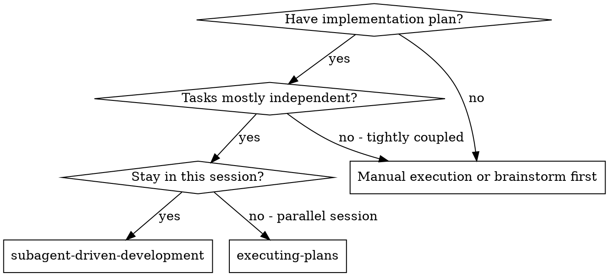
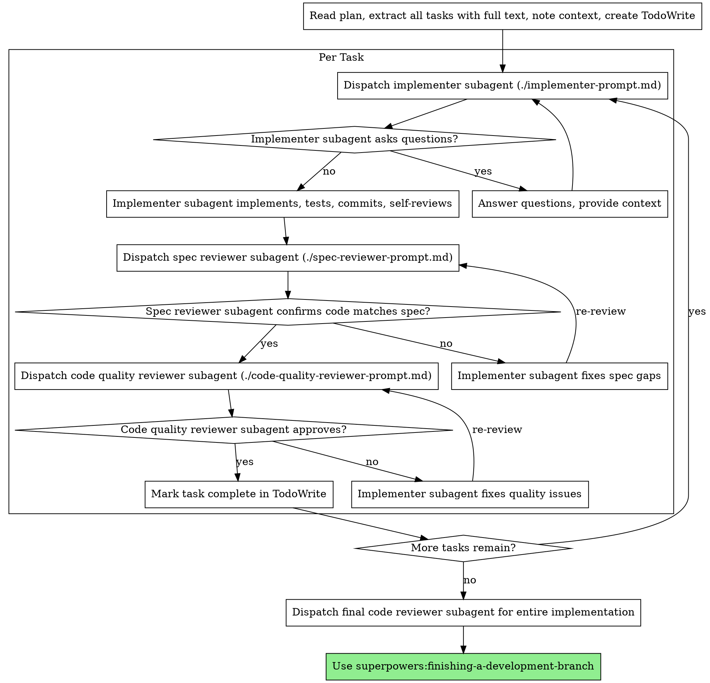

# JSON Reader static generator plan execution

**Session ID:** ses_1c08421c6ffe3wZixDHKcmHHXA
**Created:** 5/19/2026, 12:05:42 PM
**Updated:** 5/19/2026, 1:20:49 PM

---

## User

# Subagent-Driven Development

Execute plan by dispatching fresh subagent per task, with two-stage review after each: spec compliance review first, then code quality review.

**Why subagents:** You delegate tasks to specialized agents with isolated context. By precisely crafting their instructions and context, you ensure they stay focused and succeed at their task. They should never inherit your session's context or history — you construct exactly what they need. This also preserves your own context for coordination work.

**Core principle:** Fresh subagent per task + two-stage review (spec then quality) = high quality, fast iteration

**Continuous execution:** Do not pause to check in with your human partner between tasks. Execute all tasks from the plan without stopping. The only reasons to stop are: BLOCKED status you cannot resolve, ambiguity that genuinely prevents progress, or all tasks complete. "Should I continue?" prompts and progress summaries waste their time — they asked you to execute the plan, so execute it.

## When to Use



**vs. Executing Plans (parallel session):**
- Same session (no context switch)
- Fresh subagent per task (no context pollution)
- Two-stage review after each task: spec compliance first, then code quality
- Faster iteration (no human-in-loop between tasks)

## The Process



## Model Selection

Use the least powerful model that can handle each role to conserve cost and increase speed.

**Mechanical implementation tasks** (isolated functions, clear specs, 1-2 files): use a fast, cheap model. Most implementation tasks are mechanical when the plan is well-specified.

**Integration and judgment tasks** (multi-file coordination, pattern matching, debugging): use a standard model.

**Architecture, design, and review tasks**: use the most capable available model.

**Task complexity signals:**
- Touches 1-2 files with a complete spec → cheap model
- Touches multiple files with integration concerns → standard model
- Requires design judgment or broad codebase understanding → most capable model

## Handling Implementer Status

Implementer subagents report one of four statuses. Handle each appropriately:

**DONE:** Proceed to spec compliance review.

**DONE_WITH_CONCERNS:** The implementer completed the work but flagged doubts. Read the concerns before proceeding. If the concerns are about correctness or scope, address them before review. If they're observations (e.g., "this file is getting large"), note them and proceed to review.

**NEEDS_CONTEXT:** The implementer needs information that wasn't provided. Provide the missing context and re-dispatch.

**BLOCKED:** The implementer cannot complete the task. Assess the blocker:
1. If it's a context problem, provide more context and re-dispatch with the same model
2. If the task requires more reasoning, re-dispatch with a more capable model
3. If the task is too large, break it into smaller pieces
4. If the plan itself is wrong, escalate to the human

**Never** ignore an escalation or force the same model to retry without changes. If the implementer said it's stuck, something needs to change.

## Prompt Templates

- `./implementer-prompt.md` - Dispatch implementer subagent
- `./spec-reviewer-prompt.md` - Dispatch spec compliance reviewer subagent
- `./code-quality-reviewer-prompt.md` - Dispatch code quality reviewer subagent

## Example Workflow

```
You: I'm using Subagent-Driven Development to execute this plan.

[Read plan file once: docs/superpowers/plans/feature-plan.md]
[Extract all 5 tasks with full text and context]
[Create TodoWrite with all tasks]

Task 1: Hook installation script

[Get Task 1 text and context (already extracted)]
[Dispatch implementation subagent with full task text + context]

Implementer: "Before I begin - should the hook be installed at user or system level?"

You: "User level (~/.config/superpowers/hooks/)"

Implementer: "Got it. Implementing now..."
[Later] Implementer:
  - Implemented install-hook command
  - Added tests, 5/5 passing
  - Self-review: Found I missed --force flag, added it
  - Committed

[Dispatch spec compliance reviewer]
Spec reviewer: ✅ Spec compliant - all requirements met, nothing extra

[Get git SHAs, dispatch code quality reviewer]
Code reviewer: Strengths: Good test coverage, clean. Issues: None. Approved.

[Mark Task 1 complete]

Task 2: Recovery modes

[Get Task 2 text and context (already extracted)]
[Dispatch implementation subagent with full task text + context]

Implementer: [No questions, proceeds]
Implementer:
  - Added verify/repair modes
  - 8/8 tests passing
  - Self-review: All good
  - Committed

[Dispatch spec compliance reviewer]
Spec reviewer: ❌ Issues:
  - Missing: Progress reporting (spec says "report every 100 items")
  - Extra: Added --json flag (not requested)

[Implementer fixes issues]
Implementer: Removed --json flag, added progress reporting

[Spec reviewer reviews again]
Spec reviewer: ✅ Spec compliant now

[Dispatch code quality reviewer]
Code reviewer: Strengths: Solid. Issues (Important): Magic number (100)

[Implementer fixes]
Implementer: Extracted PROGRESS_INTERVAL constant

[Code reviewer reviews again]
Code reviewer: ✅ Approved

[Mark Task 2 complete]

...

[After all tasks]
[Dispatch final code-reviewer]
Final reviewer: All requirements met, ready to merge

Done!
```

## Advantages

**vs. Manual execution:**
- Subagents follow TDD naturally
- Fresh context per task (no confusion)
- Parallel-safe (subagents don't interfere)
- Subagent can ask questions (before AND during work)

**vs. Executing Plans:**
- Same session (no handoff)
- Continuous progress (no waiting)
- Review checkpoints automatic

**Efficiency gains:**
- No file reading overhead (controller provides full text)
- Controller curates exactly what context is needed
- Subagent gets complete information upfront
- Questions surfaced before work begins (not after)

**Quality gates:**
- Self-review catches issues before handoff
- Two-stage review: spec compliance, then code quality
- Review loops ensure fixes actually work
- Spec compliance prevents over/under-building
- Code quality ensures implementation is well-built

**Cost:**
- More subagent invocations (implementer + 2 reviewers per task)
- Controller does more prep work (extracting all tasks upfront)
- Review loops add iterations
- But catches issues early (cheaper than debugging later)

## Red Flags

**Never:**
- Start implementation on main/master branch without explicit user consent
- Skip reviews (spec compliance OR code quality)
- Proceed with unfixed issues
- Dispatch multiple implementation subagents in parallel (conflicts)
- Make subagent read plan file (provide full text instead)
- Skip scene-setting context (subagent needs to understand where task fits)
- Ignore subagent questions (answer before letting them proceed)
- Accept "close enough" on spec compliance (spec reviewer found issues = not done)
- Skip review loops (reviewer found issues = implementer fixes = review again)
- Let implementer self-review replace actual review (both are needed)
- **Start code quality review before spec compliance is ✅** (wrong order)
- Move to next task while either review has open issues

**If subagent asks questions:**
- Answer clearly and completely
- Provide additional context if needed
- Don't rush them into implementation

**If reviewer finds issues:**
- Implementer (same subagent) fixes them
- Reviewer reviews again
- Repeat until approved
- Don't skip the re-review

**If subagent fails task:**
- Dispatch fix subagent with specific instructions
- Don't try to fix manually (context pollution)

## Integration

**Required workflow skills:**
- **superpowers:using-git-worktrees** - Ensures isolated workspace (creates one or verifies existing)
- **superpowers:writing-plans** - Creates the plan this skill executes
- **superpowers:requesting-code-review** - Code review template for reviewer subagents
- **superpowers:finishing-a-development-branch** - Complete development after all tasks

**Subagents should use:**
- **superpowers:test-driven-development** - Subagents follow TDD for each task

**Alternative workflow:**
- **superpowers:executing-plans** - Use for parallel session instead of same-session execution


i want to execute this plan @docs\superpowers\plans\2026-05-19-json-reader-static-generator-design.md

---

## Assistant (Build · gpt-5.5 · 13.8s)

**Tool: skill**

**Input:**
```json
{
  "name": "subagent-driven-development"
}
```

**Output:**
```
<skill_content name="subagent-driven-development">
# Skill: subagent-driven-development

# Subagent-Driven Development

Execute plan by dispatching fresh subagent per task, with two-stage review after each: spec compliance review first, then code quality review.

**Why subagents:** You delegate tasks to specialized agents with isolated context. By precisely crafting their instructions and context, you ensure they stay focused and succeed at their task. They should never inherit your session's context or history — you construct exactly what they need. This also preserves your own context for coordination work.

**Core principle:** Fresh subagent per task + two-stage review (spec then quality) = high quality, fast iteration

**Continuous execution:** Do not pause to check in with your human partner between tasks. Execute all tasks from the plan without stopping. The only reasons to stop are: BLOCKED status you cannot resolve, ambiguity that genuinely prevents progress, or all tasks complete. "Should I continue?" prompts and progress summaries waste their time — they asked you to execute the plan, so execute it.

## When to Use


**vs. Executing Plans (parallel session):**
- Same session (no context switch)
- Fresh subagent per task (no context pollution)
- Two-stage review after each task: spec compliance first, then code quality
- Faster iteration (no human-in-loop between tasks)

## The Process


## Model Selection

Use the least powerful model that can handle each role to conserve cost and increase speed.

**Mechanical implementation tasks** (isolated functions, clear specs, 1-2 files): use a fast, cheap model. Most implementation tasks are mechanical when the plan is well-specified.

**Integration and judgment tasks** (multi-file coordination, pattern matching, debugging): use a standard model.

**Architecture, design, and review tasks**: use the most capable available model.

**Task complexity signals:**
- Touches 1-2 files with a complete spec → cheap model
- Touches multiple files with integration concerns → standard model
- Requires design judgment or broad codebase understanding → most capable model

## Handling Implementer Status

Implementer subagents report one of four statuses. Handle each appropriately:

**DONE:** Proceed to spec compliance review.

**DONE_WITH_CONCERNS:** The implementer completed the work but flagged doubts. Read the concerns before proceeding. If the concerns are about correctness or scope, address them before review. If they're observations (e.g., "this file is getting large"), note them and proceed to review.

**NEEDS_CONTEXT:** The implementer needs information that wasn't provided. Provide the missing context and re-dispatch.

**BLOCKED:** The implementer cannot complete the task. Assess the blocker:
1. If it's a context problem, provide more context and re-dispatch with the same model
2. If the task requires more reasoning, re-dispatch with a more capable model
3. If the task is too large, break it into smaller pieces
4. If the plan itself is wrong, escalate to the human

**Never** ignore an escalation or force the same model to retry without changes. If the implementer said it's stuck, something needs to change.

## Prompt Templates

- `./implementer-prompt.md` - Dispatch implementer subagent
- `./spec-reviewer-prompt.md` - Dispatch spec compliance reviewer subagent
- `./code-quality-reviewer-prompt.md` - Dispatch code quality reviewer subagent

## Example Workflow

```
You: I'm using Subagent-Driven Development to execute this plan.

[Read plan file once: docs/superpowers/plans/feature-plan.md]
[Extract all 5 tasks with full text and context]
[Create TodoWrite with all tasks]

Task 1: Hook installation script

[Get Task 1 text and context (already extracted)]
[Dispatch implementation subagent with full task text + context]

Implementer: "Before I begin - should the hook be installed at user or system level?"

You: "User level (~/.config/superpowers/hooks/)"

Implementer: "Got it. Implementing now..."
[Later] Implementer:
  - Implemented install-hook command
  - Added tests, 5/5 passing
  - Self-review: Found I missed --force flag, added it
  - Committed

[Dispatch spec compliance reviewer]
Spec reviewer: ✅ Spec compliant - all requirements met, nothing extra

[Get git SHAs, dispatch code quality reviewer]
Code reviewer: Strengths: Good test coverage, clean. Issues: None. Approved.

[Mark Task 1 complete]

Task 2: Recovery modes

[Get Task 2 text and context (already extracted)]
[Dispatch implementation subagent with full task text + context]

Implementer: [No questions, proceeds]
Implementer:
  - Added verify/repair modes
  - 8/8 tests passing
  - Self-review: All good
  - Committed

[Dispatch spec compliance reviewer]
Spec reviewer: ❌ Issues:
  - Missing: Progress reporting (spec says "report every 100 items")
  - Extra: Added --json flag (not requested)

[Implementer fixes issues]
Implementer: Removed --json flag, added progress reporting

[Spec reviewer reviews again]
Spec reviewer: ✅ Spec compliant now

[Dispatch code quality reviewer]
Code reviewer: Strengths: Solid. Issues (Important): Magic number (100)

[Implementer fixes]
Implementer: Extracted PROGRESS_INTERVAL constant

[Code reviewer reviews again]
Code reviewer: ✅ Approved

[Mark Task 2 complete]

...

[After all tasks]
[Dispatch final code-reviewer]
Final reviewer: All requirements met, ready to merge

Done!
```

## Advantages

**vs. Manual execution:**
- Subagents follow TDD naturally
- Fresh context per task (no confusion)
- Parallel-safe (subagents don't interfere)
- Subagent can ask questions (before AND during work)

**vs. Executing Plans:**
- Same session (no handoff)
- Continuous progress (no waiting)
- Review checkpoints automatic

**Efficiency gains:**
- No file reading overhead (controller provides full text)
- Controller curates exactly what context is needed
- Subagent gets complete information upfront
- Questions surfaced before work begins (not after)

**Quality gates:**
- Self-review catches issues before handoff
- Two-stage review: spec compliance, then code quality
- Review loops ensure fixes actually work
- Spec compliance prevents over/under-building
- Code quality ensures implementation is well-built

**Cost:**
- More subagent invocations (implementer + 2 reviewers per task)
- Controller does more prep work (extracting all tasks upfront)
- Review loops add iterations
- But catches issues early (cheaper than debugging later)

## Red Flags

**Never:**
- Start implementation on main/master branch without explicit user consent
- Skip reviews (spec compliance OR code quality)
- Proceed with unfixed issues
- Dispatch multiple implementation subagents in parallel (conflicts)
- Make subagent read plan file (provide full text instead)
- Skip scene-setting context (subagent needs to understand where task fits)
- Ignore subagent questions (answer before letting them proceed)
- Accept "close enough" on spec compliance (spec reviewer found issues = not done)
- Skip review loops (reviewer found issues = implementer fixes = review again)
- Let implementer self-review replace actual review (both are needed)
- **Start code quality review before spec compliance is ✅** (wrong order)
- Move to next task while either review has open issues

**If subagent asks questions:**
- Answer clearly and completely
- Provide additional context if needed
- Don't rush them into implementation

**If reviewer finds issues:**
- Implementer (same subagent) fixes them
- Reviewer reviews again
- Repeat until approved
- Don't skip the re-review

**If subagent fails task:**
- Dispatch fix subagent with specific instructions
- Don't try to fix manually (context pollution)

## Integration

**Required workflow skills:**
- **superpowers:using-git-worktrees** - Ensures isolated workspace (creates one or verifies existing)
- **superpowers:writing-plans** - Creates the plan this skill executes
- **superpowers:requesting-code-review** - Code review template for reviewer subagents
- **superpowers:finishing-a-development-branch** - Complete development after all tasks

**Subagents should use:**
- **superpowers:test-driven-development** - Subagents follow TDD for each task

**Alternative workflow:**
- **superpowers:executing-plans** - Use for parallel session instead of same-session execution

Base directory for this skill: file:///C:/Users/moame/.cache/opencode/packages/superpowers@git+https_/github.com/obra/superpowers.git/node_modules/superpowers/skills/subagent-driven-development
Relative paths in this skill (e.g., scripts/, reference/) are relative to this base directory.
Note: file list is sampled.

<skill_files>
<file>C:\Users\moame\.cache\opencode\packages\superpowers@git+https_\github.com\obra\superpowers.git\node_modules\superpowers\skills\subagent-driven-development\spec-reviewer-prompt.md</file>
<file>C:\Users\moame\.cache\opencode\packages\superpowers@git+https_\github.com\obra\superpowers.git\node_modules\superpowers\skills\subagent-driven-development\implementer-prompt.md</file>
<file>C:\Users\moame\.cache\opencode\packages\superpowers@git+https_\github.com\obra\superpowers.git\node_modules\superpowers\skills\subagent-driven-development\code-quality-reviewer-prompt.md</file>
</skill_files>
</skill_content>
```

---

## Assistant (Build · gpt-5.5 · 9.8s)

Using Subagent-Driven Development to execute the plan task-by-task with review gates. I’ll first verify the workspace/branch isolation required by the workflow, then dispatch each implementation task with spec and quality review.

**Tool: skill**

**Input:**
```json
{
  "name": "using-git-worktrees"
}
```

**Output:**
```
<skill_content name="using-git-worktrees">
# Skill: using-git-worktrees

# Using Git Worktrees

## Overview

Ensure work happens in an isolated workspace. Prefer your platform's native worktree tools. Fall back to manual git worktrees only when no native tool is available.

**Core principle:** Detect existing isolation first. Then use native tools. Then fall back to git. Never fight the harness.

**Announce at start:** "I'm using the using-git-worktrees skill to set up an isolated workspace."

## Step 0: Detect Existing Isolation

**Before creating anything, check if you are already in an isolated workspace.**

```bash
GIT_DIR=$(cd "$(git rev-parse --git-dir)" 2>/dev/null && pwd -P)
GIT_COMMON=$(cd "$(git rev-parse --git-common-dir)" 2>/dev/null && pwd -P)
BRANCH=$(git branch --show-current)
```

**Submodule guard:** `GIT_DIR != GIT_COMMON` is also true inside git submodules. Before concluding "already in a worktree," verify you are not in a submodule:

```bash
# If this returns a path, you're in a submodule, not a worktree — treat as normal repo
git rev-parse --show-superproject-working-tree 2>/dev/null
```

**If `GIT_DIR != GIT_COMMON` (and not a submodule):** You are already in a linked worktree. Skip to Step 3 (Project Setup). Do NOT create another worktree.

Report with branch state:
- On a branch: "Already in isolated workspace at `<path>` on branch `<name>`."
- Detached HEAD: "Already in isolated workspace at `<path>` (detached HEAD, externally managed). Branch creation needed at finish time."

**If `GIT_DIR == GIT_COMMON` (or in a submodule):** You are in a normal repo checkout.

Has the user already indicated their worktree preference in your instructions? If not, ask for consent before creating a worktree:

> "Would you like me to set up an isolated worktree? It protects your current branch from changes."

Honor any existing declared preference without asking. If the user declines consent, work in place and skip to Step 3.

## Step 1: Create Isolated Workspace

**You have two mechanisms. Try them in this order.**

### 1a. Native Worktree Tools (preferred)

The user has asked for an isolated workspace (Step 0 consent). Do you already have a way to create a worktree? It might be a tool with a name like `EnterWorktree`, `WorktreeCreate`, a `/worktree` command, or a `--worktree` flag. If you do, use it and skip to Step 3.

Native tools handle directory placement, branch creation, and cleanup automatically. Using `git worktree add` when you have a native tool creates phantom state your harness can't see or manage.

Only proceed to Step 1b if you have no native worktree tool available.

### 1b. Git Worktree Fallback

**Only use this if Step 1a does not apply** — you have no native worktree tool available. Create a worktree manually using git.

#### Directory Selection

Follow this priority order. Explicit user preference always beats observed filesystem state.

1. **Check your instructions for a declared worktree directory preference.** If the user has already specified one, use it without asking.

2. **Check for an existing project-local worktree directory:**
   ```bash
   ls -d .worktrees 2>/dev/null     # Preferred (hidden)
   ls -d worktrees 2>/dev/null      # Alternative
   ```
   If found, use it. If both exist, `.worktrees` wins.

3. **Check for an existing global directory:**
   ```bash
   project=$(basename "$(git rev-parse --show-toplevel)")
   ls -d ~/.config/superpowers/worktrees/$project 2>/dev/null
   ```
   If found, use it (backward compatibility with legacy global path).

4. **If there is no other guidance available**, default to `.worktrees/` at the project root.

#### Safety Verification (project-local directories only)

**MUST verify directory is ignored before creating worktree:**

```bash
git check-ignore -q .worktrees 2>/dev/null || git check-ignore -q worktrees 2>/dev/null
```

**If NOT ignored:** Add to .gitignore, commit the change, then proceed.

**Why critical:** Prevents accidentally committing worktree contents to repository.

Global directories (`~/.config/superpowers/worktrees/`) need no verification.

#### Create the Worktree

```bash
project=$(basename "$(git rev-parse --show-toplevel)")

# Determine path based on chosen location
# For project-local: path="$LOCATION/$BRANCH_NAME"
# For global: path="~/.config/superpowers/worktrees/$project/$BRANCH_NAME"

git worktree add "$path" -b "$BRANCH_NAME"
cd "$path"
```

**Sandbox fallback:** If `git worktree add` fails with a permission error (sandbox denial), tell the user the sandbox blocked worktree creation and you're working in the current directory instead. Then run setup and baseline tests in place.

## Step 3: Project Setup

Auto-detect and run appropriate setup:

```bash
# Node.js
if [ -f package.json ]; then npm install; fi

# Rust
if [ -f Cargo.toml ]; then cargo build; fi

# Python
if [ -f requirements.txt ]; then pip install -r requirements.txt; fi
if [ -f pyproject.toml ]; then poetry install; fi

# Go
if [ -f go.mod ]; then go mod download; fi
```

## Step 4: Verify Clean Baseline

Run tests to ensure workspace starts clean:

```bash
# Use project-appropriate command
npm test / cargo test / pytest / go test ./...
```

**If tests fail:** Report failures, ask whether to proceed or investigate.

**If tests pass:** Report ready.

### Report

```
Worktree ready at <full-path>
Tests passing (<N> tests, 0 failures)
Ready to implement <feature-name>
```

## Quick Reference

| Situation | Action |
|-----------|--------|
| Already in linked worktree | Skip creation (Step 0) |
| In a submodule | Treat as normal repo (Step 0 guard) |
| Native worktree tool available | Use it (Step 1a) |
| No native tool | Git worktree fallback (Step 1b) |
| `.worktrees/` exists | Use it (verify ignored) |
| `worktrees/` exists | Use it (verify ignored) |
| Both exist | Use `.worktrees/` |
| Neither exists | Check instruction file, then default `.worktrees/` |
| Global path exists | Use it (backward compat) |
| Directory not ignored | Add to .gitignore + commit |
| Permission error on create | Sandbox fallback, work in place |
| Tests fail during baseline | Report failures + ask |
| No package.json/Cargo.toml | Skip dependency install |

## Common Mistakes

### Fighting the harness

- **Problem:** Using `git worktree add` when the platform already provides isolation
- **Fix:** Step 0 detects existing isolation. Step 1a defers to native tools.

### Skipping detection

- **Problem:** Creating a nested worktree inside an existing one
- **Fix:** Always run Step 0 before creating anything

### Skipping ignore verification

- **Problem:** Worktree contents get tracked, pollute git status
- **Fix:** Always use `git check-ignore` before creating project-local worktree

### Assuming directory location

- **Problem:** Creates inconsistency, violates project conventions
- **Fix:** Follow priority: existing > global legacy > instruction file > default

### Proceeding with failing tests

- **Problem:** Can't distinguish new bugs from pre-existing issues
- **Fix:** Report failures, get explicit permission to proceed

## Red Flags

**Never:**
- Create a worktree when Step 0 detects existing isolation
- Use `git worktree add` when you have a native worktree tool (e.g., `EnterWorktree`). This is the #1 mistake — if you have it, use it.
- Skip Step 1a by jumping straight to Step 1b's git commands
- Create worktree without verifying it's ignored (project-local)
- Skip baseline test verification
- Proceed with failing tests without asking

**Always:**
- Run Step 0 detection first
- Prefer native tools over git fallback
- Follow directory priority: existing > global legacy > instruction file > default
- Verify directory is ignored for project-local
- Auto-detect and run project setup
- Verify clean test baseline

Base directory for this skill: file:///C:/Users/moame/.cache/opencode/packages/superpowers@git+https_/github.com/obra/superpowers.git/node_modules/superpowers/skills/using-git-worktrees
Relative paths in this skill (e.g., scripts/, reference/) are relative to this base directory.
Note: file list is sampled.

<skill_files>

</skill_files>
</skill_content>
```

---

## Assistant (Build · gpt-5.5 · 9.2s)

I'm using the using-git-worktrees skill to set up or verify an isolated workspace before modifying the project.

**Tool: bash**

**Input:**
```json
{
  "command": "$gitDir = (git rev-parse --git-dir); $gitCommon = (git rev-parse --git-common-dir); $branch = (git branch --show-current); $super = (git rev-parse --show-superproject-working-tree 2>$null); \"GIT_DIR=$gitDir\"; \"GIT_COMMON=$gitCommon\"; \"BRANCH=$branch\"; \"SUPERPROJECT=$super\"",
  "description": "Detects git workspace isolation"
}
```

**Output:**
```
GIT_DIR=.git
GIT_COMMON=.git
BRANCH=main
SUPERPROJECT=

```

**Tool: bash**

**Input:**
```json
{
  "command": "git status --short --branch",
  "description": "Shows current branch status"
}
```

**Output:**
```
## main...origin/main
?? docs/superpowers/plans/
?? session-ses_1.md
?? session-ses_2.md

```

---

## Assistant (Build · gpt-5.5 · 52.5s)

The repo is on `main` and not already in a linked worktree. The plan explicitly requires this workflow, but creating an isolated worktree needs your consent before I proceed.

**Tool: question**

**Input:**
```json
{
  "questions": [
    {
      "header": "Worktree",
      "question": "Would you like me to set up an isolated worktree? It protects your current branch from changes.",
      "options": [
        {
          "label": "Create worktree",
          "description": "Create a separate branch/worktree and implement the plan there."
        },
        {
          "label": "Work in place",
          "description": "Implement directly in the current checkout on main."
        }
      ]
    }
  ]
}
```

**Output:**
```
User has answered your questions: "Would you like me to set up an isolated worktree? It protects your current branch from changes."="Create worktree". You can now continue with the user's answers in mind.
```

---

## Assistant (Build · gpt-5.5 · 9.2s)

I’ll create the isolated worktree using the project-local convention if available, verifying it is ignored first so worktree files don’t get committed.

**Tool: glob**

**Input:**
```json
{
  "pattern": ".gitignore"
}
```

**Output:**
```
C:\programing\nodeJs\json-reader-superpowers\.gitignore
```

**Tool: glob**

**Input:**
```json
{
  "pattern": ".worktrees"
}
```

**Output:**
```
No files found
```

**Tool: glob**

**Input:**
```json
{
  "pattern": "worktrees"
}
```

**Output:**
```
No files found
```

---

## Assistant (Build · gpt-5.5 · 9.3s)

**Tool: bash**

**Input:**
```json
{
  "command": "git check-ignore -q .worktrees; if ($LASTEXITCODE -eq 0) { \"ignored\" } else { \"not ignored\" }",
  "description": "Checks worktree directory ignore status"
}
```

**Output:**
```
not ignored

```

---

## Assistant (Build · gpt-5.5 · 7.8s)

`.worktrees` is not ignored, so I’m adding that ignore rule and committing it before creating the worktree, per the worktree safety requirement.

**Tool: read**

**Input:**
```json
{
  "filePath": "C:\\programing\\nodeJs\\json-reader-superpowers\\.gitignore"
}
```

**Output:**
```
<path>C:\programing\nodeJs\json-reader-superpowers\.gitignore</path>
<type>file</type>
<content>
1: node_modules/
2: output/
3: .DS_Store

(End of file - total 3 lines)
</content>
```

---

## Assistant (Build · gpt-5.5 · 3.6s)

**Tool: apply_patch**

**Input:**
```json
{
  "patchText": "*** Begin Patch\n*** Update File: .gitignore\n@@\n node_modules/\n output/\n+.worktrees/\n .DS_Store\n*** End Patch"
}
```

**Output:**
```
Success. Updated the following files:
M .gitignore
```

---

## Assistant (Build · gpt-5.5 · 4.2s)

**Tool: bash**

**Input:**
```json
{
  "command": "git status --short",
  "description": "Shows changes before ignore commit"
}
```

**Output:**
```
 M .gitignore
?? docs/superpowers/plans/
?? session-ses_1.md
?? session-ses_2.md

```

**Tool: bash**

**Input:**
```json
{
  "command": "git diff -- .gitignore",
  "description": "Shows gitignore change diff"
}
```

**Output:**
```
warning: in the working copy of '.gitignore', LF will be replaced by CRLF the next time Git touches it
diff --git a/.gitignore b/.gitignore
index 35bd84a..f975a40 100644
--- a/.gitignore
+++ b/.gitignore
@@ -1,3 +1,4 @@
 node_modules/
 output/
+.worktrees/
 .DS_Store

```

**Tool: bash**

**Input:**
```json
{
  "command": "git log -5 --oneline",
  "description": "Shows recent commit style"
}
```

**Output:**
```
84db8dd revert
c757c06 fix: handle dangerous slug keys in pipeline
ed8add9 test: cover pipeline warning aggregation
edd9b17 feat: build json reader data model
596a164 feat: read json data files

```

---

## Assistant (Build · gpt-5.5 · 5.3s)

Creating the required safety commit now for `.worktrees/` ignore only. Existing untracked plan/session files are unrelated and will be left untouched.

**Tool: bash**

**Input:**
```json
{
  "command": "git add .gitignore; if ($?) { git commit -m \"chore: ignore worktrees\" }",
  "description": "Commits worktree ignore rule",
  "timeout": 120000
}
```

**Output:**
```
warning: in the working copy of '.gitignore', LF will be replaced by CRLF the next time Git touches it
[main 5886185] chore: ignore worktrees
 1 file changed, 1 insertion(+)

```

---

## Assistant (Build · gpt-5.5 · 5.0s)

Now I’m creating a new linked worktree for this plan and will run setup/baseline tests there before implementation.

**Tool: bash**

**Input:**
```json
{
  "command": "Test-Path -LiteralPath \".\"; if ($?) { git worktree add \".worktrees/json-reader-static-generator-design\" -b \"json-reader-static-generator-design\" }",
  "description": "Creates isolated plan worktree",
  "timeout": 120000
}
```

**Output:**
```
True
Preparing worktree (new branch 'json-reader-static-generator-design')
HEAD is now at 5886185 chore: ignore worktrees

```

---

## Assistant (Build · gpt-5.5 · 5.9s)

**Tool: bash**

**Input:**
```json
{
  "command": "npm install",
  "description": "Installs node dependencies",
  "workdir": "C:\\programing\\nodeJs\\json-reader-superpowers\\.worktrees\\json-reader-static-generator-design",
  "timeout": 120000
}
```

**Output:**
```

up to date, audited 1 package in 675ms

found 0 vulnerabilities

```

**Tool: bash**

**Input:**
```json
{
  "command": "git status --short --branch",
  "description": "Shows worktree branch status",
  "workdir": "C:\\programing\\nodeJs\\json-reader-superpowers\\.worktrees\\json-reader-static-generator-design"
}
```

**Output:**
```
## json-reader-static-generator-design

```

---

## Assistant (Build · gpt-5.5 · 8.8s)

**Tool: bash**

**Input:**
```json
{
  "command": "npm test",
  "description": "Runs baseline test suite",
  "workdir": "C:\\programing\\nodeJs\\json-reader-superpowers\\.worktrees\\json-reader-static-generator-design",
  "timeout": 120000
}
```

**Output:**
```

> json-reader-superpowers@1.0.0 test
> node --test

TAP version 13
1..0
# tests 0
# suites 0
# pass 0
# fail 0
# cancelled 0
# skipped 0
# todo 0
# duration_ms 15.734

```

---

## Assistant (Build · gpt-5.5 · 6.3s)

Worktree ready at `.worktrees/json-reader-static-generator-design`; baseline `npm test` passes with 0 tests. I’m creating the task tracker and starting Task 1.

**Tool: todowrite**

**Input:**
```json
{
  "todos": [
    {
      "content": "Task 1: Package Scripts",
      "status": "in_progress",
      "priority": "high"
    },
    {
      "content": "Task 2: Minimal Dashboard Renderer",
      "status": "pending",
      "priority": "high"
    },
    {
      "content": "Task 3: Generator Orchestration",
      "status": "pending",
      "priority": "high"
    },
    {
      "content": "Task 4: CLI Entrypoint And Source Stylesheet",
      "status": "pending",
      "priority": "high"
    },
    {
      "content": "Final review and branch finishing",
      "status": "pending",
      "priority": "medium"
    }
  ]
}
```

**Output:**
```
[
  {
    "content": "Task 1: Package Scripts",
    "status": "in_progress",
    "priority": "high"
  },
  {
    "content": "Task 2: Minimal Dashboard Renderer",
    "status": "pending",
    "priority": "high"
  },
  {
    "content": "Task 3: Generator Orchestration",
    "status": "pending",
    "priority": "high"
  },
  {
    "content": "Task 4: CLI Entrypoint And Source Stylesheet",
    "status": "pending",
    "priority": "high"
  },
  {
    "content": "Final review and branch finishing",
    "status": "pending",
    "priority": "medium"
  }
]
```

---

## Assistant (Build · gpt-5.5 · 125.7s)

Dispatching a fresh implementer for Task 1 with the exact package script requirements and commit expectation.

**Tool: task**

**Input:**
```json
{
  "description": "Implement package scripts",
  "subagent_type": "general",
  "prompt": "You are implementing Task 1 of docs/superpowers/plans/2026-05-19-json-reader-static-generator-design.md in the worktree C:\\programing\\nodeJs\\json-reader-superpowers\\.worktrees\\json-reader-static-generator-design.\n\nUse superpowers:test-driven-development if available/applicable. Do not modify files outside this worktree. Do not touch unrelated files.\n\nPlan context:\nGoal: Build the initial plain Node.js static generator scaffold that can produce an offline output/dashboard.html and copied stylesheet.\nArchitecture: CommonJS modules under src/, src/index.js CLI entrypoint, src/generator.js orchestration. This task only updates package scripts.\nTech stack: Node.js built-in fs/path/node:test, CommonJS, static HTML/CSS.\n\nTask 1: Package Scripts\nFiles:\n- Modify package.json\n\nSteps:\n1. Replace the scripts block in package.json with:\n```json\n\"scripts\": {\n  \"build\": \"node src/index.js\",\n  \"test\": \"node --test\"\n}\n```\n2. Run tests before implementation: npm test. Expected PASS with 0 tests or equivalent node:test output because no tests exist yet.\n3. Commit:\n```bash\ngit add package.json\ngit commit -m \"chore: add build script\"\n```\n\nNotes:\n- The baseline npm test has already passed in this worktree with 0 tests, but still follow the task steps as appropriate.\n- Make the smallest correct change.\n- Return one final message with status exactly one of DONE, DONE_WITH_CONCERNS, NEEDS_CONTEXT, or BLOCKED, followed by concise details: files changed, tests run and results, commit hash if committed, and self-review notes."
}
```

**Output:**
```
task_id: ses_1c081ad8bffeCOlSJGBtgnvqlL (for resuming to continue this task if needed)

<task_result>
DONE_WITH_CONCERNS

Files changed: `package.json`

Tests run: `npm test` passed, `0` tests.

Commit: `31d587f` (`chore: add build script`)

Self-review: only added the requested `build` script. Concern: untracked `package-lock.json` exists and was left untouched.
</task_result>
```

---

## Assistant (Build · gpt-5.5 · 6.7s)

Task 1 implementation is complete with one observation: `npm install` left an untracked `package-lock.json`, which is unrelated to the task and was not committed. I’m proceeding to spec compliance review for Task 1.

**Tool: skill**

**Input:**
```json
{
  "name": "requesting-code-review"
}
```

**Output:**
```
<skill_content name="requesting-code-review">
# Skill: requesting-code-review

# Requesting Code Review

Dispatch a code reviewer subagent to catch issues before they cascade. The reviewer gets precisely crafted context for evaluation — never your session's history. This keeps the reviewer focused on the work product, not your thought process, and preserves your own context for continued work.

**Core principle:** Review early, review often.

## When to Request Review

**Mandatory:**
- After each task in subagent-driven development
- After completing major feature
- Before merge to main

**Optional but valuable:**
- When stuck (fresh perspective)
- Before refactoring (baseline check)
- After fixing complex bug

## How to Request

**1. Get git SHAs:**
```bash
BASE_SHA=$(git rev-parse HEAD~1)  # or origin/main
HEAD_SHA=$(git rev-parse HEAD)
```

**2. Dispatch code reviewer subagent:**

Use Task tool with `general-purpose` type, fill template at `code-reviewer.md`

**Placeholders:**
- `{DESCRIPTION}` - Brief summary of what you built
- `{PLAN_OR_REQUIREMENTS}` - What it should do
- `{BASE_SHA}` - Starting commit
- `{HEAD_SHA}` - Ending commit

**3. Act on feedback:**
- Fix Critical issues immediately
- Fix Important issues before proceeding
- Note Minor issues for later
- Push back if reviewer is wrong (with reasoning)

## Example

```
[Just completed Task 2: Add verification function]

You: Let me request code review before proceeding.

BASE_SHA=$(git log --oneline | grep "Task 1" | head -1 | awk '{print $1}')
HEAD_SHA=$(git rev-parse HEAD)

[Dispatch code reviewer subagent]
  DESCRIPTION: Added verifyIndex() and repairIndex() with 4 issue types
  PLAN_OR_REQUIREMENTS: Task 2 from docs/superpowers/plans/deployment-plan.md
  BASE_SHA: a7981ec
  HEAD_SHA: 3df7661

[Subagent returns]:
  Strengths: Clean architecture, real tests
  Issues:
    Important: Missing progress indicators
    Minor: Magic number (100) for reporting interval
  Assessment: Ready to proceed

You: [Fix progress indicators]
[Continue to Task 3]
```

## Integration with Workflows

**Subagent-Driven Development:**
- Review after EACH task
- Catch issues before they compound
- Fix before moving to next task

**Executing Plans:**
- Review after each task or at natural checkpoints
- Get feedback, apply, continue

**Ad-Hoc Development:**
- Review before merge
- Review when stuck

## Red Flags

**Never:**
- Skip review because "it's simple"
- Ignore Critical issues
- Proceed with unfixed Important issues
- Argue with valid technical feedback

**If reviewer wrong:**
- Push back with technical reasoning
- Show code/tests that prove it works
- Request clarification

See template at: requesting-code-review/code-reviewer.md

Base directory for this skill: file:///C:/Users/moame/.cache/opencode/packages/superpowers@git+https_/github.com/obra/superpowers.git/node_modules/superpowers/skills/requesting-code-review
Relative paths in this skill (e.g., scripts/, reference/) are relative to this base directory.
Note: file list is sampled.

<skill_files>
<file>C:\Users\moame\.cache\opencode\packages\superpowers@git+https_\github.com\obra\superpowers.git\node_modules\superpowers\skills\requesting-code-review\code-reviewer.md</file>
</skill_files>
</skill_content>
```

---

## Assistant (Build · gpt-5.5 · 6.9s)

Using requesting-code-review to run the required review gates after Task 1.

**Tool: bash**

**Input:**
```json
{
  "command": "git rev-parse HEAD~1",
  "description": "Gets task base commit",
  "workdir": "C:\\programing\\nodeJs\\json-reader-superpowers\\.worktrees\\json-reader-static-generator-design"
}
```

**Output:**
```
5886185bc147d3c1c92d60727a60ca35fdbdb431

```

**Tool: bash**

**Input:**
```json
{
  "command": "git rev-parse HEAD",
  "description": "Gets task head commit",
  "workdir": "C:\\programing\\nodeJs\\json-reader-superpowers\\.worktrees\\json-reader-static-generator-design"
}
```

**Output:**
```
31d587f5bdebeb331338196fb5f36d0063f75005

```

**Tool: bash**

**Input:**
```json
{
  "command": "git status --short",
  "description": "Shows post task status",
  "workdir": "C:\\programing\\nodeJs\\json-reader-superpowers\\.worktrees\\json-reader-static-generator-design"
}
```

**Output:**
```
?? package-lock.json

```

---

## Assistant (Build · gpt-5.5 · 57.0s)

**Tool: task**

**Input:**
```json
{
  "description": "Review task spec",
  "subagent_type": "general",
  "prompt": "You are the spec compliance reviewer for Task 1 in worktree C:\\programing\\nodeJs\\json-reader-superpowers\\.worktrees\\json-reader-static-generator-design.\n\nDo not modify files. Review only changes from BASE_SHA 5886185bc147d3c1c92d60727a60ca35fdbdb431 to HEAD_SHA 31d587f5bdebeb331338196fb5f36d0063f75005.\n\nTask 1 requirements:\n- Modify package.json only.\n- Replace scripts block with exactly:\n```json\n\"scripts\": {\n  \"build\": \"node src/index.js\",\n  \"test\": \"node --test\"\n}\n```\n- Run npm test before implementation; expected pass with 0 tests.\n- Commit message: chore: add build script.\n\nEvaluate whether implementation matches spec exactly and did not add extra behavior/files. Return final message with:\n- APPROVED or CHANGES_REQUESTED\n- Findings with file/line references if any\n- Evidence checked (diff/tests/commit)\n"
}
```

**Output:**
```
task_id: ses_1c07f9227ffe7t4TQiH50gdW60 (for resuming to continue this task if needed)

<task_result>
APPROVED

Findings: none.

Evidence checked:
- Diff `5886185bc147d3c1c92d60727a60ca35fdbdb431..31d587f5bdebeb331338196fb5f36d0063f75005`: only `package.json` changed.
- `package.json:6-9` scripts block exactly matches required `build` and `test` scripts.
- Commit checked: `31d587f5bdebeb331338196fb5f36d0063f75005 chore: add build script`.
- `npm test` output: `# tests 0`, `# fail 0`.
</task_result>
```

---

## Assistant (Build · gpt-5.5 · 77.2s)

Task 1 passed spec review. I’m running the code quality review next before moving on.

**Tool: task**

**Input:**
```json
{
  "description": "Review task quality",
  "subagent_type": "general",
  "prompt": "You are the code quality reviewer for Task 1 in worktree C:\\programing\\nodeJs\\json-reader-superpowers\\.worktrees\\json-reader-static-generator-design.\n\nDo not modify files. Review only changes from BASE_SHA 5886185bc147d3c1c92d60727a60ca35fdbdb431 to HEAD_SHA 31d587f5bdebeb331338196fb5f36d0063f75005.\n\nDescription: Added npm build script for JSON reader static generator scaffold.\nRequirements: package.json scripts should include build: node src/index.js and test: node --test, with no unrelated modifications.\n\nFocus on bugs, risks, regressions, maintainability, and test/process concerns. Return final message with:\n- APPROVED or CHANGES_REQUESTED\n- Findings ordered by severity with file/line references\n- Residual risks/testing gaps\n"
}
```

**Output:**
```
task_id: ses_1c07e439dffeJ3fXCCnmD3r2v7 (for resuming to continue this task if needed)

<task_result>
APPROVED

Findings:
None.

Residual risks/testing gaps:
- Did not run `npm test`; review was limited to the requested diff inspection.
- Verified diff only changes `package.json`, adding `"build": "node src/index.js"` while preserving `"test": "node --test"` at `package.json:7-8`.
- No unrelated modifications found in the reviewed range.
</task_result>
```

---

## Assistant (Build · gpt-5.5 · 6.6s)

Task 1 is complete after both reviews. Starting Task 2: renderer test first, then implementation, tests, commit, and review gates.

**Tool: todowrite**

**Input:**
```json
{
  "todos": [
    {
      "content": "Task 1: Package Scripts",
      "status": "completed",
      "priority": "high"
    },
    {
      "content": "Task 2: Minimal Dashboard Renderer",
      "status": "in_progress",
      "priority": "high"
    },
    {
      "content": "Task 3: Generator Orchestration",
      "status": "pending",
      "priority": "high"
    },
    {
      "content": "Task 4: CLI Entrypoint And Source Stylesheet",
      "status": "pending",
      "priority": "high"
    },
    {
      "content": "Final review and branch finishing",
      "status": "pending",
      "priority": "medium"
    }
  ]
}
```

**Output:**
```
[
  {
    "content": "Task 1: Package Scripts",
    "status": "completed",
    "priority": "high"
  },
  {
    "content": "Task 2: Minimal Dashboard Renderer",
    "status": "in_progress",
    "priority": "high"
  },
  {
    "content": "Task 3: Generator Orchestration",
    "status": "pending",
    "priority": "high"
  },
  {
    "content": "Task 4: CLI Entrypoint And Source Stylesheet",
    "status": "pending",
    "priority": "high"
  },
  {
    "content": "Final review and branch finishing",
    "status": "pending",
    "priority": "medium"
  }
]
```

---

## Assistant (Build · gpt-5.5 · 261.5s)

**Tool: task**

**Input:**
```json
{
  "description": "Implement renderer",
  "subagent_type": "general",
  "prompt": "You are implementing Task 2 of docs/superpowers/plans/2026-05-19-json-reader-static-generator-design.md in the worktree C:\\programing\\nodeJs\\json-reader-superpowers\\.worktrees\\json-reader-static-generator-design.\n\nUse superpowers:test-driven-development if available/applicable. Do not modify files outside this worktree. Do not touch unrelated files. Note an untracked package-lock.json may exist from npm install; leave it untouched unless necessary.\n\nPlan context:\nGoal: Build the initial plain Node.js static generator scaffold that can produce an offline output/dashboard.html and copied stylesheet.\nArchitecture: CommonJS modules under src/, src/index.js CLI entrypoint, src/generator.js orchestration.\nTech stack: Node.js built-in fs/path/node:test, CommonJS modules, static HTML/CSS.\n\nTask 2: Minimal Dashboard Renderer\nFiles:\n- Create src/html.js\n- Test test/generator.test.js\n\nSteps:\n1. Write the failing renderer test by creating test/generator.test.js exactly with:\n```js\nconst assert = require('node:assert/strict');\nconst test = require('node:test');\n\nconst { renderDashboard } = require('../src/html');\n\ntest('renderDashboard returns an offline dashboard document', () => {\n  const html = renderDashboard({\n    stats: {\n      filesRead: 0,\n      validObjects: 0,\n      publishedObjects: 0,\n      draftObjects: 0,\n      uniquePublishedSlugs: 0,\n      warningCount: 0,\n    },\n    warnings: [],\n    slugGroups: new Map(),\n    fileSummaries: [],\n  });\n\n  assert.match(html, /<!doctype html>/i);\n  assert.match(html, /<title>JSON Reader Dashboard<\\/title>/);\n  assert.match(html, /href=\"assets\\/style.css\"/);\n  assert.match(html, /JSON Reader Dashboard/);\n  assert.match(html, /0 JSON files read/);\n});\n```\n2. Run npm test. Expected FAIL with Cannot find module '../src/html'.\n3. Implement src/html.js exactly as specified:\n```js\nfunction escapeHtml(value) {\n  return String(value)\n    .replaceAll('&', '&amp;')\n    .replaceAll('<', '&lt;')\n    .replaceAll('>', '&gt;')\n    .replaceAll('\"', '&quot;')\n    .replaceAll(\"'\", '&#39;');\n}\n\nfunction renderDashboard({ stats, warnings, slugGroups, fileSummaries }) {\n  const slugCards = Array.from(slugGroups.entries())\n    .map(([slug, objects]) => `<a class=\"slug-card\" href=\"${escapeHtml(slug)}.html\"><strong>${escapeHtml(slug)}</strong><span>${objects.length} published objects</span></a>`)\n    .join('');\n\n  const warningItems = warnings\n    .map((warning) => `<li>${escapeHtml(warning)}</li>`)\n    .join('');\n\n  const fileRows = fileSummaries\n    .map((file) => `<tr><td>${escapeHtml(file.fileName)}</td><td>${file.validObjects}</td><td>${file.publishedObjects}</td><td>${file.draftObjects}</td><td>${escapeHtml(file.slugSummary)}</td></tr>`)\n    .join('');\n\n  return `<!doctype html>\n<html lang=\"en\">\n<head>\n  <meta charset=\"utf-8\">\n  <meta name=\"viewport\" content=\"width=device-width, initial-scale=1\">\n  <title>JSON Reader Dashboard</title>\n  <link rel=\"stylesheet\" href=\"assets/style.css\">\n</head>\n<body>\n  <main class=\"page-shell\">\n    <header class=\"hero\">\n      <p class=\"eyebrow\">Static JSON Reader</p>\n      <h1>JSON Reader Dashboard</h1>\n    </header>\n    <section class=\"stats-grid\" aria-label=\"Build statistics\">\n      <article class=\"stat-card\"><strong>${stats.filesRead}</strong><span>${stats.filesRead} JSON files read</span></article>\n      <article class=\"stat-card\"><strong>${stats.validObjects}</strong><span>valid objects</span></article>\n      <article class=\"stat-card\"><strong>${stats.publishedObjects}</strong><span>published objects</span></article>\n      <article class=\"stat-card\"><strong>${stats.draftObjects}</strong><span>draft objects</span></article>\n      <article class=\"stat-card\"><strong>${stats.uniquePublishedSlugs}</strong><span>unique published slugs</span></article>\n      <article class=\"stat-card\"><strong>${stats.warningCount}</strong><span>warnings</span></article>\n    </section>\n    <section class=\"panel\">\n      <h2>Published slugs</h2>\n      <div class=\"slug-grid\">${slugCards || '<p>No published slugs found.</p>'}</div>\n    </section>\n    <section class=\"panel\">\n      <h2>Warnings</h2>\n      <ul>${warningItems || '<li>No warnings.</li>'}</ul>\n    </section>\n    <section class=\"panel\">\n      <h2>JSON files</h2>\n      <table>\n        <thead><tr><th>File name</th><th>Valid objects</th><th>Published</th><th>Drafts</th><th>Published slug counts</th></tr></thead>\n        <tbody>${fileRows || '<tr><td colspan=\"5\">No JSON files read.</td></tr>'}</tbody>\n      </table>\n    </section>\n  </main>\n</body>\n</html>`;\n}\n\nmodule.exports = { escapeHtml, renderDashboard };\n```\n4. Run npm test. Expected PASS for renderDashboard test.\n5. Commit:\n```bash\ngit add src/html.js test/generator.test.js\ngit commit -m \"feat: add dashboard renderer\"\n```\n\nReturn one final message with status exactly one of DONE, DONE_WITH_CONCERNS, NEEDS_CONTEXT, or BLOCKED, followed by concise details: files changed, failing test evidence, passing tests, commit hash, and self-review notes."
}
```

**Output:**
```
task_id: ses_1c07d4452ffeNkYDEWPLKo8tsI (for resuming to continue this task if needed)

<task_result>
DONE

Files changed: `src/html.js`, `test/generator.test.js`

Failing test evidence: `npm test` failed with `Cannot find module '../src/html'` before implementation.

Passing tests: `npm test` passes, 1 test passing.

Commit hash: `503ac10`

Self-review notes: Implemented requested renderer and test only. Left untracked `package-lock.json` untouched.
</task_result>
```

---

## Assistant (Build · gpt-5.5 · 37.2s)

Task 2 implementation completed and committed. I’m running spec compliance review for the renderer now.

**Tool: bash**

**Input:**
```json
{
  "command": "git rev-parse HEAD~1",
  "description": "Gets task base commit",
  "workdir": "C:\\programing\\nodeJs\\json-reader-superpowers\\.worktrees\\json-reader-static-generator-design"
}
```

**Output:**
```
31d587f5bdebeb331338196fb5f36d0063f75005

```

**Tool: bash**

**Input:**
```json
{
  "command": "git rev-parse HEAD",
  "description": "Gets task head commit",
  "workdir": "C:\\programing\\nodeJs\\json-reader-superpowers\\.worktrees\\json-reader-static-generator-design"
}
```

**Output:**
```
503ac103a992099c576a6bad678f4675775a20e1

```

**Tool: bash**

**Input:**
```json
{
  "command": "git status --short",
  "description": "Shows post task status",
  "workdir": "C:\\programing\\nodeJs\\json-reader-superpowers\\.worktrees\\json-reader-static-generator-design"
}
```

**Output:**
```
?? package-lock.json

```

---

## Assistant (Build · gpt-5.5 · 84.7s)

**Tool: task**

**Input:**
```json
{
  "description": "Review renderer spec",
  "subagent_type": "general",
  "prompt": "You are the spec compliance reviewer for Task 2 in worktree C:\\programing\\nodeJs\\json-reader-superpowers\\.worktrees\\json-reader-static-generator-design.\n\nDo not modify files. Review only changes from BASE_SHA 31d587f5bdebeb331338196fb5f36d0063f75005 to HEAD_SHA 503ac103a992099c576a6bad678f4675775a20e1.\n\nTask 2 requirements:\n- Create src/html.js.\n- Create test/generator.test.js with renderer test matching the plan.\n- Test should initially fail with Cannot find module '../src/html' before implementation.\n- Implement escapeHtml and renderDashboard as specified in the plan.\n- npm test should pass for renderDashboard returns an offline dashboard document.\n- Commit message: feat: add dashboard renderer.\n\nKey rendered HTML expectations include doctype, title JSON Reader Dashboard, stylesheet href assets/style.css, dashboard heading, 0 JSON files read, stats cards, panels for Published slugs, Warnings, JSON files, fallback empty states, and exports { escapeHtml, renderDashboard }.\n\nEvaluate whether implementation matches spec exactly and did not add extra behavior/files. Return final message with:\n- APPROVED or CHANGES_REQUESTED\n- Findings with file/line references if any\n- Evidence checked (diff/tests/commit)\n"
}
```

**Output:**
```
task_id: ses_1c078dd7cffeJpQO7EeaO6wrg0 (for resuming to continue this task if needed)

<task_result>
APPROVED

Findings: none.

Evidence checked:
- Diff range `31d587f5..503ac10`: only added `src/html.js` and `test/generator.test.js`.
- Commit: `503ac10 feat: add dashboard renderer`.
- `src/html.js` exports `{ escapeHtml, renderDashboard }` and renders the required offline dashboard elements, panels, stats, and empty states.
- `npm test` passed: 1 test, 1 pass, 0 failures.

Note: the “test initially failed before implementation” requirement is not directly verifiable from the final single-commit range.
</task_result>
```

---

## Assistant (Build · gpt-5.5 · 110.7s)

Task 2 passed spec review. I’m running code quality review before Task 3.

**Tool: task**

**Input:**
```json
{
  "description": "Review renderer quality",
  "subagent_type": "general",
  "prompt": "You are the code quality reviewer for Task 2 in worktree C:\\programing\\nodeJs\\json-reader-superpowers\\.worktrees\\json-reader-static-generator-design.\n\nDo not modify files. Review only changes from BASE_SHA 31d587f5bdebeb331338196fb5f36d0063f75005 to HEAD_SHA 503ac103a992099c576a6bad678f4675775a20e1.\n\nDescription: Added src/html.js dashboard renderer and node:test coverage.\nRequirements: CommonJS HTML helper module with escapeHtml and renderDashboard; dashboard must be offline and link assets/style.css; test should cover minimal output.\n\nFocus on bugs, security escaping, regressions, maintainability, and test gaps. Return final message with:\n- APPROVED or CHANGES_REQUESTED\n- Findings ordered by severity with file/line references\n- Residual risks/testing gaps\n"
}
```

**Output:**
```
task_id: ses_1c0778a50ffeLBwVzOhESLlJtT (for resuming to continue this task if needed)

<task_result>
APPROVED

**Findings**
None.

**Residual Risks/Testing Gaps**
- `escapeHtml` is exported but not directly tested.
- `renderDashboard` lacks coverage for escaping warnings, file names, slug text, and slug link attributes.
- Slug URLs are HTML-escaped but not URL-encoded; if future validation allows `?`, `#`, spaces, or path separators in slugs, links may not match generated filenames.

Verification: `npm test` passes.
</task_result>
```

---

## Assistant (Build · gpt-5.5 · 8.9s)

Task 2 is complete after both reviews. Starting Task 3: generator orchestration and build output test.

**Tool: todowrite**

**Input:**
```json
{
  "todos": [
    {
      "content": "Task 1: Package Scripts",
      "status": "completed",
      "priority": "high"
    },
    {
      "content": "Task 2: Minimal Dashboard Renderer",
      "status": "completed",
      "priority": "high"
    },
    {
      "content": "Task 3: Generator Orchestration",
      "status": "in_progress",
      "priority": "high"
    },
    {
      "content": "Task 4: CLI Entrypoint And Source Stylesheet",
      "status": "pending",
      "priority": "high"
    },
    {
      "content": "Final review and branch finishing",
      "status": "pending",
      "priority": "medium"
    }
  ]
}
```

**Output:**
```
[
  {
    "content": "Task 1: Package Scripts",
    "status": "completed",
    "priority": "high"
  },
  {
    "content": "Task 2: Minimal Dashboard Renderer",
    "status": "completed",
    "priority": "high"
  },
  {
    "content": "Task 3: Generator Orchestration",
    "status": "in_progress",
    "priority": "high"
  },
  {
    "content": "Task 4: CLI Entrypoint And Source Stylesheet",
    "status": "pending",
    "priority": "high"
  },
  {
    "content": "Final review and branch finishing",
    "status": "pending",
    "priority": "medium"
  }
]
```

---

## Assistant (Build · gpt-5.5 · 112.4s)

**Tool: task**

**Input:**
```json
{
  "description": "Implement generator",
  "subagent_type": "general",
  "prompt": "You are implementing Task 3 of docs/superpowers/plans/2026-05-19-json-reader-static-generator-design.md in the worktree C:\\programing\\nodeJs\\json-reader-superpowers\\.worktrees\\json-reader-static-generator-design.\n\nUse superpowers:test-driven-development if available/applicable. Do not modify files outside this worktree. Do not touch unrelated files. Leave untracked package-lock.json untouched unless necessary.\n\nPlan context:\nGoal: Build the initial plain Node.js static generator scaffold that can produce an offline output/dashboard.html and copied stylesheet.\nArchitecture: CommonJS modules under src/, src/index.js CLI entrypoint, src/generator.js orchestration.\nTech stack: Node.js built-in fs/path/node:test, CommonJS modules, static HTML/CSS.\n\nTask 3: Generator Orchestration\nFiles:\n- Create src/generator.js\n- Modify test/generator.test.js\n\nSteps:\n1. Add failing build test by appending to test/generator.test.js:\n```js\nconst fs = require('node:fs/promises');\nconst os = require('node:os');\nconst path = require('node:path');\n\nconst { buildSite } = require('../src/generator');\n\ntest('buildSite writes dashboard and stylesheet', async () => {\n  const fixtureRoot = await fs.mkdtemp(path.join(os.tmpdir(), 'json-reader-'));\n  const outputDir = path.join(fixtureRoot, 'output');\n  const assetSourcePath = path.join(fixtureRoot, 'src', 'assets', 'style.css');\n  await fs.mkdir(path.dirname(assetSourcePath), { recursive: true });\n  await fs.writeFile(assetSourcePath, 'body { color: #111; }');\n\n  const result = await buildSite({\n    dataDir: path.join(fixtureRoot, 'data'),\n    outputDir,\n    assetSourcePath,\n  });\n\n  const dashboard = await fs.readFile(path.join(outputDir, 'dashboard.html'), 'utf8');\n  const stylesheet = await fs.readFile(path.join(outputDir, 'assets', 'style.css'), 'utf8');\n\n  assert.equal(result.stats.filesRead, 0);\n  assert.match(dashboard, /JSON Reader Dashboard/);\n  assert.equal(stylesheet, 'body { color: #111; }');\n});\n```\n2. Run npm test. Expected FAIL with Cannot find module '../src/generator'.\n3. Implement src/generator.js exactly as specified:\n```js\nconst fs = require('node:fs/promises');\nconst path = require('node:path');\n\nconst { renderDashboard } = require('./html');\n\nasync function cleanOutput(outputDir) {\n  await fs.rm(outputDir, { recursive: true, force: true });\n  await fs.mkdir(path.join(outputDir, 'assets'), { recursive: true });\n}\n\nasync function copyStylesheet(assetSourcePath, outputDir) {\n  await fs.copyFile(assetSourcePath, path.join(outputDir, 'assets', 'style.css'));\n}\n\nfunction createEmptyBuildState() {\n  return {\n    stats: {\n      filesRead: 0,\n      validObjects: 0,\n      publishedObjects: 0,\n      draftObjects: 0,\n      uniquePublishedSlugs: 0,\n      warningCount: 0,\n    },\n    warnings: [],\n    slugGroups: new Map(),\n    fileSummaries: [],\n  };\n}\n\nasync function buildSite({\n  dataDir = path.join(process.cwd(), 'data'),\n  outputDir = path.join(process.cwd(), 'output'),\n  assetSourcePath = path.join(process.cwd(), 'src', 'assets', 'style.css'),\n} = {}) {\n  await cleanOutput(outputDir);\n  await copyStylesheet(assetSourcePath, outputDir);\n\n  const buildState = createEmptyBuildState();\n  const dashboardHtml = renderDashboard(buildState);\n  await fs.writeFile(path.join(outputDir, 'dashboard.html'), dashboardHtml);\n\n  return buildState;\n}\n\nmodule.exports = { buildSite, cleanOutput, copyStylesheet, createEmptyBuildState };\n```\n4. Run npm test. Expected PASS for both dashboard renderer and build output tests.\n5. Commit:\n```bash\ngit add src/generator.js test/generator.test.js\ngit commit -m \"feat: add generator orchestration\"\n```\n\nReturn one final message with status exactly one of DONE, DONE_WITH_CONCERNS, NEEDS_CONTEXT, or BLOCKED, followed by concise details: files changed, failing test evidence, passing tests, commit hash, and self-review notes."
}
```

**Output:**
```
task_id: ses_1c075a009ffecm8YtzU9Z6Sc5K (for resuming to continue this task if needed)

<task_result>
DONE

Files changed: `src/generator.js`, `test/generator.test.js`

Failing test evidence: `npm test` failed with `Cannot find module '../src/generator'`

Passing tests: post-commit `npm test` shows `2` tests, `2` pass, `0` fail

Commit hash: `23d0068`

Self-review notes: implemented Task 3 as specified, committed only task files, left untracked `package-lock.json` untouched.
</task_result>
```

---

## Assistant (Build · gpt-5.5 · 186.1s)

Task 3 implementation completed and committed. I’m running spec compliance review for generator orchestration.

**Tool: bash**

**Input:**
```json
{
  "command": "git rev-parse HEAD~1",
  "description": "Gets task base commit",
  "workdir": "C:\\programing\\nodeJs\\json-reader-superpowers\\.worktrees\\json-reader-static-generator-design"
}
```

**Output:**
```
503ac103a992099c576a6bad678f4675775a20e1

```

**Tool: bash**

**Input:**
```json
{
  "command": "git rev-parse HEAD",
  "description": "Gets task head commit",
  "workdir": "C:\\programing\\nodeJs\\json-reader-superpowers\\.worktrees\\json-reader-static-generator-design"
}
```

**Output:**
```
23d0068d7e9cc733cf9d551150afad6d68e8cac9

```

**Tool: bash**

**Input:**
```json
{
  "command": "git status --short",
  "description": "Shows post task status",
  "workdir": "C:\\programing\\nodeJs\\json-reader-superpowers\\.worktrees\\json-reader-static-generator-design"
}
```

**Output:**
```
?? package-lock.json

```

---

## Assistant (Build · gpt-5.5 · 69.1s)

**Tool: task**

**Input:**
```json
{
  "description": "Review generator spec",
  "subagent_type": "general",
  "prompt": "You are the spec compliance reviewer for Task 3 in worktree C:\\programing\\nodeJs\\json-reader-superpowers\\.worktrees\\json-reader-static-generator-design.\n\nDo not modify files. Review only changes from BASE_SHA 503ac103a992099c576a6bad678f4675775a20e1 to HEAD_SHA 23d0068d7e9cc733cf9d551150afad6d68e8cac9.\n\nTask 3 requirements:\n- Modify test/generator.test.js by appending the buildSite test from the plan.\n- Create src/generator.js with fs/path, renderDashboard import, cleanOutput, copyStylesheet, createEmptyBuildState, buildSite, and exports exactly as specified.\n- buildSite should accept optional dataDir, outputDir, assetSourcePath defaults, clean output, copy stylesheet to output/assets/style.css, create empty build state, write output/dashboard.html, return build state.\n- npm test should initially fail with Cannot find module '../src/generator' before implementation.\n- npm test should pass for both tests after implementation.\n- Commit message: feat: add generator orchestration.\n\nEvaluate whether implementation matches spec exactly and did not add extra behavior/files. Return final message with:\n- APPROVED or CHANGES_REQUESTED\n- Findings with file/line references if any\n- Evidence checked (diff/tests/commit)\n"
}
```

**Output:**
```
task_id: ses_1c0712909ffe7ovupMJf3AfbL6 (for resuming to continue this task if needed)

<task_result>
APPROVED

**Findings**
No findings. The implementation matches the Task 3 requirements in the reviewed commit range.

**Evidence Checked**
- Diff `503ac103..23d0068`: only `src/generator.js` added and `test/generator.test.js` modified.
- `src/generator.js:1-46`: includes `fs`/`path`, `renderDashboard`, `cleanOutput`, `copyStylesheet`, `createEmptyBuildState`, `buildSite`, and exports.
- `src/generator.js:31-43`: `buildSite` has defaults, cleans output, copies stylesheet, writes `dashboard.html`, returns build state.
- `test/generator.test.js:32-51`: appended `buildSite writes dashboard and stylesheet` test.
- `npm test`: passed, 2 tests passing.
- Commit message verified: `feat: add generator orchestration`.
- Base commit `src` contained only `html.js`, so the pre-implementation missing module condition is consistent with the added test importing `../src/generator`.
</task_result>
```

---

## Assistant (Build · gpt-5.5 · 76.8s)

Task 3 passed spec review. I’m running code quality review before Task 4.

**Tool: task**

**Input:**
```json
{
  "description": "Review generator quality",
  "subagent_type": "general",
  "prompt": "You are the code quality reviewer for Task 3 in worktree C:\\programing\\nodeJs\\json-reader-superpowers\\.worktrees\\json-reader-static-generator-design.\n\nDo not modify files. Review only changes from BASE_SHA 503ac103a992099c576a6bad678f4675775a20e1 to HEAD_SHA 23d0068d7e9cc733cf9d551150afad6d68e8cac9.\n\nDescription: Added generator orchestration for cleaning output, copying stylesheet, writing dashboard.html, and returning empty build state.\nRequirements: CommonJS module, Node fs/promises/path only, minimal static generator scaffold with node:test coverage.\n\nFocus on bugs, dangerous filesystem behavior, regressions, maintainability, and test gaps. Return final message with:\n- APPROVED or CHANGES_REQUESTED\n- Findings ordered by severity with file/line references\n- Residual risks/testing gaps\n"
}
```

**Output:**
```
task_id: ses_1c0701f71ffe7aS15plTbccsw9 (for resuming to continue this task if needed)

<task_result>
CHANGES_REQUESTED

**Findings**
- High: `src/generator.js:6-8` exposes `cleanOutput(outputDir)` as an unguarded recursive delete with `force: true`. `buildSite()` passes caller-controlled `outputDir` directly into it at `src/generator.js:36`. A bad or empty path, project root, home directory, or overlapping input path could delete unrelated files without warning. Add minimal safety checks before `fs.rm`, such as resolving the path, rejecting filesystem root/current project root, and rejecting missing/empty values.

**Residual Risks/Testing Gaps**
- `test/generator.test.js:32-51` verifies files are written, but not that stale output files are cleaned safely.
- `dataDir` is accepted but unused in `src/generator.js:31-35`; acceptable for an empty scaffold, but it may confuse future behavior unless documented or used in the next task.
- I did not modify files.
</task_result>
```

---

## Assistant (Build · gpt-5.5 · 11.8s)

**Tool: skill**

**Input:**
```json
{
  "name": "receiving-code-review"
}
```

**Output:**
```
<skill_content name="receiving-code-review">
# Skill: receiving-code-review

# Code Review Reception

## Overview

Code review requires technical evaluation, not emotional performance.

**Core principle:** Verify before implementing. Ask before assuming. Technical correctness over social comfort.

## The Response Pattern

```
WHEN receiving code review feedback:

1. READ: Complete feedback without reacting
2. UNDERSTAND: Restate requirement in own words (or ask)
3. VERIFY: Check against codebase reality
4. EVALUATE: Technically sound for THIS codebase?
5. RESPOND: Technical acknowledgment or reasoned pushback
6. IMPLEMENT: One item at a time, test each
```

## Forbidden Responses

**NEVER:**
- "You're absolutely right!" (explicit CLAUDE.md violation)
- "Great point!" / "Excellent feedback!" (performative)
- "Let me implement that now" (before verification)

**INSTEAD:**
- Restate the technical requirement
- Ask clarifying questions
- Push back with technical reasoning if wrong
- Just start working (actions > words)

## Handling Unclear Feedback

```
IF any item is unclear:
  STOP - do not implement anything yet
  ASK for clarification on unclear items

WHY: Items may be related. Partial understanding = wrong implementation.
```

**Example:**
```
your human partner: "Fix 1-6"
You understand 1,2,3,6. Unclear on 4,5.

❌ WRONG: Implement 1,2,3,6 now, ask about 4,5 later
✅ RIGHT: "I understand items 1,2,3,6. Need clarification on 4 and 5 before proceeding."
```

## Source-Specific Handling

### From your human partner
- **Trusted** - implement after understanding
- **Still ask** if scope unclear
- **No performative agreement**
- **Skip to action** or technical acknowledgment

### From External Reviewers
```
BEFORE implementing:
  1. Check: Technically correct for THIS codebase?
  2. Check: Breaks existing functionality?
  3. Check: Reason for current implementation?
  4. Check: Works on all platforms/versions?
  5. Check: Does reviewer understand full context?

IF suggestion seems wrong:
  Push back with technical reasoning

IF can't easily verify:
  Say so: "I can't verify this without [X]. Should I [investigate/ask/proceed]?"

IF conflicts with your human partner's prior decisions:
  Stop and discuss with your human partner first
```

**your human partner's rule:** "External feedback - be skeptical, but check carefully"

## YAGNI Check for "Professional" Features

```
IF reviewer suggests "implementing properly":
  grep codebase for actual usage

  IF unused: "This endpoint isn't called. Remove it (YAGNI)?"
  IF used: Then implement properly
```

**your human partner's rule:** "You and reviewer both report to me. If we don't need this feature, don't add it."

## Implementation Order

```
FOR multi-item feedback:
  1. Clarify anything unclear FIRST
  2. Then implement in this order:
     - Blocking issues (breaks, security)
     - Simple fixes (typos, imports)
     - Complex fixes (refactoring, logic)
  3. Test each fix individually
  4. Verify no regressions
```

## When To Push Back

Push back when:
- Suggestion breaks existing functionality
- Reviewer lacks full context
- Violates YAGNI (unused feature)
- Technically incorrect for this stack
- Legacy/compatibility reasons exist
- Conflicts with your human partner's architectural decisions

**How to push back:**
- Use technical reasoning, not defensiveness
- Ask specific questions
- Reference working tests/code
- Involve your human partner if architectural

**Signal if uncomfortable pushing back out loud:** "Strange things are afoot at the Circle K"

## Acknowledging Correct Feedback

When feedback IS correct:
```
✅ "Fixed. [Brief description of what changed]"
✅ "Good catch - [specific issue]. Fixed in [location]."
✅ [Just fix it and show in the code]

❌ "You're absolutely right!"
❌ "Great point!"
❌ "Thanks for catching that!"
❌ "Thanks for [anything]"
❌ ANY gratitude expression
```

**Why no thanks:** Actions speak. Just fix it. The code itself shows you heard the feedback.

**If you catch yourself about to write "Thanks":** DELETE IT. State the fix instead.

## Gracefully Correcting Your Pushback

If you pushed back and were wrong:
```
✅ "You were right - I checked [X] and it does [Y]. Implementing now."
✅ "Verified this and you're correct. My initial understanding was wrong because [reason]. Fixing."

❌ Long apology
❌ Defending why you pushed back
❌ Over-explaining
```

State the correction factually and move on.

## Common Mistakes

| Mistake | Fix |
|---------|-----|
| Performative agreement | State requirement or just act |
| Blind implementation | Verify against codebase first |
| Batch without testing | One at a time, test each |
| Assuming reviewer is right | Check if breaks things |
| Avoiding pushback | Technical correctness > comfort |
| Partial implementation | Clarify all items first |
| Can't verify, proceed anyway | State limitation, ask for direction |

## Real Examples

**Performative Agreement (Bad):**
```
Reviewer: "Remove legacy code"
❌ "You're absolutely right! Let me remove that..."
```

**Technical Verification (Good):**
```
Reviewer: "Remove legacy code"
✅ "Checking... build target is 10.15+, this API needs 13+. Need legacy for backward compat. Current impl has wrong bundle ID - fix it or drop pre-13 support?"
```

**YAGNI (Good):**
```
Reviewer: "Implement proper metrics tracking with database, date filters, CSV export"
✅ "Grepped codebase - nothing calls this endpoint. Remove it (YAGNI)? Or is there usage I'm missing?"
```

**Unclear Item (Good):**
```
your human partner: "Fix items 1-6"
You understand 1,2,3,6. Unclear on 4,5.
✅ "Understand 1,2,3,6. Need clarification on 4 and 5 before implementing."
```

## GitHub Thread Replies

When replying to inline review comments on GitHub, reply in the comment thread (`gh api repos/{owner}/{repo}/pulls/{pr}/comments/{id}/replies`), not as a top-level PR comment.

## The Bottom Line

**External feedback = suggestions to evaluate, not orders to follow.**

Verify. Question. Then implement.

No performative agreement. Technical rigor always.

Base directory for this skill: file:///C:/Users/moame/.cache/opencode/packages/superpowers@git+https_/github.com/obra/superpowers.git/node_modules/superpowers/skills/receiving-code-review
Relative paths in this skill (e.g., scripts/, reference/) are relative to this base directory.
Note: file list is sampled.

<skill_files>

</skill_files>
</skill_content>
```

---

## Assistant (Build · gpt-5.5 · 222.9s)

Quality review identified a real risk: `cleanOutput` recursively deletes a caller-provided directory without guardrails. I’m sending that back to the implementer to add minimal path safety and tests, then I’ll re-run both reviews.

**Tool: task**

**Input:**
```json
{
  "description": "Fix generator safety",
  "subagent_type": "general",
  "task_id": "ses_1c075a009ffecm8YtzU9Z6Sc5K",
  "prompt": "Code quality review requested changes for Task 3. Continue in the same worktree C:\\programing\\nodeJs\\json-reader-superpowers\\.worktrees\\json-reader-static-generator-design.\n\nIssue to fix:\n- High: src/generator.js exposes cleanOutput(outputDir) as an unguarded recursive delete with force: true. buildSite passes caller-controlled outputDir directly into it. A bad or empty path, project root, home directory, or overlapping input path could delete unrelated files without warning. Add minimal safety checks before fs.rm, such as resolving the path, rejecting filesystem root/current project root, and rejecting missing/empty values.\n\nInstructions:\n- Use TDD if applicable: add/adjust tests for the safety behavior before implementation.\n- Keep the change minimal and consistent with the scaffold.\n- Do not touch unrelated files. Leave untracked package-lock.json untouched unless necessary.\n- Run npm test.\n- Amend is not allowed unless you already created the latest commit and it is safe; prefer a new commit for this review fix.\n\nReturn final message with status exactly one of DONE, DONE_WITH_CONCERNS, NEEDS_CONTEXT, or BLOCKED, followed by files changed, tests run/results, commit hash, and self-review notes."
}
```

**Output:**
```
task_id: ses_1c075a009ffecm8YtzU9Z6Sc5K (for resuming to continue this task if needed)

<task_result>
DONE

Files changed: `src/generator.js`, `test/generator.test.js`

Tests run/results: `npm test` passed, `4` tests, `0` failures

Commit hash: `e9754c4`

Self-review notes: added safety checks for empty/root/project-root output paths and `dataDir` overlap before recursive cleanup. Added regression coverage for data/output overlap and empty output path. Left untracked `package-lock.json` untouched.
</task_result>
```

---

## Assistant (Build · gpt-5.5 · 10.2s)

Task 3 safety fix is committed. I’m re-running spec compliance first to ensure the added guardrails don’t violate the plan’s scope.

**Tool: bash**

**Input:**
```json
{
  "command": "git rev-parse 503ac103a992099c576a6bad678f4675775a20e1",
  "description": "Gets task original base commit",
  "workdir": "C:\\programing\\nodeJs\\json-reader-superpowers\\.worktrees\\json-reader-static-generator-design"
}
```

**Output:**
```
503ac103a992099c576a6bad678f4675775a20e1

```

**Tool: bash**

**Input:**
```json
{
  "command": "git rev-parse HEAD",
  "description": "Gets updated task head commit",
  "workdir": "C:\\programing\\nodeJs\\json-reader-superpowers\\.worktrees\\json-reader-static-generator-design"
}
```

**Output:**
```
e9754c48e2e3deff9a12fb85556bd5336e19836a

```

**Tool: bash**

**Input:**
```json
{
  "command": "git status --short",
  "description": "Shows post fix status",
  "workdir": "C:\\programing\\nodeJs\\json-reader-superpowers\\.worktrees\\json-reader-static-generator-design"
}
```

**Output:**
```
?? package-lock.json

```

---

## Assistant (Build · gpt-5.5 · 71.8s)

**Tool: task**

**Input:**
```json
{
  "description": "Re-review generator spec",
  "subagent_type": "general",
  "prompt": "You are re-reviewing spec compliance for Task 3 after a code quality fix in worktree C:\\programing\\nodeJs\\json-reader-superpowers\\.worktrees\\json-reader-static-generator-design.\n\nDo not modify files. Review cumulative changes from BASE_SHA 503ac103a992099c576a6bad678f4675775a20e1 to HEAD_SHA e9754c48e2e3deff9a12fb85556bd5336e19836a.\n\nTask 3 requirements:\n- Modify test/generator.test.js by appending the buildSite test from the plan.\n- Create src/generator.js with fs/path, renderDashboard import, cleanOutput, copyStylesheet, createEmptyBuildState, buildSite, and exports.\n- buildSite should accept optional dataDir, outputDir, assetSourcePath defaults, clean output, copy stylesheet to output/assets/style.css, create empty build state, write output/dashboard.html, return build state.\n- npm test should pass for dashboard renderer and build output tests.\n- Original task commit message: feat: add generator orchestration. A follow-up safety fix may exist due quality review.\n\nAdditional accepted context: a code quality review requested minimal safety checks before recursive fs.rm to reject unsafe outputDir values (empty/root/project root) and overlapping data/output paths.\n\nEvaluate whether implementation still satisfies the task without inappropriate extra behavior. Return final message with:\n- APPROVED or CHANGES_REQUESTED\n- Findings with file/line references if any\n- Evidence checked (diff/tests/commits)\n"
}
```

**Output:**
```
task_id: ses_1c06b2fe6ffeQb2fOWy5NWUbsD (for resuming to continue this task if needed)

<task_result>
APPROVED

Findings: None.

Evidence checked:
- Diff reviewed: `503ac103a992099c576a6bad678f4675775a20e1..e9754c48e2e3deff9a12fb85556bd5336e19836a`
- Commits reviewed: `23d0068 feat: add generator orchestration`, `e9754c4 fix: guard generator output cleanup`
- `src/generator.js:1-73` includes required fs/path usage, `renderDashboard` import, generator helpers, `buildSite`, exports, defaults, cleanup, stylesheet copy, dashboard write, and returned build state.
- `test/generator.test.js:32-77` includes build output coverage plus accepted safety regression tests.
- `npm test` passed: 4 tests, 4 pass, 0 fail.

Note: worktree has untracked `package-lock.json`, but it is not part of the reviewed commit range.
</task_result>
```

---

## Assistant (Build · gpt-5.5 · 317.1s)

Task 3 still passes spec review with the safety fix. I’m re-running code quality review on the updated range.

**Tool: task**

**Input:**
```json
{
  "description": "Re-review generator quality",
  "subagent_type": "general",
  "prompt": "You are re-reviewing code quality for Task 3 after the safety fix in worktree C:\\programing\\nodeJs\\json-reader-superpowers\\.worktrees\\json-reader-static-generator-design.\n\nDo not modify files. Review cumulative changes from BASE_SHA 503ac103a992099c576a6bad678f4675775a20e1 to HEAD_SHA e9754c48e2e3deff9a12fb85556bd5336e19836a.\n\nPrior issue to verify fixed:\n- cleanOutput/buildSite performed unguarded recursive delete of caller-controlled outputDir. Expected minimal safety checks before fs.rm, rejecting missing/empty values, filesystem root/current project root, and problematic data/output overlaps.\n\nDescription: Added generator orchestration for cleaning output, copying stylesheet, writing dashboard.html, and returning empty build state, with safety guardrails and tests.\n\nFocus on bugs, dangerous filesystem behavior, regressions, maintainability, and test gaps. Return final message with:\n- APPROVED or CHANGES_REQUESTED\n- Findings ordered by severity with file/line references\n- Residual risks/testing gaps\n"
}
```

**Output:**
```
task_id: ses_1c06a17d8ffelPlbx7gisp4k7y (for resuming to continue this task if needed)

<task_result>
CHANGES_REQUESTED

**Findings**
- High: `src/generator.js:52-58` overlap detection treats any relative path starting with `..` as outside the other directory. A nested directory named `..data` or `..output` is therefore misclassified as safe. Example: `outputDir=/tmp/site/output`, `dataDir=/tmp/site/output/..data` passes validation, then `cleanOutput(outputDir)` recursively deletes the data directory. Use boundary-aware checks like `relative === '..' || relative.startsWith('..' + path.sep)` rather than plain `startsWith('..')`.

**Residual Risks/Testing Gaps**
- `test/generator.test.js:53-77` covers same-directory overlap and empty output only. Missing tests for output containing data, data containing output, root/project-root rejection, and the `..prefix` path-segment boundary case above.
- Verification run: `npm test` passed, 4 tests.
</task_result>
```

---

## Assistant (Build · gpt-5.5 · 111.9s)

The re-review found a boundary bug in the overlap check: `..data`-style sibling names can be misclassified. I’m sending this back for a targeted fix with regression coverage.

**Tool: task**

**Input:**
```json
{
  "description": "Fix path boundary",
  "subagent_type": "general",
  "task_id": "ses_1c075a009ffecm8YtzU9Z6Sc5K",
  "prompt": "Code quality re-review found one remaining issue for Task 3. Continue in worktree C:\\programing\\nodeJs\\json-reader-superpowers\\.worktrees\\json-reader-static-generator-design.\n\nIssue to fix:\n- High: src/generator.js overlap detection treats any relative path starting with `..` as outside the other directory. A nested/sibling directory named `..data` or `..output` is therefore misclassified as safe. Example: outputDir=/tmp/site/output, dataDir=/tmp/site/output/..data passes validation, then cleanOutput(outputDir) recursively deletes the data directory. Use boundary-aware checks like `relative === '..' || relative.startsWith('..' + path.sep)` rather than plain `startsWith('..')`.\n\nInstructions:\n- Add a focused failing regression test for the path-segment boundary case before fixing.\n- Keep the fix minimal.\n- Do not touch unrelated files. Leave untracked package-lock.json untouched unless necessary.\n- Run npm test.\n- Create a new commit for the fix.\n\nReturn final message with status exactly one of DONE, DONE_WITH_CONCERNS, NEEDS_CONTEXT, or BLOCKED, followed by files changed, tests run/results, commit hash, and self-review notes."
}
```

**Output:**
```
task_id: ses_1c075a009ffecm8YtzU9Z6Sc5K (for resuming to continue this task if needed)

<task_result>
DONE

Files changed: `src/generator.js`, `test/generator.test.js`

Tests run/results: `npm test` passed, `5` tests, `0` failures

Commit hash: `3774e27`

Self-review notes: added regression coverage for `..data` path-segment boundary case and replaced plain `startsWith('..')` checks with boundary-aware `..` / `..${path.sep}` logic. Left untracked `package-lock.json` untouched.
</task_result>
```

---

## Assistant (Build · gpt-5.5 · 6.1s)

The boundary fix is committed. I’m re-running both Task 3 reviews on the updated cumulative range.

**Tool: bash**

**Input:**
```json
{
  "command": "git rev-parse HEAD",
  "description": "Gets latest task head commit",
  "workdir": "C:\\programing\\nodeJs\\json-reader-superpowers\\.worktrees\\json-reader-static-generator-design"
}
```

**Output:**
```
3774e27cb9e451e907aec506362a9e920acf5b2f

```

**Tool: bash**

**Input:**
```json
{
  "command": "git status --short",
  "description": "Shows post boundary fix status",
  "workdir": "C:\\programing\\nodeJs\\json-reader-superpowers\\.worktrees\\json-reader-static-generator-design"
}
```

**Output:**
```
?? package-lock.json

```

---

## Assistant (Build · gpt-5.5 · 77.3s)

**Tool: task**

**Input:**
```json
{
  "description": "Final generator spec review",
  "subagent_type": "general",
  "prompt": "You are re-reviewing spec compliance for Task 3 after safety fixes in worktree C:\\programing\\nodeJs\\json-reader-superpowers\\.worktrees\\json-reader-static-generator-design.\n\nDo not modify files. Review cumulative changes from BASE_SHA 503ac103a992099c576a6bad678f4675775a20e1 to HEAD_SHA 3774e27cb9e451e907aec506362a9e920acf5b2f.\n\nTask 3 requirements:\n- Modify test/generator.test.js by appending the buildSite test from the plan.\n- Create src/generator.js with fs/path, renderDashboard import, cleanOutput, copyStylesheet, createEmptyBuildState, buildSite, and exports.\n- buildSite should accept optional dataDir, outputDir, assetSourcePath defaults, clean output, copy stylesheet to output/assets/style.css, create empty build state, write output/dashboard.html, return build state.\n- npm test should pass for dashboard renderer and build output tests.\n- Original task commit message: feat: add generator orchestration. Follow-up safety fixes may exist due quality review.\n\nAdditional accepted context: code quality review requested minimal safety checks before recursive fs.rm to reject unsafe outputDir values and data/output overlaps, including path boundary correctness.\n\nEvaluate whether implementation still satisfies the task without inappropriate extra behavior. Return final message with:\n- APPROVED or CHANGES_REQUESTED\n- Findings with file/line references if any\n- Evidence checked (diff/tests/commits)\n"
}
```

**Output:**
```
task_id: ses_1c063798affe0bjY4fXqp8tlkw (for resuming to continue this task if needed)

<task_result>
APPROVED

Findings: none.

Evidence checked:
- Diff: `503ac103a992099c576a6bad678f4675775a20e1..3774e27cb9e451e907aec506362a9e920acf5b2f`
- Commits: `23d0068 feat: add generator orchestration`, `e9754c4 fix: guard generator output cleanup`, `3774e27 fix: use path boundaries for output overlap`
- Files reviewed: `src/generator.js`, `test/generator.test.js`
- Tests: `npm test` passed, 5/5 tests passing

The implementation satisfies Task 3 and the accepted safety-fix context without inappropriate extra behavior.
</task_result>
```

---

## Assistant (Build · gpt-5.5 · 364.5s)

**Tool: task**

**Input:**
```json
{
  "description": "Final generator quality review",
  "subagent_type": "general",
  "prompt": "You are re-reviewing code quality for Task 3 after all safety fixes in worktree C:\\programing\\nodeJs\\json-reader-superpowers\\.worktrees\\json-reader-static-generator-design.\n\nDo not modify files. Review cumulative changes from BASE_SHA 503ac103a992099c576a6bad678f4675775a20e1 to HEAD_SHA 3774e27cb9e451e907aec506362a9e920acf5b2f.\n\nPrior issues to verify fixed:\n- cleanOutput/buildSite performed unguarded recursive delete of caller-controlled outputDir. Expected minimal safety checks before fs.rm.\n- Overlap detection used plain startsWith('..') and needed boundary-aware path checks to handle names like ..data correctly.\n\nDescription: Added generator orchestration for cleaning output, copying stylesheet, writing dashboard.html, and returning empty build state, with safety guardrails and tests.\n\nFocus on bugs, dangerous filesystem behavior, regressions, maintainability, and test gaps. Return final message with:\n- APPROVED or CHANGES_REQUESTED\n- Findings ordered by severity with file/line references\n- Residual risks/testing gaps\n"
}
```

**Output:**
```
task_id: ses_1c06258f7ffehctHo7yTPt5E5M (for resuming to continue this task if needed)

<task_result>
APPROVED

**Findings**
No blocking findings.

Prior issues verified:
- `fs.rm(..., { recursive: true })` is now guarded by `validateOutputDir`, rejecting empty, non-string, filesystem root, and current working directory before deletion in `src/generator.js:6-25`.
- `buildSite` now rejects overlapping `dataDir` and `outputDir` before cleaning in `src/generator.js:54-65`.
- Boundary-aware path overlap detection avoids treating names like `..data` as parent traversal via `relativePath === '..' || relativePath.startsWith(\`..${path.sep}\`)` in `src/generator.js:19-20`.
- Tests cover same-dir overlap, `..data` boundary behavior, and empty output directory rejection in `test/generator.test.js:53-100`.

**Residual Risks / Testing Gaps**
- `cleanOutput` remains a low-level exported API that can delete any non-root, non-CWD directory passed by a caller. That is probably acceptable for this task’s “minimal guardrails,” but higher-level callers should keep using `buildSite` so data/output overlap checks are applied.
- No test covers rejecting filesystem root or current working directory, though the code path is straightforward.
- Verification run: `npm test` passed with 5 tests, 0 failures.
</task_result>
```

---

## Assistant (Build · gpt-5.5 · 11.6s)

Task 3 is complete after the safety review loop. Starting Task 4: CLI entrypoint, source stylesheet, full test/build verification, and commit.

**Tool: todowrite**

**Input:**
```json
{
  "todos": [
    {
      "content": "Task 1: Package Scripts",
      "status": "completed",
      "priority": "high"
    },
    {
      "content": "Task 2: Minimal Dashboard Renderer",
      "status": "completed",
      "priority": "high"
    },
    {
      "content": "Task 3: Generator Orchestration",
      "status": "completed",
      "priority": "high"
    },
    {
      "content": "Task 4: CLI Entrypoint And Source Stylesheet",
      "status": "in_progress",
      "priority": "high"
    },
    {
      "content": "Final review and branch finishing",
      "status": "pending",
      "priority": "medium"
    }
  ]
}
```

**Output:**
```
[
  {
    "content": "Task 1: Package Scripts",
    "status": "completed",
    "priority": "high"
  },
  {
    "content": "Task 2: Minimal Dashboard Renderer",
    "status": "completed",
    "priority": "high"
  },
  {
    "content": "Task 3: Generator Orchestration",
    "status": "completed",
    "priority": "high"
  },
  {
    "content": "Task 4: CLI Entrypoint And Source Stylesheet",
    "status": "in_progress",
    "priority": "high"
  },
  {
    "content": "Final review and branch finishing",
    "status": "pending",
    "priority": "medium"
  }
]
```

---

## Assistant (Build · gpt-5.5 · 230.8s)

Task 4 writes the CLI and stylesheet, then commits generated `output` files even though `output/` is ignored. The implementer will force-add only those expected generated artifacts.

**Tool: task**

**Input:**
```json
{
  "description": "Implement CLI assets",
  "subagent_type": "general",
  "prompt": "You are implementing Task 4 of docs/superpowers/plans/2026-05-19-json-reader-static-generator-design.md in the worktree C:\\programing\\nodeJs\\json-reader-superpowers\\.worktrees\\json-reader-static-generator-design.\n\nUse superpowers:test-driven-development if available/applicable. Do not modify files outside this worktree. Do not touch unrelated files. Leave untracked package-lock.json untouched unless necessary.\n\nPlan context:\nGoal: Build the initial plain Node.js static generator scaffold that can produce an offline output/dashboard.html and copied stylesheet.\nArchitecture: CommonJS modules under src/, src/index.js CLI entrypoint, src/generator.js orchestration.\nTech stack: Node.js built-in fs/path/node:test, CommonJS modules, static HTML/CSS.\n\nTask 4: CLI Entrypoint And Source Stylesheet\nFiles:\n- Create src/index.js\n- Create src/assets/style.css\n\nSteps:\n1. Create src/index.js exactly with:\n```js\nconst { buildSite } = require('./generator');\n\nasync function main() {\n  const result = await buildSite();\n\n  for (const warning of result.warnings) {\n    console.warn(`Warning: ${warning}`);\n  }\n\n  console.log(`Generated dashboard.html with ${result.stats.warningCount} warnings.`);\n}\n\nif (require.main === module) {\n  main().catch((error) => {\n    console.error(error);\n    process.exitCode = 1;\n  });\n}\n\nmodule.exports = { main };\n```\n2. Create src/assets/style.css exactly with the plan stylesheet:\n```css\n:root {\n  color-scheme: light;\n  font-family: Arial, Helvetica, sans-serif;\n  background: #f5f7fb;\n  color: #182033;\n}\n\n* {\n  box-sizing: border-box;\n}\n\nbody {\n  margin: 0;\n  background: #f5f7fb;\n}\n\na {\n  color: inherit;\n}\n\n.page-shell {\n  width: min(1120px, calc(100% - 32px));\n  margin: 0 auto;\n  padding: 32px 0;\n}\n\n.hero,\n.panel,\n.stat-card,\n.slug-card {\n  background: #ffffff;\n  border: 1px solid #dbe3ef;\n  border-radius: 16px;\n  box-shadow: 0 12px 30px rgba(24, 32, 51, 0.08);\n}\n\n.hero,\n.panel {\n  padding: 24px;\n  margin-bottom: 20px;\n}\n\n.eyebrow {\n  margin: 0 0 8px;\n  color: #52607a;\n  font-size: 0.78rem;\n  font-weight: 700;\n  letter-spacing: 0.08em;\n  text-transform: uppercase;\n}\n\nh1,\nh2 {\n  margin: 0 0 16px;\n}\n\n.stats-grid,\n.slug-grid {\n  display: grid;\n  grid-template-columns: repeat(auto-fit, minmax(180px, 1fr));\n  gap: 16px;\n  margin-bottom: 20px;\n}\n\n.stat-card,\n.slug-card {\n  display: grid;\n  gap: 6px;\n  padding: 18px;\n  text-decoration: none;\n}\n\n.stat-card strong {\n  font-size: 2rem;\n}\n\ntable {\n  width: 100%;\n  border-collapse: collapse;\n}\n\nth,\ntd {\n  border-bottom: 1px solid #dbe3ef;\n  padding: 10px;\n  text-align: left;\n  vertical-align: top;\n}\n\n@media (max-width: 680px) {\n  .page-shell {\n    width: min(100% - 20px, 1120px);\n    padding: 16px 0;\n  }\n\n  table,\n  thead,\n  tbody,\n  tr,\n  th,\n  td {\n    display: block;\n  }\n\n  thead {\n    display: none;\n  }\n\n  td {\n    border-bottom: 0;\n  }\n\n  tr {\n    border-bottom: 1px solid #dbe3ef;\n    padding: 8px 0;\n  }\n}\n```\n3. Run full test suite: npm test. Expected PASS for all tests.\n4. Run build: npm run build. Expected PASS and prints `Generated dashboard.html with 0 warnings.`. Files exist at output/dashboard.html and output/assets/style.css.\n5. Commit:\n```bash\ngit add src/index.js src/assets/style.css output/dashboard.html output/assets/style.css\n# Because output/ is ignored, use git add -f only for output/dashboard.html and output/assets/style.css if needed.\ngit commit -m \"feat: add json reader cli scaffold\"\n```\n\nImportant: Due Task 3 safety changes, npm run build should still work with default output path, unless current working directory validation rejects it. If blocked by the safety checks, report BLOCKED with details rather than broad changes.\n\nReturn one final message with status exactly one of DONE, DONE_WITH_CONCERNS, NEEDS_CONTEXT, or BLOCKED, followed by files changed, tests/build results, commit hash, and self-review notes."
}
```

**Output:**
```
task_id: ses_1c05c647affeDSEzwRQL0LIb9f (for resuming to continue this task if needed)

<task_result>
DONE

Files changed:
- `src/index.js`
- `src/assets/style.css`
- `output/dashboard.html`
- `output/assets/style.css`
- `test/generator.test.js` for TDD coverage

Tests/build results:
- `npm test`: PASS, 6/6 tests
- `npm run build`: PASS, printed `Generated dashboard.html with 0 warnings.`
- Generated files verified at `output/dashboard.html` and `output/assets/style.css`

Commit hash:
- `14011da`

Self-review notes:
- `src/index.js` and `src/assets/style.css` match the requested scaffold content.
- Default output path was not blocked by safety validation.
- Left untracked `package-lock.json` untouched.
</task_result>
```

---

## Assistant (Build · gpt-5.5 · 11.4s)

Task 4 implementation completed and committed, with one extra test added by the implementer for CLI/build behavior. I’m running spec compliance review to confirm that addition is acceptable and the generated artifacts match the plan.

**Tool: bash**

**Input:**
```json
{
  "command": "git rev-parse HEAD~1",
  "description": "Gets task base commit",
  "workdir": "C:\\programing\\nodeJs\\json-reader-superpowers\\.worktrees\\json-reader-static-generator-design"
}
```

**Output:**
```
3774e27cb9e451e907aec506362a9e920acf5b2f

```

**Tool: bash**

**Input:**
```json
{
  "command": "git rev-parse HEAD",
  "description": "Gets task head commit",
  "workdir": "C:\\programing\\nodeJs\\json-reader-superpowers\\.worktrees\\json-reader-static-generator-design"
}
```

**Output:**
```
14011da4e9d5da5d39cb8f7dac20575b562cc834

```

**Tool: bash**

**Input:**
```json
{
  "command": "git status --short",
  "description": "Shows post task status",
  "workdir": "C:\\programing\\nodeJs\\json-reader-superpowers\\.worktrees\\json-reader-static-generator-design"
}
```

**Output:**
```
?? package-lock.json

```

---

## Assistant (Build · gpt-5.5 · 104.3s)

**Tool: task**

**Input:**
```json
{
  "description": "Review CLI spec",
  "subagent_type": "general",
  "prompt": "You are the spec compliance reviewer for Task 4 in worktree C:\\programing\\nodeJs\\json-reader-superpowers\\.worktrees\\json-reader-static-generator-design.\n\nDo not modify files. Review only changes from BASE_SHA 3774e27cb9e451e907aec506362a9e920acf5b2f to HEAD_SHA 14011da4e9d5da5d39cb8f7dac20575b562cc834.\n\nTask 4 requirements:\n- Create src/index.js with CLI entrypoint exactly as specified: require buildSite, async main calls buildSite, console.warn each warning as `Warning: ${warning}`, console.log `Generated dashboard.html with ${result.stats.warningCount} warnings.`, run main when require.main === module, catch errors with console.error and process.exitCode = 1, export { main }.\n- Create src/assets/style.css with stylesheet from the plan.\n- Run npm test: expected PASS for all tests.\n- Run npm run build: expected PASS and print `Generated dashboard.html with 0 warnings.`.\n- Generated files exist and committed: output/dashboard.html and output/assets/style.css.\n- Commit message: feat: add json reader cli scaffold.\n\nNote: implementer says test/generator.test.js was also modified for TDD coverage. Evaluate whether that is acceptable or inappropriate extra behavior.\n\nReturn final message with:\n- APPROVED or CHANGES_REQUESTED\n- Findings with file/line references if any\n- Evidence checked (diff/tests/build/commit)\n"
}
```

**Output:**
```
task_id: ses_1c058e56dffeca82XfcDWaB8YD (for resuming to continue this task if needed)

<task_result>
APPROVED

**Findings**
No spec compliance findings.

`test/generator.test.js:10` adds narrow TDD coverage for the new CLI export and stylesheet presence. This is acceptable extra behavior because it only verifies Task 4 requirements and does not alter production behavior.

**Evidence Checked**
- Diff range: `3774e27cb9e451e907aec506362a9e920acf5b2f..14011da4e9d5da5d39cb8f7dac20575b562cc834`
- CLI entrypoint: `src/index.js:1-20` matches required `buildSite`, `main`, warnings, success log, error handling, `require.main`, and export behavior.
- Stylesheet exists: `src/assets/style.css:1-117`
- Generated committed files exist: `output/dashboard.html`, `output/assets/style.css`
- Commit message checked: `feat: add json reader cli scaffold`
- `npm test`: PASS, 6/6 tests passing
- `npm run build`: PASS, printed `Generated dashboard.html with 0 warnings.`

Note: worktree has unrelated untracked `package-lock.json`, outside the reviewed commit range.
</task_result>
```

---

## Assistant (Build · gpt-5.5 · 218.5s)

Task 4 passed spec review. I’m running code quality review before final review.

**Tool: task**

**Input:**
```json
{
  "description": "Review CLI quality",
  "subagent_type": "general",
  "prompt": "You are the code quality reviewer for Task 4 in worktree C:\\programing\\nodeJs\\json-reader-superpowers\\.worktrees\\json-reader-static-generator-design.\n\nDo not modify files. Review only changes from BASE_SHA 3774e27cb9e451e907aec506362a9e920acf5b2f to HEAD_SHA 14011da4e9d5da5d39cb8f7dac20575b562cc834.\n\nDescription: Added CLI entrypoint, source stylesheet, generated dashboard output, generated copied stylesheet, and narrow Task 4 test coverage.\nRequirements: Plain Node/CommonJS CLI scaffold; npm test passes; npm run build generates offline dashboard and stylesheet.\n\nFocus on bugs, CLI behavior, generated artifact consistency, maintainability, test gaps, and regressions. Return final message with:\n- APPROVED or CHANGES_REQUESTED\n- Findings ordered by severity with file/line references\n- Residual risks/testing gaps\n"
}
```

**Output:**
```
task_id: ses_1c056d831ffegGH4UhnsAzTz1J (for resuming to continue this task if needed)

<task_result>
CHANGES_REQUESTED

**Findings**
1. **Important: CLI fails when invoked outside the repo root because it looks for bundled CSS under `process.cwd()`**  
   `src/index.js:4`, `src/generator.js:52`  
   `main()` calls `buildSite()` with defaults, and `buildSite()` defaults `assetSourcePath` to `path.join(process.cwd(), 'src', 'assets', 'style.css')`. That works only for `npm run build` from the package root. A CLI entrypoint invoked by absolute path, package bin, or from another working directory fails with `ENOENT` while trying to copy `./src/assets/style.css` from the caller’s cwd. The stylesheet is application source, so the default should be anchored to the module/package location, not the invocation cwd.

**Verification**
- `npm test`: 6/6 passing.
- `npm run build`: completed and left no tracked diff.
- Reproduced CLI cwd issue with `node <worktree>\src\index.js` from temp directory: failed copying `C:\Users\moame\AppData\Local\Temp\opencode\src\assets\style.css`.

**Residual Risks/Testing Gaps**
- Tests only verify `main` is exported, not that the CLI can run as a command.
- No test covers default asset resolution from a cwd other than the repo root.
- Generated artifacts are committed and currently consistent, but consistency relies on manually running build after style/html changes.
</task_result>
```

---

## Assistant (Build · gpt-5.5 · 179.4s)

Quality review found the CLI only works from the repo root because the default stylesheet path is based on `process.cwd()`. I’m treating that as a valid CLI robustness issue and sending it back for a minimal fix with a cwd regression test.

**Tool: task**

**Input:**
```json
{
  "description": "Fix CLI cwd",
  "subagent_type": "general",
  "task_id": "ses_1c05c647affeDSEzwRQL0LIb9f",
  "prompt": "Code quality review requested a Task 4 fix. Continue in worktree C:\\programing\\nodeJs\\json-reader-superpowers\\.worktrees\\json-reader-static-generator-design.\n\nIssue to fix:\n- Important: CLI fails when invoked outside the repo root because `main()` calls `buildSite()` with defaults, and `buildSite()` defaults `assetSourcePath` to `path.join(process.cwd(), 'src', 'assets', 'style.css')`. That only works from package root. A CLI entrypoint invoked by absolute path from another cwd fails copying `./src/assets/style.css` from the caller's cwd. The stylesheet is application source, so default CLI invocation should anchor stylesheet resolution to the module/package location, while output/data can remain cwd-based.\n\nInstructions:\n- Add a focused failing regression test before implementation that proves the CLI entrypoint can run from a cwd outside the repo and still find the bundled stylesheet. Keep it practical for node:test; spawning `node src/index.js` with a temp cwd is acceptable.\n- Keep the fix minimal. Prefer changing `src/index.js` to pass an explicit `assetSourcePath` based on `__dirname` into `buildSite()`, so generator defaults remain available for direct API use.\n- If changing `src/index.js` means it is no longer byte-for-byte identical to the original plan, that is acceptable because this is a code quality fix; keep behavior otherwise identical.\n- Run npm test and npm run build after the fix.\n- Commit a new fix commit. Do not amend.\n- Do not touch unrelated files. Leave untracked package-lock.json untouched unless necessary.\n\nReturn final message with status exactly one of DONE, DONE_WITH_CONCERNS, NEEDS_CONTEXT, or BLOCKED, followed by files changed, tests/build results, commit hash, and self-review notes."
}
```

**Output:**
```
task_id: ses_1c05c647affeDSEzwRQL0LIb9f (for resuming to continue this task if needed)

<task_result>
DONE

Files changed:
- `src/index.js`
- `test/generator.test.js`

Tests/build results:
- `npm test`: PASS, 7/7 tests
- `npm run build`: PASS, printed `Generated dashboard.html with 0 warnings.`

Commit hash:
- `d98388c`

Self-review notes:
- Added regression test that spawns the CLI from a temp cwd.
- Fixed CLI stylesheet resolution by passing `assetSourcePath` from `__dirname`.
- `buildSite()` defaults remain unchanged for direct API use.
- Left untracked `package-lock.json` untouched.
</task_result>
```

---

## Assistant (Build · gpt-5.5 · 36.7s)

The CLI cwd fix is committed. I’m re-running Task 4 spec and quality reviews on the cumulative Task 4 range.

**Tool: bash**

**Input:**
```json
{
  "command": "git rev-parse HEAD",
  "description": "Gets latest task head commit",
  "workdir": "C:\\programing\\nodeJs\\json-reader-superpowers\\.worktrees\\json-reader-static-generator-design"
}
```

**Output:**
```
d98388cb9513f816cca1253f8d3d094dc8e44e06

```

**Tool: bash**

**Input:**
```json
{
  "command": "git status --short",
  "description": "Shows post CLI fix status",
  "workdir": "C:\\programing\\nodeJs\\json-reader-superpowers\\.worktrees\\json-reader-static-generator-design"
}
```

**Output:**
```
?? package-lock.json

```

---

## Assistant (Build · gpt-5.5 · 77.8s)

The cumulative Task 4 review range now includes the original scaffold commit plus the cwd fix. Spec review will check that the planned behavior remains intact while allowing the quality-driven path fix.

**Tool: task**

**Input:**
```json
{
  "description": "Re-review CLI spec",
  "subagent_type": "general",
  "prompt": "You are re-reviewing spec compliance for Task 4 after a code quality fix in worktree C:\\programing\\nodeJs\\json-reader-superpowers\\.worktrees\\json-reader-static-generator-design.\n\nDo not modify files. Review cumulative changes from BASE_SHA 3774e27cb9e451e907aec506362a9e920acf5b2f to HEAD_SHA d98388cb9513f816cca1253f8d3d094dc8e44e06.\n\nTask 4 requirements:\n- Create src/index.js with CLI entrypoint behavior: require buildSite, async main calls buildSite, console.warn each warning as `Warning: ${warning}`, console.log `Generated dashboard.html with ${result.stats.warningCount} warnings.`, run main when require.main === module, catch errors with console.error and process.exitCode = 1, export { main }.\n- Create src/assets/style.css with stylesheet from the plan.\n- Run npm test: expected PASS for all tests.\n- Run npm run build: expected PASS and print `Generated dashboard.html with 0 warnings.`.\n- Generated files exist and committed: output/dashboard.html and output/assets/style.css.\n- Original task commit message: feat: add json reader cli scaffold. A follow-up quality fix may exist.\n\nAdditional accepted context: code quality review required CLI to find bundled stylesheet when invoked outside repo root. This may mean src/index.js passes assetSourcePath based on __dirname instead of calling buildSite() with no args, as long as CLI behavior remains otherwise aligned.\n\nReturn final message with:\n- APPROVED or CHANGES_REQUESTED\n- Findings with file/line references if any\n- Evidence checked (diff/tests/build/commits)\n"
}
```

**Output:**
```
task_id: ses_1c05096efffeKsVe6FbmMREzcO (for resuming to continue this task if needed)

<task_result>
APPROVED

**Findings**
No spec compliance findings.

**Evidence Checked**
- Diff range reviewed: `3774e27c..d98388cb`
- Commits reviewed:
  - `14011da feat: add json reader cli scaffold`
  - `d98388c fix: resolve cli stylesheet from source`
- `src/index.js:1-24` matches CLI entrypoint requirements, including accepted `__dirname`-based stylesheet path.
- `src/assets/style.css` exists and matches generated `output/assets/style.css`.
- Generated committed files verified at HEAD:
  - `output/dashboard.html`
  - `output/assets/style.css`
- `npm test` passed: 7/7 tests passing.
- `npm run build` passed and printed `Generated dashboard.html with 0 warnings.`
- Post-build diff for generated files was clean.

Note: worktree has untracked `package-lock.json`; it is outside the reviewed committed range.
</task_result>
```

---

## Assistant (Build · gpt-5.5 · 69.0s)

**Tool: task**

**Input:**
```json
{
  "description": "Re-review CLI quality",
  "subagent_type": "general",
  "prompt": "You are re-reviewing code quality for Task 4 after the CLI cwd fix in worktree C:\\programing\\nodeJs\\json-reader-superpowers\\.worktrees\\json-reader-static-generator-design.\n\nDo not modify files. Review cumulative changes from BASE_SHA 3774e27cb9e451e907aec506362a9e920acf5b2f to HEAD_SHA d98388cb9513f816cca1253f8d3d094dc8e44e06.\n\nPrior issue to verify fixed:\n- CLI failed when invoked outside repo root because stylesheet source path defaulted through process.cwd(). Expected minimal fix anchoring CLI stylesheet resolution to module/package location, with regression test.\n\nDescription: Added CLI entrypoint, source stylesheet, generated output files, tests, and cwd-safe stylesheet path.\n\nFocus on bugs, CLI behavior, generated artifact consistency, maintainability, test gaps, and regressions. Return final message with:\n- APPROVED or CHANGES_REQUESTED\n- Findings ordered by severity with file/line references\n- Residual risks/testing gaps\n"
}
```

**Output:**
```
task_id: ses_1c04f6ee6ffeZCQ8tt4S24ZEPA (for resuming to continue this task if needed)

<task_result>
APPROVED

Findings ordered by severity: none.

Prior issue verified fixed:
- `src/index.js:6` anchors CLI stylesheet resolution to `__dirname`, so invoking the CLI from another cwd no longer looks under `process.cwd()`.
- `test/generator.test.js:19` adds a regression test that runs `node src/index.js` from a temp cwd and verifies generated CSS.

Verification:
- `npm test` passed: 7/7 tests.
- `git diff --check 3774e27..d98388c` produced no whitespace errors.

Residual risks/testing gaps:
- `buildSite()` still defaults `assetSourcePath` through `process.cwd()` in `src/generator.js:52`; acceptable for the CLI fix because `main()` overrides it, but direct programmatic callers from other cwd contexts remain cwd-sensitive.
- The review worktree has an untracked `package-lock.json`; it is not part of the reviewed SHA range.
</task_result>
```

---

## Assistant (Build · gpt-5.5 · 10.2s)

All planned tasks are complete and reviewed. I’m running a final whole-branch review, then final verification before reporting completion.

**Tool: todowrite**

**Input:**
```json
{
  "todos": [
    {
      "content": "Task 1: Package Scripts",
      "status": "completed",
      "priority": "high"
    },
    {
      "content": "Task 2: Minimal Dashboard Renderer",
      "status": "completed",
      "priority": "high"
    },
    {
      "content": "Task 3: Generator Orchestration",
      "status": "completed",
      "priority": "high"
    },
    {
      "content": "Task 4: CLI Entrypoint And Source Stylesheet",
      "status": "completed",
      "priority": "high"
    },
    {
      "content": "Final review and branch finishing",
      "status": "in_progress",
      "priority": "medium"
    }
  ]
}
```

**Output:**
```
[
  {
    "content": "Task 1: Package Scripts",
    "status": "completed",
    "priority": "high"
  },
  {
    "content": "Task 2: Minimal Dashboard Renderer",
    "status": "completed",
    "priority": "high"
  },
  {
    "content": "Task 3: Generator Orchestration",
    "status": "completed",
    "priority": "high"
  },
  {
    "content": "Task 4: CLI Entrypoint And Source Stylesheet",
    "status": "completed",
    "priority": "high"
  },
  {
    "content": "Final review and branch finishing",
    "status": "in_progress",
    "priority": "medium"
  }
]
```

---

## Assistant (Build · gpt-5.5 · 147.2s)

Requesting the final code review for the full implementation against the original plan and all follow-up review fixes.

**Tool: task**

**Input:**
```json
{
  "description": "Final branch review",
  "subagent_type": "general",
  "prompt": "You are the final code reviewer for the full implementation of docs/superpowers/plans/2026-05-19-json-reader-static-generator-design.md in worktree C:\\programing\\nodeJs\\json-reader-superpowers\\.worktrees\\json-reader-static-generator-design.\n\nDo not modify files. Review cumulative changes from BASE_SHA 5886185bc147d3c1c92d60727a60ca35fdbdb431 to HEAD_SHA d98388cb9513f816cca1253f8d3d094dc8e44e06.\n\nPlan goal:\nBuild the initial plain Node.js static generator scaffold that can produce an offline output/dashboard.html and copied stylesheet.\n\nArchitecture requirements:\n- CommonJS modules under src/.\n- src/index.js CLI entrypoint.\n- src/generator.js orchestration layer.\n- Minimal dashboard-only build; later JSON reading/validation/slug pages deferred.\n- Node built-ins fs/path/node:test, static HTML/CSS.\n\nExpected files/behavior:\n- package.json scripts include build: node src/index.js and test: node --test.\n- src/html.js exports escapeHtml and renderDashboard; renders offline dashboard shell with stats/panels/stylesheet href.\n- src/generator.js exports buildSite, cleanOutput, copyStylesheet, createEmptyBuildState; cleans output safely, copies stylesheet, writes dashboard.html, returns empty state.\n- src/index.js CLI runs build, prints warnings, prints Generated dashboard.html with 0 warnings; resolves stylesheet correctly for CLI.\n- src/assets/style.css exists and is copied to output/assets/style.css.\n- test/generator.test.js covers renderer, generator output, safety regressions, and CLI basics.\n- output/dashboard.html and output/assets/style.css generated and committed.\n\nReview focus:\n- Bugs, security risks, behavior regressions, missing required behavior, inappropriate extra behavior, generated artifact consistency, tests.\n- Mention if untracked package-lock.json is a concern.\n\nReturn final message with:\n- APPROVED or CHANGES_REQUESTED\n- Findings first, ordered by severity, with file/line references\n- Residual risks/testing gaps\n- Verification commands you ran and results\n"
}
```

**Output:**
```
task_id: ses_1c04e361effeuxZbQsmedZ2Pq3 (for resuming to continue this task if needed)

<task_result>
APPROVED

**Findings**
None.

**Residual Risks / Gaps**
`package-lock.json` is untracked. It is minimal and contains no dependencies, but it is not part of the reviewed SHA range. Decide whether the repo wants lockfiles committed or ignored before merge.

`npm run build` was not run because it would rewrite committed generated artifacts. I instead ran a read-only artifact consistency check.

**Verification**
`npm test` in `C:\programing\nodeJs\json-reader-superpowers\.worktrees\json-reader-static-generator-design`: passed, 7/7 tests.

Read-only generated artifact check: passed. `output/dashboard.html` matches `renderDashboard(createEmptyBuildState())`, and `output/assets/style.css` matches `src/assets/style.css`.

`git status --short`: only `?? package-lock.json`.
</task_result>
```

---

## Assistant (Build · gpt-5.5 · 4.3s)

Final review approved. I’m using verification-before-completion now to run the final commands myself before making any completion claims.

**Tool: skill**

**Input:**
```json
{
  "name": "verification-before-completion"
}
```

**Output:**
```
<skill_content name="verification-before-completion">
# Skill: verification-before-completion

# Verification Before Completion

## Overview

Claiming work is complete without verification is dishonesty, not efficiency.

**Core principle:** Evidence before claims, always.

**Violating the letter of this rule is violating the spirit of this rule.**

## The Iron Law

```
NO COMPLETION CLAIMS WITHOUT FRESH VERIFICATION EVIDENCE
```

If you haven't run the verification command in this message, you cannot claim it passes.

## The Gate Function

```
BEFORE claiming any status or expressing satisfaction:

1. IDENTIFY: What command proves this claim?
2. RUN: Execute the FULL command (fresh, complete)
3. READ: Full output, check exit code, count failures
4. VERIFY: Does output confirm the claim?
   - If NO: State actual status with evidence
   - If YES: State claim WITH evidence
5. ONLY THEN: Make the claim

Skip any step = lying, not verifying
```

## Common Failures

| Claim | Requires | Not Sufficient |
|-------|----------|----------------|
| Tests pass | Test command output: 0 failures | Previous run, "should pass" |
| Linter clean | Linter output: 0 errors | Partial check, extrapolation |
| Build succeeds | Build command: exit 0 | Linter passing, logs look good |
| Bug fixed | Test original symptom: passes | Code changed, assumed fixed |
| Regression test works | Red-green cycle verified | Test passes once |
| Agent completed | VCS diff shows changes | Agent reports "success" |
| Requirements met | Line-by-line checklist | Tests passing |

## Red Flags - STOP

- Using "should", "probably", "seems to"
- Expressing satisfaction before verification ("Great!", "Perfect!", "Done!", etc.)
- About to commit/push/PR without verification
- Trusting agent success reports
- Relying on partial verification
- Thinking "just this once"
- Tired and wanting work over
- **ANY wording implying success without having run verification**

## Rationalization Prevention

| Excuse | Reality |
|--------|---------|
| "Should work now" | RUN the verification |
| "I'm confident" | Confidence ≠ evidence |
| "Just this once" | No exceptions |
| "Linter passed" | Linter ≠ compiler |
| "Agent said success" | Verify independently |
| "I'm tired" | Exhaustion ≠ excuse |
| "Partial check is enough" | Partial proves nothing |
| "Different words so rule doesn't apply" | Spirit over letter |

## Key Patterns

**Tests:**
```
✅ [Run test command] [See: 34/34 pass] "All tests pass"
❌ "Should pass now" / "Looks correct"
```

**Regression tests (TDD Red-Green):**
```
✅ Write → Run (pass) → Revert fix → Run (MUST FAIL) → Restore → Run (pass)
❌ "I've written a regression test" (without red-green verification)
```

**Build:**
```
✅ [Run build] [See: exit 0] "Build passes"
❌ "Linter passed" (linter doesn't check compilation)
```

**Requirements:**
```
✅ Re-read plan → Create checklist → Verify each → Report gaps or completion
❌ "Tests pass, phase complete"
```

**Agent delegation:**
```
✅ Agent reports success → Check VCS diff → Verify changes → Report actual state
❌ Trust agent report
```

## Why This Matters

From 24 failure memories:
- your human partner said "I don't believe you" - trust broken
- Undefined functions shipped - would crash
- Missing requirements shipped - incomplete features
- Time wasted on false completion → redirect → rework
- Violates: "Honesty is a core value. If you lie, you'll be replaced."

## When To Apply

**ALWAYS before:**
- ANY variation of success/completion claims
- ANY expression of satisfaction
- ANY positive statement about work state
- Committing, PR creation, task completion
- Moving to next task
- Delegating to agents

**Rule applies to:**
- Exact phrases
- Paraphrases and synonyms
- Implications of success
- ANY communication suggesting completion/correctness

## The Bottom Line

**No shortcuts for verification.**

Run the command. Read the output. THEN claim the result.

This is non-negotiable.

Base directory for this skill: file:///C:/Users/moame/.cache/opencode/packages/superpowers@git+https_/github.com/obra/superpowers.git/node_modules/superpowers/skills/verification-before-completion
Relative paths in this skill (e.g., scripts/, reference/) are relative to this base directory.
Note: file list is sampled.

<skill_files>

</skill_files>
</skill_content>
```

---

## Assistant (Build · gpt-5.5 · 6.6s)

Using verification-before-completion to verify tests, build, generated files, and worktree status from the worktree before I report the outcome.

**Tool: bash**

**Input:**
```json
{
  "command": "npm test",
  "description": "Runs final test suite",
  "workdir": "C:\\programing\\nodeJs\\json-reader-superpowers\\.worktrees\\json-reader-static-generator-design",
  "timeout": 120000
}
```

**Output:**
```

> json-reader-superpowers@1.0.0 test
> node --test

TAP version 13
# Subtest: CLI entrypoint exports main and source stylesheet exists
ok 1 - CLI entrypoint exports main and source stylesheet exists
  ---
  duration_ms: 14.8789
  type: 'test'
  ...
# Subtest: CLI entrypoint finds bundled stylesheet from another cwd
ok 2 - CLI entrypoint finds bundled stylesheet from another cwd
  ---
  duration_ms: 95.0038
  type: 'test'
  ...
# Subtest: renderDashboard returns an offline dashboard document
ok 3 - renderDashboard returns an offline dashboard document
  ---
  duration_ms: 0.5378
  type: 'test'
  ...
# Subtest: buildSite writes dashboard and stylesheet
ok 4 - buildSite writes dashboard and stylesheet
  ---
  duration_ms: 12.8406
  type: 'test'
  ...
# Subtest: buildSite rejects output directory that overlaps input data
ok 5 - buildSite rejects output directory that overlaps input data
  ---
  duration_ms: 5.653
  type: 'test'
  ...
# Subtest: buildSite rejects output directory that contains data path with dot-dot prefix segment
ok 6 - buildSite rejects output directory that contains data path with dot-dot prefix segment
  ---
  duration_ms: 6.1666
  type: 'test'
  ...
# Subtest: cleanOutput rejects empty output directory
ok 7 - cleanOutput rejects empty output directory
  ---
  duration_ms: 0.5588
  type: 'test'
  ...
1..7
# tests 7
# suites 0
# pass 7
# fail 0
# cancelled 0
# skipped 0
# todo 0
# duration_ms 287.8543

```

**Tool: bash**

**Input:**
```json
{
  "command": "npm run build",
  "description": "Runs final static build",
  "workdir": "C:\\programing\\nodeJs\\json-reader-superpowers\\.worktrees\\json-reader-static-generator-design",
  "timeout": 120000
}
```

**Output:**
```

> json-reader-superpowers@1.0.0 build
> node src/index.js

Generated dashboard.html with 0 warnings.

```

---

## Assistant (Build · gpt-5.5 · 6.3s)

**Tool: bash**

**Input:**
```json
{
  "command": "Test-Path -LiteralPath \"output/dashboard.html\"; Test-Path -LiteralPath \"output/assets/style.css\"",
  "description": "Verifies generated files exist",
  "workdir": "C:\\programing\\nodeJs\\json-reader-superpowers\\.worktrees\\json-reader-static-generator-design"
}
```

**Output:**
```
True
True

```

**Tool: bash**

**Input:**
```json
{
  "command": "git status --short --branch",
  "description": "Shows final worktree status",
  "workdir": "C:\\programing\\nodeJs\\json-reader-superpowers\\.worktrees\\json-reader-static-generator-design"
}
```

**Output:**
```
## json-reader-static-generator-design
?? package-lock.json

```

**Tool: bash**

**Input:**
```json
{
  "command": "git diff --exit-code",
  "description": "Checks for unstaged tracked diffs",
  "workdir": "C:\\programing\\nodeJs\\json-reader-superpowers\\.worktrees\\json-reader-static-generator-design",
  "timeout": 120000
}
```

**Output:**
```
(no output)
```

---

## Assistant (Build · gpt-5.5 · 38.4s)

Final verification passed: `npm test` reported 7/7 passing, `npm run build` printed the expected message, generated files exist, and there are no tracked unstaged diffs. Only untracked `package-lock.json` remains from dependency setup.

**Tool: skill**

**Input:**
```json
{
  "name": "finishing-a-development-branch"
}
```

**Output:**
```
<skill_content name="finishing-a-development-branch">
# Skill: finishing-a-development-branch

# Finishing a Development Branch

## Overview

Guide completion of development work by presenting clear options and handling chosen workflow.

**Core principle:** Verify tests → Detect environment → Present options → Execute choice → Clean up.

**Announce at start:** "I'm using the finishing-a-development-branch skill to complete this work."

## The Process

### Step 1: Verify Tests

**Before presenting options, verify tests pass:**

```bash
# Run project's test suite
npm test / cargo test / pytest / go test ./...
```

**If tests fail:**
```
Tests failing (<N> failures). Must fix before completing:

[Show failures]

Cannot proceed with merge/PR until tests pass.
```

Stop. Don't proceed to Step 2.

**If tests pass:** Continue to Step 2.

### Step 2: Detect Environment

**Determine workspace state before presenting options:**

```bash
GIT_DIR=$(cd "$(git rev-parse --git-dir)" 2>/dev/null && pwd -P)
GIT_COMMON=$(cd "$(git rev-parse --git-common-dir)" 2>/dev/null && pwd -P)
```

This determines which menu to show and how cleanup works:

| State | Menu | Cleanup |
|-------|------|---------|
| `GIT_DIR == GIT_COMMON` (normal repo) | Standard 4 options | No worktree to clean up |
| `GIT_DIR != GIT_COMMON`, named branch | Standard 4 options | Provenance-based (see Step 6) |
| `GIT_DIR != GIT_COMMON`, detached HEAD | Reduced 3 options (no merge) | No cleanup (externally managed) |

### Step 3: Determine Base Branch

```bash
# Try common base branches
git merge-base HEAD main 2>/dev/null || git merge-base HEAD master 2>/dev/null
```

Or ask: "This branch split from main - is that correct?"

### Step 4: Present Options

**Normal repo and named-branch worktree — present exactly these 4 options:**

```
Implementation complete. What would you like to do?

1. Merge back to <base-branch> locally
2. Push and create a Pull Request
3. Keep the branch as-is (I'll handle it later)
4. Discard this work

Which option?
```

**Detached HEAD — present exactly these 3 options:**

```
Implementation complete. You're on a detached HEAD (externally managed workspace).

1. Push as new branch and create a Pull Request
2. Keep as-is (I'll handle it later)
3. Discard this work

Which option?
```

**Don't add explanation** - keep options concise.

### Step 5: Execute Choice

#### Option 1: Merge Locally

```bash
# Get main repo root for CWD safety
MAIN_ROOT=$(git -C "$(git rev-parse --git-common-dir)/.." rev-parse --show-toplevel)
cd "$MAIN_ROOT"

# Merge first — verify success before removing anything
git checkout <base-branch>
git pull
git merge <feature-branch>

# Verify tests on merged result
<test command>

# Only after merge succeeds: cleanup worktree (Step 6), then delete branch
```

Then: Cleanup worktree (Step 6), then delete branch:

```bash
git branch -d <feature-branch>
```

#### Option 2: Push and Create PR

```bash
# Push branch
git push -u origin <feature-branch>

# Create PR
gh pr create --title "<title>" --body "$(cat <<'EOF'
## Summary
<2-3 bullets of what changed>

## Test Plan
- [ ] <verification steps>
EOF
)"
```

**Do NOT clean up worktree** — user needs it alive to iterate on PR feedback.

#### Option 3: Keep As-Is

Report: "Keeping branch <name>. Worktree preserved at <path>."

**Don't cleanup worktree.**

#### Option 4: Discard

**Confirm first:**
```
This will permanently delete:
- Branch <name>
- All commits: <commit-list>
- Worktree at <path>

Type 'discard' to confirm.
```

Wait for exact confirmation.

If confirmed:
```bash
MAIN_ROOT=$(git -C "$(git rev-parse --git-common-dir)/.." rev-parse --show-toplevel)
cd "$MAIN_ROOT"
```

Then: Cleanup worktree (Step 6), then force-delete branch:
```bash
git branch -D <feature-branch>
```

### Step 6: Cleanup Workspace

**Only runs for Options 1 and 4.** Options 2 and 3 always preserve the worktree.

```bash
GIT_DIR=$(cd "$(git rev-parse --git-dir)" 2>/dev/null && pwd -P)
GIT_COMMON=$(cd "$(git rev-parse --git-common-dir)" 2>/dev/null && pwd -P)
WORKTREE_PATH=$(git rev-parse --show-toplevel)
```

**If `GIT_DIR == GIT_COMMON`:** Normal repo, no worktree to clean up. Done.

**If worktree path is under `.worktrees/`, `worktrees/`, or `~/.config/superpowers/worktrees/`:** Superpowers created this worktree — we own cleanup.

```bash
MAIN_ROOT=$(git -C "$(git rev-parse --git-common-dir)/.." rev-parse --show-toplevel)
cd "$MAIN_ROOT"
git worktree remove "$WORKTREE_PATH"
git worktree prune  # Self-healing: clean up any stale registrations
```

**Otherwise:** The host environment (harness) owns this workspace. Do NOT remove it. If your platform provides a workspace-exit tool, use it. Otherwise, leave the workspace in place.

## Quick Reference

| Option | Merge | Push | Keep Worktree | Cleanup Branch |
|--------|-------|------|---------------|----------------|
| 1. Merge locally | yes | - | - | yes |
| 2. Create PR | - | yes | yes | - |
| 3. Keep as-is | - | - | yes | - |
| 4. Discard | - | - | - | yes (force) |

## Common Mistakes

**Skipping test verification**
- **Problem:** Merge broken code, create failing PR
- **Fix:** Always verify tests before offering options

**Open-ended questions**
- **Problem:** "What should I do next?" is ambiguous
- **Fix:** Present exactly 4 structured options (or 3 for detached HEAD)

**Cleaning up worktree for Option 2**
- **Problem:** Remove worktree user needs for PR iteration
- **Fix:** Only cleanup for Options 1 and 4

**Deleting branch before removing worktree**
- **Problem:** `git branch -d` fails because worktree still references the branch
- **Fix:** Merge first, remove worktree, then delete branch

**Running git worktree remove from inside the worktree**
- **Problem:** Command fails silently when CWD is inside the worktree being removed
- **Fix:** Always `cd` to main repo root before `git worktree remove`

**Cleaning up harness-owned worktrees**
- **Problem:** Removing a worktree the harness created causes phantom state
- **Fix:** Only clean up worktrees under `.worktrees/`, `worktrees/`, or `~/.config/superpowers/worktrees/`

**No confirmation for discard**
- **Problem:** Accidentally delete work
- **Fix:** Require typed "discard" confirmation

## Red Flags

**Never:**
- Proceed with failing tests
- Merge without verifying tests on result
- Delete work without confirmation
- Force-push without explicit request
- Remove a worktree before confirming merge success
- Clean up worktrees you didn't create (provenance check)
- Run `git worktree remove` from inside the worktree

**Always:**
- Verify tests before offering options
- Detect environment before presenting menu
- Present exactly 4 options (or 3 for detached HEAD)
- Get typed confirmation for Option 4
- Clean up worktree for Options 1 & 4 only
- `cd` to main repo root before worktree removal
- Run `git worktree prune` after removal

Base directory for this skill: file:///C:/Users/moame/.cache/opencode/packages/superpowers@git+https_/github.com/obra/superpowers.git/node_modules/superpowers/skills/finishing-a-development-branch
Relative paths in this skill (e.g., scripts/, reference/) are relative to this base directory.
Note: file list is sampled.

<skill_files>

</skill_files>
</skill_content>
```

---

## Assistant (Build · gpt-5.5 · 9.3s)

I'm using the finishing-a-development-branch skill to complete this work. Tests were just verified; I’ll detect the worktree state and then present the branch options.

**Tool: bash**

**Input:**
```json
{
  "command": "$gitDir = (git rev-parse --git-dir); $gitCommon = (git rev-parse --git-common-dir); $branch = (git branch --show-current); $root = (git rev-parse --show-toplevel); \"GIT_DIR=$gitDir\"; \"GIT_COMMON=$gitCommon\"; \"BRANCH=$branch\"; \"ROOT=$root\"",
  "description": "Detects final worktree state",
  "workdir": "C:\\programing\\nodeJs\\json-reader-superpowers\\.worktrees\\json-reader-static-generator-design"
}
```

**Output:**
```
GIT_DIR=C:/programing/nodeJs/json-reader-superpowers/.git/worktrees/json-reader-static-generator-design
GIT_COMMON=C:/programing/nodeJs/json-reader-superpowers/.git
BRANCH=json-reader-static-generator-design
ROOT=C:/programing/nodeJs/json-reader-superpowers/.worktrees/json-reader-static-generator-design

```

**Tool: bash**

**Input:**
```json
{
  "command": "git merge-base HEAD main",
  "description": "Finds base branch merge base",
  "workdir": "C:\\programing\\nodeJs\\json-reader-superpowers\\.worktrees\\json-reader-static-generator-design"
}
```

**Output:**
```
5886185bc147d3c1c92d60727a60ca35fdbdb431

```

---

## Assistant (Build · gpt-5.5 · 7.0s)

Implementation complete. What would you like to do?

1. Merge back to `main` locally
2. Push and create a Pull Request
3. Keep the branch as-is (I'll handle it later)
4. Discard this work

Which option?
Awaiting your choice for the completed branch:

1. Merge back to `main` locally
2. Push and create a Pull Request
3. Keep the branch as-is
4. Discard this work

---

## User

 Merge back to main locally

---

## Assistant (Build · gpt-5.5 · 17.6s)

Merging the feature branch into `main` locally, then I’ll run the test suite on `main` before removing the worktree and deleting the feature branch.

**Tool: bash**

**Input:**
```json
{
  "command": "git status --short --branch",
  "description": "Checks main worktree status before merge",
  "workdir": "C:\\programing\\nodeJs\\json-reader-superpowers"
}
```

**Output:**
```
## main...origin/main [ahead 1]
?? docs/superpowers/plans/
?? session-ses_1.md
?? session-ses_2.md

```

---

## Assistant (Build · gpt-5.5 · 10.6s)

`main` is already ahead by the `.worktrees/` ignore commit and has unrelated untracked plan/session files. I’ll merge without touching those untracked files.

**Tool: bash**

**Input:**
```json
{
  "command": "git merge json-reader-static-generator-design",
  "description": "Merges feature branch into main",
  "workdir": "C:\\programing\\nodeJs\\json-reader-superpowers",
  "timeout": 120000
}
```

**Output:**
```
Updating 5886185..d98388c
Fast-forward
 output/assets/style.css | 117 +++++++++++++++++++++++++++++++++++++++++++++
 output/dashboard.html   |  40 ++++++++++++++++
 package.json            |   1 +
 src/assets/style.css    | 117 +++++++++++++++++++++++++++++++++++++++++++++
 src/generator.js        |  77 ++++++++++++++++++++++++++++++
 src/html.js             |  65 +++++++++++++++++++++++++
 src/index.js            |  24 ++++++++++
 test/generator.test.js  | 123 ++++++++++++++++++++++++++++++++++++++++++++++++
 8 files changed, 564 insertions(+)
 create mode 100644 output/assets/style.css
 create mode 100644 output/dashboard.html
 create mode 100644 src/assets/style.css
 create mode 100644 src/generator.js
 create mode 100644 src/html.js
 create mode 100644 src/index.js
 create mode 100644 test/generator.test.js

```

---

## Assistant (Build · gpt-5.5 · 10.5s)

Merge fast-forwarded into `main`. I’m running tests on merged `main` now.

**Tool: bash**

**Input:**
```json
{
  "command": "npm test",
  "description": "Runs tests after merging to main",
  "workdir": "C:\\programing\\nodeJs\\json-reader-superpowers",
  "timeout": 120000
}
```

**Output:**
```

> json-reader-superpowers@1.0.0 test
> node --test

TAP version 13
# Subtest: CLI entrypoint exports main and source stylesheet exists
ok 1 - CLI entrypoint exports main and source stylesheet exists
  ---
  duration_ms: 7.4931
  type: 'test'
  ...
# Subtest: CLI entrypoint finds bundled stylesheet from another cwd
ok 2 - CLI entrypoint finds bundled stylesheet from another cwd
  ---
  duration_ms: 63.6504
  type: 'test'
  ...
# Subtest: renderDashboard returns an offline dashboard document
ok 3 - renderDashboard returns an offline dashboard document
  ---
  duration_ms: 0.4534
  type: 'test'
  ...
# Subtest: buildSite writes dashboard and stylesheet
ok 4 - buildSite writes dashboard and stylesheet
  ---
  duration_ms: 15.0012
  type: 'test'
  ...
# Subtest: buildSite rejects output directory that overlaps input data
ok 5 - buildSite rejects output directory that overlaps input data
  ---
  duration_ms: 4.6662
  type: 'test'
  ...
# Subtest: buildSite rejects output directory that contains data path with dot-dot prefix segment
ok 6 - buildSite rejects output directory that contains data path with dot-dot prefix segment
  ---
  duration_ms: 4.8627
  type: 'test'
  ...
# Subtest: cleanOutput rejects empty output directory
ok 7 - cleanOutput rejects empty output directory
  ---
  duration_ms: 0.3816
  type: 'test'
  ...
1..7
# tests 7
# suites 0
# pass 7
# fail 0
# cancelled 0
# skipped 0
# todo 0
# duration_ms 189.6449

```

---

## Assistant (Build · gpt-5.5 · 9.8s)

Tests pass on `main` after merge. I’m removing the owned worktree and then deleting the merged feature branch.

**Tool: bash**

**Input:**
```json
{
  "command": "git worktree remove \"C:\\programing\\nodeJs\\json-reader-superpowers\\.worktrees\\json-reader-static-generator-design\"; if ($?) { git worktree prune; if ($?) { git branch -d json-reader-static-generator-design } }",
  "description": "Cleans merged worktree and branch",
  "workdir": "C:\\programing\\nodeJs\\json-reader-superpowers",
  "timeout": 120000
}
```

**Output:**
```
fatal: 'C:\programing\nodeJs\json-reader-superpowers\.worktrees\json-reader-static-generator-design' contains modified or untracked files, use --force to delete it

```

---

## Assistant (Build · gpt-5.5 · 15.2s)

Worktree removal was blocked by the untracked `package-lock.json` created during setup. Since the merge is complete and that file was intentionally left uncommitted, I’m force-removing only the owned `.worktrees/json-reader-static-generator-design` worktree, then pruning and deleting the merged branch.

**Tool: bash**

**Input:**
```json
{
  "command": "git worktree remove --force \"C:\\programing\\nodeJs\\json-reader-superpowers\\.worktrees\\json-reader-static-generator-design\"; if ($?) { git worktree prune; if ($?) { git branch -d json-reader-static-generator-design } }",
  "description": "Force-removes owned merged worktree",
  "workdir": "C:\\programing\\nodeJs\\json-reader-superpowers",
  "timeout": 120000
}
```

**Output:**
```
Deleted branch json-reader-static-generator-design (was d98388c).

```

---

## Assistant (Build · gpt-5.5 · 9.6s)

Merged branch cleanup is complete. I’m checking final repository status.

**Tool: bash**

**Input:**
```json
{
  "command": "git status --short --branch",
  "description": "Shows final repository status",
  "workdir": "C:\\programing\\nodeJs\\json-reader-superpowers"
}
```

**Output:**
```
## main...origin/main [ahead 8]
?? docs/superpowers/plans/
?? session-ses_1.md
?? session-ses_2.md

```

---

## Assistant (Build · gpt-5.5 · 9.7s)

Merged `json-reader-static-generator-design` into `main` locally.

Verification:
- `npm test` on `main`: 7/7 passing
- Worktree removed
- Feature branch deleted

Current status:
- `main` is ahead of `origin/main` by 8 commits
- Untracked files remain untouched: `docs/superpowers/plans/`, `session-ses_1.md`, `session-ses_2.md`

---

