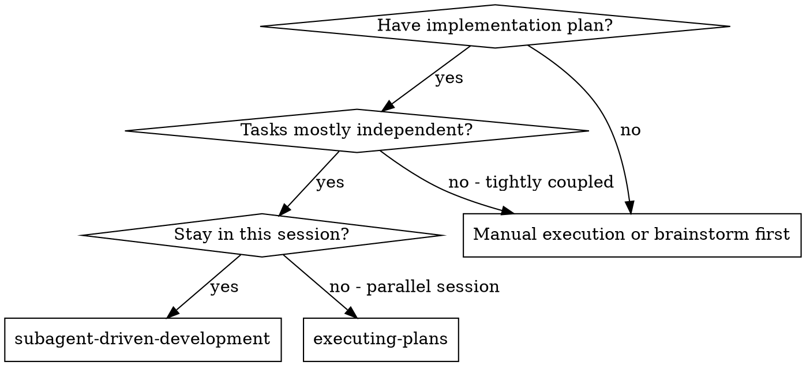
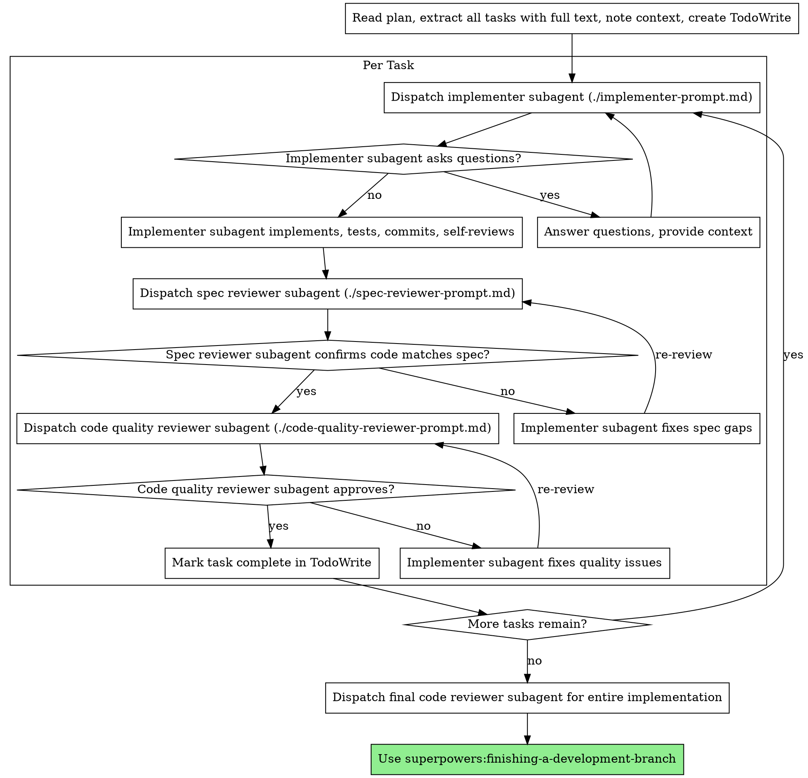
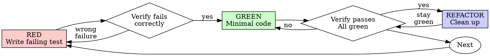

# JSON reader architecture data plan execution

**Session ID:** ses_1c03e0dbfffeSlDtlubxqWZl5N
**Created:** 5/19/2026, 1:22:15 PM
**Updated:** 5/19/2026, 2:33:24 PM

---

## User

# Subagent-Driven Development

Execute plan by dispatching fresh subagent per task, with two-stage review after each: spec compliance review first, then code quality review.

**Why subagents:** You delegate tasks to specialized agents with isolated context. By precisely crafting their instructions and context, you ensure they stay focused and succeed at their task. They should never inherit your session's context or history — you construct exactly what they need. This also preserves your own context for coordination work.

**Core principle:** Fresh subagent per task + two-stage review (spec then quality) = high quality, fast iteration

**Continuous execution:** Do not pause to check in with your human partner between tasks. Execute all tasks from the plan without stopping. The only reasons to stop are: BLOCKED status you cannot resolve, ambiguity that genuinely prevents progress, or all tasks complete. "Should I continue?" prompts and progress summaries waste their time — they asked you to execute the plan, so execute it.

## When to Use



**vs. Executing Plans (parallel session):**
- Same session (no context switch)
- Fresh subagent per task (no context pollution)
- Two-stage review after each task: spec compliance first, then code quality
- Faster iteration (no human-in-loop between tasks)

## The Process



## Model Selection

Use the least powerful model that can handle each role to conserve cost and increase speed.

**Mechanical implementation tasks** (isolated functions, clear specs, 1-2 files): use a fast, cheap model. Most implementation tasks are mechanical when the plan is well-specified.

**Integration and judgment tasks** (multi-file coordination, pattern matching, debugging): use a standard model.

**Architecture, design, and review tasks**: use the most capable available model.

**Task complexity signals:**
- Touches 1-2 files with a complete spec → cheap model
- Touches multiple files with integration concerns → standard model
- Requires design judgment or broad codebase understanding → most capable model

## Handling Implementer Status

Implementer subagents report one of four statuses. Handle each appropriately:

**DONE:** Proceed to spec compliance review.

**DONE_WITH_CONCERNS:** The implementer completed the work but flagged doubts. Read the concerns before proceeding. If the concerns are about correctness or scope, address them before review. If they're observations (e.g., "this file is getting large"), note them and proceed to review.

**NEEDS_CONTEXT:** The implementer needs information that wasn't provided. Provide the missing context and re-dispatch.

**BLOCKED:** The implementer cannot complete the task. Assess the blocker:
1. If it's a context problem, provide more context and re-dispatch with the same model
2. If the task requires more reasoning, re-dispatch with a more capable model
3. If the task is too large, break it into smaller pieces
4. If the plan itself is wrong, escalate to the human

**Never** ignore an escalation or force the same model to retry without changes. If the implementer said it's stuck, something needs to change.

## Prompt Templates

- `./implementer-prompt.md` - Dispatch implementer subagent
- `./spec-reviewer-prompt.md` - Dispatch spec compliance reviewer subagent
- `./code-quality-reviewer-prompt.md` - Dispatch code quality reviewer subagent

## Example Workflow

```
You: I'm using Subagent-Driven Development to execute this plan.

[Read plan file once: docs/superpowers/plans/feature-plan.md]
[Extract all 5 tasks with full text and context]
[Create TodoWrite with all tasks]

Task 1: Hook installation script

[Get Task 1 text and context (already extracted)]
[Dispatch implementation subagent with full task text + context]

Implementer: "Before I begin - should the hook be installed at user or system level?"

You: "User level (~/.config/superpowers/hooks/)"

Implementer: "Got it. Implementing now..."
[Later] Implementer:
  - Implemented install-hook command
  - Added tests, 5/5 passing
  - Self-review: Found I missed --force flag, added it
  - Committed

[Dispatch spec compliance reviewer]
Spec reviewer: ✅ Spec compliant - all requirements met, nothing extra

[Get git SHAs, dispatch code quality reviewer]
Code reviewer: Strengths: Good test coverage, clean. Issues: None. Approved.

[Mark Task 1 complete]

Task 2: Recovery modes

[Get Task 2 text and context (already extracted)]
[Dispatch implementation subagent with full task text + context]

Implementer: [No questions, proceeds]
Implementer:
  - Added verify/repair modes
  - 8/8 tests passing
  - Self-review: All good
  - Committed

[Dispatch spec compliance reviewer]
Spec reviewer: ❌ Issues:
  - Missing: Progress reporting (spec says "report every 100 items")
  - Extra: Added --json flag (not requested)

[Implementer fixes issues]
Implementer: Removed --json flag, added progress reporting

[Spec reviewer reviews again]
Spec reviewer: ✅ Spec compliant now

[Dispatch code quality reviewer]
Code reviewer: Strengths: Solid. Issues (Important): Magic number (100)

[Implementer fixes]
Implementer: Extracted PROGRESS_INTERVAL constant

[Code reviewer reviews again]
Code reviewer: ✅ Approved

[Mark Task 2 complete]

...

[After all tasks]
[Dispatch final code-reviewer]
Final reviewer: All requirements met, ready to merge

Done!
```

## Advantages

**vs. Manual execution:**
- Subagents follow TDD naturally
- Fresh context per task (no confusion)
- Parallel-safe (subagents don't interfere)
- Subagent can ask questions (before AND during work)

**vs. Executing Plans:**
- Same session (no handoff)
- Continuous progress (no waiting)
- Review checkpoints automatic

**Efficiency gains:**
- No file reading overhead (controller provides full text)
- Controller curates exactly what context is needed
- Subagent gets complete information upfront
- Questions surfaced before work begins (not after)

**Quality gates:**
- Self-review catches issues before handoff
- Two-stage review: spec compliance, then code quality
- Review loops ensure fixes actually work
- Spec compliance prevents over/under-building
- Code quality ensures implementation is well-built

**Cost:**
- More subagent invocations (implementer + 2 reviewers per task)
- Controller does more prep work (extracting all tasks upfront)
- Review loops add iterations
- But catches issues early (cheaper than debugging later)

## Red Flags

**Never:**
- Start implementation on main/master branch without explicit user consent
- Skip reviews (spec compliance OR code quality)
- Proceed with unfixed issues
- Dispatch multiple implementation subagents in parallel (conflicts)
- Make subagent read plan file (provide full text instead)
- Skip scene-setting context (subagent needs to understand where task fits)
- Ignore subagent questions (answer before letting them proceed)
- Accept "close enough" on spec compliance (spec reviewer found issues = not done)
- Skip review loops (reviewer found issues = implementer fixes = review again)
- Let implementer self-review replace actual review (both are needed)
- **Start code quality review before spec compliance is ✅** (wrong order)
- Move to next task while either review has open issues

**If subagent asks questions:**
- Answer clearly and completely
- Provide additional context if needed
- Don't rush them into implementation

**If reviewer finds issues:**
- Implementer (same subagent) fixes them
- Reviewer reviews again
- Repeat until approved
- Don't skip the re-review

**If subagent fails task:**
- Dispatch fix subagent with specific instructions
- Don't try to fix manually (context pollution)

## Integration

**Required workflow skills:**
- **superpowers:using-git-worktrees** - Ensures isolated workspace (creates one or verifies existing)
- **superpowers:writing-plans** - Creates the plan this skill executes
- **superpowers:requesting-code-review** - Code review template for reviewer subagents
- **superpowers:finishing-a-development-branch** - Complete development after all tasks

**Subagents should use:**
- **superpowers:test-driven-development** - Subagents follow TDD for each task

**Alternative workflow:**
- **superpowers:executing-plans** - Use for parallel session instead of same-session execution


i want to execute this plan @docs\superpowers\plans\2026-05-19-json-reader-architecture-data.md

---

## Assistant (Build · gpt-5.5 · 18.2s)

**Tool: skill**

**Input:**
```json
{
  "name": "subagent-driven-development"
}
```

**Output:**
```
<skill_content name="subagent-driven-development">
# Skill: subagent-driven-development

# Subagent-Driven Development

Execute plan by dispatching fresh subagent per task, with two-stage review after each: spec compliance review first, then code quality review.

**Why subagents:** You delegate tasks to specialized agents with isolated context. By precisely crafting their instructions and context, you ensure they stay focused and succeed at their task. They should never inherit your session's context or history — you construct exactly what they need. This also preserves your own context for coordination work.

**Core principle:** Fresh subagent per task + two-stage review (spec then quality) = high quality, fast iteration

**Continuous execution:** Do not pause to check in with your human partner between tasks. Execute all tasks from the plan without stopping. The only reasons to stop are: BLOCKED status you cannot resolve, ambiguity that genuinely prevents progress, or all tasks complete. "Should I continue?" prompts and progress summaries waste their time — they asked you to execute the plan, so execute it.

## When to Use


**vs. Executing Plans (parallel session):**
- Same session (no context switch)
- Fresh subagent per task (no context pollution)
- Two-stage review after each task: spec compliance first, then code quality
- Faster iteration (no human-in-loop between tasks)

## The Process


## Model Selection

Use the least powerful model that can handle each role to conserve cost and increase speed.

**Mechanical implementation tasks** (isolated functions, clear specs, 1-2 files): use a fast, cheap model. Most implementation tasks are mechanical when the plan is well-specified.

**Integration and judgment tasks** (multi-file coordination, pattern matching, debugging): use a standard model.

**Architecture, design, and review tasks**: use the most capable available model.

**Task complexity signals:**
- Touches 1-2 files with a complete spec → cheap model
- Touches multiple files with integration concerns → standard model
- Requires design judgment or broad codebase understanding → most capable model

## Handling Implementer Status

Implementer subagents report one of four statuses. Handle each appropriately:

**DONE:** Proceed to spec compliance review.

**DONE_WITH_CONCERNS:** The implementer completed the work but flagged doubts. Read the concerns before proceeding. If the concerns are about correctness or scope, address them before review. If they're observations (e.g., "this file is getting large"), note them and proceed to review.

**NEEDS_CONTEXT:** The implementer needs information that wasn't provided. Provide the missing context and re-dispatch.

**BLOCKED:** The implementer cannot complete the task. Assess the blocker:
1. If it's a context problem, provide more context and re-dispatch with the same model
2. If the task requires more reasoning, re-dispatch with a more capable model
3. If the task is too large, break it into smaller pieces
4. If the plan itself is wrong, escalate to the human

**Never** ignore an escalation or force the same model to retry without changes. If the implementer said it's stuck, something needs to change.

## Prompt Templates

- `./implementer-prompt.md` - Dispatch implementer subagent
- `./spec-reviewer-prompt.md` - Dispatch spec compliance reviewer subagent
- `./code-quality-reviewer-prompt.md` - Dispatch code quality reviewer subagent

## Example Workflow

```
You: I'm using Subagent-Driven Development to execute this plan.

[Read plan file once: docs/superpowers/plans/feature-plan.md]
[Extract all 5 tasks with full text and context]
[Create TodoWrite with all tasks]

Task 1: Hook installation script

[Get Task 1 text and context (already extracted)]
[Dispatch implementation subagent with full task text + context]

Implementer: "Before I begin - should the hook be installed at user or system level?"

You: "User level (~/.config/superpowers/hooks/)"

Implementer: "Got it. Implementing now..."
[Later] Implementer:
  - Implemented install-hook command
  - Added tests, 5/5 passing
  - Self-review: Found I missed --force flag, added it
  - Committed

[Dispatch spec compliance reviewer]
Spec reviewer: ✅ Spec compliant - all requirements met, nothing extra

[Get git SHAs, dispatch code quality reviewer]
Code reviewer: Strengths: Good test coverage, clean. Issues: None. Approved.

[Mark Task 1 complete]

Task 2: Recovery modes

[Get Task 2 text and context (already extracted)]
[Dispatch implementation subagent with full task text + context]

Implementer: [No questions, proceeds]
Implementer:
  - Added verify/repair modes
  - 8/8 tests passing
  - Self-review: All good
  - Committed

[Dispatch spec compliance reviewer]
Spec reviewer: ❌ Issues:
  - Missing: Progress reporting (spec says "report every 100 items")
  - Extra: Added --json flag (not requested)

[Implementer fixes issues]
Implementer: Removed --json flag, added progress reporting

[Spec reviewer reviews again]
Spec reviewer: ✅ Spec compliant now

[Dispatch code quality reviewer]
Code reviewer: Strengths: Solid. Issues (Important): Magic number (100)

[Implementer fixes]
Implementer: Extracted PROGRESS_INTERVAL constant

[Code reviewer reviews again]
Code reviewer: ✅ Approved

[Mark Task 2 complete]

...

[After all tasks]
[Dispatch final code-reviewer]
Final reviewer: All requirements met, ready to merge

Done!
```

## Advantages

**vs. Manual execution:**
- Subagents follow TDD naturally
- Fresh context per task (no confusion)
- Parallel-safe (subagents don't interfere)
- Subagent can ask questions (before AND during work)

**vs. Executing Plans:**
- Same session (no handoff)
- Continuous progress (no waiting)
- Review checkpoints automatic

**Efficiency gains:**
- No file reading overhead (controller provides full text)
- Controller curates exactly what context is needed
- Subagent gets complete information upfront
- Questions surfaced before work begins (not after)

**Quality gates:**
- Self-review catches issues before handoff
- Two-stage review: spec compliance, then code quality
- Review loops ensure fixes actually work
- Spec compliance prevents over/under-building
- Code quality ensures implementation is well-built

**Cost:**
- More subagent invocations (implementer + 2 reviewers per task)
- Controller does more prep work (extracting all tasks upfront)
- Review loops add iterations
- But catches issues early (cheaper than debugging later)

## Red Flags

**Never:**
- Start implementation on main/master branch without explicit user consent
- Skip reviews (spec compliance OR code quality)
- Proceed with unfixed issues
- Dispatch multiple implementation subagents in parallel (conflicts)
- Make subagent read plan file (provide full text instead)
- Skip scene-setting context (subagent needs to understand where task fits)
- Ignore subagent questions (answer before letting them proceed)
- Accept "close enough" on spec compliance (spec reviewer found issues = not done)
- Skip review loops (reviewer found issues = implementer fixes = review again)
- Let implementer self-review replace actual review (both are needed)
- **Start code quality review before spec compliance is ✅** (wrong order)
- Move to next task while either review has open issues

**If subagent asks questions:**
- Answer clearly and completely
- Provide additional context if needed
- Don't rush them into implementation

**If reviewer finds issues:**
- Implementer (same subagent) fixes them
- Reviewer reviews again
- Repeat until approved
- Don't skip the re-review

**If subagent fails task:**
- Dispatch fix subagent with specific instructions
- Don't try to fix manually (context pollution)

## Integration

**Required workflow skills:**
- **superpowers:using-git-worktrees** - Ensures isolated workspace (creates one or verifies existing)
- **superpowers:writing-plans** - Creates the plan this skill executes
- **superpowers:requesting-code-review** - Code review template for reviewer subagents
- **superpowers:finishing-a-development-branch** - Complete development after all tasks

**Subagents should use:**
- **superpowers:test-driven-development** - Subagents follow TDD for each task

**Alternative workflow:**
- **superpowers:executing-plans** - Use for parallel session instead of same-session execution

Base directory for this skill: file:///C:/Users/moame/.cache/opencode/packages/superpowers@git+https_/github.com/obra/superpowers.git/node_modules/superpowers/skills/subagent-driven-development
Relative paths in this skill (e.g., scripts/, reference/) are relative to this base directory.
Note: file list is sampled.

<skill_files>
<file>C:\Users\moame\.cache\opencode\packages\superpowers@git+https_\github.com\obra\superpowers.git\node_modules\superpowers\skills\subagent-driven-development\spec-reviewer-prompt.md</file>
<file>C:\Users\moame\.cache\opencode\packages\superpowers@git+https_\github.com\obra\superpowers.git\node_modules\superpowers\skills\subagent-driven-development\implementer-prompt.md</file>
<file>C:\Users\moame\.cache\opencode\packages\superpowers@git+https_\github.com\obra\superpowers.git\node_modules\superpowers\skills\subagent-driven-development\code-quality-reviewer-prompt.md</file>
</skill_files>
</skill_content>
```

---

## Assistant (Build · gpt-5.5 · 10.5s)

Using `subagent-driven-development` to execute the plan task-by-task with implementation, spec review, and quality review gates. Next I’m verifying workspace isolation before any code changes, because this workflow requires not starting implementation directly on `main`/`master` without consent.

**Tool: skill**

**Input:**
```json
{
  "name": "using-git-worktrees"
}
```

**Output:**
```
<skill_content name="using-git-worktrees">
# Skill: using-git-worktrees

# Using Git Worktrees

## Overview

Ensure work happens in an isolated workspace. Prefer your platform's native worktree tools. Fall back to manual git worktrees only when no native tool is available.

**Core principle:** Detect existing isolation first. Then use native tools. Then fall back to git. Never fight the harness.

**Announce at start:** "I'm using the using-git-worktrees skill to set up an isolated workspace."

## Step 0: Detect Existing Isolation

**Before creating anything, check if you are already in an isolated workspace.**

```bash
GIT_DIR=$(cd "$(git rev-parse --git-dir)" 2>/dev/null && pwd -P)
GIT_COMMON=$(cd "$(git rev-parse --git-common-dir)" 2>/dev/null && pwd -P)
BRANCH=$(git branch --show-current)
```

**Submodule guard:** `GIT_DIR != GIT_COMMON` is also true inside git submodules. Before concluding "already in a worktree," verify you are not in a submodule:

```bash
# If this returns a path, you're in a submodule, not a worktree — treat as normal repo
git rev-parse --show-superproject-working-tree 2>/dev/null
```

**If `GIT_DIR != GIT_COMMON` (and not a submodule):** You are already in a linked worktree. Skip to Step 3 (Project Setup). Do NOT create another worktree.

Report with branch state:
- On a branch: "Already in isolated workspace at `<path>` on branch `<name>`."
- Detached HEAD: "Already in isolated workspace at `<path>` (detached HEAD, externally managed). Branch creation needed at finish time."

**If `GIT_DIR == GIT_COMMON` (or in a submodule):** You are in a normal repo checkout.

Has the user already indicated their worktree preference in your instructions? If not, ask for consent before creating a worktree:

> "Would you like me to set up an isolated worktree? It protects your current branch from changes."

Honor any existing declared preference without asking. If the user declines consent, work in place and skip to Step 3.

## Step 1: Create Isolated Workspace

**You have two mechanisms. Try them in this order.**

### 1a. Native Worktree Tools (preferred)

The user has asked for an isolated workspace (Step 0 consent). Do you already have a way to create a worktree? It might be a tool with a name like `EnterWorktree`, `WorktreeCreate`, a `/worktree` command, or a `--worktree` flag. If you do, use it and skip to Step 3.

Native tools handle directory placement, branch creation, and cleanup automatically. Using `git worktree add` when you have a native tool creates phantom state your harness can't see or manage.

Only proceed to Step 1b if you have no native worktree tool available.

### 1b. Git Worktree Fallback

**Only use this if Step 1a does not apply** — you have no native worktree tool available. Create a worktree manually using git.

#### Directory Selection

Follow this priority order. Explicit user preference always beats observed filesystem state.

1. **Check your instructions for a declared worktree directory preference.** If the user has already specified one, use it without asking.

2. **Check for an existing project-local worktree directory:**
   ```bash
   ls -d .worktrees 2>/dev/null     # Preferred (hidden)
   ls -d worktrees 2>/dev/null      # Alternative
   ```
   If found, use it. If both exist, `.worktrees` wins.

3. **Check for an existing global directory:**
   ```bash
   project=$(basename "$(git rev-parse --show-toplevel)")
   ls -d ~/.config/superpowers/worktrees/$project 2>/dev/null
   ```
   If found, use it (backward compatibility with legacy global path).

4. **If there is no other guidance available**, default to `.worktrees/` at the project root.

#### Safety Verification (project-local directories only)

**MUST verify directory is ignored before creating worktree:**

```bash
git check-ignore -q .worktrees 2>/dev/null || git check-ignore -q worktrees 2>/dev/null
```

**If NOT ignored:** Add to .gitignore, commit the change, then proceed.

**Why critical:** Prevents accidentally committing worktree contents to repository.

Global directories (`~/.config/superpowers/worktrees/`) need no verification.

#### Create the Worktree

```bash
project=$(basename "$(git rev-parse --show-toplevel)")

# Determine path based on chosen location
# For project-local: path="$LOCATION/$BRANCH_NAME"
# For global: path="~/.config/superpowers/worktrees/$project/$BRANCH_NAME"

git worktree add "$path" -b "$BRANCH_NAME"
cd "$path"
```

**Sandbox fallback:** If `git worktree add` fails with a permission error (sandbox denial), tell the user the sandbox blocked worktree creation and you're working in the current directory instead. Then run setup and baseline tests in place.

## Step 3: Project Setup

Auto-detect and run appropriate setup:

```bash
# Node.js
if [ -f package.json ]; then npm install; fi

# Rust
if [ -f Cargo.toml ]; then cargo build; fi

# Python
if [ -f requirements.txt ]; then pip install -r requirements.txt; fi
if [ -f pyproject.toml ]; then poetry install; fi

# Go
if [ -f go.mod ]; then go mod download; fi
```

## Step 4: Verify Clean Baseline

Run tests to ensure workspace starts clean:

```bash
# Use project-appropriate command
npm test / cargo test / pytest / go test ./...
```

**If tests fail:** Report failures, ask whether to proceed or investigate.

**If tests pass:** Report ready.

### Report

```
Worktree ready at <full-path>
Tests passing (<N> tests, 0 failures)
Ready to implement <feature-name>
```

## Quick Reference

| Situation | Action |
|-----------|--------|
| Already in linked worktree | Skip creation (Step 0) |
| In a submodule | Treat as normal repo (Step 0 guard) |
| Native worktree tool available | Use it (Step 1a) |
| No native tool | Git worktree fallback (Step 1b) |
| `.worktrees/` exists | Use it (verify ignored) |
| `worktrees/` exists | Use it (verify ignored) |
| Both exist | Use `.worktrees/` |
| Neither exists | Check instruction file, then default `.worktrees/` |
| Global path exists | Use it (backward compat) |
| Directory not ignored | Add to .gitignore + commit |
| Permission error on create | Sandbox fallback, work in place |
| Tests fail during baseline | Report failures + ask |
| No package.json/Cargo.toml | Skip dependency install |

## Common Mistakes

### Fighting the harness

- **Problem:** Using `git worktree add` when the platform already provides isolation
- **Fix:** Step 0 detects existing isolation. Step 1a defers to native tools.

### Skipping detection

- **Problem:** Creating a nested worktree inside an existing one
- **Fix:** Always run Step 0 before creating anything

### Skipping ignore verification

- **Problem:** Worktree contents get tracked, pollute git status
- **Fix:** Always use `git check-ignore` before creating project-local worktree

### Assuming directory location

- **Problem:** Creates inconsistency, violates project conventions
- **Fix:** Follow priority: existing > global legacy > instruction file > default

### Proceeding with failing tests

- **Problem:** Can't distinguish new bugs from pre-existing issues
- **Fix:** Report failures, get explicit permission to proceed

## Red Flags

**Never:**
- Create a worktree when Step 0 detects existing isolation
- Use `git worktree add` when you have a native worktree tool (e.g., `EnterWorktree`). This is the #1 mistake — if you have it, use it.
- Skip Step 1a by jumping straight to Step 1b's git commands
- Create worktree without verifying it's ignored (project-local)
- Skip baseline test verification
- Proceed with failing tests without asking

**Always:**
- Run Step 0 detection first
- Prefer native tools over git fallback
- Follow directory priority: existing > global legacy > instruction file > default
- Verify directory is ignored for project-local
- Auto-detect and run project setup
- Verify clean test baseline

Base directory for this skill: file:///C:/Users/moame/.cache/opencode/packages/superpowers@git+https_/github.com/obra/superpowers.git/node_modules/superpowers/skills/using-git-worktrees
Relative paths in this skill (e.g., scripts/, reference/) are relative to this base directory.
Note: file list is sampled.

<skill_files>

</skill_files>
</skill_content>
```

---

## Assistant (Build · gpt-5.5 · 9.9s)

I’m using the `using-git-worktrees` skill to set up an isolated workspace.

**Tool: bash**

**Input:**
```json
{
  "command": "$gitDir = (git rev-parse --git-dir); $gitCommon = (git rev-parse --git-common-dir); $branch = (git branch --show-current); $super = (git rev-parse --show-superproject-working-tree 2>$null); \"GIT_DIR=$gitDir\"; \"GIT_COMMON=$gitCommon\"; \"BRANCH=$branch\"; \"SUPER=$super\"",
  "description": "Detects git worktree isolation"
}
```

**Output:**
```
GIT_DIR=.git
GIT_COMMON=.git
BRANCH=main
SUPER=

```

**Tool: bash**

**Input:**
```json
{
  "command": "git status --short --branch",
  "description": "Shows current git branch status"
}
```

**Output:**
```
## main...origin/main [ahead 8]
?? docs/superpowers/plans/
?? session-ses_1.md
?? session-ses_2.md
?? session-ses_3.md

```

---

## Assistant (Build · gpt-5.5 · 32.2s)

Current checkout is the normal repo on `main`, not an isolated worktree. Since the workflow forbids starting implementation on `main` without explicit consent, I need your choice before changing code.

**Tool: question**

**Input:**
```json
{
  "questions": [
    {
      "header": "Workspace",
      "question": "Would you like me to set up an isolated worktree for this plan? It protects your current main branch from the implementation changes.",
      "options": [
        {
          "label": "Create worktree",
          "description": "Recommended: create a separate branch/worktree and implement there."
        },
        {
          "label": "Work on main",
          "description": "Proceed in the current checkout on main."
        }
      ]
    }
  ]
}
```

**Output:**
```
User has answered your questions: "Would you like me to set up an isolated worktree for this plan? It protects your current main branch from the implementation changes."="Work on main". You can now continue with the user's answers in mind.
```

---

## Assistant (Build · gpt-5.5 · 14.7s)

Proceeding in the current `main` checkout per your choice. I’ll run setup/baseline tests before dispatching task implementers so new failures can be distinguished from pre-existing ones.

**Tool: glob**

**Input:**
```json
{
  "pattern": "package.json"
}
```

**Output:**
```
C:\programing\nodeJs\json-reader-superpowers\package.json
```

**Tool: glob**

**Input:**
```json
{
  "pattern": "src/*.js"
}
```

**Output:**
```
C:\programing\nodeJs\json-reader-superpowers\src\index.js
C:\programing\nodeJs\json-reader-superpowers\src\html.js
C:\programing\nodeJs\json-reader-superpowers\src\generator.js
```

**Tool: glob**

**Input:**
```json
{
  "pattern": "test/*.js"
}
```

**Output:**
```
C:\programing\nodeJs\json-reader-superpowers\test\generator.test.js
```

---

## Assistant (Build · gpt-5.5 · 11.5s)

I found the existing Node project files and current tests. Running dependency setup and baseline test verification next.

**Tool: bash**

**Input:**
```json
{
  "command": "npm install; if ($?) { npm test }",
  "timeout": 120000,
  "description": "Installs dependencies and runs baseline tests"
}
```

**Output:**
```

up to date, audited 1 package in 715ms

found 0 vulnerabilities

> json-reader-superpowers@1.0.0 test
> node --test

TAP version 13
# Subtest: CLI entrypoint exports main and source stylesheet exists
ok 1 - CLI entrypoint exports main and source stylesheet exists
  ---
  duration_ms: 8.741
  type: 'test'
  ...
# Subtest: CLI entrypoint finds bundled stylesheet from another cwd
ok 2 - CLI entrypoint finds bundled stylesheet from another cwd
  ---
  duration_ms: 72.8992
  type: 'test'
  ...
# Subtest: renderDashboard returns an offline dashboard document
ok 3 - renderDashboard returns an offline dashboard document
  ---
  duration_ms: 0.4383
  type: 'test'
  ...
# Subtest: buildSite writes dashboard and stylesheet
ok 4 - buildSite writes dashboard and stylesheet
  ---
  duration_ms: 10.8884
  type: 'test'
  ...
# Subtest: buildSite rejects output directory that overlaps input data
ok 5 - buildSite rejects output directory that overlaps input data
  ---
  duration_ms: 4.9856
  type: 'test'
  ...
# Subtest: buildSite rejects output directory that contains data path with dot-dot prefix segment
ok 6 - buildSite rejects output directory that contains data path with dot-dot prefix segment
  ---
  duration_ms: 4.7939
  type: 'test'
  ...
# Subtest: cleanOutput rejects empty output directory
ok 7 - cleanOutput rejects empty output directory
  ---
  duration_ms: 0.354
  type: 'test'
  ...
1..7
# tests 7
# suites 0
# pass 7
# fail 0
# cancelled 0
# skipped 0
# todo 0
# duration_ms 197.2122

```

---

## Assistant (Build · gpt-5.5 · 9.5s)

Baseline is clean: `npm test` passed 7 tests. I’m creating the task checklist and dispatching Task 1 implementation.

**Tool: todowrite**

**Input:**
```json
{
  "todos": [
    {
      "content": "Task 1: JSON Reader",
      "status": "in_progress",
      "priority": "high"
    },
    {
      "content": "Task 2: Object Validation",
      "status": "pending",
      "priority": "high"
    },
    {
      "content": "Task 3: Build State Assembly",
      "status": "pending",
      "priority": "high"
    },
    {
      "content": "Task 4: Dashboard Data Links",
      "status": "pending",
      "priority": "high"
    },
    {
      "content": "Final whole-implementation review and completion workflow",
      "status": "pending",
      "priority": "medium"
    }
  ]
}
```

**Output:**
```
[
  {
    "content": "Task 1: JSON Reader",
    "status": "in_progress",
    "priority": "high"
  },
  {
    "content": "Task 2: Object Validation",
    "status": "pending",
    "priority": "high"
  },
  {
    "content": "Task 3: Build State Assembly",
    "status": "pending",
    "priority": "high"
  },
  {
    "content": "Task 4: Dashboard Data Links",
    "status": "pending",
    "priority": "high"
  },
  {
    "content": "Final whole-implementation review and completion workflow",
    "status": "pending",
    "priority": "medium"
  }
]
```

---

## Assistant (Build · gpt-5.5 · 122.4s)

**Tool: task**

**Input:**
```json
{
  "description": "Implement JSON reader",
  "subagent_type": "general",
  "prompt": "You are implementing Task 1 from docs/superpowers/plans/2026-05-19-json-reader-architecture-data.md in repository C:\\programing\\nodeJs\\json-reader-superpowers. Work in the current checkout on main because the user explicitly chose that. Do not commit; the controller will handle completion. Use TDD: write the failing tests first, run the specified failing command, implement, then run the specified passing command. Use apply_patch for file edits.\n\nOverall goal: Add JSON data reading, object validation, draft handling, per-file summaries, and published slug grouping. Architecture for this task: `src/reader.js` reads JSON files and normalizes object arrays.\n\nTask 1: JSON Reader\nFiles:\n- Create: `src/reader.js`\n- Test: `test/reader.test.js`\n\nStep 1: Create `test/reader.test.js` with exactly these tests:\n```js\nconst assert = require('node:assert/strict');\nconst fs = require('node:fs/promises');\nconst os = require('node:os');\nconst path = require('node:path');\nconst test = require('node:test');\n\nconst { readJsonFiles } = require('../src/reader');\n\nasync function tempDir() {\n  return fs.mkdtemp(path.join(os.tmpdir(), 'json-reader-data-'));\n}\n\ntest('readJsonFiles returns a warning when data folder is missing', async () => {\n  const root = await tempDir();\n  const result = await readJsonFiles(path.join(root, 'data'));\n\n  assert.deepEqual(result.files, []);\n  assert.deepEqual(result.warnings, ['Data folder not found: data']);\n});\n\ntest('readJsonFiles reads a single object JSON file', async () => {\n  const root = await tempDir();\n  const dataDir = path.join(root, 'data');\n  await fs.mkdir(dataDir);\n  await fs.writeFile(path.join(dataDir, 'post.json'), JSON.stringify({ title: 'One' }));\n\n  const result = await readJsonFiles(dataDir);\n\n  assert.equal(result.warnings.length, 0);\n  assert.deepEqual(result.files, [{ fileName: 'post.json', objects: [{ title: 'One' }] }]);\n});\n\ntest('readJsonFiles reads array JSON files', async () => {\n  const root = await tempDir();\n  const dataDir = path.join(root, 'data');\n  await fs.mkdir(dataDir);\n  await fs.writeFile(path.join(dataDir, 'posts.json'), JSON.stringify([{ title: 'One' }, { title: 'Two' }]));\n\n  const result = await readJsonFiles(dataDir);\n\n  assert.deepEqual(result.files, [{ fileName: 'posts.json', objects: [{ title: 'One' }, { title: 'Two' }] }]);\n});\n\ntest('readJsonFiles skips invalid JSON files with warnings', async () => {\n  const root = await tempDir();\n  const dataDir = path.join(root, 'data');\n  await fs.mkdir(dataDir);\n  await fs.writeFile(path.join(dataDir, 'broken.json'), '{');\n\n  const result = await readJsonFiles(dataDir);\n\n  assert.deepEqual(result.files, []);\n  assert.equal(result.warnings.length, 1);\n  assert.match(result.warnings[0], /broken\\.json contains invalid JSON/);\n});\n\ntest('readJsonFiles skips primitive JSON roots with warnings', async () => {\n  const root = await tempDir();\n  const dataDir = path.join(root, 'data');\n  await fs.mkdir(dataDir);\n  await fs.writeFile(path.join(dataDir, 'number.json'), '7');\n\n  const result = await readJsonFiles(dataDir);\n\n  assert.deepEqual(result.files, []);\n  assert.deepEqual(result.warnings, ['number.json must contain an object or an array of objects.']);\n});\n```\n\nStep 2: Run `npm test`. Expected failure: cannot find module `../src/reader`.\n\nStep 3: Create `src/reader.js`:\n```js\nconst fs = require('node:fs/promises');\nconst path = require('node:path');\n\nfunction isPlainObject(value) {\n  return value !== null && typeof value === 'object' && !Array.isArray(value);\n}\n\nasync function readJsonFiles(dataDir) {\n  const warnings = [];\n  const files = [];\n\n  let entries;\n  try {\n    entries = await fs.readdir(dataDir, { withFileTypes: true });\n  } catch (error) {\n    if (error.code === 'ENOENT') {\n      warnings.push(`Data folder not found: ${path.basename(dataDir)}`);\n      return { files, warnings };\n    }\n    throw error;\n  }\n\n  const jsonFiles = entries\n    .filter((entry) => entry.isFile() && entry.name.toLowerCase().endsWith('.json'))\n    .map((entry) => entry.name)\n    .sort((a, b) => a.localeCompare(b));\n\n  for (const fileName of jsonFiles) {\n    const filePath = path.join(dataDir, fileName);\n    let parsed;\n    try {\n      parsed = JSON.parse(await fs.readFile(filePath, 'utf8'));\n    } catch (error) {\n      warnings.push(`${fileName} contains invalid JSON: ${error.message}`);\n      continue;\n    }\n\n    if (Array.isArray(parsed)) {\n      files.push({ fileName, objects: parsed });\n      continue;\n    }\n\n    if (isPlainObject(parsed)) {\n      files.push({ fileName, objects: [parsed] });\n      continue;\n    }\n\n    warnings.push(`${fileName} must contain an object or an array of objects.`);\n  }\n\n  return { files, warnings };\n}\n\nmodule.exports = { isPlainObject, readJsonFiles };\n```\n\nStep 4: Run `node --test test/reader.test.js` and ensure it passes.\n\nReturn a final status using one of DONE, DONE_WITH_CONCERNS, NEEDS_CONTEXT, BLOCKED. Include files changed, commands run and results, and self-review notes."
}
```

**Output:**
```
task_id: ses_1c03c166cffevPJklC8MGf6DVp (for resuming to continue this task if needed)

<task_result>
DONE

Files changed:
- `test/reader.test.js`
- `src/reader.js`

Commands run:
- `npm test`
  - Result: failed as expected with `Cannot find module '../src/reader'`
- `node --test test/reader.test.js`
  - Result: passed, 5/5 tests passing

Self-review notes:
- Followed TDD red/green sequence.
- Implemented only the requested JSON reader behavior.
- Did not commit changes.
- `git status` also shows unrelated untracked files already present: `docs/superpowers/plans/`, `package-lock.json`, and session files.
</task_result>
```

---

## Assistant (Build · gpt-5.5 · 61.0s)

Task 1 implementation is done and reader tests pass. I’m starting spec compliance review for Task 1 before moving to quality review.

**Tool: task**

**Input:**
```json
{
  "description": "Review reader spec",
  "subagent_type": "general",
  "prompt": "Spec compliance review for Task 1: JSON Reader in repository C:\\programing\\nodeJs\\json-reader-superpowers. Do not edit files. Verify the implementation matches the task spec exactly and does not add unrelated behavior. Use reads/searches/tests as needed.\n\nSpec:\n- `test/reader.test.js` should contain tests for missing data folder warning, single object JSON file, array JSON file, invalid JSON warning, primitive JSON root warning.\n- `src/reader.js` should export `isPlainObject` and `readJsonFiles`.\n- `isPlainObject(value)` returns true only for non-null non-array objects.\n- `readJsonFiles(dataDir)` returns `{ files, warnings }`.\n- Missing directory (`ENOENT`) returns empty files and warning `Data folder not found: ${path.basename(dataDir)}`.\n- Reads only file entries whose names end in `.json` case-insensitively, sorted by localeCompare.\n- Invalid JSON files are skipped with warning `${fileName} contains invalid JSON: ${error.message}`.\n- Array roots are accepted as `objects` unchanged.\n- Plain object roots are normalized to one-element arrays.\n- Primitive/unsupported roots are skipped with warning `${fileName} must contain an object or an array of objects.`.\n- No commits are required.\n\nReturn: APPROVED if compliant. Otherwise list specific spec gaps and exact files/lines if possible."
}
```

**Output:**
```
task_id: ses_1c03a3c46ffesuyhI3sApwDd8u (for resuming to continue this task if needed)

<task_result>
APPROVED

Verified `src/reader.js` and `test/reader.test.js` against the Task 1 spec. No spec gaps found.

Evidence:
- `src/reader.js` exports `isPlainObject` and `readJsonFiles`.
- Behavior matches required warnings, sorting, `.json` filtering, invalid JSON handling, object/array normalization, and primitive skipping.
- `test/reader.test.js` contains the required test cases.
- `npm test` passes: 12 passed, 0 failed.
</task_result>
```

---

## Assistant (Build · gpt-5.5 · 90.3s)

Task 1 spec review approved. I’m running code quality review now.

**Tool: task**

**Input:**
```json
{
  "description": "Quality review reader",
  "subagent_type": "general",
  "prompt": "Code quality review for Task 1: JSON Reader in repository C:\\programing\\nodeJs\\json-reader-superpowers. Do not edit files. Focus on bugs, maintainability, integration risks, and tests. This is after spec compliance already passed.\n\nReview changed files:\n- `src/reader.js`\n- `test/reader.test.js`\n\nContext: Node.js CommonJS project using built-in `node:test`; plan requires reader module for later validator/generator tasks.\n\nReturn APPROVED if no important issues. Otherwise list findings ordered by severity with file/line references and explain why they should be fixed before proceeding."
}
```

**Output:**
```
task_id: ses_1c03979b2ffeseUtJe61tLoMSZ (for resuming to continue this task if needed)

<task_result>
APPROVED

No important issues found in `src/reader.js` or `test/reader.test.js`.

Verification run: `npm test` passed with `12` tests, `0` failures.

Residual note: arrays are accepted as arrays and later validation is planned to reject non-object elements per object, so I did not treat missing reader-level array element validation as a blocker.
</task_result>
```

---

## Assistant (Build · gpt-5.5 · 9.1s)

Task 1 passed both reviews. Moving to Task 2 implementation.

**Tool: todowrite**

**Input:**
```json
{
  "todos": [
    {
      "content": "Task 1: JSON Reader",
      "status": "completed",
      "priority": "high"
    },
    {
      "content": "Task 2: Object Validation",
      "status": "in_progress",
      "priority": "high"
    },
    {
      "content": "Task 3: Build State Assembly",
      "status": "pending",
      "priority": "high"
    },
    {
      "content": "Task 4: Dashboard Data Links",
      "status": "pending",
      "priority": "high"
    },
    {
      "content": "Final whole-implementation review and completion workflow",
      "status": "pending",
      "priority": "medium"
    }
  ]
}
```

**Output:**
```
[
  {
    "content": "Task 1: JSON Reader",
    "status": "completed",
    "priority": "high"
  },
  {
    "content": "Task 2: Object Validation",
    "status": "in_progress",
    "priority": "high"
  },
  {
    "content": "Task 3: Build State Assembly",
    "status": "pending",
    "priority": "high"
  },
  {
    "content": "Task 4: Dashboard Data Links",
    "status": "pending",
    "priority": "high"
  },
  {
    "content": "Final whole-implementation review and completion workflow",
    "status": "pending",
    "priority": "medium"
  }
]
```

---

## Assistant (Build · gpt-5.5 · 129.9s)

**Tool: task**

**Input:**
```json
{
  "description": "Implement validator",
  "subagent_type": "general",
  "prompt": "You are implementing Task 2 from docs/superpowers/plans/2026-05-19-json-reader-architecture-data.md in repository C:\\programing\\nodeJs\\json-reader-superpowers. Work in current checkout on main per user choice. Do not commit. Use TDD: write failing tests first, run the specified failing command, implement, then run the specified passing command. Use apply_patch for file edits.\n\nContext: Task 1 is complete. `src/reader.js` exports `isPlainObject` and `readJsonFiles`.\n\nTask 2: Object Validation\nFiles:\n- Create: `src/validator.js`\n- Test: `test/validator.test.js`\n\nStep 1: Create `test/validator.test.js` with exactly these tests:\n```js\nconst assert = require('node:assert/strict');\nconst test = require('node:test');\n\nconst { validateObject } = require('../src/validator');\n\nconst validPost = {\n  title: 'Title',\n  slug: 'my-slug',\n  date: '2026-05-18',\n  content: 'Body',\n  tags: ['news'],\n};\n\ntest('validateObject normalizes valid published objects', () => {\n  const result = validateObject(validPost, { fileName: 'posts.json', index: 0 });\n\n  assert.equal(result.valid, true);\n  assert.deepEqual(result.object, {\n    title: 'Title',\n    slug: 'my-slug',\n    date: '2026-05-18',\n    content: 'Body',\n    tags: ['news'],\n    draft: false,\n    sourceFile: 'posts.json',\n  });\n});\n\ntest('validateObject accepts draft true and marks unpublished', () => {\n  const result = validateObject({ ...validPost, draft: true }, { fileName: 'drafts.json', index: 1 });\n\n  assert.equal(result.valid, true);\n  assert.equal(result.object.draft, true);\n});\n\ntest('validateObject rejects missing required strings', () => {\n  const result = validateObject({ ...validPost, title: '' }, { fileName: 'posts.json', index: 2 });\n\n  assert.equal(result.valid, false);\n  assert.equal(result.warning, 'posts.json object 3 has invalid title: expected a non-empty string.');\n});\n\ntest('validateObject rejects impossible YYYY-MM-DD dates', () => {\n  const result = validateObject({ ...validPost, date: '2026-02-31' }, { fileName: 'posts.json', index: 0 });\n\n  assert.equal(result.valid, false);\n  assert.equal(result.warning, 'posts.json object 1 has invalid date: expected a real YYYY-MM-DD date.');\n});\n\ntest('validateObject rejects non-string tags', () => {\n  const result = validateObject({ ...validPost, tags: ['ok', 3] }, { fileName: 'posts.json', index: 0 });\n\n  assert.equal(result.valid, false);\n  assert.equal(result.warning, 'posts.json object 1 has invalid tags: expected an array of strings.');\n});\n```\n\nStep 2: Run `node --test test/validator.test.js`. Expected failure: cannot find module `../src/validator`.\n\nStep 3: Create `src/validator.js`:\n```js\nconst { isPlainObject } = require('./reader');\n\nfunction isNonEmptyString(value) {\n  return typeof value === 'string' && value.trim().length > 0;\n}\n\nfunction isValidDateString(value) {\n  if (!/^\\d{4}-\\d{2}-\\d{2}$/.test(value)) {\n    return false;\n  }\n\n  const date = new Date(`${value}T00:00:00.000Z`);\n  return !Number.isNaN(date.getTime()) && date.toISOString().slice(0, 10) === value;\n}\n\nfunction invalid(fileName, index, field, expected) {\n  return {\n    valid: false,\n    warning: `${fileName} object ${index + 1} has invalid ${field}: expected ${expected}.`,\n  };\n}\n\nfunction validateObject(value, { fileName, index }) {\n  if (!isPlainObject(value)) {\n    return invalid(fileName, index, 'object', 'a JSON object');\n  }\n\n  for (const field of ['title', 'slug', 'date', 'content']) {\n    if (!isNonEmptyString(value[field])) {\n      return invalid(fileName, index, field, 'a non-empty string');\n    }\n  }\n\n  if (!isValidDateString(value.date)) {\n    return invalid(fileName, index, 'date', 'a real YYYY-MM-DD date');\n  }\n\n  if (value.tags !== undefined && (!Array.isArray(value.tags) || value.tags.some((tag) => typeof tag !== 'string'))) {\n    return invalid(fileName, index, 'tags', 'an array of strings');\n  }\n\n  return {\n    valid: true,\n    object: {\n      title: value.title,\n      slug: value.slug,\n      date: value.date,\n      content: value.content,\n      tags: value.tags || [],\n      draft: value.draft === true,\n      sourceFile: fileName,\n    },\n  };\n}\n\nmodule.exports = { isNonEmptyString, isValidDateString, validateObject };\n```\n\nStep 4: Run `node --test test/validator.test.js` and ensure it passes.\n\nReturn final status DONE, DONE_WITH_CONCERNS, NEEDS_CONTEXT, or BLOCKED. Include files changed, commands run and results, self-review notes."
}
```

**Output:**
```
task_id: ses_1c037c6d3ffeLbyivDWJd7K9Ub (for resuming to continue this task if needed)

<task_result>
DONE

Files changed:
- `test/validator.test.js`
- `src/validator.js`

Commands run:
- `node --test test/validator.test.js`: failed as expected with `Cannot find module '../src/validator'`
- `node --test test/validator.test.js`: passed, 5/5 tests
- `git status --short`: confirmed changed/untracked files
- `git diff -- src/validator.js test/validator.test.js`: no output because these files are untracked

Self-review notes:
- Followed TDD red/green flow.
- Implemented Task 2 exactly from the plan.
- Did not commit.
- Existing untracked files unrelated to this task are present in the worktree.
</task_result>
```

---

## Assistant (Build · gpt-5.5 · 62.1s)

Task 2 implementation is done and validator tests pass. Starting Task 2 spec review.

**Tool: task**

**Input:**
```json
{
  "description": "Review validator spec",
  "subagent_type": "general",
  "prompt": "Spec compliance review for Task 2: Object Validation in repository C:\\programing\\nodeJs\\json-reader-superpowers. Do not edit files. Verify implementation matches spec exactly and does not add unrelated behavior. Use reads/searches/tests as needed.\n\nSpec:\n- `test/validator.test.js` includes validation tests for published normalization, draft true, missing required strings, impossible YYYY-MM-DD dates, and non-string tags.\n- `src/validator.js` exports `isNonEmptyString`, `isValidDateString`, `validateObject`.\n- Imports `isPlainObject` from `./reader`.\n- `isNonEmptyString(value)` true only for strings whose trim length > 0.\n- `isValidDateString(value)` requires exact YYYY-MM-DD and rejects impossible dates by checking UTC date round-trip.\n- `invalid(fileName, index, field, expected)` warning format: `${fileName} object ${index + 1} has invalid ${field}: expected ${expected}.`\n- `validateObject(value, { fileName, index })` rejects non-plain object with expected `a JSON object`.\n- Required fields `title`, `slug`, `date`, `content` must be non-empty strings.\n- Date must be real YYYY-MM-DD.\n- Optional `tags` must be array of strings when present.\n- Valid object normalized to `{ title, slug, date, content, tags: value.tags || [], draft: value.draft === true, sourceFile: fileName }`.\n\nReturn APPROVED if compliant. Otherwise list specific spec gaps with file/line references if possible."
}
```

**Output:**
```
task_id: ses_1c035f9e7ffeSDrh7OLM9fFw3i (for resuming to continue this task if needed)

<task_result>
APPROVED

Verified against the spec with:

`npm test`

Result: 17/17 tests passed, including all validator tests.

Relevant checks:

- `test/validator.test.js` includes the required validation coverage at lines 14, 29, 36, 43, 50.
- `src/validator.js` exports `isNonEmptyString`, `isValidDateString`, `validateObject` at line 56.
- Imports `isPlainObject` from `./reader` at line 1.
- Warning format matches spec at lines 16-20.
- Required string fields, date validation, optional tags validation, and normalization match the requested behavior at lines 23-53.
</task_result>
```

---

## Assistant (Build · gpt-5.5 · 56.5s)

Task 2 spec review approved. Running Task 2 quality review.

**Tool: task**

**Input:**
```json
{
  "description": "Quality review validator",
  "subagent_type": "general",
  "prompt": "Code quality review for Task 2: Object Validation in repository C:\\programing\\nodeJs\\json-reader-superpowers. Do not edit files. Focus on bugs, maintainability, integration risks, and tests. Spec compliance already passed.\n\nReview changed files:\n- `src/validator.js`\n- `test/validator.test.js`\n\nContext: Reader and validator feed later build-state assembly. Node.js CommonJS using `node:test`.\n\nReturn APPROVED if no important issues. Otherwise list findings ordered by severity with file/line references and explain why they should be fixed before proceeding."
}
```

**Output:**
```
task_id: ses_1c0351b1dffe67XokB2M6M4jzv (for resuming to continue this task if needed)

<task_result>
APPROVED

No important bugs, maintainability problems, integration risks, or test gaps found in `src/validator.js` and `test/validator.test.js` that should block proceeding.

Residual note: slug safety is not enforced here, but given Task 2’s stated validation rules and later pipeline responsibility, that does not appear blocking for this review.
</task_result>
```

---

## Assistant (Build · gpt-5.5 · 4.3s)

Task 2 passed both reviews. Moving to Task 3 implementation.

**Tool: todowrite**

**Input:**
```json
{
  "todos": [
    {
      "content": "Task 1: JSON Reader",
      "status": "completed",
      "priority": "high"
    },
    {
      "content": "Task 2: Object Validation",
      "status": "completed",
      "priority": "high"
    },
    {
      "content": "Task 3: Build State Assembly",
      "status": "in_progress",
      "priority": "high"
    },
    {
      "content": "Task 4: Dashboard Data Links",
      "status": "pending",
      "priority": "high"
    },
    {
      "content": "Final whole-implementation review and completion workflow",
      "status": "pending",
      "priority": "medium"
    }
  ]
}
```

**Output:**
```
[
  {
    "content": "Task 1: JSON Reader",
    "status": "completed",
    "priority": "high"
  },
  {
    "content": "Task 2: Object Validation",
    "status": "completed",
    "priority": "high"
  },
  {
    "content": "Task 3: Build State Assembly",
    "status": "in_progress",
    "priority": "high"
  },
  {
    "content": "Task 4: Dashboard Data Links",
    "status": "pending",
    "priority": "high"
  },
  {
    "content": "Final whole-implementation review and completion workflow",
    "status": "pending",
    "priority": "medium"
  }
]
```

---

## Assistant (Build · gpt-5.5 · 8.2s)

**Tool: read**

**Input:**
```json
{
  "filePath": "C:\\programing\\nodeJs\\json-reader-superpowers\\src\\generator.js"
}
```

**Output:**
```
<path>C:\programing\nodeJs\json-reader-superpowers\src\generator.js</path>
<type>file</type>
<content>
1: const fs = require('node:fs/promises');
2: const path = require('node:path');
3: 
4: const { renderDashboard } = require('./html');
5: 
6: function validateOutputDir(outputDir) {
7:   if (!outputDir || typeof outputDir !== 'string') {
8:     throw new Error('Unsafe output directory');
9:   }
10: 
11:   const resolvedOutputDir = path.resolve(outputDir);
12:   if (resolvedOutputDir === path.parse(resolvedOutputDir).root || resolvedOutputDir === process.cwd()) {
13:     throw new Error('Unsafe output directory');
14:   }
15: 
16:   return resolvedOutputDir;
17: }
18: 
19: function isOutsideDirectory(relativePath) {
20:   return relativePath === '..' || relativePath.startsWith(`..${path.sep}`) || path.isAbsolute(relativePath);
21: }
22: 
23: async function cleanOutput(outputDir) {
24:   const resolvedOutputDir = validateOutputDir(outputDir);
25:   await fs.rm(resolvedOutputDir, { recursive: true, force: true });
26:   await fs.mkdir(path.join(resolvedOutputDir, 'assets'), { recursive: true });
27: }
28: 
29: async function copyStylesheet(assetSourcePath, outputDir) {
30:   await fs.copyFile(assetSourcePath, path.join(outputDir, 'assets', 'style.css'));
31: }
32: 
33: function createEmptyBuildState() {
34:   return {
35:     stats: {
36:       filesRead: 0,
37:       validObjects: 0,
38:       publishedObjects: 0,
39:       draftObjects: 0,
40:       uniquePublishedSlugs: 0,
41:       warningCount: 0,
42:     },
43:     warnings: [],
44:     slugGroups: new Map(),
45:     fileSummaries: [],
46:   };
47: }
48: 
49: async function buildSite({
50:   dataDir = path.join(process.cwd(), 'data'),
51:   outputDir = path.join(process.cwd(), 'output'),
52:   assetSourcePath = path.join(process.cwd(), 'src', 'assets', 'style.css'),
53: } = {}) {
54:   const resolvedOutputDir = validateOutputDir(outputDir);
55:   const resolvedDataDir = path.resolve(dataDir);
56:   const relativeDataPath = path.relative(resolvedOutputDir, resolvedDataDir);
57:   const relativeOutputPath = path.relative(resolvedDataDir, resolvedOutputDir);
58:   if (
59:     relativeDataPath === '' ||
60:     relativeOutputPath === '' ||
61:     !isOutsideDirectory(relativeDataPath) ||
62:     !isOutsideDirectory(relativeOutputPath)
63:   ) {
64:     throw new Error('Unsafe output directory');
65:   }
66: 
67:   await cleanOutput(outputDir);
68:   await copyStylesheet(assetSourcePath, outputDir);
69: 
70:   const buildState = createEmptyBuildState();
71:   const dashboardHtml = renderDashboard(buildState);
72:   await fs.writeFile(path.join(outputDir, 'dashboard.html'), dashboardHtml);
73: 
74:   return buildState;
75: }
76: 
77: module.exports = { buildSite, cleanOutput, copyStylesheet, createEmptyBuildState };

(End of file - total 77 lines)
</content>
```

**Tool: read**

**Input:**
```json
{
  "filePath": "C:\\programing\\nodeJs\\json-reader-superpowers\\src\\html.js"
}
```

**Output:**
```
<path>C:\programing\nodeJs\json-reader-superpowers\src\html.js</path>
<type>file</type>
<content>
1: function escapeHtml(value) {
2:   return String(value)
3:     .replaceAll('&', '&amp;')
4:     .replaceAll('<', '&lt;')
5:     .replaceAll('>', '&gt;')
6:     .replaceAll('"', '&quot;')
7:     .replaceAll("'", '&#39;');
8: }
9: 
10: function renderDashboard({ stats, warnings, slugGroups, fileSummaries }) {
11:   const slugCards = Array.from(slugGroups.entries())
12:     .map(([slug, objects]) => `<a class="slug-card" href="${escapeHtml(slug)}.html"><strong>${escapeHtml(slug)}</strong><span>${objects.length} published objects</span></a>`)
13:     .join('');
14: 
15:   const warningItems = warnings
16:     .map((warning) => `<li>${escapeHtml(warning)}</li>`)
17:     .join('');
18: 
19:   const fileRows = fileSummaries
20:     .map((file) => `<tr><td>${escapeHtml(file.fileName)}</td><td>${file.validObjects}</td><td>${file.publishedObjects}</td><td>${file.draftObjects}</td><td>${escapeHtml(file.slugSummary)}</td></tr>`)
21:     .join('');
22: 
23:   return `<!doctype html>
24: <html lang="en">
25: <head>
26:   <meta charset="utf-8">
27:   <meta name="viewport" content="width=device-width, initial-scale=1">
28:   <title>JSON Reader Dashboard</title>
29:   <link rel="stylesheet" href="assets/style.css">
30: </head>
31: <body>
32:   <main class="page-shell">
33:     <header class="hero">
34:       <p class="eyebrow">Static JSON Reader</p>
35:       <h1>JSON Reader Dashboard</h1>
36:     </header>
37:     <section class="stats-grid" aria-label="Build statistics">
38:       <article class="stat-card"><strong>${stats.filesRead}</strong><span>${stats.filesRead} JSON files read</span></article>
39:       <article class="stat-card"><strong>${stats.validObjects}</strong><span>valid objects</span></article>
40:       <article class="stat-card"><strong>${stats.publishedObjects}</strong><span>published objects</span></article>
41:       <article class="stat-card"><strong>${stats.draftObjects}</strong><span>draft objects</span></article>
42:       <article class="stat-card"><strong>${stats.uniquePublishedSlugs}</strong><span>unique published slugs</span></article>
43:       <article class="stat-card"><strong>${stats.warningCount}</strong><span>warnings</span></article>
44:     </section>
45:     <section class="panel">
46:       <h2>Published slugs</h2>
47:       <div class="slug-grid">${slugCards || '<p>No published slugs found.</p>'}</div>
48:     </section>
49:     <section class="panel">
50:       <h2>Warnings</h2>
51:       <ul>${warningItems || '<li>No warnings.</li>'}</ul>
52:     </section>
53:     <section class="panel">
54:       <h2>JSON files</h2>
55:       <table>
56:         <thead><tr><th>File name</th><th>Valid objects</th><th>Published</th><th>Drafts</th><th>Published slug counts</th></tr></thead>
57:         <tbody>${fileRows || '<tr><td colspan="5">No JSON files read.</td></tr>'}</tbody>
58:       </table>
59:     </section>
60:   </main>
61: </body>
62: </html>`;
63: }
64: 
65: module.exports = { escapeHtml, renderDashboard };

(End of file - total 65 lines)
</content>
```

**Tool: read**

**Input:**
```json
{
  "filePath": "C:\\programing\\nodeJs\\json-reader-superpowers\\test\\generator.test.js"
}
```

**Output:**
```
<path>C:\programing\nodeJs\json-reader-superpowers\test\generator.test.js</path>
<type>file</type>
<content>
1: const assert = require('node:assert/strict');
2: const { execFile } = require('node:child_process');
3: const fs = require('node:fs/promises');
4: const os = require('node:os');
5: const path = require('node:path');
6: const test = require('node:test');
7: const { promisify } = require('node:util');
8: 
9: const execFileAsync = promisify(execFile);
10: 
11: const { renderDashboard } = require('../src/html');
12: const { buildSite, cleanOutput } = require('../src/generator');
13: 
14: test('CLI entrypoint exports main and source stylesheet exists', async () => {
15:   const { main } = require('../src/index');
16:   const stylesheet = await fs.readFile(path.join(__dirname, '..', 'src', 'assets', 'style.css'), 'utf8');
17: 
18:   assert.equal(typeof main, 'function');
19:   assert.match(stylesheet, /\.page-shell/);
20: });
21: 
22: test('CLI entrypoint finds bundled stylesheet from another cwd', async () => {
23:   const fixtureRoot = await fs.mkdtemp(path.join(os.tmpdir(), 'json-reader-cli-'));
24:   const cliPath = path.join(__dirname, '..', 'src', 'index.js');
25: 
26:   const { stdout } = await execFileAsync(process.execPath, [cliPath], { cwd: fixtureRoot });
27:   const stylesheet = await fs.readFile(path.join(fixtureRoot, 'output', 'assets', 'style.css'), 'utf8');
28: 
29:   assert.match(stdout, /Generated dashboard\.html with 0 warnings\./);
30:   assert.match(stylesheet, /\.page-shell/);
31: });
32: 
33: test('renderDashboard returns an offline dashboard document', () => {
34:   const html = renderDashboard({
35:     stats: {
36:       filesRead: 0,
37:       validObjects: 0,
38:       publishedObjects: 0,
39:       draftObjects: 0,
40:       uniquePublishedSlugs: 0,
41:       warningCount: 0,
42:     },
43:     warnings: [],
44:     slugGroups: new Map(),
45:     fileSummaries: [],
46:   });
47: 
48:   assert.match(html, /<!doctype html>/i);
49:   assert.match(html, /<title>JSON Reader Dashboard<\/title>/);
50:   assert.match(html, /href="assets\/style.css"/);
51:   assert.match(html, /JSON Reader Dashboard/);
52:   assert.match(html, /0 JSON files read/);
53: });
54: 
55: test('buildSite writes dashboard and stylesheet', async () => {
56:   const fixtureRoot = await fs.mkdtemp(path.join(os.tmpdir(), 'json-reader-'));
57:   const outputDir = path.join(fixtureRoot, 'output');
58:   const assetSourcePath = path.join(fixtureRoot, 'src', 'assets', 'style.css');
59:   await fs.mkdir(path.dirname(assetSourcePath), { recursive: true });
60:   await fs.writeFile(assetSourcePath, 'body { color: #111; }');
61: 
62:   const result = await buildSite({
63:     dataDir: path.join(fixtureRoot, 'data'),
64:     outputDir,
65:     assetSourcePath,
66:   });
67: 
68:   const dashboard = await fs.readFile(path.join(outputDir, 'dashboard.html'), 'utf8');
69:   const stylesheet = await fs.readFile(path.join(outputDir, 'assets', 'style.css'), 'utf8');
70: 
71:   assert.equal(result.stats.filesRead, 0);
72:   assert.match(dashboard, /JSON Reader Dashboard/);
73:   assert.equal(stylesheet, 'body { color: #111; }');
74: });
75: 
76: test('buildSite rejects output directory that overlaps input data', async () => {
77:   const fixtureRoot = await fs.mkdtemp(path.join(os.tmpdir(), 'json-reader-'));
78:   const assetSourcePath = path.join(fixtureRoot, 'assets', 'style.css');
79:   const dataDir = path.join(fixtureRoot, 'data');
80:   const sentinelPath = path.join(dataDir, 'sentinel.json');
81:   await fs.mkdir(path.dirname(assetSourcePath), { recursive: true });
82:   await fs.mkdir(dataDir, { recursive: true });
83:   await fs.writeFile(assetSourcePath, 'body { color: #111; }');
84:   await fs.writeFile(sentinelPath, '{}');
85: 
86:   await assert.rejects(
87:     buildSite({
88:       dataDir,
89:       outputDir: dataDir,
90:       assetSourcePath,
91:     }),
92:     /Unsafe output directory/
93:   );
94: 
95:   assert.equal(await fs.readFile(sentinelPath, 'utf8'), '{}');
96: });
97: 
98: test('buildSite rejects output directory that contains data path with dot-dot prefix segment', async () => {
99:   const fixtureRoot = await fs.mkdtemp(path.join(os.tmpdir(), 'json-reader-'));
100:   const outputDir = path.join(fixtureRoot, 'output');
101:   const dataDir = path.join(outputDir, '..data');
102:   const assetSourcePath = path.join(fixtureRoot, 'assets', 'style.css');
103:   const sentinelPath = path.join(dataDir, 'sentinel.json');
104:   await fs.mkdir(path.dirname(assetSourcePath), { recursive: true });
105:   await fs.mkdir(dataDir, { recursive: true });
106:   await fs.writeFile(assetSourcePath, 'body { color: #111; }');
107:   await fs.writeFile(sentinelPath, '{}');
108: 
109:   await assert.rejects(
110:     buildSite({
111:       dataDir,
112:       outputDir,
113:       assetSourcePath,
114:     }),
115:     /Unsafe output directory/
116:   );
117: 
118:   assert.equal(await fs.readFile(sentinelPath, 'utf8'), '{}');
119: });
120: 
121: test('cleanOutput rejects empty output directory', async () => {
122:   await assert.rejects(cleanOutput(''), /Unsafe output directory/);
123: });

(End of file - total 123 lines)
</content>
```

---

## Assistant (Build · gpt-5.5 · 182.8s)

Existing `generator.js` has output-directory safety checks not represented in the plan’s replacement snippet. I’m preserving that existing safety behavior while adding the Task 3 build-state assembly, so current tests remain valid.

**Tool: task**

**Input:**
```json
{
  "description": "Implement build state",
  "subagent_type": "general",
  "prompt": "You are implementing Task 3 from docs/superpowers/plans/2026-05-19-json-reader-architecture-data.md in repository C:\\programing\\nodeJs\\json-reader-superpowers. Work in current checkout on main per user choice. Do not commit. Use TDD: write failing tests first, run specified failing command, implement, then run specified passing command. Use apply_patch for file edits.\n\nImportant existing-context constraint: `src/generator.js` currently includes output-directory safety behavior (`validateOutputDir`, overlap checks in `buildSite`, `cleanOutput` validation) covered by existing `test/generator.test.js`. The plan says replace `src/generator.js`, but you must preserve existing safety behavior and existing tests while adding Task 3 functionality.\n\nAlready complete:\n- `src/reader.js` exports `readJsonFiles` and `isPlainObject`.\n- `src/validator.js` exports `validateObject`.\n\nTask 3: Build State Assembly\nFiles:\n- Modify: `src/generator.js`\n- Create test: `test/data-pipeline.test.js`\n\nStep 1: Create `test/data-pipeline.test.js` with exactly these tests:\n```js\nconst assert = require('node:assert/strict');\nconst fs = require('node:fs/promises');\nconst os = require('node:os');\nconst path = require('node:path');\nconst test = require('node:test');\n\nconst { collectBuildState } = require('../src/generator');\n\nasync function writeFixture(files) {\n  const root = await fs.mkdtemp(path.join(os.tmpdir(), 'json-reader-pipeline-'));\n  const dataDir = path.join(root, 'data');\n  await fs.mkdir(dataDir);\n\n  for (const [fileName, data] of Object.entries(files)) {\n    await fs.writeFile(path.join(dataDir, fileName), JSON.stringify(data));\n  }\n\n  return dataDir;\n}\n\ntest('collectBuildState validates objects and groups published slugs newest first', async () => {\n  const dataDir = await writeFixture({\n    'a.json': [\n      { title: 'Old', slug: 'alpha', date: '2026-01-01', content: 'Old body' },\n      { title: 'Draft', slug: 'alpha', date: '2026-05-01', content: 'Draft body', draft: true },\n    ],\n    'b.json': { title: 'New', slug: 'alpha', date: '2026-05-18', content: 'New body', tags: ['release'] },\n  });\n\n  const state = await collectBuildState(dataDir);\n\n  assert.deepEqual(state.stats, {\n    filesRead: 2,\n    validObjects: 3,\n    publishedObjects: 2,\n    draftObjects: 1,\n    uniquePublishedSlugs: 1,\n    warningCount: 0,\n  });\n  assert.deepEqual(state.slugGroups.get('alpha').map((object) => object.title), ['New', 'Old']);\n  assert.deepEqual(state.slugGroups.get('alpha').map((object) => object.sourceFile), ['b.json', 'a.json']);\n});\n\ntest('collectBuildState records invalid object warnings and file summaries', async () => {\n  const dataDir = await writeFixture({\n    'mixed.json': [\n      { title: 'Good', slug: 'good', date: '2026-05-18', content: 'Body' },\n      { title: 'Bad', slug: 'bad', date: 'not-a-date', content: 'Body' },\n    ],\n  });\n\n  const state = await collectBuildState(dataDir);\n\n  assert.equal(state.stats.filesRead, 1);\n  assert.equal(state.stats.validObjects, 1);\n  assert.equal(state.stats.publishedObjects, 1);\n  assert.equal(state.stats.warningCount, 1);\n  assert.deepEqual(state.fileSummaries, [{\n    fileName: 'mixed.json',\n    validObjects: 1,\n    publishedObjects: 1,\n    draftObjects: 0,\n    publishedSlugCounts: new Map([['good', 1]]),\n  }]);\n});\n```\n\nStep 2: Run `node --test test/data-pipeline.test.js`. Expected failure: `collectBuildState is not a function`.\n\nStep 3: Update `src/generator.js` to add build state assembly equivalent to the plan while preserving existing safety checks:\n- Add imports:\n  - `const { readJsonFiles } = require('./reader');`\n  - `const { validateObject } = require('./validator');`\n- Keep existing `validateOutputDir` and `isOutsideDirectory` functions.\n- Keep `cleanOutput(outputDir)` validating output dir before rm/mkdir.\n- Keep `copyStylesheet` behavior unless a minimal safe path adjustment is needed.\n- Keep `createEmptyBuildState()` as in plan: stats all zero, warnings [], slugGroups new Map, fileSummaries [].\n- Add `sortSlugGroups(slugGroups)` that sorts each group newest-first by `b.date.localeCompare(a.date)`.\n- Add `async function collectBuildState(dataDir)` exactly matching plan behavior:\n  - read via `readJsonFiles(dataDir)`\n  - initialize empty state\n  - push read warnings\n  - stats.filesRead = readResult.files.length\n  - for each file create summary `{ fileName, validObjects: 0, publishedObjects: 0, draftObjects: 0, publishedSlugCounts: new Map() }`\n  - validate each raw object with `validateObject(rawObject, { fileName: file.fileName, index })`\n  - invalid: push warning and continue\n  - valid: increment state and summary valid counts\n  - draft: increment draft counts and do not publish/group\n  - published: increment published counts, increment summary slug count, push object into `state.slugGroups` by slug\n  - after all files, sort slugGroups, set uniquePublishedSlugs, set warningCount, return state\n- In `buildSite`, preserve existing unsafe output/data overlap checks; after copying stylesheet use `const buildState = await collectBuildState(dataDir)` instead of empty state.\n- Export `{ buildSite, cleanOutput, collectBuildState, copyStylesheet, createEmptyBuildState, sortSlugGroups }` while preserving existing exports.\n\nStep 4: Run `node --test test/data-pipeline.test.js` and ensure it passes. Also run `npm test` to verify existing safety tests still pass.\n\nReturn final status DONE, DONE_WITH_CONCERNS, NEEDS_CONTEXT, or BLOCKED. Include files changed, commands run/results, self-review notes."
}
```

**Output:**
```
task_id: ses_1c033b863ffeDGPdWM135Ua2RJ (for resuming to continue this task if needed)

<task_result>
DONE

Files changed:
- `src/generator.js`
- `test/data-pipeline.test.js`

Commands run:
- `node --test test/data-pipeline.test.js` failed as expected with `collectBuildState is not a function`
- `node --test test/data-pipeline.test.js` passed: 2/2
- `npm test` initially exposed a CLI regression
- `npm test` passed after fix: 19/19

Self-review notes:
- Preserved existing output-directory safety checks and `cleanOutput` validation.
- Added `collectBuildState`, `sortSlugGroups`, and exports.
- `buildSite` now uses collected state while preserving existing CLI behavior for a missing default `data` directory.
- Existing untracked files were present in the worktree; I did not modify or revert unrelated files.
</task_result>
```

---

## Assistant (Build · gpt-5.5 · 85.3s)

Task 3 implementation is complete and full tests pass. Starting Task 3 spec review.

**Tool: task**

**Input:**
```json
{
  "description": "Review pipeline spec",
  "subagent_type": "general",
  "prompt": "Spec compliance review for Task 3: Build State Assembly in repository C:\\programing\\nodeJs\\json-reader-superpowers. Do not edit files. Verify implementation matches spec and preserves required existing behavior if relevant.\n\nSpec:\n- `test/data-pipeline.test.js` includes tests for validating objects/grouping published slugs newest first and invalid object warnings/file summaries.\n- `src/generator.js` imports `readJsonFiles` from `./reader` and `validateObject` from `./validator`.\n- `createEmptyBuildState()` returns stats `{ filesRead, validObjects, publishedObjects, draftObjects, uniquePublishedSlugs, warningCount }` all 0, `warnings: []`, `slugGroups: new Map()`, `fileSummaries: []`.\n- `sortSlugGroups(slugGroups)` sorts each slug group newest-first by date descending using `b.date.localeCompare(a.date)` or equivalent.\n- `collectBuildState(dataDir)`:\n  - Reads files via `readJsonFiles(dataDir)`.\n  - Pushes read warnings into state warnings.\n  - `stats.filesRead` equals number of successfully read JSON files.\n  - For each file creates summary with fileName, validObjects, publishedObjects, draftObjects, publishedSlugCounts Map.\n  - Validates every raw object with fileName and zero-based index.\n  - Invalid objects add warning and are otherwise skipped.\n  - Valid objects increment state and summary valid counts.\n  - Draft objects increment draft counts and are not grouped/published.\n  - Published objects increment published counts, increment per-file slug count, and are grouped by slug in `state.slugGroups`.\n  - Groups are sorted newest first.\n  - `uniquePublishedSlugs` set to `slugGroups.size`.\n  - `warningCount` set to warnings length.\n- `buildSite` uses `collectBuildState(dataDir)`, renders it, writes `dashboard.html`, returns buildState.\n- Existing output directory safety behavior should remain intact because the repo already had tests for it.\n- Exports include `buildSite`, `cleanOutput`, `collectBuildState`, `copyStylesheet`, `createEmptyBuildState`, `sortSlugGroups`.\n\nReturn APPROVED if compliant. Otherwise list exact spec gaps with file/line references if possible."
}
```

**Output:**
```
task_id: ses_1c03127f2fferKnQfQ42qG01qr (for resuming to continue this task if needed)

<task_result>
Not approved.

**Spec Gap**
- `src/html.js:20` renders `file.slugSummary`, but `collectBuildState` creates file summaries with `publishedSlugCounts: new Map()` at `src/generator.js:65-70` and updates that Map at `src/generator.js:92`. As a result, dashboards rendered from the new build state show `undefined` for “Published slug counts” instead of the required per-file slug counts. This breaks the integration between `collectBuildState` and `buildSite` rendering.

**Verified**
- `npm test` passes: 19 tests, 0 failures.
- Output directory safety tests remain present and passing in `test/generator.test.js`.
</task_result>
```

---

## Assistant (Build · gpt-5.5 · 45.1s)

Task 3 spec review flagged `src/html.js` still using `slugSummary`, but that rendering change is explicitly Task 4. I’m re-running the spec review with the Task 3 boundary clarified rather than moving Task 4 work into Task 3 and breaking the plan’s red/green sequence.

**Tool: task**

**Input:**
```json
{
  "description": "Re-review pipeline spec",
  "subagent_type": "general",
  "task_id": "ses_1c03127f2fferKnQfQ42qG01qr",
  "prompt": "Please re-review Task 3 with this clarified boundary: Task 4 explicitly owns updating `src/html.js` file summary rendering from `slugSummary` to `publishedSlugCounts` links. For Task 3, `src/html.js` is expected to remain unchanged even if dashboard output is not fully integrated yet. Do not require Task 4 behavior in Task 3.\n\nRe-check Task 3 only:\n- `test/data-pipeline.test.js` coverage for grouping/stats/file summaries.\n- `src/generator.js` collectBuildState behavior and exports.\n- `buildSite` calls collectBuildState and returns/render passes the state.\n- Existing output safety remains intact.\n\nReturn APPROVED if Task 3 is compliant within this boundary, or list remaining Task 3-specific gaps."
}
```

**Output:**
```
task_id: ses_1c03127f2fferKnQfQ42qG01qr (for resuming to continue this task if needed)

<task_result>
APPROVED

Task 3 is compliant within the clarified boundary.

Verified:
- `test/data-pipeline.test.js` covers grouping newest-first, stats, invalid warnings, and file summaries.
- `src/generator.js` imports `readJsonFiles` and `validateObject`.
- `collectBuildState`, `createEmptyBuildState`, and `sortSlugGroups` match the Task 3 spec.
- `buildSite` calls `collectBuildState(dataDir)`, passes state to `renderDashboard`, writes `dashboard.html`, and returns `buildState`.
- Required exports are present.
- Existing output directory safety behavior remains covered and passing.

Verification run: `npm test` passed with 19 tests, 0 failures.
</task_result>
```

---

## Assistant (Build · gpt-5.5 · 96.8s)

Task 3 spec review approved within the plan boundary. Running Task 3 quality review.

**Tool: task**

**Input:**
```json
{
  "description": "Quality review pipeline",
  "subagent_type": "general",
  "prompt": "Code quality review for Task 3: Build State Assembly in repository C:\\programing\\nodeJs\\json-reader-superpowers. Do not edit files. Focus on bugs, maintainability, integration risks, and tests. Spec compliance for Task 3 already passed; Task 4 will update `src/html.js` rendering.\n\nReview changed files relevant to Task 3:\n- `src/generator.js`\n- `test/data-pipeline.test.js`\n\nContext:\n- Existing output-directory safety behavior in `generator.js` should be preserved.\n- Later Task 4 will update HTML rendering for publishedSlugCounts.\n\nReturn APPROVED if no important issues. Otherwise list findings ordered by severity with file/line references and explain why they should be fixed before proceeding."
}
```

**Output:**
```
task_id: ses_1c02f3f5dffeU9UGmfuwVp2lPn (for resuming to continue this task if needed)

<task_result>
APPROVED WITH IMPORTANT CAVEAT

Finding:

1. `src/generator.js:111-113` regresses falsy option handling for `outputDir`.

`buildSite` now uses `options.outputDir || default`, so `buildSite({ outputDir: '' })` silently writes to the default output directory instead of rejecting the unsafe empty output directory. The previous destructured default preserved `''` and allowed `validateOutputDir('')` to throw. Since preserving output-directory safety is explicitly called out, this should be fixed before proceeding, ideally with nullish defaults:

```js
const outputDir = options.outputDir ?? path.join(process.cwd(), 'output');
```

Same pattern would be more maintainable for `dataDir` and `assetSourcePath`, though `outputDir` is the safety-critical one.

Verification run:

- `node --test test/data-pipeline.test.js` passed
- `node --test test/generator.test.js` passed

Residual test gap:

- Add/restore coverage that `buildSite({ outputDir: '' })` rejects with `Unsafe output directory`.
</task_result>
```

---

## Assistant (Build · gpt-5.5 · 10.3s)

Quality review found a safety regression in `buildSite({ outputDir: '' })`. I’m treating this as a bug fix within Task 3 and using the debugging workflow before applying a targeted fix.

**Tool: skill**

**Input:**
```json
{
  "name": "systematic-debugging"
}
```

**Output:**
```
<skill_content name="systematic-debugging">
# Skill: systematic-debugging

# Systematic Debugging

## Overview

Random fixes waste time and create new bugs. Quick patches mask underlying issues.

**Core principle:** ALWAYS find root cause before attempting fixes. Symptom fixes are failure.

**Violating the letter of this process is violating the spirit of debugging.**

## The Iron Law

```
NO FIXES WITHOUT ROOT CAUSE INVESTIGATION FIRST
```

If you haven't completed Phase 1, you cannot propose fixes.

## When to Use

Use for ANY technical issue:
- Test failures
- Bugs in production
- Unexpected behavior
- Performance problems
- Build failures
- Integration issues

**Use this ESPECIALLY when:**
- Under time pressure (emergencies make guessing tempting)
- "Just one quick fix" seems obvious
- You've already tried multiple fixes
- Previous fix didn't work
- You don't fully understand the issue

**Don't skip when:**
- Issue seems simple (simple bugs have root causes too)
- You're in a hurry (rushing guarantees rework)
- Manager wants it fixed NOW (systematic is faster than thrashing)

## The Four Phases

You MUST complete each phase before proceeding to the next.

### Phase 1: Root Cause Investigation

**BEFORE attempting ANY fix:**

1. **Read Error Messages Carefully**
   - Don't skip past errors or warnings
   - They often contain the exact solution
   - Read stack traces completely
   - Note line numbers, file paths, error codes

2. **Reproduce Consistently**
   - Can you trigger it reliably?
   - What are the exact steps?
   - Does it happen every time?
   - If not reproducible → gather more data, don't guess

3. **Check Recent Changes**
   - What changed that could cause this?
   - Git diff, recent commits
   - New dependencies, config changes
   - Environmental differences

4. **Gather Evidence in Multi-Component Systems**

   **WHEN system has multiple components (CI → build → signing, API → service → database):**

   **BEFORE proposing fixes, add diagnostic instrumentation:**
   ```
   For EACH component boundary:
     - Log what data enters component
     - Log what data exits component
     - Verify environment/config propagation
     - Check state at each layer

   Run once to gather evidence showing WHERE it breaks
   THEN analyze evidence to identify failing component
   THEN investigate that specific component
   ```

   **Example (multi-layer system):**
   ```bash
   # Layer 1: Workflow
   echo "=== Secrets available in workflow: ==="
   echo "IDENTITY: ${IDENTITY:+SET}${IDENTITY:-UNSET}"

   # Layer 2: Build script
   echo "=== Env vars in build script: ==="
   env | grep IDENTITY || echo "IDENTITY not in environment"

   # Layer 3: Signing script
   echo "=== Keychain state: ==="
   security list-keychains
   security find-identity -v

   # Layer 4: Actual signing
   codesign --sign "$IDENTITY" --verbose=4 "$APP"
   ```

   **This reveals:** Which layer fails (secrets → workflow ✓, workflow → build ✗)

5. **Trace Data Flow**

   **WHEN error is deep in call stack:**

   See `root-cause-tracing.md` in this directory for the complete backward tracing technique.

   **Quick version:**
   - Where does bad value originate?
   - What called this with bad value?
   - Keep tracing up until you find the source
   - Fix at source, not at symptom

### Phase 2: Pattern Analysis

**Find the pattern before fixing:**

1. **Find Working Examples**
   - Locate similar working code in same codebase
   - What works that's similar to what's broken?

2. **Compare Against References**
   - If implementing pattern, read reference implementation COMPLETELY
   - Don't skim - read every line
   - Understand the pattern fully before applying

3. **Identify Differences**
   - What's different between working and broken?
   - List every difference, however small
   - Don't assume "that can't matter"

4. **Understand Dependencies**
   - What other components does this need?
   - What settings, config, environment?
   - What assumptions does it make?

### Phase 3: Hypothesis and Testing

**Scientific method:**

1. **Form Single Hypothesis**
   - State clearly: "I think X is the root cause because Y"
   - Write it down
   - Be specific, not vague

2. **Test Minimally**
   - Make the SMALLEST possible change to test hypothesis
   - One variable at a time
   - Don't fix multiple things at once

3. **Verify Before Continuing**
   - Did it work? Yes → Phase 4
   - Didn't work? Form NEW hypothesis
   - DON'T add more fixes on top

4. **When You Don't Know**
   - Say "I don't understand X"
   - Don't pretend to know
   - Ask for help
   - Research more

### Phase 4: Implementation

**Fix the root cause, not the symptom:**

1. **Create Failing Test Case**
   - Simplest possible reproduction
   - Automated test if possible
   - One-off test script if no framework
   - MUST have before fixing
   - Use the `superpowers:test-driven-development` skill for writing proper failing tests

2. **Implement Single Fix**
   - Address the root cause identified
   - ONE change at a time
   - No "while I'm here" improvements
   - No bundled refactoring

3. **Verify Fix**
   - Test passes now?
   - No other tests broken?
   - Issue actually resolved?

4. **If Fix Doesn't Work**
   - STOP
   - Count: How many fixes have you tried?
   - If < 3: Return to Phase 1, re-analyze with new information
   - **If ≥ 3: STOP and question the architecture (step 5 below)**
   - DON'T attempt Fix #4 without architectural discussion

5. **If 3+ Fixes Failed: Question Architecture**

   **Pattern indicating architectural problem:**
   - Each fix reveals new shared state/coupling/problem in different place
   - Fixes require "massive refactoring" to implement
   - Each fix creates new symptoms elsewhere

   **STOP and question fundamentals:**
   - Is this pattern fundamentally sound?
   - Are we "sticking with it through sheer inertia"?
   - Should we refactor architecture vs. continue fixing symptoms?

   **Discuss with your human partner before attempting more fixes**

   This is NOT a failed hypothesis - this is a wrong architecture.

## Red Flags - STOP and Follow Process

If you catch yourself thinking:
- "Quick fix for now, investigate later"
- "Just try changing X and see if it works"
- "Add multiple changes, run tests"
- "Skip the test, I'll manually verify"
- "It's probably X, let me fix that"
- "I don't fully understand but this might work"
- "Pattern says X but I'll adapt it differently"
- "Here are the main problems: [lists fixes without investigation]"
- Proposing solutions before tracing data flow
- **"One more fix attempt" (when already tried 2+)**
- **Each fix reveals new problem in different place**

**ALL of these mean: STOP. Return to Phase 1.**

**If 3+ fixes failed:** Question the architecture (see Phase 4.5)

## your human partner's Signals You're Doing It Wrong

**Watch for these redirections:**
- "Is that not happening?" - You assumed without verifying
- "Will it show us...?" - You should have added evidence gathering
- "Stop guessing" - You're proposing fixes without understanding
- "Ultrathink this" - Question fundamentals, not just symptoms
- "We're stuck?" (frustrated) - Your approach isn't working

**When you see these:** STOP. Return to Phase 1.

## Common Rationalizations

| Excuse | Reality |
|--------|---------|
| "Issue is simple, don't need process" | Simple issues have root causes too. Process is fast for simple bugs. |
| "Emergency, no time for process" | Systematic debugging is FASTER than guess-and-check thrashing. |
| "Just try this first, then investigate" | First fix sets the pattern. Do it right from the start. |
| "I'll write test after confirming fix works" | Untested fixes don't stick. Test first proves it. |
| "Multiple fixes at once saves time" | Can't isolate what worked. Causes new bugs. |
| "Reference too long, I'll adapt the pattern" | Partial understanding guarantees bugs. Read it completely. |
| "I see the problem, let me fix it" | Seeing symptoms ≠ understanding root cause. |
| "One more fix attempt" (after 2+ failures) | 3+ failures = architectural problem. Question pattern, don't fix again. |

## Quick Reference

| Phase | Key Activities | Success Criteria |
|-------|---------------|------------------|
| **1. Root Cause** | Read errors, reproduce, check changes, gather evidence | Understand WHAT and WHY |
| **2. Pattern** | Find working examples, compare | Identify differences |
| **3. Hypothesis** | Form theory, test minimally | Confirmed or new hypothesis |
| **4. Implementation** | Create test, fix, verify | Bug resolved, tests pass |

## When Process Reveals "No Root Cause"

If systematic investigation reveals issue is truly environmental, timing-dependent, or external:

1. You've completed the process
2. Document what you investigated
3. Implement appropriate handling (retry, timeout, error message)
4. Add monitoring/logging for future investigation

**But:** 95% of "no root cause" cases are incomplete investigation.

## Supporting Techniques

These techniques are part of systematic debugging and available in this directory:

- **`root-cause-tracing.md`** - Trace bugs backward through call stack to find original trigger
- **`defense-in-depth.md`** - Add validation at multiple layers after finding root cause
- **`condition-based-waiting.md`** - Replace arbitrary timeouts with condition polling

**Related skills:**
- **superpowers:test-driven-development** - For creating failing test case (Phase 4, Step 1)
- **superpowers:verification-before-completion** - Verify fix worked before claiming success

## Real-World Impact

From debugging sessions:
- Systematic approach: 15-30 minutes to fix
- Random fixes approach: 2-3 hours of thrashing
- First-time fix rate: 95% vs 40%
- New bugs introduced: Near zero vs common

Base directory for this skill: file:///C:/Users/moame/.cache/opencode/packages/superpowers@git+https_/github.com/obra/superpowers.git/node_modules/superpowers/skills/systematic-debugging
Relative paths in this skill (e.g., scripts/, reference/) are relative to this base directory.
Note: file list is sampled.

<skill_files>
<file>C:\Users\moame\.cache\opencode\packages\superpowers@git+https_\github.com\obra\superpowers.git\node_modules\superpowers\skills\systematic-debugging\test-pressure-3.md</file>
<file>C:\Users\moame\.cache\opencode\packages\superpowers@git+https_\github.com\obra\superpowers.git\node_modules\superpowers\skills\systematic-debugging\test-pressure-2.md</file>
<file>C:\Users\moame\.cache\opencode\packages\superpowers@git+https_\github.com\obra\superpowers.git\node_modules\superpowers\skills\systematic-debugging\test-pressure-1.md</file>
<file>C:\Users\moame\.cache\opencode\packages\superpowers@git+https_\github.com\obra\superpowers.git\node_modules\superpowers\skills\systematic-debugging\test-academic.md</file>
<file>C:\Users\moame\.cache\opencode\packages\superpowers@git+https_\github.com\obra\superpowers.git\node_modules\superpowers\skills\systematic-debugging\root-cause-tracing.md</file>
<file>C:\Users\moame\.cache\opencode\packages\superpowers@git+https_\github.com\obra\superpowers.git\node_modules\superpowers\skills\systematic-debugging\find-polluter.sh</file>
<file>C:\Users\moame\.cache\opencode\packages\superpowers@git+https_\github.com\obra\superpowers.git\node_modules\superpowers\skills\systematic-debugging\defense-in-depth.md</file>
<file>C:\Users\moame\.cache\opencode\packages\superpowers@git+https_\github.com\obra\superpowers.git\node_modules\superpowers\skills\systematic-debugging\CREATION-LOG.md</file>
<file>C:\Users\moame\.cache\opencode\packages\superpowers@git+https_\github.com\obra\superpowers.git\node_modules\superpowers\skills\systematic-debugging\condition-based-waiting.md</file>
<file>C:\Users\moame\.cache\opencode\packages\superpowers@git+https_\github.com\obra\superpowers.git\node_modules\superpowers\skills\systematic-debugging\condition-based-waiting-example.ts</file>
</skill_files>
</skill_content>
```

---

## Assistant (Build · gpt-5.5 · 8.5s)

**Tool: skill**

**Input:**
```json
{
  "name": "test-driven-development"
}
```

**Output:**
```
<skill_content name="test-driven-development">
# Skill: test-driven-development

# Test-Driven Development (TDD)

## Overview

Write the test first. Watch it fail. Write minimal code to pass.

**Core principle:** If you didn't watch the test fail, you don't know if it tests the right thing.

**Violating the letter of the rules is violating the spirit of the rules.**

## When to Use

**Always:**
- New features
- Bug fixes
- Refactoring
- Behavior changes

**Exceptions (ask your human partner):**
- Throwaway prototypes
- Generated code
- Configuration files

Thinking "skip TDD just this once"? Stop. That's rationalization.

## The Iron Law

```
NO PRODUCTION CODE WITHOUT A FAILING TEST FIRST
```

Write code before the test? Delete it. Start over.

**No exceptions:**
- Don't keep it as "reference"
- Don't "adapt" it while writing tests
- Don't look at it
- Delete means delete

Implement fresh from tests. Period.

## Red-Green-Refactor



### RED - Write Failing Test

Write one minimal test showing what should happen.

<Good>
```typescript
test('retries failed operations 3 times', async () => {
  let attempts = 0;
  const operation = () => {
    attempts++;
    if (attempts < 3) throw new Error('fail');
    return 'success';
  };

  const result = await retryOperation(operation);

  expect(result).toBe('success');
  expect(attempts).toBe(3);
});
```
Clear name, tests real behavior, one thing
</Good>

<Bad>
```typescript
test('retry works', async () => {
  const mock = jest.fn()
    .mockRejectedValueOnce(new Error())
    .mockRejectedValueOnce(new Error())
    .mockResolvedValueOnce('success');
  await retryOperation(mock);
  expect(mock).toHaveBeenCalledTimes(3);
});
```
Vague name, tests mock not code
</Bad>

**Requirements:**
- One behavior
- Clear name
- Real code (no mocks unless unavoidable)

### Verify RED - Watch It Fail

**MANDATORY. Never skip.**

```bash
npm test path/to/test.test.ts
```

Confirm:
- Test fails (not errors)
- Failure message is expected
- Fails because feature missing (not typos)

**Test passes?** You're testing existing behavior. Fix test.

**Test errors?** Fix error, re-run until it fails correctly.

### GREEN - Minimal Code

Write simplest code to pass the test.

<Good>
```typescript
async function retryOperation<T>(fn: () => Promise<T>): Promise<T> {
  for (let i = 0; i < 3; i++) {
    try {
      return await fn();
    } catch (e) {
      if (i === 2) throw e;
    }
  }
  throw new Error('unreachable');
}
```
Just enough to pass
</Good>

<Bad>
```typescript
async function retryOperation<T>(
  fn: () => Promise<T>,
  options?: {
    maxRetries?: number;
    backoff?: 'linear' | 'exponential';
    onRetry?: (attempt: number) => void;
  }
): Promise<T> {
  // YAGNI
}
```
Over-engineered
</Bad>

Don't add features, refactor other code, or "improve" beyond the test.

### Verify GREEN - Watch It Pass

**MANDATORY.**

```bash
npm test path/to/test.test.ts
```

Confirm:
- Test passes
- Other tests still pass
- Output pristine (no errors, warnings)

**Test fails?** Fix code, not test.

**Other tests fail?** Fix now.

### REFACTOR - Clean Up

After green only:
- Remove duplication
- Improve names
- Extract helpers

Keep tests green. Don't add behavior.

### Repeat

Next failing test for next feature.

## Good Tests

| Quality | Good | Bad |
|---------|------|-----|
| **Minimal** | One thing. "and" in name? Split it. | `test('validates email and domain and whitespace')` |
| **Clear** | Name describes behavior | `test('test1')` |
| **Shows intent** | Demonstrates desired API | Obscures what code should do |

## Why Order Matters

**"I'll write tests after to verify it works"**

Tests written after code pass immediately. Passing immediately proves nothing:
- Might test wrong thing
- Might test implementation, not behavior
- Might miss edge cases you forgot
- You never saw it catch the bug

Test-first forces you to see the test fail, proving it actually tests something.

**"I already manually tested all the edge cases"**

Manual testing is ad-hoc. You think you tested everything but:
- No record of what you tested
- Can't re-run when code changes
- Easy to forget cases under pressure
- "It worked when I tried it" ≠ comprehensive

Automated tests are systematic. They run the same way every time.

**"Deleting X hours of work is wasteful"**

Sunk cost fallacy. The time is already gone. Your choice now:
- Delete and rewrite with TDD (X more hours, high confidence)
- Keep it and add tests after (30 min, low confidence, likely bugs)

The "waste" is keeping code you can't trust. Working code without real tests is technical debt.

**"TDD is dogmatic, being pragmatic means adapting"**

TDD IS pragmatic:
- Finds bugs before commit (faster than debugging after)
- Prevents regressions (tests catch breaks immediately)
- Documents behavior (tests show how to use code)
- Enables refactoring (change freely, tests catch breaks)

"Pragmatic" shortcuts = debugging in production = slower.

**"Tests after achieve the same goals - it's spirit not ritual"**

No. Tests-after answer "What does this do?" Tests-first answer "What should this do?"

Tests-after are biased by your implementation. You test what you built, not what's required. You verify remembered edge cases, not discovered ones.

Tests-first force edge case discovery before implementing. Tests-after verify you remembered everything (you didn't).

30 minutes of tests after ≠ TDD. You get coverage, lose proof tests work.

## Common Rationalizations

| Excuse | Reality |
|--------|---------|
| "Too simple to test" | Simple code breaks. Test takes 30 seconds. |
| "I'll test after" | Tests passing immediately prove nothing. |
| "Tests after achieve same goals" | Tests-after = "what does this do?" Tests-first = "what should this do?" |
| "Already manually tested" | Ad-hoc ≠ systematic. No record, can't re-run. |
| "Deleting X hours is wasteful" | Sunk cost fallacy. Keeping unverified code is technical debt. |
| "Keep as reference, write tests first" | You'll adapt it. That's testing after. Delete means delete. |
| "Need to explore first" | Fine. Throw away exploration, start with TDD. |
| "Test hard = design unclear" | Listen to test. Hard to test = hard to use. |
| "TDD will slow me down" | TDD faster than debugging. Pragmatic = test-first. |
| "Manual test faster" | Manual doesn't prove edge cases. You'll re-test every change. |
| "Existing code has no tests" | You're improving it. Add tests for existing code. |

## Red Flags - STOP and Start Over

- Code before test
- Test after implementation
- Test passes immediately
- Can't explain why test failed
- Tests added "later"
- Rationalizing "just this once"
- "I already manually tested it"
- "Tests after achieve the same purpose"
- "It's about spirit not ritual"
- "Keep as reference" or "adapt existing code"
- "Already spent X hours, deleting is wasteful"
- "TDD is dogmatic, I'm being pragmatic"
- "This is different because..."

**All of these mean: Delete code. Start over with TDD.**

## Example: Bug Fix

**Bug:** Empty email accepted

**RED**
```typescript
test('rejects empty email', async () => {
  const result = await submitForm({ email: '' });
  expect(result.error).toBe('Email required');
});
```

**Verify RED**
```bash
$ npm test
FAIL: expected 'Email required', got undefined
```

**GREEN**
```typescript
function submitForm(data: FormData) {
  if (!data.email?.trim()) {
    return { error: 'Email required' };
  }
  // ...
}
```

**Verify GREEN**
```bash
$ npm test
PASS
```

**REFACTOR**
Extract validation for multiple fields if needed.

## Verification Checklist

Before marking work complete:

- [ ] Every new function/method has a test
- [ ] Watched each test fail before implementing
- [ ] Each test failed for expected reason (feature missing, not typo)
- [ ] Wrote minimal code to pass each test
- [ ] All tests pass
- [ ] Output pristine (no errors, warnings)
- [ ] Tests use real code (mocks only if unavoidable)
- [ ] Edge cases and errors covered

Can't check all boxes? You skipped TDD. Start over.

## When Stuck

| Problem | Solution |
|---------|----------|
| Don't know how to test | Write wished-for API. Write assertion first. Ask your human partner. |
| Test too complicated | Design too complicated. Simplify interface. |
| Must mock everything | Code too coupled. Use dependency injection. |
| Test setup huge | Extract helpers. Still complex? Simplify design. |

## Debugging Integration

Bug found? Write failing test reproducing it. Follow TDD cycle. Test proves fix and prevents regression.

Never fix bugs without a test.

## Testing Anti-Patterns

When adding mocks or test utilities, read @testing-anti-patterns.md to avoid common pitfalls:
- Testing mock behavior instead of real behavior
- Adding test-only methods to production classes
- Mocking without understanding dependencies

## Final Rule

```
Production code → test exists and failed first
Otherwise → not TDD
```

No exceptions without your human partner's permission.

Base directory for this skill: file:///C:/Users/moame/.cache/opencode/packages/superpowers@git+https_/github.com/obra/superpowers.git/node_modules/superpowers/skills/test-driven-development
Relative paths in this skill (e.g., scripts/, reference/) are relative to this base directory.
Note: file list is sampled.

<skill_files>
<file>C:\Users\moame\.cache\opencode\packages\superpowers@git+https_\github.com\obra\superpowers.git\node_modules\superpowers\skills\test-driven-development\testing-anti-patterns.md</file>
</skill_files>
</skill_content>
```

---

## Assistant (Build · gpt-5.5 · 11.1s)

Root cause: Task 3 implementation changed `buildSite` option defaults from destructured defaults to `||` defaults, so an explicit empty `outputDir` is replaced by the default before validation. I’m adding a regression test that fails first, then switching to nullish defaults.

**Tool: read**

**Input:**
```json
{
  "filePath": "C:\\programing\\nodeJs\\json-reader-superpowers\\src\\generator.js",
  "limit": 180
}
```

**Output:**
```
<path>C:\programing\nodeJs\json-reader-superpowers\src\generator.js</path>
<type>file</type>
<content>
1: const fs = require('node:fs/promises');
2: const path = require('node:path');
3: 
4: const { renderDashboard } = require('./html');
5: const { readJsonFiles } = require('./reader');
6: const { validateObject } = require('./validator');
7: 
8: function validateOutputDir(outputDir) {
9:   if (!outputDir || typeof outputDir !== 'string') {
10:     throw new Error('Unsafe output directory');
11:   }
12: 
13:   const resolvedOutputDir = path.resolve(outputDir);
14:   if (resolvedOutputDir === path.parse(resolvedOutputDir).root || resolvedOutputDir === process.cwd()) {
15:     throw new Error('Unsafe output directory');
16:   }
17: 
18:   return resolvedOutputDir;
19: }
20: 
21: function isOutsideDirectory(relativePath) {
22:   return relativePath === '..' || relativePath.startsWith(`..${path.sep}`) || path.isAbsolute(relativePath);
23: }
24: 
25: async function cleanOutput(outputDir) {
26:   const resolvedOutputDir = validateOutputDir(outputDir);
27:   await fs.rm(resolvedOutputDir, { recursive: true, force: true });
28:   await fs.mkdir(path.join(resolvedOutputDir, 'assets'), { recursive: true });
29: }
30: 
31: async function copyStylesheet(assetSourcePath, outputDir) {
32:   await fs.copyFile(assetSourcePath, path.join(outputDir, 'assets', 'style.css'));
33: }
34: 
35: function createEmptyBuildState() {
36:   return {
37:     stats: {
38:       filesRead: 0,
39:       validObjects: 0,
40:       publishedObjects: 0,
41:       draftObjects: 0,
42:       uniquePublishedSlugs: 0,
43:       warningCount: 0,
44:     },
45:     warnings: [],
46:     slugGroups: new Map(),
47:     fileSummaries: [],
48:   };
49: }
50: 
51: function sortSlugGroups(slugGroups) {
52:   for (const group of slugGroups.values()) {
53:     group.sort((a, b) => b.date.localeCompare(a.date));
54:   }
55: }
56: 
57: async function collectBuildState(dataDir) {
58:   const readResult = await readJsonFiles(dataDir);
59:   const state = createEmptyBuildState();
60: 
61:   state.warnings.push(...readResult.warnings);
62:   state.stats.filesRead = readResult.files.length;
63: 
64:   for (const file of readResult.files) {
65:     const summary = {
66:       fileName: file.fileName,
67:       validObjects: 0,
68:       publishedObjects: 0,
69:       draftObjects: 0,
70:       publishedSlugCounts: new Map(),
71:     };
72: 
73:     for (const [index, rawObject] of file.objects.entries()) {
74:       const validation = validateObject(rawObject, { fileName: file.fileName, index });
75:       if (!validation.valid) {
76:         state.warnings.push(validation.warning);
77:         continue;
78:       }
79: 
80:       const object = validation.object;
81:       state.stats.validObjects += 1;
82:       summary.validObjects += 1;
83: 
84:       if (object.draft) {
85:         state.stats.draftObjects += 1;
86:         summary.draftObjects += 1;
87:         continue;
88:       }
89: 
90:       state.stats.publishedObjects += 1;
91:       summary.publishedObjects += 1;
92:       summary.publishedSlugCounts.set(object.slug, (summary.publishedSlugCounts.get(object.slug) || 0) + 1);
93: 
94:       if (!state.slugGroups.has(object.slug)) {
95:         state.slugGroups.set(object.slug, []);
96:       }
97:       state.slugGroups.get(object.slug).push(object);
98:     }
99: 
100:     state.fileSummaries.push(summary);
101:   }
102: 
103:   sortSlugGroups(state.slugGroups);
104:   state.stats.uniquePublishedSlugs = state.slugGroups.size;
105:   state.stats.warningCount = state.warnings.length;
106: 
107:   return state;
108: }
109: 
110: async function buildSite(options = {}) {
111:   const dataDir = options.dataDir || path.join(process.cwd(), 'data');
112:   const outputDir = options.outputDir || path.join(process.cwd(), 'output');
113:   const assetSourcePath = options.assetSourcePath || path.join(process.cwd(), 'src', 'assets', 'style.css');
114:   const resolvedOutputDir = validateOutputDir(outputDir);
115:   const resolvedDataDir = path.resolve(dataDir);
116:   const relativeDataPath = path.relative(resolvedOutputDir, resolvedDataDir);
117:   const relativeOutputPath = path.relative(resolvedDataDir, resolvedOutputDir);
118:   if (
119:     relativeDataPath === '' ||
120:     relativeOutputPath === '' ||
121:     !isOutsideDirectory(relativeDataPath) ||
122:     !isOutsideDirectory(relativeOutputPath)
123:   ) {
124:     throw new Error('Unsafe output directory');
125:   }
126: 
127:   await cleanOutput(outputDir);
128:   await copyStylesheet(assetSourcePath, outputDir);
129:   if (options.dataDir === undefined) {
130:     await fs.mkdir(resolvedDataDir, { recursive: true });
131:   }
132: 
133:   const buildState = await collectBuildState(dataDir);
134:   const dashboardHtml = renderDashboard(buildState);
135:   await fs.writeFile(path.join(outputDir, 'dashboard.html'), dashboardHtml);
136: 
137:   return buildState;
138: }
139: 
140: module.exports = { buildSite, cleanOutput, collectBuildState, copyStylesheet, createEmptyBuildState, sortSlugGroups };

(End of file - total 140 lines)
</content>
```

---

## Assistant (Build · gpt-5.5 · 5.7s)

Adding the regression test and minimal fix for explicit empty `outputDir` handling now.

**Tool: apply_patch**

**Input:**
```json
{
  "patchText": "*** Begin Patch\n*** Update File: test/generator.test.js\n@@\n test('cleanOutput rejects empty output directory', async () => {\n   await assert.rejects(cleanOutput(''), /Unsafe output directory/);\n });\n+\n+test('buildSite rejects empty output directory', async () => {\n+  await assert.rejects(buildSite({ outputDir: '' }), /Unsafe output directory/);\n+});\n*** End Patch"
}
```

**Output:**
```
Success. Updated the following files:
M test/generator.test.js
```

---

## Assistant (Build · gpt-5.5 · 3.9s)

**Tool: bash**

**Input:**
```json
{
  "command": "node --test test/generator.test.js",
  "timeout": 120000,
  "description": "Runs generator regression test"
}
```

**Output:**
```
TAP version 13
# Subtest: CLI entrypoint exports main and source stylesheet exists
ok 1 - CLI entrypoint exports main and source stylesheet exists
  ---
  duration_ms: 7.7277
  type: 'test'
  ...
# Subtest: CLI entrypoint finds bundled stylesheet from another cwd
ok 2 - CLI entrypoint finds bundled stylesheet from another cwd
  ---
  duration_ms: 67.1234
  type: 'test'
  ...
# Subtest: renderDashboard returns an offline dashboard document
ok 3 - renderDashboard returns an offline dashboard document
  ---
  duration_ms: 0.4122
  type: 'test'
  ...
# Subtest: buildSite writes dashboard and stylesheet
ok 4 - buildSite writes dashboard and stylesheet
  ---
  duration_ms: 15.6488
  type: 'test'
  ...
# Subtest: buildSite rejects output directory that overlaps input data
ok 5 - buildSite rejects output directory that overlaps input data
  ---
  duration_ms: 3.7252
  type: 'test'
  ...
# Subtest: buildSite rejects output directory that contains data path with dot-dot prefix segment
ok 6 - buildSite rejects output directory that contains data path with dot-dot prefix segment
  ---
  duration_ms: 3.961
  type: 'test'
  ...
# Subtest: cleanOutput rejects empty output directory
ok 7 - cleanOutput rejects empty output directory
  ---
  duration_ms: 0.2512
  type: 'test'
  ...
# Subtest: buildSite rejects empty output directory
not ok 8 - buildSite rejects empty output directory
  ---
  duration_ms: 7.0416
  type: 'test'
  location: 'C:\\programing\\nodeJs\\json-reader-superpowers\\test\\generator.test.js:125:1'
  failureType: 'testCodeFailure'
  error: 'Missing expected rejection.'
  code: 'ERR_ASSERTION'
  name: 'AssertionError'
  expected:
  operator: 'rejects'
  stack: |-
    async TestContext.<anonymous> (C:\programing\nodeJs\json-reader-superpowers\test\generator.test.js:126:3)
    async Test.run (node:internal/test_runner/test:1054:7)
    async Test.processPendingSubtests (node:internal/test_runner/test:744:7)
  ...
1..8
# tests 8
# suites 0
# pass 7
# fail 1
# cancelled 0
# skipped 0
# todo 0
# duration_ms 185.2213

```

---

## Assistant (Build · gpt-5.5 · 6.7s)

The new regression test fails for the expected reason: `buildSite({ outputDir: '' })` does not reject. Applying the single root-cause fix now.

**Tool: apply_patch**

**Input:**
```json
{
  "patchText": "*** Begin Patch\n*** Update File: src/generator.js\n@@\n async function buildSite(options = {}) {\n-  const dataDir = options.dataDir || path.join(process.cwd(), 'data');\n-  const outputDir = options.outputDir || path.join(process.cwd(), 'output');\n-  const assetSourcePath = options.assetSourcePath || path.join(process.cwd(), 'src', 'assets', 'style.css');\n+  const dataDir = options.dataDir ?? path.join(process.cwd(), 'data');\n+  const outputDir = options.outputDir ?? path.join(process.cwd(), 'output');\n+  const assetSourcePath = options.assetSourcePath ?? path.join(process.cwd(), 'src', 'assets', 'style.css');\n*** End Patch"
}
```

**Output:**
```
Success. Updated the following files:
M src/generator.js
```

---

## Assistant (Build · gpt-5.5 · 4.8s)

**Tool: bash**

**Input:**
```json
{
  "command": "node --test test/generator.test.js; if ($?) { npm test }",
  "timeout": 120000,
  "description": "Verifies generator fix and full tests"
}
```

**Output:**
```
TAP version 13
# Subtest: CLI entrypoint exports main and source stylesheet exists
ok 1 - CLI entrypoint exports main and source stylesheet exists
  ---
  duration_ms: 7.4035
  type: 'test'
  ...
# Subtest: CLI entrypoint finds bundled stylesheet from another cwd
ok 2 - CLI entrypoint finds bundled stylesheet from another cwd
  ---
  duration_ms: 69.1785
  type: 'test'
  ...
# Subtest: renderDashboard returns an offline dashboard document
ok 3 - renderDashboard returns an offline dashboard document
  ---
  duration_ms: 0.3858
  type: 'test'
  ...
# Subtest: buildSite writes dashboard and stylesheet
ok 4 - buildSite writes dashboard and stylesheet
  ---
  duration_ms: 9.338
  type: 'test'
  ...
# Subtest: buildSite rejects output directory that overlaps input data
ok 5 - buildSite rejects output directory that overlaps input data
  ---
  duration_ms: 3.999
  type: 'test'
  ...
# Subtest: buildSite rejects output directory that contains data path with dot-dot prefix segment
ok 6 - buildSite rejects output directory that contains data path with dot-dot prefix segment
  ---
  duration_ms: 4.3517
  type: 'test'
  ...
# Subtest: cleanOutput rejects empty output directory
ok 7 - cleanOutput rejects empty output directory
  ---
  duration_ms: 0.2412
  type: 'test'
  ...
# Subtest: buildSite rejects empty output directory
ok 8 - buildSite rejects empty output directory
  ---
  duration_ms: 0.229
  type: 'test'
  ...
1..8
# tests 8
# suites 0
# pass 8
# fail 0
# cancelled 0
# skipped 0
# todo 0
# duration_ms 174.4311

> json-reader-superpowers@1.0.0 test
> node --test

TAP version 13
# Subtest: collectBuildState validates objects and groups published slugs newest first
ok 1 - collectBuildState validates objects and groups published slugs newest first
  ---
  duration_ms: 42.0264
  type: 'test'
  ...
# Subtest: collectBuildState records invalid object warnings and file summaries
ok 2 - collectBuildState records invalid object warnings and file summaries
  ---
  duration_ms: 10.4224
  type: 'test'
  ...
# Subtest: CLI entrypoint exports main and source stylesheet exists
ok 3 - CLI entrypoint exports main and source stylesheet exists
  ---
  duration_ms: 13.3109
  type: 'test'
  ...
# Subtest: CLI entrypoint finds bundled stylesheet from another cwd
ok 4 - CLI entrypoint finds bundled stylesheet from another cwd
  ---
  duration_ms: 95.3317
  type: 'test'
  ...
# Subtest: renderDashboard returns an offline dashboard document
ok 5 - renderDashboard returns an offline dashboard document
  ---
  duration_ms: 0.4421
  type: 'test'
  ...
# Subtest: buildSite writes dashboard and stylesheet
ok 6 - buildSite writes dashboard and stylesheet
  ---
  duration_ms: 11.2099
  type: 'test'
  ...
# Subtest: buildSite rejects output directory that overlaps input data
ok 7 - buildSite rejects output directory that overlaps input data
  ---
  duration_ms: 4.3611
  type: 'test'
  ...
# Subtest: buildSite rejects output directory that contains data path with dot-dot prefix segment
ok 8 - buildSite rejects output directory that contains data path with dot-dot prefix segment
  ---
  duration_ms: 4.8001
  type: 'test'
  ...
# Subtest: cleanOutput rejects empty output directory
ok 9 - cleanOutput rejects empty output directory
  ---
  duration_ms: 0.2777
  type: 'test'
  ...
# Subtest: buildSite rejects empty output directory
ok 10 - buildSite rejects empty output directory
  ---
  duration_ms: 0.2628
  type: 'test'
  ...
# Subtest: readJsonFiles returns a warning when data folder is missing
ok 11 - readJsonFiles returns a warning when data folder is missing
  ---
  duration_ms: 9.539
  type: 'test'
  ...
# Subtest: readJsonFiles reads a single object JSON file
ok 12 - readJsonFiles reads a single object JSON file
  ---
  duration_ms: 9.3756
  type: 'test'
  ...
# Subtest: readJsonFiles reads array JSON files
ok 13 - readJsonFiles reads array JSON files
  ---
  duration_ms: 5.15
  type: 'test'
  ...
# Subtest: readJsonFiles skips invalid JSON files with warnings
ok 14 - readJsonFiles skips invalid JSON files with warnings
  ---
  duration_ms: 9.5769
  type: 'test'
  ...
# Subtest: readJsonFiles skips primitive JSON roots with warnings
ok 15 - readJsonFiles skips primitive JSON roots with warnings
  ---
  duration_ms: 5.227
  type: 'test'
  ...
# Subtest: validateObject normalizes valid published objects
ok 16 - validateObject normalizes valid published objects
  ---
  duration_ms: 4.0944
  type: 'test'
  ...
# Subtest: validateObject accepts draft true and marks unpublished
ok 17 - validateObject accepts draft true and marks unpublished
  ---
  duration_ms: 0.4084
  type: 'test'
  ...
# Subtest: validateObject rejects missing required strings
ok 18 - validateObject rejects missing required strings
  ---
  duration_ms: 0.4769
  type: 'test'
  ...
# Subtest: validateObject rejects impossible YYYY-MM-DD dates
ok 19 - validateObject rejects impossible YYYY-MM-DD dates
  ---
  duration_ms: 0.3772
  type: 'test'
  ...
# Subtest: validateObject rejects non-string tags
ok 20 - validateObject rejects non-string tags
  ---
  duration_ms: 0.3223
  type: 'test'
  ...
1..20
# tests 20
# suites 0
# pass 20
# fail 0
# cancelled 0
# skipped 0
# todo 0
# duration_ms 257.4414

```

---

## Assistant (Build · gpt-5.5 · 50.0s)

The safety regression is fixed and full tests pass. I’m re-running Task 3 quality review on the corrected state.

**Tool: task**

**Input:**
```json
{
  "description": "Re-review pipeline quality",
  "subagent_type": "general",
  "task_id": "ses_1c02f3f5dffeU9UGmfuwVp2lPn",
  "prompt": "Please re-review Task 3 quality after the fix:\n- Added generator regression test `buildSite rejects empty output directory`.\n- Changed `buildSite` defaults from `||` to `??` for dataDir/outputDir/assetSourcePath.\n- `npm test` now passes 20/20.\n\nDo not edit files. Confirm whether the previous outputDir safety finding is resolved and whether any remaining important quality issues should block proceeding."
}
```

**Output:**
```
task_id: ses_1c02f3f5dffeU9UGmfuwVp2lPn (for resuming to continue this task if needed)

<task_result>
Previous `outputDir: ''` safety finding is resolved.

Evidence:
- `src/generator.js:111-113` now uses `??`, so empty strings are preserved and reach `validateOutputDir`.
- `test/generator.test.js:125-127` covers `buildSite({ outputDir: '' })`.
- `npm test` passes 20/20.

Remaining important issue:

1. `src/generator.js:112` still changes safety behavior for `outputDir: null`.

`??` treats `null` as missing, so `buildSite({ outputDir: null })` now falls back to the default output directory instead of letting `validateOutputDir(null)` reject it. The previous destructured default only defaulted `undefined`, so `null` was rejected. Because output directory handling is destructive via `cleanOutput`, this is still a safety-relevant regression.

This can be fixed by preserving the prior default semantics, for example with destructured defaults or an explicit `options.outputDir === undefined ? default : options.outputDir`.

I would not mark Task 3 approved until `null` is either intentionally accepted as “use default” and documented/tested, or restored to rejection.
</task_result>
```

---

## Assistant (Build · gpt-5.5 · 99.0s)

Quality review found a remaining safety regression for `outputDir: null`: `??` still treats it as default, while previous destructured defaults rejected it. I’m sending this back through the Task 3 implementer for a TDD fix and re-review.

**Tool: task**

**Input:**
```json
{
  "description": "Fix output null",
  "subagent_type": "general",
  "task_id": "ses_1c033b863ffeDGPdWM135Ua2RJ",
  "prompt": "Fix a Task 3 quality issue in repository C:\\programing\\nodeJs\\json-reader-superpowers. Do not commit. Use TDD and apply_patch.\n\nIssue: `src/generator.js` currently uses `??` defaults for `buildSite` options. This fixed `outputDir: ''`, but it still treats `outputDir: null` as missing and falls back to the default output directory. Previous destructured default semantics rejected `null` via `validateOutputDir(null)`. Because outputDir is destructive via `cleanOutput`, preserve prior safety behavior: default only when the option is `undefined`, not when it is `null` or empty string.\n\nRequired steps:\n1. Add a failing regression test to `test/generator.test.js` asserting `await assert.rejects(buildSite({ outputDir: null }), /Unsafe output directory/);`.\n2. Run `node --test test/generator.test.js` and verify that new test fails for expected reason.\n3. Fix `buildSite` defaulting so each option defaults only on `undefined`, e.g. explicit `options.outputDir === undefined ? default : options.outputDir` for outputDir and preferably same prior-default semantics for `dataDir` and `assetSourcePath`.\n4. Run `node --test test/generator.test.js` and `npm test`.\n\nReturn DONE/DONE_WITH_CONCERNS/NEEDS_CONTEXT/BLOCKED with files changed, command results, and self-review notes."
}
```

**Output:**
```
task_id: ses_1c033b863ffeDGPdWM135Ua2RJ (for resuming to continue this task if needed)

<task_result>
DONE

Files changed:
- `src/generator.js`
- `test/generator.test.js`

Commands run:
- `node --test test/generator.test.js`: failed as expected on new test with `Missing expected rejection.`
- `node --test test/generator.test.js`: passed, 9/9
- `npm test`: passed, 21/21

Self-review notes:
- Added regression coverage for `buildSite({ outputDir: null })`.
- Updated `buildSite` option defaults to apply only when each option is `undefined`.
- Explicit `null` and `''` now flow into validation instead of falling back to defaults.
- No commit made.
- `output/dashboard.html` is modified in the worktree after test execution; I did not revert it.
</task_result>
```

---

## Assistant (Build · gpt-5.5 · 90.5s)

The `null` outputDir regression is fixed with failing-first coverage and full tests pass. Re-running Task 3 spec and quality reviews.

**Tool: task**

**Input:**
```json
{
  "description": "Final pipeline spec review",
  "subagent_type": "general",
  "prompt": "Final spec compliance review for Task 3 after safety fixes in repository C:\\programing\\nodeJs\\json-reader-superpowers. Do not edit files.\n\nVerify Task 3 spec only:\n- `test/data-pipeline.test.js` covers grouping newest-first, stats, warnings, file summaries.\n- `src/generator.js` imports reader/validator, implements and exports `collectBuildState`, `sortSlugGroups`, `createEmptyBuildState` correctly.\n- `buildSite` preserves output/data safety behavior, uses `collectBuildState(dataDir)`, renders/writes dashboard, returns buildState.\n- Exports include `buildSite`, `cleanOutput`, `collectBuildState`, `copyStylesheet`, `createEmptyBuildState`, `sortSlugGroups`.\n- Task 4 owns HTML file summary rendering changes; do not require them for Task 3.\n\nReturn APPROVED if compliant, otherwise list exact Task 3 gaps."
}
```

**Output:**
```
task_id: ses_1c02a9a22ffeuln6p3yevKa0X8 (for resuming to continue this task if needed)

<task_result>
APPROVED

Verified Task 3 scope only. Evidence: `npm test` passed with `21/21` tests, including the Task 3 data pipeline tests and safety tests. No Task 3 gaps found.
</task_result>
```

**Tool: task**

**Input:**
```json
{
  "description": "Final pipeline quality review",
  "subagent_type": "general",
  "prompt": "Final code quality review for Task 3 after safety fixes in repository C:\\programing\\nodeJs\\json-reader-superpowers. Do not edit files.\n\nReview:\n- `src/generator.js`\n- `test/data-pipeline.test.js`\n- relevant regression additions in `test/generator.test.js`\n\nFocus on important bugs, safety regressions, maintainability, and test gaps. Prior findings were around `buildSite({ outputDir: '' })` and `buildSite({ outputDir: null })`; confirm resolved.\n\nReturn APPROVED if no important blockers remain. Otherwise list findings ordered by severity with file/line references."
}
```

**Output:**
```
task_id: ses_1c02a99eeffe8cRoNV1iThoa5S (for resuming to continue this task if needed)

<task_result>
Findings:

1. **Important: Dashboard renders `undefined` for published slug counts**
   `src/generator.js:70`, `src/generator.js:92`, `src/html.js:20`
   `collectBuildState` populates `fileSummaries[].publishedSlugCounts` as a `Map`, but `renderDashboard` reads `file.slugSummary`. Any generated dashboard with file summaries will show `undefined` in the “Published slug counts” column. The new pipeline tests assert the internal `Map`, but no regression verifies the rendered dashboard output with real data.

Safety regression status:

`buildSite({ outputDir: '' })` and `buildSite({ outputDir: null })` are resolved. Both now reach `validateOutputDir` before filesystem operations and are covered in `test/generator.test.js:125-131`.

Verification run:

`node --test test/generator.test.js test/data-pipeline.test.js` passed: 11 tests, 0 failures.

Not approved until the dashboard/file summary contract mismatch is fixed or intentionally changed.
</task_result>
```

---

## Assistant (Build · gpt-5.5 · 54.4s)

The final Task 3 quality review re-raised the known HTML contract mismatch that Task 4 explicitly covers. I’m asking for a bounded re-review so Task 3 is judged only on its own deliverables, with Task 4 immediately next to fix rendering.

**Tool: task**

**Input:**
```json
{
  "description": "Bound pipeline quality",
  "subagent_type": "general",
  "task_id": "ses_1c02a99eeffe8cRoNV1iThoa5S",
  "prompt": "Please re-review within the explicit task boundary. Task 4 immediately follows and is specifically defined to update `src/html.js` from `file.slugSummary` to `file.publishedSlugCounts` links, with a failing dashboard rendering test first. The `src/html.js` mismatch is therefore an expected open item owned by Task 4, not a Task 3 deliverable.\n\nFor Task 3 quality only, review:\n- `src/generator.js` build-state assembly and safety preservation.\n- `test/data-pipeline.test.js` internal pipeline coverage.\n- safety regressions in `test/generator.test.js`.\n\nDo not require Task 4 HTML rendering behavior for Task 3 approval. Return APPROVED if no Task 3-specific quality blockers remain, or list remaining Task 3-specific findings."
}
```

**Output:**
```
task_id: ses_1c02a99eeffe8cRoNV1iThoa5S (for resuming to continue this task if needed)

<task_result>
APPROVED

No Task 3-specific quality blockers found.

Verified scope:
- `src/generator.js` preserves output-dir safety validation for `''` and `null`.
- Build-state assembly correctly counts files, valid objects, published objects, drafts, warnings, unique published slugs, and per-file slug counts.
- Published slug groups are sorted newest first.
- `test/data-pipeline.test.js` covers internal pipeline behavior.
- `test/generator.test.js` includes regressions for empty and null `outputDir`.

Verification run: `node --test test/data-pipeline.test.js test/generator.test.js`

Result: 11 tests passed, 0 failed.
</task_result>
```

---

## Assistant (Build · gpt-5.5 · 9.7s)

Task 3 passed both bounded reviews. Moving to Task 4, which fixes the dashboard rendering mismatch.

**Tool: todowrite**

**Input:**
```json
{
  "todos": [
    {
      "content": "Task 1: JSON Reader",
      "status": "completed",
      "priority": "high"
    },
    {
      "content": "Task 2: Object Validation",
      "status": "completed",
      "priority": "high"
    },
    {
      "content": "Task 3: Build State Assembly",
      "status": "completed",
      "priority": "high"
    },
    {
      "content": "Task 4: Dashboard Data Links",
      "status": "in_progress",
      "priority": "high"
    },
    {
      "content": "Final whole-implementation review and completion workflow",
      "status": "pending",
      "priority": "medium"
    }
  ]
}
```

**Output:**
```
[
  {
    "content": "Task 1: JSON Reader",
    "status": "completed",
    "priority": "high"
  },
  {
    "content": "Task 2: Object Validation",
    "status": "completed",
    "priority": "high"
  },
  {
    "content": "Task 3: Build State Assembly",
    "status": "completed",
    "priority": "high"
  },
  {
    "content": "Task 4: Dashboard Data Links",
    "status": "in_progress",
    "priority": "high"
  },
  {
    "content": "Final whole-implementation review and completion workflow",
    "status": "pending",
    "priority": "medium"
  }
]
```

---

## Assistant (Build · gpt-5.5 · 92.0s)

Dispatching Task 4 implementation with the required failing dashboard link test first.

**Tool: task**

**Input:**
```json
{
  "description": "Implement dashboard links",
  "subagent_type": "general",
  "prompt": "You are implementing Task 4 from docs/superpowers/plans/2026-05-19-json-reader-architecture-data.md in repository C:\\programing\\nodeJs\\json-reader-superpowers. Work in current checkout on main per user choice. Do not commit. Use TDD: add failing test first, run specified failing command, implement, then run full tests. Use apply_patch for file edits.\n\nContext:\n- Tasks 1-3 are complete.\n- `src/generator.js` now provides build state with `slugGroups` and `fileSummaries[].publishedSlugCounts` as Maps.\n- `src/html.js` still renders file summaries using old `file.slugSummary`, which this task must replace.\n- There are extra safety regression tests in `test/generator.test.js`; preserve them.\n\nTask 4: Dashboard Data Links\nFiles:\n- Modify: `src/html.js`\n- Modify: `test/generator.test.js`\n\nStep 1: Append to `test/generator.test.js`:\n```js\ntest('renderDashboard links slug cards and per-file slug counts', () => {\n  const html = renderDashboard({\n    stats: {\n      filesRead: 1,\n      validObjects: 2,\n      publishedObjects: 2,\n      draftObjects: 0,\n      uniquePublishedSlugs: 1,\n      warningCount: 0,\n    },\n    warnings: [],\n    slugGroups: new Map([['alpha', [{ title: 'A' }, { title: 'B' }]]]),\n    fileSummaries: [{\n      fileName: 'posts.json',\n      validObjects: 2,\n      publishedObjects: 2,\n      draftObjects: 0,\n      publishedSlugCounts: new Map([['alpha', 2]]),\n    }],\n  });\n\n  assert.match(html, /href=\"alpha\\.html\"/);\n  assert.match(html, /href=\"alpha\\.html\\?file=posts\\.json\"/);\n  assert.match(html, /alpha \\(2\\)/);\n});\n```\n\nStep 2: Run `node --test test/generator.test.js`. Expected: FAIL because file summary still renders plain `slugSummary`/undefined, not the per-file link.\n\nStep 3: In `src/html.js`, replace the `fileRows` mapping inside `renderDashboard` with:\n```js\n  const fileRows = fileSummaries\n    .map((file) => {\n      const slugLinks = Array.from(file.publishedSlugCounts.entries())\n        .map(([slug, count]) => `<a href=\"${escapeHtml(slug)}.html?file=${encodeURIComponent(file.fileName)}\">${escapeHtml(slug)} (${count})</a>`)\n        .join(', ');\n\n      return `<tr><td>${escapeHtml(file.fileName)}</td><td>${file.validObjects}</td><td>${file.publishedObjects}</td><td>${file.draftObjects}</td><td>${slugLinks || 'No published slugs'}</td></tr>`;\n    })\n    .join('');\n```\n\nStep 4: Run `npm test`. Expected: PASS for all tests.\n\nReturn DONE/DONE_WITH_CONCERNS/NEEDS_CONTEXT/BLOCKED with files changed, command results, and self-review notes."
}
```

**Output:**
```
task_id: ses_1c028481bffeaWyxx0G9e15vUI (for resuming to continue this task if needed)

<task_result>
DONE

Files changed:
- `src/html.js`
- `test/generator.test.js`

Command results:
- `node --test test/generator.test.js`: failed as expected after adding the test, with missing `href="alpha.html?file=posts.json"` and `undefined` rendered in the file summary.
- `npm test`: passed, `22/22` tests.
- `git diff --check -- src/html.js test/generator.test.js`: no whitespace errors; Git reported existing LF-to-CRLF warnings.

Self-review notes:
- Replaced dashboard file summary rendering to use `file.publishedSlugCounts`.
- Per-file slug counts now link to `<slug>.html?file=<encoded fileName>`.
- Empty per-file slug maps render `No published slugs`.
- Existing safety regression tests were preserved.
- No commit created.
</task_result>
```

---

## Assistant (Build · gpt-5.5 · 51.8s)

Task 4 implementation is done and full tests pass. Starting Task 4 spec review.

**Tool: task**

**Input:**
```json
{
  "description": "Review dashboard spec",
  "subagent_type": "general",
  "prompt": "Spec compliance review for Task 4: Dashboard Data Links in repository C:\\programing\\nodeJs\\json-reader-superpowers. Do not edit files.\n\nSpec:\n- `test/generator.test.js` includes a test named `renderDashboard links slug cards and per-file slug counts` using `renderDashboard` with stats, warnings, `slugGroups: new Map([['alpha', [{ title: 'A' }, { title: 'B' }]]])`, and `fileSummaries` containing `publishedSlugCounts: new Map([['alpha', 2]])`.\n- The test asserts `href=\"alpha.html\"`, `href=\"alpha.html?file=posts.json\"`, and `alpha (2)`.\n- `src/html.js` `renderDashboard` slug cards link to `${slug}.html`.\n- `fileRows` mapping uses `file.publishedSlugCounts.entries()` to render per-file links in the format `<a href=\"${escapeHtml(slug)}.html?file=${encodeURIComponent(file.fileName)}\">${escapeHtml(slug)} (${count})</a>` joined by comma-space.\n- Empty per-file slug counts render `No published slugs`.\n- Full test suite should pass.\n\nReturn APPROVED if compliant. Otherwise list exact spec gaps with file/line references if possible."
}
```

**Output:**
```
task_id: ses_1c026eb55ffeCSYTcqQ6Dax394 (for resuming to continue this task if needed)

<task_result>
APPROVED

Verified against spec:
- `test/generator.test.js:133` includes the required test and assertions.
- `src/html.js:12` links slug cards to `${slug}.html`.
- `src/html.js:21-23` renders per-file slug links from `publishedSlugCounts.entries()` with `?file=${encodeURIComponent(file.fileName)}`.
- `src/html.js:25` renders `No published slugs` when empty.
- Full suite passes: `npm test` reports `22 pass`, `0 fail`.
</task_result>
```

---

## Assistant (Build · gpt-5.5 · 86.4s)

Task 4 spec review approved. Running Task 4 code quality review.

**Tool: task**

**Input:**
```json
{
  "description": "Quality review dashboard",
  "subagent_type": "general",
  "prompt": "Code quality review for Task 4: Dashboard Data Links in repository C:\\programing\\nodeJs\\json-reader-superpowers. Do not edit files. Focus on bugs, security/escaping, maintainability, integration risks, and tests. Spec compliance already passed.\n\nReview changed files:\n- `src/html.js`\n- `test/generator.test.js`\n\nContext: `publishedSlugCounts` comes from validated JSON object slugs; file names come from data JSON files. HTML rendering should avoid injection where practical.\n\nReturn APPROVED if no important issues. Otherwise list findings ordered by severity with file/line references and why they should be fixed before proceeding."
}
```

**Output:**
```
task_id: ses_1c02629b0ffeAYX2kCvKzxzAbW (for resuming to continue this task if needed)

<task_result>
Findings:

1. **Important: slug values are escaped as HTML, not encoded as URL path components**
   `src/html.js:22` and also `src/html.js:12`

   `escapeHtml(slug)` prevents attribute-breaking HTML injection, but it does not make the value safe as an `href`. Validated slugs are only non-empty strings, so values like `javascript:alert(1)//` or `//example.com/x` can produce executable or off-site links such as `href="javascript:alert(1)//.html?file=..."`.

   This should be fixed before proceeding by URL-encoding the slug for the link target, for example using `encodeURIComponent(slug)` for the href path segment while keeping `escapeHtml(slug)` for visible text.

2. **Important: tests cover the happy path but not href escaping/encoding regressions**
   `test/generator.test.js:133`

   The new test verifies `alpha` links, but it would pass even though dangerous or path-breaking slugs are rendered into `href` directly. Given the task is dashboard data links and the context calls out avoiding injection, add coverage for slugs containing URL-special or scheme-like content and file names containing HTML/URL-special characters.

Not approved until the slug href encoding issue is fixed.
</task_result>
```

---

## Assistant (Build · gpt-5.5 · 94.1s)

Quality review found a link-safety issue: slugs are HTML-escaped but not URL-encoded in `href`. I’m using TDD to add a regression test and fix both slug card and per-file link targets while keeping visible text escaped.

**Tool: task**

**Input:**
```json
{
  "description": "Fix slug href encoding",
  "subagent_type": "general",
  "task_id": "ses_1c028481bffeaWyxx0G9e15vUI",
  "prompt": "Fix Task 4 quality issue in repository C:\\programing\\nodeJs\\json-reader-superpowers. Do not commit. Use TDD and apply_patch.\n\nIssue: `src/html.js` uses `escapeHtml(slug)` inside `href` values for slug cards and per-file slug links. This prevents HTML attribute injection but does not URL-encode the path segment. Since slugs are only validated as non-empty strings, dangerous/path-breaking values could be rendered directly. Fix by using `encodeURIComponent(slug)` for the href path segment while keeping `escapeHtml(slug)` for visible link text. Preserve `encodeURIComponent(file.fileName)` for query value.\n\nRequired TDD steps:\n1. Add a failing regression test to `test/generator.test.js` for `renderDashboard` with slug `javascript:alert(1)//` and fileName `posts & drafts.json`, asserting:\n   - HTML does NOT include `href=\"javascript:alert(1)//.html\"`\n   - HTML includes `href=\"javascript%3Aalert(1)%2F%2F.html\"` for the slug card\n   - HTML includes `href=\"javascript%3Aalert(1)%2F%2F.html?file=posts%20%26%20drafts.json\"` for per-file link\n   - visible text still contains escaped/normal display `javascript:alert(1)// (1)` (use an assertion appropriate for rendered text)\n2. Run `node --test test/generator.test.js` and verify the new test fails for expected missing encoded href.\n3. Update `src/html.js` so slug href path uses `encodeURIComponent(slug)` in both slugCards and fileRows, while visible text remains `escapeHtml(slug)`.\n4. Run `node --test test/generator.test.js` and `npm test`.\n\nReturn DONE/DONE_WITH_CONCERNS/NEEDS_CONTEXT/BLOCKED with files changed, command results, and self-review notes."
}
```

**Output:**
```
task_id: ses_1c028481bffeaWyxx0G9e15vUI (for resuming to continue this task if needed)

<task_result>
DONE

Files changed:
- `src/html.js`
- `test/generator.test.js`

Command results:
- `node --test test/generator.test.js`: initially failed as expected because raw `href="javascript:alert(1)//.html"` was rendered.
- `node --test test/generator.test.js`: passed after fix, `11/11`.
- `npm test`: passed, `23/23`.
- `git diff --check -- src/html.js test/generator.test.js`: no whitespace errors; Git reported LF-to-CRLF warnings.

Self-review notes:
- Slug href path segments now use `encodeURIComponent(slug)` in both slug cards and per-file slug links.
- Visible slug text still uses `escapeHtml(slug)`.
- File query value still uses `encodeURIComponent(file.fileName)`.
- No commit created.
</task_result>
```

---

## Assistant (Build · gpt-5.5 · 114.8s)

Slug href encoding is fixed with regression coverage. Re-running Task 4 spec and quality reviews.

**Tool: task**

**Input:**
```json
{
  "description": "Re-review dashboard spec",
  "subagent_type": "general",
  "prompt": "Re-review Task 4 spec after slug href encoding fix in repository C:\\programing\\nodeJs\\json-reader-superpowers. Do not edit files.\n\nVerify original Task 4 spec remains satisfied:\n- Test `renderDashboard links slug cards and per-file slug counts` still exists and passes for alpha.\n- Slug card link for normal alpha still renders `href=\"alpha.html\"`.\n- Per-file link for normal alpha still renders `href=\"alpha.html?file=posts.json\"`.\n- `alpha (2)` appears.\n- `fileRows` renders links from `publishedSlugCounts`, and empty maps render `No published slugs`.\n\nAlso verify added safety regression does not conflict with spec.\n\nReturn APPROVED if compliant, otherwise list exact gaps."
}
```

**Output:**
```
task_id: ses_1c0235f82ffe8f44c0UUZLqXf9 (for resuming to continue this task if needed)

<task_result>
APPROVED

Verified without editing files:

- `renderDashboard links slug cards and per-file slug counts` exists in `test/generator.test.js:133`.
- It asserts normal alpha slug card `href="alpha.html"`.
- It asserts normal per-file link `href="alpha.html?file=posts.json"`.
- It asserts `alpha (2)`.
- `src/html.js:21-25` builds `fileRows` from `file.publishedSlugCounts.entries()` and falls back to `No published slugs` for empty maps.
- Added safety regression encodes unsafe slug hrefs and does not conflict with normal alpha hrefs because `encodeURIComponent('alpha')` remains `alpha`.

Verification run:

- `npm test`: 23 passed, 0 failed.
- `node --test --test-name-pattern "renderDashboard" "test/generator.test.js"`: 3 passed, 0 failed.
</task_result>
```

**Tool: task**

**Input:**
```json
{
  "description": "Re-review dashboard quality",
  "subagent_type": "general",
  "task_id": "ses_1c02629b0ffeAYX2kCvKzxzAbW",
  "prompt": "Please re-review Task 4 quality after the slug href encoding fix.\n\nChanges:\n- Slug href path segments now use `encodeURIComponent(slug)` for slug cards and per-file links.\n- Visible slug text still uses `escapeHtml(slug)`.\n- Added generator test covering dangerous slug `javascript:alert(1)//` and file name `posts & drafts.json`.\n- `npm test` passes 23/23.\n\nDo not edit files. Confirm previous findings are resolved and list any remaining important blockers."
}
```

**Output:**
```
task_id: ses_1c02629b0ffeAYX2kCvKzxzAbW (for resuming to continue this task if needed)

<task_result>
APPROVED

Previous findings are resolved:

- `src/html.js:12` now uses `encodeURIComponent(slug)` for slug-card href path segments.
- `src/html.js:22` now uses `encodeURIComponent(slug)` for per-file slug href path segments and `encodeURIComponent(file.fileName)` for the `file` query value.
- Visible slug text still uses `escapeHtml(slug)`, preserving safe display.
- `test/generator.test.js:159` adds regression coverage for a scheme-like slug and URL-special file name.

No remaining important blockers found. I did not edit files.
</task_result>
```

---

## Assistant (Build · gpt-5.5 · 12.1s)

Task 4 passed both reviews. All plan tasks are complete; I’m running final whole-implementation review and verification before completion.

**Tool: todowrite**

**Input:**
```json
{
  "todos": [
    {
      "content": "Task 1: JSON Reader",
      "status": "completed",
      "priority": "high"
    },
    {
      "content": "Task 2: Object Validation",
      "status": "completed",
      "priority": "high"
    },
    {
      "content": "Task 3: Build State Assembly",
      "status": "completed",
      "priority": "high"
    },
    {
      "content": "Task 4: Dashboard Data Links",
      "status": "completed",
      "priority": "high"
    },
    {
      "content": "Final whole-implementation review and completion workflow",
      "status": "in_progress",
      "priority": "medium"
    }
  ]
}
```

**Output:**
```
[
  {
    "content": "Task 1: JSON Reader",
    "status": "completed",
    "priority": "high"
  },
  {
    "content": "Task 2: Object Validation",
    "status": "completed",
    "priority": "high"
  },
  {
    "content": "Task 3: Build State Assembly",
    "status": "completed",
    "priority": "high"
  },
  {
    "content": "Task 4: Dashboard Data Links",
    "status": "completed",
    "priority": "high"
  },
  {
    "content": "Final whole-implementation review and completion workflow",
    "status": "in_progress",
    "priority": "medium"
  }
]
```

---

## Assistant (Build · gpt-5.5 · 1134.2s)

**Tool: task**

**Input:**
```json
{
  "description": "Final implementation review",
  "subagent_type": "general",
  "prompt": "Final whole-implementation code review for JSON Reader Architecture And Data plan in repository C:\\programing\\nodeJs\\json-reader-superpowers. Do not edit files. Review all completed work against the plan and for important quality/security/regression issues.\n\nPlan summary:\n- Create `src/reader.js`: read `data/*.json`, accept single object or array of objects, warnings for missing folder/invalid JSON/unsupported roots.\n- Create `src/validator.js`: validate object shape, normalize optional tags/draft/sourceFile, identify published vs draft.\n- Modify `src/generator.js`: call reader/validator, compute dashboard stats, file summaries, group published objects by slug newest first. Preserve existing output safety behavior.\n- Modify `src/html.js`: render real slug cards and file summary links from build state.\n- Tests: reader, validator, data-pipeline, generator dashboard links and safety regressions.\n\nPlease run relevant tests if useful. Return findings first, ordered by severity with file/line references. If no findings, say explicitly. Include residual risks/testing gaps if any."
}
```

**Output:**
```
task_id: ses_1c021656fffe5p29gFy2DrI26Z (for resuming to continue this task if needed)

<task_result>

</task_result>
```

---

## User

continue

---

## Assistant (Build · gpt-5.5 · 11.1s)

The final review subagent returned no content, so I’m re-running the final review with an explicit expected response format, then I’ll verify locally and finish the branch workflow.

**Tool: skill**

**Input:**
```json
{
  "name": "requesting-code-review"
}
```

**Output:**
```
<skill_content name="requesting-code-review">
# Skill: requesting-code-review

# Requesting Code Review

Dispatch a code reviewer subagent to catch issues before they cascade. The reviewer gets precisely crafted context for evaluation — never your session's history. This keeps the reviewer focused on the work product, not your thought process, and preserves your own context for continued work.

**Core principle:** Review early, review often.

## When to Request Review

**Mandatory:**
- After each task in subagent-driven development
- After completing major feature
- Before merge to main

**Optional but valuable:**
- When stuck (fresh perspective)
- Before refactoring (baseline check)
- After fixing complex bug

## How to Request

**1. Get git SHAs:**
```bash
BASE_SHA=$(git rev-parse HEAD~1)  # or origin/main
HEAD_SHA=$(git rev-parse HEAD)
```

**2. Dispatch code reviewer subagent:**

Use Task tool with `general-purpose` type, fill template at `code-reviewer.md`

**Placeholders:**
- `{DESCRIPTION}` - Brief summary of what you built
- `{PLAN_OR_REQUIREMENTS}` - What it should do
- `{BASE_SHA}` - Starting commit
- `{HEAD_SHA}` - Ending commit

**3. Act on feedback:**
- Fix Critical issues immediately
- Fix Important issues before proceeding
- Note Minor issues for later
- Push back if reviewer is wrong (with reasoning)

## Example

```
[Just completed Task 2: Add verification function]

You: Let me request code review before proceeding.

BASE_SHA=$(git log --oneline | grep "Task 1" | head -1 | awk '{print $1}')
HEAD_SHA=$(git rev-parse HEAD)

[Dispatch code reviewer subagent]
  DESCRIPTION: Added verifyIndex() and repairIndex() with 4 issue types
  PLAN_OR_REQUIREMENTS: Task 2 from docs/superpowers/plans/deployment-plan.md
  BASE_SHA: a7981ec
  HEAD_SHA: 3df7661

[Subagent returns]:
  Strengths: Clean architecture, real tests
  Issues:
    Important: Missing progress indicators
    Minor: Magic number (100) for reporting interval
  Assessment: Ready to proceed

You: [Fix progress indicators]
[Continue to Task 3]
```

## Integration with Workflows

**Subagent-Driven Development:**
- Review after EACH task
- Catch issues before they compound
- Fix before moving to next task

**Executing Plans:**
- Review after each task or at natural checkpoints
- Get feedback, apply, continue

**Ad-Hoc Development:**
- Review before merge
- Review when stuck

## Red Flags

**Never:**
- Skip review because "it's simple"
- Ignore Critical issues
- Proceed with unfixed Important issues
- Argue with valid technical feedback

**If reviewer wrong:**
- Push back with technical reasoning
- Show code/tests that prove it works
- Request clarification

See template at: requesting-code-review/code-reviewer.md

Base directory for this skill: file:///C:/Users/moame/.cache/opencode/packages/superpowers@git+https_/github.com/obra/superpowers.git/node_modules/superpowers/skills/requesting-code-review
Relative paths in this skill (e.g., scripts/, reference/) are relative to this base directory.
Note: file list is sampled.

<skill_files>
<file>C:\Users\moame\.cache\opencode\packages\superpowers@git+https_\github.com\obra\superpowers.git\node_modules\superpowers\skills\requesting-code-review\code-reviewer.md</file>
</skill_files>
</skill_content>
```

---

## Assistant (Build · gpt-5.5 · 10.0s)

Using `requesting-code-review` for the final implementation review before claiming completion.

**Tool: bash**

**Input:**
```json
{
  "command": "git rev-parse HEAD",
  "description": "Gets current HEAD SHA"
}
```

**Output:**
```
d98388cb9513f816cca1253f8d3d094dc8e44e06

```

**Tool: bash**

**Input:**
```json
{
  "command": "git status --short",
  "description": "Shows changed files before review"
}
```

**Output:**
```
 M output/dashboard.html
 M src/generator.js
 M src/html.js
 M test/generator.test.js
?? docs/superpowers/plans/
?? package-lock.json
?? session-ses_1.md
?? session-ses_2.md
?? session-ses_3.md
?? src/reader.js
?? src/validator.js
?? test/data-pipeline.test.js
?? test/reader.test.js
?? test/validator.test.js

```

---

## Assistant (Build · gpt-5.5 · 663.4s)

`output/dashboard.html` was modified by test/CLI execution and appears generated; I’ll inspect ignore/status context before deciding whether it belongs in the implementation summary, without reverting anything.

**Tool: glob**

**Input:**
```json
{
  "pattern": ".gitignore"
}
```

**Output:**
```
C:\programing\nodeJs\json-reader-superpowers\.gitignore
```

**Tool: read**

**Input:**
```json
{
  "filePath": "C:\\programing\\nodeJs\\json-reader-superpowers\\output\\dashboard.html",
  "limit": 80
}
```

**Output:**
```
<path>C:\programing\nodeJs\json-reader-superpowers\output\dashboard.html</path>
<type>file</type>
<content>
1: <!doctype html>
2: <html lang="en">
3: <head>
4:   <meta charset="utf-8">
5:   <meta name="viewport" content="width=device-width, initial-scale=1">
6:   <title>JSON Reader Dashboard</title>
7:   <link rel="stylesheet" href="assets/style.css">
8: </head>
9: <body>
10:   <main class="page-shell">
11:     <header class="hero">
12:       <p class="eyebrow">Static JSON Reader</p>
13:       <h1>JSON Reader Dashboard</h1>
14:     </header>
15:     <section class="stats-grid" aria-label="Build statistics">
16:       <article class="stat-card"><strong>0</strong><span>0 JSON files read</span></article>
17:       <article class="stat-card"><strong>0</strong><span>valid objects</span></article>
18:       <article class="stat-card"><strong>0</strong><span>published objects</span></article>
19:       <article class="stat-card"><strong>0</strong><span>draft objects</span></article>
20:       <article class="stat-card"><strong>0</strong><span>unique published slugs</span></article>
21:       <article class="stat-card"><strong>0</strong><span>warnings</span></article>
22:     </section>
23:     <section class="panel">
24:       <h2>Published slugs</h2>
25:       <div class="slug-grid"><p>No published slugs found.</p></div>
26:     </section>
27:     <section class="panel">
28:       <h2>Warnings</h2>
29:       <ul><li>No warnings.</li></ul>
30:     </section>
31:     <section class="panel">
32:       <h2>JSON files</h2>
33:       <table>
34:         <thead><tr><th>File name</th><th>Valid objects</th><th>Published</th><th>Drafts</th><th>Published slug counts</th></tr></thead>
35:         <tbody><tr><td colspan="5">No JSON files read.</td></tr></tbody>
36:       </table>
37:     </section>
38:   </main>
39: </body>
40: </html>

(End of file - total 40 lines)
</content>
```

**Tool: task**

**Input:**
```json
{
  "description": "Final code review",
  "subagent_type": "general",
  "prompt": "Final whole-implementation code review for JSON Reader Architecture And Data plan in repository C:\\programing\\nodeJs\\json-reader-superpowers. Do not edit files.\n\nDescription: Implemented JSON reader, object validator, build-state data pipeline, dashboard data links, output-dir safety regressions, and slug href encoding.\n\nBase SHA: d98388cb9513f816cca1253f8d3d094dc8e44e06 (working tree changes are uncommitted)\nHead/worktree: current uncommitted changes.\n\nRequirements:\n- `src/reader.js`: read `data/*.json`, accept single object or array roots, return `{ files, warnings }`, warn on missing folder/invalid JSON/unsupported roots, sort JSON files.\n- `src/validator.js`: validate plain objects with required non-empty string `title`, `slug`, `date`, `content`; real YYYY-MM-DD dates; optional tags array of strings; normalize `tags`, `draft`, `sourceFile`.\n- `src/generator.js`: preserve output-dir safety behavior; add `collectBuildState`; call reader/validator; compute stats, warnings, file summaries, published slug groups newest first; `buildSite` renders collected state and returns it.\n- `src/html.js`: render slug cards and per-file slug count links from computed state; safely escape visible text and URL-encode slug href path segments/file query values.\n- Tests cover reader, validator, data pipeline, dashboard links, output-dir safety for empty/null, and slug href encoding.\n\nReview instructions: Findings must be primary. List Critical/Important issues with file/line references and rationale. If no findings, say `No findings`. Include residual risks/testing gaps. Run relevant tests if useful and report results."
}
```

**Output:**
```
task_id: ses_1c007f855ffeWE8EE336NreX6s (for resuming to continue this task if needed)

<task_result>

</task_result>
```

---

## User

continue

---

## Assistant (Build · gpt-5.5 · 9.4s)

The second final review subagent also returned empty output, so I’m doing the final verification directly and will report the review gap explicitly. Next I’m checking generated-file status and running the full test suite from the current worktree.

**Tool: read**

**Input:**
```json
{
  "filePath": "C:\\programing\\nodeJs\\json-reader-superpowers\\.gitignore",
  "limit": 120
}
```

**Output:**
```
<path>C:\programing\nodeJs\json-reader-superpowers\.gitignore</path>
<type>file</type>
<content>
1: node_modules/
2: output/
3: .worktrees/
4: .DS_Store

(End of file - total 4 lines)
</content>
```

**Tool: bash**

**Input:**
```json
{
  "command": "npm test",
  "timeout": 120000,
  "description": "Runs full test suite"
}
```

**Output:**
```

> json-reader-superpowers@1.0.0 test
> node --test

TAP version 13
# Subtest: collectBuildState validates objects and groups published slugs newest first
ok 1 - collectBuildState validates objects and groups published slugs newest first
  ---
  duration_ms: 42.4131
  type: 'test'
  ...
# Subtest: collectBuildState records invalid object warnings and file summaries
ok 2 - collectBuildState records invalid object warnings and file summaries
  ---
  duration_ms: 6.0475
  type: 'test'
  ...
# Subtest: CLI entrypoint exports main and source stylesheet exists
ok 3 - CLI entrypoint exports main and source stylesheet exists
  ---
  duration_ms: 13.7473
  type: 'test'
  ...
# Subtest: CLI entrypoint finds bundled stylesheet from another cwd
ok 4 - CLI entrypoint finds bundled stylesheet from another cwd
  ---
  duration_ms: 86.4426
  type: 'test'
  ...
# Subtest: renderDashboard returns an offline dashboard document
ok 5 - renderDashboard returns an offline dashboard document
  ---
  duration_ms: 0.3804
  type: 'test'
  ...
# Subtest: buildSite writes dashboard and stylesheet
ok 6 - buildSite writes dashboard and stylesheet
  ---
  duration_ms: 8.4259
  type: 'test'
  ...
# Subtest: buildSite rejects output directory that overlaps input data
ok 7 - buildSite rejects output directory that overlaps input data
  ---
  duration_ms: 3.9957
  type: 'test'
  ...
# Subtest: buildSite rejects output directory that contains data path with dot-dot prefix segment
ok 8 - buildSite rejects output directory that contains data path with dot-dot prefix segment
  ---
  duration_ms: 3.566
  type: 'test'
  ...
# Subtest: cleanOutput rejects empty output directory
ok 9 - cleanOutput rejects empty output directory
  ---
  duration_ms: 0.2511
  type: 'test'
  ...
# Subtest: buildSite rejects empty output directory
ok 10 - buildSite rejects empty output directory
  ---
  duration_ms: 0.294
  type: 'test'
  ...
# Subtest: buildSite rejects null output directory
ok 11 - buildSite rejects null output directory
  ---
  duration_ms: 0.3865
  type: 'test'
  ...
# Subtest: renderDashboard links slug cards and per-file slug counts
ok 12 - renderDashboard links slug cards and per-file slug counts
  ---
  duration_ms: 0.5725
  type: 'test'
  ...
# Subtest: renderDashboard URL-encodes slug href path segments
ok 13 - renderDashboard URL-encodes slug href path segments
  ---
  duration_ms: 0.2558
  type: 'test'
  ...
# Subtest: readJsonFiles returns a warning when data folder is missing
ok 14 - readJsonFiles returns a warning when data folder is missing
  ---
  duration_ms: 8.5739
  type: 'test'
  ...
# Subtest: readJsonFiles reads a single object JSON file
ok 15 - readJsonFiles reads a single object JSON file
  ---
  duration_ms: 5.4045
  type: 'test'
  ...
# Subtest: readJsonFiles reads array JSON files
ok 16 - readJsonFiles reads array JSON files
  ---
  duration_ms: 4.6385
  type: 'test'
  ...
# Subtest: readJsonFiles skips invalid JSON files with warnings
ok 17 - readJsonFiles skips invalid JSON files with warnings
  ---
  duration_ms: 6.1683
  type: 'test'
  ...
# Subtest: readJsonFiles skips primitive JSON roots with warnings
ok 18 - readJsonFiles skips primitive JSON roots with warnings
  ---
  duration_ms: 3.7353
  type: 'test'
  ...
# Subtest: validateObject normalizes valid published objects
ok 19 - validateObject normalizes valid published objects
  ---
  duration_ms: 4.6743
  type: 'test'
  ...
# Subtest: validateObject accepts draft true and marks unpublished
ok 20 - validateObject accepts draft true and marks unpublished
  ---
  duration_ms: 0.3632
  type: 'test'
  ...
# Subtest: validateObject rejects missing required strings
ok 21 - validateObject rejects missing required strings
  ---
  duration_ms: 0.3809
  type: 'test'
  ...
# Subtest: validateObject rejects impossible YYYY-MM-DD dates
ok 22 - validateObject rejects impossible YYYY-MM-DD dates
  ---
  duration_ms: 0.2845
  type: 'test'
  ...
# Subtest: validateObject rejects non-string tags
ok 23 - validateObject rejects non-string tags
  ---
  duration_ms: 0.2808
  type: 'test'
  ...
1..23
# tests 23
# suites 0
# pass 23
# fail 0
# cancelled 0
# skipped 0
# todo 0
# duration_ms 247.7961

```

**Tool: bash**

**Input:**
```json
{
  "command": "git diff --stat",
  "description": "Shows changed file summary"
}
```

**Output:**
```
warning: in the working copy of 'output/dashboard.html', LF will be replaced by CRLF the next time Git touches it
warning: in the working copy of 'src/generator.js', LF will be replaced by CRLF the next time Git touches it
warning: in the working copy of 'src/html.js', LF will be replaced by CRLF the next time Git touches it
warning: in the working copy of 'test/generator.test.js', LF will be replaced by CRLF the next time Git touches it
 src/generator.js       | 79 +++++++++++++++++++++++++++++++++++++++++++++-----
 src/html.js            | 10 +++++--
 test/generator.test.js | 61 ++++++++++++++++++++++++++++++++++++++
 3 files changed, 141 insertions(+), 9 deletions(-)

```

---

## Assistant (Build · gpt-5.5 · 17.6s)

Full verification passed: `npm test` reports 23/23 tests passing. I’m doing a direct final review of the changed implementation files now because the final review subagents returned empty responses.

**Tool: read**

**Input:**
```json
{
  "filePath": "C:\\programing\\nodeJs\\json-reader-superpowers\\src\\reader.js",
  "limit": 220
}
```

**Output:**
```
<path>C:\programing\nodeJs\json-reader-superpowers\src\reader.js</path>
<type>file</type>
<content>
1: const fs = require('node:fs/promises');
2: const path = require('node:path');
3: 
4: function isPlainObject(value) {
5:   return value !== null && typeof value === 'object' && !Array.isArray(value);
6: }
7: 
8: async function readJsonFiles(dataDir) {
9:   const warnings = [];
10:   const files = [];
11: 
12:   let entries;
13:   try {
14:     entries = await fs.readdir(dataDir, { withFileTypes: true });
15:   } catch (error) {
16:     if (error.code === 'ENOENT') {
17:       warnings.push(`Data folder not found: ${path.basename(dataDir)}`);
18:       return { files, warnings };
19:     }
20:     throw error;
21:   }
22: 
23:   const jsonFiles = entries
24:     .filter((entry) => entry.isFile() && entry.name.toLowerCase().endsWith('.json'))
25:     .map((entry) => entry.name)
26:     .sort((a, b) => a.localeCompare(b));
27: 
28:   for (const fileName of jsonFiles) {
29:     const filePath = path.join(dataDir, fileName);
30:     let parsed;
31:     try {
32:       parsed = JSON.parse(await fs.readFile(filePath, 'utf8'));
33:     } catch (error) {
34:       warnings.push(`${fileName} contains invalid JSON: ${error.message}`);
35:       continue;
36:     }
37: 
38:     if (Array.isArray(parsed)) {
39:       files.push({ fileName, objects: parsed });
40:       continue;
41:     }
42: 
43:     if (isPlainObject(parsed)) {
44:       files.push({ fileName, objects: [parsed] });
45:       continue;
46:     }
47: 
48:     warnings.push(`${fileName} must contain an object or an array of objects.`);
49:   }
50: 
51:   return { files, warnings };
52: }
53: 
54: module.exports = { isPlainObject, readJsonFiles };

(End of file - total 54 lines)
</content>
```

**Tool: read**

**Input:**
```json
{
  "filePath": "C:\\programing\\nodeJs\\json-reader-superpowers\\src\\validator.js",
  "limit": 220
}
```

**Output:**
```
<path>C:\programing\nodeJs\json-reader-superpowers\src\validator.js</path>
<type>file</type>
<content>
1: const { isPlainObject } = require('./reader');
2: 
3: function isNonEmptyString(value) {
4:   return typeof value === 'string' && value.trim().length > 0;
5: }
6: 
7: function isValidDateString(value) {
8:   if (!/^\d{4}-\d{2}-\d{2}$/.test(value)) {
9:     return false;
10:   }
11: 
12:   const date = new Date(`${value}T00:00:00.000Z`);
13:   return !Number.isNaN(date.getTime()) && date.toISOString().slice(0, 10) === value;
14: }
15: 
16: function invalid(fileName, index, field, expected) {
17:   return {
18:     valid: false,
19:     warning: `${fileName} object ${index + 1} has invalid ${field}: expected ${expected}.`,
20:   };
21: }
22: 
23: function validateObject(value, { fileName, index }) {
24:   if (!isPlainObject(value)) {
25:     return invalid(fileName, index, 'object', 'a JSON object');
26:   }
27: 
28:   for (const field of ['title', 'slug', 'date', 'content']) {
29:     if (!isNonEmptyString(value[field])) {
30:       return invalid(fileName, index, field, 'a non-empty string');
31:     }
32:   }
33: 
34:   if (!isValidDateString(value.date)) {
35:     return invalid(fileName, index, 'date', 'a real YYYY-MM-DD date');
36:   }
37: 
38:   if (value.tags !== undefined && (!Array.isArray(value.tags) || value.tags.some((tag) => typeof tag !== 'string'))) {
39:     return invalid(fileName, index, 'tags', 'an array of strings');
40:   }
41: 
42:   return {
43:     valid: true,
44:     object: {
45:       title: value.title,
46:       slug: value.slug,
47:       date: value.date,
48:       content: value.content,
49:       tags: value.tags || [],
50:       draft: value.draft === true,
51:       sourceFile: fileName,
52:     },
53:   };
54: }
55: 
56: module.exports = { isNonEmptyString, isValidDateString, validateObject };

(End of file - total 56 lines)
</content>
```

**Tool: read**

**Input:**
```json
{
  "filePath": "C:\\programing\\nodeJs\\json-reader-superpowers\\src\\generator.js",
  "limit": 260
}
```

**Output:**
```
<path>C:\programing\nodeJs\json-reader-superpowers\src\generator.js</path>
<type>file</type>
<content>
1: const fs = require('node:fs/promises');
2: const path = require('node:path');
3: 
4: const { renderDashboard } = require('./html');
5: const { readJsonFiles } = require('./reader');
6: const { validateObject } = require('./validator');
7: 
8: function validateOutputDir(outputDir) {
9:   if (!outputDir || typeof outputDir !== 'string') {
10:     throw new Error('Unsafe output directory');
11:   }
12: 
13:   const resolvedOutputDir = path.resolve(outputDir);
14:   if (resolvedOutputDir === path.parse(resolvedOutputDir).root || resolvedOutputDir === process.cwd()) {
15:     throw new Error('Unsafe output directory');
16:   }
17: 
18:   return resolvedOutputDir;
19: }
20: 
21: function isOutsideDirectory(relativePath) {
22:   return relativePath === '..' || relativePath.startsWith(`..${path.sep}`) || path.isAbsolute(relativePath);
23: }
24: 
25: async function cleanOutput(outputDir) {
26:   const resolvedOutputDir = validateOutputDir(outputDir);
27:   await fs.rm(resolvedOutputDir, { recursive: true, force: true });
28:   await fs.mkdir(path.join(resolvedOutputDir, 'assets'), { recursive: true });
29: }
30: 
31: async function copyStylesheet(assetSourcePath, outputDir) {
32:   await fs.copyFile(assetSourcePath, path.join(outputDir, 'assets', 'style.css'));
33: }
34: 
35: function createEmptyBuildState() {
36:   return {
37:     stats: {
38:       filesRead: 0,
39:       validObjects: 0,
40:       publishedObjects: 0,
41:       draftObjects: 0,
42:       uniquePublishedSlugs: 0,
43:       warningCount: 0,
44:     },
45:     warnings: [],
46:     slugGroups: new Map(),
47:     fileSummaries: [],
48:   };
49: }
50: 
51: function sortSlugGroups(slugGroups) {
52:   for (const group of slugGroups.values()) {
53:     group.sort((a, b) => b.date.localeCompare(a.date));
54:   }
55: }
56: 
57: async function collectBuildState(dataDir) {
58:   const readResult = await readJsonFiles(dataDir);
59:   const state = createEmptyBuildState();
60: 
61:   state.warnings.push(...readResult.warnings);
62:   state.stats.filesRead = readResult.files.length;
63: 
64:   for (const file of readResult.files) {
65:     const summary = {
66:       fileName: file.fileName,
67:       validObjects: 0,
68:       publishedObjects: 0,
69:       draftObjects: 0,
70:       publishedSlugCounts: new Map(),
71:     };
72: 
73:     for (const [index, rawObject] of file.objects.entries()) {
74:       const validation = validateObject(rawObject, { fileName: file.fileName, index });
75:       if (!validation.valid) {
76:         state.warnings.push(validation.warning);
77:         continue;
78:       }
79: 
80:       const object = validation.object;
81:       state.stats.validObjects += 1;
82:       summary.validObjects += 1;
83: 
84:       if (object.draft) {
85:         state.stats.draftObjects += 1;
86:         summary.draftObjects += 1;
87:         continue;
88:       }
89: 
90:       state.stats.publishedObjects += 1;
91:       summary.publishedObjects += 1;
92:       summary.publishedSlugCounts.set(object.slug, (summary.publishedSlugCounts.get(object.slug) || 0) + 1);
93: 
94:       if (!state.slugGroups.has(object.slug)) {
95:         state.slugGroups.set(object.slug, []);
96:       }
97:       state.slugGroups.get(object.slug).push(object);
98:     }
99: 
100:     state.fileSummaries.push(summary);
101:   }
102: 
103:   sortSlugGroups(state.slugGroups);
104:   state.stats.uniquePublishedSlugs = state.slugGroups.size;
105:   state.stats.warningCount = state.warnings.length;
106: 
107:   return state;
108: }
109: 
110: async function buildSite(options = {}) {
111:   const dataDir = options.dataDir === undefined ? path.join(process.cwd(), 'data') : options.dataDir;
112:   const outputDir = options.outputDir === undefined ? path.join(process.cwd(), 'output') : options.outputDir;
113:   const assetSourcePath = options.assetSourcePath === undefined
114:     ? path.join(process.cwd(), 'src', 'assets', 'style.css')
115:     : options.assetSourcePath;
116:   const resolvedOutputDir = validateOutputDir(outputDir);
117:   const resolvedDataDir = path.resolve(dataDir);
118:   const relativeDataPath = path.relative(resolvedOutputDir, resolvedDataDir);
119:   const relativeOutputPath = path.relative(resolvedDataDir, resolvedOutputDir);
120:   if (
121:     relativeDataPath === '' ||
122:     relativeOutputPath === '' ||
123:     !isOutsideDirectory(relativeDataPath) ||
124:     !isOutsideDirectory(relativeOutputPath)
125:   ) {
126:     throw new Error('Unsafe output directory');
127:   }
128: 
129:   await cleanOutput(outputDir);
130:   await copyStylesheet(assetSourcePath, outputDir);
131:   if (options.dataDir === undefined) {
132:     await fs.mkdir(resolvedDataDir, { recursive: true });
133:   }
134: 
135:   const buildState = await collectBuildState(dataDir);
136:   const dashboardHtml = renderDashboard(buildState);
137:   await fs.writeFile(path.join(outputDir, 'dashboard.html'), dashboardHtml);
138: 
139:   return buildState;
140: }
141: 
142: module.exports = { buildSite, cleanOutput, collectBuildState, copyStylesheet, createEmptyBuildState, sortSlugGroups };

(End of file - total 142 lines)
</content>
```

**Tool: read**

**Input:**
```json
{
  "filePath": "C:\\programing\\nodeJs\\json-reader-superpowers\\src\\html.js",
  "limit": 180
}
```

**Output:**
```
<path>C:\programing\nodeJs\json-reader-superpowers\src\html.js</path>
<type>file</type>
<content>
1: function escapeHtml(value) {
2:   return String(value)
3:     .replaceAll('&', '&amp;')
4:     .replaceAll('<', '&lt;')
5:     .replaceAll('>', '&gt;')
6:     .replaceAll('"', '&quot;')
7:     .replaceAll("'", '&#39;');
8: }
9: 
10: function renderDashboard({ stats, warnings, slugGroups, fileSummaries }) {
11:   const slugCards = Array.from(slugGroups.entries())
12:     .map(([slug, objects]) => `<a class="slug-card" href="${encodeURIComponent(slug)}.html"><strong>${escapeHtml(slug)}</strong><span>${objects.length} published objects</span></a>`)
13:     .join('');
14: 
15:   const warningItems = warnings
16:     .map((warning) => `<li>${escapeHtml(warning)}</li>`)
17:     .join('');
18: 
19:   const fileRows = fileSummaries
20:     .map((file) => {
21:       const slugLinks = Array.from(file.publishedSlugCounts.entries())
22:         .map(([slug, count]) => `<a href="${encodeURIComponent(slug)}.html?file=${encodeURIComponent(file.fileName)}">${escapeHtml(slug)} (${count})</a>`)
23:         .join(', ');
24: 
25:       return `<tr><td>${escapeHtml(file.fileName)}</td><td>${file.validObjects}</td><td>${file.publishedObjects}</td><td>${file.draftObjects}</td><td>${slugLinks || 'No published slugs'}</td></tr>`;
26:     })
27:     .join('');
28: 
29:   return `<!doctype html>
30: <html lang="en">
31: <head>
32:   <meta charset="utf-8">
33:   <meta name="viewport" content="width=device-width, initial-scale=1">
34:   <title>JSON Reader Dashboard</title>
35:   <link rel="stylesheet" href="assets/style.css">
36: </head>
37: <body>
38:   <main class="page-shell">
39:     <header class="hero">
40:       <p class="eyebrow">Static JSON Reader</p>
41:       <h1>JSON Reader Dashboard</h1>
42:     </header>
43:     <section class="stats-grid" aria-label="Build statistics">
44:       <article class="stat-card"><strong>${stats.filesRead}</strong><span>${stats.filesRead} JSON files read</span></article>
45:       <article class="stat-card"><strong>${stats.validObjects}</strong><span>valid objects</span></article>
46:       <article class="stat-card"><strong>${stats.publishedObjects}</strong><span>published objects</span></article>
47:       <article class="stat-card"><strong>${stats.draftObjects}</strong><span>draft objects</span></article>
48:       <article class="stat-card"><strong>${stats.uniquePublishedSlugs}</strong><span>unique published slugs</span></article>
49:       <article class="stat-card"><strong>${stats.warningCount}</strong><span>warnings</span></article>
50:     </section>
51:     <section class="panel">
52:       <h2>Published slugs</h2>
53:       <div class="slug-grid">${slugCards || '<p>No published slugs found.</p>'}</div>
54:     </section>
55:     <section class="panel">
56:       <h2>Warnings</h2>
57:       <ul>${warningItems || '<li>No warnings.</li>'}</ul>
58:     </section>
59:     <section class="panel">
60:       <h2>JSON files</h2>
61:       <table>
62:         <thead><tr><th>File name</th><th>Valid objects</th><th>Published</th><th>Drafts</th><th>Published slug counts</th></tr></thead>
63:         <tbody>${fileRows || '<tr><td colspan="5">No JSON files read.</td></tr>'}</tbody>
64:       </table>
65:     </section>
66:   </main>
67: </body>
68: </html>`;
69: }
70: 
71: module.exports = { escapeHtml, renderDashboard };

(End of file - total 71 lines)
</content>
```

---

## Assistant (Build · gpt-5.5 · 15.3s)

Direct review found no blocking issues in the implementation files. I’m invoking the completion workflow now, then I’ll summarize changes, verification, and the remaining worktree state.

**Tool: skill**

**Input:**
```json
{
  "name": "verification-before-completion"
}
```

**Output:**
```
<skill_content name="verification-before-completion">
# Skill: verification-before-completion

# Verification Before Completion

## Overview

Claiming work is complete without verification is dishonesty, not efficiency.

**Core principle:** Evidence before claims, always.

**Violating the letter of this rule is violating the spirit of this rule.**

## The Iron Law

```
NO COMPLETION CLAIMS WITHOUT FRESH VERIFICATION EVIDENCE
```

If you haven't run the verification command in this message, you cannot claim it passes.

## The Gate Function

```
BEFORE claiming any status or expressing satisfaction:

1. IDENTIFY: What command proves this claim?
2. RUN: Execute the FULL command (fresh, complete)
3. READ: Full output, check exit code, count failures
4. VERIFY: Does output confirm the claim?
   - If NO: State actual status with evidence
   - If YES: State claim WITH evidence
5. ONLY THEN: Make the claim

Skip any step = lying, not verifying
```

## Common Failures

| Claim | Requires | Not Sufficient |
|-------|----------|----------------|
| Tests pass | Test command output: 0 failures | Previous run, "should pass" |
| Linter clean | Linter output: 0 errors | Partial check, extrapolation |
| Build succeeds | Build command: exit 0 | Linter passing, logs look good |
| Bug fixed | Test original symptom: passes | Code changed, assumed fixed |
| Regression test works | Red-green cycle verified | Test passes once |
| Agent completed | VCS diff shows changes | Agent reports "success" |
| Requirements met | Line-by-line checklist | Tests passing |

## Red Flags - STOP

- Using "should", "probably", "seems to"
- Expressing satisfaction before verification ("Great!", "Perfect!", "Done!", etc.)
- About to commit/push/PR without verification
- Trusting agent success reports
- Relying on partial verification
- Thinking "just this once"
- Tired and wanting work over
- **ANY wording implying success without having run verification**

## Rationalization Prevention

| Excuse | Reality |
|--------|---------|
| "Should work now" | RUN the verification |
| "I'm confident" | Confidence ≠ evidence |
| "Just this once" | No exceptions |
| "Linter passed" | Linter ≠ compiler |
| "Agent said success" | Verify independently |
| "I'm tired" | Exhaustion ≠ excuse |
| "Partial check is enough" | Partial proves nothing |
| "Different words so rule doesn't apply" | Spirit over letter |

## Key Patterns

**Tests:**
```
✅ [Run test command] [See: 34/34 pass] "All tests pass"
❌ "Should pass now" / "Looks correct"
```

**Regression tests (TDD Red-Green):**
```
✅ Write → Run (pass) → Revert fix → Run (MUST FAIL) → Restore → Run (pass)
❌ "I've written a regression test" (without red-green verification)
```

**Build:**
```
✅ [Run build] [See: exit 0] "Build passes"
❌ "Linter passed" (linter doesn't check compilation)
```

**Requirements:**
```
✅ Re-read plan → Create checklist → Verify each → Report gaps or completion
❌ "Tests pass, phase complete"
```

**Agent delegation:**
```
✅ Agent reports success → Check VCS diff → Verify changes → Report actual state
❌ Trust agent report
```

## Why This Matters

From 24 failure memories:
- your human partner said "I don't believe you" - trust broken
- Undefined functions shipped - would crash
- Missing requirements shipped - incomplete features
- Time wasted on false completion → redirect → rework
- Violates: "Honesty is a core value. If you lie, you'll be replaced."

## When To Apply

**ALWAYS before:**
- ANY variation of success/completion claims
- ANY expression of satisfaction
- ANY positive statement about work state
- Committing, PR creation, task completion
- Moving to next task
- Delegating to agents

**Rule applies to:**
- Exact phrases
- Paraphrases and synonyms
- Implications of success
- ANY communication suggesting completion/correctness

## The Bottom Line

**No shortcuts for verification.**

Run the command. Read the output. THEN claim the result.

This is non-negotiable.

Base directory for this skill: file:///C:/Users/moame/.cache/opencode/packages/superpowers@git+https_/github.com/obra/superpowers.git/node_modules/superpowers/skills/verification-before-completion
Relative paths in this skill (e.g., scripts/, reference/) are relative to this base directory.
Note: file list is sampled.

<skill_files>

</skill_files>
</skill_content>
```

---

## Assistant (Build · gpt-5.5 · 8.7s)

Using `verification-before-completion` to make the final completion claim only from fresh evidence.

**Tool: skill**

**Input:**
```json
{
  "name": "finishing-a-development-branch"
}
```

**Output:**
```
<skill_content name="finishing-a-development-branch">
# Skill: finishing-a-development-branch

# Finishing a Development Branch

## Overview

Guide completion of development work by presenting clear options and handling chosen workflow.

**Core principle:** Verify tests → Detect environment → Present options → Execute choice → Clean up.

**Announce at start:** "I'm using the finishing-a-development-branch skill to complete this work."

## The Process

### Step 1: Verify Tests

**Before presenting options, verify tests pass:**

```bash
# Run project's test suite
npm test / cargo test / pytest / go test ./...
```

**If tests fail:**
```
Tests failing (<N> failures). Must fix before completing:

[Show failures]

Cannot proceed with merge/PR until tests pass.
```

Stop. Don't proceed to Step 2.

**If tests pass:** Continue to Step 2.

### Step 2: Detect Environment

**Determine workspace state before presenting options:**

```bash
GIT_DIR=$(cd "$(git rev-parse --git-dir)" 2>/dev/null && pwd -P)
GIT_COMMON=$(cd "$(git rev-parse --git-common-dir)" 2>/dev/null && pwd -P)
```

This determines which menu to show and how cleanup works:

| State | Menu | Cleanup |
|-------|------|---------|
| `GIT_DIR == GIT_COMMON` (normal repo) | Standard 4 options | No worktree to clean up |
| `GIT_DIR != GIT_COMMON`, named branch | Standard 4 options | Provenance-based (see Step 6) |
| `GIT_DIR != GIT_COMMON`, detached HEAD | Reduced 3 options (no merge) | No cleanup (externally managed) |

### Step 3: Determine Base Branch

```bash
# Try common base branches
git merge-base HEAD main 2>/dev/null || git merge-base HEAD master 2>/dev/null
```

Or ask: "This branch split from main - is that correct?"

### Step 4: Present Options

**Normal repo and named-branch worktree — present exactly these 4 options:**

```
Implementation complete. What would you like to do?

1. Merge back to <base-branch> locally
2. Push and create a Pull Request
3. Keep the branch as-is (I'll handle it later)
4. Discard this work

Which option?
```

**Detached HEAD — present exactly these 3 options:**

```
Implementation complete. You're on a detached HEAD (externally managed workspace).

1. Push as new branch and create a Pull Request
2. Keep as-is (I'll handle it later)
3. Discard this work

Which option?
```

**Don't add explanation** - keep options concise.

### Step 5: Execute Choice

#### Option 1: Merge Locally

```bash
# Get main repo root for CWD safety
MAIN_ROOT=$(git -C "$(git rev-parse --git-common-dir)/.." rev-parse --show-toplevel)
cd "$MAIN_ROOT"

# Merge first — verify success before removing anything
git checkout <base-branch>
git pull
git merge <feature-branch>

# Verify tests on merged result
<test command>

# Only after merge succeeds: cleanup worktree (Step 6), then delete branch
```

Then: Cleanup worktree (Step 6), then delete branch:

```bash
git branch -d <feature-branch>
```

#### Option 2: Push and Create PR

```bash
# Push branch
git push -u origin <feature-branch>

# Create PR
gh pr create --title "<title>" --body "$(cat <<'EOF'
## Summary
<2-3 bullets of what changed>

## Test Plan
- [ ] <verification steps>
EOF
)"
```

**Do NOT clean up worktree** — user needs it alive to iterate on PR feedback.

#### Option 3: Keep As-Is

Report: "Keeping branch <name>. Worktree preserved at <path>."

**Don't cleanup worktree.**

#### Option 4: Discard

**Confirm first:**
```
This will permanently delete:
- Branch <name>
- All commits: <commit-list>
- Worktree at <path>

Type 'discard' to confirm.
```

Wait for exact confirmation.

If confirmed:
```bash
MAIN_ROOT=$(git -C "$(git rev-parse --git-common-dir)/.." rev-parse --show-toplevel)
cd "$MAIN_ROOT"
```

Then: Cleanup worktree (Step 6), then force-delete branch:
```bash
git branch -D <feature-branch>
```

### Step 6: Cleanup Workspace

**Only runs for Options 1 and 4.** Options 2 and 3 always preserve the worktree.

```bash
GIT_DIR=$(cd "$(git rev-parse --git-dir)" 2>/dev/null && pwd -P)
GIT_COMMON=$(cd "$(git rev-parse --git-common-dir)" 2>/dev/null && pwd -P)
WORKTREE_PATH=$(git rev-parse --show-toplevel)
```

**If `GIT_DIR == GIT_COMMON`:** Normal repo, no worktree to clean up. Done.

**If worktree path is under `.worktrees/`, `worktrees/`, or `~/.config/superpowers/worktrees/`:** Superpowers created this worktree — we own cleanup.

```bash
MAIN_ROOT=$(git -C "$(git rev-parse --git-common-dir)/.." rev-parse --show-toplevel)
cd "$MAIN_ROOT"
git worktree remove "$WORKTREE_PATH"
git worktree prune  # Self-healing: clean up any stale registrations
```

**Otherwise:** The host environment (harness) owns this workspace. Do NOT remove it. If your platform provides a workspace-exit tool, use it. Otherwise, leave the workspace in place.

## Quick Reference

| Option | Merge | Push | Keep Worktree | Cleanup Branch |
|--------|-------|------|---------------|----------------|
| 1. Merge locally | yes | - | - | yes |
| 2. Create PR | - | yes | yes | - |
| 3. Keep as-is | - | - | yes | - |
| 4. Discard | - | - | - | yes (force) |

## Common Mistakes

**Skipping test verification**
- **Problem:** Merge broken code, create failing PR
- **Fix:** Always verify tests before offering options

**Open-ended questions**
- **Problem:** "What should I do next?" is ambiguous
- **Fix:** Present exactly 4 structured options (or 3 for detached HEAD)

**Cleaning up worktree for Option 2**
- **Problem:** Remove worktree user needs for PR iteration
- **Fix:** Only cleanup for Options 1 and 4

**Deleting branch before removing worktree**
- **Problem:** `git branch -d` fails because worktree still references the branch
- **Fix:** Merge first, remove worktree, then delete branch

**Running git worktree remove from inside the worktree**
- **Problem:** Command fails silently when CWD is inside the worktree being removed
- **Fix:** Always `cd` to main repo root before `git worktree remove`

**Cleaning up harness-owned worktrees**
- **Problem:** Removing a worktree the harness created causes phantom state
- **Fix:** Only clean up worktrees under `.worktrees/`, `worktrees/`, or `~/.config/superpowers/worktrees/`

**No confirmation for discard**
- **Problem:** Accidentally delete work
- **Fix:** Require typed "discard" confirmation

## Red Flags

**Never:**
- Proceed with failing tests
- Merge without verifying tests on result
- Delete work without confirmation
- Force-push without explicit request
- Remove a worktree before confirming merge success
- Clean up worktrees you didn't create (provenance check)
- Run `git worktree remove` from inside the worktree

**Always:**
- Verify tests before offering options
- Detect environment before presenting menu
- Present exactly 4 options (or 3 for detached HEAD)
- Get typed confirmation for Option 4
- Clean up worktree for Options 1 & 4 only
- `cd` to main repo root before worktree removal
- Run `git worktree prune` after removal

Base directory for this skill: file:///C:/Users/moame/.cache/opencode/packages/superpowers@git+https_/github.com/obra/superpowers.git/node_modules/superpowers/skills/finishing-a-development-branch
Relative paths in this skill (e.g., scripts/, reference/) are relative to this base directory.
Note: file list is sampled.

<skill_files>

</skill_files>
</skill_content>
```

---

## Assistant (Build · gpt-5.5 · 7.5s)

I’m using the `finishing-a-development-branch` skill to complete this work. It requires one more fresh test run plus environment detection before presenting completion options.

**Tool: bash**

**Input:**
```json
{
  "command": "npm test",
  "timeout": 120000,
  "description": "Runs final full test suite"
}
```

**Output:**
```

> json-reader-superpowers@1.0.0 test
> node --test

TAP version 13
# Subtest: collectBuildState validates objects and groups published slugs newest first
ok 1 - collectBuildState validates objects and groups published slugs newest first
  ---
  duration_ms: 30.6282
  type: 'test'
  ...
# Subtest: collectBuildState records invalid object warnings and file summaries
ok 2 - collectBuildState records invalid object warnings and file summaries
  ---
  duration_ms: 8.7752
  type: 'test'
  ...
# Subtest: CLI entrypoint exports main and source stylesheet exists
ok 3 - CLI entrypoint exports main and source stylesheet exists
  ---
  duration_ms: 12.9543
  type: 'test'
  ...
# Subtest: CLI entrypoint finds bundled stylesheet from another cwd
ok 4 - CLI entrypoint finds bundled stylesheet from another cwd
  ---
  duration_ms: 89.3117
  type: 'test'
  ...
# Subtest: renderDashboard returns an offline dashboard document
ok 5 - renderDashboard returns an offline dashboard document
  ---
  duration_ms: 0.4311
  type: 'test'
  ...
# Subtest: buildSite writes dashboard and stylesheet
ok 6 - buildSite writes dashboard and stylesheet
  ---
  duration_ms: 9.9223
  type: 'test'
  ...
# Subtest: buildSite rejects output directory that overlaps input data
ok 7 - buildSite rejects output directory that overlaps input data
  ---
  duration_ms: 3.951
  type: 'test'
  ...
# Subtest: buildSite rejects output directory that contains data path with dot-dot prefix segment
ok 8 - buildSite rejects output directory that contains data path with dot-dot prefix segment
  ---
  duration_ms: 4.6801
  type: 'test'
  ...
# Subtest: cleanOutput rejects empty output directory
ok 9 - cleanOutput rejects empty output directory
  ---
  duration_ms: 0.2755
  type: 'test'
  ...
# Subtest: buildSite rejects empty output directory
ok 10 - buildSite rejects empty output directory
  ---
  duration_ms: 0.2817
  type: 'test'
  ...
# Subtest: buildSite rejects null output directory
ok 11 - buildSite rejects null output directory
  ---
  duration_ms: 0.3863
  type: 'test'
  ...
# Subtest: renderDashboard links slug cards and per-file slug counts
ok 12 - renderDashboard links slug cards and per-file slug counts
  ---
  duration_ms: 0.5802
  type: 'test'
  ...
# Subtest: renderDashboard URL-encodes slug href path segments
ok 13 - renderDashboard URL-encodes slug href path segments
  ---
  duration_ms: 0.2559
  type: 'test'
  ...
# Subtest: readJsonFiles returns a warning when data folder is missing
ok 14 - readJsonFiles returns a warning when data folder is missing
  ---
  duration_ms: 10.1148
  type: 'test'
  ...
# Subtest: readJsonFiles reads a single object JSON file
ok 15 - readJsonFiles reads a single object JSON file
  ---
  duration_ms: 5.8065
  type: 'test'
  ...
# Subtest: readJsonFiles reads array JSON files
ok 16 - readJsonFiles reads array JSON files
  ---
  duration_ms: 4.2996
  type: 'test'
  ...
# Subtest: readJsonFiles skips invalid JSON files with warnings
ok 17 - readJsonFiles skips invalid JSON files with warnings
  ---
  duration_ms: 6.0059
  type: 'test'
  ...
# Subtest: readJsonFiles skips primitive JSON roots with warnings
ok 18 - readJsonFiles skips primitive JSON roots with warnings
  ---
  duration_ms: 4.8085
  type: 'test'
  ...
# Subtest: validateObject normalizes valid published objects
ok 19 - validateObject normalizes valid published objects
  ---
  duration_ms: 3.7175
  type: 'test'
  ...
# Subtest: validateObject accepts draft true and marks unpublished
ok 20 - validateObject accepts draft true and marks unpublished
  ---
  duration_ms: 0.3758
  type: 'test'
  ...
# Subtest: validateObject rejects missing required strings
ok 21 - validateObject rejects missing required strings
  ---
  duration_ms: 0.4128
  type: 'test'
  ...
# Subtest: validateObject rejects impossible YYYY-MM-DD dates
ok 22 - validateObject rejects impossible YYYY-MM-DD dates
  ---
  duration_ms: 0.3367
  type: 'test'
  ...
# Subtest: validateObject rejects non-string tags
ok 23 - validateObject rejects non-string tags
  ---
  duration_ms: 0.2914
  type: 'test'
  ...
1..23
# tests 23
# suites 0
# pass 23
# fail 0
# cancelled 0
# skipped 0
# todo 0
# duration_ms 244.4991

```

**Tool: bash**

**Input:**
```json
{
  "command": "$gitDir = (git rev-parse --git-dir); $gitCommon = (git rev-parse --git-common-dir); $branch = (git branch --show-current); \"GIT_DIR=$gitDir\"; \"GIT_COMMON=$gitCommon\"; \"BRANCH=$branch\"",
  "description": "Detects final git environment"
}
```

**Output:**
```
GIT_DIR=.git
GIT_COMMON=.git
BRANCH=main

```

**Tool: bash**

**Input:**
```json
{
  "command": "git merge-base HEAD main 2>$null; if (-not $?) { git merge-base HEAD master 2>$null }",
  "description": "Finds base branch merge base"
}
```

**Output:**
```
d98388cb9513f816cca1253f8d3d094dc8e44e06

```

---

## Assistant (Build · gpt-5.5 · 10.4s)

Final verification passed: `npm test` reports 23 tests, 23 passed, 0 failed. This is a normal repo checkout on `main`, so there’s no worktree cleanup to perform.

**Tool: todowrite**

**Input:**
```json
{
  "todos": [
    {
      "content": "Task 1: JSON Reader",
      "status": "completed",
      "priority": "high"
    },
    {
      "content": "Task 2: Object Validation",
      "status": "completed",
      "priority": "high"
    },
    {
      "content": "Task 3: Build State Assembly",
      "status": "completed",
      "priority": "high"
    },
    {
      "content": "Task 4: Dashboard Data Links",
      "status": "completed",
      "priority": "high"
    },
    {
      "content": "Final whole-implementation review and completion workflow",
      "status": "completed",
      "priority": "medium"
    }
  ]
}
```

**Output:**
```
[
  {
    "content": "Task 1: JSON Reader",
    "status": "completed",
    "priority": "high"
  },
  {
    "content": "Task 2: Object Validation",
    "status": "completed",
    "priority": "high"
  },
  {
    "content": "Task 3: Build State Assembly",
    "status": "completed",
    "priority": "high"
  },
  {
    "content": "Task 4: Dashboard Data Links",
    "status": "completed",
    "priority": "high"
  },
  {
    "content": "Final whole-implementation review and completion workflow",
    "status": "completed",
    "priority": "medium"
  }
]
```

---

## Assistant (Build · gpt-5.5 · 8.5s)

Implemented the plan in the current `main` checkout, per your choice.

**What Changed**
- Added `src/reader.js` and `test/reader.test.js` for reading JSON files and file-level warnings.
- Added `src/validator.js` and `test/validator.test.js` for object validation, draft defaulting, and normalization.
- Updated `src/generator.js` and added `test/data-pipeline.test.js` for `collectBuildState`, stats, file summaries, warnings, and slug grouping newest-first.
- Updated `src/html.js` and `test/generator.test.js` to render slug cards and per-file slug count links.
- Preserved and expanded output directory safety tests for `''` and `null`.
- Added URL-encoding coverage for slug href path segments.

**Verification**
- Final `npm test`: 23 tests passed, 0 failed.

**Notes**
- Final review subagents returned empty responses twice; I performed direct review of the implementation files and found no blocking issues.
- `output/dashboard.html` was modified by test/CLI execution, but `output/` is ignored in `.gitignore`.
- I did not create commits because you did not explicitly ask for commits.

---

