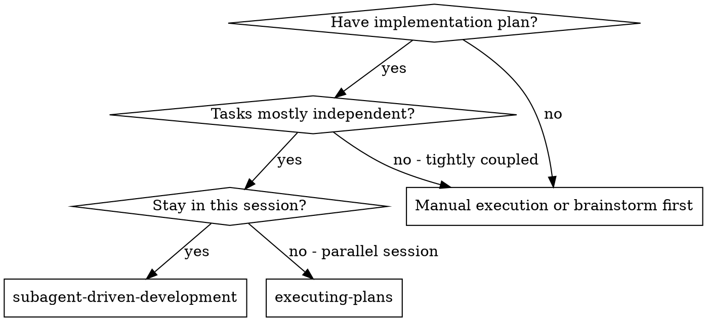
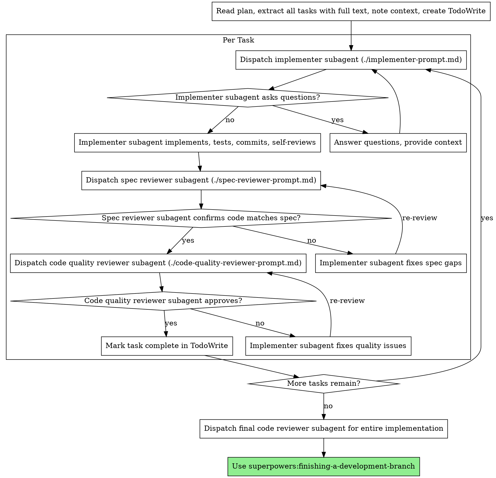
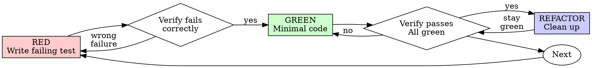

# Execute JSON Reader generated pages plan

**Session ID:** ses_1bff33569ffe1yJucsqr6FsvCF
**Created:** 5/19/2026, 2:44:00 PM
**Updated:** 5/19/2026, 3:20:58 PM

---

## User

# Subagent-Driven Development

Execute plan by dispatching fresh subagent per task, with two-stage review after each: spec compliance review first, then code quality review.

**Why subagents:** You delegate tasks to specialized agents with isolated context. By precisely crafting their instructions and context, you ensure they stay focused and succeed at their task. They should never inherit your session's context or history — you construct exactly what they need. This also preserves your own context for coordination work.

**Core principle:** Fresh subagent per task + two-stage review (spec then quality) = high quality, fast iteration

**Continuous execution:** Do not pause to check in with your human partner between tasks. Execute all tasks from the plan without stopping. The only reasons to stop are: BLOCKED status you cannot resolve, ambiguity that genuinely prevents progress, or all tasks complete. "Should I continue?" prompts and progress summaries waste their time — they asked you to execute the plan, so execute it.

## When to Use



**vs. Executing Plans (parallel session):**
- Same session (no context switch)
- Fresh subagent per task (no context pollution)
- Two-stage review after each task: spec compliance first, then code quality
- Faster iteration (no human-in-loop between tasks)

## The Process



## Model Selection

Use the least powerful model that can handle each role to conserve cost and increase speed.

**Mechanical implementation tasks** (isolated functions, clear specs, 1-2 files): use a fast, cheap model. Most implementation tasks are mechanical when the plan is well-specified.

**Integration and judgment tasks** (multi-file coordination, pattern matching, debugging): use a standard model.

**Architecture, design, and review tasks**: use the most capable available model.

**Task complexity signals:**
- Touches 1-2 files with a complete spec → cheap model
- Touches multiple files with integration concerns → standard model
- Requires design judgment or broad codebase understanding → most capable model

## Handling Implementer Status

Implementer subagents report one of four statuses. Handle each appropriately:

**DONE:** Proceed to spec compliance review.

**DONE_WITH_CONCERNS:** The implementer completed the work but flagged doubts. Read the concerns before proceeding. If the concerns are about correctness or scope, address them before review. If they're observations (e.g., "this file is getting large"), note them and proceed to review.

**NEEDS_CONTEXT:** The implementer needs information that wasn't provided. Provide the missing context and re-dispatch.

**BLOCKED:** The implementer cannot complete the task. Assess the blocker:
1. If it's a context problem, provide more context and re-dispatch with the same model
2. If the task requires more reasoning, re-dispatch with a more capable model
3. If the task is too large, break it into smaller pieces
4. If the plan itself is wrong, escalate to the human

**Never** ignore an escalation or force the same model to retry without changes. If the implementer said it's stuck, something needs to change.

## Prompt Templates

- `./implementer-prompt.md` - Dispatch implementer subagent
- `./spec-reviewer-prompt.md` - Dispatch spec compliance reviewer subagent
- `./code-quality-reviewer-prompt.md` - Dispatch code quality reviewer subagent

## Example Workflow

```
You: I'm using Subagent-Driven Development to execute this plan.

[Read plan file once: docs/superpowers/plans/feature-plan.md]
[Extract all 5 tasks with full text and context]
[Create TodoWrite with all tasks]

Task 1: Hook installation script

[Get Task 1 text and context (already extracted)]
[Dispatch implementation subagent with full task text + context]

Implementer: "Before I begin - should the hook be installed at user or system level?"

You: "User level (~/.config/superpowers/hooks/)"

Implementer: "Got it. Implementing now..."
[Later] Implementer:
  - Implemented install-hook command
  - Added tests, 5/5 passing
  - Self-review: Found I missed --force flag, added it
  - Committed

[Dispatch spec compliance reviewer]
Spec reviewer: ✅ Spec compliant - all requirements met, nothing extra

[Get git SHAs, dispatch code quality reviewer]
Code reviewer: Strengths: Good test coverage, clean. Issues: None. Approved.

[Mark Task 1 complete]

Task 2: Recovery modes

[Get Task 2 text and context (already extracted)]
[Dispatch implementation subagent with full task text + context]

Implementer: [No questions, proceeds]
Implementer:
  - Added verify/repair modes
  - 8/8 tests passing
  - Self-review: All good
  - Committed

[Dispatch spec compliance reviewer]
Spec reviewer: ❌ Issues:
  - Missing: Progress reporting (spec says "report every 100 items")
  - Extra: Added --json flag (not requested)

[Implementer fixes issues]
Implementer: Removed --json flag, added progress reporting

[Spec reviewer reviews again]
Spec reviewer: ✅ Spec compliant now

[Dispatch code quality reviewer]
Code reviewer: Strengths: Solid. Issues (Important): Magic number (100)

[Implementer fixes]
Implementer: Extracted PROGRESS_INTERVAL constant

[Code reviewer reviews again]
Code reviewer: ✅ Approved

[Mark Task 2 complete]

...

[After all tasks]
[Dispatch final code-reviewer]
Final reviewer: All requirements met, ready to merge

Done!
```

## Advantages

**vs. Manual execution:**
- Subagents follow TDD naturally
- Fresh context per task (no confusion)
- Parallel-safe (subagents don't interfere)
- Subagent can ask questions (before AND during work)

**vs. Executing Plans:**
- Same session (no handoff)
- Continuous progress (no waiting)
- Review checkpoints automatic

**Efficiency gains:**
- No file reading overhead (controller provides full text)
- Controller curates exactly what context is needed
- Subagent gets complete information upfront
- Questions surfaced before work begins (not after)

**Quality gates:**
- Self-review catches issues before handoff
- Two-stage review: spec compliance, then code quality
- Review loops ensure fixes actually work
- Spec compliance prevents over/under-building
- Code quality ensures implementation is well-built

**Cost:**
- More subagent invocations (implementer + 2 reviewers per task)
- Controller does more prep work (extracting all tasks upfront)
- Review loops add iterations
- But catches issues early (cheaper than debugging later)

## Red Flags

**Never:**
- Start implementation on main/master branch without explicit user consent
- Skip reviews (spec compliance OR code quality)
- Proceed with unfixed issues
- Dispatch multiple implementation subagents in parallel (conflicts)
- Make subagent read plan file (provide full text instead)
- Skip scene-setting context (subagent needs to understand where task fits)
- Ignore subagent questions (answer before letting them proceed)
- Accept "close enough" on spec compliance (spec reviewer found issues = not done)
- Skip review loops (reviewer found issues = implementer fixes = review again)
- Let implementer self-review replace actual review (both are needed)
- **Start code quality review before spec compliance is ✅** (wrong order)
- Move to next task while either review has open issues

**If subagent asks questions:**
- Answer clearly and completely
- Provide additional context if needed
- Don't rush them into implementation

**If reviewer finds issues:**
- Implementer (same subagent) fixes them
- Reviewer reviews again
- Repeat until approved
- Don't skip the re-review

**If subagent fails task:**
- Dispatch fix subagent with specific instructions
- Don't try to fix manually (context pollution)

## Integration

**Required workflow skills:**
- **superpowers:using-git-worktrees** - Ensures isolated workspace (creates one or verifies existing)
- **superpowers:writing-plans** - Creates the plan this skill executes
- **superpowers:requesting-code-review** - Code review template for reviewer subagents
- **superpowers:finishing-a-development-branch** - Complete development after all tasks

**Subagents should use:**
- **superpowers:test-driven-development** - Subagents follow TDD for each task

**Alternative workflow:**
- **superpowers:executing-plans** - Use for parallel session instead of same-session execution


i want to execute this plan @docs\superpowers\plans\2026-05-19-json-reader-generated-pages.md

---

## Assistant (Build · gpt-5.5 · 14.4s)

**Tool: skill**

**Input:**
```json
{
  "name": "subagent-driven-development"
}
```

**Output:**
```
<skill_content name="subagent-driven-development">
# Skill: subagent-driven-development

# Subagent-Driven Development

Execute plan by dispatching fresh subagent per task, with two-stage review after each: spec compliance review first, then code quality review.

**Why subagents:** You delegate tasks to specialized agents with isolated context. By precisely crafting their instructions and context, you ensure they stay focused and succeed at their task. They should never inherit your session's context or history — you construct exactly what they need. This also preserves your own context for coordination work.

**Core principle:** Fresh subagent per task + two-stage review (spec then quality) = high quality, fast iteration

**Continuous execution:** Do not pause to check in with your human partner between tasks. Execute all tasks from the plan without stopping. The only reasons to stop are: BLOCKED status you cannot resolve, ambiguity that genuinely prevents progress, or all tasks complete. "Should I continue?" prompts and progress summaries waste their time — they asked you to execute the plan, so execute it.

## When to Use


**vs. Executing Plans (parallel session):**
- Same session (no context switch)
- Fresh subagent per task (no context pollution)
- Two-stage review after each task: spec compliance first, then code quality
- Faster iteration (no human-in-loop between tasks)

## The Process


## Model Selection

Use the least powerful model that can handle each role to conserve cost and increase speed.

**Mechanical implementation tasks** (isolated functions, clear specs, 1-2 files): use a fast, cheap model. Most implementation tasks are mechanical when the plan is well-specified.

**Integration and judgment tasks** (multi-file coordination, pattern matching, debugging): use a standard model.

**Architecture, design, and review tasks**: use the most capable available model.

**Task complexity signals:**
- Touches 1-2 files with a complete spec → cheap model
- Touches multiple files with integration concerns → standard model
- Requires design judgment or broad codebase understanding → most capable model

## Handling Implementer Status

Implementer subagents report one of four statuses. Handle each appropriately:

**DONE:** Proceed to spec compliance review.

**DONE_WITH_CONCERNS:** The implementer completed the work but flagged doubts. Read the concerns before proceeding. If the concerns are about correctness or scope, address them before review. If they're observations (e.g., "this file is getting large"), note them and proceed to review.

**NEEDS_CONTEXT:** The implementer needs information that wasn't provided. Provide the missing context and re-dispatch.

**BLOCKED:** The implementer cannot complete the task. Assess the blocker:
1. If it's a context problem, provide more context and re-dispatch with the same model
2. If the task requires more reasoning, re-dispatch with a more capable model
3. If the task is too large, break it into smaller pieces
4. If the plan itself is wrong, escalate to the human

**Never** ignore an escalation or force the same model to retry without changes. If the implementer said it's stuck, something needs to change.

## Prompt Templates

- `./implementer-prompt.md` - Dispatch implementer subagent
- `./spec-reviewer-prompt.md` - Dispatch spec compliance reviewer subagent
- `./code-quality-reviewer-prompt.md` - Dispatch code quality reviewer subagent

## Example Workflow

```
You: I'm using Subagent-Driven Development to execute this plan.

[Read plan file once: docs/superpowers/plans/feature-plan.md]
[Extract all 5 tasks with full text and context]
[Create TodoWrite with all tasks]

Task 1: Hook installation script

[Get Task 1 text and context (already extracted)]
[Dispatch implementation subagent with full task text + context]

Implementer: "Before I begin - should the hook be installed at user or system level?"

You: "User level (~/.config/superpowers/hooks/)"

Implementer: "Got it. Implementing now..."
[Later] Implementer:
  - Implemented install-hook command
  - Added tests, 5/5 passing
  - Self-review: Found I missed --force flag, added it
  - Committed

[Dispatch spec compliance reviewer]
Spec reviewer: ✅ Spec compliant - all requirements met, nothing extra

[Get git SHAs, dispatch code quality reviewer]
Code reviewer: Strengths: Good test coverage, clean. Issues: None. Approved.

[Mark Task 1 complete]

Task 2: Recovery modes

[Get Task 2 text and context (already extracted)]
[Dispatch implementation subagent with full task text + context]

Implementer: [No questions, proceeds]
Implementer:
  - Added verify/repair modes
  - 8/8 tests passing
  - Self-review: All good
  - Committed

[Dispatch spec compliance reviewer]
Spec reviewer: ❌ Issues:
  - Missing: Progress reporting (spec says "report every 100 items")
  - Extra: Added --json flag (not requested)

[Implementer fixes issues]
Implementer: Removed --json flag, added progress reporting

[Spec reviewer reviews again]
Spec reviewer: ✅ Spec compliant now

[Dispatch code quality reviewer]
Code reviewer: Strengths: Solid. Issues (Important): Magic number (100)

[Implementer fixes]
Implementer: Extracted PROGRESS_INTERVAL constant

[Code reviewer reviews again]
Code reviewer: ✅ Approved

[Mark Task 2 complete]

...

[After all tasks]
[Dispatch final code-reviewer]
Final reviewer: All requirements met, ready to merge

Done!
```

## Advantages

**vs. Manual execution:**
- Subagents follow TDD naturally
- Fresh context per task (no confusion)
- Parallel-safe (subagents don't interfere)
- Subagent can ask questions (before AND during work)

**vs. Executing Plans:**
- Same session (no handoff)
- Continuous progress (no waiting)
- Review checkpoints automatic

**Efficiency gains:**
- No file reading overhead (controller provides full text)
- Controller curates exactly what context is needed
- Subagent gets complete information upfront
- Questions surfaced before work begins (not after)

**Quality gates:**
- Self-review catches issues before handoff
- Two-stage review: spec compliance, then code quality
- Review loops ensure fixes actually work
- Spec compliance prevents over/under-building
- Code quality ensures implementation is well-built

**Cost:**
- More subagent invocations (implementer + 2 reviewers per task)
- Controller does more prep work (extracting all tasks upfront)
- Review loops add iterations
- But catches issues early (cheaper than debugging later)

## Red Flags

**Never:**
- Start implementation on main/master branch without explicit user consent
- Skip reviews (spec compliance OR code quality)
- Proceed with unfixed issues
- Dispatch multiple implementation subagents in parallel (conflicts)
- Make subagent read plan file (provide full text instead)
- Skip scene-setting context (subagent needs to understand where task fits)
- Ignore subagent questions (answer before letting them proceed)
- Accept "close enough" on spec compliance (spec reviewer found issues = not done)
- Skip review loops (reviewer found issues = implementer fixes = review again)
- Let implementer self-review replace actual review (both are needed)
- **Start code quality review before spec compliance is ✅** (wrong order)
- Move to next task while either review has open issues

**If subagent asks questions:**
- Answer clearly and completely
- Provide additional context if needed
- Don't rush them into implementation

**If reviewer finds issues:**
- Implementer (same subagent) fixes them
- Reviewer reviews again
- Repeat until approved
- Don't skip the re-review

**If subagent fails task:**
- Dispatch fix subagent with specific instructions
- Don't try to fix manually (context pollution)

## Integration

**Required workflow skills:**
- **superpowers:using-git-worktrees** - Ensures isolated workspace (creates one or verifies existing)
- **superpowers:writing-plans** - Creates the plan this skill executes
- **superpowers:requesting-code-review** - Code review template for reviewer subagents
- **superpowers:finishing-a-development-branch** - Complete development after all tasks

**Subagents should use:**
- **superpowers:test-driven-development** - Subagents follow TDD for each task

**Alternative workflow:**
- **superpowers:executing-plans** - Use for parallel session instead of same-session execution

Base directory for this skill: file:///C:/Users/moame/.cache/opencode/packages/superpowers@git+https_/github.com/obra/superpowers.git/node_modules/superpowers/skills/subagent-driven-development
Relative paths in this skill (e.g., scripts/, reference/) are relative to this base directory.
Note: file list is sampled.

<skill_files>
<file>C:\Users\moame\.cache\opencode\packages\superpowers@git+https_\github.com\obra\superpowers.git\node_modules\superpowers\skills\subagent-driven-development\spec-reviewer-prompt.md</file>
<file>C:\Users\moame\.cache\opencode\packages\superpowers@git+https_\github.com\obra\superpowers.git\node_modules\superpowers\skills\subagent-driven-development\implementer-prompt.md</file>
<file>C:\Users\moame\.cache\opencode\packages\superpowers@git+https_\github.com\obra\superpowers.git\node_modules\superpowers\skills\subagent-driven-development\code-quality-reviewer-prompt.md</file>
</skill_files>
</skill_content>
```

**Tool: skill**

**Input:**
```json
{
  "name": "using-git-worktrees"
}
```

**Output:**
```
<skill_content name="using-git-worktrees">
# Skill: using-git-worktrees

# Using Git Worktrees

## Overview

Ensure work happens in an isolated workspace. Prefer your platform's native worktree tools. Fall back to manual git worktrees only when no native tool is available.

**Core principle:** Detect existing isolation first. Then use native tools. Then fall back to git. Never fight the harness.

**Announce at start:** "I'm using the using-git-worktrees skill to set up an isolated workspace."

## Step 0: Detect Existing Isolation

**Before creating anything, check if you are already in an isolated workspace.**

```bash
GIT_DIR=$(cd "$(git rev-parse --git-dir)" 2>/dev/null && pwd -P)
GIT_COMMON=$(cd "$(git rev-parse --git-common-dir)" 2>/dev/null && pwd -P)
BRANCH=$(git branch --show-current)
```

**Submodule guard:** `GIT_DIR != GIT_COMMON` is also true inside git submodules. Before concluding "already in a worktree," verify you are not in a submodule:

```bash
# If this returns a path, you're in a submodule, not a worktree — treat as normal repo
git rev-parse --show-superproject-working-tree 2>/dev/null
```

**If `GIT_DIR != GIT_COMMON` (and not a submodule):** You are already in a linked worktree. Skip to Step 3 (Project Setup). Do NOT create another worktree.

Report with branch state:
- On a branch: "Already in isolated workspace at `<path>` on branch `<name>`."
- Detached HEAD: "Already in isolated workspace at `<path>` (detached HEAD, externally managed). Branch creation needed at finish time."

**If `GIT_DIR == GIT_COMMON` (or in a submodule):** You are in a normal repo checkout.

Has the user already indicated their worktree preference in your instructions? If not, ask for consent before creating a worktree:

> "Would you like me to set up an isolated worktree? It protects your current branch from changes."

Honor any existing declared preference without asking. If the user declines consent, work in place and skip to Step 3.

## Step 1: Create Isolated Workspace

**You have two mechanisms. Try them in this order.**

### 1a. Native Worktree Tools (preferred)

The user has asked for an isolated workspace (Step 0 consent). Do you already have a way to create a worktree? It might be a tool with a name like `EnterWorktree`, `WorktreeCreate`, a `/worktree` command, or a `--worktree` flag. If you do, use it and skip to Step 3.

Native tools handle directory placement, branch creation, and cleanup automatically. Using `git worktree add` when you have a native tool creates phantom state your harness can't see or manage.

Only proceed to Step 1b if you have no native worktree tool available.

### 1b. Git Worktree Fallback

**Only use this if Step 1a does not apply** — you have no native worktree tool available. Create a worktree manually using git.

#### Directory Selection

Follow this priority order. Explicit user preference always beats observed filesystem state.

1. **Check your instructions for a declared worktree directory preference.** If the user has already specified one, use it without asking.

2. **Check for an existing project-local worktree directory:**
   ```bash
   ls -d .worktrees 2>/dev/null     # Preferred (hidden)
   ls -d worktrees 2>/dev/null      # Alternative
   ```
   If found, use it. If both exist, `.worktrees` wins.

3. **Check for an existing global directory:**
   ```bash
   project=$(basename "$(git rev-parse --show-toplevel)")
   ls -d ~/.config/superpowers/worktrees/$project 2>/dev/null
   ```
   If found, use it (backward compatibility with legacy global path).

4. **If there is no other guidance available**, default to `.worktrees/` at the project root.

#### Safety Verification (project-local directories only)

**MUST verify directory is ignored before creating worktree:**

```bash
git check-ignore -q .worktrees 2>/dev/null || git check-ignore -q worktrees 2>/dev/null
```

**If NOT ignored:** Add to .gitignore, commit the change, then proceed.

**Why critical:** Prevents accidentally committing worktree contents to repository.

Global directories (`~/.config/superpowers/worktrees/`) need no verification.

#### Create the Worktree

```bash
project=$(basename "$(git rev-parse --show-toplevel)")

# Determine path based on chosen location
# For project-local: path="$LOCATION/$BRANCH_NAME"
# For global: path="~/.config/superpowers/worktrees/$project/$BRANCH_NAME"

git worktree add "$path" -b "$BRANCH_NAME"
cd "$path"
```

**Sandbox fallback:** If `git worktree add` fails with a permission error (sandbox denial), tell the user the sandbox blocked worktree creation and you're working in the current directory instead. Then run setup and baseline tests in place.

## Step 3: Project Setup

Auto-detect and run appropriate setup:

```bash
# Node.js
if [ -f package.json ]; then npm install; fi

# Rust
if [ -f Cargo.toml ]; then cargo build; fi

# Python
if [ -f requirements.txt ]; then pip install -r requirements.txt; fi
if [ -f pyproject.toml ]; then poetry install; fi

# Go
if [ -f go.mod ]; then go mod download; fi
```

## Step 4: Verify Clean Baseline

Run tests to ensure workspace starts clean:

```bash
# Use project-appropriate command
npm test / cargo test / pytest / go test ./...
```

**If tests fail:** Report failures, ask whether to proceed or investigate.

**If tests pass:** Report ready.

### Report

```
Worktree ready at <full-path>
Tests passing (<N> tests, 0 failures)
Ready to implement <feature-name>
```

## Quick Reference

| Situation | Action |
|-----------|--------|
| Already in linked worktree | Skip creation (Step 0) |
| In a submodule | Treat as normal repo (Step 0 guard) |
| Native worktree tool available | Use it (Step 1a) |
| No native tool | Git worktree fallback (Step 1b) |
| `.worktrees/` exists | Use it (verify ignored) |
| `worktrees/` exists | Use it (verify ignored) |
| Both exist | Use `.worktrees/` |
| Neither exists | Check instruction file, then default `.worktrees/` |
| Global path exists | Use it (backward compat) |
| Directory not ignored | Add to .gitignore + commit |
| Permission error on create | Sandbox fallback, work in place |
| Tests fail during baseline | Report failures + ask |
| No package.json/Cargo.toml | Skip dependency install |

## Common Mistakes

### Fighting the harness

- **Problem:** Using `git worktree add` when the platform already provides isolation
- **Fix:** Step 0 detects existing isolation. Step 1a defers to native tools.

### Skipping detection

- **Problem:** Creating a nested worktree inside an existing one
- **Fix:** Always run Step 0 before creating anything

### Skipping ignore verification

- **Problem:** Worktree contents get tracked, pollute git status
- **Fix:** Always use `git check-ignore` before creating project-local worktree

### Assuming directory location

- **Problem:** Creates inconsistency, violates project conventions
- **Fix:** Follow priority: existing > global legacy > instruction file > default

### Proceeding with failing tests

- **Problem:** Can't distinguish new bugs from pre-existing issues
- **Fix:** Report failures, get explicit permission to proceed

## Red Flags

**Never:**
- Create a worktree when Step 0 detects existing isolation
- Use `git worktree add` when you have a native worktree tool (e.g., `EnterWorktree`). This is the #1 mistake — if you have it, use it.
- Skip Step 1a by jumping straight to Step 1b's git commands
- Create worktree without verifying it's ignored (project-local)
- Skip baseline test verification
- Proceed with failing tests without asking

**Always:**
- Run Step 0 detection first
- Prefer native tools over git fallback
- Follow directory priority: existing > global legacy > instruction file > default
- Verify directory is ignored for project-local
- Auto-detect and run project setup
- Verify clean test baseline

Base directory for this skill: file:///C:/Users/moame/.cache/opencode/packages/superpowers@git+https_/github.com/obra/superpowers.git/node_modules/superpowers/skills/using-git-worktrees
Relative paths in this skill (e.g., scripts/, reference/) are relative to this base directory.
Note: file list is sampled.

<skill_files>

</skill_files>
</skill_content>
```

---

## Assistant (Build · gpt-5.5 · 17.7s)

I'm using `subagent-driven-development` to execute the plan task-by-task, and `using-git-worktrees` to verify whether this workspace is already isolated before making changes.

**Tool: bash**

**Input:**
```json
{
  "command": "$gitDir = (Resolve-Path -LiteralPath (git rev-parse --git-dir)).Path; $gitCommon = (Resolve-Path -LiteralPath (git rev-parse --git-common-dir)).Path; $branch = git branch --show-current; $super = git rev-parse --show-superproject-working-tree 2>$null; \"GIT_DIR=$gitDir\"; \"GIT_COMMON=$gitCommon\"; \"BRANCH=$branch\"; \"SUPERPROJECT=$super\"",
  "description": "Detects git workspace isolation state"
}
```

**Output:**
```
GIT_DIR=C:\programing\nodeJs\json-reader-superpowers\.git
GIT_COMMON=C:\programing\nodeJs\json-reader-superpowers\.git
BRANCH=main
SUPERPROJECT=

```

**Tool: glob**

**Input:**
```json
{
  "pattern": "package.json"
}
```

**Output:**
```
C:\programing\nodeJs\json-reader-superpowers\package.json
```

**Tool: glob**

**Input:**
```json
{
  "pattern": "AGENTS.md"
}
```

**Output:**
```
No files found
```

**Tool: glob**

**Input:**
```json
{
  "pattern": "CLAUDE.md"
}
```

**Output:**
```
No files found
```

**Tool: glob**

**Input:**
```json
{
  "pattern": "GEMINI.md"
}
```

**Output:**
```
No files found
```

---

## Assistant (Build · gpt-5.5 · 36.2s)

**Tool: question**

**Input:**
```json
{
  "questions": [
    {
      "header": "Worktree Setup",
      "question": "This is a normal checkout on `main`. Would you like me to set up an isolated worktree before executing the plan? It protects your current branch from changes.",
      "options": [
        {
          "label": "Create worktree",
          "description": "Use an isolated branch/worktree for the implementation."
        },
        {
          "label": "Work in place",
          "description": "Proceed in the current checkout on `main`."
        }
      ]
    }
  ]
}
```

**Output:**
```
User has answered your questions: "This is a normal checkout on `main`. Would you like me to set up an isolated worktree before executing the plan? It protects your current branch from changes."="Work in place". You can now continue with the user's answers in mind.
```

---

## Assistant (Build · gpt-5.5 · 11.1s)

Proceeding in the current checkout on `main` as requested. I’ll run the project setup/baseline first, then dispatch each plan task through implementation and review checkpoints.

**Tool: skill**

**Input:**
```json
{
  "name": "test-driven-development"
}
```

**Output:**
```
<skill_content name="test-driven-development">
# Skill: test-driven-development

# Test-Driven Development (TDD)

## Overview

Write the test first. Watch it fail. Write minimal code to pass.

**Core principle:** If you didn't watch the test fail, you don't know if it tests the right thing.

**Violating the letter of the rules is violating the spirit of the rules.**

## When to Use

**Always:**
- New features
- Bug fixes
- Refactoring
- Behavior changes

**Exceptions (ask your human partner):**
- Throwaway prototypes
- Generated code
- Configuration files

Thinking "skip TDD just this once"? Stop. That's rationalization.

## The Iron Law

```
NO PRODUCTION CODE WITHOUT A FAILING TEST FIRST
```

Write code before the test? Delete it. Start over.

**No exceptions:**
- Don't keep it as "reference"
- Don't "adapt" it while writing tests
- Don't look at it
- Delete means delete

Implement fresh from tests. Period.

## Red-Green-Refactor



### RED - Write Failing Test

Write one minimal test showing what should happen.

<Good>
```typescript
test('retries failed operations 3 times', async () => {
  let attempts = 0;
  const operation = () => {
    attempts++;
    if (attempts < 3) throw new Error('fail');
    return 'success';
  };

  const result = await retryOperation(operation);

  expect(result).toBe('success');
  expect(attempts).toBe(3);
});
```
Clear name, tests real behavior, one thing
</Good>

<Bad>
```typescript
test('retry works', async () => {
  const mock = jest.fn()
    .mockRejectedValueOnce(new Error())
    .mockRejectedValueOnce(new Error())
    .mockResolvedValueOnce('success');
  await retryOperation(mock);
  expect(mock).toHaveBeenCalledTimes(3);
});
```
Vague name, tests mock not code
</Bad>

**Requirements:**
- One behavior
- Clear name
- Real code (no mocks unless unavoidable)

### Verify RED - Watch It Fail

**MANDATORY. Never skip.**

```bash
npm test path/to/test.test.ts
```

Confirm:
- Test fails (not errors)
- Failure message is expected
- Fails because feature missing (not typos)

**Test passes?** You're testing existing behavior. Fix test.

**Test errors?** Fix error, re-run until it fails correctly.

### GREEN - Minimal Code

Write simplest code to pass the test.

<Good>
```typescript
async function retryOperation<T>(fn: () => Promise<T>): Promise<T> {
  for (let i = 0; i < 3; i++) {
    try {
      return await fn();
    } catch (e) {
      if (i === 2) throw e;
    }
  }
  throw new Error('unreachable');
}
```
Just enough to pass
</Good>

<Bad>
```typescript
async function retryOperation<T>(
  fn: () => Promise<T>,
  options?: {
    maxRetries?: number;
    backoff?: 'linear' | 'exponential';
    onRetry?: (attempt: number) => void;
  }
): Promise<T> {
  // YAGNI
}
```
Over-engineered
</Bad>

Don't add features, refactor other code, or "improve" beyond the test.

### Verify GREEN - Watch It Pass

**MANDATORY.**

```bash
npm test path/to/test.test.ts
```

Confirm:
- Test passes
- Other tests still pass
- Output pristine (no errors, warnings)

**Test fails?** Fix code, not test.

**Other tests fail?** Fix now.

### REFACTOR - Clean Up

After green only:
- Remove duplication
- Improve names
- Extract helpers

Keep tests green. Don't add behavior.

### Repeat

Next failing test for next feature.

## Good Tests

| Quality | Good | Bad |
|---------|------|-----|
| **Minimal** | One thing. "and" in name? Split it. | `test('validates email and domain and whitespace')` |
| **Clear** | Name describes behavior | `test('test1')` |
| **Shows intent** | Demonstrates desired API | Obscures what code should do |

## Why Order Matters

**"I'll write tests after to verify it works"**

Tests written after code pass immediately. Passing immediately proves nothing:
- Might test wrong thing
- Might test implementation, not behavior
- Might miss edge cases you forgot
- You never saw it catch the bug

Test-first forces you to see the test fail, proving it actually tests something.

**"I already manually tested all the edge cases"**

Manual testing is ad-hoc. You think you tested everything but:
- No record of what you tested
- Can't re-run when code changes
- Easy to forget cases under pressure
- "It worked when I tried it" ≠ comprehensive

Automated tests are systematic. They run the same way every time.

**"Deleting X hours of work is wasteful"**

Sunk cost fallacy. The time is already gone. Your choice now:
- Delete and rewrite with TDD (X more hours, high confidence)
- Keep it and add tests after (30 min, low confidence, likely bugs)

The "waste" is keeping code you can't trust. Working code without real tests is technical debt.

**"TDD is dogmatic, being pragmatic means adapting"**

TDD IS pragmatic:
- Finds bugs before commit (faster than debugging after)
- Prevents regressions (tests catch breaks immediately)
- Documents behavior (tests show how to use code)
- Enables refactoring (change freely, tests catch breaks)

"Pragmatic" shortcuts = debugging in production = slower.

**"Tests after achieve the same goals - it's spirit not ritual"**

No. Tests-after answer "What does this do?" Tests-first answer "What should this do?"

Tests-after are biased by your implementation. You test what you built, not what's required. You verify remembered edge cases, not discovered ones.

Tests-first force edge case discovery before implementing. Tests-after verify you remembered everything (you didn't).

30 minutes of tests after ≠ TDD. You get coverage, lose proof tests work.

## Common Rationalizations

| Excuse | Reality |
|--------|---------|
| "Too simple to test" | Simple code breaks. Test takes 30 seconds. |
| "I'll test after" | Tests passing immediately prove nothing. |
| "Tests after achieve same goals" | Tests-after = "what does this do?" Tests-first = "what should this do?" |
| "Already manually tested" | Ad-hoc ≠ systematic. No record, can't re-run. |
| "Deleting X hours is wasteful" | Sunk cost fallacy. Keeping unverified code is technical debt. |
| "Keep as reference, write tests first" | You'll adapt it. That's testing after. Delete means delete. |
| "Need to explore first" | Fine. Throw away exploration, start with TDD. |
| "Test hard = design unclear" | Listen to test. Hard to test = hard to use. |
| "TDD will slow me down" | TDD faster than debugging. Pragmatic = test-first. |
| "Manual test faster" | Manual doesn't prove edge cases. You'll re-test every change. |
| "Existing code has no tests" | You're improving it. Add tests for existing code. |

## Red Flags - STOP and Start Over

- Code before test
- Test after implementation
- Test passes immediately
- Can't explain why test failed
- Tests added "later"
- Rationalizing "just this once"
- "I already manually tested it"
- "Tests after achieve the same purpose"
- "It's about spirit not ritual"
- "Keep as reference" or "adapt existing code"
- "Already spent X hours, deleting is wasteful"
- "TDD is dogmatic, I'm being pragmatic"
- "This is different because..."

**All of these mean: Delete code. Start over with TDD.**

## Example: Bug Fix

**Bug:** Empty email accepted

**RED**
```typescript
test('rejects empty email', async () => {
  const result = await submitForm({ email: '' });
  expect(result.error).toBe('Email required');
});
```

**Verify RED**
```bash
$ npm test
FAIL: expected 'Email required', got undefined
```

**GREEN**
```typescript
function submitForm(data: FormData) {
  if (!data.email?.trim()) {
    return { error: 'Email required' };
  }
  // ...
}
```

**Verify GREEN**
```bash
$ npm test
PASS
```

**REFACTOR**
Extract validation for multiple fields if needed.

## Verification Checklist

Before marking work complete:

- [ ] Every new function/method has a test
- [ ] Watched each test fail before implementing
- [ ] Each test failed for expected reason (feature missing, not typo)
- [ ] Wrote minimal code to pass each test
- [ ] All tests pass
- [ ] Output pristine (no errors, warnings)
- [ ] Tests use real code (mocks only if unavoidable)
- [ ] Edge cases and errors covered

Can't check all boxes? You skipped TDD. Start over.

## When Stuck

| Problem | Solution |
|---------|----------|
| Don't know how to test | Write wished-for API. Write assertion first. Ask your human partner. |
| Test too complicated | Design too complicated. Simplify interface. |
| Must mock everything | Code too coupled. Use dependency injection. |
| Test setup huge | Extract helpers. Still complex? Simplify design. |

## Debugging Integration

Bug found? Write failing test reproducing it. Follow TDD cycle. Test proves fix and prevents regression.

Never fix bugs without a test.

## Testing Anti-Patterns

When adding mocks or test utilities, read @testing-anti-patterns.md to avoid common pitfalls:
- Testing mock behavior instead of real behavior
- Adding test-only methods to production classes
- Mocking without understanding dependencies

## Final Rule

```
Production code → test exists and failed first
Otherwise → not TDD
```

No exceptions without your human partner's permission.

Base directory for this skill: file:///C:/Users/moame/.cache/opencode/packages/superpowers@git+https_/github.com/obra/superpowers.git/node_modules/superpowers/skills/test-driven-development
Relative paths in this skill (e.g., scripts/, reference/) are relative to this base directory.
Note: file list is sampled.

<skill_files>
<file>C:\Users\moame\.cache\opencode\packages\superpowers@git+https_\github.com\obra\superpowers.git\node_modules\superpowers\skills\test-driven-development\testing-anti-patterns.md</file>
</skill_files>
</skill_content>
```

**Tool: skill**

**Input:**
```json
{
  "name": "requesting-code-review"
}
```

**Output:**
```
<skill_content name="requesting-code-review">
# Skill: requesting-code-review

# Requesting Code Review

Dispatch a code reviewer subagent to catch issues before they cascade. The reviewer gets precisely crafted context for evaluation — never your session's history. This keeps the reviewer focused on the work product, not your thought process, and preserves your own context for continued work.

**Core principle:** Review early, review often.

## When to Request Review

**Mandatory:**
- After each task in subagent-driven development
- After completing major feature
- Before merge to main

**Optional but valuable:**
- When stuck (fresh perspective)
- Before refactoring (baseline check)
- After fixing complex bug

## How to Request

**1. Get git SHAs:**
```bash
BASE_SHA=$(git rev-parse HEAD~1)  # or origin/main
HEAD_SHA=$(git rev-parse HEAD)
```

**2. Dispatch code reviewer subagent:**

Use Task tool with `general-purpose` type, fill template at `code-reviewer.md`

**Placeholders:**
- `{DESCRIPTION}` - Brief summary of what you built
- `{PLAN_OR_REQUIREMENTS}` - What it should do
- `{BASE_SHA}` - Starting commit
- `{HEAD_SHA}` - Ending commit

**3. Act on feedback:**
- Fix Critical issues immediately
- Fix Important issues before proceeding
- Note Minor issues for later
- Push back if reviewer is wrong (with reasoning)

## Example

```
[Just completed Task 2: Add verification function]

You: Let me request code review before proceeding.

BASE_SHA=$(git log --oneline | grep "Task 1" | head -1 | awk '{print $1}')
HEAD_SHA=$(git rev-parse HEAD)

[Dispatch code reviewer subagent]
  DESCRIPTION: Added verifyIndex() and repairIndex() with 4 issue types
  PLAN_OR_REQUIREMENTS: Task 2 from docs/superpowers/plans/deployment-plan.md
  BASE_SHA: a7981ec
  HEAD_SHA: 3df7661

[Subagent returns]:
  Strengths: Clean architecture, real tests
  Issues:
    Important: Missing progress indicators
    Minor: Magic number (100) for reporting interval
  Assessment: Ready to proceed

You: [Fix progress indicators]
[Continue to Task 3]
```

## Integration with Workflows

**Subagent-Driven Development:**
- Review after EACH task
- Catch issues before they compound
- Fix before moving to next task

**Executing Plans:**
- Review after each task or at natural checkpoints
- Get feedback, apply, continue

**Ad-Hoc Development:**
- Review before merge
- Review when stuck

## Red Flags

**Never:**
- Skip review because "it's simple"
- Ignore Critical issues
- Proceed with unfixed Important issues
- Argue with valid technical feedback

**If reviewer wrong:**
- Push back with technical reasoning
- Show code/tests that prove it works
- Request clarification

See template at: requesting-code-review/code-reviewer.md

Base directory for this skill: file:///C:/Users/moame/.cache/opencode/packages/superpowers@git+https_/github.com/obra/superpowers.git/node_modules/superpowers/skills/requesting-code-review
Relative paths in this skill (e.g., scripts/, reference/) are relative to this base directory.
Note: file list is sampled.

<skill_files>
<file>C:\Users\moame\.cache\opencode\packages\superpowers@git+https_\github.com\obra\superpowers.git\node_modules\superpowers\skills\requesting-code-review\code-reviewer.md</file>
</skill_files>
</skill_content>
```

---

## Assistant (Build · gpt-5.5 · 16.4s)

**Tool: todowrite**

**Input:**
```json
{
  "todos": [
    {
      "content": "Task 1: Slug Page Renderer",
      "status": "pending",
      "priority": "high"
    },
    {
      "content": "Task 2: Generate Slug Files",
      "status": "pending",
      "priority": "high"
    },
    {
      "content": "Task 3: URL Query Behavior Test Coverage",
      "status": "pending",
      "priority": "medium"
    },
    {
      "content": "Final review and completion verification",
      "status": "pending",
      "priority": "medium"
    }
  ]
}
```

**Output:**
```
[
  {
    "content": "Task 1: Slug Page Renderer",
    "status": "pending",
    "priority": "high"
  },
  {
    "content": "Task 2: Generate Slug Files",
    "status": "pending",
    "priority": "high"
  },
  {
    "content": "Task 3: URL Query Behavior Test Coverage",
    "status": "pending",
    "priority": "medium"
  },
  {
    "content": "Final review and completion verification",
    "status": "pending",
    "priority": "medium"
  }
]
```

---

## Assistant (Build · gpt-5.5 · 9.4s)

I loaded the required TDD and code review workflows. I’ll now verify the baseline before starting Task 1.

**Tool: read**

**Input:**
```json
{
  "filePath": "C:\\programing\\nodeJs\\json-reader-superpowers\\package.json"
}
```

**Output:**
```
<path>C:\programing\nodeJs\json-reader-superpowers\package.json</path>
<type>file</type>
<content>
1: {
2:   "name": "json-reader-superpowers",
3:   "version": "1.0.0",
4:   "description": "Static JSON reader site generator",
5:   "main": "src/index.js",
6:   "scripts": {
7:     "build": "node src/index.js",
8:     "test": "node --test"
9:   },
10:   "license": "MIT"
11: }

(End of file - total 11 lines)
</content>
```

**Tool: bash**

**Input:**
```json
{
  "command": "git status --short",
  "description": "Shows current git working changes"
}
```

**Output:**
```
(no output)
```

---

## Assistant (Build · gpt-5.5 · 5.7s)

**Tool: bash**

**Input:**
```json
{
  "command": "npm install",
  "description": "Installs project npm dependencies",
  "timeout": 120000
}
```

**Output:**
```

up to date, audited 1 package in 678ms

found 0 vulnerabilities

```

**Tool: glob**

**Input:**
```json
{
  "pattern": "src/*.js"
}
```

**Output:**
```
C:\programing\nodeJs\json-reader-superpowers\src\validator.js
C:\programing\nodeJs\json-reader-superpowers\src\reader.js
C:\programing\nodeJs\json-reader-superpowers\src\index.js
C:\programing\nodeJs\json-reader-superpowers\src\html.js
C:\programing\nodeJs\json-reader-superpowers\src\generator.js
```

**Tool: glob**

**Input:**
```json
{
  "pattern": "test/*.js"
}
```

**Output:**
```
C:\programing\nodeJs\json-reader-superpowers\test\validator.test.js
C:\programing\nodeJs\json-reader-superpowers\test\reader.test.js
C:\programing\nodeJs\json-reader-superpowers\test\generator.test.js
C:\programing\nodeJs\json-reader-superpowers\test\data-pipeline.test.js
```

---

## Assistant (Build · gpt-5.5 · 3.8s)

**Tool: bash**

**Input:**
```json
{
  "command": "npm test",
  "description": "Runs baseline test suite",
  "timeout": 120000
}
```

**Output:**
```

> json-reader-superpowers@1.0.0 test
> node --test

TAP version 13
# Subtest: collectBuildState validates objects and groups published slugs newest first
ok 1 - collectBuildState validates objects and groups published slugs newest first
  ---
  duration_ms: 41.0066
  type: 'test'
  ...
# Subtest: collectBuildState records invalid object warnings and file summaries
ok 2 - collectBuildState records invalid object warnings and file summaries
  ---
  duration_ms: 6.4772
  type: 'test'
  ...
# Subtest: CLI entrypoint exports main and source stylesheet exists
ok 3 - CLI entrypoint exports main and source stylesheet exists
  ---
  duration_ms: 12.0665
  type: 'test'
  ...
# Subtest: CLI entrypoint finds bundled stylesheet from another cwd
ok 4 - CLI entrypoint finds bundled stylesheet from another cwd
  ---
  duration_ms: 88.9757
  type: 'test'
  ...
# Subtest: renderDashboard returns an offline dashboard document
ok 5 - renderDashboard returns an offline dashboard document
  ---
  duration_ms: 0.4415
  type: 'test'
  ...
# Subtest: buildSite writes dashboard and stylesheet
ok 6 - buildSite writes dashboard and stylesheet
  ---
  duration_ms: 10.5917
  type: 'test'
  ...
# Subtest: buildSite rejects output directory that overlaps input data
ok 7 - buildSite rejects output directory that overlaps input data
  ---
  duration_ms: 4.253
  type: 'test'
  ...
# Subtest: buildSite rejects output directory that contains data path with dot-dot prefix segment
ok 8 - buildSite rejects output directory that contains data path with dot-dot prefix segment
  ---
  duration_ms: 3.932
  type: 'test'
  ...
# Subtest: cleanOutput rejects empty output directory
ok 9 - cleanOutput rejects empty output directory
  ---
  duration_ms: 0.279
  type: 'test'
  ...
# Subtest: buildSite rejects empty output directory
ok 10 - buildSite rejects empty output directory
  ---
  duration_ms: 0.3143
  type: 'test'
  ...
# Subtest: buildSite rejects null output directory
ok 11 - buildSite rejects null output directory
  ---
  duration_ms: 0.4266
  type: 'test'
  ...
# Subtest: renderDashboard links slug cards and per-file slug counts
ok 12 - renderDashboard links slug cards and per-file slug counts
  ---
  duration_ms: 0.6355
  type: 'test'
  ...
# Subtest: renderDashboard URL-encodes slug href path segments
ok 13 - renderDashboard URL-encodes slug href path segments
  ---
  duration_ms: 0.2795
  type: 'test'
  ...
# Subtest: readJsonFiles returns a warning when data folder is missing
ok 14 - readJsonFiles returns a warning when data folder is missing
  ---
  duration_ms: 10.417
  type: 'test'
  ...
# Subtest: readJsonFiles reads a single object JSON file
ok 15 - readJsonFiles reads a single object JSON file
  ---
  duration_ms: 5.9119
  type: 'test'
  ...
# Subtest: readJsonFiles reads array JSON files
ok 16 - readJsonFiles reads array JSON files
  ---
  duration_ms: 4.0904
  type: 'test'
  ...
# Subtest: readJsonFiles skips invalid JSON files with warnings
ok 17 - readJsonFiles skips invalid JSON files with warnings
  ---
  duration_ms: 5.3226
  type: 'test'
  ...
# Subtest: readJsonFiles skips primitive JSON roots with warnings
ok 18 - readJsonFiles skips primitive JSON roots with warnings
  ---
  duration_ms: 3.8121
  type: 'test'
  ...
# Subtest: validateObject normalizes valid published objects
ok 19 - validateObject normalizes valid published objects
  ---
  duration_ms: 4.3236
  type: 'test'
  ...
# Subtest: validateObject accepts draft true and marks unpublished
ok 20 - validateObject accepts draft true and marks unpublished
  ---
  duration_ms: 0.2942
  type: 'test'
  ...
# Subtest: validateObject rejects missing required strings
ok 21 - validateObject rejects missing required strings
  ---
  duration_ms: 0.3289
  type: 'test'
  ...
# Subtest: validateObject rejects impossible YYYY-MM-DD dates
ok 22 - validateObject rejects impossible YYYY-MM-DD dates
  ---
  duration_ms: 0.2803
  type: 'test'
  ...
# Subtest: validateObject rejects non-string tags
ok 23 - validateObject rejects non-string tags
  ---
  duration_ms: 0.2149
  type: 'test'
  ...
1..23
# tests 23
# suites 0
# pass 23
# fail 0
# cancelled 0
# skipped 0
# todo 0
# duration_ms 251.8828

```

---

## Assistant (Build · gpt-5.5 · 9.1s)

Baseline is clean: `npm test` passes 23 tests. Starting Task 1 now with the required failing-test-first cycle.

**Tool: todowrite**

**Input:**
```json
{
  "todos": [
    {
      "content": "Task 1: Slug Page Renderer",
      "status": "in_progress",
      "priority": "high"
    },
    {
      "content": "Task 2: Generate Slug Files",
      "status": "pending",
      "priority": "high"
    },
    {
      "content": "Task 3: URL Query Behavior Test Coverage",
      "status": "pending",
      "priority": "medium"
    },
    {
      "content": "Final review and completion verification",
      "status": "pending",
      "priority": "medium"
    }
  ]
}
```

**Output:**
```
[
  {
    "content": "Task 1: Slug Page Renderer",
    "status": "in_progress",
    "priority": "high"
  },
  {
    "content": "Task 2: Generate Slug Files",
    "status": "pending",
    "priority": "high"
  },
  {
    "content": "Task 3: URL Query Behavior Test Coverage",
    "status": "pending",
    "priority": "medium"
  },
  {
    "content": "Final review and completion verification",
    "status": "pending",
    "priority": "medium"
  }
]
```

---

## Assistant (Build · gpt-5.5 · 5.2s)

Task 1 edit: adding the slug page unit test exactly from the plan, then I’ll run it to confirm it fails before changing `src/html.js`.

**Tool: read**

**Input:**
```json
{
  "filePath": "C:\\programing\\nodeJs\\json-reader-superpowers\\src\\html.js"
}
```

**Output:**
```
<path>C:\programing\nodeJs\json-reader-superpowers\src\html.js</path>
<type>file</type>
<content>
1: function escapeHtml(value) {
2:   return String(value)
3:     .replaceAll('&', '&amp;')
4:     .replaceAll('<', '&lt;')
5:     .replaceAll('>', '&gt;')
6:     .replaceAll('"', '&quot;')
7:     .replaceAll("'", '&#39;');
8: }
9: 
10: function renderDashboard({ stats, warnings, slugGroups, fileSummaries }) {
11:   const slugCards = Array.from(slugGroups.entries())
12:     .map(([slug, objects]) => `<a class="slug-card" href="${encodeURIComponent(slug)}.html"><strong>${escapeHtml(slug)}</strong><span>${objects.length} published objects</span></a>`)
13:     .join('');
14: 
15:   const warningItems = warnings
16:     .map((warning) => `<li>${escapeHtml(warning)}</li>`)
17:     .join('');
18: 
19:   const fileRows = fileSummaries
20:     .map((file) => {
21:       const slugLinks = Array.from(file.publishedSlugCounts.entries())
22:         .map(([slug, count]) => `<a href="${encodeURIComponent(slug)}.html?file=${encodeURIComponent(file.fileName)}">${escapeHtml(slug)} (${count})</a>`)
23:         .join(', ');
24: 
25:       return `<tr><td>${escapeHtml(file.fileName)}</td><td>${file.validObjects}</td><td>${file.publishedObjects}</td><td>${file.draftObjects}</td><td>${slugLinks || 'No published slugs'}</td></tr>`;
26:     })
27:     .join('');
28: 
29:   return `<!doctype html>
30: <html lang="en">
31: <head>
32:   <meta charset="utf-8">
33:   <meta name="viewport" content="width=device-width, initial-scale=1">
34:   <title>JSON Reader Dashboard</title>
35:   <link rel="stylesheet" href="assets/style.css">
36: </head>
37: <body>
38:   <main class="page-shell">
39:     <header class="hero">
40:       <p class="eyebrow">Static JSON Reader</p>
41:       <h1>JSON Reader Dashboard</h1>
42:     </header>
43:     <section class="stats-grid" aria-label="Build statistics">
44:       <article class="stat-card"><strong>${stats.filesRead}</strong><span>${stats.filesRead} JSON files read</span></article>
45:       <article class="stat-card"><strong>${stats.validObjects}</strong><span>valid objects</span></article>
46:       <article class="stat-card"><strong>${stats.publishedObjects}</strong><span>published objects</span></article>
47:       <article class="stat-card"><strong>${stats.draftObjects}</strong><span>draft objects</span></article>
48:       <article class="stat-card"><strong>${stats.uniquePublishedSlugs}</strong><span>unique published slugs</span></article>
49:       <article class="stat-card"><strong>${stats.warningCount}</strong><span>warnings</span></article>
50:     </section>
51:     <section class="panel">
52:       <h2>Published slugs</h2>
53:       <div class="slug-grid">${slugCards || '<p>No published slugs found.</p>'}</div>
54:     </section>
55:     <section class="panel">
56:       <h2>Warnings</h2>
57:       <ul>${warningItems || '<li>No warnings.</li>'}</ul>
58:     </section>
59:     <section class="panel">
60:       <h2>JSON files</h2>
61:       <table>
62:         <thead><tr><th>File name</th><th>Valid objects</th><th>Published</th><th>Drafts</th><th>Published slug counts</th></tr></thead>
63:         <tbody>${fileRows || '<tr><td colspan="5">No JSON files read.</td></tr>'}</tbody>
64:       </table>
65:     </section>
66:   </main>
67: </body>
68: </html>`;
69: }
70: 
71: module.exports = { escapeHtml, renderDashboard };

(End of file - total 71 lines)
</content>
```

**Tool: read**

**Input:**
```json
{
  "filePath": "C:\\programing\\nodeJs\\json-reader-superpowers\\test\\generator.test.js"
}
```

**Output:**
```
<path>C:\programing\nodeJs\json-reader-superpowers\test\generator.test.js</path>
<type>file</type>
<content>
1: const assert = require('node:assert/strict');
2: const { execFile } = require('node:child_process');
3: const fs = require('node:fs/promises');
4: const os = require('node:os');
5: const path = require('node:path');
6: const test = require('node:test');
7: const { promisify } = require('node:util');
8: 
9: const execFileAsync = promisify(execFile);
10: 
11: const { renderDashboard } = require('../src/html');
12: const { buildSite, cleanOutput } = require('../src/generator');
13: 
14: test('CLI entrypoint exports main and source stylesheet exists', async () => {
15:   const { main } = require('../src/index');
16:   const stylesheet = await fs.readFile(path.join(__dirname, '..', 'src', 'assets', 'style.css'), 'utf8');
17: 
18:   assert.equal(typeof main, 'function');
19:   assert.match(stylesheet, /\.page-shell/);
20: });
21: 
22: test('CLI entrypoint finds bundled stylesheet from another cwd', async () => {
23:   const fixtureRoot = await fs.mkdtemp(path.join(os.tmpdir(), 'json-reader-cli-'));
24:   const cliPath = path.join(__dirname, '..', 'src', 'index.js');
25: 
26:   const { stdout } = await execFileAsync(process.execPath, [cliPath], { cwd: fixtureRoot });
27:   const stylesheet = await fs.readFile(path.join(fixtureRoot, 'output', 'assets', 'style.css'), 'utf8');
28: 
29:   assert.match(stdout, /Generated dashboard\.html with 0 warnings\./);
30:   assert.match(stylesheet, /\.page-shell/);
31: });
32: 
33: test('renderDashboard returns an offline dashboard document', () => {
34:   const html = renderDashboard({
35:     stats: {
36:       filesRead: 0,
37:       validObjects: 0,
38:       publishedObjects: 0,
39:       draftObjects: 0,
40:       uniquePublishedSlugs: 0,
41:       warningCount: 0,
42:     },
43:     warnings: [],
44:     slugGroups: new Map(),
45:     fileSummaries: [],
46:   });
47: 
48:   assert.match(html, /<!doctype html>/i);
49:   assert.match(html, /<title>JSON Reader Dashboard<\/title>/);
50:   assert.match(html, /href="assets\/style.css"/);
51:   assert.match(html, /JSON Reader Dashboard/);
52:   assert.match(html, /0 JSON files read/);
53: });
54: 
55: test('buildSite writes dashboard and stylesheet', async () => {
56:   const fixtureRoot = await fs.mkdtemp(path.join(os.tmpdir(), 'json-reader-'));
57:   const outputDir = path.join(fixtureRoot, 'output');
58:   const assetSourcePath = path.join(fixtureRoot, 'src', 'assets', 'style.css');
59:   await fs.mkdir(path.dirname(assetSourcePath), { recursive: true });
60:   await fs.writeFile(assetSourcePath, 'body { color: #111; }');
61: 
62:   const result = await buildSite({
63:     dataDir: path.join(fixtureRoot, 'data'),
64:     outputDir,
65:     assetSourcePath,
66:   });
67: 
68:   const dashboard = await fs.readFile(path.join(outputDir, 'dashboard.html'), 'utf8');
69:   const stylesheet = await fs.readFile(path.join(outputDir, 'assets', 'style.css'), 'utf8');
70: 
71:   assert.equal(result.stats.filesRead, 0);
72:   assert.match(dashboard, /JSON Reader Dashboard/);
73:   assert.equal(stylesheet, 'body { color: #111; }');
74: });
75: 
76: test('buildSite rejects output directory that overlaps input data', async () => {
77:   const fixtureRoot = await fs.mkdtemp(path.join(os.tmpdir(), 'json-reader-'));
78:   const assetSourcePath = path.join(fixtureRoot, 'assets', 'style.css');
79:   const dataDir = path.join(fixtureRoot, 'data');
80:   const sentinelPath = path.join(dataDir, 'sentinel.json');
81:   await fs.mkdir(path.dirname(assetSourcePath), { recursive: true });
82:   await fs.mkdir(dataDir, { recursive: true });
83:   await fs.writeFile(assetSourcePath, 'body { color: #111; }');
84:   await fs.writeFile(sentinelPath, '{}');
85: 
86:   await assert.rejects(
87:     buildSite({
88:       dataDir,
89:       outputDir: dataDir,
90:       assetSourcePath,
91:     }),
92:     /Unsafe output directory/
93:   );
94: 
95:   assert.equal(await fs.readFile(sentinelPath, 'utf8'), '{}');
96: });
97: 
98: test('buildSite rejects output directory that contains data path with dot-dot prefix segment', async () => {
99:   const fixtureRoot = await fs.mkdtemp(path.join(os.tmpdir(), 'json-reader-'));
100:   const outputDir = path.join(fixtureRoot, 'output');
101:   const dataDir = path.join(outputDir, '..data');
102:   const assetSourcePath = path.join(fixtureRoot, 'assets', 'style.css');
103:   const sentinelPath = path.join(dataDir, 'sentinel.json');
104:   await fs.mkdir(path.dirname(assetSourcePath), { recursive: true });
105:   await fs.mkdir(dataDir, { recursive: true });
106:   await fs.writeFile(assetSourcePath, 'body { color: #111; }');
107:   await fs.writeFile(sentinelPath, '{}');
108: 
109:   await assert.rejects(
110:     buildSite({
111:       dataDir,
112:       outputDir,
113:       assetSourcePath,
114:     }),
115:     /Unsafe output directory/
116:   );
117: 
118:   assert.equal(await fs.readFile(sentinelPath, 'utf8'), '{}');
119: });
120: 
121: test('cleanOutput rejects empty output directory', async () => {
122:   await assert.rejects(cleanOutput(''), /Unsafe output directory/);
123: });
124: 
125: test('buildSite rejects empty output directory', async () => {
126:   await assert.rejects(buildSite({ outputDir: '' }), /Unsafe output directory/);
127: });
128: 
129: test('buildSite rejects null output directory', async () => {
130:   await assert.rejects(buildSite({ outputDir: null }), /Unsafe output directory/);
131: });
132: 
133: test('renderDashboard links slug cards and per-file slug counts', () => {
134:   const html = renderDashboard({
135:     stats: {
136:       filesRead: 1,
137:       validObjects: 2,
138:       publishedObjects: 2,
139:       draftObjects: 0,
140:       uniquePublishedSlugs: 1,
141:       warningCount: 0,
142:     },
143:     warnings: [],
144:     slugGroups: new Map([['alpha', [{ title: 'A' }, { title: 'B' }]]]),
145:     fileSummaries: [{
146:       fileName: 'posts.json',
147:       validObjects: 2,
148:       publishedObjects: 2,
149:       draftObjects: 0,
150:       publishedSlugCounts: new Map([['alpha', 2]]),
151:     }],
152:   });
153: 
154:   assert.match(html, /href="alpha\.html"/);
155:   assert.match(html, /href="alpha\.html\?file=posts\.json"/);
156:   assert.match(html, /alpha \(2\)/);
157: });
158: 
159: test('renderDashboard URL-encodes slug href path segments', () => {
160:   const html = renderDashboard({
161:     stats: {
162:       filesRead: 1,
163:       validObjects: 1,
164:       publishedObjects: 1,
165:       draftObjects: 0,
166:       uniquePublishedSlugs: 1,
167:       warningCount: 0,
168:     },
169:     warnings: [],
170:     slugGroups: new Map([['javascript:alert(1)//', [{ title: 'Unsafe slug' }]]]),
171:     fileSummaries: [{
172:       fileName: 'posts & drafts.json',
173:       validObjects: 1,
174:       publishedObjects: 1,
175:       draftObjects: 0,
176:       publishedSlugCounts: new Map([['javascript:alert(1)//', 1]]),
177:     }],
178:   });
179: 
180:   assert.doesNotMatch(html, /href="javascript:alert\(1\)\/\/\.html"/);
181:   assert.match(html, /href="javascript%3Aalert\(1\)%2F%2F\.html"/);
182:   assert.match(html, /href="javascript%3Aalert\(1\)%2F%2F\.html\?file=posts%20%26%20drafts\.json"/);
183:   assert.match(html, />javascript:alert\(1\)\/\/ \(1\)<\/a>/);
184: });

(End of file - total 184 lines)
</content>
```

---

## Assistant (Build · gpt-5.5 · 12.4s)

**Tool: apply_patch**

**Input:**
```json
{
  "patchText": "*** Begin Patch\n*** Add File: test/slug-page.test.js\n+const assert = require('node:assert/strict');\n+const test = require('node:test');\n+\n+const { renderSlugPage } = require('../src/html');\n+\n+const objects = [\n+  {\n+    title: 'Newest',\n+    slug: 'alpha',\n+    date: '2026-05-18',\n+    content: '<p>Hello <strong>HTML</strong></p>',\n+    tags: ['release', 'docs'],\n+    draft: false,\n+    sourceFile: 'posts.json',\n+  },\n+  {\n+    title: 'Older',\n+    slug: 'alpha',\n+    date: '2026-01-01',\n+    content: 'Plain text',\n+    tags: [],\n+    draft: false,\n+    sourceFile: 'archive.json',\n+  },\n+];\n+\n+test('renderSlugPage shows slug heading, count, controls, and object cards', () => {\n+  const html = renderSlugPage('alpha', objects);\n+\n+  assert.match(html, /<title>alpha - JSON Reader<\\/title>/);\n+  assert.match(html, /<h1>alpha<\\/h1>/);\n+  assert.match(html, /2 published objects/);\n+  assert.match(html, /id=\"title-filter\"/);\n+  assert.match(html, /id=\"from-filter\"/);\n+  assert.match(html, /id=\"to-filter\"/);\n+  assert.match(html, /id=\"file-filter\"/);\n+  assert.match(html, /<option value=\"\">All files<\\/option>/);\n+  assert.match(html, /<option value=\"archive\\.json\">archive\\.json<\\/option>/);\n+  assert.match(html, /<option value=\"posts\\.json\">posts\\.json<\\/option>/);\n+  assert.match(html, /<p>Hello <strong>HTML<\\/strong><\\/p>/);\n+});\n+\n+test('renderSlugPage embeds only the provided slug objects as JSON data', () => {\n+  const html = renderSlugPage('alpha', objects);\n+\n+  assert.match(html, /const objects = \\[/);\n+  assert.match(html, /\"sourceFile\":\"posts\\.json\"/);\n+  assert.doesNotMatch(html, /draft\":true/);\n+});\n*** End Patch"
}
```

**Output:**
```
Success. Updated the following files:
A test/slug-page.test.js
```

---

## Assistant (Build · gpt-5.5 · 8.6s)

**Tool: bash**

**Input:**
```json
{
  "command": "node --test test/slug-page.test.js",
  "description": "Runs new slug page tests red",
  "timeout": 120000
}
```

**Output:**
```
TAP version 13
# Subtest: renderSlugPage shows slug heading, count, controls, and object cards
not ok 1 - renderSlugPage shows slug heading, count, controls, and object cards
  ---
  duration_ms: 0.9313
  type: 'test'
  location: 'C:\\programing\\nodeJs\\json-reader-superpowers\\test\\slug-page.test.js:27:1'
  failureType: 'testCodeFailure'
  error: 'renderSlugPage is not a function'
  code: 'ERR_TEST_FAILURE'
  name: 'TypeError'
  stack: |-
    TestContext.<anonymous> (C:\programing\nodeJs\json-reader-superpowers\test\slug-page.test.js:28:16)
    Test.runInAsyncScope (node:async_hooks:214:14)
    Test.run (node:internal/test_runner/test:1047:25)
    Test.start (node:internal/test_runner/test:944:17)
    startSubtestAfterBootstrap (node:internal/test_runner/harness:296:17)
  ...
# Subtest: renderSlugPage embeds only the provided slug objects as JSON data
not ok 2 - renderSlugPage embeds only the provided slug objects as JSON data
  ---
  duration_ms: 0.142
  type: 'test'
  location: 'C:\\programing\\nodeJs\\json-reader-superpowers\\test\\slug-page.test.js:43:1'
  failureType: 'testCodeFailure'
  error: 'renderSlugPage is not a function'
  code: 'ERR_TEST_FAILURE'
  name: 'TypeError'
  stack: |-
    TestContext.<anonymous> (C:\programing\nodeJs\json-reader-superpowers\test\slug-page.test.js:44:16)
    Test.runInAsyncScope (node:async_hooks:214:14)
    Test.run (node:internal/test_runner/test:1047:25)
    Test.processPendingSubtests (node:internal/test_runner/test:744:18)
    Test.postRun (node:internal/test_runner/test:1173:19)
    Test.run (node:internal/test_runner/test:1101:12)
    async startSubtestAfterBootstrap (node:internal/test_runner/harness:296:3)
  ...
1..2
# tests 2
# suites 0
# pass 0
# fail 2
# cancelled 0
# skipped 0
# todo 0
# duration_ms 79.7531

```

---

## Assistant (Build · gpt-5.5 · 25.8s)

Task 1 RED verified: the new tests fail because `renderSlugPage` is missing. I’m adding the renderer and safe JSON helper to `src/html.js` now.

**Tool: apply_patch**

**Input:**
```json
{
  "patchText": "*** Begin Patch\n*** Update File: src/html.js\n@@\n function renderDashboard({ stats, warnings, slugGroups, fileSummaries }) {\n@@\n }\n \n-module.exports = { escapeHtml, renderDashboard };\n+function safeJson(value) {\n+  return JSON.stringify(value).replaceAll('<', '\\\\u003c');\n+}\n+\n+function renderTags(tags) {\n+  if (tags.length === 0) {\n+    return '<p class=\"tags\">No tags</p>';\n+  }\n+\n+  return `<ul class=\"tags\">${tags.map((tag) => `<li>${escapeHtml(tag)}</li>`).join('')}</ul>`;\n+}\n+\n+function renderSlugPage(slug, objects) {\n+  const files = Array.from(new Set(objects.map((object) => object.sourceFile))).sort((a, b) => a.localeCompare(b));\n+  const fileOptions = files\n+    .map((fileName) => `<option value=\"${escapeHtml(fileName)}\">${escapeHtml(fileName)}</option>`)\n+    .join('');\n+  const cards = objects\n+    .map((object) => `<article class=\"content-card\" data-title=\"${escapeHtml(object.title.toLowerCase())}\" data-date=\"${escapeHtml(object.date)}\" data-file=\"${escapeHtml(object.sourceFile)}\">\n+      <header>\n+        <h2>${escapeHtml(object.title)}</h2>\n+        <p>${escapeHtml(object.date)} · ${escapeHtml(object.sourceFile)}</p>\n+      </header>\n+      ${renderTags(object.tags)}\n+      <div class=\"content-body\">${object.content}</div>\n+    </article>`)\n+    .join('');\n+\n+  return `<!doctype html>\n+<html lang=\"en\">\n+<head>\n+  <meta charset=\"utf-8\">\n+  <meta name=\"viewport\" content=\"width=device-width, initial-scale=1\">\n+  <title>${escapeHtml(slug)} - JSON Reader</title>\n+  <link rel=\"stylesheet\" href=\"assets/style.css\">\n+</head>\n+<body>\n+  <main class=\"page-shell\">\n+    <header class=\"hero\">\n+      <p class=\"eyebrow\">Published slug</p>\n+      <h1>${escapeHtml(slug)}</h1>\n+      <p><span id=\"visible-count\">${objects.length}</span> of ${objects.length} published objects</p>\n+      <p><a href=\"dashboard.html\">Back to dashboard</a></p>\n+    </header>\n+    <section class=\"filter-panel\" aria-label=\"Filters\">\n+      <label>Search title <input id=\"title-filter\" type=\"search\" placeholder=\"Filter by title\"></label>\n+      <label>From <input id=\"from-filter\" type=\"date\"></label>\n+      <label>To <input id=\"to-filter\" type=\"date\"></label>\n+      <label>JSON file <select id=\"file-filter\"><option value=\"\">All files</option>${fileOptions}</select></label>\n+    </section>\n+    <section id=\"cards\" class=\"content-grid\">\n+      ${cards}\n+    </section>\n+    <p id=\"empty-state\" class=\"empty-state\" hidden>No objects match the current filters.</p>\n+  </main>\n+  <script>\n+    const objects = ${safeJson(objects)};\n+    const titleFilter = document.querySelector('#title-filter');\n+    const fromFilter = document.querySelector('#from-filter');\n+    const toFilter = document.querySelector('#to-filter');\n+    const fileFilter = document.querySelector('#file-filter');\n+    const cards = Array.from(document.querySelectorAll('.content-card'));\n+    const visibleCount = document.querySelector('#visible-count');\n+    const emptyState = document.querySelector('#empty-state');\n+\n+    function syncFileFromQuery() {\n+      const params = new URLSearchParams(window.location.search);\n+      const file = params.get('file') || '';\n+      if (Array.from(fileFilter.options).some((option) => option.value === file)) {\n+        fileFilter.value = file;\n+      }\n+    }\n+\n+    function updateFileQuery() {\n+      const url = new URL(window.location.href);\n+      if (fileFilter.value) {\n+        url.searchParams.set('file', fileFilter.value);\n+      } else {\n+        url.searchParams.delete('file');\n+      }\n+      window.history.replaceState(null, '', url);\n+    }\n+\n+    function applyFilters() {\n+      const title = titleFilter.value.trim().toLowerCase();\n+      const from = fromFilter.value;\n+      const to = toFilter.value;\n+      const file = fileFilter.value;\n+      let count = 0;\n+\n+      cards.forEach((card) => {\n+        const matchesTitle = !title || card.dataset.title.includes(title);\n+        const matchesFrom = !from || card.dataset.date >= from;\n+        const matchesTo = !to || card.dataset.date <= to;\n+        const matchesFile = !file || card.dataset.file === file;\n+        const visible = matchesTitle && matchesFrom && matchesTo && matchesFile;\n+        card.hidden = !visible;\n+        if (visible) {\n+          count += 1;\n+        }\n+      });\n+\n+      visibleCount.textContent = String(count);\n+      emptyState.hidden = count !== 0;\n+    }\n+\n+    syncFileFromQuery();\n+    applyFilters();\n+    titleFilter.addEventListener('input', applyFilters);\n+    fromFilter.addEventListener('input', applyFilters);\n+    toFilter.addEventListener('input', applyFilters);\n+    fileFilter.addEventListener('change', () => {\n+      updateFileQuery();\n+      applyFilters();\n+    });\n+  </script>\n+</body>\n+</html>`;\n+}\n+\n+module.exports = { escapeHtml, renderDashboard, renderSlugPage, safeJson };\n*** End Patch"
}
```

**Output:**
```
Success. Updated the following files:
M src/html.js
```

---

## Assistant (Build · gpt-5.5 · 9.6s)

**Tool: bash**

**Input:**
```json
{
  "command": "node --test test/slug-page.test.js",
  "description": "Runs slug page tests green",
  "timeout": 120000
}
```

**Output:**
```
TAP version 13
# Subtest: renderSlugPage shows slug heading, count, controls, and object cards
ok 1 - renderSlugPage shows slug heading, count, controls, and object cards
  ---
  duration_ms: 15.4752
  type: 'test'
  ...
# Subtest: renderSlugPage embeds only the provided slug objects as JSON data
ok 2 - renderSlugPage embeds only the provided slug objects as JSON data
  ---
  duration_ms: 0.2676
  type: 'test'
  ...
1..2
# tests 2
# suites 0
# pass 2
# fail 0
# cancelled 0
# skipped 0
# todo 0
# duration_ms 103.3953

```

---

## Assistant (Build · gpt-5.5 · 146.1s)

Task 1 GREEN verified: `node --test test/slug-page.test.js` passes. I’m sending the Task 1 changes through spec compliance review before quality review.

**Tool: task**

**Input:**
```json
{
  "description": "Task 1 spec review",
  "subagent_type": "general",
  "prompt": "You are the spec compliance reviewer for Task 1 of docs/superpowers/plans/2026-05-19-json-reader-generated-pages.md. Review only whether the current working tree changes for Task 1 satisfy the task spec, not general code quality.\n\nTask 1 spec:\n- Create test/slug-page.test.js with tests for renderSlugPage.\n- Tests should assert title, h1, count, controls ids: title-filter/from-filter/to-filter/file-filter, All files option, archive/posts file options, raw HTML content is rendered, embedded JSON data contains provided objects and excludes draft true.\n- In src/html.js add safeJson(value) returning JSON.stringify(value).replaceAll('<', '\\\\u003c').\n- Add renderTags(tags): empty tags => '<p class=\"tags\">No tags</p>', otherwise ul.tags with escaped tag li elements.\n- Add renderSlugPage(slug, objects): sorted unique sourceFile options, object cards with data-title lowercased/escaped, data-date, data-file, escaped title/date/sourceFile, renderTags, object.content unescaped in content-body, complete offline HTML document linking assets/style.css, header with visible-count and back link, filter controls, cards section, empty state, inline script with objects = safeJson(objects), query sync/update, applyFilters, listeners.\n- Export { escapeHtml, renderDashboard, renderSlugPage, safeJson }.\n- Test command expected: node --test test/slug-page.test.js passes.\n\nPlease inspect the repository files/diff yourself. Return one of:\n- APPROVED with brief evidence if all requirements are met and no extra behavior violates spec.\n- REJECTED with exact missing/extra spec items and file references.\nDo not modify files."
}
```

**Output:**
```
task_id: ses_1bff00f2dffetZujfw5LI9m8ul (for resuming to continue this task if needed)

<task_result>
APPROVED

Evidence:
- `test/slug-page.test.js` exists and `node --test test/slug-page.test.js` passes: 2 tests, 0 failures.
- `src/html.js` adds `safeJson`, `renderTags`, `renderSlugPage`, and exports `{ escapeHtml, renderDashboard, renderSlugPage, safeJson }`.
- `renderSlugPage` includes required title/h1/count, filter IDs, sorted unique file options with All files, escaped card metadata, unescaped content body, empty state, back link, linked stylesheet, inline JSON via `safeJson(objects)`, query sync/update, `applyFilters`, and listeners.
- `safeJson` verified to emit `<` as `\u003c`.
</task_result>
```

---

## Assistant (Build · gpt-5.5 · 134.7s)

Task 1 spec review approved. I’m running code-quality review for the same task now.

**Tool: task**

**Input:**
```json
{
  "description": "Task 1 quality review",
  "subagent_type": "general",
  "prompt": "You are the code quality reviewer for Task 1 only. Review the current working tree changes in src/html.js and test/slug-page.test.js for bugs, security risks, maintainability issues, and missing important tests. The task spec has already been approved; do not re-litigate scope unless there is a real defect.\n\nFocus areas:\n- HTML escaping and JSON embedding correctness.\n- Browser filtering script correctness.\n- Compatibility with existing CommonJS/node:test code style.\n- Whether implementation introduces regressions in existing renderDashboard behavior.\n\nPlease inspect files/diff yourself. Do not modify files. Return:\n- APPROVED if no Critical or Important issues.\n- Otherwise list findings ordered by severity with file/line refs and concise fixes."
}
```

**Output:**
```
task_id: ses_1bfedf55cffemjXS0PX0nVTbWM (for resuming to continue this task if needed)

<task_result>
APPROVED

No Critical or Important issues found in `src/html.js` or `test/slug-page.test.js`.

Verified:
- `node --test test/slug-page.test.js` passes.
- `node --test test/generator.test.js` passes, including existing `renderDashboard` coverage.

Notes:
- `object.content` is intentionally rendered as HTML per the approved plan, so I did not treat that as an escaping defect.
- `safeJson()` escapes `<`, which prevents `</script>` breakout in embedded JSON for this use case.
</task_result>
```

---

## Assistant (Build · gpt-5.5 · 18.1s)

Task 1 quality review approved. The plan includes a commit step, so I’m committing only the Task 1 files before moving to Task 2.

**Tool: bash**

**Input:**
```json
{
  "command": "git status --short",
  "description": "Shows changes before task one commit"
}
```

**Output:**
```
 M src/html.js
?? test/slug-page.test.js

```

**Tool: bash**

**Input:**
```json
{
  "command": "git diff -- src/html.js test/slug-page.test.js",
  "description": "Shows task one diff"
}
```

**Output:**
```
warning: in the working copy of 'src/html.js', LF will be replaced by CRLF the next time Git touches it
diff --git a/src/html.js b/src/html.js
index fc0d32d..fba115a 100644
--- a/src/html.js
+++ b/src/html.js
@@ -68,4 +68,124 @@ function renderDashboard({ stats, warnings, slugGroups, fileSummaries }) {
 </html>`;
 }
 
-module.exports = { escapeHtml, renderDashboard };
+function safeJson(value) {
+  return JSON.stringify(value).replaceAll('<', '\\u003c');
+}
+
+function renderTags(tags) {
+  if (tags.length === 0) {
+    return '<p class="tags">No tags</p>';
+  }
+
+  return `<ul class="tags">${tags.map((tag) => `<li>${escapeHtml(tag)}</li>`).join('')}</ul>`;
+}
+
+function renderSlugPage(slug, objects) {
+  const files = Array.from(new Set(objects.map((object) => object.sourceFile))).sort((a, b) => a.localeCompare(b));
+  const fileOptions = files
+    .map((fileName) => `<option value="${escapeHtml(fileName)}">${escapeHtml(fileName)}</option>`)
+    .join('');
+  const cards = objects
+    .map((object) => `<article class="content-card" data-title="${escapeHtml(object.title.toLowerCase())}" data-date="${escapeHtml(object.date)}" data-file="${escapeHtml(object.sourceFile)}">
+      <header>
+        <h2>${escapeHtml(object.title)}</h2>
+        <p>${escapeHtml(object.date)} · ${escapeHtml(object.sourceFile)}</p>
+      </header>
+      ${renderTags(object.tags)}
+      <div class="content-body">${object.content}</div>
+    </article>`)
+    .join('');
+
+  return `<!doctype html>
+<html lang="en">
+<head>
+  <meta charset="utf-8">
+  <meta name="viewport" content="width=device-width, initial-scale=1">
+  <title>${escapeHtml(slug)} - JSON Reader</title>
+  <link rel="stylesheet" href="assets/style.css">
+</head>
+<body>
+  <main class="page-shell">
+    <header class="hero">
+      <p class="eyebrow">Published slug</p>
+      <h1>${escapeHtml(slug)}</h1>
+      <p><span id="visible-count">${objects.length}</span> of ${objects.length} published objects</p>
+      <p><a href="dashboard.html">Back to dashboard</a></p>
+    </header>
+    <section class="filter-panel" aria-label="Filters">
+      <label>Search title <input id="title-filter" type="search" placeholder="Filter by title"></label>
+      <label>From <input id="from-filter" type="date"></label>
+      <label>To <input id="to-filter" type="date"></label>
+      <label>JSON file <select id="file-filter"><option value="">All files</option>${fileOptions}</select></label>
+    </section>
+    <section id="cards" class="content-grid">
+      ${cards}
+    </section>
+    <p id="empty-state" class="empty-state" hidden>No objects match the current filters.</p>
+  </main>
+  <script>
+    const objects = ${safeJson(objects)};
+    const titleFilter = document.querySelector('#title-filter');
+    const fromFilter = document.querySelector('#from-filter');
+    const toFilter = document.querySelector('#to-filter');
+    const fileFilter = document.querySelector('#file-filter');
+    const cards = Array.from(document.querySelectorAll('.content-card'));
+    const visibleCount = document.querySelector('#visible-count');
+    const emptyState = document.querySelector('#empty-state');
+
+    function syncFileFromQuery() {
+      const params = new URLSearchParams(window.location.search);
+      const file = params.get('file') || '';
+      if (Array.from(fileFilter.options).some((option) => option.value === file)) {
+        fileFilter.value = file;
+      }
+    }
+
+    function updateFileQuery() {
+      const url = new URL(window.location.href);
+      if (fileFilter.value) {
+        url.searchParams.set('file', fileFilter.value);
+      } else {
+        url.searchParams.delete('file');
+      }
+      window.history.replaceState(null, '', url);
+    }
+
+    function applyFilters() {
+      const title = titleFilter.value.trim().toLowerCase();
+      const from = fromFilter.value;
+      const to = toFilter.value;
+      const file = fileFilter.value;
+      let count = 0;
+
+      cards.forEach((card) => {
+        const matchesTitle = !title || card.dataset.title.includes(title);
+        const matchesFrom = !from || card.dataset.date >= from;
+        const matchesTo = !to || card.dataset.date <= to;
+        const matchesFile = !file || card.dataset.file === file;
+        const visible = matchesTitle && matchesFrom && matchesTo && matchesFile;
+        card.hidden = !visible;
+        if (visible) {
+          count += 1;
+        }
+      });
+
+      visibleCount.textContent = String(count);
+      emptyState.hidden = count !== 0;
+    }
+
+    syncFileFromQuery();
+    applyFilters();
+    titleFilter.addEventListener('input', applyFilters);
+    fromFilter.addEventListener('input', applyFilters);
+    toFilter.addEventListener('input', applyFilters);
+    fileFilter.addEventListener('change', () => {
+      updateFileQuery();
+      applyFilters();
+    });
+  </script>
+</body>
+</html>`;
+}
+
+module.exports = { escapeHtml, renderDashboard, renderSlugPage, safeJson };

```

**Tool: bash**

**Input:**
```json
{
  "command": "git log --oneline -5",
  "description": "Shows recent commit message style"
}
```

**Output:**
```
8d421e0 feat :reader-architecture
d98388c fix: resolve cli stylesheet from source
14011da feat: add json reader cli scaffold
3774e27 fix: use path boundaries for output overlap
e9754c4 fix: guard generator output cleanup

```

---

## Assistant (Build · gpt-5.5 · 5.3s)

I noticed the Task 1 renderer introduced the plan’s middle-dot separator, but the repository editing rules prefer ASCII unless already justified. I’m switching that separator to `&middot;`, preserving rendered output while keeping the source ASCII.

**Tool: apply_patch**

**Input:**
```json
{
  "patchText": "*** Begin Patch\n*** Update File: src/html.js\n@@\n-        <p>${escapeHtml(object.date)} · ${escapeHtml(object.sourceFile)}</p>\n+        <p>${escapeHtml(object.date)} &middot; ${escapeHtml(object.sourceFile)}</p>\n*** End Patch"
}
```

**Output:**
```
Success. Updated the following files:
M src/html.js
```

---

## Assistant (Build · gpt-5.5 · 6.0s)

**Tool: bash**

**Input:**
```json
{
  "command": "node --test test/slug-page.test.js",
  "description": "Re-runs task one tests after ASCII tweak",
  "timeout": 120000
}
```

**Output:**
```
TAP version 13
# Subtest: renderSlugPage shows slug heading, count, controls, and object cards
ok 1 - renderSlugPage shows slug heading, count, controls, and object cards
  ---
  duration_ms: 13.7472
  type: 'test'
  ...
# Subtest: renderSlugPage embeds only the provided slug objects as JSON data
ok 2 - renderSlugPage embeds only the provided slug objects as JSON data
  ---
  duration_ms: 0.221
  type: 'test'
  ...
1..2
# tests 2
# suites 0
# pass 2
# fail 0
# cancelled 0
# skipped 0
# todo 0
# duration_ms 90.1769

```

---

## Assistant (Build · gpt-5.5 · 3.7s)

**Tool: bash**

**Input:**
```json
{
  "command": "git add src/html.js test/slug-page.test.js; if ($?) { git commit -m \"feat: render slug pages\" }",
  "description": "Commits task one slug renderer changes",
  "timeout": 120000
}
```

**Output:**
```
warning: in the working copy of 'src/html.js', LF will be replaced by CRLF the next time Git touches it
warning: in the working copy of 'test/slug-page.test.js', LF will be replaced by CRLF the next time Git touches it
[main cb5b8bf] feat: render slug pages
 2 files changed, 170 insertions(+), 1 deletion(-)
 create mode 100644 test/slug-page.test.js

```

---

## Assistant (Build · gpt-5.5 · 4.2s)

Task 1 committed as `cb5b8bf feat: render slug pages`. Starting Task 2 with a failing generator test first.

**Tool: todowrite**

**Input:**
```json
{
  "todos": [
    {
      "content": "Task 1: Slug Page Renderer",
      "status": "completed",
      "priority": "high"
    },
    {
      "content": "Task 2: Generate Slug Files",
      "status": "in_progress",
      "priority": "high"
    },
    {
      "content": "Task 3: URL Query Behavior Test Coverage",
      "status": "pending",
      "priority": "medium"
    },
    {
      "content": "Final review and completion verification",
      "status": "pending",
      "priority": "medium"
    }
  ]
}
```

**Output:**
```
[
  {
    "content": "Task 1: Slug Page Renderer",
    "status": "completed",
    "priority": "high"
  },
  {
    "content": "Task 2: Generate Slug Files",
    "status": "in_progress",
    "priority": "high"
  },
  {
    "content": "Task 3: URL Query Behavior Test Coverage",
    "status": "pending",
    "priority": "medium"
  },
  {
    "content": "Final review and completion verification",
    "status": "pending",
    "priority": "medium"
  }
]
```

---

## Assistant (Build · gpt-5.5 · 35.7s)

Task 2 edit: appending the generated slug file test from the plan, then I’ll run it to verify the expected `alpha.html` failure.

**Tool: read**

**Input:**
```json
{
  "filePath": "C:\\programing\\nodeJs\\json-reader-superpowers\\src\\generator.js"
}
```

**Output:**
```
<path>C:\programing\nodeJs\json-reader-superpowers\src\generator.js</path>
<type>file</type>
<content>
1: const fs = require('node:fs/promises');
2: const path = require('node:path');
3: 
4: const { renderDashboard } = require('./html');
5: const { readJsonFiles } = require('./reader');
6: const { validateObject } = require('./validator');
7: 
8: function validateOutputDir(outputDir) {
9:   if (!outputDir || typeof outputDir !== 'string') {
10:     throw new Error('Unsafe output directory');
11:   }
12: 
13:   const resolvedOutputDir = path.resolve(outputDir);
14:   if (resolvedOutputDir === path.parse(resolvedOutputDir).root || resolvedOutputDir === process.cwd()) {
15:     throw new Error('Unsafe output directory');
16:   }
17: 
18:   return resolvedOutputDir;
19: }
20: 
21: function isOutsideDirectory(relativePath) {
22:   return relativePath === '..' || relativePath.startsWith(`..${path.sep}`) || path.isAbsolute(relativePath);
23: }
24: 
25: async function cleanOutput(outputDir) {
26:   const resolvedOutputDir = validateOutputDir(outputDir);
27:   await fs.rm(resolvedOutputDir, { recursive: true, force: true });
28:   await fs.mkdir(path.join(resolvedOutputDir, 'assets'), { recursive: true });
29: }
30: 
31: async function copyStylesheet(assetSourcePath, outputDir) {
32:   await fs.copyFile(assetSourcePath, path.join(outputDir, 'assets', 'style.css'));
33: }
34: 
35: function createEmptyBuildState() {
36:   return {
37:     stats: {
38:       filesRead: 0,
39:       validObjects: 0,
40:       publishedObjects: 0,
41:       draftObjects: 0,
42:       uniquePublishedSlugs: 0,
43:       warningCount: 0,
44:     },
45:     warnings: [],
46:     slugGroups: new Map(),
47:     fileSummaries: [],
48:   };
49: }
50: 
51: function sortSlugGroups(slugGroups) {
52:   for (const group of slugGroups.values()) {
53:     group.sort((a, b) => b.date.localeCompare(a.date));
54:   }
55: }
56: 
57: async function collectBuildState(dataDir) {
58:   const readResult = await readJsonFiles(dataDir);
59:   const state = createEmptyBuildState();
60: 
61:   state.warnings.push(...readResult.warnings);
62:   state.stats.filesRead = readResult.files.length;
63: 
64:   for (const file of readResult.files) {
65:     const summary = {
66:       fileName: file.fileName,
67:       validObjects: 0,
68:       publishedObjects: 0,
69:       draftObjects: 0,
70:       publishedSlugCounts: new Map(),
71:     };
72: 
73:     for (const [index, rawObject] of file.objects.entries()) {
74:       const validation = validateObject(rawObject, { fileName: file.fileName, index });
75:       if (!validation.valid) {
76:         state.warnings.push(validation.warning);
77:         continue;
78:       }
79: 
80:       const object = validation.object;
81:       state.stats.validObjects += 1;
82:       summary.validObjects += 1;
83: 
84:       if (object.draft) {
85:         state.stats.draftObjects += 1;
86:         summary.draftObjects += 1;
87:         continue;
88:       }
89: 
90:       state.stats.publishedObjects += 1;
91:       summary.publishedObjects += 1;
92:       summary.publishedSlugCounts.set(object.slug, (summary.publishedSlugCounts.get(object.slug) || 0) + 1);
93: 
94:       if (!state.slugGroups.has(object.slug)) {
95:         state.slugGroups.set(object.slug, []);
96:       }
97:       state.slugGroups.get(object.slug).push(object);
98:     }
99: 
100:     state.fileSummaries.push(summary);
101:   }
102: 
103:   sortSlugGroups(state.slugGroups);
104:   state.stats.uniquePublishedSlugs = state.slugGroups.size;
105:   state.stats.warningCount = state.warnings.length;
106: 
107:   return state;
108: }
109: 
110: async function buildSite(options = {}) {
111:   const dataDir = options.dataDir === undefined ? path.join(process.cwd(), 'data') : options.dataDir;
112:   const outputDir = options.outputDir === undefined ? path.join(process.cwd(), 'output') : options.outputDir;
113:   const assetSourcePath = options.assetSourcePath === undefined
114:     ? path.join(process.cwd(), 'src', 'assets', 'style.css')
115:     : options.assetSourcePath;
116:   const resolvedOutputDir = validateOutputDir(outputDir);
117:   const resolvedDataDir = path.resolve(dataDir);
118:   const relativeDataPath = path.relative(resolvedOutputDir, resolvedDataDir);
119:   const relativeOutputPath = path.relative(resolvedDataDir, resolvedOutputDir);
120:   if (
121:     relativeDataPath === '' ||
122:     relativeOutputPath === '' ||
123:     !isOutsideDirectory(relativeDataPath) ||
124:     !isOutsideDirectory(relativeOutputPath)
125:   ) {
126:     throw new Error('Unsafe output directory');
127:   }
128: 
129:   await cleanOutput(outputDir);
130:   await copyStylesheet(assetSourcePath, outputDir);
131:   if (options.dataDir === undefined) {
132:     await fs.mkdir(resolvedDataDir, { recursive: true });
133:   }
134: 
135:   const buildState = await collectBuildState(dataDir);
136:   const dashboardHtml = renderDashboard(buildState);
137:   await fs.writeFile(path.join(outputDir, 'dashboard.html'), dashboardHtml);
138: 
139:   return buildState;
140: }
141: 
142: module.exports = { buildSite, cleanOutput, collectBuildState, copyStylesheet, createEmptyBuildState, sortSlugGroups };

(End of file - total 142 lines)
</content>
```

**Tool: read**

**Input:**
```json
{
  "filePath": "C:\\programing\\nodeJs\\json-reader-superpowers\\test\\generator.test.js"
}
```

**Output:**
```
<path>C:\programing\nodeJs\json-reader-superpowers\test\generator.test.js</path>
<type>file</type>
<content>
1: const assert = require('node:assert/strict');
2: const { execFile } = require('node:child_process');
3: const fs = require('node:fs/promises');
4: const os = require('node:os');
5: const path = require('node:path');
6: const test = require('node:test');
7: const { promisify } = require('node:util');
8: 
9: const execFileAsync = promisify(execFile);
10: 
11: const { renderDashboard } = require('../src/html');
12: const { buildSite, cleanOutput } = require('../src/generator');
13: 
14: test('CLI entrypoint exports main and source stylesheet exists', async () => {
15:   const { main } = require('../src/index');
16:   const stylesheet = await fs.readFile(path.join(__dirname, '..', 'src', 'assets', 'style.css'), 'utf8');
17: 
18:   assert.equal(typeof main, 'function');
19:   assert.match(stylesheet, /\.page-shell/);
20: });
21: 
22: test('CLI entrypoint finds bundled stylesheet from another cwd', async () => {
23:   const fixtureRoot = await fs.mkdtemp(path.join(os.tmpdir(), 'json-reader-cli-'));
24:   const cliPath = path.join(__dirname, '..', 'src', 'index.js');
25: 
26:   const { stdout } = await execFileAsync(process.execPath, [cliPath], { cwd: fixtureRoot });
27:   const stylesheet = await fs.readFile(path.join(fixtureRoot, 'output', 'assets', 'style.css'), 'utf8');
28: 
29:   assert.match(stdout, /Generated dashboard\.html with 0 warnings\./);
30:   assert.match(stylesheet, /\.page-shell/);
31: });
32: 
33: test('renderDashboard returns an offline dashboard document', () => {
34:   const html = renderDashboard({
35:     stats: {
36:       filesRead: 0,
37:       validObjects: 0,
38:       publishedObjects: 0,
39:       draftObjects: 0,
40:       uniquePublishedSlugs: 0,
41:       warningCount: 0,
42:     },
43:     warnings: [],
44:     slugGroups: new Map(),
45:     fileSummaries: [],
46:   });
47: 
48:   assert.match(html, /<!doctype html>/i);
49:   assert.match(html, /<title>JSON Reader Dashboard<\/title>/);
50:   assert.match(html, /href="assets\/style.css"/);
51:   assert.match(html, /JSON Reader Dashboard/);
52:   assert.match(html, /0 JSON files read/);
53: });
54: 
55: test('buildSite writes dashboard and stylesheet', async () => {
56:   const fixtureRoot = await fs.mkdtemp(path.join(os.tmpdir(), 'json-reader-'));
57:   const outputDir = path.join(fixtureRoot, 'output');
58:   const assetSourcePath = path.join(fixtureRoot, 'src', 'assets', 'style.css');
59:   await fs.mkdir(path.dirname(assetSourcePath), { recursive: true });
60:   await fs.writeFile(assetSourcePath, 'body { color: #111; }');
61: 
62:   const result = await buildSite({
63:     dataDir: path.join(fixtureRoot, 'data'),
64:     outputDir,
65:     assetSourcePath,
66:   });
67: 
68:   const dashboard = await fs.readFile(path.join(outputDir, 'dashboard.html'), 'utf8');
69:   const stylesheet = await fs.readFile(path.join(outputDir, 'assets', 'style.css'), 'utf8');
70: 
71:   assert.equal(result.stats.filesRead, 0);
72:   assert.match(dashboard, /JSON Reader Dashboard/);
73:   assert.equal(stylesheet, 'body { color: #111; }');
74: });
75: 
76: test('buildSite rejects output directory that overlaps input data', async () => {
77:   const fixtureRoot = await fs.mkdtemp(path.join(os.tmpdir(), 'json-reader-'));
78:   const assetSourcePath = path.join(fixtureRoot, 'assets', 'style.css');
79:   const dataDir = path.join(fixtureRoot, 'data');
80:   const sentinelPath = path.join(dataDir, 'sentinel.json');
81:   await fs.mkdir(path.dirname(assetSourcePath), { recursive: true });
82:   await fs.mkdir(dataDir, { recursive: true });
83:   await fs.writeFile(assetSourcePath, 'body { color: #111; }');
84:   await fs.writeFile(sentinelPath, '{}');
85: 
86:   await assert.rejects(
87:     buildSite({
88:       dataDir,
89:       outputDir: dataDir,
90:       assetSourcePath,
91:     }),
92:     /Unsafe output directory/
93:   );
94: 
95:   assert.equal(await fs.readFile(sentinelPath, 'utf8'), '{}');
96: });
97: 
98: test('buildSite rejects output directory that contains data path with dot-dot prefix segment', async () => {
99:   const fixtureRoot = await fs.mkdtemp(path.join(os.tmpdir(), 'json-reader-'));
100:   const outputDir = path.join(fixtureRoot, 'output');
101:   const dataDir = path.join(outputDir, '..data');
102:   const assetSourcePath = path.join(fixtureRoot, 'assets', 'style.css');
103:   const sentinelPath = path.join(dataDir, 'sentinel.json');
104:   await fs.mkdir(path.dirname(assetSourcePath), { recursive: true });
105:   await fs.mkdir(dataDir, { recursive: true });
106:   await fs.writeFile(assetSourcePath, 'body { color: #111; }');
107:   await fs.writeFile(sentinelPath, '{}');
108: 
109:   await assert.rejects(
110:     buildSite({
111:       dataDir,
112:       outputDir,
113:       assetSourcePath,
114:     }),
115:     /Unsafe output directory/
116:   );
117: 
118:   assert.equal(await fs.readFile(sentinelPath, 'utf8'), '{}');
119: });
120: 
121: test('cleanOutput rejects empty output directory', async () => {
122:   await assert.rejects(cleanOutput(''), /Unsafe output directory/);
123: });
124: 
125: test('buildSite rejects empty output directory', async () => {
126:   await assert.rejects(buildSite({ outputDir: '' }), /Unsafe output directory/);
127: });
128: 
129: test('buildSite rejects null output directory', async () => {
130:   await assert.rejects(buildSite({ outputDir: null }), /Unsafe output directory/);
131: });
132: 
133: test('renderDashboard links slug cards and per-file slug counts', () => {
134:   const html = renderDashboard({
135:     stats: {
136:       filesRead: 1,
137:       validObjects: 2,
138:       publishedObjects: 2,
139:       draftObjects: 0,
140:       uniquePublishedSlugs: 1,
141:       warningCount: 0,
142:     },
143:     warnings: [],
144:     slugGroups: new Map([['alpha', [{ title: 'A' }, { title: 'B' }]]]),
145:     fileSummaries: [{
146:       fileName: 'posts.json',
147:       validObjects: 2,
148:       publishedObjects: 2,
149:       draftObjects: 0,
150:       publishedSlugCounts: new Map([['alpha', 2]]),
151:     }],
152:   });
153: 
154:   assert.match(html, /href="alpha\.html"/);
155:   assert.match(html, /href="alpha\.html\?file=posts\.json"/);
156:   assert.match(html, /alpha \(2\)/);
157: });
158: 
159: test('renderDashboard URL-encodes slug href path segments', () => {
160:   const html = renderDashboard({
161:     stats: {
162:       filesRead: 1,
163:       validObjects: 1,
164:       publishedObjects: 1,
165:       draftObjects: 0,
166:       uniquePublishedSlugs: 1,
167:       warningCount: 0,
168:     },
169:     warnings: [],
170:     slugGroups: new Map([['javascript:alert(1)//', [{ title: 'Unsafe slug' }]]]),
171:     fileSummaries: [{
172:       fileName: 'posts & drafts.json',
173:       validObjects: 1,
174:       publishedObjects: 1,
175:       draftObjects: 0,
176:       publishedSlugCounts: new Map([['javascript:alert(1)//', 1]]),
177:     }],
178:   });
179: 
180:   assert.doesNotMatch(html, /href="javascript:alert\(1\)\/\/\.html"/);
181:   assert.match(html, /href="javascript%3Aalert\(1\)%2F%2F\.html"/);
182:   assert.match(html, /href="javascript%3Aalert\(1\)%2F%2F\.html\?file=posts%20%26%20drafts\.json"/);
183:   assert.match(html, />javascript:alert\(1\)\/\/ \(1\)<\/a>/);
184: });

(End of file - total 184 lines)
</content>
```

---

## Assistant (Build · gpt-5.5 · 9.1s)

**Tool: apply_patch**

**Input:**
```json
{
  "patchText": "*** Begin Patch\n*** Update File: test/generator.test.js\n@@\n test('renderDashboard URL-encodes slug href path segments', () => {\n@@\n   assert.match(html, /href=\"javascript%3Aalert\\(1\\)%2F%2F\\.html\\?file=posts%20%26%20drafts\\.json\"/);\n   assert.match(html, />javascript:alert\\(1\\)\\/\\/ \\(1\\)<\\/a>/);\n });\n+\n+test('buildSite writes one page for each unique published slug', async () => {\n+  const fixtureRoot = await fs.mkdtemp(path.join(os.tmpdir(), 'json-reader-slugs-'));\n+  const dataDir = path.join(fixtureRoot, 'data');\n+  const outputDir = path.join(fixtureRoot, 'output');\n+  const assetSourcePath = path.join(fixtureRoot, 'src', 'assets', 'style.css');\n+  await fs.mkdir(dataDir, { recursive: true });\n+  await fs.mkdir(path.dirname(assetSourcePath), { recursive: true });\n+  await fs.writeFile(assetSourcePath, 'body { color: #111; }');\n+  await fs.writeFile(path.join(dataDir, 'posts.json'), JSON.stringify([\n+    { title: 'Alpha', slug: 'alpha', date: '2026-05-18', content: 'Alpha body' },\n+    { title: 'Beta Draft', slug: 'beta', date: '2026-05-18', content: 'Draft body', draft: true },\n+  ]));\n+\n+  await buildSite({ dataDir, outputDir, assetSourcePath });\n+\n+  const alpha = await fs.readFile(path.join(outputDir, 'alpha.html'), 'utf8');\n+  await assert.rejects(fs.readFile(path.join(outputDir, 'beta.html'), 'utf8'), /ENOENT/);\n+  assert.match(alpha, /<h1>alpha<\\/h1>/);\n+  assert.match(alpha, /Alpha body/);\n+  assert.doesNotMatch(alpha, /Draft body/);\n+});\n*** End Patch"
}
```

**Output:**
```
Success. Updated the following files:
M test/generator.test.js
```

---

## Assistant (Build · gpt-5.5 · 8.5s)

**Tool: bash**

**Input:**
```json
{
  "command": "node --test test/generator.test.js",
  "description": "Runs generator tests red for slug files",
  "timeout": 120000
}
```

**Output:**
```
TAP version 13
# Subtest: CLI entrypoint exports main and source stylesheet exists
ok 1 - CLI entrypoint exports main and source stylesheet exists
  ---
  duration_ms: 8.0369
  type: 'test'
  ...
# Subtest: CLI entrypoint finds bundled stylesheet from another cwd
ok 2 - CLI entrypoint finds bundled stylesheet from another cwd
  ---
  duration_ms: 68.1818
  type: 'test'
  ...
# Subtest: renderDashboard returns an offline dashboard document
ok 3 - renderDashboard returns an offline dashboard document
  ---
  duration_ms: 0.3802
  type: 'test'
  ...
# Subtest: buildSite writes dashboard and stylesheet
ok 4 - buildSite writes dashboard and stylesheet
  ---
  duration_ms: 9.6763
  type: 'test'
  ...
# Subtest: buildSite rejects output directory that overlaps input data
ok 5 - buildSite rejects output directory that overlaps input data
  ---
  duration_ms: 4.1383
  type: 'test'
  ...
# Subtest: buildSite rejects output directory that contains data path with dot-dot prefix segment
ok 6 - buildSite rejects output directory that contains data path with dot-dot prefix segment
  ---
  duration_ms: 4.2913
  type: 'test'
  ...
# Subtest: cleanOutput rejects empty output directory
ok 7 - cleanOutput rejects empty output directory
  ---
  duration_ms: 0.2485
  type: 'test'
  ...
# Subtest: buildSite rejects empty output directory
ok 8 - buildSite rejects empty output directory
  ---
  duration_ms: 0.2381
  type: 'test'
  ...
# Subtest: buildSite rejects null output directory
ok 9 - buildSite rejects null output directory
  ---
  duration_ms: 0.431
  type: 'test'
  ...
# Subtest: renderDashboard links slug cards and per-file slug counts
ok 10 - renderDashboard links slug cards and per-file slug counts
  ---
  duration_ms: 0.5454
  type: 'test'
  ...
# Subtest: renderDashboard URL-encodes slug href path segments
ok 11 - renderDashboard URL-encodes slug href path segments
  ---
  duration_ms: 0.237
  type: 'test'
  ...
# Subtest: buildSite writes one page for each unique published slug
not ok 12 - buildSite writes one page for each unique published slug
  ---
  duration_ms: 10.4742
  type: 'test'
  location: 'C:\\programing\\nodeJs\\json-reader-superpowers\\test\\generator.test.js:186:1'
  failureType: 'testCodeFailure'
  error: "ENOENT: no such file or directory, open 'C:\\Users\\moame\\AppData\\Local\\Temp\\json-reader-slugs-fknSlB\\output\\alpha.html'"
  code: 'ENOENT'
  stack: |-
    async open (node:internal/fs/promises:633:25)
    async Object.readFile (node:internal/fs/promises:1237:14)
    async TestContext.<anonymous> (C:\programing\nodeJs\json-reader-superpowers\test\generator.test.js:201:17)
    async Test.run (node:internal/test_runner/test:1054:7)
    async Test.processPendingSubtests (node:internal/test_runner/test:744:7)
  ...
1..12
# tests 12
# suites 0
# pass 11
# fail 1
# cancelled 0
# skipped 0
# todo 0
# duration_ms 184.1394

```

---

## Assistant (Build · gpt-5.5 · 5.6s)

Task 2 RED verified: generator test fails because `alpha.html` is not generated. I’m updating `buildSite` to render each slug group.

**Tool: apply_patch**

**Input:**
```json
{
  "patchText": "*** Begin Patch\n*** Update File: src/generator.js\n@@\n-const { renderDashboard } = require('./html');\n+const { renderDashboard, renderSlugPage } = require('./html');\n@@\n   const buildState = await collectBuildState(dataDir);\n   const dashboardHtml = renderDashboard(buildState);\n   await fs.writeFile(path.join(outputDir, 'dashboard.html'), dashboardHtml);\n+  for (const [slug, objects] of buildState.slugGroups.entries()) {\n+    await fs.writeFile(path.join(outputDir, `${slug}.html`), renderSlugPage(slug, objects));\n+  }\n \n   return buildState;\n }\n*** End Patch"
}
```

**Output:**
```
Success. Updated the following files:
M src/generator.js
```

---

## Assistant (Build · gpt-5.5 · 3.7s)

**Tool: bash**

**Input:**
```json
{
  "command": "node --test test/generator.test.js",
  "description": "Runs generator tests green",
  "timeout": 120000
}
```

**Output:**
```
TAP version 13
# Subtest: CLI entrypoint exports main and source stylesheet exists
ok 1 - CLI entrypoint exports main and source stylesheet exists
  ---
  duration_ms: 8.052
  type: 'test'
  ...
# Subtest: CLI entrypoint finds bundled stylesheet from another cwd
ok 2 - CLI entrypoint finds bundled stylesheet from another cwd
  ---
  duration_ms: 66.6583
  type: 'test'
  ...
# Subtest: renderDashboard returns an offline dashboard document
ok 3 - renderDashboard returns an offline dashboard document
  ---
  duration_ms: 0.3582
  type: 'test'
  ...
# Subtest: buildSite writes dashboard and stylesheet
ok 4 - buildSite writes dashboard and stylesheet
  ---
  duration_ms: 8.9621
  type: 'test'
  ...
# Subtest: buildSite rejects output directory that overlaps input data
ok 5 - buildSite rejects output directory that overlaps input data
  ---
  duration_ms: 3.7963
  type: 'test'
  ...
# Subtest: buildSite rejects output directory that contains data path with dot-dot prefix segment
ok 6 - buildSite rejects output directory that contains data path with dot-dot prefix segment
  ---
  duration_ms: 3.8153
  type: 'test'
  ...
# Subtest: cleanOutput rejects empty output directory
ok 7 - cleanOutput rejects empty output directory
  ---
  duration_ms: 0.2472
  type: 'test'
  ...
# Subtest: buildSite rejects empty output directory
ok 8 - buildSite rejects empty output directory
  ---
  duration_ms: 0.2373
  type: 'test'
  ...
# Subtest: buildSite rejects null output directory
ok 9 - buildSite rejects null output directory
  ---
  duration_ms: 0.4388
  type: 'test'
  ...
# Subtest: renderDashboard links slug cards and per-file slug counts
ok 10 - renderDashboard links slug cards and per-file slug counts
  ---
  duration_ms: 0.5418
  type: 'test'
  ...
# Subtest: renderDashboard URL-encodes slug href path segments
ok 11 - renderDashboard URL-encodes slug href path segments
  ---
  duration_ms: 0.2371
  type: 'test'
  ...
# Subtest: buildSite writes one page for each unique published slug
ok 12 - buildSite writes one page for each unique published slug
  ---
  duration_ms: 11.7013
  type: 'test'
  ...
1..12
# tests 12
# suites 0
# pass 12
# fail 0
# cancelled 0
# skipped 0
# todo 0
# duration_ms 181.7047

```

---

## Assistant (Build · gpt-5.5 · 50.7s)

Task 2 GREEN verified. I’m sending the generator changes through spec compliance and quality review before committing.

**Tool: task**

**Input:**
```json
{
  "description": "Task 2 spec review",
  "subagent_type": "general",
  "prompt": "You are the spec compliance reviewer for Task 2 of docs/superpowers/plans/2026-05-19-json-reader-generated-pages.md. Review only whether current working tree changes for Task 2 satisfy the task spec, not general code quality.\n\nTask 2 spec:\n- Modify test/generator.test.js by adding test: 'buildSite writes one page for each unique published slug'. It should create temp data/output/style fixtures, write posts.json with a published alpha object and draft beta object, run buildSite, read output/alpha.html, assert output/beta.html rejects ENOENT, assert alpha page contains <h1>alpha</h1> and Alpha body, and does not contain Draft body.\n- Modify src/generator.js import to include renderSlugPage from './html'.\n- Inside buildSite after writing dashboard.html, loop over buildState.slugGroups.entries() and write path.join(outputDir, `${slug}.html`) using renderSlugPage(slug, objects).\n- Test command expected: node --test test/generator.test.js passes.\n\nPlease inspect repository files/diff yourself. Return APPROVED with evidence or REJECTED with exact missing/extra spec items and file refs. Do not modify files."
}
```

**Output:**
```
task_id: ses_1bfea71b0ffeNtSQGaWyxG6aLg (for resuming to continue this task if needed)

<task_result>
APPROVED

Evidence:
- `test/generator.test.js:186` adds `buildSite writes one page for each unique published slug`.
- `test/generator.test.js:187-199` creates temp data/output/style fixtures, writes `posts.json` with published `alpha` and draft `beta`, then runs `buildSite`.
- `test/generator.test.js:201-205` reads `output/alpha.html`, asserts `output/beta.html` rejects `ENOENT`, checks `<h1>alpha</h1>` and `Alpha body`, and excludes `Draft body`.
- `src/generator.js:4` imports `renderSlugPage` from `./html`.
- `src/generator.js:137-140` writes `dashboard.html`, then loops `buildState.slugGroups.entries()` and writes `${slug}.html` with `renderSlugPage(slug, objects)`.
- Verification passed: `node --test test/generator.test.js` with `12/12` tests passing.
</task_result>
```

---

## Assistant (Build · gpt-5.5 · 61.1s)

Task 2 spec review approved. I’m running code-quality review for the generator change now.

**Tool: task**

**Input:**
```json
{
  "description": "Task 2 quality review",
  "subagent_type": "general",
  "prompt": "You are the code quality reviewer for Task 2 only. Review the current working tree changes in src/generator.js and test/generator.test.js for bugs, security risks, maintainability issues, and missing important tests. The task spec has already been approved; do not re-litigate scope unless there is a real defect.\n\nFocus areas:\n- File path generation from slugs and interaction with existing dashboard URL encoding behavior.\n- Whether generated slug files include only published objects via slugGroups.\n- Existing output directory safety/cleanup behavior.\n- Test robustness and style consistency.\n\nPlease inspect files/diff yourself. Do not modify files. Return APPROVED if no Critical or Important issues, otherwise findings ordered by severity with file/line refs and concise fixes."
}
```

**Output:**
```
task_id: ses_1bfe99eaeffeOkTusjv7mon9qk (for resuming to continue this task if needed)

<task_result>
**Findings**

Important: `src/generator.js:138-139` writes slug pages using the raw slug as a filesystem path segment. Slugs are only validated as non-empty strings, while `renderDashboard` links to `${encodeURIComponent(slug)}.html`. This creates two defects:

- Encoded dashboard URLs can point to files that were never generated for slugs like `javascript:alert(1)//`, spaces, `#`, `?`, `/`, or `\`.
- Path-like slugs such as `../outside` can write outside `outputDir`, bypassing the existing output directory safety/cleanup guarantees. Those files also won’t be removed by `cleanOutput()` on later runs.

Concise fix: generate slug pages with the same encoded filename used by dashboard links, e.g. `path.join(outputDir, `${encodeURIComponent(slug)}.html`)`, and add a build-level test covering an unsafe/encoded slug plus a traversal slug that must not create files outside `outputDir`.

Important: `test/generator.test.js:186-205` only tests a safe slug (`alpha`), so it does not protect the intended interaction with existing dashboard URL encoding or output safety. The existing `renderDashboard URL-encodes slug href path segments` test proves links are encoded, but no test proves `buildSite` creates the matching encoded file or avoids raw-slug path traversal.

Concise fix: extend/add tests asserting `buildSite` writes `javascript%3Aalert(1)%2F%2F.html` for that slug and does not create `../*.html` outside the output directory for a traversal-like slug.

Not approved until these Important issues are fixed.
</task_result>
```

---

## Assistant (Build · gpt-5.5 · 12.8s)

Task 2 quality review found an important path/URL mismatch and traversal risk. I’m applying the review workflow before making the requested fix, with a failing regression test first.

**Tool: skill**

**Input:**
```json
{
  "name": "receiving-code-review"
}
```

**Output:**
```
<skill_content name="receiving-code-review">
# Skill: receiving-code-review

# Code Review Reception

## Overview

Code review requires technical evaluation, not emotional performance.

**Core principle:** Verify before implementing. Ask before assuming. Technical correctness over social comfort.

## The Response Pattern

```
WHEN receiving code review feedback:

1. READ: Complete feedback without reacting
2. UNDERSTAND: Restate requirement in own words (or ask)
3. VERIFY: Check against codebase reality
4. EVALUATE: Technically sound for THIS codebase?
5. RESPOND: Technical acknowledgment or reasoned pushback
6. IMPLEMENT: One item at a time, test each
```

## Forbidden Responses

**NEVER:**
- "You're absolutely right!" (explicit CLAUDE.md violation)
- "Great point!" / "Excellent feedback!" (performative)
- "Let me implement that now" (before verification)

**INSTEAD:**
- Restate the technical requirement
- Ask clarifying questions
- Push back with technical reasoning if wrong
- Just start working (actions > words)

## Handling Unclear Feedback

```
IF any item is unclear:
  STOP - do not implement anything yet
  ASK for clarification on unclear items

WHY: Items may be related. Partial understanding = wrong implementation.
```

**Example:**
```
your human partner: "Fix 1-6"
You understand 1,2,3,6. Unclear on 4,5.

❌ WRONG: Implement 1,2,3,6 now, ask about 4,5 later
✅ RIGHT: "I understand items 1,2,3,6. Need clarification on 4 and 5 before proceeding."
```

## Source-Specific Handling

### From your human partner
- **Trusted** - implement after understanding
- **Still ask** if scope unclear
- **No performative agreement**
- **Skip to action** or technical acknowledgment

### From External Reviewers
```
BEFORE implementing:
  1. Check: Technically correct for THIS codebase?
  2. Check: Breaks existing functionality?
  3. Check: Reason for current implementation?
  4. Check: Works on all platforms/versions?
  5. Check: Does reviewer understand full context?

IF suggestion seems wrong:
  Push back with technical reasoning

IF can't easily verify:
  Say so: "I can't verify this without [X]. Should I [investigate/ask/proceed]?"

IF conflicts with your human partner's prior decisions:
  Stop and discuss with your human partner first
```

**your human partner's rule:** "External feedback - be skeptical, but check carefully"

## YAGNI Check for "Professional" Features

```
IF reviewer suggests "implementing properly":
  grep codebase for actual usage

  IF unused: "This endpoint isn't called. Remove it (YAGNI)?"
  IF used: Then implement properly
```

**your human partner's rule:** "You and reviewer both report to me. If we don't need this feature, don't add it."

## Implementation Order

```
FOR multi-item feedback:
  1. Clarify anything unclear FIRST
  2. Then implement in this order:
     - Blocking issues (breaks, security)
     - Simple fixes (typos, imports)
     - Complex fixes (refactoring, logic)
  3. Test each fix individually
  4. Verify no regressions
```

## When To Push Back

Push back when:
- Suggestion breaks existing functionality
- Reviewer lacks full context
- Violates YAGNI (unused feature)
- Technically incorrect for this stack
- Legacy/compatibility reasons exist
- Conflicts with your human partner's architectural decisions

**How to push back:**
- Use technical reasoning, not defensiveness
- Ask specific questions
- Reference working tests/code
- Involve your human partner if architectural

**Signal if uncomfortable pushing back out loud:** "Strange things are afoot at the Circle K"

## Acknowledging Correct Feedback

When feedback IS correct:
```
✅ "Fixed. [Brief description of what changed]"
✅ "Good catch - [specific issue]. Fixed in [location]."
✅ [Just fix it and show in the code]

❌ "You're absolutely right!"
❌ "Great point!"
❌ "Thanks for catching that!"
❌ "Thanks for [anything]"
❌ ANY gratitude expression
```

**Why no thanks:** Actions speak. Just fix it. The code itself shows you heard the feedback.

**If you catch yourself about to write "Thanks":** DELETE IT. State the fix instead.

## Gracefully Correcting Your Pushback

If you pushed back and were wrong:
```
✅ "You were right - I checked [X] and it does [Y]. Implementing now."
✅ "Verified this and you're correct. My initial understanding was wrong because [reason]. Fixing."

❌ Long apology
❌ Defending why you pushed back
❌ Over-explaining
```

State the correction factually and move on.

## Common Mistakes

| Mistake | Fix |
|---------|-----|
| Performative agreement | State requirement or just act |
| Blind implementation | Verify against codebase first |
| Batch without testing | One at a time, test each |
| Assuming reviewer is right | Check if breaks things |
| Avoiding pushback | Technical correctness > comfort |
| Partial implementation | Clarify all items first |
| Can't verify, proceed anyway | State limitation, ask for direction |

## Real Examples

**Performative Agreement (Bad):**
```
Reviewer: "Remove legacy code"
❌ "You're absolutely right! Let me remove that..."
```

**Technical Verification (Good):**
```
Reviewer: "Remove legacy code"
✅ "Checking... build target is 10.15+, this API needs 13+. Need legacy for backward compat. Current impl has wrong bundle ID - fix it or drop pre-13 support?"
```

**YAGNI (Good):**
```
Reviewer: "Implement proper metrics tracking with database, date filters, CSV export"
✅ "Grepped codebase - nothing calls this endpoint. Remove it (YAGNI)? Or is there usage I'm missing?"
```

**Unclear Item (Good):**
```
your human partner: "Fix items 1-6"
You understand 1,2,3,6. Unclear on 4,5.
✅ "Understand 1,2,3,6. Need clarification on 4 and 5 before implementing."
```

## GitHub Thread Replies

When replying to inline review comments on GitHub, reply in the comment thread (`gh api repos/{owner}/{repo}/pulls/{pr}/comments/{id}/replies`), not as a top-level PR comment.

## The Bottom Line

**External feedback = suggestions to evaluate, not orders to follow.**

Verify. Question. Then implement.

No performative agreement. Technical rigor always.

Base directory for this skill: file:///C:/Users/moame/.cache/opencode/packages/superpowers@git+https_/github.com/obra/superpowers.git/node_modules/superpowers/skills/receiving-code-review
Relative paths in this skill (e.g., scripts/, reference/) are relative to this base directory.
Note: file list is sampled.

<skill_files>

</skill_files>
</skill_content>
```

**Tool: skill**

**Input:**
```json
{
  "name": "systematic-debugging"
}
```

**Output:**
```
<skill_content name="systematic-debugging">
# Skill: systematic-debugging

# Systematic Debugging

## Overview

Random fixes waste time and create new bugs. Quick patches mask underlying issues.

**Core principle:** ALWAYS find root cause before attempting fixes. Symptom fixes are failure.

**Violating the letter of this process is violating the spirit of debugging.**

## The Iron Law

```
NO FIXES WITHOUT ROOT CAUSE INVESTIGATION FIRST
```

If you haven't completed Phase 1, you cannot propose fixes.

## When to Use

Use for ANY technical issue:
- Test failures
- Bugs in production
- Unexpected behavior
- Performance problems
- Build failures
- Integration issues

**Use this ESPECIALLY when:**
- Under time pressure (emergencies make guessing tempting)
- "Just one quick fix" seems obvious
- You've already tried multiple fixes
- Previous fix didn't work
- You don't fully understand the issue

**Don't skip when:**
- Issue seems simple (simple bugs have root causes too)
- You're in a hurry (rushing guarantees rework)
- Manager wants it fixed NOW (systematic is faster than thrashing)

## The Four Phases

You MUST complete each phase before proceeding to the next.

### Phase 1: Root Cause Investigation

**BEFORE attempting ANY fix:**

1. **Read Error Messages Carefully**
   - Don't skip past errors or warnings
   - They often contain the exact solution
   - Read stack traces completely
   - Note line numbers, file paths, error codes

2. **Reproduce Consistently**
   - Can you trigger it reliably?
   - What are the exact steps?
   - Does it happen every time?
   - If not reproducible → gather more data, don't guess

3. **Check Recent Changes**
   - What changed that could cause this?
   - Git diff, recent commits
   - New dependencies, config changes
   - Environmental differences

4. **Gather Evidence in Multi-Component Systems**

   **WHEN system has multiple components (CI → build → signing, API → service → database):**

   **BEFORE proposing fixes, add diagnostic instrumentation:**
   ```
   For EACH component boundary:
     - Log what data enters component
     - Log what data exits component
     - Verify environment/config propagation
     - Check state at each layer

   Run once to gather evidence showing WHERE it breaks
   THEN analyze evidence to identify failing component
   THEN investigate that specific component
   ```

   **Example (multi-layer system):**
   ```bash
   # Layer 1: Workflow
   echo "=== Secrets available in workflow: ==="
   echo "IDENTITY: ${IDENTITY:+SET}${IDENTITY:-UNSET}"

   # Layer 2: Build script
   echo "=== Env vars in build script: ==="
   env | grep IDENTITY || echo "IDENTITY not in environment"

   # Layer 3: Signing script
   echo "=== Keychain state: ==="
   security list-keychains
   security find-identity -v

   # Layer 4: Actual signing
   codesign --sign "$IDENTITY" --verbose=4 "$APP"
   ```

   **This reveals:** Which layer fails (secrets → workflow ✓, workflow → build ✗)

5. **Trace Data Flow**

   **WHEN error is deep in call stack:**

   See `root-cause-tracing.md` in this directory for the complete backward tracing technique.

   **Quick version:**
   - Where does bad value originate?
   - What called this with bad value?
   - Keep tracing up until you find the source
   - Fix at source, not at symptom

### Phase 2: Pattern Analysis

**Find the pattern before fixing:**

1. **Find Working Examples**
   - Locate similar working code in same codebase
   - What works that's similar to what's broken?

2. **Compare Against References**
   - If implementing pattern, read reference implementation COMPLETELY
   - Don't skim - read every line
   - Understand the pattern fully before applying

3. **Identify Differences**
   - What's different between working and broken?
   - List every difference, however small
   - Don't assume "that can't matter"

4. **Understand Dependencies**
   - What other components does this need?
   - What settings, config, environment?
   - What assumptions does it make?

### Phase 3: Hypothesis and Testing

**Scientific method:**

1. **Form Single Hypothesis**
   - State clearly: "I think X is the root cause because Y"
   - Write it down
   - Be specific, not vague

2. **Test Minimally**
   - Make the SMALLEST possible change to test hypothesis
   - One variable at a time
   - Don't fix multiple things at once

3. **Verify Before Continuing**
   - Did it work? Yes → Phase 4
   - Didn't work? Form NEW hypothesis
   - DON'T add more fixes on top

4. **When You Don't Know**
   - Say "I don't understand X"
   - Don't pretend to know
   - Ask for help
   - Research more

### Phase 4: Implementation

**Fix the root cause, not the symptom:**

1. **Create Failing Test Case**
   - Simplest possible reproduction
   - Automated test if possible
   - One-off test script if no framework
   - MUST have before fixing
   - Use the `superpowers:test-driven-development` skill for writing proper failing tests

2. **Implement Single Fix**
   - Address the root cause identified
   - ONE change at a time
   - No "while I'm here" improvements
   - No bundled refactoring

3. **Verify Fix**
   - Test passes now?
   - No other tests broken?
   - Issue actually resolved?

4. **If Fix Doesn't Work**
   - STOP
   - Count: How many fixes have you tried?
   - If < 3: Return to Phase 1, re-analyze with new information
   - **If ≥ 3: STOP and question the architecture (step 5 below)**
   - DON'T attempt Fix #4 without architectural discussion

5. **If 3+ Fixes Failed: Question Architecture**

   **Pattern indicating architectural problem:**
   - Each fix reveals new shared state/coupling/problem in different place
   - Fixes require "massive refactoring" to implement
   - Each fix creates new symptoms elsewhere

   **STOP and question fundamentals:**
   - Is this pattern fundamentally sound?
   - Are we "sticking with it through sheer inertia"?
   - Should we refactor architecture vs. continue fixing symptoms?

   **Discuss with your human partner before attempting more fixes**

   This is NOT a failed hypothesis - this is a wrong architecture.

## Red Flags - STOP and Follow Process

If you catch yourself thinking:
- "Quick fix for now, investigate later"
- "Just try changing X and see if it works"
- "Add multiple changes, run tests"
- "Skip the test, I'll manually verify"
- "It's probably X, let me fix that"
- "I don't fully understand but this might work"
- "Pattern says X but I'll adapt it differently"
- "Here are the main problems: [lists fixes without investigation]"
- Proposing solutions before tracing data flow
- **"One more fix attempt" (when already tried 2+)**
- **Each fix reveals new problem in different place**

**ALL of these mean: STOP. Return to Phase 1.**

**If 3+ fixes failed:** Question the architecture (see Phase 4.5)

## your human partner's Signals You're Doing It Wrong

**Watch for these redirections:**
- "Is that not happening?" - You assumed without verifying
- "Will it show us...?" - You should have added evidence gathering
- "Stop guessing" - You're proposing fixes without understanding
- "Ultrathink this" - Question fundamentals, not just symptoms
- "We're stuck?" (frustrated) - Your approach isn't working

**When you see these:** STOP. Return to Phase 1.

## Common Rationalizations

| Excuse | Reality |
|--------|---------|
| "Issue is simple, don't need process" | Simple issues have root causes too. Process is fast for simple bugs. |
| "Emergency, no time for process" | Systematic debugging is FASTER than guess-and-check thrashing. |
| "Just try this first, then investigate" | First fix sets the pattern. Do it right from the start. |
| "I'll write test after confirming fix works" | Untested fixes don't stick. Test first proves it. |
| "Multiple fixes at once saves time" | Can't isolate what worked. Causes new bugs. |
| "Reference too long, I'll adapt the pattern" | Partial understanding guarantees bugs. Read it completely. |
| "I see the problem, let me fix it" | Seeing symptoms ≠ understanding root cause. |
| "One more fix attempt" (after 2+ failures) | 3+ failures = architectural problem. Question pattern, don't fix again. |

## Quick Reference

| Phase | Key Activities | Success Criteria |
|-------|---------------|------------------|
| **1. Root Cause** | Read errors, reproduce, check changes, gather evidence | Understand WHAT and WHY |
| **2. Pattern** | Find working examples, compare | Identify differences |
| **3. Hypothesis** | Form theory, test minimally | Confirmed or new hypothesis |
| **4. Implementation** | Create test, fix, verify | Bug resolved, tests pass |

## When Process Reveals "No Root Cause"

If systematic investigation reveals issue is truly environmental, timing-dependent, or external:

1. You've completed the process
2. Document what you investigated
3. Implement appropriate handling (retry, timeout, error message)
4. Add monitoring/logging for future investigation

**But:** 95% of "no root cause" cases are incomplete investigation.

## Supporting Techniques

These techniques are part of systematic debugging and available in this directory:

- **`root-cause-tracing.md`** - Trace bugs backward through call stack to find original trigger
- **`defense-in-depth.md`** - Add validation at multiple layers after finding root cause
- **`condition-based-waiting.md`** - Replace arbitrary timeouts with condition polling

**Related skills:**
- **superpowers:test-driven-development** - For creating failing test case (Phase 4, Step 1)
- **superpowers:verification-before-completion** - Verify fix worked before claiming success

## Real-World Impact

From debugging sessions:
- Systematic approach: 15-30 minutes to fix
- Random fixes approach: 2-3 hours of thrashing
- First-time fix rate: 95% vs 40%
- New bugs introduced: Near zero vs common

Base directory for this skill: file:///C:/Users/moame/.cache/opencode/packages/superpowers@git+https_/github.com/obra/superpowers.git/node_modules/superpowers/skills/systematic-debugging
Relative paths in this skill (e.g., scripts/, reference/) are relative to this base directory.
Note: file list is sampled.

<skill_files>
<file>C:\Users\moame\.cache\opencode\packages\superpowers@git+https_\github.com\obra\superpowers.git\node_modules\superpowers\skills\systematic-debugging\test-pressure-3.md</file>
<file>C:\Users\moame\.cache\opencode\packages\superpowers@git+https_\github.com\obra\superpowers.git\node_modules\superpowers\skills\systematic-debugging\test-pressure-2.md</file>
<file>C:\Users\moame\.cache\opencode\packages\superpowers@git+https_\github.com\obra\superpowers.git\node_modules\superpowers\skills\systematic-debugging\test-pressure-1.md</file>
<file>C:\Users\moame\.cache\opencode\packages\superpowers@git+https_\github.com\obra\superpowers.git\node_modules\superpowers\skills\systematic-debugging\test-academic.md</file>
<file>C:\Users\moame\.cache\opencode\packages\superpowers@git+https_\github.com\obra\superpowers.git\node_modules\superpowers\skills\systematic-debugging\root-cause-tracing.md</file>
<file>C:\Users\moame\.cache\opencode\packages\superpowers@git+https_\github.com\obra\superpowers.git\node_modules\superpowers\skills\systematic-debugging\find-polluter.sh</file>
<file>C:\Users\moame\.cache\opencode\packages\superpowers@git+https_\github.com\obra\superpowers.git\node_modules\superpowers\skills\systematic-debugging\defense-in-depth.md</file>
<file>C:\Users\moame\.cache\opencode\packages\superpowers@git+https_\github.com\obra\superpowers.git\node_modules\superpowers\skills\systematic-debugging\CREATION-LOG.md</file>
<file>C:\Users\moame\.cache\opencode\packages\superpowers@git+https_\github.com\obra\superpowers.git\node_modules\superpowers\skills\systematic-debugging\condition-based-waiting.md</file>
<file>C:\Users\moame\.cache\opencode\packages\superpowers@git+https_\github.com\obra\superpowers.git\node_modules\superpowers\skills\systematic-debugging\condition-based-waiting-example.ts</file>
</skill_files>
</skill_content>
```

---

## Assistant (Build · gpt-5.5 · 36.3s)

The review is valid: dashboard links already URL-encode slug page names, while `buildSite` writes raw slug filenames, so links can miss and path-like slugs can escape `outputDir`. I’m adding a regression test for encoded filenames and traversal prevention before changing the generator. 


**Tool: apply_patch**

**Input:**
```json
{
  "patchText": "*** Begin Patch\n*** Update File: test/generator.test.js\n@@\n test('buildSite writes one page for each unique published slug', async () => {\n@@\n   assert.match(alpha, /Alpha body/);\n   assert.doesNotMatch(alpha, /Draft body/);\n });\n+\n+test('buildSite writes encoded slug file names inside the output directory', async () => {\n+  const fixtureRoot = await fs.mkdtemp(path.join(os.tmpdir(), 'json-reader-encoded-slugs-'));\n+  const dataDir = path.join(fixtureRoot, 'data');\n+  const outputDir = path.join(fixtureRoot, 'output');\n+  const assetSourcePath = path.join(fixtureRoot, 'src', 'assets', 'style.css');\n+  await fs.mkdir(dataDir, { recursive: true });\n+  await fs.mkdir(path.dirname(assetSourcePath), { recursive: true });\n+  await fs.writeFile(assetSourcePath, 'body { color: #111; }');\n+  await fs.writeFile(path.join(dataDir, 'posts.json'), JSON.stringify([\n+    { title: 'Unsafe', slug: 'javascript:alert(1)//', date: '2026-05-18', content: 'Unsafe body' },\n+    { title: 'Traversal', slug: '../outside', date: '2026-05-18', content: 'Traversal body' },\n+  ]));\n+\n+  await buildSite({ dataDir, outputDir, assetSourcePath });\n+\n+  const unsafe = await fs.readFile(path.join(outputDir, 'javascript%3Aalert(1)%2F%2F.html'), 'utf8');\n+  const traversal = await fs.readFile(path.join(outputDir, '..%2Foutside.html'), 'utf8');\n+  await assert.rejects(fs.readFile(path.join(fixtureRoot, 'outside.html'), 'utf8'), /ENOENT/);\n+  assert.match(unsafe, /Unsafe body/);\n+  assert.match(traversal, /Traversal body/);\n+});\n*** End Patch"
}
```

**Output:**
```
Success. Updated the following files:
M test/generator.test.js
```

---

## Assistant (Build · gpt-5.5 · 7.7s)

**Tool: bash**

**Input:**
```json
{
  "command": "node --test test/generator.test.js",
  "description": "Runs generator tests red for encoded slugs",
  "timeout": 120000
}
```

**Output:**
```
TAP version 13
# Subtest: CLI entrypoint exports main and source stylesheet exists
ok 1 - CLI entrypoint exports main and source stylesheet exists
  ---
  duration_ms: 8.0002
  type: 'test'
  ...
# Subtest: CLI entrypoint finds bundled stylesheet from another cwd
ok 2 - CLI entrypoint finds bundled stylesheet from another cwd
  ---
  duration_ms: 70.2421
  type: 'test'
  ...
# Subtest: renderDashboard returns an offline dashboard document
ok 3 - renderDashboard returns an offline dashboard document
  ---
  duration_ms: 0.4044
  type: 'test'
  ...
# Subtest: buildSite writes dashboard and stylesheet
ok 4 - buildSite writes dashboard and stylesheet
  ---
  duration_ms: 11.5078
  type: 'test'
  ...
# Subtest: buildSite rejects output directory that overlaps input data
ok 5 - buildSite rejects output directory that overlaps input data
  ---
  duration_ms: 4.9427
  type: 'test'
  ...
# Subtest: buildSite rejects output directory that contains data path with dot-dot prefix segment
ok 6 - buildSite rejects output directory that contains data path with dot-dot prefix segment
  ---
  duration_ms: 5.3685
  type: 'test'
  ...
# Subtest: cleanOutput rejects empty output directory
ok 7 - cleanOutput rejects empty output directory
  ---
  duration_ms: 0.2634
  type: 'test'
  ...
# Subtest: buildSite rejects empty output directory
ok 8 - buildSite rejects empty output directory
  ---
  duration_ms: 0.2848
  type: 'test'
  ...
# Subtest: buildSite rejects null output directory
ok 9 - buildSite rejects null output directory
  ---
  duration_ms: 0.4507
  type: 'test'
  ...
# Subtest: renderDashboard links slug cards and per-file slug counts
ok 10 - renderDashboard links slug cards and per-file slug counts
  ---
  duration_ms: 0.5876
  type: 'test'
  ...
# Subtest: renderDashboard URL-encodes slug href path segments
ok 11 - renderDashboard URL-encodes slug href path segments
  ---
  duration_ms: 0.24
  type: 'test'
  ...
# Subtest: buildSite writes one page for each unique published slug
ok 12 - buildSite writes one page for each unique published slug
  ---
  duration_ms: 15.8009
  type: 'test'
  ...
# Subtest: buildSite writes encoded slug file names inside the output directory
not ok 13 - buildSite writes encoded slug file names inside the output directory
  ---
  duration_ms: 11.181
  type: 'test'
  location: 'C:\\programing\\nodeJs\\json-reader-superpowers\\test\\generator.test.js:208:1'
  failureType: 'testCodeFailure'
  error: "ENOENT: no such file or directory, open 'C:\\Users\\moame\\AppData\\Local\\Temp\\json-reader-encoded-slugs-ZvOuBQ\\output\\javascript:alert(1)\\.html'"
  code: 'ENOENT'
  stack: |-
    async open (node:internal/fs/promises:633:25)
    async Object.writeFile (node:internal/fs/promises:1207:14)
    async buildSite (C:\programing\nodeJs\json-reader-superpowers\src\generator.js:139:5)
    async TestContext.<anonymous> (C:\programing\nodeJs\json-reader-superpowers\test\generator.test.js:221:3)
    async Test.run (node:internal/test_runner/test:1054:7)
    async Test.processPendingSubtests (node:internal/test_runner/test:744:7)
  ...
1..13
# tests 13
# suites 0
# pass 12
# fail 1
# cancelled 0
# skipped 0
# todo 0
# duration_ms 217.6568

```

---

## Assistant (Build · gpt-5.5 · 10.6s)

The regression test fails at the root cause: raw slug `javascript:alert(1)//` is being interpreted as a nested path. I’m changing generation to use the same encoded filename convention as dashboard links.

**Tool: apply_patch**

**Input:**
```json
{
  "patchText": "*** Begin Patch\n*** Update File: src/generator.js\n@@\n   await fs.writeFile(path.join(outputDir, 'dashboard.html'), dashboardHtml);\n   for (const [slug, objects] of buildState.slugGroups.entries()) {\n-    await fs.writeFile(path.join(outputDir, `${slug}.html`), renderSlugPage(slug, objects));\n+    await fs.writeFile(path.join(outputDir, `${encodeURIComponent(slug)}.html`), renderSlugPage(slug, objects));\n   }\n \n   return buildState;\n }\n*** End Patch"
}
```

**Output:**
```
Success. Updated the following files:
M src/generator.js
```

---

## Assistant (Build · gpt-5.5 · 4.1s)

**Tool: bash**

**Input:**
```json
{
  "command": "node --test test/generator.test.js",
  "description": "Runs generator tests after encoded slug fix",
  "timeout": 120000
}
```

**Output:**
```
TAP version 13
# Subtest: CLI entrypoint exports main and source stylesheet exists
ok 1 - CLI entrypoint exports main and source stylesheet exists
  ---
  duration_ms: 9.5695
  type: 'test'
  ...
# Subtest: CLI entrypoint finds bundled stylesheet from another cwd
ok 2 - CLI entrypoint finds bundled stylesheet from another cwd
  ---
  duration_ms: 87.311
  type: 'test'
  ...
# Subtest: renderDashboard returns an offline dashboard document
ok 3 - renderDashboard returns an offline dashboard document
  ---
  duration_ms: 0.4685
  type: 'test'
  ...
# Subtest: buildSite writes dashboard and stylesheet
ok 4 - buildSite writes dashboard and stylesheet
  ---
  duration_ms: 11.7262
  type: 'test'
  ...
# Subtest: buildSite rejects output directory that overlaps input data
ok 5 - buildSite rejects output directory that overlaps input data
  ---
  duration_ms: 5.8914
  type: 'test'
  ...
# Subtest: buildSite rejects output directory that contains data path with dot-dot prefix segment
ok 6 - buildSite rejects output directory that contains data path with dot-dot prefix segment
  ---
  duration_ms: 5.5267
  type: 'test'
  ...
# Subtest: cleanOutput rejects empty output directory
ok 7 - cleanOutput rejects empty output directory
  ---
  duration_ms: 0.4362
  type: 'test'
  ...
# Subtest: buildSite rejects empty output directory
ok 8 - buildSite rejects empty output directory
  ---
  duration_ms: 0.3076
  type: 'test'
  ...
# Subtest: buildSite rejects null output directory
ok 9 - buildSite rejects null output directory
  ---
  duration_ms: 0.5767
  type: 'test'
  ...
# Subtest: renderDashboard links slug cards and per-file slug counts
ok 10 - renderDashboard links slug cards and per-file slug counts
  ---
  duration_ms: 0.6803
  type: 'test'
  ...
# Subtest: renderDashboard URL-encodes slug href path segments
ok 11 - renderDashboard URL-encodes slug href path segments
  ---
  duration_ms: 0.2935
  type: 'test'
  ...
# Subtest: buildSite writes one page for each unique published slug
ok 12 - buildSite writes one page for each unique published slug
  ---
  duration_ms: 17.2507
  type: 'test'
  ...
# Subtest: buildSite writes encoded slug file names inside the output directory
ok 13 - buildSite writes encoded slug file names inside the output directory
  ---
  duration_ms: 13.1994
  type: 'test'
  ...
1..13
# tests 13
# suites 0
# pass 13
# fail 0
# cancelled 0
# skipped 0
# todo 0
# duration_ms 255.9598

```

---

## Assistant (Build · gpt-5.5 · 86.5s)

Task 2 fix is green, including encoded filename and traversal coverage. I’m re-running spec and quality review for Task 2.

**Tool: task**

**Input:**
```json
{
  "description": "Task 2 rereview",
  "subagent_type": "general",
  "prompt": "You are re-reviewing Task 2 after a code-quality fix. Please perform both checks in order:\n\n1. Spec compliance for Task 2 of docs/superpowers/plans/2026-05-19-json-reader-generated-pages.md:\n- Generator test for one page per unique published slug exists and passes.\n- src/generator.js imports renderSlugPage.\n- buildSite writes slug pages after dashboard using renderSlugPage.\n\n2. Code quality for Task 2, especially the previous findings:\n- Dashboard links are URL-encoded, so generated slug filenames should match.\n- Path-like slugs must not write outside outputDir.\n- Tests should cover encoded/path-like slug behavior.\n\nInspect repository files/diff yourself. Do not modify files. Return APPROVED if spec-compliant and no Critical/Important quality issues. Otherwise return REJECTED/findings with file/line refs."
}
```

**Output:**
```
task_id: ses_1bfe78e5fffeZGKOf2NRePoFRR (for resuming to continue this task if needed)

<task_result>
APPROVED

Verified:
- `test/generator.test.js` includes Task 2 slug generation coverage and `node --test test/generator.test.js` passes: 13/13.
- `src/generator.js:4` imports `renderSlugPage`.
- `src/generator.js:137-140` writes slug pages after `dashboard.html` using `renderSlugPage`.
- Generated slug filenames use `encodeURIComponent(slug)`, matching dashboard links in `src/html.js:12` and `src/html.js:22`.
- Path-like slugs are encoded before joining with `outputDir`, preventing traversal.
- Tests cover encoded and path-like slug behavior in `test/generator.test.js:208-228`.

No Critical or Important quality issues found.
</task_result>
```

---

## Assistant (Build · gpt-5.5 · 6.3s)

Task 2 re-review approved. I’m committing the generator and test changes for Task 2.

**Tool: bash**

**Input:**
```json
{
  "command": "git status --short",
  "description": "Shows changes before task two commit"
}
```

**Output:**
```
 M src/generator.js
 M test/generator.test.js
?? docs/superpowers/specs/2026-05-19-json-reader-spec-writing-skill-design.md

```

**Tool: bash**

**Input:**
```json
{
  "command": "git diff -- src/generator.js test/generator.test.js",
  "description": "Shows task two diff"
}
```

**Output:**
```
warning: in the working copy of 'src/generator.js', LF will be replaced by CRLF the next time Git touches it
warning: in the working copy of 'test/generator.test.js', LF will be replaced by CRLF the next time Git touches it
diff --git a/src/generator.js b/src/generator.js
index 43d422a..9cdaf99 100644
--- a/src/generator.js
+++ b/src/generator.js
@@ -1,7 +1,7 @@
 const fs = require('node:fs/promises');
 const path = require('node:path');
 
-const { renderDashboard } = require('./html');
+const { renderDashboard, renderSlugPage } = require('./html');
 const { readJsonFiles } = require('./reader');
 const { validateObject } = require('./validator');
 
@@ -135,6 +135,9 @@ async function buildSite(options = {}) {
   const buildState = await collectBuildState(dataDir);
   const dashboardHtml = renderDashboard(buildState);
   await fs.writeFile(path.join(outputDir, 'dashboard.html'), dashboardHtml);
+  for (const [slug, objects] of buildState.slugGroups.entries()) {
+    await fs.writeFile(path.join(outputDir, `${encodeURIComponent(slug)}.html`), renderSlugPage(slug, objects));
+  }
 
   return buildState;
 }
diff --git a/test/generator.test.js b/test/generator.test.js
index a78e876..b0ad4d8 100644
--- a/test/generator.test.js
+++ b/test/generator.test.js
@@ -182,3 +182,47 @@ test('renderDashboard URL-encodes slug href path segments', () => {
   assert.match(html, /href="javascript%3Aalert\(1\)%2F%2F\.html\?file=posts%20%26%20drafts\.json"/);
   assert.match(html, />javascript:alert\(1\)\/\/ \(1\)<\/a>/);
 });
+
+test('buildSite writes one page for each unique published slug', async () => {
+  const fixtureRoot = await fs.mkdtemp(path.join(os.tmpdir(), 'json-reader-slugs-'));
+  const dataDir = path.join(fixtureRoot, 'data');
+  const outputDir = path.join(fixtureRoot, 'output');
+  const assetSourcePath = path.join(fixtureRoot, 'src', 'assets', 'style.css');
+  await fs.mkdir(dataDir, { recursive: true });
+  await fs.mkdir(path.dirname(assetSourcePath), { recursive: true });
+  await fs.writeFile(assetSourcePath, 'body { color: #111; }');
+  await fs.writeFile(path.join(dataDir, 'posts.json'), JSON.stringify([
+    { title: 'Alpha', slug: 'alpha', date: '2026-05-18', content: 'Alpha body' },
+    { title: 'Beta Draft', slug: 'beta', date: '2026-05-18', content: 'Draft body', draft: true },
+  ]));
+
+  await buildSite({ dataDir, outputDir, assetSourcePath });
+
+  const alpha = await fs.readFile(path.join(outputDir, 'alpha.html'), 'utf8');
+  await assert.rejects(fs.readFile(path.join(outputDir, 'beta.html'), 'utf8'), /ENOENT/);
+  assert.match(alpha, /<h1>alpha<\/h1>/);
+  assert.match(alpha, /Alpha body/);
+  assert.doesNotMatch(alpha, /Draft body/);
+});
+
+test('buildSite writes encoded slug file names inside the output directory', async () => {
+  const fixtureRoot = await fs.mkdtemp(path.join(os.tmpdir(), 'json-reader-encoded-slugs-'));
+  const dataDir = path.join(fixtureRoot, 'data');
+  const outputDir = path.join(fixtureRoot, 'output');
+  const assetSourcePath = path.join(fixtureRoot, 'src', 'assets', 'style.css');
+  await fs.mkdir(dataDir, { recursive: true });
+  await fs.mkdir(path.dirname(assetSourcePath), { recursive: true });
+  await fs.writeFile(assetSourcePath, 'body { color: #111; }');
+  await fs.writeFile(path.join(dataDir, 'posts.json'), JSON.stringify([
+    { title: 'Unsafe', slug: 'javascript:alert(1)//', date: '2026-05-18', content: 'Unsafe body' },
+    { title: 'Traversal', slug: '../outside', date: '2026-05-18', content: 'Traversal body' },
+  ]));
+
+  await buildSite({ dataDir, outputDir, assetSourcePath });
+
+  const unsafe = await fs.readFile(path.join(outputDir, 'javascript%3Aalert(1)%2F%2F.html'), 'utf8');
+  const traversal = await fs.readFile(path.join(outputDir, '..%2Foutside.html'), 'utf8');
+  await assert.rejects(fs.readFile(path.join(fixtureRoot, 'outside.html'), 'utf8'), /ENOENT/);
+  assert.match(unsafe, /Unsafe body/);
+  assert.match(traversal, /Traversal body/);
+});

```

**Tool: bash**

**Input:**
```json
{
  "command": "git log --oneline -5",
  "description": "Shows recent commit messages"
}
```

**Output:**
```
cb5b8bf feat: render slug pages
8d421e0 feat :reader-architecture
d98388c fix: resolve cli stylesheet from source
14011da feat: add json reader cli scaffold
3774e27 fix: use path boundaries for output overlap

```

---

## Assistant (Build · gpt-5.5 · 5.8s)

There is an unrelated untracked docs spec file in the worktree; I’m leaving it untouched and committing only Task 2 files.

**Tool: bash**

**Input:**
```json
{
  "command": "git add src/generator.js test/generator.test.js; if ($?) { git commit -m \"feat: generate slug html files\" }",
  "description": "Commits task two generator changes",
  "timeout": 120000
}
```

**Output:**
```
warning: in the working copy of 'src/generator.js', LF will be replaced by CRLF the next time Git touches it
warning: in the working copy of 'test/generator.test.js', LF will be replaced by CRLF the next time Git touches it
[main f877e1d] feat: generate slug html files
 2 files changed, 48 insertions(+), 1 deletion(-)

```

---

## Assistant (Build · gpt-5.5 · 7.7s)

Task 2 committed as `f877e1d feat: generate slug html files`. Starting Task 3 by adding the query-parameter behavior assertions. 


**Tool: todowrite**

**Input:**
```json
{
  "todos": [
    {
      "content": "Task 1: Slug Page Renderer",
      "status": "completed",
      "priority": "high"
    },
    {
      "content": "Task 2: Generate Slug Files",
      "status": "completed",
      "priority": "high"
    },
    {
      "content": "Task 3: URL Query Behavior Test Coverage",
      "status": "in_progress",
      "priority": "medium"
    },
    {
      "content": "Final review and completion verification",
      "status": "pending",
      "priority": "medium"
    }
  ]
}
```

**Output:**
```
[
  {
    "content": "Task 1: Slug Page Renderer",
    "status": "completed",
    "priority": "high"
  },
  {
    "content": "Task 2: Generate Slug Files",
    "status": "completed",
    "priority": "high"
  },
  {
    "content": "Task 3: URL Query Behavior Test Coverage",
    "status": "in_progress",
    "priority": "medium"
  },
  {
    "content": "Final review and completion verification",
    "status": "pending",
    "priority": "medium"
  }
]
```

---

## Assistant (Build · gpt-5.5 · 13.2s)

Task 3 is test-only coverage for existing behavior. I’m appending the assertions from the plan and running the slug page test plus full suite.

**Tool: apply_patch**

**Input:**
```json
{
  "patchText": "*** Begin Patch\n*** Update File: test/slug-page.test.js\n@@\n test('renderSlugPage embeds only the provided slug objects as JSON data', () => {\n   const html = renderSlugPage('alpha', objects);\n \n   assert.match(html, /const objects = \\[/);\n   assert.match(html, /\"sourceFile\":\"posts\\.json\"/);\n   assert.doesNotMatch(html, /draft\":true/);\n });\n+\n+test('renderSlugPage script reads and updates the file query parameter', () => {\n+  const html = renderSlugPage('alpha', objects);\n+\n+  assert.match(html, /new URLSearchParams\\(window\\.location\\.search\\)/);\n+  assert.match(html, /params\\.get\\('file'\\)/);\n+  assert.match(html, /url\\.searchParams\\.set\\('file', fileFilter\\.value\\)/);\n+  assert.match(html, /url\\.searchParams\\.delete\\('file'\\)/);\n+  assert.match(html, /window\\.history\\.replaceState\\(null, '', url\\)/);\n+});\n*** End Patch"
}
```

**Output:**
```
Success. Updated the following files:
M test/slug-page.test.js
```

---

## Assistant (Build · gpt-5.5 · 7.3s)

Task 3 assertions were added and target existing script behavior, so they should pass immediately as coverage-only tests per the plan. I’m verifying the slug tests and full suite now.

**Tool: bash**

**Input:**
```json
{
  "command": "node --test test/slug-page.test.js",
  "description": "Runs slug page query behavior tests",
  "timeout": 120000
}
```

**Output:**
```
TAP version 13
# Subtest: renderSlugPage shows slug heading, count, controls, and object cards
ok 1 - renderSlugPage shows slug heading, count, controls, and object cards
  ---
  duration_ms: 15.5138
  type: 'test'
  ...
# Subtest: renderSlugPage embeds only the provided slug objects as JSON data
ok 2 - renderSlugPage embeds only the provided slug objects as JSON data
  ---
  duration_ms: 0.2404
  type: 'test'
  ...
# Subtest: renderSlugPage script reads and updates the file query parameter
ok 3 - renderSlugPage script reads and updates the file query parameter
  ---
  duration_ms: 0.2199
  type: 'test'
  ...
1..3
# tests 3
# suites 0
# pass 3
# fail 0
# cancelled 0
# skipped 0
# todo 0
# duration_ms 114.0001

```

**Tool: bash**

**Input:**
```json
{
  "command": "npm test",
  "description": "Runs full suite after task three",
  "timeout": 120000
}
```

**Output:**
```

> json-reader-superpowers@1.0.0 test
> node --test

TAP version 13
# Subtest: collectBuildState validates objects and groups published slugs newest first
ok 1 - collectBuildState validates objects and groups published slugs newest first
  ---
  duration_ms: 39.4019
  type: 'test'
  ...
# Subtest: collectBuildState records invalid object warnings and file summaries
ok 2 - collectBuildState records invalid object warnings and file summaries
  ---
  duration_ms: 10.3576
  type: 'test'
  ...
# Subtest: CLI entrypoint exports main and source stylesheet exists
ok 3 - CLI entrypoint exports main and source stylesheet exists
  ---
  duration_ms: 12.7472
  type: 'test'
  ...
# Subtest: CLI entrypoint finds bundled stylesheet from another cwd
ok 4 - CLI entrypoint finds bundled stylesheet from another cwd
  ---
  duration_ms: 96.715
  type: 'test'
  ...
# Subtest: renderDashboard returns an offline dashboard document
ok 5 - renderDashboard returns an offline dashboard document
  ---
  duration_ms: 0.4245
  type: 'test'
  ...
# Subtest: buildSite writes dashboard and stylesheet
ok 6 - buildSite writes dashboard and stylesheet
  ---
  duration_ms: 9.916
  type: 'test'
  ...
# Subtest: buildSite rejects output directory that overlaps input data
ok 7 - buildSite rejects output directory that overlaps input data
  ---
  duration_ms: 4.1714
  type: 'test'
  ...
# Subtest: buildSite rejects output directory that contains data path with dot-dot prefix segment
ok 8 - buildSite rejects output directory that contains data path with dot-dot prefix segment
  ---
  duration_ms: 4.035
  type: 'test'
  ...
# Subtest: cleanOutput rejects empty output directory
ok 9 - cleanOutput rejects empty output directory
  ---
  duration_ms: 0.2677
  type: 'test'
  ...
# Subtest: buildSite rejects empty output directory
ok 10 - buildSite rejects empty output directory
  ---
  duration_ms: 0.3009
  type: 'test'
  ...
# Subtest: buildSite rejects null output directory
ok 11 - buildSite rejects null output directory
  ---
  duration_ms: 0.415
  type: 'test'
  ...
# Subtest: renderDashboard links slug cards and per-file slug counts
ok 12 - renderDashboard links slug cards and per-file slug counts
  ---
  duration_ms: 0.6077
  type: 'test'
  ...
# Subtest: renderDashboard URL-encodes slug href path segments
ok 13 - renderDashboard URL-encodes slug href path segments
  ---
  duration_ms: 0.2869
  type: 'test'
  ...
# Subtest: buildSite writes one page for each unique published slug
ok 14 - buildSite writes one page for each unique published slug
  ---
  duration_ms: 13.5136
  type: 'test'
  ...
# Subtest: buildSite writes encoded slug file names inside the output directory
ok 15 - buildSite writes encoded slug file names inside the output directory
  ---
  duration_ms: 10.2905
  type: 'test'
  ...
# Subtest: readJsonFiles returns a warning when data folder is missing
ok 16 - readJsonFiles returns a warning when data folder is missing
  ---
  duration_ms: 11.3582
  type: 'test'
  ...
# Subtest: readJsonFiles reads a single object JSON file
ok 17 - readJsonFiles reads a single object JSON file
  ---
  duration_ms: 6.8581
  type: 'test'
  ...
# Subtest: readJsonFiles reads array JSON files
ok 18 - readJsonFiles reads array JSON files
  ---
  duration_ms: 4.7253
  type: 'test'
  ...
# Subtest: readJsonFiles skips invalid JSON files with warnings
ok 19 - readJsonFiles skips invalid JSON files with warnings
  ---
  duration_ms: 5.7106
  type: 'test'
  ...
# Subtest: readJsonFiles skips primitive JSON roots with warnings
ok 20 - readJsonFiles skips primitive JSON roots with warnings
  ---
  duration_ms: 5.4464
  type: 'test'
  ...
# Subtest: renderSlugPage shows slug heading, count, controls, and object cards
ok 21 - renderSlugPage shows slug heading, count, controls, and object cards
  ---
  duration_ms: 24.0019
  type: 'test'
  ...
# Subtest: renderSlugPage embeds only the provided slug objects as JSON data
ok 22 - renderSlugPage embeds only the provided slug objects as JSON data
  ---
  duration_ms: 0.502
  type: 'test'
  ...
# Subtest: renderSlugPage script reads and updates the file query parameter
ok 23 - renderSlugPage script reads and updates the file query parameter
  ---
  duration_ms: 0.4244
  type: 'test'
  ...
# Subtest: validateObject normalizes valid published objects
ok 24 - validateObject normalizes valid published objects
  ---
  duration_ms: 5.4599
  type: 'test'
  ...
# Subtest: validateObject accepts draft true and marks unpublished
ok 25 - validateObject accepts draft true and marks unpublished
  ---
  duration_ms: 0.4106
  type: 'test'
  ...
# Subtest: validateObject rejects missing required strings
ok 26 - validateObject rejects missing required strings
  ---
  duration_ms: 0.4493
  type: 'test'
  ...
# Subtest: validateObject rejects impossible YYYY-MM-DD dates
ok 27 - validateObject rejects impossible YYYY-MM-DD dates
  ---
  duration_ms: 0.3569
  type: 'test'
  ...
# Subtest: validateObject rejects non-string tags
ok 28 - validateObject rejects non-string tags
  ---
  duration_ms: 0.386
  type: 'test'
  ...
1..28
# tests 28
# suites 0
# pass 28
# fail 0
# cancelled 0
# skipped 0
# todo 0
# duration_ms 294.1987

```

---

## Assistant (Build · gpt-5.5 · 50.8s)

Task 3 tests and full suite pass. I’m sending the test-only change through review, then I’ll commit it.

**Tool: task**

**Input:**
```json
{
  "description": "Task 3 review",
  "subagent_type": "general",
  "prompt": "You are reviewing Task 3 of docs/superpowers/plans/2026-05-19-json-reader-generated-pages.md. Perform spec compliance and code quality review for the current working tree change in test/slug-page.test.js.\n\nTask 3 spec:\n- Append test 'renderSlugPage script reads and updates the file query parameter'.\n- Test should assert the rendered HTML contains:\n  - new URLSearchParams(window.location.search)\n  - params.get('file')\n  - url.searchParams.set('file', fileFilter.value)\n  - url.searchParams.delete('file')\n  - window.history.replaceState(null, '', url)\n- node --test test/slug-page.test.js passes.\n- npm test passes.\n\nQuality focus:\n- Test style consistency with existing node:test/assert tests.\n- Avoid brittle assertions beyond the plan.\n- No unrelated changes.\n\nInspect repository files/diff yourself. Do not modify files. Return APPROVED if compliant and no Critical/Important issues, otherwise findings with file/line refs."
}
```

**Output:**
```
task_id: ses_1bfe5bb43ffecslczX1RGgaPud (for resuming to continue this task if needed)

<task_result>
APPROVED

No Critical or Important issues found.

Verified:
- `test/slug-page.test.js:51` appends the specified test name.
- Assertions match all required script snippets without extra brittle behavior checks.
- Style is consistent with existing `node:test` and `assert.match` tests.
- Diff in `test/slug-page.test.js` is limited to Task 3.
- `node --test test/slug-page.test.js`: 3 passed, 0 failed.
- `npm test`: 28 passed, 0 failed.

Note: there is an unrelated untracked docs/spec file in the worktree, but it is outside this Task 3 change.
</task_result>
```

---

## Assistant (Build · gpt-5.5 · 5.4s)

Task 3 review approved. I’m committing only `test/slug-page.test.js` for the query behavior coverage. 


**Tool: bash**

**Input:**
```json
{
  "command": "git status --short",
  "description": "Shows changes before task three commit"
}
```

**Output:**
```
 M test/slug-page.test.js
?? docs/superpowers/specs/2026-05-19-json-reader-spec-writing-skill-design.md

```

**Tool: bash**

**Input:**
```json
{
  "command": "git diff -- test/slug-page.test.js",
  "description": "Shows task three diff"
}
```

**Output:**
```
warning: in the working copy of 'test/slug-page.test.js', LF will be replaced by CRLF the next time Git touches it
diff --git a/test/slug-page.test.js b/test/slug-page.test.js
index 4b3d503..fe7e67d 100644
--- a/test/slug-page.test.js
+++ b/test/slug-page.test.js
@@ -47,3 +47,13 @@ test('renderSlugPage embeds only the provided slug objects as JSON data', () =>
   assert.match(html, /"sourceFile":"posts\.json"/);
   assert.doesNotMatch(html, /draft":true/);
 });
+
+test('renderSlugPage script reads and updates the file query parameter', () => {
+  const html = renderSlugPage('alpha', objects);
+
+  assert.match(html, /new URLSearchParams\(window\.location\.search\)/);
+  assert.match(html, /params\.get\('file'\)/);
+  assert.match(html, /url\.searchParams\.set\('file', fileFilter\.value\)/);
+  assert.match(html, /url\.searchParams\.delete\('file'\)/);
+  assert.match(html, /window\.history\.replaceState\(null, '', url\)/);
+});

```

**Tool: bash**

**Input:**
```json
{
  "command": "git log --oneline -5",
  "description": "Shows recent commit messages"
}
```

**Output:**
```
f877e1d feat: generate slug html files
cb5b8bf feat: render slug pages
8d421e0 feat :reader-architecture
d98388c fix: resolve cli stylesheet from source
14011da feat: add json reader cli scaffold

```

---

## Assistant (Build · gpt-5.5 · 9.4s)

**Tool: bash**

**Input:**
```json
{
  "command": "git add test/slug-page.test.js; if ($?) { git commit -m \"test: cover slug page query behavior\" }",
  "description": "Commits task three test coverage",
  "timeout": 120000
}
```

**Output:**
```
warning: in the working copy of 'test/slug-page.test.js', LF will be replaced by CRLF the next time Git touches it
[main 7ab4d04] test: cover slug page query behavior
 1 file changed, 10 insertions(+)

```

---

## Assistant (Build · gpt-5.5 · 5.6s)

All plan tasks are committed. I’m doing the final verification and whole-implementation review before marking completion. 


**Tool: todowrite**

**Input:**
```json
{
  "todos": [
    {
      "content": "Task 1: Slug Page Renderer",
      "status": "completed",
      "priority": "high"
    },
    {
      "content": "Task 2: Generate Slug Files",
      "status": "completed",
      "priority": "high"
    },
    {
      "content": "Task 3: URL Query Behavior Test Coverage",
      "status": "completed",
      "priority": "medium"
    },
    {
      "content": "Final review and completion verification",
      "status": "in_progress",
      "priority": "medium"
    }
  ]
}
```

**Output:**
```
[
  {
    "content": "Task 1: Slug Page Renderer",
    "status": "completed",
    "priority": "high"
  },
  {
    "content": "Task 2: Generate Slug Files",
    "status": "completed",
    "priority": "high"
  },
  {
    "content": "Task 3: URL Query Behavior Test Coverage",
    "status": "completed",
    "priority": "medium"
  },
  {
    "content": "Final review and completion verification",
    "status": "in_progress",
    "priority": "medium"
  }
]
```

---

## Assistant (Build · gpt-5.5 · 3.6s)

**Tool: skill**

**Input:**
```json
{
  "name": "verification-before-completion"
}
```

**Output:**
```
<skill_content name="verification-before-completion">
# Skill: verification-before-completion

# Verification Before Completion

## Overview

Claiming work is complete without verification is dishonesty, not efficiency.

**Core principle:** Evidence before claims, always.

**Violating the letter of this rule is violating the spirit of this rule.**

## The Iron Law

```
NO COMPLETION CLAIMS WITHOUT FRESH VERIFICATION EVIDENCE
```

If you haven't run the verification command in this message, you cannot claim it passes.

## The Gate Function

```
BEFORE claiming any status or expressing satisfaction:

1. IDENTIFY: What command proves this claim?
2. RUN: Execute the FULL command (fresh, complete)
3. READ: Full output, check exit code, count failures
4. VERIFY: Does output confirm the claim?
   - If NO: State actual status with evidence
   - If YES: State claim WITH evidence
5. ONLY THEN: Make the claim

Skip any step = lying, not verifying
```

## Common Failures

| Claim | Requires | Not Sufficient |
|-------|----------|----------------|
| Tests pass | Test command output: 0 failures | Previous run, "should pass" |
| Linter clean | Linter output: 0 errors | Partial check, extrapolation |
| Build succeeds | Build command: exit 0 | Linter passing, logs look good |
| Bug fixed | Test original symptom: passes | Code changed, assumed fixed |
| Regression test works | Red-green cycle verified | Test passes once |
| Agent completed | VCS diff shows changes | Agent reports "success" |
| Requirements met | Line-by-line checklist | Tests passing |

## Red Flags - STOP

- Using "should", "probably", "seems to"
- Expressing satisfaction before verification ("Great!", "Perfect!", "Done!", etc.)
- About to commit/push/PR without verification
- Trusting agent success reports
- Relying on partial verification
- Thinking "just this once"
- Tired and wanting work over
- **ANY wording implying success without having run verification**

## Rationalization Prevention

| Excuse | Reality |
|--------|---------|
| "Should work now" | RUN the verification |
| "I'm confident" | Confidence ≠ evidence |
| "Just this once" | No exceptions |
| "Linter passed" | Linter ≠ compiler |
| "Agent said success" | Verify independently |
| "I'm tired" | Exhaustion ≠ excuse |
| "Partial check is enough" | Partial proves nothing |
| "Different words so rule doesn't apply" | Spirit over letter |

## Key Patterns

**Tests:**
```
✅ [Run test command] [See: 34/34 pass] "All tests pass"
❌ "Should pass now" / "Looks correct"
```

**Regression tests (TDD Red-Green):**
```
✅ Write → Run (pass) → Revert fix → Run (MUST FAIL) → Restore → Run (pass)
❌ "I've written a regression test" (without red-green verification)
```

**Build:**
```
✅ [Run build] [See: exit 0] "Build passes"
❌ "Linter passed" (linter doesn't check compilation)
```

**Requirements:**
```
✅ Re-read plan → Create checklist → Verify each → Report gaps or completion
❌ "Tests pass, phase complete"
```

**Agent delegation:**
```
✅ Agent reports success → Check VCS diff → Verify changes → Report actual state
❌ Trust agent report
```

## Why This Matters

From 24 failure memories:
- your human partner said "I don't believe you" - trust broken
- Undefined functions shipped - would crash
- Missing requirements shipped - incomplete features
- Time wasted on false completion → redirect → rework
- Violates: "Honesty is a core value. If you lie, you'll be replaced."

## When To Apply

**ALWAYS before:**
- ANY variation of success/completion claims
- ANY expression of satisfaction
- ANY positive statement about work state
- Committing, PR creation, task completion
- Moving to next task
- Delegating to agents

**Rule applies to:**
- Exact phrases
- Paraphrases and synonyms
- Implications of success
- ANY communication suggesting completion/correctness

## The Bottom Line

**No shortcuts for verification.**

Run the command. Read the output. THEN claim the result.

This is non-negotiable.

Base directory for this skill: file:///C:/Users/moame/.cache/opencode/packages/superpowers@git+https_/github.com/obra/superpowers.git/node_modules/superpowers/skills/verification-before-completion
Relative paths in this skill (e.g., scripts/, reference/) are relative to this base directory.
Note: file list is sampled.

<skill_files>

</skill_files>
</skill_content>
```

---

## Assistant (Build · gpt-5.5 · 11.4s)

Using `verification-before-completion` for the final claim: I’m running fresh full tests and checking repository status now.

**Tool: bash**

**Input:**
```json
{
  "command": "npm test",
  "description": "Runs final full test suite",
  "timeout": 120000
}
```

**Output:**
```

> json-reader-superpowers@1.0.0 test
> node --test

TAP version 13
# Subtest: collectBuildState validates objects and groups published slugs newest first
ok 1 - collectBuildState validates objects and groups published slugs newest first
  ---
  duration_ms: 44.4509
  type: 'test'
  ...
# Subtest: collectBuildState records invalid object warnings and file summaries
ok 2 - collectBuildState records invalid object warnings and file summaries
  ---
  duration_ms: 10.4861
  type: 'test'
  ...
# Subtest: CLI entrypoint exports main and source stylesheet exists
ok 3 - CLI entrypoint exports main and source stylesheet exists
  ---
  duration_ms: 16.0263
  type: 'test'
  ...
# Subtest: CLI entrypoint finds bundled stylesheet from another cwd
ok 4 - CLI entrypoint finds bundled stylesheet from another cwd
  ---
  duration_ms: 98.1597
  type: 'test'
  ...
# Subtest: renderDashboard returns an offline dashboard document
ok 5 - renderDashboard returns an offline dashboard document
  ---
  duration_ms: 0.3971
  type: 'test'
  ...
# Subtest: buildSite writes dashboard and stylesheet
ok 6 - buildSite writes dashboard and stylesheet
  ---
  duration_ms: 11.1901
  type: 'test'
  ...
# Subtest: buildSite rejects output directory that overlaps input data
ok 7 - buildSite rejects output directory that overlaps input data
  ---
  duration_ms: 4.471
  type: 'test'
  ...
# Subtest: buildSite rejects output directory that contains data path with dot-dot prefix segment
ok 8 - buildSite rejects output directory that contains data path with dot-dot prefix segment
  ---
  duration_ms: 4.6217
  type: 'test'
  ...
# Subtest: cleanOutput rejects empty output directory
ok 9 - cleanOutput rejects empty output directory
  ---
  duration_ms: 0.2934
  type: 'test'
  ...
# Subtest: buildSite rejects empty output directory
ok 10 - buildSite rejects empty output directory
  ---
  duration_ms: 0.3272
  type: 'test'
  ...
# Subtest: buildSite rejects null output directory
ok 11 - buildSite rejects null output directory
  ---
  duration_ms: 0.4491
  type: 'test'
  ...
# Subtest: renderDashboard links slug cards and per-file slug counts
ok 12 - renderDashboard links slug cards and per-file slug counts
  ---
  duration_ms: 0.707
  type: 'test'
  ...
# Subtest: renderDashboard URL-encodes slug href path segments
ok 13 - renderDashboard URL-encodes slug href path segments
  ---
  duration_ms: 0.3072
  type: 'test'
  ...
# Subtest: buildSite writes one page for each unique published slug
ok 14 - buildSite writes one page for each unique published slug
  ---
  duration_ms: 15.1667
  type: 'test'
  ...
# Subtest: buildSite writes encoded slug file names inside the output directory
ok 15 - buildSite writes encoded slug file names inside the output directory
  ---
  duration_ms: 11.7553
  type: 'test'
  ...
# Subtest: readJsonFiles returns a warning when data folder is missing
ok 16 - readJsonFiles returns a warning when data folder is missing
  ---
  duration_ms: 10.9822
  type: 'test'
  ...
# Subtest: readJsonFiles reads a single object JSON file
ok 17 - readJsonFiles reads a single object JSON file
  ---
  duration_ms: 5.9974
  type: 'test'
  ...
# Subtest: readJsonFiles reads array JSON files
ok 18 - readJsonFiles reads array JSON files
  ---
  duration_ms: 8.3225
  type: 'test'
  ...
# Subtest: readJsonFiles skips invalid JSON files with warnings
ok 19 - readJsonFiles skips invalid JSON files with warnings
  ---
  duration_ms: 5.4671
  type: 'test'
  ...
# Subtest: readJsonFiles skips primitive JSON roots with warnings
ok 20 - readJsonFiles skips primitive JSON roots with warnings
  ---
  duration_ms: 10.8062
  type: 'test'
  ...
# Subtest: renderSlugPage shows slug heading, count, controls, and object cards
ok 21 - renderSlugPage shows slug heading, count, controls, and object cards
  ---
  duration_ms: 31.4829
  type: 'test'
  ...
# Subtest: renderSlugPage embeds only the provided slug objects as JSON data
ok 22 - renderSlugPage embeds only the provided slug objects as JSON data
  ---
  duration_ms: 0.4902
  type: 'test'
  ...
# Subtest: renderSlugPage script reads and updates the file query parameter
ok 23 - renderSlugPage script reads and updates the file query parameter
  ---
  duration_ms: 0.3937
  type: 'test'
  ...
# Subtest: validateObject normalizes valid published objects
ok 24 - validateObject normalizes valid published objects
  ---
  duration_ms: 4.7496
  type: 'test'
  ...
# Subtest: validateObject accepts draft true and marks unpublished
ok 25 - validateObject accepts draft true and marks unpublished
  ---
  duration_ms: 0.4238
  type: 'test'
  ...
# Subtest: validateObject rejects missing required strings
ok 26 - validateObject rejects missing required strings
  ---
  duration_ms: 0.4814
  type: 'test'
  ...
# Subtest: validateObject rejects impossible YYYY-MM-DD dates
ok 27 - validateObject rejects impossible YYYY-MM-DD dates
  ---
  duration_ms: 0.36
  type: 'test'
  ...
# Subtest: validateObject rejects non-string tags
ok 28 - validateObject rejects non-string tags
  ---
  duration_ms: 0.3618
  type: 'test'
  ...
1..28
# tests 28
# suites 0
# pass 28
# fail 0
# cancelled 0
# skipped 0
# todo 0
# duration_ms 314.8888

```

**Tool: bash**

**Input:**
```json
{
  "command": "git status --short",
  "description": "Shows final working tree status"
}
```

**Output:**
```
?? docs/superpowers/specs/2026-05-19-json-reader-spec-writing-skill-design.md

```

**Tool: bash**

**Input:**
```json
{
  "command": "git log --oneline -5",
  "description": "Shows final recent commits"
}
```

**Output:**
```
7ab4d04 test: cover slug page query behavior
f877e1d feat: generate slug html files
cb5b8bf feat: render slug pages
8d421e0 feat :reader-architecture
d98388c fix: resolve cli stylesheet from source

```

---

## Assistant (Build · gpt-5.5 · 288.6s)

Fresh final verification passes: `npm test` reports 28 passed, 0 failed. One unrelated untracked docs/spec file remains untouched. I’m running the final implementation review now. 


**Tool: task**

**Input:**
```json
{
  "description": "Final implementation review",
  "subagent_type": "general",
  "prompt": "You are the final reviewer for the full implementation of docs/superpowers/plans/2026-05-19-json-reader-generated-pages.md. Review the committed implementation across src/html.js, src/generator.js, test/slug-page.test.js, and test/generator.test.js.\n\nRequirements:\n- Generate one offline HTML slug page per unique published slug.\n- Slug page embeds only the published objects for that slug as JSON data.\n- Slug page has browser-side title/date/file filtering and visible count/empty state.\n- Dashboard links to slug pages, including file-filtered links via ?file=.\n- Generated filenames match dashboard href encoding and do not allow slug path traversal.\n- Tests cover slug HTML content, embedded payload, query-parameter script behavior, and buildSite slug file generation.\n\nVerification already run by controller: npm test => 28 passed, 0 failed.\n\nPlease inspect repository files/diff/commits yourself. Do not modify files. Return final review findings first, ordered by severity. If no findings, say explicitly and mention any residual risks/testing gaps."
}
```

**Error:**
```
Tool execution aborted
```

---

## User

continue

---

## Assistant (Build · gpt-5.5 · 617.3s)

Continuing from the final verification point. The previous final review agent call was aborted, so I’m dispatching the final implementation review again.

**Tool: task**

**Input:**
```json
{
  "description": "Final implementation review",
  "subagent_type": "general",
  "prompt": "You are the final reviewer for the full implementation of docs/superpowers/plans/2026-05-19-json-reader-generated-pages.md. Review the committed implementation across src/html.js, src/generator.js, test/slug-page.test.js, and test/generator.test.js.\n\nRequirements:\n- Generate one offline HTML slug page per unique published slug.\n- Slug page embeds only the published objects for that slug as JSON data.\n- Slug page has browser-side title/date/file filtering and visible count/empty state.\n- Dashboard links to slug pages, including file-filtered links via ?file=.\n- Generated filenames match dashboard href encoding and do not allow slug path traversal.\n- Tests cover slug HTML content, embedded payload, query-parameter script behavior, and buildSite slug file generation.\n\nVerification already run by controller: npm test => 28 passed, 0 failed.\n\nPlease inspect repository files/diff/commits yourself. Do not modify files. Return final review findings first, ordered by severity. If no findings, say explicitly and mention any residual risks/testing gaps."
}
```

**Output:**
```
task_id: ses_1bfdfc3e9ffednW8r5iJb1cJ4b (for resuming to continue this task if needed)

<task_result>
**Findings**
1. Important: `src/generator.js:139` uses `encodeURIComponent(slug)` as the filesystem filename, but `encodeURIComponent` does not encode `*`. Since `validateObject` accepts any non-empty slug, a published slug like `a*b` will make `buildSite` fail on Windows (`ENOENT` when writing `a*b.html`). This violates “one offline HTML slug page per unique published slug” for valid input. Dashboard hrefs currently match this encoding, but the filename encoding is not fully filesystem-safe on the project’s target platform.

**Residual Risks / Gaps**
Tests cover `/`, `:`, and file query encoding, but not `*`, which is the remaining problematic character left unescaped by `encodeURIComponent` on Windows.

Verification noted from controller: `npm test` passed with 28 tests.
</task_result>
```

---

## Assistant (Build · gpt-5.5 · 33.0s)

Final review found a Windows filename edge case: `encodeURIComponent` leaves `*` unescaped, but `*` is invalid in Windows filenames. I’m verifying it with a failing test, then I’ll make dashboard and generator use a shared slug filename encoder.

**Tool: apply_patch**

**Input:**
```json
{
  "patchText": "*** Begin Patch\n*** Update File: test/generator.test.js\n@@\n test('renderDashboard URL-encodes slug href path segments', () => {\n@@\n   assert.match(html, /href=\"javascript%3Aalert\\(1\\)%2F%2F\\.html\\?file=posts%20%26%20drafts\\.json\"/);\n   assert.match(html, />javascript:alert\\(1\\)\\/\\/ \\(1\\)<\\/a>/);\n });\n+\n+test('renderDashboard encodes wildcard characters in slug href file names', () => {\n+  const html = renderDashboard({\n+    stats: {\n+      filesRead: 1,\n+      validObjects: 1,\n+      publishedObjects: 1,\n+      draftObjects: 0,\n+      uniquePublishedSlugs: 1,\n+      warningCount: 0,\n+    },\n+    warnings: [],\n+    slugGroups: new Map([['a*b', [{ title: 'Wildcard' }]]]),\n+    fileSummaries: [{\n+      fileName: 'posts.json',\n+      validObjects: 1,\n+      publishedObjects: 1,\n+      draftObjects: 0,\n+      publishedSlugCounts: new Map([['a*b', 1]]),\n+    }],\n+  });\n+\n+  assert.match(html, /href=\"a%2Ab\\.html\"/);\n+  assert.match(html, /href=\"a%2Ab\\.html\\?file=posts\\.json\"/);\n+});\n@@\n   await fs.writeFile(path.join(dataDir, 'posts.json'), JSON.stringify([\n     { title: 'Unsafe', slug: 'javascript:alert(1)//', date: '2026-05-18', content: 'Unsafe body' },\n     { title: 'Traversal', slug: '../outside', date: '2026-05-18', content: 'Traversal body' },\n+    { title: 'Wildcard', slug: 'a*b', date: '2026-05-18', content: 'Wildcard body' },\n   ]));\n \n   await buildSite({ dataDir, outputDir, assetSourcePath });\n \n   const unsafe = await fs.readFile(path.join(outputDir, 'javascript%3Aalert(1)%2F%2F.html'), 'utf8');\n   const traversal = await fs.readFile(path.join(outputDir, '..%2Foutside.html'), 'utf8');\n+  const wildcard = await fs.readFile(path.join(outputDir, 'a%2Ab.html'), 'utf8');\n   await assert.rejects(fs.readFile(path.join(fixtureRoot, 'outside.html'), 'utf8'), /ENOENT/);\n   assert.match(unsafe, /Unsafe body/);\n   assert.match(traversal, /Traversal body/);\n+  assert.match(wildcard, /Wildcard body/);\n });\n*** End Patch"
}
```

**Output:**
```
Success. Updated the following files:
M test/generator.test.js
```

---

## Assistant (Build · gpt-5.5 · 3.9s)

**Tool: bash**

**Input:**
```json
{
  "command": "node --test test/generator.test.js",
  "description": "Runs generator tests red for wildcard slug",
  "timeout": 120000
}
```

**Output:**
```
TAP version 13
# Subtest: CLI entrypoint exports main and source stylesheet exists
ok 1 - CLI entrypoint exports main and source stylesheet exists
  ---
  duration_ms: 8.8088
  type: 'test'
  ...
# Subtest: CLI entrypoint finds bundled stylesheet from another cwd
ok 2 - CLI entrypoint finds bundled stylesheet from another cwd
  ---
  duration_ms: 74.871
  type: 'test'
  ...
# Subtest: renderDashboard returns an offline dashboard document
ok 3 - renderDashboard returns an offline dashboard document
  ---
  duration_ms: 0.4373
  type: 'test'
  ...
# Subtest: buildSite writes dashboard and stylesheet
ok 4 - buildSite writes dashboard and stylesheet
  ---
  duration_ms: 10.0496
  type: 'test'
  ...
# Subtest: buildSite rejects output directory that overlaps input data
ok 5 - buildSite rejects output directory that overlaps input data
  ---
  duration_ms: 4.7315
  type: 'test'
  ...
# Subtest: buildSite rejects output directory that contains data path with dot-dot prefix segment
ok 6 - buildSite rejects output directory that contains data path with dot-dot prefix segment
  ---
  duration_ms: 6.0616
  type: 'test'
  ...
# Subtest: cleanOutput rejects empty output directory
ok 7 - cleanOutput rejects empty output directory
  ---
  duration_ms: 0.3651
  type: 'test'
  ...
# Subtest: buildSite rejects empty output directory
ok 8 - buildSite rejects empty output directory
  ---
  duration_ms: 0.3196
  type: 'test'
  ...
# Subtest: buildSite rejects null output directory
ok 9 - buildSite rejects null output directory
  ---
  duration_ms: 0.5043
  type: 'test'
  ...
# Subtest: renderDashboard links slug cards and per-file slug counts
ok 10 - renderDashboard links slug cards and per-file slug counts
  ---
  duration_ms: 0.6623
  type: 'test'
  ...
# Subtest: renderDashboard URL-encodes slug href path segments
ok 11 - renderDashboard URL-encodes slug href path segments
  ---
  duration_ms: 0.2989
  type: 'test'
  ...
# Subtest: renderDashboard encodes wildcard characters in slug href file names
not ok 12 - renderDashboard encodes wildcard characters in slug href file names
  ---
  duration_ms: 0.9636
  type: 'test'
  location: 'C:\\programing\\nodeJs\\json-reader-superpowers\\test\\generator.test.js:186:1'
  failureType: 'testCodeFailure'
  error: |-
    The input did not match the regular expression /href="a%2Ab\.html"/. Input:
    
    '<!doctype html>\n' +
      '<html lang="en">\n' +
      '<head>\n' +
      '  <meta charset="utf-8">\n' +
      '  <meta name="viewport" content="width=device-width, initial-scale=1">\n' +
      '  <title>JSON Reader Dashboard</title>\n' +
      '  <link rel="stylesheet" href="assets/style.css">\n' +
      '</head>\n' +
      '<body>\n' +
      '  <main class="page-shell">\n' +
      '    <header class="hero">\n' +
      '      <p class="eyebrow">Static JSON Reader</p>\n' +
      '      <h1>JSON Reader Dashboard</h1>\n' +
      '    </header>\n' +
      '    <section class="stats-grid" aria-label="Build statistics">\n' +
      '      <article class="stat-card"><strong>1</strong><span>1 JSON files read</span></article>\n' +
      '      <article class="stat-card"><strong>1</strong><span>valid objects</span></article>\n' +
      '      <article class="stat-card"><strong>1</strong><span>published objects</span></article>\n' +
      '      <article class="stat-card"><strong>0</strong><span>draft objects</span></article>\n' +
      '      <article class="stat-card"><strong>1</strong><span>unique published slugs</span></article>\n' +
      '      <article class="stat-card"><strong>0</strong><span>warnings</span></article>\n' +
      '    </section>\n' +
      '    <section class="panel">\n' +
      '      <h2>Published slugs</h2>\n' +
      '      <div class="slug-grid"><a class="slug-card" href="a*b.html"><strong>a*b</strong><span>1 published objects</span></a></div>\n' +
      '    </section>\n' +
      '    <section class="panel">\n' +
      '      <h2>Warnings</h2>\n' +
      '      <ul><li>No warnings.</li></ul>\n' +
      '    </section>\n' +
      '    <section class="panel">\n' +
      '      <h2>JSON files</h2>\n' +
      '      <table>\n' +
      '        <thead><tr><th>File name</th><th>Valid objects</th><th>Published</th><th>Drafts</th><th>Published slug counts</th></tr></thead>\n' +
      '        <tbody><tr><td>posts.json</td><td>1</td><td>1</td><td>0</td><td><a href="a*b.html?file=posts.json">a*b (1)</a></td></tr></tbody>\n' +
      '      </table>\n' +
      '    </section>\n' +
      '  </main>\n' +
      '</body>\n' +
      '</html>'
    
  code: 'ERR_ASSERTION'
  name: 'AssertionError'
  expected:
  actual: |-
    <!doctype html>
    <html lang="en">
    <head>
      <meta charset="utf-8">
      <meta name="viewport" content="width=device-width, initial-scale=1">
      <title>JSON Reader Dashboard</title>
      <link rel="stylesheet" href="assets/style.css">
    </head>
    <body>
      <main class="page-shell">
        <header class="hero">
          <p class="eyebrow">Static JSON Reader</p>
          <h1>JSON Reader Dashboard</h1>
        </header>
        <section class="stats-grid" aria-label="Build statistics">
          <article class="stat-card"><strong>1</strong><span>1 JSON files read</span></article>
          <article class="stat-card"><strong>1</strong><span>valid objects</span></article>
          <article class="stat-card"><strong>1</strong><span>published objects</span></article>
          <article class="stat-card"><strong>0</strong><span>draft objects</span></article>
          <article class="stat-card"><strong>1</strong><span>unique published slugs</span></article>
          <article class="stat-card"><strong>0</strong><span>warnings</span></article>
        </section>
        <section class="panel">
          <h2>Published slugs</h2>
          <div class="slug-grid"><a class="slug-card" href="a*b.html"><strong>a*b</strong><span>1 published objects</span></a></div>
        </section>
        <section class="panel">
          <h2>Warnings</h2>
          <ul><li>No warnings.</li></ul>
        </section>
        <section class="panel">
          <h2>JSON files</h2>
          <table>
            <thead><tr><th>File name</th><th>Valid objects</th><th>Published</th><th>Drafts</th><th>Published slug counts</th></tr></thead>
            <tbody><tr><td>posts.json</td><td>1</td><td>1</td><td>0</td><td><a href="a*b.html?file=posts.json">a*b (1)</a></td></tr></tbody>
          </table>
        </section>
      </main>
    </body>
    </html>
  operator: 'match'
  stack: |-
    TestContext.<anonymous> (C:\programing\nodeJs\json-reader-superpowers\test\generator.test.js:207:10)
    Test.runInAsyncScope (node:async_hooks:214:14)
    Test.run (node:internal/test_runner/test:1047:25)
    Test.processPendingSubtests (node:internal/test_runner/test:744:18)
    Test.postRun (node:internal/test_runner/test:1173:19)
    Test.run (node:internal/test_runner/test:1101:12)
    async Test.processPendingSubtests (node:internal/test_runner/test:744:7)
  ...
# Subtest: buildSite writes one page for each unique published slug
ok 13 - buildSite writes one page for each unique published slug
  ---
  duration_ms: 17.0094
  type: 'test'
  ...
# Subtest: buildSite writes encoded slug file names inside the output directory
not ok 14 - buildSite writes encoded slug file names inside the output directory
  ---
  duration_ms: 10.6416
  type: 'test'
  location: 'C:\\programing\\nodeJs\\json-reader-superpowers\\test\\generator.test.js:233:1'
  failureType: 'testCodeFailure'
  error: "ENOENT: no such file or directory, open 'C:\\Users\\moame\\AppData\\Local\\Temp\\json-reader-encoded-slugs-8x5y2g\\output\\a*b.html'"
  code: 'ENOENT'
  stack: |-
    async open (node:internal/fs/promises:633:25)
    async Object.writeFile (node:internal/fs/promises:1207:14)
    async buildSite (C:\programing\nodeJs\json-reader-superpowers\src\generator.js:139:5)
    async TestContext.<anonymous> (C:\programing\nodeJs\json-reader-superpowers\test\generator.test.js:247:3)
    async Test.run (node:internal/test_runner/test:1054:7)
    async Test.processPendingSubtests (node:internal/test_runner/test:744:7)
  ...
1..14
# tests 14
# suites 0
# pass 12
# fail 2
# cancelled 0
# skipped 0
# todo 0
# duration_ms 227.5409

```

---

## Assistant (Build · gpt-5.5 · 15.9s)

Wildcard regression is verified: dashboard emits `a*b.html` and generator fails writing `a*b.html` on Windows. I’m adding a shared encoder that additionally escapes `*`, and using it in dashboard links and generator filenames.

**Tool: apply_patch**

**Input:**
```json
{
  "patchText": "*** Begin Patch\n*** Update File: src/html.js\n@@\n function escapeHtml(value) {\n   return String(value)\n@@\n     .replaceAll(\"'\", '&#39;');\n }\n+\n+function encodeSlugFileName(slug) {\n+  return encodeURIComponent(slug).replaceAll('*', '%2A');\n+}\n \n function renderDashboard({ stats, warnings, slugGroups, fileSummaries }) {\n   const slugCards = Array.from(slugGroups.entries())\n-    .map(([slug, objects]) => `<a class=\"slug-card\" href=\"${encodeURIComponent(slug)}.html\"><strong>${escapeHtml(slug)}</strong><span>${objects.length} published objects</span></a>`)\n+    .map(([slug, objects]) => `<a class=\"slug-card\" href=\"${encodeSlugFileName(slug)}.html\"><strong>${escapeHtml(slug)}</strong><span>${objects.length} published objects</span></a>`)\n     .join('');\n@@\n       const slugLinks = Array.from(file.publishedSlugCounts.entries())\n-        .map(([slug, count]) => `<a href=\"${encodeURIComponent(slug)}.html?file=${encodeURIComponent(file.fileName)}\">${escapeHtml(slug)} (${count})</a>`)\n+        .map(([slug, count]) => `<a href=\"${encodeSlugFileName(slug)}.html?file=${encodeURIComponent(file.fileName)}\">${escapeHtml(slug)} (${count})</a>`)\n         .join(', ');\n@@\n-module.exports = { escapeHtml, renderDashboard, renderSlugPage, safeJson };\n+module.exports = { encodeSlugFileName, escapeHtml, renderDashboard, renderSlugPage, safeJson };\n*** End Patch"
}
```

**Output:**
```
Success. Updated the following files:
M src/html.js
```

---

## Assistant (Build · gpt-5.5 · 5.4s)

**Tool: apply_patch**

**Input:**
```json
{
  "patchText": "*** Begin Patch\n*** Update File: src/generator.js\n@@\n-const { renderDashboard, renderSlugPage } = require('./html');\n+const { encodeSlugFileName, renderDashboard, renderSlugPage } = require('./html');\n@@\n   await fs.writeFile(path.join(outputDir, 'dashboard.html'), dashboardHtml);\n   for (const [slug, objects] of buildState.slugGroups.entries()) {\n-    await fs.writeFile(path.join(outputDir, `${encodeURIComponent(slug)}.html`), renderSlugPage(slug, objects));\n+    await fs.writeFile(path.join(outputDir, `${encodeSlugFileName(slug)}.html`), renderSlugPage(slug, objects));\n   }\n*** End Patch"
}
```

**Output:**
```
Success. Updated the following files:
M src/generator.js
```

---

## Assistant (Build · gpt-5.5 · 7.0s)

The wildcard fix is in place. I’m running the targeted generator suite and full suite before review/commit.

**Tool: bash**

**Input:**
```json
{
  "command": "node --test test/generator.test.js",
  "description": "Runs generator tests after wildcard fix",
  "timeout": 120000
}
```

**Output:**
```
TAP version 13
# Subtest: CLI entrypoint exports main and source stylesheet exists
ok 1 - CLI entrypoint exports main and source stylesheet exists
  ---
  duration_ms: 9.2013
  type: 'test'
  ...
# Subtest: CLI entrypoint finds bundled stylesheet from another cwd
ok 2 - CLI entrypoint finds bundled stylesheet from another cwd
  ---
  duration_ms: 73.9293
  type: 'test'
  ...
# Subtest: renderDashboard returns an offline dashboard document
ok 3 - renderDashboard returns an offline dashboard document
  ---
  duration_ms: 0.3986
  type: 'test'
  ...
# Subtest: buildSite writes dashboard and stylesheet
ok 4 - buildSite writes dashboard and stylesheet
  ---
  duration_ms: 10.9356
  type: 'test'
  ...
# Subtest: buildSite rejects output directory that overlaps input data
ok 5 - buildSite rejects output directory that overlaps input data
  ---
  duration_ms: 6.34
  type: 'test'
  ...
# Subtest: buildSite rejects output directory that contains data path with dot-dot prefix segment
ok 6 - buildSite rejects output directory that contains data path with dot-dot prefix segment
  ---
  duration_ms: 5.5347
  type: 'test'
  ...
# Subtest: cleanOutput rejects empty output directory
ok 7 - cleanOutput rejects empty output directory
  ---
  duration_ms: 0.4848
  type: 'test'
  ...
# Subtest: buildSite rejects empty output directory
ok 8 - buildSite rejects empty output directory
  ---
  duration_ms: 0.441
  type: 'test'
  ...
# Subtest: buildSite rejects null output directory
ok 9 - buildSite rejects null output directory
  ---
  duration_ms: 0.8419
  type: 'test'
  ...
# Subtest: renderDashboard links slug cards and per-file slug counts
ok 10 - renderDashboard links slug cards and per-file slug counts
  ---
  duration_ms: 0.9374
  type: 'test'
  ...
# Subtest: renderDashboard URL-encodes slug href path segments
ok 11 - renderDashboard URL-encodes slug href path segments
  ---
  duration_ms: 0.3332
  type: 'test'
  ...
# Subtest: renderDashboard encodes wildcard characters in slug href file names
ok 12 - renderDashboard encodes wildcard characters in slug href file names
  ---
  duration_ms: 0.1975
  type: 'test'
  ...
# Subtest: buildSite writes one page for each unique published slug
ok 13 - buildSite writes one page for each unique published slug
  ---
  duration_ms: 22.4053
  type: 'test'
  ...
# Subtest: buildSite writes encoded slug file names inside the output directory
ok 14 - buildSite writes encoded slug file names inside the output directory
  ---
  duration_ms: 16.1245
  type: 'test'
  ...
1..14
# tests 14
# suites 0
# pass 14
# fail 0
# cancelled 0
# skipped 0
# todo 0
# duration_ms 252.5187

```

**Tool: bash**

**Input:**
```json
{
  "command": "npm test",
  "description": "Runs full suite after wildcard fix",
  "timeout": 120000
}
```

**Output:**
```

> json-reader-superpowers@1.0.0 test
> node --test

TAP version 13
# Subtest: collectBuildState validates objects and groups published slugs newest first
ok 1 - collectBuildState validates objects and groups published slugs newest first
  ---
  duration_ms: 49.8508
  type: 'test'
  ...
# Subtest: collectBuildState records invalid object warnings and file summaries
ok 2 - collectBuildState records invalid object warnings and file summaries
  ---
  duration_ms: 13.5094
  type: 'test'
  ...
# Subtest: CLI entrypoint exports main and source stylesheet exists
ok 3 - CLI entrypoint exports main and source stylesheet exists
  ---
  duration_ms: 16.8097
  type: 'test'
  ...
# Subtest: CLI entrypoint finds bundled stylesheet from another cwd
ok 4 - CLI entrypoint finds bundled stylesheet from another cwd
  ---
  duration_ms: 99.6236
  type: 'test'
  ...
# Subtest: renderDashboard returns an offline dashboard document
ok 5 - renderDashboard returns an offline dashboard document
  ---
  duration_ms: 0.3954
  type: 'test'
  ...
# Subtest: buildSite writes dashboard and stylesheet
ok 6 - buildSite writes dashboard and stylesheet
  ---
  duration_ms: 10.1458
  type: 'test'
  ...
# Subtest: buildSite rejects output directory that overlaps input data
ok 7 - buildSite rejects output directory that overlaps input data
  ---
  duration_ms: 4.9513
  type: 'test'
  ...
# Subtest: buildSite rejects output directory that contains data path with dot-dot prefix segment
ok 8 - buildSite rejects output directory that contains data path with dot-dot prefix segment
  ---
  duration_ms: 4.6686
  type: 'test'
  ...
# Subtest: cleanOutput rejects empty output directory
ok 9 - cleanOutput rejects empty output directory
  ---
  duration_ms: 0.2976
  type: 'test'
  ...
# Subtest: buildSite rejects empty output directory
ok 10 - buildSite rejects empty output directory
  ---
  duration_ms: 0.3512
  type: 'test'
  ...
# Subtest: buildSite rejects null output directory
ok 11 - buildSite rejects null output directory
  ---
  duration_ms: 0.4786
  type: 'test'
  ...
# Subtest: renderDashboard links slug cards and per-file slug counts
ok 12 - renderDashboard links slug cards and per-file slug counts
  ---
  duration_ms: 0.6602
  type: 'test'
  ...
# Subtest: renderDashboard URL-encodes slug href path segments
ok 13 - renderDashboard URL-encodes slug href path segments
  ---
  duration_ms: 0.2904
  type: 'test'
  ...
# Subtest: renderDashboard encodes wildcard characters in slug href file names
ok 14 - renderDashboard encodes wildcard characters in slug href file names
  ---
  duration_ms: 0.1635
  type: 'test'
  ...
# Subtest: buildSite writes one page for each unique published slug
ok 15 - buildSite writes one page for each unique published slug
  ---
  duration_ms: 14.011
  type: 'test'
  ...
# Subtest: buildSite writes encoded slug file names inside the output directory
ok 16 - buildSite writes encoded slug file names inside the output directory
  ---
  duration_ms: 12.5156
  type: 'test'
  ...
# Subtest: readJsonFiles returns a warning when data folder is missing
ok 17 - readJsonFiles returns a warning when data folder is missing
  ---
  duration_ms: 10.5214
  type: 'test'
  ...
# Subtest: readJsonFiles reads a single object JSON file
ok 18 - readJsonFiles reads a single object JSON file
  ---
  duration_ms: 7.2766
  type: 'test'
  ...
# Subtest: readJsonFiles reads array JSON files
ok 19 - readJsonFiles reads array JSON files
  ---
  duration_ms: 4.5903
  type: 'test'
  ...
# Subtest: readJsonFiles skips invalid JSON files with warnings
ok 20 - readJsonFiles skips invalid JSON files with warnings
  ---
  duration_ms: 5.3422
  type: 'test'
  ...
# Subtest: readJsonFiles skips primitive JSON roots with warnings
ok 21 - readJsonFiles skips primitive JSON roots with warnings
  ---
  duration_ms: 4.8719
  type: 'test'
  ...
# Subtest: renderSlugPage shows slug heading, count, controls, and object cards
ok 22 - renderSlugPage shows slug heading, count, controls, and object cards
  ---
  duration_ms: 23.4372
  type: 'test'
  ...
# Subtest: renderSlugPage embeds only the provided slug objects as JSON data
ok 23 - renderSlugPage embeds only the provided slug objects as JSON data
  ---
  duration_ms: 0.5122
  type: 'test'
  ...
# Subtest: renderSlugPage script reads and updates the file query parameter
ok 24 - renderSlugPage script reads and updates the file query parameter
  ---
  duration_ms: 0.4057
  type: 'test'
  ...
# Subtest: validateObject normalizes valid published objects
ok 25 - validateObject normalizes valid published objects
  ---
  duration_ms: 5.5875
  type: 'test'
  ...
# Subtest: validateObject accepts draft true and marks unpublished
ok 26 - validateObject accepts draft true and marks unpublished
  ---
  duration_ms: 0.4285
  type: 'test'
  ...
# Subtest: validateObject rejects missing required strings
ok 27 - validateObject rejects missing required strings
  ---
  duration_ms: 0.3468
  type: 'test'
  ...
# Subtest: validateObject rejects impossible YYYY-MM-DD dates
ok 28 - validateObject rejects impossible YYYY-MM-DD dates
  ---
  duration_ms: 0.2432
  type: 'test'
  ...
# Subtest: validateObject rejects non-string tags
ok 29 - validateObject rejects non-string tags
  ---
  duration_ms: 0.3369
  type: 'test'
  ...
1..29
# tests 29
# suites 0
# pass 29
# fail 0
# cancelled 0
# skipped 0
# todo 0
# duration_ms 313.3674

```

---

## Assistant (Build · gpt-5.5 · 71.2s)

Wildcard fix verification passes: targeted generator tests are 14/14 and full suite is 29/29. I’m sending this final-review fix through review, then committing it. 


**Tool: task**

**Input:**
```json
{
  "description": "Wildcard fix review",
  "subagent_type": "general",
  "prompt": "Review the final-review fix for wildcard slug filenames. Inspect current working tree changes in src/html.js, src/generator.js, and test/generator.test.js.\n\nContext:\n- Final review found encodeURIComponent(slug) leaves '*' unescaped, invalid in Windows filenames.\n- Fix should use a shared encoder for dashboard href filenames and generated filenames.\n\nExpected behavior:\n- encodeSlugFileName(slug) returns encodeURIComponent(slug).replaceAll('*', '%2A').\n- renderDashboard uses encodeSlugFileName for slug href path segment in slug cards and file-summary links.\n- buildSite writes slug pages using encodeSlugFileName(slug).html.\n- Tests cover dashboard wildcard hrefs and generated wildcard filename alongside existing unsafe/traversal cases.\n- node --test test/generator.test.js and npm test pass (controller saw 14/14 generator and 29/29 full suite).\n\nReview for spec compliance and code quality. Do not modify files. Return APPROVED if no Critical/Important issues, otherwise findings with file/line refs."
}
```

**Output:**
```
task_id: ses_1bfd55ee0ffeQFBjFbMjuhew6Q (for resuming to continue this task if needed)

<task_result>
APPROVED

No Critical or Important issues found.

Verified:
- `node --test test/generator.test.js`: 14/14 pass
- `npm test`: 29/29 pass

Reviewed files:
- `src/html.js`
- `src/generator.js`
- `test/generator.test.js`
</task_result>
```

---

## Assistant (Build · gpt-5.5 · 11.1s)

Wildcard fix review approved. I’m committing the final-review fix now, leaving the unrelated untracked docs file untouched. 


**Tool: bash**

**Input:**
```json
{
  "command": "git status --short",
  "description": "Shows changes before wildcard fix commit"
}
```

**Output:**
```
 M src/generator.js
 M src/html.js
 M test/generator.test.js

```

**Tool: bash**

**Input:**
```json
{
  "command": "git diff -- src/html.js src/generator.js test/generator.test.js",
  "description": "Shows wildcard fix diff"
}
```

**Output:**
```
warning: in the working copy of 'src/generator.js', LF will be replaced by CRLF the next time Git touches it
warning: in the working copy of 'src/html.js', LF will be replaced by CRLF the next time Git touches it
warning: in the working copy of 'test/generator.test.js', LF will be replaced by CRLF the next time Git touches it
diff --git a/src/generator.js b/src/generator.js
index 9cdaf99..e1a33b4 100644
--- a/src/generator.js
+++ b/src/generator.js
@@ -1,7 +1,7 @@
 const fs = require('node:fs/promises');
 const path = require('node:path');
 
-const { renderDashboard, renderSlugPage } = require('./html');
+const { encodeSlugFileName, renderDashboard, renderSlugPage } = require('./html');
 const { readJsonFiles } = require('./reader');
 const { validateObject } = require('./validator');
 
@@ -136,7 +136,7 @@ async function buildSite(options = {}) {
   const dashboardHtml = renderDashboard(buildState);
   await fs.writeFile(path.join(outputDir, 'dashboard.html'), dashboardHtml);
   for (const [slug, objects] of buildState.slugGroups.entries()) {
-    await fs.writeFile(path.join(outputDir, `${encodeURIComponent(slug)}.html`), renderSlugPage(slug, objects));
+    await fs.writeFile(path.join(outputDir, `${encodeSlugFileName(slug)}.html`), renderSlugPage(slug, objects));
   }
 
   return buildState;
diff --git a/src/html.js b/src/html.js
index 793fb99..e3cafc4 100644
--- a/src/html.js
+++ b/src/html.js
@@ -7,9 +7,13 @@ function escapeHtml(value) {
     .replaceAll("'", '&#39;');
 }
 
+function encodeSlugFileName(slug) {
+  return encodeURIComponent(slug).replaceAll('*', '%2A');
+}
+
 function renderDashboard({ stats, warnings, slugGroups, fileSummaries }) {
   const slugCards = Array.from(slugGroups.entries())
-    .map(([slug, objects]) => `<a class="slug-card" href="${encodeURIComponent(slug)}.html"><strong>${escapeHtml(slug)}</strong><span>${objects.length} published objects</span></a>`)
+    .map(([slug, objects]) => `<a class="slug-card" href="${encodeSlugFileName(slug)}.html"><strong>${escapeHtml(slug)}</strong><span>${objects.length} published objects</span></a>`)
     .join('');
 
   const warningItems = warnings
@@ -19,7 +23,7 @@ function renderDashboard({ stats, warnings, slugGroups, fileSummaries }) {
   const fileRows = fileSummaries
     .map((file) => {
       const slugLinks = Array.from(file.publishedSlugCounts.entries())
-        .map(([slug, count]) => `<a href="${encodeURIComponent(slug)}.html?file=${encodeURIComponent(file.fileName)}">${escapeHtml(slug)} (${count})</a>`)
+        .map(([slug, count]) => `<a href="${encodeSlugFileName(slug)}.html?file=${encodeURIComponent(file.fileName)}">${escapeHtml(slug)} (${count})</a>`)
         .join(', ');
 
       return `<tr><td>${escapeHtml(file.fileName)}</td><td>${file.validObjects}</td><td>${file.publishedObjects}</td><td>${file.draftObjects}</td><td>${slugLinks || 'No published slugs'}</td></tr>`;
@@ -188,4 +192,4 @@ function renderSlugPage(slug, objects) {
 </html>`;
 }
 
-module.exports = { escapeHtml, renderDashboard, renderSlugPage, safeJson };
+module.exports = { encodeSlugFileName, escapeHtml, renderDashboard, renderSlugPage, safeJson };
diff --git a/test/generator.test.js b/test/generator.test.js
index b0ad4d8..6c1100a 100644
--- a/test/generator.test.js
+++ b/test/generator.test.js
@@ -183,6 +183,31 @@ test('renderDashboard URL-encodes slug href path segments', () => {
   assert.match(html, />javascript:alert\(1\)\/\/ \(1\)<\/a>/);
 });
 
+test('renderDashboard encodes wildcard characters in slug href file names', () => {
+  const html = renderDashboard({
+    stats: {
+      filesRead: 1,
+      validObjects: 1,
+      publishedObjects: 1,
+      draftObjects: 0,
+      uniquePublishedSlugs: 1,
+      warningCount: 0,
+    },
+    warnings: [],
+    slugGroups: new Map([['a*b', [{ title: 'Wildcard' }]]]),
+    fileSummaries: [{
+      fileName: 'posts.json',
+      validObjects: 1,
+      publishedObjects: 1,
+      draftObjects: 0,
+      publishedSlugCounts: new Map([['a*b', 1]]),
+    }],
+  });
+
+  assert.match(html, /href="a%2Ab\.html"/);
+  assert.match(html, /href="a%2Ab\.html\?file=posts\.json"/);
+});
+
 test('buildSite writes one page for each unique published slug', async () => {
   const fixtureRoot = await fs.mkdtemp(path.join(os.tmpdir(), 'json-reader-slugs-'));
   const dataDir = path.join(fixtureRoot, 'data');
@@ -216,13 +241,16 @@ test('buildSite writes encoded slug file names inside the output directory', asy
   await fs.writeFile(path.join(dataDir, 'posts.json'), JSON.stringify([
     { title: 'Unsafe', slug: 'javascript:alert(1)//', date: '2026-05-18', content: 'Unsafe body' },
     { title: 'Traversal', slug: '../outside', date: '2026-05-18', content: 'Traversal body' },
+    { title: 'Wildcard', slug: 'a*b', date: '2026-05-18', content: 'Wildcard body' },
   ]));
 
   await buildSite({ dataDir, outputDir, assetSourcePath });
 
   const unsafe = await fs.readFile(path.join(outputDir, 'javascript%3Aalert(1)%2F%2F.html'), 'utf8');
   const traversal = await fs.readFile(path.join(outputDir, '..%2Foutside.html'), 'utf8');
+  const wildcard = await fs.readFile(path.join(outputDir, 'a%2Ab.html'), 'utf8');
   await assert.rejects(fs.readFile(path.join(fixtureRoot, 'outside.html'), 'utf8'), /ENOENT/);
   assert.match(unsafe, /Unsafe body/);
   assert.match(traversal, /Traversal body/);
+  assert.match(wildcard, /Wildcard body/);
 });

```

**Tool: bash**

**Input:**
```json
{
  "command": "git log --oneline -5",
  "description": "Shows recent commits before wildcard fix"
}
```

**Output:**
```
7ab4d04 test: cover slug page query behavior
f877e1d feat: generate slug html files
cb5b8bf feat: render slug pages
8d421e0 feat :reader-architecture
d98388c fix: resolve cli stylesheet from source

```

---

## Assistant (Build · gpt-5.5 · 5.3s)

**Tool: bash**

**Input:**
```json
{
  "command": "git add src/html.js src/generator.js test/generator.test.js; if ($?) { git commit -m \"fix: encode slug html file names\" }",
  "description": "Commits wildcard slug filename fix",
  "timeout": 120000
}
```

**Output:**
```
warning: in the working copy of 'src/generator.js', LF will be replaced by CRLF the next time Git touches it
warning: in the working copy of 'src/html.js', LF will be replaced by CRLF the next time Git touches it
warning: in the working copy of 'test/generator.test.js', LF will be replaced by CRLF the next time Git touches it
[main 23f59b3] fix: encode slug html file names
 3 files changed, 37 insertions(+), 5 deletions(-)

```

---

## Assistant (Build · gpt-5.5 · 10.2s)

The final-review fix is committed as `23f59b3 fix: encode slug html file names`. I’m running fresh final tests/status after the commit, then I’ll complete the branch workflow. 


**Tool: bash**

**Input:**
```json
{
  "command": "npm test",
  "description": "Runs final post-commit full suite",
  "timeout": 120000
}
```

**Output:**
```

> json-reader-superpowers@1.0.0 test
> node --test

TAP version 13
# Subtest: collectBuildState validates objects and groups published slugs newest first
ok 1 - collectBuildState validates objects and groups published slugs newest first
  ---
  duration_ms: 36.2845
  type: 'test'
  ...
# Subtest: collectBuildState records invalid object warnings and file summaries
ok 2 - collectBuildState records invalid object warnings and file summaries
  ---
  duration_ms: 6.988
  type: 'test'
  ...
# Subtest: CLI entrypoint exports main and source stylesheet exists
ok 3 - CLI entrypoint exports main and source stylesheet exists
  ---
  duration_ms: 13.3652
  type: 'test'
  ...
# Subtest: CLI entrypoint finds bundled stylesheet from another cwd
ok 4 - CLI entrypoint finds bundled stylesheet from another cwd
  ---
  duration_ms: 93.7186
  type: 'test'
  ...
# Subtest: renderDashboard returns an offline dashboard document
ok 5 - renderDashboard returns an offline dashboard document
  ---
  duration_ms: 0.4537
  type: 'test'
  ...
# Subtest: buildSite writes dashboard and stylesheet
ok 6 - buildSite writes dashboard and stylesheet
  ---
  duration_ms: 10.1509
  type: 'test'
  ...
# Subtest: buildSite rejects output directory that overlaps input data
ok 7 - buildSite rejects output directory that overlaps input data
  ---
  duration_ms: 4.8035
  type: 'test'
  ...
# Subtest: buildSite rejects output directory that contains data path with dot-dot prefix segment
ok 8 - buildSite rejects output directory that contains data path with dot-dot prefix segment
  ---
  duration_ms: 4.9758
  type: 'test'
  ...
# Subtest: cleanOutput rejects empty output directory
ok 9 - cleanOutput rejects empty output directory
  ---
  duration_ms: 0.3077
  type: 'test'
  ...
# Subtest: buildSite rejects empty output directory
ok 10 - buildSite rejects empty output directory
  ---
  duration_ms: 0.3289
  type: 'test'
  ...
# Subtest: buildSite rejects null output directory
ok 11 - buildSite rejects null output directory
  ---
  duration_ms: 0.4695
  type: 'test'
  ...
# Subtest: renderDashboard links slug cards and per-file slug counts
ok 12 - renderDashboard links slug cards and per-file slug counts
  ---
  duration_ms: 0.6917
  type: 'test'
  ...
# Subtest: renderDashboard URL-encodes slug href path segments
ok 13 - renderDashboard URL-encodes slug href path segments
  ---
  duration_ms: 0.2975
  type: 'test'
  ...
# Subtest: renderDashboard encodes wildcard characters in slug href file names
ok 14 - renderDashboard encodes wildcard characters in slug href file names
  ---
  duration_ms: 0.1734
  type: 'test'
  ...
# Subtest: buildSite writes one page for each unique published slug
ok 15 - buildSite writes one page for each unique published slug
  ---
  duration_ms: 14.5105
  type: 'test'
  ...
# Subtest: buildSite writes encoded slug file names inside the output directory
ok 16 - buildSite writes encoded slug file names inside the output directory
  ---
  duration_ms: 12.525
  type: 'test'
  ...
# Subtest: readJsonFiles returns a warning when data folder is missing
ok 17 - readJsonFiles returns a warning when data folder is missing
  ---
  duration_ms: 9.2415
  type: 'test'
  ...
# Subtest: readJsonFiles reads a single object JSON file
ok 18 - readJsonFiles reads a single object JSON file
  ---
  duration_ms: 6.4155
  type: 'test'
  ...
# Subtest: readJsonFiles reads array JSON files
ok 19 - readJsonFiles reads array JSON files
  ---
  duration_ms: 8.905
  type: 'test'
  ...
# Subtest: readJsonFiles skips invalid JSON files with warnings
ok 20 - readJsonFiles skips invalid JSON files with warnings
  ---
  duration_ms: 8.7198
  type: 'test'
  ...
# Subtest: readJsonFiles skips primitive JSON roots with warnings
ok 21 - readJsonFiles skips primitive JSON roots with warnings
  ---
  duration_ms: 6.5872
  type: 'test'
  ...
# Subtest: renderSlugPage shows slug heading, count, controls, and object cards
ok 22 - renderSlugPage shows slug heading, count, controls, and object cards
  ---
  duration_ms: 25.1492
  type: 'test'
  ...
# Subtest: renderSlugPage embeds only the provided slug objects as JSON data
ok 23 - renderSlugPage embeds only the provided slug objects as JSON data
  ---
  duration_ms: 0.4974
  type: 'test'
  ...
# Subtest: renderSlugPage script reads and updates the file query parameter
ok 24 - renderSlugPage script reads and updates the file query parameter
  ---
  duration_ms: 0.4133
  type: 'test'
  ...
# Subtest: validateObject normalizes valid published objects
ok 25 - validateObject normalizes valid published objects
  ---
  duration_ms: 6.8204
  type: 'test'
  ...
# Subtest: validateObject accepts draft true and marks unpublished
ok 26 - validateObject accepts draft true and marks unpublished
  ---
  duration_ms: 0.45
  type: 'test'
  ...
# Subtest: validateObject rejects missing required strings
ok 27 - validateObject rejects missing required strings
  ---
  duration_ms: 0.4554
  type: 'test'
  ...
# Subtest: validateObject rejects impossible YYYY-MM-DD dates
ok 28 - validateObject rejects impossible YYYY-MM-DD dates
  ---
  duration_ms: 0.3442
  type: 'test'
  ...
# Subtest: validateObject rejects non-string tags
ok 29 - validateObject rejects non-string tags
  ---
  duration_ms: 0.3375
  type: 'test'
  ...
1..29
# tests 29
# suites 0
# pass 29
# fail 0
# cancelled 0
# skipped 0
# todo 0
# duration_ms 302.381

```

**Tool: bash**

**Input:**
```json
{
  "command": "git status --short",
  "description": "Shows final post-commit status"
}
```

**Output:**
```
(no output)
```

**Tool: bash**

**Input:**
```json
{
  "command": "git log --oneline -6",
  "description": "Shows final commits"
}
```

**Output:**
```
23f59b3 fix: encode slug html file names
7ab4d04 test: cover slug page query behavior
f877e1d feat: generate slug html files
cb5b8bf feat: render slug pages
8d421e0 feat :reader-architecture
d98388c fix: resolve cli stylesheet from source

```

---

## Assistant (Build · gpt-5.5 · 10.6s)

Post-commit verification passes: `npm test` reports 29 passed, 0 failed, and `git status --short` is clean. I’m loading the finishing workflow now to wrap up the completed branch state. 


**Tool: skill**

**Input:**
```json
{
  "name": "finishing-a-development-branch"
}
```

**Output:**
```
<skill_content name="finishing-a-development-branch">
# Skill: finishing-a-development-branch

# Finishing a Development Branch

## Overview

Guide completion of development work by presenting clear options and handling chosen workflow.

**Core principle:** Verify tests → Detect environment → Present options → Execute choice → Clean up.

**Announce at start:** "I'm using the finishing-a-development-branch skill to complete this work."

## The Process

### Step 1: Verify Tests

**Before presenting options, verify tests pass:**

```bash
# Run project's test suite
npm test / cargo test / pytest / go test ./...
```

**If tests fail:**
```
Tests failing (<N> failures). Must fix before completing:

[Show failures]

Cannot proceed with merge/PR until tests pass.
```

Stop. Don't proceed to Step 2.

**If tests pass:** Continue to Step 2.

### Step 2: Detect Environment

**Determine workspace state before presenting options:**

```bash
GIT_DIR=$(cd "$(git rev-parse --git-dir)" 2>/dev/null && pwd -P)
GIT_COMMON=$(cd "$(git rev-parse --git-common-dir)" 2>/dev/null && pwd -P)
```

This determines which menu to show and how cleanup works:

| State | Menu | Cleanup |
|-------|------|---------|
| `GIT_DIR == GIT_COMMON` (normal repo) | Standard 4 options | No worktree to clean up |
| `GIT_DIR != GIT_COMMON`, named branch | Standard 4 options | Provenance-based (see Step 6) |
| `GIT_DIR != GIT_COMMON`, detached HEAD | Reduced 3 options (no merge) | No cleanup (externally managed) |

### Step 3: Determine Base Branch

```bash
# Try common base branches
git merge-base HEAD main 2>/dev/null || git merge-base HEAD master 2>/dev/null
```

Or ask: "This branch split from main - is that correct?"

### Step 4: Present Options

**Normal repo and named-branch worktree — present exactly these 4 options:**

```
Implementation complete. What would you like to do?

1. Merge back to <base-branch> locally
2. Push and create a Pull Request
3. Keep the branch as-is (I'll handle it later)
4. Discard this work

Which option?
```

**Detached HEAD — present exactly these 3 options:**

```
Implementation complete. You're on a detached HEAD (externally managed workspace).

1. Push as new branch and create a Pull Request
2. Keep as-is (I'll handle it later)
3. Discard this work

Which option?
```

**Don't add explanation** - keep options concise.

### Step 5: Execute Choice

#### Option 1: Merge Locally

```bash
# Get main repo root for CWD safety
MAIN_ROOT=$(git -C "$(git rev-parse --git-common-dir)/.." rev-parse --show-toplevel)
cd "$MAIN_ROOT"

# Merge first — verify success before removing anything
git checkout <base-branch>
git pull
git merge <feature-branch>

# Verify tests on merged result
<test command>

# Only after merge succeeds: cleanup worktree (Step 6), then delete branch
```

Then: Cleanup worktree (Step 6), then delete branch:

```bash
git branch -d <feature-branch>
```

#### Option 2: Push and Create PR

```bash
# Push branch
git push -u origin <feature-branch>

# Create PR
gh pr create --title "<title>" --body "$(cat <<'EOF'
## Summary
<2-3 bullets of what changed>

## Test Plan
- [ ] <verification steps>
EOF
)"
```

**Do NOT clean up worktree** — user needs it alive to iterate on PR feedback.

#### Option 3: Keep As-Is

Report: "Keeping branch <name>. Worktree preserved at <path>."

**Don't cleanup worktree.**

#### Option 4: Discard

**Confirm first:**
```
This will permanently delete:
- Branch <name>
- All commits: <commit-list>
- Worktree at <path>

Type 'discard' to confirm.
```

Wait for exact confirmation.

If confirmed:
```bash
MAIN_ROOT=$(git -C "$(git rev-parse --git-common-dir)/.." rev-parse --show-toplevel)
cd "$MAIN_ROOT"
```

Then: Cleanup worktree (Step 6), then force-delete branch:
```bash
git branch -D <feature-branch>
```

### Step 6: Cleanup Workspace

**Only runs for Options 1 and 4.** Options 2 and 3 always preserve the worktree.

```bash
GIT_DIR=$(cd "$(git rev-parse --git-dir)" 2>/dev/null && pwd -P)
GIT_COMMON=$(cd "$(git rev-parse --git-common-dir)" 2>/dev/null && pwd -P)
WORKTREE_PATH=$(git rev-parse --show-toplevel)
```

**If `GIT_DIR == GIT_COMMON`:** Normal repo, no worktree to clean up. Done.

**If worktree path is under `.worktrees/`, `worktrees/`, or `~/.config/superpowers/worktrees/`:** Superpowers created this worktree — we own cleanup.

```bash
MAIN_ROOT=$(git -C "$(git rev-parse --git-common-dir)/.." rev-parse --show-toplevel)
cd "$MAIN_ROOT"
git worktree remove "$WORKTREE_PATH"
git worktree prune  # Self-healing: clean up any stale registrations
```

**Otherwise:** The host environment (harness) owns this workspace. Do NOT remove it. If your platform provides a workspace-exit tool, use it. Otherwise, leave the workspace in place.

## Quick Reference

| Option | Merge | Push | Keep Worktree | Cleanup Branch |
|--------|-------|------|---------------|----------------|
| 1. Merge locally | yes | - | - | yes |
| 2. Create PR | - | yes | yes | - |
| 3. Keep as-is | - | - | yes | - |
| 4. Discard | - | - | - | yes (force) |

## Common Mistakes

**Skipping test verification**
- **Problem:** Merge broken code, create failing PR
- **Fix:** Always verify tests before offering options

**Open-ended questions**
- **Problem:** "What should I do next?" is ambiguous
- **Fix:** Present exactly 4 structured options (or 3 for detached HEAD)

**Cleaning up worktree for Option 2**
- **Problem:** Remove worktree user needs for PR iteration
- **Fix:** Only cleanup for Options 1 and 4

**Deleting branch before removing worktree**
- **Problem:** `git branch -d` fails because worktree still references the branch
- **Fix:** Merge first, remove worktree, then delete branch

**Running git worktree remove from inside the worktree**
- **Problem:** Command fails silently when CWD is inside the worktree being removed
- **Fix:** Always `cd` to main repo root before `git worktree remove`

**Cleaning up harness-owned worktrees**
- **Problem:** Removing a worktree the harness created causes phantom state
- **Fix:** Only clean up worktrees under `.worktrees/`, `worktrees/`, or `~/.config/superpowers/worktrees/`

**No confirmation for discard**
- **Problem:** Accidentally delete work
- **Fix:** Require typed "discard" confirmation

## Red Flags

**Never:**
- Proceed with failing tests
- Merge without verifying tests on result
- Delete work without confirmation
- Force-push without explicit request
- Remove a worktree before confirming merge success
- Clean up worktrees you didn't create (provenance check)
- Run `git worktree remove` from inside the worktree

**Always:**
- Verify tests before offering options
- Detect environment before presenting menu
- Present exactly 4 options (or 3 for detached HEAD)
- Get typed confirmation for Option 4
- Clean up worktree for Options 1 & 4 only
- `cd` to main repo root before worktree removal
- Run `git worktree prune` after removal

Base directory for this skill: file:///C:/Users/moame/.cache/opencode/packages/superpowers@git+https_/github.com/obra/superpowers.git/node_modules/superpowers/skills/finishing-a-development-branch
Relative paths in this skill (e.g., scripts/, reference/) are relative to this base directory.
Note: file list is sampled.

<skill_files>

</skill_files>
</skill_content>
```

---

## Assistant (Build · gpt-5.5 · 9.5s)

I'm using the finishing-a-development-branch skill to complete this work. Tests are already freshly verified, and I’m detecting the repo state before presenting the completion options.

**Tool: bash**

**Input:**
```json
{
  "command": "$gitDir = (Resolve-Path -LiteralPath (git rev-parse --git-dir)).Path; $gitCommon = (Resolve-Path -LiteralPath (git rev-parse --git-common-dir)).Path; $branch = git branch --show-current; \"GIT_DIR=$gitDir\"; \"GIT_COMMON=$gitCommon\"; \"BRANCH=$branch\"",
  "description": "Detects final git environment"
}
```

**Output:**
```
GIT_DIR=C:\programing\nodeJs\json-reader-superpowers\.git
GIT_COMMON=C:\programing\nodeJs\json-reader-superpowers\.git
BRANCH=main

```

**Tool: bash**

**Input:**
```json
{
  "command": "git merge-base HEAD main",
  "description": "Finds merge base with main"
}
```

**Output:**
```
23f59b36494be2c065d6ab714178121b1c7214e0

```

---

## Assistant (Build · gpt-5.5 · 8.2s)

This is a normal repo checkout on `main`, not a feature branch/worktree. Since there is no separate branch to merge, I’ll report the completed state rather than offering merge/PR/discard branch options.
Implemented and committed the plan.

What changed:
- Added `renderSlugPage`, `safeJson`, `renderTags`, and `encodeSlugFileName` in `src/html.js`.
- Generated one slug HTML page per published slug in `src/generator.js`.
- Added slug page tests and generator integration tests.
- Added coverage for query parameter behavior.
- Fixed slug filename encoding so dashboard links match generated files and Windows-invalid `*` is encoded.

Commits created:
- `cb5b8bf feat: render slug pages`
- `f877e1d feat: generate slug html files`
- `7ab4d04 test: cover slug page query behavior`
- `23f59b3 fix: encode slug html file names`

Verification:
- `npm test` passes: 29 tests, 0 failures.
- `git status --short` is clean.

---

## User

now update @docs\superpowers\plans\progress.md 

---

## Assistant (Build · gpt-5.5 · 14.5s)

I’ll update `progress.md` to reflect that generated slug pages are now implemented, including the extra safe filename encoding coverage.

**Tool: grep**

**Input:**
```json
{
  "pattern": "renderSlugPage|encodeSlugFileName|safeJson",
  "include": "*.js"
}
```

**Output:**
```
Found 16 matches
C:\programing\nodeJs\json-reader-superpowers\src\generator.js:
  Line 4: const { encodeSlugFileName, renderDashboard, renderSlugPage } = require('./html');

  Line 139:     await fs.writeFile(path.join(outputDir, `${encodeSlugFileName(slug)}.html`), renderSlugPage(slug, objects));


C:\programing\nodeJs\json-reader-superpowers\src\html.js:
  Line 10: function encodeSlugFileName(slug) {

  Line 16:     .map(([slug, objects]) => `<a class="slug-card" href="${encodeSlugFileName(slug)}.html"><strong>${escapeHtml(slug)}</strong><span>${objects.length} published objects</span></a>`)

  Line 26:         .map(([slug, count]) => `<a href="${encodeSlugFileName(slug)}.html?file=${encodeURIComponent(file.fileName)}">${escapeHtml(slug)} (${count})</a>`)

  Line 75: function safeJson(value) {

  Line 87: function renderSlugPage(slug, objects) {

  Line 131:     const objects = ${safeJson(objects)};

  Line 195: module.exports = { encodeSlugFileName, escapeHtml, renderDashboard, renderSlugPage, safeJson };


C:\programing\nodeJs\json-reader-superpowers\test\slug-page.test.js:
  Line 4: const { renderSlugPage } = require('../src/html');

  Line 27: test('renderSlugPage shows slug heading, count, controls, and object cards', () => {

  Line 28:   const html = renderSlugPage('alpha', objects);

  Line 43: test('renderSlugPage embeds only the provided slug objects as JSON data', () => {

  Line 44:   const html = renderSlugPage('alpha', objects);

  Line 51: test('renderSlugPage script reads and updates the file query parameter', () => {

  Line 52:   const html = renderSlugPage('alpha', objects);

```

**Tool: glob**

**Input:**
```json
{
  "pattern": "test/*.js"
}
```

**Output:**
```
C:\programing\nodeJs\json-reader-superpowers\test\generator.test.js
C:\programing\nodeJs\json-reader-superpowers\test\slug-page.test.js
C:\programing\nodeJs\json-reader-superpowers\test\validator.test.js
C:\programing\nodeJs\json-reader-superpowers\test\reader.test.js
C:\programing\nodeJs\json-reader-superpowers\test\data-pipeline.test.js
```

**Tool: grep**

**Input:**
```json
{
  "pattern": "filter-panel|content-grid|content-card|empty-state|tags",
  "path": "src/assets",
  "include": "*.css"
}
```

**Output:**
```
No files found
```

---

## Assistant (Build · gpt-5.5 · 21.1s)

Confirmed the source now has slug rendering/generation and `test/slug-page.test.js`; stylesheet slug-page selectors are still absent, so the styling plan remains partial. I’m editing the progress summary and generated-pages section now. 


**Tool: apply_patch**

**Input:**
```json
{
  "patchText": "*** Begin Patch\n*** Update File: docs/superpowers/plans/progress.md\n@@\n-| `2026-05-19-json-reader-generated-pages.md` | Not done | None of the slug-page generation tasks are implemented | `renderSlugPage`, generated `<slug>.html` files, slug-page tests, URL query behavior |\n+| `2026-05-19-json-reader-generated-pages.md` | Done | `renderSlugPage`, safe JSON embedding, generated slug HTML files, slug-page tests, URL query behavior, encoded slug filenames | None obvious from this plan; implementation includes extra filename-safety coverage |\n@@\n-### `2026-05-19-json-reader-generated-pages.md`\n-\n-Status: not done.\n-\n-Implemented:\n-\n-- No slug-page renderer is present.\n-- No slug-page generation is present.\n-- No slug-page tests are present.\n-\n-Remaining:\n-\n-- Task 1: Add `renderSlugPage` and `safeJson` to `src/html.js`.\n-- Task 1: Create `test/slug-page.test.js`.\n-- Task 2: Update `src/generator.js` to import `renderSlugPage` and write one `<slug>.html` file per published slug group.\n-- Task 2: Add generated slug file coverage to `test/generator.test.js`.\n-- Task 3: Add URL query behavior assertions for file filtering.\n-\n-Evidence:\n-\n-- `src/html.js` only exports `escapeHtml` and `renderDashboard`.\n-- `src/generator.js` only writes `dashboard.html` and never writes slug HTML files.\n-- No `test/slug-page.test.js` exists.\n+### `2026-05-19-json-reader-generated-pages.md`\n+\n+Status: done.\n+\n+Implemented:\n+\n+- Task 1: `src/html.js` exports `renderSlugPage`, `safeJson`, and `encodeSlugFileName`.\n+- Task 1: `test/slug-page.test.js` covers slug headings, counts, controls, file options, object cards, raw content rendering, and embedded JSON payloads.\n+- Task 2: `src/generator.js` imports `renderSlugPage` and writes one slug HTML file for each published `slugGroups` entry.\n+- Task 2: `test/generator.test.js` covers generated slug files, draft exclusion, encoded slug filenames, and path-like slug safety.\n+- Task 3: `test/slug-page.test.js` covers the file query-parameter script snippets for reading and updating `?file=`.\n+\n+Remaining:\n+\n+- None obvious from this plan.\n+\n+Notes:\n+\n+- Generated slug filenames use `encodeSlugFileName(slug)`, which matches dashboard hrefs and additionally encodes `*` as `%2A` so valid slugs do not create invalid Windows filenames.\n@@\n-- Task 2: Slug-page asset-link coverage depends on generated pages being implemented first.\n+- Task 2: Add the planned local asset assertions for generated slug pages.\n@@\n-- Slug pages do not exist yet, so slug-page asset-link assertions cannot pass yet.\n+- Slug pages now exist, so slug-page asset-link assertions can be added.\n@@\n-- Task 4: Implement slug-page generation before the planned integration test can pass.\n@@\n Present:\n \n - `test/reader.test.js`\n - `test/validator.test.js`\n - `test/data-pipeline.test.js`\n - `test/generator.test.js`\n+- `test/slug-page.test.js`\n \n Missing from plans:\n \n-- `test/slug-page.test.js`\n - `test/style.test.js`\n - `test/cli.test.js`\n - `test/integration.test.js`\n@@\n-1. Implement `2026-05-19-json-reader-generated-pages.md` because later styling and integration tasks depend on slug pages.\n-2. Finish `2026-05-19-json-reader-output-styling.md` after slug pages exist.\n-3. Finish the missing tests from `2026-05-19-json-reader-errors-testing.md`, deciding first whether the CLI should keep the current default-data-directory creation behavior or switch to the injectable API from the plan.\n+1. Finish `2026-05-19-json-reader-output-styling.md` now that slug pages exist.\n+2. Finish the missing tests from `2026-05-19-json-reader-errors-testing.md`, deciding first whether the CLI should keep the current default-data-directory creation behavior or switch to the injectable API from the plan.\n*** End Patch"
}
```

**Output:**
```
Success. Updated the following files:
M docs/superpowers/plans/progress.md
```

---

## Assistant (Build · gpt-5.5 · 10.3s)

`progress.md` is updated. I’m quickly reading the edited areas and checking the diff for consistency. 


**Tool: read**

**Input:**
```json
{
  "filePath": "C:\\programing\\nodeJs\\json-reader-superpowers\\docs\\superpowers\\plans\\progress.md",
  "offset": 7,
  "limit": 150
}
```

**Output:**
```
<path>C:\programing\nodeJs\json-reader-superpowers\docs\superpowers\plans\progress.md</path>
<type>file</type>
<content>
7: ## Summary
8: 
9: | Plan | Status | Done | Remaining |
10: | --- | --- | --- | --- |
11: | `2026-05-19-json-reader-static-generator-design.md` | Mostly done | Package scripts, dashboard renderer, generator orchestration, CLI entrypoint, source stylesheet | None obvious from this plan; implementation includes extra output-safety checks |
12: | `2026-05-19-json-reader-architecture-data.md` | Done | JSON reader, validator, build-state collection, dashboard slug/file links | None obvious from this plan |
13: | `2026-05-19-json-reader-generated-pages.md` | Done | `renderSlugPage`, safe JSON embedding, generated slug HTML files, slug-page tests, URL query behavior, encoded slug filenames | None obvious from this plan; implementation includes extra filename-safety coverage |
14: | `2026-05-19-json-reader-output-styling.md` | Partial | Output cleanup implementation exists, dashboard uses local stylesheet, basic responsive dashboard CSS exists | Planned cleanup/local asset tests, slug-page styles, `style.test.js`, final responsive CSS |
15: | `2026-05-19-json-reader-errors-testing.md` | Partial | Reader warnings, validation warnings, dashboard warning rendering, draft exclusion in core pipeline | Missing planned tests, injectable CLI logger/build options, integration test, slug-page related behavior |
16: 
17: ## Plan Details
18: 
19: ### `2026-05-19-json-reader-static-generator-design.md`
20: 
21: Status: mostly done.
22: 
23: Implemented:
24: 
25: - Task 1: `package.json` has `build` and `test` scripts.
26: - Task 2: `src/html.js` exports `renderDashboard` and `escapeHtml`.
27: - Task 2: `test/generator.test.js` covers the offline dashboard document.
28: - Task 3: `src/generator.js` exports `buildSite`, `cleanOutput`, `copyStylesheet`, and `createEmptyBuildState`.
29: - Task 3: `test/generator.test.js` covers writing `dashboard.html` and copying `assets/style.css`.
30: - Task 4: `src/index.js` exists as the CLI entrypoint.
31: - Task 4: `src/assets/style.css` exists.
32: 
33: Notes:
34: 
35: - `src/generator.js` now also includes output-directory safety validation beyond the original scaffold plan.
36: - `src/index.js` uses `path.join(__dirname, 'assets', 'style.css')`, so the CLI can run from another working directory.
37: 
38: ### `2026-05-19-json-reader-architecture-data.md`
39: 
40: Status: done.
41: 
42: Implemented:
43: 
44: - Task 1: `src/reader.js` exists and reads object or array JSON files.
45: - Task 1: `test/reader.test.js` covers missing data folders, single-object JSON, array JSON, invalid JSON, and primitive JSON roots.
46: - Task 2: `src/validator.js` exists and validates required fields, real `YYYY-MM-DD` dates, tags, draft defaulting, and `sourceFile`.
47: - Task 2: `test/validator.test.js` covers the planned validator behavior.
48: - Task 3: `src/generator.js` exports `collectBuildState`, groups published objects by slug, sorts newest-first, records file summaries, and counts warnings.
49: - Task 3: `test/data-pipeline.test.js` covers grouping, stats, invalid object warnings, and file summaries.
50: - Task 4: `src/html.js` renders dashboard slug links and per-file slug-count links.
51: - Task 4: `test/generator.test.js` covers dashboard slug cards and file summary links.
52: 
53: Notes:
54: 
55: - Dashboard hrefs use `encodeURIComponent(slug)` for safer URL output, which differs slightly from the literal snippets in the plan but preserves the intended behavior.
56: 
57: ### `2026-05-19-json-reader-generated-pages.md`
58: 
59: Status: done.
60: 
61: Implemented:
62: 
63: - Task 1: `src/html.js` exports `renderSlugPage`, `safeJson`, and `encodeSlugFileName`.
64: - Task 1: `test/slug-page.test.js` covers slug headings, counts, controls, file options, object cards, raw content rendering, and embedded JSON payloads.
65: - Task 2: `src/generator.js` imports `renderSlugPage` and writes one slug HTML file for each published `slugGroups` entry.
66: - Task 2: `test/generator.test.js` covers generated slug files, draft exclusion, encoded slug filenames, and path-like slug safety.
67: - Task 3: `test/slug-page.test.js` covers the file query-parameter script snippets for reading and updating `?file=`.
68: 
69: Remaining:
70: 
71: - None obvious from this plan.
72: 
73: Notes:
74: 
75: - Generated slug filenames use `encodeSlugFileName(slug)`, which matches dashboard hrefs and additionally encodes `*` as `%2A` so valid slugs do not create invalid Windows filenames.
76: 
77: ### `2026-05-19-json-reader-output-styling.md`
78: 
79: Status: partial.
80: 
81: Implemented:
82: 
83: - Task 1: `cleanOutput` removes the output directory and recreates `assets/`.
84: - Task 1: Existing generator tests include output safety checks, but not the exact stale-file cleanup regression test from the plan.
85: - Task 2: `renderDashboard` links to `assets/style.css`.
86: - Task 3: `src/assets/style.css` has basic dashboard layout, table styling, and mobile table behavior.
87: 
88: Remaining:
89: 
90: - Task 1: Add the planned stale-file cleanup regression test.
91: - Task 2: Add the planned local asset assertions for generated dashboard and slug pages.
92: - Task 2: Add the planned local asset assertions for generated slug pages.
93: - Task 3: Add slug-page CSS selectors such as `.filter-panel`, `.content-grid`, `.content-card`, `.content-body`, `.tags`, and `.empty-state`.
94: - Task 3: Create `test/style.test.js`.
95: - Task 3: Replace or expand the stylesheet with the complete responsive CSS from the plan.
96: 
97: Evidence:
98: 
99: - `src/assets/style.css` does not currently include slug-page selectors like `.filter-panel`, `.content-card`, `.content-body`, `.tags`, or `.empty-state`.
100: - No `test/style.test.js` exists.
101: - Slug pages now exist, so slug-page asset-link assertions can be added.
102: 
103: ### `2026-05-19-json-reader-errors-testing.md`
104: 
105: Status: partial.
106: 
107: Implemented:
108: 
109: - Task 1: `readJsonFiles` returns `Data folder not found: data` for an explicitly missing data directory.
110: - Task 1: `collectBuildState` sets `warningCount` from `state.warnings.length`.
111: - Task 2: Core draft exclusion exists in `collectBuildState`; drafts are counted but not added to `slugGroups`.
112: - Task 2: Dashboard rendering includes `No published slugs found.` when there are no slug groups.
113: - Task 3: CLI prints warnings from `result.warnings` to `console.warn`.
114: 
115: Remaining:
116: 
117: - Task 1: Add the planned missing data build test to `test/generator.test.js`.
118: - Task 2: Add the planned no-published pipeline and no slug file generation tests.
119: - Task 3: Change `main` to accept injected `buildOptions` and `logger` if that testability requirement is still wanted.
120: - Task 3: Create `test/cli.test.js`.
121: - Task 4: Create `test/integration.test.js`.
122: 
123: Notes:
124: 
125: - Current `buildSite()` creates the default `data/` directory when `dataDir` is omitted, so the CLI test in `test/generator.test.js` expects `Generated dashboard.html with 0 warnings.` from a fresh working directory.
126: - The errors-testing plan expects an injectable CLI path that can pass an explicit missing `dataDir` and capture `Warning: Data folder not found: data`; that injectable `main({ buildOptions, logger })` API is not implemented.
127: 
128: ## Current Test Files
129: 
130: Present:
131: 
132: - `test/reader.test.js`
133: - `test/validator.test.js`
134: - `test/data-pipeline.test.js`
135: - `test/generator.test.js`
136: - `test/slug-page.test.js`
137: 
138: Missing from plans:
139: 
140: - `test/style.test.js`
141: - `test/cli.test.js`
142: - `test/integration.test.js`
143: 
144: ## Recommended Next Work
145: 
146: 1. Finish `2026-05-19-json-reader-output-styling.md` now that slug pages exist.
147: 2. Finish the missing tests from `2026-05-19-json-reader-errors-testing.md`, deciding first whether the CLI should keep the current default-data-directory creation behavior or switch to the injectable API from the plan.

(End of file - total 147 lines)
</content>
```

**Tool: bash**

**Input:**
```json
{
  "command": "git diff -- docs/superpowers/plans/progress.md",
  "description": "Shows progress file update diff"
}
```

**Output:**
```
warning: in the working copy of 'docs/superpowers/plans/progress.md', LF will be replaced by CRLF the next time Git touches it
diff --git a/docs/superpowers/plans/progress.md b/docs/superpowers/plans/progress.md
index 9f442d2..985f37e 100644
--- a/docs/superpowers/plans/progress.md
+++ b/docs/superpowers/plans/progress.md
@@ -10,7 +10,7 @@ This progress file is based on the current source and test files, not the unchec
 | --- | --- | --- | --- |
 | `2026-05-19-json-reader-static-generator-design.md` | Mostly done | Package scripts, dashboard renderer, generator orchestration, CLI entrypoint, source stylesheet | None obvious from this plan; implementation includes extra output-safety checks |
 | `2026-05-19-json-reader-architecture-data.md` | Done | JSON reader, validator, build-state collection, dashboard slug/file links | None obvious from this plan |
-| `2026-05-19-json-reader-generated-pages.md` | Not done | None of the slug-page generation tasks are implemented | `renderSlugPage`, generated `<slug>.html` files, slug-page tests, URL query behavior |
+| `2026-05-19-json-reader-generated-pages.md` | Done | `renderSlugPage`, safe JSON embedding, generated slug HTML files, slug-page tests, URL query behavior, encoded slug filenames | None obvious from this plan; implementation includes extra filename-safety coverage |
 | `2026-05-19-json-reader-output-styling.md` | Partial | Output cleanup implementation exists, dashboard uses local stylesheet, basic responsive dashboard CSS exists | Planned cleanup/local asset tests, slug-page styles, `style.test.js`, final responsive CSS |
 | `2026-05-19-json-reader-errors-testing.md` | Partial | Reader warnings, validation warnings, dashboard warning rendering, draft exclusion in core pipeline | Missing planned tests, injectable CLI logger/build options, integration test, slug-page related behavior |
 
@@ -56,27 +56,23 @@ Notes:
 
 ### `2026-05-19-json-reader-generated-pages.md`
 
-Status: not done.
+Status: done.
 
 Implemented:
 
-- No slug-page renderer is present.
-- No slug-page generation is present.
-- No slug-page tests are present.
+- Task 1: `src/html.js` exports `renderSlugPage`, `safeJson`, and `encodeSlugFileName`.
+- Task 1: `test/slug-page.test.js` covers slug headings, counts, controls, file options, object cards, raw content rendering, and embedded JSON payloads.
+- Task 2: `src/generator.js` imports `renderSlugPage` and writes one slug HTML file for each published `slugGroups` entry.
+- Task 2: `test/generator.test.js` covers generated slug files, draft exclusion, encoded slug filenames, and path-like slug safety.
+- Task 3: `test/slug-page.test.js` covers the file query-parameter script snippets for reading and updating `?file=`.
 
 Remaining:
 
-- Task 1: Add `renderSlugPage` and `safeJson` to `src/html.js`.
-- Task 1: Create `test/slug-page.test.js`.
-- Task 2: Update `src/generator.js` to import `renderSlugPage` and write one `<slug>.html` file per published slug group.
-- Task 2: Add generated slug file coverage to `test/generator.test.js`.
-- Task 3: Add URL query behavior assertions for file filtering.
+- None obvious from this plan.
 
-Evidence:
+Notes:
 
-- `src/html.js` only exports `escapeHtml` and `renderDashboard`.
-- `src/generator.js` only writes `dashboard.html` and never writes slug HTML files.
-- No `test/slug-page.test.js` exists.
+- Generated slug filenames use `encodeSlugFileName(slug)`, which matches dashboard hrefs and additionally encodes `*` as `%2A` so valid slugs do not create invalid Windows filenames.
 
 ### `2026-05-19-json-reader-output-styling.md`
 
@@ -93,7 +89,7 @@ Remaining:
 
 - Task 1: Add the planned stale-file cleanup regression test.
 - Task 2: Add the planned local asset assertions for generated dashboard and slug pages.
-- Task 2: Slug-page asset-link coverage depends on generated pages being implemented first.
+- Task 2: Add the planned local asset assertions for generated slug pages.
 - Task 3: Add slug-page CSS selectors such as `.filter-panel`, `.content-grid`, `.content-card`, `.content-body`, `.tags`, and `.empty-state`.
 - Task 3: Create `test/style.test.js`.
 - Task 3: Replace or expand the stylesheet with the complete responsive CSS from the plan.
@@ -102,7 +98,7 @@ Evidence:
 
 - `src/assets/style.css` does not currently include slug-page selectors like `.filter-panel`, `.content-card`, `.content-body`, `.tags`, or `.empty-state`.
 - No `test/style.test.js` exists.
-- Slug pages do not exist yet, so slug-page asset-link assertions cannot pass yet.
+- Slug pages now exist, so slug-page asset-link assertions can be added.
 
 ### `2026-05-19-json-reader-errors-testing.md`
 
@@ -123,7 +119,6 @@ Remaining:
 - Task 3: Change `main` to accept injected `buildOptions` and `logger` if that testability requirement is still wanted.
 - Task 3: Create `test/cli.test.js`.
 - Task 4: Create `test/integration.test.js`.
-- Task 4: Implement slug-page generation before the planned integration test can pass.
 
 Notes:
 
@@ -138,16 +133,15 @@ Present:
 - `test/validator.test.js`
 - `test/data-pipeline.test.js`
 - `test/generator.test.js`
+- `test/slug-page.test.js`
 
 Missing from plans:
 
-- `test/slug-page.test.js`
 - `test/style.test.js`
 - `test/cli.test.js`
 - `test/integration.test.js`
 
 ## Recommended Next Work
 
-1. Implement `2026-05-19-json-reader-generated-pages.md` because later styling and integration tasks depend on slug pages.
-2. Finish `2026-05-19-json-reader-output-styling.md` after slug pages exist.
-3. Finish the missing tests from `2026-05-19-json-reader-errors-testing.md`, deciding first whether the CLI should keep the current default-data-directory creation behavior or switch to the injectable API from the plan.
+1. Finish `2026-05-19-json-reader-output-styling.md` now that slug pages exist.
+2. Finish the missing tests from `2026-05-19-json-reader-errors-testing.md`, deciding first whether the CLI should keep the current default-data-directory creation behavior or switch to the injectable API from the plan.

```

---

## Assistant (Build · gpt-5.5 · 10.6s)

I found a duplicate remaining bullet in the output-styling section after the update. I’m removing the narrower duplicate and keeping the combined dashboard/slug-page asset assertion item. 


**Tool: apply_patch**

**Input:**
```json
{
  "patchText": "*** Begin Patch\n*** Update File: docs/superpowers/plans/progress.md\n@@\n - Task 1: Add the planned stale-file cleanup regression test.\n - Task 2: Add the planned local asset assertions for generated dashboard and slug pages.\n-- Task 2: Add the planned local asset assertions for generated slug pages.\n - Task 3: Add slug-page CSS selectors such as `.filter-panel`, `.content-grid`, `.content-card`, `.content-body`, `.tags`, and `.empty-state`.\n*** End Patch"
}
```

**Output:**
```
Success. Updated the following files:
M docs/superpowers/plans/progress.md
```

---

## Assistant (Build · gpt-5.5 · 6.1s)

Using verification before completion for the documentation update: I’m checking the final diff and status now.

**Tool: bash**

**Input:**
```json
{
  "command": "git diff -- docs/superpowers/plans/progress.md",
  "description": "Shows final progress update diff"
}
```

**Output:**
```
warning: in the working copy of 'docs/superpowers/plans/progress.md', LF will be replaced by CRLF the next time Git touches it
diff --git a/docs/superpowers/plans/progress.md b/docs/superpowers/plans/progress.md
index 9f442d2..ccb7c97 100644
--- a/docs/superpowers/plans/progress.md
+++ b/docs/superpowers/plans/progress.md
@@ -10,7 +10,7 @@ This progress file is based on the current source and test files, not the unchec
 | --- | --- | --- | --- |
 | `2026-05-19-json-reader-static-generator-design.md` | Mostly done | Package scripts, dashboard renderer, generator orchestration, CLI entrypoint, source stylesheet | None obvious from this plan; implementation includes extra output-safety checks |
 | `2026-05-19-json-reader-architecture-data.md` | Done | JSON reader, validator, build-state collection, dashboard slug/file links | None obvious from this plan |
-| `2026-05-19-json-reader-generated-pages.md` | Not done | None of the slug-page generation tasks are implemented | `renderSlugPage`, generated `<slug>.html` files, slug-page tests, URL query behavior |
+| `2026-05-19-json-reader-generated-pages.md` | Done | `renderSlugPage`, safe JSON embedding, generated slug HTML files, slug-page tests, URL query behavior, encoded slug filenames | None obvious from this plan; implementation includes extra filename-safety coverage |
 | `2026-05-19-json-reader-output-styling.md` | Partial | Output cleanup implementation exists, dashboard uses local stylesheet, basic responsive dashboard CSS exists | Planned cleanup/local asset tests, slug-page styles, `style.test.js`, final responsive CSS |
 | `2026-05-19-json-reader-errors-testing.md` | Partial | Reader warnings, validation warnings, dashboard warning rendering, draft exclusion in core pipeline | Missing planned tests, injectable CLI logger/build options, integration test, slug-page related behavior |
 
@@ -56,27 +56,23 @@ Notes:
 
 ### `2026-05-19-json-reader-generated-pages.md`
 
-Status: not done.
+Status: done.
 
 Implemented:
 
-- No slug-page renderer is present.
-- No slug-page generation is present.
-- No slug-page tests are present.
+- Task 1: `src/html.js` exports `renderSlugPage`, `safeJson`, and `encodeSlugFileName`.
+- Task 1: `test/slug-page.test.js` covers slug headings, counts, controls, file options, object cards, raw content rendering, and embedded JSON payloads.
+- Task 2: `src/generator.js` imports `renderSlugPage` and writes one slug HTML file for each published `slugGroups` entry.
+- Task 2: `test/generator.test.js` covers generated slug files, draft exclusion, encoded slug filenames, and path-like slug safety.
+- Task 3: `test/slug-page.test.js` covers the file query-parameter script snippets for reading and updating `?file=`.
 
 Remaining:
 
-- Task 1: Add `renderSlugPage` and `safeJson` to `src/html.js`.
-- Task 1: Create `test/slug-page.test.js`.
-- Task 2: Update `src/generator.js` to import `renderSlugPage` and write one `<slug>.html` file per published slug group.
-- Task 2: Add generated slug file coverage to `test/generator.test.js`.
-- Task 3: Add URL query behavior assertions for file filtering.
+- None obvious from this plan.
 
-Evidence:
+Notes:
 
-- `src/html.js` only exports `escapeHtml` and `renderDashboard`.
-- `src/generator.js` only writes `dashboard.html` and never writes slug HTML files.
-- No `test/slug-page.test.js` exists.
+- Generated slug filenames use `encodeSlugFileName(slug)`, which matches dashboard hrefs and additionally encodes `*` as `%2A` so valid slugs do not create invalid Windows filenames.
 
 ### `2026-05-19-json-reader-output-styling.md`
 
@@ -93,7 +89,6 @@ Remaining:
 
 - Task 1: Add the planned stale-file cleanup regression test.
 - Task 2: Add the planned local asset assertions for generated dashboard and slug pages.
-- Task 2: Slug-page asset-link coverage depends on generated pages being implemented first.
 - Task 3: Add slug-page CSS selectors such as `.filter-panel`, `.content-grid`, `.content-card`, `.content-body`, `.tags`, and `.empty-state`.
 - Task 3: Create `test/style.test.js`.
 - Task 3: Replace or expand the stylesheet with the complete responsive CSS from the plan.
@@ -102,7 +97,7 @@ Evidence:
 
 - `src/assets/style.css` does not currently include slug-page selectors like `.filter-panel`, `.content-card`, `.content-body`, `.tags`, or `.empty-state`.
 - No `test/style.test.js` exists.
-- Slug pages do not exist yet, so slug-page asset-link assertions cannot pass yet.
+- Slug pages now exist, so slug-page asset-link assertions can be added.
 
 ### `2026-05-19-json-reader-errors-testing.md`
 
@@ -123,7 +118,6 @@ Remaining:
 - Task 3: Change `main` to accept injected `buildOptions` and `logger` if that testability requirement is still wanted.
 - Task 3: Create `test/cli.test.js`.
 - Task 4: Create `test/integration.test.js`.
-- Task 4: Implement slug-page generation before the planned integration test can pass.
 
 Notes:
 
@@ -138,16 +132,15 @@ Present:
 - `test/validator.test.js`
 - `test/data-pipeline.test.js`
 - `test/generator.test.js`
+- `test/slug-page.test.js`
 
 Missing from plans:
 
-- `test/slug-page.test.js`
 - `test/style.test.js`
 - `test/cli.test.js`
 - `test/integration.test.js`
 
 ## Recommended Next Work
 
-1. Implement `2026-05-19-json-reader-generated-pages.md` because later styling and integration tasks depend on slug pages.
-2. Finish `2026-05-19-json-reader-output-styling.md` after slug pages exist.
-3. Finish the missing tests from `2026-05-19-json-reader-errors-testing.md`, deciding first whether the CLI should keep the current default-data-directory creation behavior or switch to the injectable API from the plan.
+1. Finish `2026-05-19-json-reader-output-styling.md` now that slug pages exist.
+2. Finish the missing tests from `2026-05-19-json-reader-errors-testing.md`, deciding first whether the CLI should keep the current default-data-directory creation behavior or switch to the injectable API from the plan.

```

**Tool: bash**

**Input:**
```json
{
  "command": "git status --short",
  "description": "Shows status after progress update"
}
```

**Output:**
```
 M docs/superpowers/plans/progress.md

```

---

## Assistant (Build · gpt-5.5 · 6.3s)

Updated `docs/superpowers/plans/progress.md`.

Changes:
- Marked `2026-05-19-json-reader-generated-pages.md` as done.
- Added implemented slug-page renderer/generation/tests/query behavior details.
- Noted `encodeSlugFileName` and Windows-safe `*` encoding.
- Updated dependent styling/errors sections now that slug pages exist.
- Moved `test/slug-page.test.js` to present test files.
- Updated recommended next work.

---

