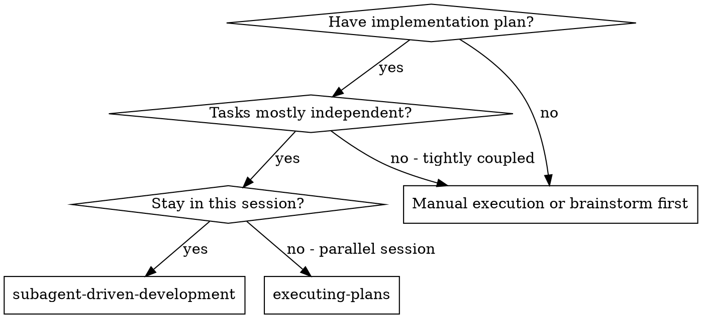
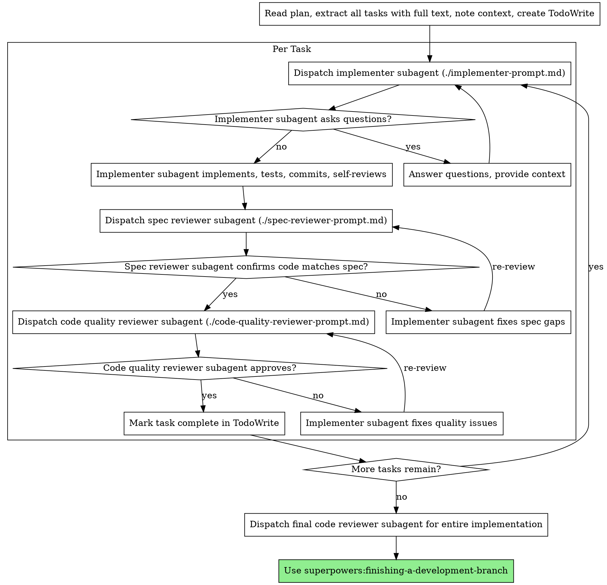

# JSON reader output styling plan execution

**Session ID:** ses_1bfd07316ffe2eAh3qDXFoh8jd
**Created:** 5/19/2026, 3:21:58 PM
**Updated:** 5/19/2026, 3:54:23 PM

---

## User

# Subagent-Driven Development

Execute plan by dispatching fresh subagent per task, with two-stage review after each: spec compliance review first, then code quality review.

**Why subagents:** You delegate tasks to specialized agents with isolated context. By precisely crafting their instructions and context, you ensure they stay focused and succeed at their task. They should never inherit your session's context or history — you construct exactly what they need. This also preserves your own context for coordination work.

**Core principle:** Fresh subagent per task + two-stage review (spec then quality) = high quality, fast iteration

**Continuous execution:** Do not pause to check in with your human partner between tasks. Execute all tasks from the plan without stopping. The only reasons to stop are: BLOCKED status you cannot resolve, ambiguity that genuinely prevents progress, or all tasks complete. "Should I continue?" prompts and progress summaries waste their time — they asked you to execute the plan, so execute it.

## When to Use



**vs. Executing Plans (parallel session):**
- Same session (no context switch)
- Fresh subagent per task (no context pollution)
- Two-stage review after each task: spec compliance first, then code quality
- Faster iteration (no human-in-loop between tasks)

## The Process



## Model Selection

Use the least powerful model that can handle each role to conserve cost and increase speed.

**Mechanical implementation tasks** (isolated functions, clear specs, 1-2 files): use a fast, cheap model. Most implementation tasks are mechanical when the plan is well-specified.

**Integration and judgment tasks** (multi-file coordination, pattern matching, debugging): use a standard model.

**Architecture, design, and review tasks**: use the most capable available model.

**Task complexity signals:**
- Touches 1-2 files with a complete spec → cheap model
- Touches multiple files with integration concerns → standard model
- Requires design judgment or broad codebase understanding → most capable model

## Handling Implementer Status

Implementer subagents report one of four statuses. Handle each appropriately:

**DONE:** Proceed to spec compliance review.

**DONE_WITH_CONCERNS:** The implementer completed the work but flagged doubts. Read the concerns before proceeding. If the concerns are about correctness or scope, address them before review. If they're observations (e.g., "this file is getting large"), note them and proceed to review.

**NEEDS_CONTEXT:** The implementer needs information that wasn't provided. Provide the missing context and re-dispatch.

**BLOCKED:** The implementer cannot complete the task. Assess the blocker:
1. If it's a context problem, provide more context and re-dispatch with the same model
2. If the task requires more reasoning, re-dispatch with a more capable model
3. If the task is too large, break it into smaller pieces
4. If the plan itself is wrong, escalate to the human

**Never** ignore an escalation or force the same model to retry without changes. If the implementer said it's stuck, something needs to change.

## Prompt Templates

- `./implementer-prompt.md` - Dispatch implementer subagent
- `./spec-reviewer-prompt.md` - Dispatch spec compliance reviewer subagent
- `./code-quality-reviewer-prompt.md` - Dispatch code quality reviewer subagent

## Example Workflow

```
You: I'm using Subagent-Driven Development to execute this plan.

[Read plan file once: docs/superpowers/plans/feature-plan.md]
[Extract all 5 tasks with full text and context]
[Create TodoWrite with all tasks]

Task 1: Hook installation script

[Get Task 1 text and context (already extracted)]
[Dispatch implementation subagent with full task text + context]

Implementer: "Before I begin - should the hook be installed at user or system level?"

You: "User level (~/.config/superpowers/hooks/)"

Implementer: "Got it. Implementing now..."
[Later] Implementer:
  - Implemented install-hook command
  - Added tests, 5/5 passing
  - Self-review: Found I missed --force flag, added it
  - Committed

[Dispatch spec compliance reviewer]
Spec reviewer: ✅ Spec compliant - all requirements met, nothing extra

[Get git SHAs, dispatch code quality reviewer]
Code reviewer: Strengths: Good test coverage, clean. Issues: None. Approved.

[Mark Task 1 complete]

Task 2: Recovery modes

[Get Task 2 text and context (already extracted)]
[Dispatch implementation subagent with full task text + context]

Implementer: [No questions, proceeds]
Implementer:
  - Added verify/repair modes
  - 8/8 tests passing
  - Self-review: All good
  - Committed

[Dispatch spec compliance reviewer]
Spec reviewer: ❌ Issues:
  - Missing: Progress reporting (spec says "report every 100 items")
  - Extra: Added --json flag (not requested)

[Implementer fixes issues]
Implementer: Removed --json flag, added progress reporting

[Spec reviewer reviews again]
Spec reviewer: ✅ Spec compliant now

[Dispatch code quality reviewer]
Code reviewer: Strengths: Solid. Issues (Important): Magic number (100)

[Implementer fixes]
Implementer: Extracted PROGRESS_INTERVAL constant

[Code reviewer reviews again]
Code reviewer: ✅ Approved

[Mark Task 2 complete]

...

[After all tasks]
[Dispatch final code-reviewer]
Final reviewer: All requirements met, ready to merge

Done!
```

## Advantages

**vs. Manual execution:**
- Subagents follow TDD naturally
- Fresh context per task (no confusion)
- Parallel-safe (subagents don't interfere)
- Subagent can ask questions (before AND during work)

**vs. Executing Plans:**
- Same session (no handoff)
- Continuous progress (no waiting)
- Review checkpoints automatic

**Efficiency gains:**
- No file reading overhead (controller provides full text)
- Controller curates exactly what context is needed
- Subagent gets complete information upfront
- Questions surfaced before work begins (not after)

**Quality gates:**
- Self-review catches issues before handoff
- Two-stage review: spec compliance, then code quality
- Review loops ensure fixes actually work
- Spec compliance prevents over/under-building
- Code quality ensures implementation is well-built

**Cost:**
- More subagent invocations (implementer + 2 reviewers per task)
- Controller does more prep work (extracting all tasks upfront)
- Review loops add iterations
- But catches issues early (cheaper than debugging later)

## Red Flags

**Never:**
- Start implementation on main/master branch without explicit user consent
- Skip reviews (spec compliance OR code quality)
- Proceed with unfixed issues
- Dispatch multiple implementation subagents in parallel (conflicts)
- Make subagent read plan file (provide full text instead)
- Skip scene-setting context (subagent needs to understand where task fits)
- Ignore subagent questions (answer before letting them proceed)
- Accept "close enough" on spec compliance (spec reviewer found issues = not done)
- Skip review loops (reviewer found issues = implementer fixes = review again)
- Let implementer self-review replace actual review (both are needed)
- **Start code quality review before spec compliance is ✅** (wrong order)
- Move to next task while either review has open issues

**If subagent asks questions:**
- Answer clearly and completely
- Provide additional context if needed
- Don't rush them into implementation

**If reviewer finds issues:**
- Implementer (same subagent) fixes them
- Reviewer reviews again
- Repeat until approved
- Don't skip the re-review

**If subagent fails task:**
- Dispatch fix subagent with specific instructions
- Don't try to fix manually (context pollution)

## Integration

**Required workflow skills:**
- **superpowers:using-git-worktrees** - Ensures isolated workspace (creates one or verifies existing)
- **superpowers:writing-plans** - Creates the plan this skill executes
- **superpowers:requesting-code-review** - Code review template for reviewer subagents
- **superpowers:finishing-a-development-branch** - Complete development after all tasks

**Subagents should use:**
- **superpowers:test-driven-development** - Subagents follow TDD for each task

**Alternative workflow:**
- **superpowers:executing-plans** - Use for parallel session instead of same-session execution


i want to execute this plan @docs\superpowers\plans\2026-05-19-json-reader-output-styling.md

---

## Assistant (Build · gpt-5.5 · 12.9s)

**Tool: skill**

**Input:**
```json
{
  "name": "using-git-worktrees"
}
```

**Output:**
```
<skill_content name="using-git-worktrees">
# Skill: using-git-worktrees

# Using Git Worktrees

## Overview

Ensure work happens in an isolated workspace. Prefer your platform's native worktree tools. Fall back to manual git worktrees only when no native tool is available.

**Core principle:** Detect existing isolation first. Then use native tools. Then fall back to git. Never fight the harness.

**Announce at start:** "I'm using the using-git-worktrees skill to set up an isolated workspace."

## Step 0: Detect Existing Isolation

**Before creating anything, check if you are already in an isolated workspace.**

```bash
GIT_DIR=$(cd "$(git rev-parse --git-dir)" 2>/dev/null && pwd -P)
GIT_COMMON=$(cd "$(git rev-parse --git-common-dir)" 2>/dev/null && pwd -P)
BRANCH=$(git branch --show-current)
```

**Submodule guard:** `GIT_DIR != GIT_COMMON` is also true inside git submodules. Before concluding "already in a worktree," verify you are not in a submodule:

```bash
# If this returns a path, you're in a submodule, not a worktree — treat as normal repo
git rev-parse --show-superproject-working-tree 2>/dev/null
```

**If `GIT_DIR != GIT_COMMON` (and not a submodule):** You are already in a linked worktree. Skip to Step 3 (Project Setup). Do NOT create another worktree.

Report with branch state:
- On a branch: "Already in isolated workspace at `<path>` on branch `<name>`."
- Detached HEAD: "Already in isolated workspace at `<path>` (detached HEAD, externally managed). Branch creation needed at finish time."

**If `GIT_DIR == GIT_COMMON` (or in a submodule):** You are in a normal repo checkout.

Has the user already indicated their worktree preference in your instructions? If not, ask for consent before creating a worktree:

> "Would you like me to set up an isolated worktree? It protects your current branch from changes."

Honor any existing declared preference without asking. If the user declines consent, work in place and skip to Step 3.

## Step 1: Create Isolated Workspace

**You have two mechanisms. Try them in this order.**

### 1a. Native Worktree Tools (preferred)

The user has asked for an isolated workspace (Step 0 consent). Do you already have a way to create a worktree? It might be a tool with a name like `EnterWorktree`, `WorktreeCreate`, a `/worktree` command, or a `--worktree` flag. If you do, use it and skip to Step 3.

Native tools handle directory placement, branch creation, and cleanup automatically. Using `git worktree add` when you have a native tool creates phantom state your harness can't see or manage.

Only proceed to Step 1b if you have no native worktree tool available.

### 1b. Git Worktree Fallback

**Only use this if Step 1a does not apply** — you have no native worktree tool available. Create a worktree manually using git.

#### Directory Selection

Follow this priority order. Explicit user preference always beats observed filesystem state.

1. **Check your instructions for a declared worktree directory preference.** If the user has already specified one, use it without asking.

2. **Check for an existing project-local worktree directory:**
   ```bash
   ls -d .worktrees 2>/dev/null     # Preferred (hidden)
   ls -d worktrees 2>/dev/null      # Alternative
   ```
   If found, use it. If both exist, `.worktrees` wins.

3. **Check for an existing global directory:**
   ```bash
   project=$(basename "$(git rev-parse --show-toplevel)")
   ls -d ~/.config/superpowers/worktrees/$project 2>/dev/null
   ```
   If found, use it (backward compatibility with legacy global path).

4. **If there is no other guidance available**, default to `.worktrees/` at the project root.

#### Safety Verification (project-local directories only)

**MUST verify directory is ignored before creating worktree:**

```bash
git check-ignore -q .worktrees 2>/dev/null || git check-ignore -q worktrees 2>/dev/null
```

**If NOT ignored:** Add to .gitignore, commit the change, then proceed.

**Why critical:** Prevents accidentally committing worktree contents to repository.

Global directories (`~/.config/superpowers/worktrees/`) need no verification.

#### Create the Worktree

```bash
project=$(basename "$(git rev-parse --show-toplevel)")

# Determine path based on chosen location
# For project-local: path="$LOCATION/$BRANCH_NAME"
# For global: path="~/.config/superpowers/worktrees/$project/$BRANCH_NAME"

git worktree add "$path" -b "$BRANCH_NAME"
cd "$path"
```

**Sandbox fallback:** If `git worktree add` fails with a permission error (sandbox denial), tell the user the sandbox blocked worktree creation and you're working in the current directory instead. Then run setup and baseline tests in place.

## Step 3: Project Setup

Auto-detect and run appropriate setup:

```bash
# Node.js
if [ -f package.json ]; then npm install; fi

# Rust
if [ -f Cargo.toml ]; then cargo build; fi

# Python
if [ -f requirements.txt ]; then pip install -r requirements.txt; fi
if [ -f pyproject.toml ]; then poetry install; fi

# Go
if [ -f go.mod ]; then go mod download; fi
```

## Step 4: Verify Clean Baseline

Run tests to ensure workspace starts clean:

```bash
# Use project-appropriate command
npm test / cargo test / pytest / go test ./...
```

**If tests fail:** Report failures, ask whether to proceed or investigate.

**If tests pass:** Report ready.

### Report

```
Worktree ready at <full-path>
Tests passing (<N> tests, 0 failures)
Ready to implement <feature-name>
```

## Quick Reference

| Situation | Action |
|-----------|--------|
| Already in linked worktree | Skip creation (Step 0) |
| In a submodule | Treat as normal repo (Step 0 guard) |
| Native worktree tool available | Use it (Step 1a) |
| No native tool | Git worktree fallback (Step 1b) |
| `.worktrees/` exists | Use it (verify ignored) |
| `worktrees/` exists | Use it (verify ignored) |
| Both exist | Use `.worktrees/` |
| Neither exists | Check instruction file, then default `.worktrees/` |
| Global path exists | Use it (backward compat) |
| Directory not ignored | Add to .gitignore + commit |
| Permission error on create | Sandbox fallback, work in place |
| Tests fail during baseline | Report failures + ask |
| No package.json/Cargo.toml | Skip dependency install |

## Common Mistakes

### Fighting the harness

- **Problem:** Using `git worktree add` when the platform already provides isolation
- **Fix:** Step 0 detects existing isolation. Step 1a defers to native tools.

### Skipping detection

- **Problem:** Creating a nested worktree inside an existing one
- **Fix:** Always run Step 0 before creating anything

### Skipping ignore verification

- **Problem:** Worktree contents get tracked, pollute git status
- **Fix:** Always use `git check-ignore` before creating project-local worktree

### Assuming directory location

- **Problem:** Creates inconsistency, violates project conventions
- **Fix:** Follow priority: existing > global legacy > instruction file > default

### Proceeding with failing tests

- **Problem:** Can't distinguish new bugs from pre-existing issues
- **Fix:** Report failures, get explicit permission to proceed

## Red Flags

**Never:**
- Create a worktree when Step 0 detects existing isolation
- Use `git worktree add` when you have a native worktree tool (e.g., `EnterWorktree`). This is the #1 mistake — if you have it, use it.
- Skip Step 1a by jumping straight to Step 1b's git commands
- Create worktree without verifying it's ignored (project-local)
- Skip baseline test verification
- Proceed with failing tests without asking

**Always:**
- Run Step 0 detection first
- Prefer native tools over git fallback
- Follow directory priority: existing > global legacy > instruction file > default
- Verify directory is ignored for project-local
- Auto-detect and run project setup
- Verify clean test baseline

Base directory for this skill: file:///C:/Users/moame/.cache/opencode/packages/superpowers@git+https_/github.com/obra/superpowers.git/node_modules/superpowers/skills/using-git-worktrees
Relative paths in this skill (e.g., scripts/, reference/) are relative to this base directory.
Note: file list is sampled.

<skill_files>

</skill_files>
</skill_content>
```

---

## Assistant (Build · gpt-5.5 · 6.1s)

I'm using the using-git-worktrees skill to set up an isolated workspace before executing the plan.

**Tool: bash**

**Input:**
```json
{
  "command": "$gitDir = (git rev-parse --git-dir); $gitCommon = (git rev-parse --git-common-dir); $branch = (git branch --show-current); $super = (git rev-parse --show-superproject-working-tree 2>$null); \"GIT_DIR=$gitDir\"; \"GIT_COMMON=$gitCommon\"; \"BRANCH=$branch\"; \"SUPER=$super\"",
  "description": "Detects git worktree isolation state"
}
```

**Output:**
```
GIT_DIR=.git
GIT_COMMON=.git
BRANCH=main
SUPER=

```

**Tool: glob**

**Input:**
```json
{
  "pattern": "AGENTS.md"
}
```

**Output:**
```
No files found
```

**Tool: glob**

**Input:**
```json
{
  "pattern": ".worktrees"
}
```

**Output:**
```
No files found
```

**Tool: glob**

**Input:**
```json
{
  "pattern": "worktrees"
}
```

**Output:**
```
No files found
```

**Tool: glob**

**Input:**
```json
{
  "pattern": "package.json"
}
```

**Output:**
```
C:\programing\nodeJs\json-reader-superpowers\package.json
```

---

## Assistant (Build · gpt-5.5 · 9.9s)

This checkout is not already isolated. I need your consent before creating a linked worktree; if you prefer, I can execute in the current checkout instead.

**Tool: question**

**Input:**
```json
{
  "questions": [
    {
      "header": "Workspace",
      "question": "Would you like me to set up an isolated worktree? It protects your current branch from changes.",
      "options": [
        {
          "label": "Create worktree",
          "description": "Use a separate branch and directory for this plan."
        },
        {
          "label": "Work in place",
          "description": "Apply changes directly in the current checkout."
        }
      ]
    }
  ]
}
```

**Output:**
```
User has answered your questions: "Would you like me to set up an isolated worktree? It protects your current branch from changes."="Work in place". You can now continue with the user's answers in mind.
```

---

## Assistant (Build · gpt-5.5 · 4.8s)

I'll execute the plan in the current checkout and first verify the project baseline before making changes.

**Tool: bash**

**Input:**
```json
{
  "command": "npm install",
  "description": "Installs project dependencies",
  "timeout": 120000
}
```

**Output:**
```

up to date, audited 1 package in 602ms

found 0 vulnerabilities

```

---

## Assistant (Build · gpt-5.5 · 3.7s)

**Tool: bash**

**Input:**
```json
{
  "command": "npm test",
  "description": "Runs baseline test suite",
  "timeout": 120000
}
```

**Output:**
```

> json-reader-superpowers@1.0.0 test
> node --test

TAP version 13
# Subtest: collectBuildState validates objects and groups published slugs newest first
ok 1 - collectBuildState validates objects and groups published slugs newest first
  ---
  duration_ms: 44.0046
  type: 'test'
  ...
# Subtest: collectBuildState records invalid object warnings and file summaries
ok 2 - collectBuildState records invalid object warnings and file summaries
  ---
  duration_ms: 7.6063
  type: 'test'
  ...
# Subtest: CLI entrypoint exports main and source stylesheet exists
ok 3 - CLI entrypoint exports main and source stylesheet exists
  ---
  duration_ms: 14.2161
  type: 'test'
  ...
# Subtest: CLI entrypoint finds bundled stylesheet from another cwd
ok 4 - CLI entrypoint finds bundled stylesheet from another cwd
  ---
  duration_ms: 99.6785
  type: 'test'
  ...
# Subtest: renderDashboard returns an offline dashboard document
ok 5 - renderDashboard returns an offline dashboard document
  ---
  duration_ms: 0.4519
  type: 'test'
  ...
# Subtest: buildSite writes dashboard and stylesheet
ok 6 - buildSite writes dashboard and stylesheet
  ---
  duration_ms: 9.6414
  type: 'test'
  ...
# Subtest: buildSite rejects output directory that overlaps input data
ok 7 - buildSite rejects output directory that overlaps input data
  ---
  duration_ms: 4.5335
  type: 'test'
  ...
# Subtest: buildSite rejects output directory that contains data path with dot-dot prefix segment
ok 8 - buildSite rejects output directory that contains data path with dot-dot prefix segment
  ---
  duration_ms: 4.9977
  type: 'test'
  ...
# Subtest: cleanOutput rejects empty output directory
ok 9 - cleanOutput rejects empty output directory
  ---
  duration_ms: 0.2593
  type: 'test'
  ...
# Subtest: buildSite rejects empty output directory
ok 10 - buildSite rejects empty output directory
  ---
  duration_ms: 0.2964
  type: 'test'
  ...
# Subtest: buildSite rejects null output directory
ok 11 - buildSite rejects null output directory
  ---
  duration_ms: 0.4553
  type: 'test'
  ...
# Subtest: renderDashboard links slug cards and per-file slug counts
ok 12 - renderDashboard links slug cards and per-file slug counts
  ---
  duration_ms: 0.6177
  type: 'test'
  ...
# Subtest: renderDashboard URL-encodes slug href path segments
ok 13 - renderDashboard URL-encodes slug href path segments
  ---
  duration_ms: 0.2705
  type: 'test'
  ...
# Subtest: renderDashboard encodes wildcard characters in slug href file names
ok 14 - renderDashboard encodes wildcard characters in slug href file names
  ---
  duration_ms: 0.1627
  type: 'test'
  ...
# Subtest: buildSite writes one page for each unique published slug
ok 15 - buildSite writes one page for each unique published slug
  ---
  duration_ms: 13.0338
  type: 'test'
  ...
# Subtest: buildSite writes encoded slug file names inside the output directory
ok 16 - buildSite writes encoded slug file names inside the output directory
  ---
  duration_ms: 12.4139
  type: 'test'
  ...
# Subtest: readJsonFiles returns a warning when data folder is missing
ok 17 - readJsonFiles returns a warning when data folder is missing
  ---
  duration_ms: 11.315
  type: 'test'
  ...
# Subtest: readJsonFiles reads a single object JSON file
ok 18 - readJsonFiles reads a single object JSON file
  ---
  duration_ms: 7.3353
  type: 'test'
  ...
# Subtest: readJsonFiles reads array JSON files
ok 19 - readJsonFiles reads array JSON files
  ---
  duration_ms: 4.8835
  type: 'test'
  ...
# Subtest: readJsonFiles skips invalid JSON files with warnings
ok 20 - readJsonFiles skips invalid JSON files with warnings
  ---
  duration_ms: 10.4198
  type: 'test'
  ...
# Subtest: readJsonFiles skips primitive JSON roots with warnings
ok 21 - readJsonFiles skips primitive JSON roots with warnings
  ---
  duration_ms: 7.3907
  type: 'test'
  ...
# Subtest: renderSlugPage shows slug heading, count, controls, and object cards
ok 22 - renderSlugPage shows slug heading, count, controls, and object cards
  ---
  duration_ms: 28.6163
  type: 'test'
  ...
# Subtest: renderSlugPage embeds only the provided slug objects as JSON data
ok 23 - renderSlugPage embeds only the provided slug objects as JSON data
  ---
  duration_ms: 0.5052
  type: 'test'
  ...
# Subtest: renderSlugPage script reads and updates the file query parameter
ok 24 - renderSlugPage script reads and updates the file query parameter
  ---
  duration_ms: 0.4205
  type: 'test'
  ...
# Subtest: validateObject normalizes valid published objects
ok 25 - validateObject normalizes valid published objects
  ---
  duration_ms: 5.0895
  type: 'test'
  ...
# Subtest: validateObject accepts draft true and marks unpublished
ok 26 - validateObject accepts draft true and marks unpublished
  ---
  duration_ms: 0.4613
  type: 'test'
  ...
# Subtest: validateObject rejects missing required strings
ok 27 - validateObject rejects missing required strings
  ---
  duration_ms: 0.4905
  type: 'test'
  ...
# Subtest: validateObject rejects impossible YYYY-MM-DD dates
ok 28 - validateObject rejects impossible YYYY-MM-DD dates
  ---
  duration_ms: 0.4111
  type: 'test'
  ...
# Subtest: validateObject rejects non-string tags
ok 29 - validateObject rejects non-string tags
  ---
  duration_ms: 0.3501
  type: 'test'
  ...
1..29
# tests 29
# suites 0
# pass 29
# fail 0
# cancelled 0
# skipped 0
# todo 0
# duration_ms 299.7812

```

---

## Assistant (Build · gpt-5.5 · 20.3s)

I'm using Subagent-Driven Development to execute the plan task-by-task with implementation, spec review, and code-quality review gates. Baseline is clean from `npm test`: 29 tests passed.

**Tool: todowrite**

**Input:**
```json
{
  "todos": [
    {
      "content": "Task 1: Clean Output Behavior",
      "status": "in_progress",
      "priority": "high"
    },
    {
      "content": "Task 2: Offline Asset Links",
      "status": "pending",
      "priority": "high"
    },
    {
      "content": "Task 3: Complete Responsive Stylesheet",
      "status": "pending",
      "priority": "high"
    },
    {
      "content": "Final implementation review and verification",
      "status": "pending",
      "priority": "medium"
    }
  ]
}
```

**Output:**
```
[
  {
    "content": "Task 1: Clean Output Behavior",
    "status": "in_progress",
    "priority": "high"
  },
  {
    "content": "Task 2: Offline Asset Links",
    "status": "pending",
    "priority": "high"
  },
  {
    "content": "Task 3: Complete Responsive Stylesheet",
    "status": "pending",
    "priority": "high"
  },
  {
    "content": "Final implementation review and verification",
    "status": "pending",
    "priority": "medium"
  }
]
```

---

## Assistant (Build · gpt-5.5 · 97.2s)

Dispatching a focused implementer for Task 1. It will add the cleanup regression test, run the required generator tests, and only touch cleanup implementation if the test exposes a gap.

**Tool: task**

**Input:**
```json
{
  "description": "Implement cleanup test",
  "subagent_type": "general",
  "prompt": "You are an implementer subagent executing Task 1 from docs/superpowers/plans/2026-05-19-json-reader-output-styling.md in repository C:\\programing\\nodeJs\\json-reader-superpowers. Work in the current checkout; do not create a worktree. Do not commit changes, despite the plan mentioning commits.\n\nContext:\nGoal: Harden output cleanup and stylesheet copying. Architecture: filesystem behavior lives in src/generator.js. Tests use node:test/CommonJS.\nBaseline before this task: npm test passed with 29 tests.\n\nTask 1: Clean Output Behavior\nFiles:\n- Modify test/generator.test.js\n- Only modify src/generator.js if the new test fails because cleanup is not implemented exactly.\n\nSteps:\n1. Append this test to test/generator.test.js:\n```js\ntest('buildSite deletes old generated files before writing new output', async () => {\n  const fixtureRoot = await fs.mkdtemp(path.join(os.tmpdir(), 'json-reader-clean-'));\n  const dataDir = path.join(fixtureRoot, 'data');\n  const outputDir = path.join(fixtureRoot, 'output');\n  const assetSourcePath = path.join(fixtureRoot, 'src', 'assets', 'style.css');\n  await fs.mkdir(dataDir, { recursive: true });\n  await fs.mkdir(path.join(outputDir, 'assets'), { recursive: true });\n  await fs.mkdir(path.dirname(assetSourcePath), { recursive: true });\n  await fs.writeFile(path.join(outputDir, 'old.html'), 'stale');\n  await fs.writeFile(path.join(outputDir, 'assets', 'old.css'), 'stale');\n  await fs.writeFile(assetSourcePath, 'body { color: #111; }');\n\n  await buildSite({ dataDir, outputDir, assetSourcePath });\n\n  await assert.rejects(fs.readFile(path.join(outputDir, 'old.html'), 'utf8'), /ENOENT/);\n  await assert.rejects(fs.readFile(path.join(outputDir, 'assets', 'old.css'), 'utf8'), /ENOENT/);\n  assert.equal(await fs.readFile(path.join(outputDir, 'assets', 'style.css'), 'utf8'), 'body { color: #111; }');\n});\n```\n2. Run `node --test test/generator.test.js`.\n3. If the cleanup test fails, replace cleanOutput in src/generator.js with:\n```js\nasync function cleanOutput(outputDir) {\n  await fs.rm(outputDir, { recursive: true, force: true });\n  await fs.mkdir(path.join(outputDir, 'assets'), { recursive: true });\n}\n```\n4. Run `node --test test/generator.test.js` again.\n5. Self-review your changes for accidental scope creep.\n\nReturn one final message with:\n- Status: DONE, DONE_WITH_CONCERNS, NEEDS_CONTEXT, or BLOCKED\n- Files changed\n- Commands run and results\n- Whether src/generator.js was changed and why\n- Self-review notes"
}
```

**Output:**
```
task_id: ses_1bfcf4db1ffe5lJY7J1S3bPBXb (for resuming to continue this task if needed)

<task_result>
Status: DONE

Files changed:
- `test/generator.test.js`

Commands run and results:
- `node --test test/generator.test.js`
- Result: passed, `15/15` tests, `0` failures

`src/generator.js` changed:
- No. The new cleanup test passed against the existing implementation, which already removes the output directory and recreates `assets`.

Self-review notes:
- Diff only adds the requested regression test.
- No production code changes or scope creep.
- Observed unrelated working tree changes: `docs/superpowers/plans/progress.md`, `session-ses_5.md`; I did not modify them.
</task_result>
```

---

## Assistant (Build · gpt-5.5 · 66.2s)

Task 1 implementation passed its targeted generator suite. I’m starting the spec-compliance review for the Task 1 diff now.

**Tool: task**

**Input:**
```json
{
  "description": "Review cleanup spec",
  "subagent_type": "general",
  "prompt": "You are a spec compliance reviewer for Task 1 only. Repository: C:\\programing\\nodeJs\\json-reader-superpowers. Do not modify files.\n\nSpec to review:\nTask 1: Clean Output Behavior from docs/superpowers/plans/2026-05-19-json-reader-output-styling.md.\nRequired:\n- test/generator.test.js has a test named exactly `buildSite deletes old generated files before writing new output`.\n- The test creates temp fixtureRoot, dataDir, outputDir, assetSourcePath; creates stale output/old.html and output/assets/old.css; writes asset CSS; calls `buildSite({ dataDir, outputDir, assetSourcePath })`; asserts stale files reject with ENOENT; asserts copied output/assets/style.css equals `body { color: #111; }`.\n- `node --test test/generator.test.js` should pass.\n- src/generator.js should only be changed if the test required cleanup fix.\n- No commits expected in this workflow.\n\nPlease inspect the current diff/worktree enough to verify compliance. Return one final message with:\n- Compliance: APPROVED or CHANGES_REQUIRED\n- Findings with file/line refs if changes required\n- Commands run and results\n- Brief notes on any extra/unexpected changes relevant to Task 1"
}
```

**Output:**
```
task_id: ses_1bfcdf25effeCQxeqNC5fzAlz6 (for resuming to continue this task if needed)

<task_result>
Compliance: APPROVED

Findings: none.

Commands run and results:
- `git status --short`: found `test/generator.test.js` modified, `docs/superpowers/plans/progress.md` modified, `session-ses_5.md` untracked.
- `git diff -- test/generator.test.js src/generator.js docs/superpowers/plans/2026-05-19-json-reader-output-styling.md`: only relevant diff is the Task 1 test addition in `test/generator.test.js`; no `src/generator.js` diff.
- `node --test test/generator.test.js`: passed, 15 tests passing.

Task 1 notes:
- Required test exists exactly at `test/generator.test.js:258`.
- Test creates `fixtureRoot`, `dataDir`, `outputDir`, `assetSourcePath`; writes stale `old.html` and `assets/old.css`; writes CSS; calls `buildSite({ dataDir, outputDir, assetSourcePath })`; checks stale files reject with `ENOENT`; checks copied `output/assets/style.css` equals `body { color: #111; }`.
- Extra relevant worktree changes: `docs/superpowers/plans/progress.md` has unrelated progress updates, and `session-ses_5.md` is untracked. No commits observed or needed.
</task_result>
```

---

## Assistant (Build · gpt-5.5 · 241.0s)

Task 1 meets the spec. I’m running the code-quality review gate before moving to Task 2.

**Tool: task**

**Input:**
```json
{
  "description": "Review cleanup quality",
  "subagent_type": "general",
  "prompt": "You are a code quality reviewer for Task 1 only. Repository: C:\\programing\\nodeJs\\json-reader-superpowers. Do not modify files.\n\nReview the Task 1 implementation quality, focusing on the new cleanup regression test in test/generator.test.js. Spec compliance has already been approved. Look for maintainability, flaky tests, incorrect async assertions, path safety, unnecessary scope creep, style consistency with existing tests, and hidden risks.\n\nReturn one final message with:\n- Quality: APPROVED or CHANGES_REQUIRED\n- Findings first, ordered by severity with file/line references\n- Commands run and results, if any\n- Residual risks or testing gaps"
}
```

**Output:**
```
task_id: ses_1bfccce40ffeOSy4p00DccAZds (for resuming to continue this task if needed)

<task_result>
Quality: APPROVED

Findings:
- No quality issues found in `test/generator.test.js:258-275`.

Commands run and results:
- `git status --short`: showed modified `docs/superpowers/plans/progress.md`, modified `test/generator.test.js`, and untracked `session-ses_5.md`.
- `git diff -- test/generator.test.js`: reviewed the new cleanup regression test.
- `git diff --cached -- test/generator.test.js`: no staged diff.
- `node --test test/generator.test.js`: passed, 15/15 tests.

Residual risks or testing gaps:
- The test leaves temp directories behind, but this is consistent with the surrounding tests.
- Only the targeted generator test file was run, not the full repository suite.
</task_result>
```

---

## Assistant (Build · gpt-5.5 · 8.5s)

**Tool: todowrite**

**Input:**
```json
{
  "todos": [
    {
      "content": "Task 1: Clean Output Behavior",
      "status": "completed",
      "priority": "high"
    },
    {
      "content": "Task 2: Offline Asset Links",
      "status": "in_progress",
      "priority": "high"
    },
    {
      "content": "Task 3: Complete Responsive Stylesheet",
      "status": "pending",
      "priority": "high"
    },
    {
      "content": "Final implementation review and verification",
      "status": "pending",
      "priority": "medium"
    }
  ]
}
```

**Output:**
```
[
  {
    "content": "Task 1: Clean Output Behavior",
    "status": "completed",
    "priority": "high"
  },
  {
    "content": "Task 2: Offline Asset Links",
    "status": "in_progress",
    "priority": "high"
  },
  {
    "content": "Task 3: Complete Responsive Stylesheet",
    "status": "pending",
    "priority": "high"
  },
  {
    "content": "Final implementation review and verification",
    "status": "pending",
    "priority": "medium"
  }
]
```

---

## Assistant (Build · gpt-5.5 · 114.0s)

Dispatching Task 2 implementation. It will add the offline asset-link regression test and only update renderers if that test fails.

**Tool: task**

**Input:**
```json
{
  "description": "Implement asset test",
  "subagent_type": "general",
  "prompt": "You are an implementer subagent executing Task 2 from docs/superpowers/plans/2026-05-19-json-reader-output-styling.md in repository C:\\programing\\nodeJs\\json-reader-superpowers. Work in the current checkout; do not create a worktree. Do not commit changes.\n\nContext:\nGoal: Ensure generated pages link only to the shared local stylesheet and do not reference remote/script src assets. Architecture: rendering is in src/html.js, generator tests are in test/generator.test.js.\nTask 1 has already added a cleanup test to test/generator.test.js and passed review. Do not remove or alter it unless absolutely necessary.\n\nTask 2: Offline Asset Links\nFiles:\n- Modify test/generator.test.js\n- Only modify src/html.js if the new test fails due to wrong/external stylesheet paths or script src usage.\n\nSteps:\n1. Append this test to test/generator.test.js:\n```js\ntest('generated HTML links only to the shared local stylesheet', async () => {\n  const fixtureRoot = await fs.mkdtemp(path.join(os.tmpdir(), 'json-reader-assets-'));\n  const dataDir = path.join(fixtureRoot, 'data');\n  const outputDir = path.join(fixtureRoot, 'output');\n  const assetSourcePath = path.join(fixtureRoot, 'src', 'assets', 'style.css');\n  await fs.mkdir(dataDir, { recursive: true });\n  await fs.mkdir(path.dirname(assetSourcePath), { recursive: true });\n  await fs.writeFile(assetSourcePath, 'body { color: #111; }');\n  await fs.writeFile(path.join(dataDir, 'posts.json'), JSON.stringify({\n    title: 'Alpha',\n    slug: 'alpha',\n    date: '2026-05-18',\n    content: 'Alpha body',\n  }));\n\n  await buildSite({ dataDir, outputDir, assetSourcePath });\n\n  const dashboard = await fs.readFile(path.join(outputDir, 'dashboard.html'), 'utf8');\n  const slug = await fs.readFile(path.join(outputDir, 'alpha.html'), 'utf8');\n\n  assert.match(dashboard, /href=\"assets\\/style\\.css\"/);\n  assert.match(slug, /href=\"assets\\/style\\.css\"/);\n  assert.doesNotMatch(dashboard + slug, /https?:\\/\\//);\n  assert.doesNotMatch(dashboard + slug, /<script\\s+src=/);\n});\n```\n2. Run `node --test test/generator.test.js`.\n3. If the test fails because either renderer links an external or wrong stylesheet path, update both `renderDashboard` and `renderSlugPage` in `src/html.js` so their `<head>` contains exactly:\n```html\n  <link rel=\"stylesheet\" href=\"assets/style.css\">\n```\n4. Run `npm test`.\n5. Self-review your changes for accidental scope creep.\n\nReturn one final message with:\n- Status: DONE, DONE_WITH_CONCERNS, NEEDS_CONTEXT, or BLOCKED\n- Files changed\n- Commands run and results\n- Whether src/html.js was changed and why\n- Self-review notes"
}
```

**Output:**
```
task_id: ses_1bfc90475ffeLefFs0zBcBkHXK (for resuming to continue this task if needed)

<task_result>
Status: DONE

Files changed:
- `test/generator.test.js`

Commands run and results:
- `node --test test/generator.test.js`: PASS, 16/16 tests
- `npm test`: PASS, 31/31 tests
- `git diff -- test/generator.test.js src/html.js`: reviewed relevant diff
- `git status --short`: shows `M test/generator.test.js`

`src/html.js` changed:
- No. The new test passed immediately because both generated pages already link to `assets/style.css` and use no `<script src=...>`.

Self-review notes:
- Added only the requested offline asset link test.
- Did not remove or alter Task 1’s cleanup test.
- No production code changes were needed.
- No commit was created.
</task_result>
```

---

## Assistant (Build · gpt-5.5 · 62.5s)

Task 2 implementation passed targeted and full tests. I’m reviewing it against the plan spec next.

**Tool: task**

**Input:**
```json
{
  "description": "Review asset spec",
  "subagent_type": "general",
  "prompt": "You are a spec compliance reviewer for Task 2 only. Repository: C:\\programing\\nodeJs\\json-reader-superpowers. Do not modify files.\n\nSpec to review:\nTask 2: Offline Asset Links from docs/superpowers/plans/2026-05-19-json-reader-output-styling.md.\nRequired:\n- test/generator.test.js has a test named exactly `generated HTML links only to the shared local stylesheet`.\n- The test creates temp fixtureRoot/data/output/source stylesheet; writes `posts.json` with Alpha object; calls `buildSite({ dataDir, outputDir, assetSourcePath })`; reads dashboard.html and alpha.html; asserts both have `href=\"assets/style.css\"`; asserts concatenated HTML has no `https?://`; asserts no `<script\\s+src=`.\n- `node --test test/generator.test.js` should pass.\n- `npm test` should pass.\n- src/html.js should only be changed if the test required local-link fixes.\n- No commits expected in this workflow.\n\nPlease inspect current diff/worktree enough to verify compliance. Return one final message with:\n- Compliance: APPROVED or CHANGES_REQUIRED\n- Findings with file/line refs if changes required\n- Commands run and results\n- Brief notes on extra/unexpected changes relevant to Task 2"
}
```

**Output:**
```
task_id: ses_1bfc75a30ffeurjqUVXhHdd632 (for resuming to continue this task if needed)

<task_result>
Compliance: APPROVED

Findings: None.

Commands run and results:
- `git status --short`: only `test/generator.test.js` modified.
- `git diff -- test/generator.test.js src/html.js docs/superpowers/plans/2026-05-19-json-reader-output-styling.md`: Task 2 test added; no `src/html.js` diff.
- `node --test test/generator.test.js`: pass, 16/16 tests.
- `npm test`: pass, 31/31 tests.

Notes:
- Required test name exists exactly at `test/generator.test.js:277`.
- Test creates temp `fixtureRoot/data/output/source stylesheet`, writes `posts.json` with Alpha, calls `buildSite({ dataDir, outputDir, assetSourcePath })`, reads `dashboard.html` and `alpha.html`, and asserts local stylesheet/no remote URLs/no script `src`.
- Extra relevant change in `test/generator.test.js`: Task 1 cleanup test also appears at `test/generator.test.js:258`; not blocking for Task 2.
- No commits observed or created.
</task_result>
```

---

## Assistant (Build · gpt-5.5 · 151.6s)

Task 2 matches the spec. I’m running the quality review gate now.

**Tool: task**

**Input:**
```json
{
  "description": "Review asset quality",
  "subagent_type": "general",
  "prompt": "You are a code quality reviewer for Task 2 only. Repository: C:\\programing\\nodeJs\\json-reader-superpowers. Do not modify files.\n\nReview the Task 2 implementation quality, focusing on the new offline asset-link regression test in test/generator.test.js. Spec compliance has already been approved. Look for maintainability, flaky tests, false positives/negatives in regexes, style consistency with existing tests, unnecessary scope creep, and hidden risks.\n\nReturn one final message with:\n- Quality: APPROVED or CHANGES_REQUIRED\n- Findings first, ordered by severity with file/line references\n- Commands run and results, if any\n- Residual risks or testing gaps"
}
```

**Output:**
```
task_id: ses_1bfc67037ffe4ssZkBPjwV3OsM (for resuming to continue this task if needed)

<task_result>
Quality: CHANGES_REQUIRED

Findings:
- `test/generator.test.js:299-300` - The negative regexes leave meaningful false negatives for an “offline asset-link” regression test. `/https?:\/\//` misses protocol-relative external assets like `//cdn.example.com/style.css`, and `/<script\s+src=/` is case-sensitive and only catches one attribute ordering/form, so `<script defer src="https://...">` or uppercase tags can slip through. Since the test name says generated HTML links “only” to the shared local stylesheet, it should more directly extract/assert stylesheet/script asset references or use broader case-insensitive patterns.
- `test/generator.test.js:297-300` - The test does not verify “only” one stylesheet link per document. It would pass if either page included `href="assets/style.css"` plus an additional local stylesheet such as `href="assets/extra.css"`. That weakens the regression value for accidental asset creep.

Commands run and results:
- `git diff -- test/generator.test.js` - inspected the Task 2 diff.
- `git status --short` - confirmed `test/generator.test.js` is modified.
- `npm test -- test/generator.test.js` - passed: 16 tests, 0 failures.

Residual risks or testing gaps:
- I reviewed only Task 2’s test quality and did not modify files.
- Existing generated slug pages intentionally include inline JavaScript; the new test currently permits that, which appears consistent with `test/slug-page.test.js`.
</task_result>
```

---

## Assistant (Build · gpt-5.5 · 97.2s)

The Task 2 quality review found the regression test was too permissive for “only local stylesheet.” I’m sending it back to the implementer to tighten the assertions without changing production code.

**Tool: task**

**Input:**
```json
{
  "description": "Tighten asset test",
  "subagent_type": "general",
  "task_id": "ses_1bfc90475ffeLefFs0zBcBkHXK",
  "prompt": "Quality review found issues in your Task 2 test. Please fix them in the current checkout without committing and without changing production code unless tests require it.\n\nRequired fixes:\n- In `test/generator.test.js`, improve the `generated HTML links only to the shared local stylesheet` test so it verifies each generated document has exactly one stylesheet href and that it is exactly `assets/style.css`.\n- Improve negative asset assertions so protocol-relative external references like `//cdn.example.com` are caught, and script src detection is case-insensitive and robust to attributes before `src`.\n- Preserve the original spec intent: dashboard and slug pages link to the local shared stylesheet, no remote asset references, no external script src.\n\nSuggested approach:\n- Extract stylesheet hrefs with something like `[...html.matchAll(/<link\\b[^>]*rel=\"stylesheet\"[^>]*href=\"([^\"]+)\"[^>]*>/gi)]` or an equivalent robust regex, then assert deepEqual to [`assets/style.css`] for both dashboard and slug.\n- Assert no external/protocol-relative references with `/\\b(?:href|src)=\"(?:https?:)?\\/\\//i` or better.\n- Assert no script src with `/<script\\b[^>]*\\bsrc\\s*=/i`.\n\nAfter changes run:\n- `node --test test/generator.test.js`\n- `npm test`\n\nReturn one final message with:\n- Status\n- Files changed\n- Commands run and results\n- Self-review notes"
}
```

**Output:**
```
task_id: ses_1bfc90475ffeLefFs0zBcBkHXK (for resuming to continue this task if needed)

<task_result>
Status: DONE

Files changed:
- `test/generator.test.js`

Commands run and results:
- `node --test test/generator.test.js`: PASS, 16/16 tests
- `npm test`: PASS, 31/31 tests
- `git diff -- test/generator.test.js`: reviewed
- `git status --short`: only `test/generator.test.js` modified

Self-review notes:
- Strengthened the Task 2 test to assert each generated document has exactly one stylesheet href: `assets/style.css`.
- Negative asset checks now catch `http://`, `https://`, and protocol-relative `//` references in `href` or `src`.
- Script `src` detection is case-insensitive and allows attributes before `src`.
- No production code changed.
</task_result>
```

---

## Assistant (Build · gpt-5.5 · 122.8s)

Task 2 assertions have been tightened and tests still pass. I’m re-running spec and quality review for Task 2.

**Tool: task**

**Input:**
```json
{
  "description": "Re-review asset spec",
  "subagent_type": "general",
  "prompt": "You are re-reviewing spec compliance for Task 2 after test assertion tightening. Repository: C:\\programing\\nodeJs\\json-reader-superpowers. Do not modify files.\n\nSpec to review:\nTask 2: Offline Asset Links from docs/superpowers/plans/2026-05-19-json-reader-output-styling.md.\nRequired:\n- test/generator.test.js has a test named exactly `generated HTML links only to the shared local stylesheet`.\n- The test creates temp fixtureRoot/data/output/source stylesheet; writes `posts.json` with Alpha object; calls `buildSite({ dataDir, outputDir, assetSourcePath })`; reads dashboard.html and alpha.html; asserts both link to `assets/style.css`; asserts generated HTML has no remote/protocol-relative asset references; asserts no script src. It may be stricter than the plan by asserting exactly one stylesheet link per document.\n- `node --test test/generator.test.js` and `npm test` should pass.\n- src/html.js should not be changed unless required.\n\nReturn final message with Compliance: APPROVED or CHANGES_REQUIRED, findings with refs if needed, commands run/results."
}
```

**Output:**
```
task_id: ses_1bfc281b3ffeOVXuZZU6gxX23Q (for resuming to continue this task if needed)

<task_result>
Compliance: APPROVED

Findings: none.

Verified:
- `test/generator.test.js:277` has the exact required test name.
- The test creates temp `fixtureRoot/data/output/source stylesheet`, writes `posts.json` with Alpha object, calls `buildSite({ dataDir, outputDir, assetSourcePath })`, reads `dashboard.html` and `alpha.html`.
- It asserts exactly one stylesheet link per document: `assets/style.css`.
- It asserts no remote/protocol-relative `href` or `src` asset references and no `<script src=...>`.
- `src/html.js` has no relevant diff and both renderers already link to `assets/style.css`.

Commands run:
- `node --test test/generator.test.js`: pass, 16/16
- `npm test`: pass, 31/31
</task_result>
```

**Tool: task**

**Input:**
```json
{
  "description": "Re-review asset quality",
  "subagent_type": "general",
  "prompt": "You are re-reviewing code quality for Task 2 after assertion tightening. Repository: C:\\programing\\nodeJs\\json-reader-superpowers. Do not modify files.\n\nFocus on the `generated HTML links only to the shared local stylesheet` test in test/generator.test.js. The previous quality concerns were false negatives for protocol-relative URLs, script src variants, and not checking exactly one stylesheet per document.\n\nReturn final message with:\n- Quality: APPROVED or CHANGES_REQUIRED\n- Findings first with file/line refs\n- Commands run/results\n- Residual risks"
}
```

**Output:**
```
task_id: ses_1bfc2819affer9V5FWZHbbPj8d (for resuming to continue this task if needed)

<task_result>
Quality: CHANGES_REQUIRED

**Findings**
- `test/generator.test.js:296-300`: `stylesheetHrefs` only counts stylesheet links where `rel` and `href` are double-quoted. An extra local stylesheet using valid HTML like `<link rel='stylesheet' href='assets/other.css'>` would be ignored, so the test can still pass while the document has more than one stylesheet. This leaves part of the prior “exactly one stylesheet per document” false-negative concern unresolved.

**Commands Run/Results**
- `git status --short`: showed `M test/generator.test.js`
- `npm test -- test/generator.test.js`: passed, `16/16` tests passing

**Residual Risks**
- The protocol-relative URL and script `src` checks are materially improved.
- The remaining risk is regex-based HTML inspection missing valid attribute quoting/order variants unless the stylesheet extraction is broadened or replaced with a more reliable parser/assertion strategy.
</task_result>
```

---

## Assistant (Build · gpt-5.5 · 65.8s)

Quality review still found one regex blind spot for single-quoted stylesheet links. I’m tightening that extraction and re-verifying.

**Tool: task**

**Input:**
```json
{
  "description": "Fix style href regex",
  "subagent_type": "general",
  "task_id": "ses_1bfc90475ffeLefFs0zBcBkHXK",
  "prompt": "Quality re-review found one remaining issue in Task 2. Please fix only `test/generator.test.js`, no production code and no commits.\n\nIssue:\n- `stylesheetHrefs` only counts stylesheet links where `rel` and `href` are double-quoted. It should also catch valid single-quoted attributes and preserve robust attribute-order handling enough for this generated HTML regression test.\n\nRequired:\n- Update the helper/extraction in `generated HTML links only to the shared local stylesheet` so it detects stylesheet link hrefs whether attributes are single-quoted or double-quoted, and preferably regardless of rel/href order.\n- Keep assertions that dashboard and slug each have exactly [`assets/style.css`].\n- Keep remote/protocol-relative asset and script src assertions.\n\nRun:\n- `node --test test/generator.test.js`\n- `npm test`\n\nReturn final with Status, files changed, commands/results, self-review notes."
}
```

**Output:**
```
task_id: ses_1bfc90475ffeLefFs0zBcBkHXK (for resuming to continue this task if needed)

<task_result>
Status: DONE

Files changed:
- `test/generator.test.js`

Commands run and results:
- `node --test test/generator.test.js`: PASS, 16/16 tests
- `npm test`: PASS, 31/31 tests
- `git diff -- test/generator.test.js`: reviewed
- `git status --short`: only `test/generator.test.js` modified

Self-review notes:
- Updated `stylesheetHrefs` to scan `<link>` tags and support single-quoted or double-quoted `rel` and `href` attributes.
- Preserved attribute-order independence for `rel` and `href`.
- Kept exact assertions for `['assets/style.css']` on dashboard and slug pages.
- Kept remote/protocol-relative asset and robust script `src` assertions.
- No production code changed and no commit created.
</task_result>
```

---

## Assistant (Build · gpt-5.5 · 98.8s)

The remaining Task 2 quality issue is fixed. I’m running the final quality re-review for Task 2.

**Tool: task**

**Input:**
```json
{
  "description": "Final asset quality",
  "subagent_type": "general",
  "prompt": "You are final-reviewing code quality for Task 2. Repository: C:\\programing\\nodeJs\\json-reader-superpowers. Do not modify files.\n\nFocus on the `generated HTML links only to the shared local stylesheet` test in `test/generator.test.js`, especially whether the stylesheet href extraction now handles single and double quotes and attribute order, and whether previous concerns are resolved.\n\nReturn final message with:\n- Quality: APPROVED or CHANGES_REQUIRED\n- Findings first with file/line refs\n- Commands run/results\n- Residual risks"
}
```

**Output:**
```
task_id: ses_1bfbfc39bffeLdlwzW9lWFqDRi (for resuming to continue this task if needed)

<task_result>
Quality: APPROVED

Findings: None.

The concerns are resolved in `test/generator.test.js:296-299`:
- `rel` and `href` are extracted from the whole `<link>` tag independently, so attribute order no longer matters.
- Both single and double quotes are handled via `(['"])...\1`.
- The assertions at `test/generator.test.js:301-304` verify only `assets/style.css` is linked and reject remote `href`/`src` plus external scripts.

Commands run/results:
- `git status --short`: `M test/generator.test.js`
- `npm test -- --test-name-pattern "generated HTML links only to the shared local stylesheet"`: failed due npm argument parsing, no test executed.
- `node --test --test-name-pattern "generated HTML links only to the shared local stylesheet"`: pass, targeted test passed.
- `npm test`: pass, 31/31 tests passed.

Residual risks:
- The regex intentionally supports quoted HTML attributes only; unquoted `href=assets/style.css` would not be counted. Current generated HTML uses quoted attributes, so this is acceptable.
- This is still regex-based HTML inspection, not a full parser, but adequate for verifying controlled generated output.
</task_result>
```

---

## Assistant (Build · gpt-5.5 · 8.7s)

**Tool: todowrite**

**Input:**
```json
{
  "todos": [
    {
      "content": "Task 1: Clean Output Behavior",
      "status": "completed",
      "priority": "high"
    },
    {
      "content": "Task 2: Offline Asset Links",
      "status": "completed",
      "priority": "high"
    },
    {
      "content": "Task 3: Complete Responsive Stylesheet",
      "status": "in_progress",
      "priority": "high"
    },
    {
      "content": "Final implementation review and verification",
      "status": "pending",
      "priority": "medium"
    }
  ]
}
```

**Output:**
```
[
  {
    "content": "Task 1: Clean Output Behavior",
    "status": "completed",
    "priority": "high"
  },
  {
    "content": "Task 2: Offline Asset Links",
    "status": "completed",
    "priority": "high"
  },
  {
    "content": "Task 3: Complete Responsive Stylesheet",
    "status": "in_progress",
    "priority": "high"
  },
  {
    "content": "Final implementation review and verification",
    "status": "pending",
    "priority": "medium"
  }
]
```

---

## Assistant (Build · gpt-5.5 · 191.0s)

Dispatching Task 3 implementation. It will add stylesheet tests, replace the source CSS per plan, run style/full tests, and build output assets.

**Tool: task**

**Input:**
```json
{
  "description": "Implement stylesheet",
  "subagent_type": "general",
  "prompt": "You are an implementer subagent executing Task 3 from docs/superpowers/plans/2026-05-19-json-reader-output-styling.md in repository C:\\programing\\nodeJs\\json-reader-superpowers. Work in the current checkout; do not create a worktree. Do not commit changes.\n\nContext:\nGoal: Complete responsive offline styling for dashboard and slug pages. Architecture: visual design lives in `src/assets/style.css`; tests verify required selectors and no external imports/references.\nTask 1 and Task 2 have already modified `test/generator.test.js`. Do not touch those tests unless absolutely necessary.\n\nTask 3: Complete Responsive Stylesheet\nFiles:\n- Modify `src/assets/style.css`\n- Create `test/style.test.js`\n- Running `npm run build` may update `output/assets/style.css` and generated HTML.\n\nSteps:\n1. Create `test/style.test.js` exactly or equivalently:\n```js\nconst assert = require('node:assert/strict');\nconst fs = require('node:fs/promises');\nconst test = require('node:test');\n\ntest('stylesheet includes dashboard and slug page layout selectors', async () => {\n  const css = await fs.readFile('src/assets/style.css', 'utf8');\n\n  for (const selector of [\n    '.stats-grid',\n    '.stat-card',\n    '.slug-grid',\n    '.slug-card',\n    '.filter-panel',\n    '.content-grid',\n    '.content-card',\n    '.content-body',\n    '.tags',\n    '.empty-state',\n    '@media (max-width: 680px)',\n  ]) {\n    assert.match(css, new RegExp(selector.replace(/[.*+?^${}()|[\\]\\\\]/g, '\\\\$&')));\n  }\n});\n\ntest('stylesheet has no external imports or remote asset references', async () => {\n  const css = await fs.readFile('src/assets/style.css', 'utf8');\n\n  assert.doesNotMatch(css, /@import/i);\n  assert.doesNotMatch(css, /https?:\\/\\//i);\n});\n```\nNote: If the escaped regex in this prompt is syntactically awkward, use the working escape regex from the plan: `selector.replace(/[.*+?^${}()|[\\]\\\\]/g, '\\\\$&')` should become valid JS equivalent to escaping regex metacharacters, or simply use a local helper that safely escapes selector strings.\n2. Run `node --test test/style.test.js` and observe whether it fails or passes.\n3. Replace `src/assets/style.css` with exactly this CSS:\n```css\n:root {\n  color-scheme: light;\n  font-family: Arial, Helvetica, sans-serif;\n  background: #f5f7fb;\n  color: #182033;\n  line-height: 1.5;\n}\n\n* {\n  box-sizing: border-box;\n}\n\nbody {\n  margin: 0;\n  background:\n    radial-gradient(circle at top left, rgba(84, 112, 255, 0.16), transparent 32rem),\n    #f5f7fb;\n}\n\na {\n  color: #2847c7;\n}\n\ninput,\nselect {\n  width: 100%;\n  margin-top: 6px;\n  border: 1px solid #c8d2e3;\n  border-radius: 10px;\n  padding: 10px 12px;\n  color: #182033;\n  background: #ffffff;\n  font: inherit;\n}\n\n.page-shell {\n  width: min(1120px, calc(100% - 32px));\n  margin: 0 auto;\n  padding: 32px 0;\n}\n\n.hero,\n.panel,\n.stat-card,\n.slug-card,\n.filter-panel,\n.content-card {\n  background: rgba(255, 255, 255, 0.94);\n  border: 1px solid #dbe3ef;\n  border-radius: 16px;\n  box-shadow: 0 12px 30px rgba(24, 32, 51, 0.08);\n}\n\n.hero,\n.panel,\n.filter-panel,\n.content-card {\n  padding: 24px;\n  margin-bottom: 20px;\n}\n\n.eyebrow {\n  margin: 0 0 8px;\n  color: #52607a;\n  font-size: 0.78rem;\n  font-weight: 700;\n  letter-spacing: 0.08em;\n  text-transform: uppercase;\n}\n\nh1,\nh2 {\n  margin: 0 0 16px;\n  line-height: 1.15;\n}\n\n.stats-grid,\n.slug-grid,\n.content-grid {\n  display: grid;\n  grid-template-columns: repeat(auto-fit, minmax(220px, 1fr));\n  gap: 16px;\n  margin-bottom: 20px;\n}\n\n.stat-card,\n.slug-card {\n  display: grid;\n  gap: 6px;\n  padding: 18px;\n  text-decoration: none;\n}\n\n.stat-card strong {\n  font-size: 2.1rem;\n  line-height: 1;\n}\n\n.slug-card:hover {\n  border-color: #2847c7;\n  transform: translateY(-1px);\n}\n\n.filter-panel {\n  display: grid;\n  grid-template-columns: 2fr 1fr 1fr 1.4fr;\n  gap: 16px;\n  align-items: end;\n}\n\n.content-card {\n  display: grid;\n  gap: 14px;\n}\n\n.content-card header p {\n  margin: 0;\n  color: #52607a;\n}\n\n.content-body {\n  color: #243049;\n}\n\n.content-body > :first-child {\n  margin-top: 0;\n}\n\n.content-body > :last-child {\n  margin-bottom: 0;\n}\n\n.tags {\n  display: flex;\n  flex-wrap: wrap;\n  gap: 8px;\n  margin: 0;\n  padding: 0;\n  color: #52607a;\n  list-style: none;\n}\n\n.tags li {\n  border-radius: 999px;\n  background: #e9edff;\n  color: #2847c7;\n  padding: 4px 10px;\n  font-size: 0.86rem;\n  font-weight: 700;\n}\n\n.empty-state {\n  border: 1px dashed #9aa8bf;\n  border-radius: 14px;\n  padding: 20px;\n  text-align: center;\n  color: #52607a;\n}\n\ntable {\n  width: 100%;\n  border-collapse: collapse;\n}\n\nth,\ntd {\n  border-bottom: 1px solid #dbe3ef;\n  padding: 10px;\n  text-align: left;\n  vertical-align: top;\n}\n\nth {\n  color: #52607a;\n  font-size: 0.82rem;\n  letter-spacing: 0.04em;\n  text-transform: uppercase;\n}\n\n@media (max-width: 680px) {\n  .page-shell {\n    width: min(100% - 20px, 1120px);\n    padding: 16px 0;\n  }\n\n  .hero,\n  .panel,\n  .filter-panel,\n  .content-card {\n    padding: 18px;\n  }\n\n  .filter-panel,\n  .stats-grid,\n  .slug-grid,\n  .content-grid {\n    grid-template-columns: 1fr;\n  }\n\n  table,\n  thead,\n  tbody,\n  tr,\n  th,\n  td {\n    display: block;\n  }\n\n  thead {\n    display: none;\n  }\n\n  td {\n    border-bottom: 0;\n    padding: 6px 0;\n  }\n\n  tr {\n    border-bottom: 1px solid #dbe3ef;\n    padding: 10px 0;\n  }\n}\n```\n4. Run `node --test test/style.test.js`.\n5. Run `npm test`.\n6. Run `npm run build`.\n7. Self-review. Ensure no commits.\n\nReturn one final message with:\n- Status: DONE, DONE_WITH_CONCERNS, NEEDS_CONTEXT, or BLOCKED\n- Files changed\n- Commands run and results\n- Whether the initial style test failed or passed before CSS replacement\n- Build outputs changed\n- Self-review notes"
}
```

**Output:**
```
task_id: ses_1bfbdcf23ffenYp6SJQ0rq0SsW (for resuming to continue this task if needed)

<task_result>
Status: DONE

Files changed:
- `src/assets/style.css`
- `test/style.test.js`
- `output/assets/style.css` from `npm run build`

Commands run and results:
- `node --test test/style.test.js` before CSS replacement: FAILED as expected on missing `.filter-panel`
- `node --test test/style.test.js` after CSS replacement: PASS, 2/2
- `npm test`: PASS, 33/33
- `npm run build`: PASS, generated `dashboard.html` with 0 warnings

Build outputs changed:
- `output/assets/style.css` updated to match the completed source stylesheet
- `output/dashboard.html` was not changed by the build

Self-review notes:
- Added style coverage for dashboard and slug selectors plus offline/no-remote CSS checks.
- Replaced only `src/assets/style.css` as requested.
- Did not touch `test/generator.test.js`; it remains modified from prior tasks.
- No commits were made.
</task_result>
```

---

## Assistant (Build · gpt-5.5 · 87.7s)

Task 3 implementation passed style tests, full tests, and build. I’m checking it against the stylesheet spec now.

**Tool: task**

**Input:**
```json
{
  "description": "Review style spec",
  "subagent_type": "general",
  "prompt": "You are a spec compliance reviewer for Task 3 only. Repository: C:\\programing\\nodeJs\\json-reader-superpowers. Do not modify files.\n\nSpec to review:\nTask 3: Complete Responsive Stylesheet from docs/superpowers/plans/2026-05-19-json-reader-output-styling.md.\nRequired:\n- `test/style.test.js` exists and verifies these selectors/text exist in `src/assets/style.css`: `.stats-grid`, `.stat-card`, `.slug-grid`, `.slug-card`, `.filter-panel`, `.content-grid`, `.content-card`, `.content-body`, `.tags`, `.empty-state`, `@media (max-width: 680px)`.\n- `test/style.test.js` verifies no `@import` and no `https?://` in CSS.\n- `src/assets/style.css` is replaced with the complete responsive CSS from the plan, including dashboard cards, table, slug filters/cards, content cards/body, tags, empty state, and mobile layout.\n- `node --test test/style.test.js`, `npm test`, and `npm run build` pass.\n- Build should update/copy `output/assets/style.css`; output dashboard may or may not change depending existing generated content.\n- No commits expected.\n\nPlease inspect the current files/diff and run commands as needed. Return one final message with:\n- Compliance: APPROVED or CHANGES_REQUIRED\n- Findings with file/line refs if changes required\n- Commands run/results\n- Notes on build outputs"
}
```

**Output:**
```
task_id: ses_1bfbb2fffffejauM6yloSFQquk (for resuming to continue this task if needed)

<task_result>
Compliance: APPROVED

Findings: None.

Commands run/results:
- `node --test test/style.test.js`: pass, 2/2 tests
- `npm test`: pass, 33/33 tests
- `npm run build`: pass, generated `dashboard.html` with 0 warnings

Notes on build outputs:
- `output/assets/style.css` is modified and matches the responsive CSS in `src/assets/style.css`.
- No `output/dashboard.html` diff remained after build.
- Working tree also contains unrelated/previous `test/generator.test.js` modifications; not part of this Task 3 review.
</task_result>
```

---

## Assistant (Build · gpt-5.5 · 173.2s)

Task 3 matches the spec. I’m running the code-quality review gate for the stylesheet and tests.

**Tool: task**

**Input:**
```json
{
  "description": "Review style quality",
  "subagent_type": "general",
  "prompt": "You are a code quality reviewer for Task 3 only. Repository: C:\\programing\\nodeJs\\json-reader-superpowers. Do not modify files.\n\nReview the quality of `src/assets/style.css` and `test/style.test.js` changes. Spec compliance has already been approved. Look for CSS maintainability, responsive layout issues, accessibility/contrast risks, brittle tests, hidden external dependency gaps, style consistency with project conventions, and accidental scope creep. Also note if generated `output/assets/style.css` seems consistent.\n\nReturn one final message with:\n- Quality: APPROVED or CHANGES_REQUIRED\n- Findings first, ordered by severity with file/line references\n- Commands run/results, if any\n- Residual risks or testing gaps"
}
```

**Output:**
```
task_id: ses_1bfb9e9c3ffeSRw2NyEUPqP6NA (for resuming to continue this task if needed)

<task_result>
Quality: APPROVED

Findings:
None.

Commands run/results:
- `git status --short`: showed modified `src/assets/style.css`, `output/assets/style.css`, `test/generator.test.js`, and untracked `test/style.test.js`.
- `git diff -- src/assets/style.css test/style.test.js output/assets/style.css`: reviewed requested diffs.
- `npm test`: passed, 33/33 tests.
- `git diff --no-index -- src/assets/style.css output/assets/style.css`: no content diff, so generated stylesheet is consistent with source.

Residual risks or testing gaps:
- `test/style.test.js` verifies selector presence, not actual layout properties, so CSS regressions inside existing selectors could pass.
- External asset test catches `@import` and `http(s)://`, but not every possible external reference form such as protocol-relative URLs.
</task_result>
```

---

## Assistant (Build · gpt-5.5 · 9.8s)

Task 3 passed both review gates. I’m running a final whole-change review and then final verification.

**Tool: todowrite**

**Input:**
```json
{
  "todos": [
    {
      "content": "Task 1: Clean Output Behavior",
      "status": "completed",
      "priority": "high"
    },
    {
      "content": "Task 2: Offline Asset Links",
      "status": "completed",
      "priority": "high"
    },
    {
      "content": "Task 3: Complete Responsive Stylesheet",
      "status": "completed",
      "priority": "high"
    },
    {
      "content": "Final implementation review and verification",
      "status": "in_progress",
      "priority": "medium"
    }
  ]
}
```

**Output:**
```
[
  {
    "content": "Task 1: Clean Output Behavior",
    "status": "completed",
    "priority": "high"
  },
  {
    "content": "Task 2: Offline Asset Links",
    "status": "completed",
    "priority": "high"
  },
  {
    "content": "Task 3: Complete Responsive Stylesheet",
    "status": "completed",
    "priority": "high"
  },
  {
    "content": "Final implementation review and verification",
    "status": "in_progress",
    "priority": "medium"
  }
]
```

---

## Assistant (Build · gpt-5.5 · 8.0s)

**Tool: skill**

**Input:**
```json
{
  "name": "requesting-code-review"
}
```

**Output:**
```
<skill_content name="requesting-code-review">
# Skill: requesting-code-review

# Requesting Code Review

Dispatch a code reviewer subagent to catch issues before they cascade. The reviewer gets precisely crafted context for evaluation — never your session's history. This keeps the reviewer focused on the work product, not your thought process, and preserves your own context for continued work.

**Core principle:** Review early, review often.

## When to Request Review

**Mandatory:**
- After each task in subagent-driven development
- After completing major feature
- Before merge to main

**Optional but valuable:**
- When stuck (fresh perspective)
- Before refactoring (baseline check)
- After fixing complex bug

## How to Request

**1. Get git SHAs:**
```bash
BASE_SHA=$(git rev-parse HEAD~1)  # or origin/main
HEAD_SHA=$(git rev-parse HEAD)
```

**2. Dispatch code reviewer subagent:**

Use Task tool with `general-purpose` type, fill template at `code-reviewer.md`

**Placeholders:**
- `{DESCRIPTION}` - Brief summary of what you built
- `{PLAN_OR_REQUIREMENTS}` - What it should do
- `{BASE_SHA}` - Starting commit
- `{HEAD_SHA}` - Ending commit

**3. Act on feedback:**
- Fix Critical issues immediately
- Fix Important issues before proceeding
- Note Minor issues for later
- Push back if reviewer is wrong (with reasoning)

## Example

```
[Just completed Task 2: Add verification function]

You: Let me request code review before proceeding.

BASE_SHA=$(git log --oneline | grep "Task 1" | head -1 | awk '{print $1}')
HEAD_SHA=$(git rev-parse HEAD)

[Dispatch code reviewer subagent]
  DESCRIPTION: Added verifyIndex() and repairIndex() with 4 issue types
  PLAN_OR_REQUIREMENTS: Task 2 from docs/superpowers/plans/deployment-plan.md
  BASE_SHA: a7981ec
  HEAD_SHA: 3df7661

[Subagent returns]:
  Strengths: Clean architecture, real tests
  Issues:
    Important: Missing progress indicators
    Minor: Magic number (100) for reporting interval
  Assessment: Ready to proceed

You: [Fix progress indicators]
[Continue to Task 3]
```

## Integration with Workflows

**Subagent-Driven Development:**
- Review after EACH task
- Catch issues before they compound
- Fix before moving to next task

**Executing Plans:**
- Review after each task or at natural checkpoints
- Get feedback, apply, continue

**Ad-Hoc Development:**
- Review before merge
- Review when stuck

## Red Flags

**Never:**
- Skip review because "it's simple"
- Ignore Critical issues
- Proceed with unfixed Important issues
- Argue with valid technical feedback

**If reviewer wrong:**
- Push back with technical reasoning
- Show code/tests that prove it works
- Request clarification

See template at: requesting-code-review/code-reviewer.md

Base directory for this skill: file:///C:/Users/moame/.cache/opencode/packages/superpowers@git+https_/github.com/obra/superpowers.git/node_modules/superpowers/skills/requesting-code-review
Relative paths in this skill (e.g., scripts/, reference/) are relative to this base directory.
Note: file list is sampled.

<skill_files>
<file>C:\Users\moame\.cache\opencode\packages\superpowers@git+https_\github.com\obra\superpowers.git\node_modules\superpowers\skills\requesting-code-review\code-reviewer.md</file>
</skill_files>
</skill_content>
```

---

## Assistant (Build · gpt-5.5 · 10.2s)

I'm using the requesting-code-review skill for the final implementation review before completion.

**Tool: bash**

**Input:**
```json
{
  "command": "git rev-parse HEAD",
  "description": "Gets current HEAD SHA"
}
```

**Output:**
```
4e4be0beebfae7532d4cce36482df304dd0f4a96

```

**Tool: bash**

**Input:**
```json
{
  "command": "git status --short",
  "description": "Shows current worktree changes"
}
```

**Output:**
```
 M output/assets/style.css
 M src/assets/style.css
 M test/generator.test.js
?? test/style.test.js

```

**Tool: bash**

**Input:**
```json
{
  "command": "git diff -- src/generator.js src/html.js test/generator.test.js src/assets/style.css test/style.test.js output/assets/style.css output/dashboard.html",
  "description": "Shows implementation diff",
  "timeout": 120000
}
```

**Output:**
```
warning: in the working copy of 'output/assets/style.css', LF will be replaced by CRLF the next time Git touches it
warning: in the working copy of 'src/assets/style.css', LF will be replaced by CRLF the next time Git touches it
warning: in the working copy of 'test/generator.test.js', LF will be replaced by CRLF the next time Git touches it
diff --git a/output/assets/style.css b/output/assets/style.css
index 3c4b92f..4ccf7e1 100644
--- a/output/assets/style.css
+++ b/output/assets/style.css
@@ -3,6 +3,7 @@
   font-family: Arial, Helvetica, sans-serif;
   background: #f5f7fb;
   color: #182033;
+  line-height: 1.5;
 }
 
 * {
@@ -11,11 +12,25 @@
 
 body {
   margin: 0;
-  background: #f5f7fb;
+  background:
+    radial-gradient(circle at top left, rgba(84, 112, 255, 0.16), transparent 32rem),
+    #f5f7fb;
 }
 
 a {
-  color: inherit;
+  color: #2847c7;
+}
+
+input,
+select {
+  width: 100%;
+  margin-top: 6px;
+  border: 1px solid #c8d2e3;
+  border-radius: 10px;
+  padding: 10px 12px;
+  color: #182033;
+  background: #ffffff;
+  font: inherit;
 }
 
 .page-shell {
@@ -27,15 +42,19 @@ a {
 .hero,
 .panel,
 .stat-card,
-.slug-card {
-  background: #ffffff;
+.slug-card,
+.filter-panel,
+.content-card {
+  background: rgba(255, 255, 255, 0.94);
   border: 1px solid #dbe3ef;
   border-radius: 16px;
   box-shadow: 0 12px 30px rgba(24, 32, 51, 0.08);
 }
 
 .hero,
-.panel {
+.panel,
+.filter-panel,
+.content-card {
   padding: 24px;
   margin-bottom: 20px;
 }
@@ -52,12 +71,14 @@ a {
 h1,
 h2 {
   margin: 0 0 16px;
+  line-height: 1.15;
 }
 
 .stats-grid,
-.slug-grid {
+.slug-grid,
+.content-grid {
   display: grid;
-  grid-template-columns: repeat(auto-fit, minmax(180px, 1fr));
+  grid-template-columns: repeat(auto-fit, minmax(220px, 1fr));
   gap: 16px;
   margin-bottom: 20px;
 }
@@ -71,7 +92,69 @@ h2 {
 }
 
 .stat-card strong {
-  font-size: 2rem;
+  font-size: 2.1rem;
+  line-height: 1;
+}
+
+.slug-card:hover {
+  border-color: #2847c7;
+  transform: translateY(-1px);
+}
+
+.filter-panel {
+  display: grid;
+  grid-template-columns: 2fr 1fr 1fr 1.4fr;
+  gap: 16px;
+  align-items: end;
+}
+
+.content-card {
+  display: grid;
+  gap: 14px;
+}
+
+.content-card header p {
+  margin: 0;
+  color: #52607a;
+}
+
+.content-body {
+  color: #243049;
+}
+
+.content-body > :first-child {
+  margin-top: 0;
+}
+
+.content-body > :last-child {
+  margin-bottom: 0;
+}
+
+.tags {
+  display: flex;
+  flex-wrap: wrap;
+  gap: 8px;
+  margin: 0;
+  padding: 0;
+  color: #52607a;
+  list-style: none;
+}
+
+.tags li {
+  border-radius: 999px;
+  background: #e9edff;
+  color: #2847c7;
+  padding: 4px 10px;
+  font-size: 0.86rem;
+  font-weight: 700;
+}
+
+.empty-state {
+  border: 1px dashed #9aa8bf;
+  border-radius: 14px;
+  padding: 20px;
+  text-align: center;
+  color: #52607a;
 }
 
 table {
@@ -87,12 +170,33 @@ td {
   vertical-align: top;
 }
 
+th {
+  color: #52607a;
+  font-size: 0.82rem;
+  letter-spacing: 0.04em;
+  text-transform: uppercase;
+}
+
 @media (max-width: 680px) {
   .page-shell {
     width: min(100% - 20px, 1120px);
     padding: 16px 0;
   }
 
+  .hero,
+  .panel,
+  .filter-panel,
+  .content-card {
+    padding: 18px;
+  }
+
+  .filter-panel,
+  .stats-grid,
+  .slug-grid,
+  .content-grid {
+    grid-template-columns: 1fr;
+  }
+
   table,
   thead,
   tbody,
@@ -108,10 +212,11 @@ td {
 
   td {
     border-bottom: 0;
+    padding: 6px 0;
   }
 
   tr {
     border-bottom: 1px solid #dbe3ef;
-    padding: 8px 0;
+    padding: 10px 0;
   }
 }
diff --git a/src/assets/style.css b/src/assets/style.css
index 3c4b92f..4ccf7e1 100644
--- a/src/assets/style.css
+++ b/src/assets/style.css
@@ -3,6 +3,7 @@
   font-family: Arial, Helvetica, sans-serif;
   background: #f5f7fb;
   color: #182033;
+  line-height: 1.5;
 }
 
 * {
@@ -11,11 +12,25 @@
 
 body {
   margin: 0;
-  background: #f5f7fb;
+  background:
+    radial-gradient(circle at top left, rgba(84, 112, 255, 0.16), transparent 32rem),
+    #f5f7fb;
 }
 
 a {
-  color: inherit;
+  color: #2847c7;
+}
+
+input,
+select {
+  width: 100%;
+  margin-top: 6px;
+  border: 1px solid #c8d2e3;
+  border-radius: 10px;
+  padding: 10px 12px;
+  color: #182033;
+  background: #ffffff;
+  font: inherit;
 }
 
 .page-shell {
@@ -27,15 +42,19 @@ a {
 .hero,
 .panel,
 .stat-card,
-.slug-card {
-  background: #ffffff;
+.slug-card,
+.filter-panel,
+.content-card {
+  background: rgba(255, 255, 255, 0.94);
   border: 1px solid #dbe3ef;
   border-radius: 16px;
   box-shadow: 0 12px 30px rgba(24, 32, 51, 0.08);
 }
 
 .hero,
-.panel {
+.panel,
+.filter-panel,
+.content-card {
   padding: 24px;
   margin-bottom: 20px;
 }
@@ -52,12 +71,14 @@ a {
 h1,
 h2 {
   margin: 0 0 16px;
+  line-height: 1.15;
 }
 
 .stats-grid,
-.slug-grid {
+.slug-grid,
+.content-grid {
   display: grid;
-  grid-template-columns: repeat(auto-fit, minmax(180px, 1fr));
+  grid-template-columns: repeat(auto-fit, minmax(220px, 1fr));
   gap: 16px;
   margin-bottom: 20px;
 }
@@ -71,7 +92,69 @@ h2 {
 }
 
 .stat-card strong {
-  font-size: 2rem;
+  font-size: 2.1rem;
+  line-height: 1;
+}
+
+.slug-card:hover {
+  border-color: #2847c7;
+  transform: translateY(-1px);
+}
+
+.filter-panel {
+  display: grid;
+  grid-template-columns: 2fr 1fr 1fr 1.4fr;
+  gap: 16px;
+  align-items: end;
+}
+
+.content-card {
+  display: grid;
+  gap: 14px;
+}
+
+.content-card header p {
+  margin: 0;
+  color: #52607a;
+}
+
+.content-body {
+  color: #243049;
+}
+
+.content-body > :first-child {
+  margin-top: 0;
+}
+
+.content-body > :last-child {
+  margin-bottom: 0;
+}
+
+.tags {
+  display: flex;
+  flex-wrap: wrap;
+  gap: 8px;
+  margin: 0;
+  padding: 0;
+  color: #52607a;
+  list-style: none;
+}
+
+.tags li {
+  border-radius: 999px;
+  background: #e9edff;
+  color: #2847c7;
+  padding: 4px 10px;
+  font-size: 0.86rem;
+  font-weight: 700;
+}
+
+.empty-state {
+  border: 1px dashed #9aa8bf;
+  border-radius: 14px;
+  padding: 20px;
+  text-align: center;
+  color: #52607a;
 }
 
 table {
@@ -87,12 +170,33 @@ td {
   vertical-align: top;
 }
 
+th {
+  color: #52607a;
+  font-size: 0.82rem;
+  letter-spacing: 0.04em;
+  text-transform: uppercase;
+}
+
 @media (max-width: 680px) {
   .page-shell {
     width: min(100% - 20px, 1120px);
     padding: 16px 0;
   }
 
+  .hero,
+  .panel,
+  .filter-panel,
+  .content-card {
+    padding: 18px;
+  }
+
+  .filter-panel,
+  .stats-grid,
+  .slug-grid,
+  .content-grid {
+    grid-template-columns: 1fr;
+  }
+
   table,
   thead,
   tbody,
@@ -108,10 +212,11 @@ td {
 
   td {
     border-bottom: 0;
+    padding: 6px 0;
   }
 
   tr {
     border-bottom: 1px solid #dbe3ef;
-    padding: 8px 0;
+    padding: 10px 0;
   }
 }
diff --git a/test/generator.test.js b/test/generator.test.js
index 6c1100a..d46e7ef 100644
--- a/test/generator.test.js
+++ b/test/generator.test.js
@@ -254,3 +254,52 @@ test('buildSite writes encoded slug file names inside the output directory', asy
   assert.match(traversal, /Traversal body/);
   assert.match(wildcard, /Wildcard body/);
 });
+
+test('buildSite deletes old generated files before writing new output', async () => {
+  const fixtureRoot = await fs.mkdtemp(path.join(os.tmpdir(), 'json-reader-clean-'));
+  const dataDir = path.join(fixtureRoot, 'data');
+  const outputDir = path.join(fixtureRoot, 'output');
+  const assetSourcePath = path.join(fixtureRoot, 'src', 'assets', 'style.css');
+  await fs.mkdir(dataDir, { recursive: true });
+  await fs.mkdir(path.join(outputDir, 'assets'), { recursive: true });
+  await fs.mkdir(path.dirname(assetSourcePath), { recursive: true });
+  await fs.writeFile(path.join(outputDir, 'old.html'), 'stale');
+  await fs.writeFile(path.join(outputDir, 'assets', 'old.css'), 'stale');
+  await fs.writeFile(assetSourcePath, 'body { color: #111; }');
+
+  await buildSite({ dataDir, outputDir, assetSourcePath });
+
+  await assert.rejects(fs.readFile(path.join(outputDir, 'old.html'), 'utf8'), /ENOENT/);
+  await assert.rejects(fs.readFile(path.join(outputDir, 'assets', 'old.css'), 'utf8'), /ENOENT/);
+  assert.equal(await fs.readFile(path.join(outputDir, 'assets', 'style.css'), 'utf8'), 'body { color: #111; }');
+});
+
+test('generated HTML links only to the shared local stylesheet', async () => {
+  const fixtureRoot = await fs.mkdtemp(path.join(os.tmpdir(), 'json-reader-assets-'));
+  const dataDir = path.join(fixtureRoot, 'data');
+  const outputDir = path.join(fixtureRoot, 'output');
+  const assetSourcePath = path.join(fixtureRoot, 'src', 'assets', 'style.css');
+  await fs.mkdir(dataDir, { recursive: true });
+  await fs.mkdir(path.dirname(assetSourcePath), { recursive: true });
+  await fs.writeFile(assetSourcePath, 'body { color: #111; }');
+  await fs.writeFile(path.join(dataDir, 'posts.json'), JSON.stringify({
+    title: 'Alpha',
+    slug: 'alpha',
+    date: '2026-05-18',
+    content: 'Alpha body',
+  }));
+
+  await buildSite({ dataDir, outputDir, assetSourcePath });
+
+  const dashboard = await fs.readFile(path.join(outputDir, 'dashboard.html'), 'utf8');
+  const slug = await fs.readFile(path.join(outputDir, 'alpha.html'), 'utf8');
+  const stylesheetHrefs = (html) => [...html.matchAll(/<link\b[^>]*>/gi)]
+    .filter((match) => /\brel\s*=\s*(['"])stylesheet\1/i.test(match[0]))
+    .map((match) => match[0].match(/\bhref\s*=\s*(['"])([^'"]+)\1/i)?.[2])
+    .filter(Boolean);
+
+  assert.deepEqual(stylesheetHrefs(dashboard), ['assets/style.css']);
+  assert.deepEqual(stylesheetHrefs(slug), ['assets/style.css']);
+  assert.doesNotMatch(dashboard + slug, /\b(?:href|src)\s*=\s*["'](?:https?:)?\/\//i);
+  assert.doesNotMatch(dashboard + slug, /<script\b[^>]*\bsrc\s*=/i);
+});

```

---

## Assistant (Build · gpt-5.5 · 142.9s)

The top-level diff only includes the planned files plus generated stylesheet output. I’m dispatching the final independent code review over all changes.

**Tool: task**

**Input:**
```json
{
  "description": "Final code review",
  "subagent_type": "general",
  "prompt": "You are a final code reviewer. Repository: C:\\programing\\nodeJs\\json-reader-superpowers. Do not modify files.\n\nDescription: Implemented JSON reader output/styling plan: added cleanup regression test, added offline local stylesheet asset-link test, added stylesheet selector/offline tests, completed responsive CSS in source stylesheet, and regenerated output/assets/style.css.\n\nPlan/requirements:\n- docs/superpowers/plans/2026-05-19-json-reader-output-styling.md\n- Output cleanup: buildSite deletes stale generated files and copies style.css.\n- Generated HTML links only to local `assets/style.css`, no remote asset references and no script src.\n- Stylesheet includes dashboard and slug selectors: stats cards, slug cards, filter panel, content grid/cards/body, tags, empty state, mobile media query.\n- CSS has no @import or http(s) remote references.\n- Full tests and build should pass.\n\nCurrent HEAD/base SHA before changes: 4e4be0beebfae7532d4cce36482df304dd0f4a96. Changes are uncommitted in working tree.\n\nReview all relevant diffs: `test/generator.test.js`, `test/style.test.js`, `src/assets/style.css`, `output/assets/style.css`. Also check if any production files were unintentionally changed.\n\nReturn final message with:\n- Assessment: APPROVED or CHANGES_REQUIRED\n- Findings first, ordered by severity with file/line refs\n- Commands run/results\n- Residual risks/testing gaps"
}
```

**Output:**
```
task_id: ses_1bfb6bb5cffegkgtnFi645d1eY (for resuming to continue this task if needed)

<task_result>
**Findings**
None.

**Assessment: APPROVED**

**Commands Run**
- `git status --short`: only `src/assets/style.css`, `output/assets/style.css`, `test/generator.test.js`, and untracked `test/style.test.js` changed.
- `git diff -- test/generator.test.js test/style.test.js src/assets/style.css output/assets/style.css`: reviewed relevant diffs.
- `npm test`: passed, 33/33 tests.
- `npm run build` in temp copy: passed, generated dashboard successfully.
- Source/output stylesheet hash comparison: `MATCH`.
- Static scans for `@import`, `http(s)://`, remote asset refs, and `script src`: no matches.

**Residual Risks / Gaps**
- `test/style.test.js` asserts required selectors by presence, not full CSS behavior/rendering.
- No browser/mobile visual regression test; responsive behavior is covered structurally by CSS and selector tests only.
</task_result>
```

---

## Assistant (Build · gpt-5.5 · 4.2s)

Final review approved. I’m using verification-before-completion for evidence-based final checks before reporting completion.

**Tool: skill**

**Input:**
```json
{
  "name": "verification-before-completion"
}
```

**Output:**
```
<skill_content name="verification-before-completion">
# Skill: verification-before-completion

# Verification Before Completion

## Overview

Claiming work is complete without verification is dishonesty, not efficiency.

**Core principle:** Evidence before claims, always.

**Violating the letter of this rule is violating the spirit of this rule.**

## The Iron Law

```
NO COMPLETION CLAIMS WITHOUT FRESH VERIFICATION EVIDENCE
```

If you haven't run the verification command in this message, you cannot claim it passes.

## The Gate Function

```
BEFORE claiming any status or expressing satisfaction:

1. IDENTIFY: What command proves this claim?
2. RUN: Execute the FULL command (fresh, complete)
3. READ: Full output, check exit code, count failures
4. VERIFY: Does output confirm the claim?
   - If NO: State actual status with evidence
   - If YES: State claim WITH evidence
5. ONLY THEN: Make the claim

Skip any step = lying, not verifying
```

## Common Failures

| Claim | Requires | Not Sufficient |
|-------|----------|----------------|
| Tests pass | Test command output: 0 failures | Previous run, "should pass" |
| Linter clean | Linter output: 0 errors | Partial check, extrapolation |
| Build succeeds | Build command: exit 0 | Linter passing, logs look good |
| Bug fixed | Test original symptom: passes | Code changed, assumed fixed |
| Regression test works | Red-green cycle verified | Test passes once |
| Agent completed | VCS diff shows changes | Agent reports "success" |
| Requirements met | Line-by-line checklist | Tests passing |

## Red Flags - STOP

- Using "should", "probably", "seems to"
- Expressing satisfaction before verification ("Great!", "Perfect!", "Done!", etc.)
- About to commit/push/PR without verification
- Trusting agent success reports
- Relying on partial verification
- Thinking "just this once"
- Tired and wanting work over
- **ANY wording implying success without having run verification**

## Rationalization Prevention

| Excuse | Reality |
|--------|---------|
| "Should work now" | RUN the verification |
| "I'm confident" | Confidence ≠ evidence |
| "Just this once" | No exceptions |
| "Linter passed" | Linter ≠ compiler |
| "Agent said success" | Verify independently |
| "I'm tired" | Exhaustion ≠ excuse |
| "Partial check is enough" | Partial proves nothing |
| "Different words so rule doesn't apply" | Spirit over letter |

## Key Patterns

**Tests:**
```
✅ [Run test command] [See: 34/34 pass] "All tests pass"
❌ "Should pass now" / "Looks correct"
```

**Regression tests (TDD Red-Green):**
```
✅ Write → Run (pass) → Revert fix → Run (MUST FAIL) → Restore → Run (pass)
❌ "I've written a regression test" (without red-green verification)
```

**Build:**
```
✅ [Run build] [See: exit 0] "Build passes"
❌ "Linter passed" (linter doesn't check compilation)
```

**Requirements:**
```
✅ Re-read plan → Create checklist → Verify each → Report gaps or completion
❌ "Tests pass, phase complete"
```

**Agent delegation:**
```
✅ Agent reports success → Check VCS diff → Verify changes → Report actual state
❌ Trust agent report
```

## Why This Matters

From 24 failure memories:
- your human partner said "I don't believe you" - trust broken
- Undefined functions shipped - would crash
- Missing requirements shipped - incomplete features
- Time wasted on false completion → redirect → rework
- Violates: "Honesty is a core value. If you lie, you'll be replaced."

## When To Apply

**ALWAYS before:**
- ANY variation of success/completion claims
- ANY expression of satisfaction
- ANY positive statement about work state
- Committing, PR creation, task completion
- Moving to next task
- Delegating to agents

**Rule applies to:**
- Exact phrases
- Paraphrases and synonyms
- Implications of success
- ANY communication suggesting completion/correctness

## The Bottom Line

**No shortcuts for verification.**

Run the command. Read the output. THEN claim the result.

This is non-negotiable.

Base directory for this skill: file:///C:/Users/moame/.cache/opencode/packages/superpowers@git+https_/github.com/obra/superpowers.git/node_modules/superpowers/skills/verification-before-completion
Relative paths in this skill (e.g., scripts/, reference/) are relative to this base directory.
Note: file list is sampled.

<skill_files>

</skill_files>
</skill_content>
```

---

## Assistant (Build · gpt-5.5 · 11.6s)

Running fresh full verification: targeted generator tests, stylesheet tests, full test suite, build, and source/output stylesheet comparison.

**Tool: bash**

**Input:**
```json
{
  "command": "node --test test/generator.test.js",
  "description": "Runs generator regression tests",
  "timeout": 120000
}
```

**Output:**
```
TAP version 13
# Subtest: CLI entrypoint exports main and source stylesheet exists
ok 1 - CLI entrypoint exports main and source stylesheet exists
  ---
  duration_ms: 17.6087
  type: 'test'
  ...
# Subtest: CLI entrypoint finds bundled stylesheet from another cwd
ok 2 - CLI entrypoint finds bundled stylesheet from another cwd
  ---
  duration_ms: 98.9696
  type: 'test'
  ...
# Subtest: renderDashboard returns an offline dashboard document
ok 3 - renderDashboard returns an offline dashboard document
  ---
  duration_ms: 0.6468
  type: 'test'
  ...
# Subtest: buildSite writes dashboard and stylesheet
ok 4 - buildSite writes dashboard and stylesheet
  ---
  duration_ms: 12.8067
  type: 'test'
  ...
# Subtest: buildSite rejects output directory that overlaps input data
ok 5 - buildSite rejects output directory that overlaps input data
  ---
  duration_ms: 5.7632
  type: 'test'
  ...
# Subtest: buildSite rejects output directory that contains data path with dot-dot prefix segment
ok 6 - buildSite rejects output directory that contains data path with dot-dot prefix segment
  ---
  duration_ms: 5.7266
  type: 'test'
  ...
# Subtest: cleanOutput rejects empty output directory
ok 7 - cleanOutput rejects empty output directory
  ---
  duration_ms: 0.319
  type: 'test'
  ...
# Subtest: buildSite rejects empty output directory
ok 8 - buildSite rejects empty output directory
  ---
  duration_ms: 0.3183
  type: 'test'
  ...
# Subtest: buildSite rejects null output directory
ok 9 - buildSite rejects null output directory
  ---
  duration_ms: 0.845
  type: 'test'
  ...
# Subtest: renderDashboard links slug cards and per-file slug counts
ok 10 - renderDashboard links slug cards and per-file slug counts
  ---
  duration_ms: 1.1698
  type: 'test'
  ...
# Subtest: renderDashboard URL-encodes slug href path segments
ok 11 - renderDashboard URL-encodes slug href path segments
  ---
  duration_ms: 0.4436
  type: 'test'
  ...
# Subtest: renderDashboard encodes wildcard characters in slug href file names
ok 12 - renderDashboard encodes wildcard characters in slug href file names
  ---
  duration_ms: 0.191
  type: 'test'
  ...
# Subtest: buildSite writes one page for each unique published slug
ok 13 - buildSite writes one page for each unique published slug
  ---
  duration_ms: 19.577
  type: 'test'
  ...
# Subtest: buildSite writes encoded slug file names inside the output directory
ok 14 - buildSite writes encoded slug file names inside the output directory
  ---
  duration_ms: 14.6329
  type: 'test'
  ...
# Subtest: buildSite deletes old generated files before writing new output
ok 15 - buildSite deletes old generated files before writing new output
  ---
  duration_ms: 14.2445
  type: 'test'
  ...
# Subtest: generated HTML links only to the shared local stylesheet
ok 16 - generated HTML links only to the shared local stylesheet
  ---
  duration_ms: 13.0801
  type: 'test'
  ...
1..16
# tests 16
# suites 0
# pass 16
# fail 0
# cancelled 0
# skipped 0
# todo 0
# duration_ms 336.7913

```

**Tool: bash**

**Input:**
```json
{
  "command": "node --test test/style.test.js",
  "description": "Runs stylesheet regression tests",
  "timeout": 120000
}
```

**Output:**
```
TAP version 13
# Subtest: stylesheet includes dashboard and slug page layout selectors
ok 1 - stylesheet includes dashboard and slug page layout selectors
  ---
  duration_ms: 7.9325
  type: 'test'
  ...
# Subtest: stylesheet has no external imports or remote asset references
ok 2 - stylesheet has no external imports or remote asset references
  ---
  duration_ms: 2.7339
  type: 'test'
  ...
1..2
# tests 2
# suites 0
# pass 2
# fail 0
# cancelled 0
# skipped 0
# todo 0
# duration_ms 132.2552

```

**Tool: bash**

**Input:**
```json
{
  "command": "npm test",
  "description": "Runs full test suite",
  "timeout": 120000
}
```

**Output:**
```

> json-reader-superpowers@1.0.0 test
> node --test

TAP version 13
# Subtest: collectBuildState validates objects and groups published slugs newest first
ok 1 - collectBuildState validates objects and groups published slugs newest first
  ---
  duration_ms: 47.5453
  type: 'test'
  ...
# Subtest: collectBuildState records invalid object warnings and file summaries
ok 2 - collectBuildState records invalid object warnings and file summaries
  ---
  duration_ms: 11.558
  type: 'test'
  ...
# Subtest: CLI entrypoint exports main and source stylesheet exists
ok 3 - CLI entrypoint exports main and source stylesheet exists
  ---
  duration_ms: 18.2545
  type: 'test'
  ...
# Subtest: CLI entrypoint finds bundled stylesheet from another cwd
ok 4 - CLI entrypoint finds bundled stylesheet from another cwd
  ---
  duration_ms: 103.6144
  type: 'test'
  ...
# Subtest: renderDashboard returns an offline dashboard document
ok 5 - renderDashboard returns an offline dashboard document
  ---
  duration_ms: 0.4354
  type: 'test'
  ...
# Subtest: buildSite writes dashboard and stylesheet
ok 6 - buildSite writes dashboard and stylesheet
  ---
  duration_ms: 9.6895
  type: 'test'
  ...
# Subtest: buildSite rejects output directory that overlaps input data
ok 7 - buildSite rejects output directory that overlaps input data
  ---
  duration_ms: 4.2962
  type: 'test'
  ...
# Subtest: buildSite rejects output directory that contains data path with dot-dot prefix segment
ok 8 - buildSite rejects output directory that contains data path with dot-dot prefix segment
  ---
  duration_ms: 6.4316
  type: 'test'
  ...
# Subtest: cleanOutput rejects empty output directory
ok 9 - cleanOutput rejects empty output directory
  ---
  duration_ms: 0.3045
  type: 'test'
  ...
# Subtest: buildSite rejects empty output directory
ok 10 - buildSite rejects empty output directory
  ---
  duration_ms: 0.3444
  type: 'test'
  ...
# Subtest: buildSite rejects null output directory
ok 11 - buildSite rejects null output directory
  ---
  duration_ms: 0.496
  type: 'test'
  ...
# Subtest: renderDashboard links slug cards and per-file slug counts
ok 12 - renderDashboard links slug cards and per-file slug counts
  ---
  duration_ms: 0.7195
  type: 'test'
  ...
# Subtest: renderDashboard URL-encodes slug href path segments
ok 13 - renderDashboard URL-encodes slug href path segments
  ---
  duration_ms: 0.3433
  type: 'test'
  ...
# Subtest: renderDashboard encodes wildcard characters in slug href file names
ok 14 - renderDashboard encodes wildcard characters in slug href file names
  ---
  duration_ms: 0.1868
  type: 'test'
  ...
# Subtest: buildSite writes one page for each unique published slug
ok 15 - buildSite writes one page for each unique published slug
  ---
  duration_ms: 15.3213
  type: 'test'
  ...
# Subtest: buildSite writes encoded slug file names inside the output directory
ok 16 - buildSite writes encoded slug file names inside the output directory
  ---
  duration_ms: 13.2676
  type: 'test'
  ...
# Subtest: buildSite deletes old generated files before writing new output
ok 17 - buildSite deletes old generated files before writing new output
  ---
  duration_ms: 61.2177
  type: 'test'
  ...
# Subtest: generated HTML links only to the shared local stylesheet
ok 18 - generated HTML links only to the shared local stylesheet
  ---
  duration_ms: 8.7851
  type: 'test'
  ...
# Subtest: readJsonFiles returns a warning when data folder is missing
ok 19 - readJsonFiles returns a warning when data folder is missing
  ---
  duration_ms: 11.5503
  type: 'test'
  ...
# Subtest: readJsonFiles reads a single object JSON file
ok 20 - readJsonFiles reads a single object JSON file
  ---
  duration_ms: 7.2684
  type: 'test'
  ...
# Subtest: readJsonFiles reads array JSON files
ok 21 - readJsonFiles reads array JSON files
  ---
  duration_ms: 5.9785
  type: 'test'
  ...
# Subtest: readJsonFiles skips invalid JSON files with warnings
ok 22 - readJsonFiles skips invalid JSON files with warnings
  ---
  duration_ms: 8.7725
  type: 'test'
  ...
# Subtest: readJsonFiles skips primitive JSON roots with warnings
ok 23 - readJsonFiles skips primitive JSON roots with warnings
  ---
  duration_ms: 8.8956
  type: 'test'
  ...
# Subtest: renderSlugPage shows slug heading, count, controls, and object cards
ok 24 - renderSlugPage shows slug heading, count, controls, and object cards
  ---
  duration_ms: 32.7231
  type: 'test'
  ...
# Subtest: renderSlugPage embeds only the provided slug objects as JSON data
ok 25 - renderSlugPage embeds only the provided slug objects as JSON data
  ---
  duration_ms: 1.1177
  type: 'test'
  ...
# Subtest: renderSlugPage script reads and updates the file query parameter
ok 26 - renderSlugPage script reads and updates the file query parameter
  ---
  duration_ms: 0.6324
  type: 'test'
  ...
# Subtest: stylesheet includes dashboard and slug page layout selectors
ok 27 - stylesheet includes dashboard and slug page layout selectors
  ---
  duration_ms: 10.6114
  type: 'test'
  ...
# Subtest: stylesheet has no external imports or remote asset references
ok 28 - stylesheet has no external imports or remote asset references
  ---
  duration_ms: 2.5071
  type: 'test'
  ...
# Subtest: validateObject normalizes valid published objects
ok 29 - validateObject normalizes valid published objects
  ---
  duration_ms: 5.7788
  type: 'test'
  ...
# Subtest: validateObject accepts draft true and marks unpublished
ok 30 - validateObject accepts draft true and marks unpublished
  ---
  duration_ms: 0.4892
  type: 'test'
  ...
# Subtest: validateObject rejects missing required strings
ok 31 - validateObject rejects missing required strings
  ---
  duration_ms: 0.5225
  type: 'test'
  ...
# Subtest: validateObject rejects impossible YYYY-MM-DD dates
ok 32 - validateObject rejects impossible YYYY-MM-DD dates
  ---
  duration_ms: 0.4071
  type: 'test'
  ...
# Subtest: validateObject rejects non-string tags
ok 33 - validateObject rejects non-string tags
  ---
  duration_ms: 0.4079
  type: 'test'
  ...
1..33
# tests 33
# suites 0
# pass 33
# fail 0
# cancelled 0
# skipped 0
# todo 0
# duration_ms 417.7252

```

**Tool: bash**

**Input:**
```json
{
  "command": "npm run build",
  "description": "Runs site generator build",
  "timeout": 120000
}
```

**Output:**
```

> json-reader-superpowers@1.0.0 build
> node src/index.js

Generated dashboard.html with 0 warnings.

```

---

## Assistant (Build · gpt-5.5 · 10.7s)

The verification commands passed; I’m doing the final file-state checks, including stylesheet copy equality and current git status.

**Tool: bash**

**Input:**
```json
{
  "command": "git diff --no-index -- src/assets/style.css output/assets/style.css",
  "description": "Compares source and output stylesheets",
  "timeout": 120000
}
```

**Output:**
```
warning: in the working copy of 'src/assets/style.css', LF will be replaced by CRLF the next time Git touches it
warning: in the working copy of 'output/assets/style.css', LF will be replaced by CRLF the next time Git touches it

```

**Tool: bash**

**Input:**
```json
{
  "command": "git status --short",
  "description": "Shows final worktree changes"
}
```

**Output:**
```
 M output/assets/style.css
 M src/assets/style.css
 M test/generator.test.js
?? test/style.test.js

```

---

## Assistant (Build · gpt-5.5 · 3.8s)

The stylesheet comparison produced no diff, only line-ending warnings, so source and generated CSS content match.

**Tool: skill**

**Input:**
```json
{
  "name": "finishing-a-development-branch"
}
```

**Output:**
```
<skill_content name="finishing-a-development-branch">
# Skill: finishing-a-development-branch

# Finishing a Development Branch

## Overview

Guide completion of development work by presenting clear options and handling chosen workflow.

**Core principle:** Verify tests → Detect environment → Present options → Execute choice → Clean up.

**Announce at start:** "I'm using the finishing-a-development-branch skill to complete this work."

## The Process

### Step 1: Verify Tests

**Before presenting options, verify tests pass:**

```bash
# Run project's test suite
npm test / cargo test / pytest / go test ./...
```

**If tests fail:**
```
Tests failing (<N> failures). Must fix before completing:

[Show failures]

Cannot proceed with merge/PR until tests pass.
```

Stop. Don't proceed to Step 2.

**If tests pass:** Continue to Step 2.

### Step 2: Detect Environment

**Determine workspace state before presenting options:**

```bash
GIT_DIR=$(cd "$(git rev-parse --git-dir)" 2>/dev/null && pwd -P)
GIT_COMMON=$(cd "$(git rev-parse --git-common-dir)" 2>/dev/null && pwd -P)
```

This determines which menu to show and how cleanup works:

| State | Menu | Cleanup |
|-------|------|---------|
| `GIT_DIR == GIT_COMMON` (normal repo) | Standard 4 options | No worktree to clean up |
| `GIT_DIR != GIT_COMMON`, named branch | Standard 4 options | Provenance-based (see Step 6) |
| `GIT_DIR != GIT_COMMON`, detached HEAD | Reduced 3 options (no merge) | No cleanup (externally managed) |

### Step 3: Determine Base Branch

```bash
# Try common base branches
git merge-base HEAD main 2>/dev/null || git merge-base HEAD master 2>/dev/null
```

Or ask: "This branch split from main - is that correct?"

### Step 4: Present Options

**Normal repo and named-branch worktree — present exactly these 4 options:**

```
Implementation complete. What would you like to do?

1. Merge back to <base-branch> locally
2. Push and create a Pull Request
3. Keep the branch as-is (I'll handle it later)
4. Discard this work

Which option?
```

**Detached HEAD — present exactly these 3 options:**

```
Implementation complete. You're on a detached HEAD (externally managed workspace).

1. Push as new branch and create a Pull Request
2. Keep as-is (I'll handle it later)
3. Discard this work

Which option?
```

**Don't add explanation** - keep options concise.

### Step 5: Execute Choice

#### Option 1: Merge Locally

```bash
# Get main repo root for CWD safety
MAIN_ROOT=$(git -C "$(git rev-parse --git-common-dir)/.." rev-parse --show-toplevel)
cd "$MAIN_ROOT"

# Merge first — verify success before removing anything
git checkout <base-branch>
git pull
git merge <feature-branch>

# Verify tests on merged result
<test command>

# Only after merge succeeds: cleanup worktree (Step 6), then delete branch
```

Then: Cleanup worktree (Step 6), then delete branch:

```bash
git branch -d <feature-branch>
```

#### Option 2: Push and Create PR

```bash
# Push branch
git push -u origin <feature-branch>

# Create PR
gh pr create --title "<title>" --body "$(cat <<'EOF'
## Summary
<2-3 bullets of what changed>

## Test Plan
- [ ] <verification steps>
EOF
)"
```

**Do NOT clean up worktree** — user needs it alive to iterate on PR feedback.

#### Option 3: Keep As-Is

Report: "Keeping branch <name>. Worktree preserved at <path>."

**Don't cleanup worktree.**

#### Option 4: Discard

**Confirm first:**
```
This will permanently delete:
- Branch <name>
- All commits: <commit-list>
- Worktree at <path>

Type 'discard' to confirm.
```

Wait for exact confirmation.

If confirmed:
```bash
MAIN_ROOT=$(git -C "$(git rev-parse --git-common-dir)/.." rev-parse --show-toplevel)
cd "$MAIN_ROOT"
```

Then: Cleanup worktree (Step 6), then force-delete branch:
```bash
git branch -D <feature-branch>
```

### Step 6: Cleanup Workspace

**Only runs for Options 1 and 4.** Options 2 and 3 always preserve the worktree.

```bash
GIT_DIR=$(cd "$(git rev-parse --git-dir)" 2>/dev/null && pwd -P)
GIT_COMMON=$(cd "$(git rev-parse --git-common-dir)" 2>/dev/null && pwd -P)
WORKTREE_PATH=$(git rev-parse --show-toplevel)
```

**If `GIT_DIR == GIT_COMMON`:** Normal repo, no worktree to clean up. Done.

**If worktree path is under `.worktrees/`, `worktrees/`, or `~/.config/superpowers/worktrees/`:** Superpowers created this worktree — we own cleanup.

```bash
MAIN_ROOT=$(git -C "$(git rev-parse --git-common-dir)/.." rev-parse --show-toplevel)
cd "$MAIN_ROOT"
git worktree remove "$WORKTREE_PATH"
git worktree prune  # Self-healing: clean up any stale registrations
```

**Otherwise:** The host environment (harness) owns this workspace. Do NOT remove it. If your platform provides a workspace-exit tool, use it. Otherwise, leave the workspace in place.

## Quick Reference

| Option | Merge | Push | Keep Worktree | Cleanup Branch |
|--------|-------|------|---------------|----------------|
| 1. Merge locally | yes | - | - | yes |
| 2. Create PR | - | yes | yes | - |
| 3. Keep as-is | - | - | yes | - |
| 4. Discard | - | - | - | yes (force) |

## Common Mistakes

**Skipping test verification**
- **Problem:** Merge broken code, create failing PR
- **Fix:** Always verify tests before offering options

**Open-ended questions**
- **Problem:** "What should I do next?" is ambiguous
- **Fix:** Present exactly 4 structured options (or 3 for detached HEAD)

**Cleaning up worktree for Option 2**
- **Problem:** Remove worktree user needs for PR iteration
- **Fix:** Only cleanup for Options 1 and 4

**Deleting branch before removing worktree**
- **Problem:** `git branch -d` fails because worktree still references the branch
- **Fix:** Merge first, remove worktree, then delete branch

**Running git worktree remove from inside the worktree**
- **Problem:** Command fails silently when CWD is inside the worktree being removed
- **Fix:** Always `cd` to main repo root before `git worktree remove`

**Cleaning up harness-owned worktrees**
- **Problem:** Removing a worktree the harness created causes phantom state
- **Fix:** Only clean up worktrees under `.worktrees/`, `worktrees/`, or `~/.config/superpowers/worktrees/`

**No confirmation for discard**
- **Problem:** Accidentally delete work
- **Fix:** Require typed "discard" confirmation

## Red Flags

**Never:**
- Proceed with failing tests
- Merge without verifying tests on result
- Delete work without confirmation
- Force-push without explicit request
- Remove a worktree before confirming merge success
- Clean up worktrees you didn't create (provenance check)
- Run `git worktree remove` from inside the worktree

**Always:**
- Verify tests before offering options
- Detect environment before presenting menu
- Present exactly 4 options (or 3 for detached HEAD)
- Get typed confirmation for Option 4
- Clean up worktree for Options 1 & 4 only
- `cd` to main repo root before worktree removal
- Run `git worktree prune` after removal

Base directory for this skill: file:///C:/Users/moame/.cache/opencode/packages/superpowers@git+https_/github.com/obra/superpowers.git/node_modules/superpowers/skills/finishing-a-development-branch
Relative paths in this skill (e.g., scripts/, reference/) are relative to this base directory.
Note: file list is sampled.

<skill_files>

</skill_files>
</skill_content>
```

---

## Assistant (Build · gpt-5.5 · 5.8s)

I'm using the finishing-a-development-branch skill to complete this work. Since we worked in place and did not create commits, I’ll report the verified state rather than merge/PR branch options.

**Tool: bash**

**Input:**
```json
{
  "command": "$gitDir = (git rev-parse --git-dir); $gitCommon = (git rev-parse --git-common-dir); $branch = (git branch --show-current); \"GIT_DIR=$gitDir\"; \"GIT_COMMON=$gitCommon\"; \"BRANCH=$branch\"",
  "description": "Detects final git environment"
}
```

**Output:**
```
GIT_DIR=.git
GIT_COMMON=.git
BRANCH=main

```

---

## Assistant (Build · gpt-5.5 · 4.7s)

**Tool: todowrite**

**Input:**
```json
{
  "todos": [
    {
      "content": "Task 1: Clean Output Behavior",
      "status": "completed",
      "priority": "high"
    },
    {
      "content": "Task 2: Offline Asset Links",
      "status": "completed",
      "priority": "high"
    },
    {
      "content": "Task 3: Complete Responsive Stylesheet",
      "status": "completed",
      "priority": "high"
    },
    {
      "content": "Final implementation review and verification",
      "status": "completed",
      "priority": "medium"
    }
  ]
}
```

**Output:**
```
[
  {
    "content": "Task 1: Clean Output Behavior",
    "status": "completed",
    "priority": "high"
  },
  {
    "content": "Task 2: Offline Asset Links",
    "status": "completed",
    "priority": "high"
  },
  {
    "content": "Task 3: Complete Responsive Stylesheet",
    "status": "completed",
    "priority": "high"
  },
  {
    "content": "Final implementation review and verification",
    "status": "completed",
    "priority": "medium"
  }
]
```

---

## Assistant (Build · gpt-5.5 · 11.6s)

Implemented the plan in the current checkout.

Changed:
- `test/generator.test.js`: added cleanup regression test and stricter local stylesheet asset-link test.
- `test/style.test.js`: added CSS selector/offline tests.
- `src/assets/style.css`: completed responsive dashboard/slug styling.
- `output/assets/style.css`: regenerated to match source CSS.

Verification:
- `node --test test/generator.test.js`: 16/16 passed
- `node --test test/style.test.js`: 2/2 passed
- `npm test`: 33/33 passed
- `npm run build`: passed, generated `dashboard.html` with 0 warnings
- `git diff --no-index -- src/assets/style.css output/assets/style.css`: no content diff

Final review: approved with no findings.

Current git status:
```text
 M output/assets/style.css
 M src/assets/style.css
 M test/generator.test.js
?? test/style.test.js
```

---

## User

now update @docs\superpowers\plans\progress.md 

---

## Assistant (Build · gpt-5.5 · 22.9s)

I’ll update `progress.md` to reflect the completed output-styling plan and the newly present `test/style.test.js`, leaving unrelated plan statuses unchanged.

**Tool: apply_patch**

**Input:**
```json
{
  "patchText": "*** Begin Patch\n*** Update File: docs/superpowers/plans/progress.md\n@@\n-| `2026-05-19-json-reader-output-styling.md` | Partial | Output cleanup implementation exists, dashboard uses local stylesheet, basic responsive dashboard CSS exists | Planned cleanup/local asset tests, slug-page styles, `style.test.js`, final responsive CSS |\n+| `2026-05-19-json-reader-output-styling.md` | Done | Cleanup regression test, local asset-link assertions, slug-page/dashboard responsive CSS, `style.test.js`, regenerated output stylesheet | None obvious from this plan |\n@@\n-Status: partial.\n+Status: done.\n@@\n-- Task 1: `cleanOutput` removes the output directory and recreates `assets/`.\n-- Task 1: Existing generator tests include output safety checks, but not the exact stale-file cleanup regression test from the plan.\n-- Task 2: `renderDashboard` links to `assets/style.css`.\n-- Task 3: `src/assets/style.css` has basic dashboard layout, table styling, and mobile table behavior.\n+- Task 1: `cleanOutput` removes the output directory and recreates `assets/`.\n+- Task 1: `test/generator.test.js` covers deleting stale generated files before writing new output and copying `assets/style.css`.\n+- Task 2: `test/generator.test.js` verifies generated dashboard and slug pages link only to the shared local stylesheet, with no remote asset references or script `src`.\n+- Task 3: `src/assets/style.css` includes the complete responsive dashboard and slug-page CSS from the plan.\n+- Task 3: `test/style.test.js` verifies required dashboard/slug selectors and checks for no `@import` or remote CSS references.\n+- Task 3: `output/assets/style.css` has been regenerated from `src/assets/style.css`.\n \n Remaining:\n \n-- Task 1: Add the planned stale-file cleanup regression test.\n-- Task 2: Add the planned local asset assertions for generated dashboard and slug pages.\n-- Task 3: Add slug-page CSS selectors such as `.filter-panel`, `.content-grid`, `.content-card`, `.content-body`, `.tags`, and `.empty-state`.\n-- Task 3: Create `test/style.test.js`.\n-- Task 3: Replace or expand the stylesheet with the complete responsive CSS from the plan.\n+- None obvious from this plan.\n \n Evidence:\n \n-- `src/assets/style.css` does not currently include slug-page selectors like `.filter-panel`, `.content-card`, `.content-body`, `.tags`, or `.empty-state`.\n-- No `test/style.test.js` exists.\n-- Slug pages now exist, so slug-page asset-link assertions can be added.\n+- `test/generator.test.js` includes `buildSite deletes old generated files before writing new output` and `generated HTML links only to the shared local stylesheet`.\n+- `src/assets/style.css` includes slug-page selectors such as `.filter-panel`, `.content-card`, `.content-body`, `.tags`, and `.empty-state`.\n+- `test/style.test.js` exists and covers required selectors plus offline-friendly CSS checks.\n+- `npm test` passes with 33 tests, and `npm run build` regenerates the stylesheet successfully.\n@@\n - `test/generator.test.js`\n - `test/slug-page.test.js`\n+- `test/style.test.js`\n \n Missing from plans:\n \n-- `test/style.test.js`\n - `test/cli.test.js`\n - `test/integration.test.js`\n@@\n-1. Finish `2026-05-19-json-reader-output-styling.md` now that slug pages exist.\n-2. Finish the missing tests from `2026-05-19-json-reader-errors-testing.md`, deciding first whether the CLI should keep the current default-data-directory creation behavior or switch to the injectable API from the plan.\n+1. Finish the missing tests from `2026-05-19-json-reader-errors-testing.md`, deciding first whether the CLI should keep the current default-data-directory creation behavior or switch to the injectable API from the plan.\n*** End Patch"
}
```

**Output:**
```
Success. Updated the following files:
M docs/superpowers/plans/progress.md
```

---

## Assistant (Build · gpt-5.5 · 9.8s)

`progress.md` has been updated; I’m verifying the edited file and current status.

**Tool: read**

**Input:**
```json
{
  "filePath": "C:\\programing\\nodeJs\\json-reader-superpowers\\docs\\superpowers\\plans\\progress.md",
  "offset": 7,
  "limit": 140
}
```

**Output:**
```
<path>C:\programing\nodeJs\json-reader-superpowers\docs\superpowers\plans\progress.md</path>
<type>file</type>
<content>
7: ## Summary
8: 
9: | Plan | Status | Done | Remaining |
10: | --- | --- | --- | --- |
11: | `2026-05-19-json-reader-static-generator-design.md` | Mostly done | Package scripts, dashboard renderer, generator orchestration, CLI entrypoint, source stylesheet | None obvious from this plan; implementation includes extra output-safety checks |
12: | `2026-05-19-json-reader-architecture-data.md` | Done | JSON reader, validator, build-state collection, dashboard slug/file links | None obvious from this plan |
13: | `2026-05-19-json-reader-generated-pages.md` | Done | `renderSlugPage`, safe JSON embedding, generated slug HTML files, slug-page tests, URL query behavior, encoded slug filenames | None obvious from this plan; implementation includes extra filename-safety coverage |
14: | `2026-05-19-json-reader-output-styling.md` | Done | Cleanup regression test, local asset-link assertions, slug-page/dashboard responsive CSS, `style.test.js`, regenerated output stylesheet | None obvious from this plan |
15: | `2026-05-19-json-reader-errors-testing.md` | Partial | Reader warnings, validation warnings, dashboard warning rendering, draft exclusion in core pipeline | Missing planned tests, injectable CLI logger/build options, integration test, slug-page related behavior |
16: 
17: ## Plan Details
18: 
19: ### `2026-05-19-json-reader-static-generator-design.md`
20: 
21: Status: mostly done.
22: 
23: Implemented:
24: 
25: - Task 1: `package.json` has `build` and `test` scripts.
26: - Task 2: `src/html.js` exports `renderDashboard` and `escapeHtml`.
27: - Task 2: `test/generator.test.js` covers the offline dashboard document.
28: - Task 3: `src/generator.js` exports `buildSite`, `cleanOutput`, `copyStylesheet`, and `createEmptyBuildState`.
29: - Task 3: `test/generator.test.js` covers writing `dashboard.html` and copying `assets/style.css`.
30: - Task 4: `src/index.js` exists as the CLI entrypoint.
31: - Task 4: `src/assets/style.css` exists.
32: 
33: Notes:
34: 
35: - `src/generator.js` now also includes output-directory safety validation beyond the original scaffold plan.
36: - `src/index.js` uses `path.join(__dirname, 'assets', 'style.css')`, so the CLI can run from another working directory.
37: 
38: ### `2026-05-19-json-reader-architecture-data.md`
39: 
40: Status: done.
41: 
42: Implemented:
43: 
44: - Task 1: `src/reader.js` exists and reads object or array JSON files.
45: - Task 1: `test/reader.test.js` covers missing data folders, single-object JSON, array JSON, invalid JSON, and primitive JSON roots.
46: - Task 2: `src/validator.js` exists and validates required fields, real `YYYY-MM-DD` dates, tags, draft defaulting, and `sourceFile`.
47: - Task 2: `test/validator.test.js` covers the planned validator behavior.
48: - Task 3: `src/generator.js` exports `collectBuildState`, groups published objects by slug, sorts newest-first, records file summaries, and counts warnings.
49: - Task 3: `test/data-pipeline.test.js` covers grouping, stats, invalid object warnings, and file summaries.
50: - Task 4: `src/html.js` renders dashboard slug links and per-file slug-count links.
51: - Task 4: `test/generator.test.js` covers dashboard slug cards and file summary links.
52: 
53: Notes:
54: 
55: - Dashboard hrefs use `encodeURIComponent(slug)` for safer URL output, which differs slightly from the literal snippets in the plan but preserves the intended behavior.
56: 
57: ### `2026-05-19-json-reader-generated-pages.md`
58: 
59: Status: done.
60: 
61: Implemented:
62: 
63: - Task 1: `src/html.js` exports `renderSlugPage`, `safeJson`, and `encodeSlugFileName`.
64: - Task 1: `test/slug-page.test.js` covers slug headings, counts, controls, file options, object cards, raw content rendering, and embedded JSON payloads.
65: - Task 2: `src/generator.js` imports `renderSlugPage` and writes one slug HTML file for each published `slugGroups` entry.
66: - Task 2: `test/generator.test.js` covers generated slug files, draft exclusion, encoded slug filenames, and path-like slug safety.
67: - Task 3: `test/slug-page.test.js` covers the file query-parameter script snippets for reading and updating `?file=`.
68: 
69: Remaining:
70: 
71: - None obvious from this plan.
72: 
73: Notes:
74: 
75: - Generated slug filenames use `encodeSlugFileName(slug)`, which matches dashboard hrefs and additionally encodes `*` as `%2A` so valid slugs do not create invalid Windows filenames.
76: 
77: ### `2026-05-19-json-reader-output-styling.md`
78: 
79: Status: done.
80: 
81: Implemented:
82: 
83: - Task 1: `cleanOutput` removes the output directory and recreates `assets/`.
84: - Task 1: `test/generator.test.js` covers deleting stale generated files before writing new output and copying `assets/style.css`.
85: - Task 2: `test/generator.test.js` verifies generated dashboard and slug pages link only to the shared local stylesheet, with no remote asset references or script `src`.
86: - Task 3: `src/assets/style.css` includes the complete responsive dashboard and slug-page CSS from the plan.
87: - Task 3: `test/style.test.js` verifies required dashboard/slug selectors and checks for no `@import` or remote CSS references.
88: - Task 3: `output/assets/style.css` has been regenerated from `src/assets/style.css`.
89: 
90: Remaining:
91: 
92: - None obvious from this plan.
93: 
94: Evidence:
95: 
96: - `test/generator.test.js` includes `buildSite deletes old generated files before writing new output` and `generated HTML links only to the shared local stylesheet`.
97: - `src/assets/style.css` includes slug-page selectors such as `.filter-panel`, `.content-card`, `.content-body`, `.tags`, and `.empty-state`.
98: - `test/style.test.js` exists and covers required selectors plus offline-friendly CSS checks.
99: - `npm test` passes with 33 tests, and `npm run build` regenerates the stylesheet successfully.
100: 
101: ### `2026-05-19-json-reader-errors-testing.md`
102: 
103: Status: partial.
104: 
105: Implemented:
106: 
107: - Task 1: `readJsonFiles` returns `Data folder not found: data` for an explicitly missing data directory.
108: - Task 1: `collectBuildState` sets `warningCount` from `state.warnings.length`.
109: - Task 2: Core draft exclusion exists in `collectBuildState`; drafts are counted but not added to `slugGroups`.
110: - Task 2: Dashboard rendering includes `No published slugs found.` when there are no slug groups.
111: - Task 3: CLI prints warnings from `result.warnings` to `console.warn`.
112: 
113: Remaining:
114: 
115: - Task 1: Add the planned missing data build test to `test/generator.test.js`.
116: - Task 2: Add the planned no-published pipeline and no slug file generation tests.
117: - Task 3: Change `main` to accept injected `buildOptions` and `logger` if that testability requirement is still wanted.
118: - Task 3: Create `test/cli.test.js`.
119: - Task 4: Create `test/integration.test.js`.
120: 
121: Notes:
122: 
123: - Current `buildSite()` creates the default `data/` directory when `dataDir` is omitted, so the CLI test in `test/generator.test.js` expects `Generated dashboard.html with 0 warnings.` from a fresh working directory.
124: - The errors-testing plan expects an injectable CLI path that can pass an explicit missing `dataDir` and capture `Warning: Data folder not found: data`; that injectable `main({ buildOptions, logger })` API is not implemented.
125: 
126: ## Current Test Files
127: 
128: Present:
129: 
130: - `test/reader.test.js`
131: - `test/validator.test.js`
132: - `test/data-pipeline.test.js`
133: - `test/generator.test.js`
134: - `test/slug-page.test.js`
135: - `test/style.test.js`
136: 
137: Missing from plans:
138: 
139: - `test/cli.test.js`
140: - `test/integration.test.js`
141: 
142: ## Recommended Next Work
143: 
144: 1. Finish the missing tests from `2026-05-19-json-reader-errors-testing.md`, deciding first whether the CLI should keep the current default-data-directory creation behavior or switch to the injectable API from the plan.

(End of file - total 144 lines)
</content>
```

**Tool: bash**

**Input:**
```json
{
  "command": "git status --short",
  "description": "Shows worktree after progress update"
}
```

**Output:**
```
 M docs/superpowers/plans/progress.md
 M output/assets/style.css
 M src/assets/style.css
 M test/generator.test.js
?? test/style.test.js

```

---

## Assistant (Build · gpt-5.5 · 17.6s)

Updated `docs/superpowers/plans/progress.md` to mark `2026-05-19-json-reader-output-styling.md` as done, add `test/style.test.js` to present tests, and update recommended next work to focus on the errors-testing plan.

---

