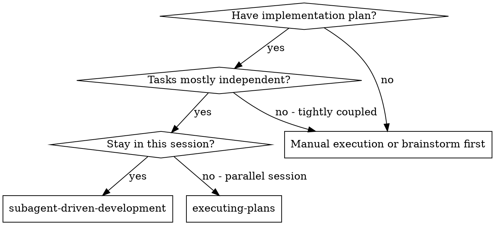
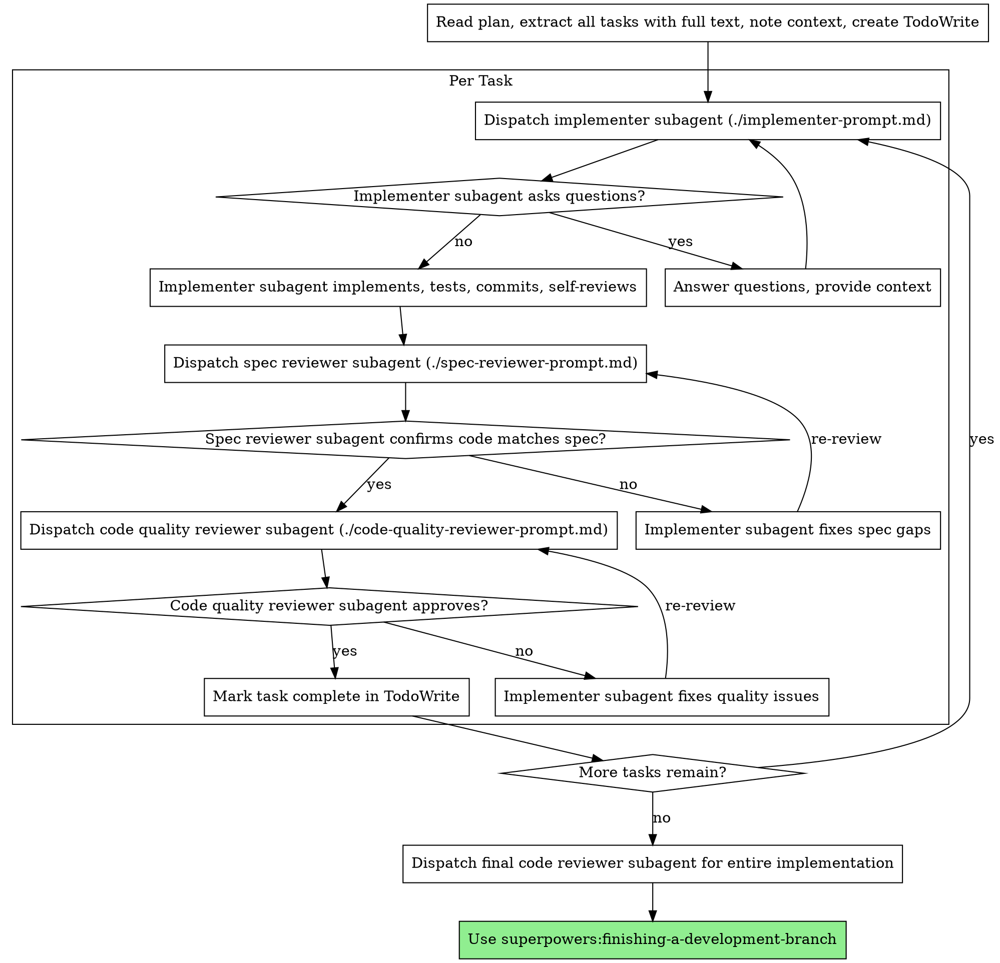
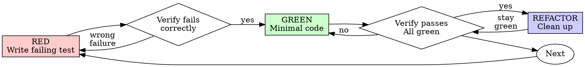

# JSON reader errors testing plan execution

**Session ID:** ses_1bfb1b581ffek1ltg2kfh6jLz3
**Created:** 5/19/2026, 3:55:33 PM
**Updated:** 5/19/2026, 4:13:42 PM

---

## User

# Subagent-Driven Development

Execute plan by dispatching fresh subagent per task, with two-stage review after each: spec compliance review first, then code quality review.

**Why subagents:** You delegate tasks to specialized agents with isolated context. By precisely crafting their instructions and context, you ensure they stay focused and succeed at their task. They should never inherit your session's context or history — you construct exactly what they need. This also preserves your own context for coordination work.

**Core principle:** Fresh subagent per task + two-stage review (spec then quality) = high quality, fast iteration

**Continuous execution:** Do not pause to check in with your human partner between tasks. Execute all tasks from the plan without stopping. The only reasons to stop are: BLOCKED status you cannot resolve, ambiguity that genuinely prevents progress, or all tasks complete. "Should I continue?" prompts and progress summaries waste their time — they asked you to execute the plan, so execute it.

## When to Use



**vs. Executing Plans (parallel session):**
- Same session (no context switch)
- Fresh subagent per task (no context pollution)
- Two-stage review after each task: spec compliance first, then code quality
- Faster iteration (no human-in-loop between tasks)

## The Process



## Model Selection

Use the least powerful model that can handle each role to conserve cost and increase speed.

**Mechanical implementation tasks** (isolated functions, clear specs, 1-2 files): use a fast, cheap model. Most implementation tasks are mechanical when the plan is well-specified.

**Integration and judgment tasks** (multi-file coordination, pattern matching, debugging): use a standard model.

**Architecture, design, and review tasks**: use the most capable available model.

**Task complexity signals:**
- Touches 1-2 files with a complete spec → cheap model
- Touches multiple files with integration concerns → standard model
- Requires design judgment or broad codebase understanding → most capable model

## Handling Implementer Status

Implementer subagents report one of four statuses. Handle each appropriately:

**DONE:** Proceed to spec compliance review.

**DONE_WITH_CONCERNS:** The implementer completed the work but flagged doubts. Read the concerns before proceeding. If the concerns are about correctness or scope, address them before review. If they're observations (e.g., "this file is getting large"), note them and proceed to review.

**NEEDS_CONTEXT:** The implementer needs information that wasn't provided. Provide the missing context and re-dispatch.

**BLOCKED:** The implementer cannot complete the task. Assess the blocker:
1. If it's a context problem, provide more context and re-dispatch with the same model
2. If the task requires more reasoning, re-dispatch with a more capable model
3. If the task is too large, break it into smaller pieces
4. If the plan itself is wrong, escalate to the human

**Never** ignore an escalation or force the same model to retry without changes. If the implementer said it's stuck, something needs to change.

## Prompt Templates

- `./implementer-prompt.md` - Dispatch implementer subagent
- `./spec-reviewer-prompt.md` - Dispatch spec compliance reviewer subagent
- `./code-quality-reviewer-prompt.md` - Dispatch code quality reviewer subagent

## Example Workflow

```
You: I'm using Subagent-Driven Development to execute this plan.

[Read plan file once: docs/superpowers/plans/feature-plan.md]
[Extract all 5 tasks with full text and context]
[Create TodoWrite with all tasks]

Task 1: Hook installation script

[Get Task 1 text and context (already extracted)]
[Dispatch implementation subagent with full task text + context]

Implementer: "Before I begin - should the hook be installed at user or system level?"

You: "User level (~/.config/superpowers/hooks/)"

Implementer: "Got it. Implementing now..."
[Later] Implementer:
  - Implemented install-hook command
  - Added tests, 5/5 passing
  - Self-review: Found I missed --force flag, added it
  - Committed

[Dispatch spec compliance reviewer]
Spec reviewer: ✅ Spec compliant - all requirements met, nothing extra

[Get git SHAs, dispatch code quality reviewer]
Code reviewer: Strengths: Good test coverage, clean. Issues: None. Approved.

[Mark Task 1 complete]

Task 2: Recovery modes

[Get Task 2 text and context (already extracted)]
[Dispatch implementation subagent with full task text + context]

Implementer: [No questions, proceeds]
Implementer:
  - Added verify/repair modes
  - 8/8 tests passing
  - Self-review: All good
  - Committed

[Dispatch spec compliance reviewer]
Spec reviewer: ❌ Issues:
  - Missing: Progress reporting (spec says "report every 100 items")
  - Extra: Added --json flag (not requested)

[Implementer fixes issues]
Implementer: Removed --json flag, added progress reporting

[Spec reviewer reviews again]
Spec reviewer: ✅ Spec compliant now

[Dispatch code quality reviewer]
Code reviewer: Strengths: Solid. Issues (Important): Magic number (100)

[Implementer fixes]
Implementer: Extracted PROGRESS_INTERVAL constant

[Code reviewer reviews again]
Code reviewer: ✅ Approved

[Mark Task 2 complete]

...

[After all tasks]
[Dispatch final code-reviewer]
Final reviewer: All requirements met, ready to merge

Done!
```

## Advantages

**vs. Manual execution:**
- Subagents follow TDD naturally
- Fresh context per task (no confusion)
- Parallel-safe (subagents don't interfere)
- Subagent can ask questions (before AND during work)

**vs. Executing Plans:**
- Same session (no handoff)
- Continuous progress (no waiting)
- Review checkpoints automatic

**Efficiency gains:**
- No file reading overhead (controller provides full text)
- Controller curates exactly what context is needed
- Subagent gets complete information upfront
- Questions surfaced before work begins (not after)

**Quality gates:**
- Self-review catches issues before handoff
- Two-stage review: spec compliance, then code quality
- Review loops ensure fixes actually work
- Spec compliance prevents over/under-building
- Code quality ensures implementation is well-built

**Cost:**
- More subagent invocations (implementer + 2 reviewers per task)
- Controller does more prep work (extracting all tasks upfront)
- Review loops add iterations
- But catches issues early (cheaper than debugging later)

## Red Flags

**Never:**
- Start implementation on main/master branch without explicit user consent
- Skip reviews (spec compliance OR code quality)
- Proceed with unfixed issues
- Dispatch multiple implementation subagents in parallel (conflicts)
- Make subagent read plan file (provide full text instead)
- Skip scene-setting context (subagent needs to understand where task fits)
- Ignore subagent questions (answer before letting them proceed)
- Accept "close enough" on spec compliance (spec reviewer found issues = not done)
- Skip review loops (reviewer found issues = implementer fixes = review again)
- Let implementer self-review replace actual review (both are needed)
- **Start code quality review before spec compliance is ✅** (wrong order)
- Move to next task while either review has open issues

**If subagent asks questions:**
- Answer clearly and completely
- Provide additional context if needed
- Don't rush them into implementation

**If reviewer finds issues:**
- Implementer (same subagent) fixes them
- Reviewer reviews again
- Repeat until approved
- Don't skip the re-review

**If subagent fails task:**
- Dispatch fix subagent with specific instructions
- Don't try to fix manually (context pollution)

## Integration

**Required workflow skills:**
- **superpowers:using-git-worktrees** - Ensures isolated workspace (creates one or verifies existing)
- **superpowers:writing-plans** - Creates the plan this skill executes
- **superpowers:requesting-code-review** - Code review template for reviewer subagents
- **superpowers:finishing-a-development-branch** - Complete development after all tasks

**Subagents should use:**
- **superpowers:test-driven-development** - Subagents follow TDD for each task

**Alternative workflow:**
- **superpowers:executing-plans** - Use for parallel session instead of same-session execution


i want to execute this plan @docs\superpowers\plans\2026-05-19-json-reader-errors-testing.md

---

## Assistant (Build · gpt-5.5 · 19.6s)

**Tool: skill**

**Input:**
```json
{
  "name": "subagent-driven-development"
}
```

**Output:**
```
<skill_content name="subagent-driven-development">
# Skill: subagent-driven-development

# Subagent-Driven Development

Execute plan by dispatching fresh subagent per task, with two-stage review after each: spec compliance review first, then code quality review.

**Why subagents:** You delegate tasks to specialized agents with isolated context. By precisely crafting their instructions and context, you ensure they stay focused and succeed at their task. They should never inherit your session's context or history — you construct exactly what they need. This also preserves your own context for coordination work.

**Core principle:** Fresh subagent per task + two-stage review (spec then quality) = high quality, fast iteration

**Continuous execution:** Do not pause to check in with your human partner between tasks. Execute all tasks from the plan without stopping. The only reasons to stop are: BLOCKED status you cannot resolve, ambiguity that genuinely prevents progress, or all tasks complete. "Should I continue?" prompts and progress summaries waste their time — they asked you to execute the plan, so execute it.

## When to Use


**vs. Executing Plans (parallel session):**
- Same session (no context switch)
- Fresh subagent per task (no context pollution)
- Two-stage review after each task: spec compliance first, then code quality
- Faster iteration (no human-in-loop between tasks)

## The Process


## Model Selection

Use the least powerful model that can handle each role to conserve cost and increase speed.

**Mechanical implementation tasks** (isolated functions, clear specs, 1-2 files): use a fast, cheap model. Most implementation tasks are mechanical when the plan is well-specified.

**Integration and judgment tasks** (multi-file coordination, pattern matching, debugging): use a standard model.

**Architecture, design, and review tasks**: use the most capable available model.

**Task complexity signals:**
- Touches 1-2 files with a complete spec → cheap model
- Touches multiple files with integration concerns → standard model
- Requires design judgment or broad codebase understanding → most capable model

## Handling Implementer Status

Implementer subagents report one of four statuses. Handle each appropriately:

**DONE:** Proceed to spec compliance review.

**DONE_WITH_CONCERNS:** The implementer completed the work but flagged doubts. Read the concerns before proceeding. If the concerns are about correctness or scope, address them before review. If they're observations (e.g., "this file is getting large"), note them and proceed to review.

**NEEDS_CONTEXT:** The implementer needs information that wasn't provided. Provide the missing context and re-dispatch.

**BLOCKED:** The implementer cannot complete the task. Assess the blocker:
1. If it's a context problem, provide more context and re-dispatch with the same model
2. If the task requires more reasoning, re-dispatch with a more capable model
3. If the task is too large, break it into smaller pieces
4. If the plan itself is wrong, escalate to the human

**Never** ignore an escalation or force the same model to retry without changes. If the implementer said it's stuck, something needs to change.

## Prompt Templates

- `./implementer-prompt.md` - Dispatch implementer subagent
- `./spec-reviewer-prompt.md` - Dispatch spec compliance reviewer subagent
- `./code-quality-reviewer-prompt.md` - Dispatch code quality reviewer subagent

## Example Workflow

```
You: I'm using Subagent-Driven Development to execute this plan.

[Read plan file once: docs/superpowers/plans/feature-plan.md]
[Extract all 5 tasks with full text and context]
[Create TodoWrite with all tasks]

Task 1: Hook installation script

[Get Task 1 text and context (already extracted)]
[Dispatch implementation subagent with full task text + context]

Implementer: "Before I begin - should the hook be installed at user or system level?"

You: "User level (~/.config/superpowers/hooks/)"

Implementer: "Got it. Implementing now..."
[Later] Implementer:
  - Implemented install-hook command
  - Added tests, 5/5 passing
  - Self-review: Found I missed --force flag, added it
  - Committed

[Dispatch spec compliance reviewer]
Spec reviewer: ✅ Spec compliant - all requirements met, nothing extra

[Get git SHAs, dispatch code quality reviewer]
Code reviewer: Strengths: Good test coverage, clean. Issues: None. Approved.

[Mark Task 1 complete]

Task 2: Recovery modes

[Get Task 2 text and context (already extracted)]
[Dispatch implementation subagent with full task text + context]

Implementer: [No questions, proceeds]
Implementer:
  - Added verify/repair modes
  - 8/8 tests passing
  - Self-review: All good
  - Committed

[Dispatch spec compliance reviewer]
Spec reviewer: ❌ Issues:
  - Missing: Progress reporting (spec says "report every 100 items")
  - Extra: Added --json flag (not requested)

[Implementer fixes issues]
Implementer: Removed --json flag, added progress reporting

[Spec reviewer reviews again]
Spec reviewer: ✅ Spec compliant now

[Dispatch code quality reviewer]
Code reviewer: Strengths: Solid. Issues (Important): Magic number (100)

[Implementer fixes]
Implementer: Extracted PROGRESS_INTERVAL constant

[Code reviewer reviews again]
Code reviewer: ✅ Approved

[Mark Task 2 complete]

...

[After all tasks]
[Dispatch final code-reviewer]
Final reviewer: All requirements met, ready to merge

Done!
```

## Advantages

**vs. Manual execution:**
- Subagents follow TDD naturally
- Fresh context per task (no confusion)
- Parallel-safe (subagents don't interfere)
- Subagent can ask questions (before AND during work)

**vs. Executing Plans:**
- Same session (no handoff)
- Continuous progress (no waiting)
- Review checkpoints automatic

**Efficiency gains:**
- No file reading overhead (controller provides full text)
- Controller curates exactly what context is needed
- Subagent gets complete information upfront
- Questions surfaced before work begins (not after)

**Quality gates:**
- Self-review catches issues before handoff
- Two-stage review: spec compliance, then code quality
- Review loops ensure fixes actually work
- Spec compliance prevents over/under-building
- Code quality ensures implementation is well-built

**Cost:**
- More subagent invocations (implementer + 2 reviewers per task)
- Controller does more prep work (extracting all tasks upfront)
- Review loops add iterations
- But catches issues early (cheaper than debugging later)

## Red Flags

**Never:**
- Start implementation on main/master branch without explicit user consent
- Skip reviews (spec compliance OR code quality)
- Proceed with unfixed issues
- Dispatch multiple implementation subagents in parallel (conflicts)
- Make subagent read plan file (provide full text instead)
- Skip scene-setting context (subagent needs to understand where task fits)
- Ignore subagent questions (answer before letting them proceed)
- Accept "close enough" on spec compliance (spec reviewer found issues = not done)
- Skip review loops (reviewer found issues = implementer fixes = review again)
- Let implementer self-review replace actual review (both are needed)
- **Start code quality review before spec compliance is ✅** (wrong order)
- Move to next task while either review has open issues

**If subagent asks questions:**
- Answer clearly and completely
- Provide additional context if needed
- Don't rush them into implementation

**If reviewer finds issues:**
- Implementer (same subagent) fixes them
- Reviewer reviews again
- Repeat until approved
- Don't skip the re-review

**If subagent fails task:**
- Dispatch fix subagent with specific instructions
- Don't try to fix manually (context pollution)

## Integration

**Required workflow skills:**
- **superpowers:using-git-worktrees** - Ensures isolated workspace (creates one or verifies existing)
- **superpowers:writing-plans** - Creates the plan this skill executes
- **superpowers:requesting-code-review** - Code review template for reviewer subagents
- **superpowers:finishing-a-development-branch** - Complete development after all tasks

**Subagents should use:**
- **superpowers:test-driven-development** - Subagents follow TDD for each task

**Alternative workflow:**
- **superpowers:executing-plans** - Use for parallel session instead of same-session execution

Base directory for this skill: file:///C:/Users/moame/.cache/opencode/packages/superpowers@git+https_/github.com/obra/superpowers.git/node_modules/superpowers/skills/subagent-driven-development
Relative paths in this skill (e.g., scripts/, reference/) are relative to this base directory.
Note: file list is sampled.

<skill_files>
<file>C:\Users\moame\.cache\opencode\packages\superpowers@git+https_\github.com\obra\superpowers.git\node_modules\superpowers\skills\subagent-driven-development\spec-reviewer-prompt.md</file>
<file>C:\Users\moame\.cache\opencode\packages\superpowers@git+https_\github.com\obra\superpowers.git\node_modules\superpowers\skills\subagent-driven-development\implementer-prompt.md</file>
<file>C:\Users\moame\.cache\opencode\packages\superpowers@git+https_\github.com\obra\superpowers.git\node_modules\superpowers\skills\subagent-driven-development\code-quality-reviewer-prompt.md</file>
</skill_files>
</skill_content>
```

---

## Assistant (Build · gpt-5.5 · 5.7s)

Using `subagent-driven-development` to execute the plan task-by-task with implementation and review gates. I’ll first verify the workspace isolation requirement, then dispatch each task with its exact plan context.

**Tool: skill**

**Input:**
```json
{
  "name": "using-git-worktrees"
}
```

**Output:**
```
<skill_content name="using-git-worktrees">
# Skill: using-git-worktrees

# Using Git Worktrees

## Overview

Ensure work happens in an isolated workspace. Prefer your platform's native worktree tools. Fall back to manual git worktrees only when no native tool is available.

**Core principle:** Detect existing isolation first. Then use native tools. Then fall back to git. Never fight the harness.

**Announce at start:** "I'm using the using-git-worktrees skill to set up an isolated workspace."

## Step 0: Detect Existing Isolation

**Before creating anything, check if you are already in an isolated workspace.**

```bash
GIT_DIR=$(cd "$(git rev-parse --git-dir)" 2>/dev/null && pwd -P)
GIT_COMMON=$(cd "$(git rev-parse --git-common-dir)" 2>/dev/null && pwd -P)
BRANCH=$(git branch --show-current)
```

**Submodule guard:** `GIT_DIR != GIT_COMMON` is also true inside git submodules. Before concluding "already in a worktree," verify you are not in a submodule:

```bash
# If this returns a path, you're in a submodule, not a worktree — treat as normal repo
git rev-parse --show-superproject-working-tree 2>/dev/null
```

**If `GIT_DIR != GIT_COMMON` (and not a submodule):** You are already in a linked worktree. Skip to Step 3 (Project Setup). Do NOT create another worktree.

Report with branch state:
- On a branch: "Already in isolated workspace at `<path>` on branch `<name>`."
- Detached HEAD: "Already in isolated workspace at `<path>` (detached HEAD, externally managed). Branch creation needed at finish time."

**If `GIT_DIR == GIT_COMMON` (or in a submodule):** You are in a normal repo checkout.

Has the user already indicated their worktree preference in your instructions? If not, ask for consent before creating a worktree:

> "Would you like me to set up an isolated worktree? It protects your current branch from changes."

Honor any existing declared preference without asking. If the user declines consent, work in place and skip to Step 3.

## Step 1: Create Isolated Workspace

**You have two mechanisms. Try them in this order.**

### 1a. Native Worktree Tools (preferred)

The user has asked for an isolated workspace (Step 0 consent). Do you already have a way to create a worktree? It might be a tool with a name like `EnterWorktree`, `WorktreeCreate`, a `/worktree` command, or a `--worktree` flag. If you do, use it and skip to Step 3.

Native tools handle directory placement, branch creation, and cleanup automatically. Using `git worktree add` when you have a native tool creates phantom state your harness can't see or manage.

Only proceed to Step 1b if you have no native worktree tool available.

### 1b. Git Worktree Fallback

**Only use this if Step 1a does not apply** — you have no native worktree tool available. Create a worktree manually using git.

#### Directory Selection

Follow this priority order. Explicit user preference always beats observed filesystem state.

1. **Check your instructions for a declared worktree directory preference.** If the user has already specified one, use it without asking.

2. **Check for an existing project-local worktree directory:**
   ```bash
   ls -d .worktrees 2>/dev/null     # Preferred (hidden)
   ls -d worktrees 2>/dev/null      # Alternative
   ```
   If found, use it. If both exist, `.worktrees` wins.

3. **Check for an existing global directory:**
   ```bash
   project=$(basename "$(git rev-parse --show-toplevel)")
   ls -d ~/.config/superpowers/worktrees/$project 2>/dev/null
   ```
   If found, use it (backward compatibility with legacy global path).

4. **If there is no other guidance available**, default to `.worktrees/` at the project root.

#### Safety Verification (project-local directories only)

**MUST verify directory is ignored before creating worktree:**

```bash
git check-ignore -q .worktrees 2>/dev/null || git check-ignore -q worktrees 2>/dev/null
```

**If NOT ignored:** Add to .gitignore, commit the change, then proceed.

**Why critical:** Prevents accidentally committing worktree contents to repository.

Global directories (`~/.config/superpowers/worktrees/`) need no verification.

#### Create the Worktree

```bash
project=$(basename "$(git rev-parse --show-toplevel)")

# Determine path based on chosen location
# For project-local: path="$LOCATION/$BRANCH_NAME"
# For global: path="~/.config/superpowers/worktrees/$project/$BRANCH_NAME"

git worktree add "$path" -b "$BRANCH_NAME"
cd "$path"
```

**Sandbox fallback:** If `git worktree add` fails with a permission error (sandbox denial), tell the user the sandbox blocked worktree creation and you're working in the current directory instead. Then run setup and baseline tests in place.

## Step 3: Project Setup

Auto-detect and run appropriate setup:

```bash
# Node.js
if [ -f package.json ]; then npm install; fi

# Rust
if [ -f Cargo.toml ]; then cargo build; fi

# Python
if [ -f requirements.txt ]; then pip install -r requirements.txt; fi
if [ -f pyproject.toml ]; then poetry install; fi

# Go
if [ -f go.mod ]; then go mod download; fi
```

## Step 4: Verify Clean Baseline

Run tests to ensure workspace starts clean:

```bash
# Use project-appropriate command
npm test / cargo test / pytest / go test ./...
```

**If tests fail:** Report failures, ask whether to proceed or investigate.

**If tests pass:** Report ready.

### Report

```
Worktree ready at <full-path>
Tests passing (<N> tests, 0 failures)
Ready to implement <feature-name>
```

## Quick Reference

| Situation | Action |
|-----------|--------|
| Already in linked worktree | Skip creation (Step 0) |
| In a submodule | Treat as normal repo (Step 0 guard) |
| Native worktree tool available | Use it (Step 1a) |
| No native tool | Git worktree fallback (Step 1b) |
| `.worktrees/` exists | Use it (verify ignored) |
| `worktrees/` exists | Use it (verify ignored) |
| Both exist | Use `.worktrees/` |
| Neither exists | Check instruction file, then default `.worktrees/` |
| Global path exists | Use it (backward compat) |
| Directory not ignored | Add to .gitignore + commit |
| Permission error on create | Sandbox fallback, work in place |
| Tests fail during baseline | Report failures + ask |
| No package.json/Cargo.toml | Skip dependency install |

## Common Mistakes

### Fighting the harness

- **Problem:** Using `git worktree add` when the platform already provides isolation
- **Fix:** Step 0 detects existing isolation. Step 1a defers to native tools.

### Skipping detection

- **Problem:** Creating a nested worktree inside an existing one
- **Fix:** Always run Step 0 before creating anything

### Skipping ignore verification

- **Problem:** Worktree contents get tracked, pollute git status
- **Fix:** Always use `git check-ignore` before creating project-local worktree

### Assuming directory location

- **Problem:** Creates inconsistency, violates project conventions
- **Fix:** Follow priority: existing > global legacy > instruction file > default

### Proceeding with failing tests

- **Problem:** Can't distinguish new bugs from pre-existing issues
- **Fix:** Report failures, get explicit permission to proceed

## Red Flags

**Never:**
- Create a worktree when Step 0 detects existing isolation
- Use `git worktree add` when you have a native worktree tool (e.g., `EnterWorktree`). This is the #1 mistake — if you have it, use it.
- Skip Step 1a by jumping straight to Step 1b's git commands
- Create worktree without verifying it's ignored (project-local)
- Skip baseline test verification
- Proceed with failing tests without asking

**Always:**
- Run Step 0 detection first
- Prefer native tools over git fallback
- Follow directory priority: existing > global legacy > instruction file > default
- Verify directory is ignored for project-local
- Auto-detect and run project setup
- Verify clean test baseline

Base directory for this skill: file:///C:/Users/moame/.cache/opencode/packages/superpowers@git+https_/github.com/obra/superpowers.git/node_modules/superpowers/skills/using-git-worktrees
Relative paths in this skill (e.g., scripts/, reference/) are relative to this base directory.
Note: file list is sampled.

<skill_files>

</skill_files>
</skill_content>
```

---

## Assistant (Build · gpt-5.5 · 6.2s)

I'm using the `using-git-worktrees` skill to set up or verify an isolated workspace before implementation.

**Tool: bash**

**Input:**
```json
{
  "command": "git rev-parse --git-dir",
  "description": "Shows git directory path"
}
```

**Output:**
```
.git

```

**Tool: bash**

**Input:**
```json
{
  "command": "git rev-parse --git-common-dir",
  "description": "Shows git common directory"
}
```

**Output:**
```
.git

```

**Tool: bash**

**Input:**
```json
{
  "command": "git branch --show-current",
  "description": "Shows current git branch"
}
```

**Output:**
```
main

```

**Tool: bash**

**Input:**
```json
{
  "command": "git rev-parse --show-superproject-working-tree",
  "description": "Checks for git submodule"
}
```

**Output:**
```
(no output)
```

---

## Assistant (Build · gpt-5.5 · 11.3s)

This checkout is a normal repo on `main`, not an isolated worktree. The plan requires feature work; I need your consent before creating an isolated worktree because there is no native worktree tool available here.

**Tool: question**

**Input:**
```json
{
  "questions": [
    {
      "header": "Worktree",
      "question": "Would you like me to set up an isolated worktree? It protects your current branch from changes.",
      "options": [
        {
          "label": "Create worktree",
          "description": "Use a new git worktree and branch for this plan."
        },
        {
          "label": "Work in place",
          "description": "Apply the plan directly in the current checkout on main."
        }
      ]
    }
  ]
}
```

**Output:**
```
User has answered your questions: "Would you like me to set up an isolated worktree? It protects your current branch from changes."="Work in place". You can now continue with the user's answers in mind.
```

---

## Assistant (Build · gpt-5.5 · 5.7s)

**Tool: skill**

**Input:**
```json
{
  "name": "test-driven-development"
}
```

**Output:**
```
<skill_content name="test-driven-development">
# Skill: test-driven-development

# Test-Driven Development (TDD)

## Overview

Write the test first. Watch it fail. Write minimal code to pass.

**Core principle:** If you didn't watch the test fail, you don't know if it tests the right thing.

**Violating the letter of the rules is violating the spirit of the rules.**

## When to Use

**Always:**
- New features
- Bug fixes
- Refactoring
- Behavior changes

**Exceptions (ask your human partner):**
- Throwaway prototypes
- Generated code
- Configuration files

Thinking "skip TDD just this once"? Stop. That's rationalization.

## The Iron Law

```
NO PRODUCTION CODE WITHOUT A FAILING TEST FIRST
```

Write code before the test? Delete it. Start over.

**No exceptions:**
- Don't keep it as "reference"
- Don't "adapt" it while writing tests
- Don't look at it
- Delete means delete

Implement fresh from tests. Period.

## Red-Green-Refactor



### RED - Write Failing Test

Write one minimal test showing what should happen.

<Good>
```typescript
test('retries failed operations 3 times', async () => {
  let attempts = 0;
  const operation = () => {
    attempts++;
    if (attempts < 3) throw new Error('fail');
    return 'success';
  };

  const result = await retryOperation(operation);

  expect(result).toBe('success');
  expect(attempts).toBe(3);
});
```
Clear name, tests real behavior, one thing
</Good>

<Bad>
```typescript
test('retry works', async () => {
  const mock = jest.fn()
    .mockRejectedValueOnce(new Error())
    .mockRejectedValueOnce(new Error())
    .mockResolvedValueOnce('success');
  await retryOperation(mock);
  expect(mock).toHaveBeenCalledTimes(3);
});
```
Vague name, tests mock not code
</Bad>

**Requirements:**
- One behavior
- Clear name
- Real code (no mocks unless unavoidable)

### Verify RED - Watch It Fail

**MANDATORY. Never skip.**

```bash
npm test path/to/test.test.ts
```

Confirm:
- Test fails (not errors)
- Failure message is expected
- Fails because feature missing (not typos)

**Test passes?** You're testing existing behavior. Fix test.

**Test errors?** Fix error, re-run until it fails correctly.

### GREEN - Minimal Code

Write simplest code to pass the test.

<Good>
```typescript
async function retryOperation<T>(fn: () => Promise<T>): Promise<T> {
  for (let i = 0; i < 3; i++) {
    try {
      return await fn();
    } catch (e) {
      if (i === 2) throw e;
    }
  }
  throw new Error('unreachable');
}
```
Just enough to pass
</Good>

<Bad>
```typescript
async function retryOperation<T>(
  fn: () => Promise<T>,
  options?: {
    maxRetries?: number;
    backoff?: 'linear' | 'exponential';
    onRetry?: (attempt: number) => void;
  }
): Promise<T> {
  // YAGNI
}
```
Over-engineered
</Bad>

Don't add features, refactor other code, or "improve" beyond the test.

### Verify GREEN - Watch It Pass

**MANDATORY.**

```bash
npm test path/to/test.test.ts
```

Confirm:
- Test passes
- Other tests still pass
- Output pristine (no errors, warnings)

**Test fails?** Fix code, not test.

**Other tests fail?** Fix now.

### REFACTOR - Clean Up

After green only:
- Remove duplication
- Improve names
- Extract helpers

Keep tests green. Don't add behavior.

### Repeat

Next failing test for next feature.

## Good Tests

| Quality | Good | Bad |
|---------|------|-----|
| **Minimal** | One thing. "and" in name? Split it. | `test('validates email and domain and whitespace')` |
| **Clear** | Name describes behavior | `test('test1')` |
| **Shows intent** | Demonstrates desired API | Obscures what code should do |

## Why Order Matters

**"I'll write tests after to verify it works"**

Tests written after code pass immediately. Passing immediately proves nothing:
- Might test wrong thing
- Might test implementation, not behavior
- Might miss edge cases you forgot
- You never saw it catch the bug

Test-first forces you to see the test fail, proving it actually tests something.

**"I already manually tested all the edge cases"**

Manual testing is ad-hoc. You think you tested everything but:
- No record of what you tested
- Can't re-run when code changes
- Easy to forget cases under pressure
- "It worked when I tried it" ≠ comprehensive

Automated tests are systematic. They run the same way every time.

**"Deleting X hours of work is wasteful"**

Sunk cost fallacy. The time is already gone. Your choice now:
- Delete and rewrite with TDD (X more hours, high confidence)
- Keep it and add tests after (30 min, low confidence, likely bugs)

The "waste" is keeping code you can't trust. Working code without real tests is technical debt.

**"TDD is dogmatic, being pragmatic means adapting"**

TDD IS pragmatic:
- Finds bugs before commit (faster than debugging after)
- Prevents regressions (tests catch breaks immediately)
- Documents behavior (tests show how to use code)
- Enables refactoring (change freely, tests catch breaks)

"Pragmatic" shortcuts = debugging in production = slower.

**"Tests after achieve the same goals - it's spirit not ritual"**

No. Tests-after answer "What does this do?" Tests-first answer "What should this do?"

Tests-after are biased by your implementation. You test what you built, not what's required. You verify remembered edge cases, not discovered ones.

Tests-first force edge case discovery before implementing. Tests-after verify you remembered everything (you didn't).

30 minutes of tests after ≠ TDD. You get coverage, lose proof tests work.

## Common Rationalizations

| Excuse | Reality |
|--------|---------|
| "Too simple to test" | Simple code breaks. Test takes 30 seconds. |
| "I'll test after" | Tests passing immediately prove nothing. |
| "Tests after achieve same goals" | Tests-after = "what does this do?" Tests-first = "what should this do?" |
| "Already manually tested" | Ad-hoc ≠ systematic. No record, can't re-run. |
| "Deleting X hours is wasteful" | Sunk cost fallacy. Keeping unverified code is technical debt. |
| "Keep as reference, write tests first" | You'll adapt it. That's testing after. Delete means delete. |
| "Need to explore first" | Fine. Throw away exploration, start with TDD. |
| "Test hard = design unclear" | Listen to test. Hard to test = hard to use. |
| "TDD will slow me down" | TDD faster than debugging. Pragmatic = test-first. |
| "Manual test faster" | Manual doesn't prove edge cases. You'll re-test every change. |
| "Existing code has no tests" | You're improving it. Add tests for existing code. |

## Red Flags - STOP and Start Over

- Code before test
- Test after implementation
- Test passes immediately
- Can't explain why test failed
- Tests added "later"
- Rationalizing "just this once"
- "I already manually tested it"
- "Tests after achieve the same purpose"
- "It's about spirit not ritual"
- "Keep as reference" or "adapt existing code"
- "Already spent X hours, deleting is wasteful"
- "TDD is dogmatic, I'm being pragmatic"
- "This is different because..."

**All of these mean: Delete code. Start over with TDD.**

## Example: Bug Fix

**Bug:** Empty email accepted

**RED**
```typescript
test('rejects empty email', async () => {
  const result = await submitForm({ email: '' });
  expect(result.error).toBe('Email required');
});
```

**Verify RED**
```bash
$ npm test
FAIL: expected 'Email required', got undefined
```

**GREEN**
```typescript
function submitForm(data: FormData) {
  if (!data.email?.trim()) {
    return { error: 'Email required' };
  }
  // ...
}
```

**Verify GREEN**
```bash
$ npm test
PASS
```

**REFACTOR**
Extract validation for multiple fields if needed.

## Verification Checklist

Before marking work complete:

- [ ] Every new function/method has a test
- [ ] Watched each test fail before implementing
- [ ] Each test failed for expected reason (feature missing, not typo)
- [ ] Wrote minimal code to pass each test
- [ ] All tests pass
- [ ] Output pristine (no errors, warnings)
- [ ] Tests use real code (mocks only if unavoidable)
- [ ] Edge cases and errors covered

Can't check all boxes? You skipped TDD. Start over.

## When Stuck

| Problem | Solution |
|---------|----------|
| Don't know how to test | Write wished-for API. Write assertion first. Ask your human partner. |
| Test too complicated | Design too complicated. Simplify interface. |
| Must mock everything | Code too coupled. Use dependency injection. |
| Test setup huge | Extract helpers. Still complex? Simplify design. |

## Debugging Integration

Bug found? Write failing test reproducing it. Follow TDD cycle. Test proves fix and prevents regression.

Never fix bugs without a test.

## Testing Anti-Patterns

When adding mocks or test utilities, read @testing-anti-patterns.md to avoid common pitfalls:
- Testing mock behavior instead of real behavior
- Adding test-only methods to production classes
- Mocking without understanding dependencies

## Final Rule

```
Production code → test exists and failed first
Otherwise → not TDD
```

No exceptions without your human partner's permission.

Base directory for this skill: file:///C:/Users/moame/.cache/opencode/packages/superpowers@git+https_/github.com/obra/superpowers.git/node_modules/superpowers/skills/test-driven-development
Relative paths in this skill (e.g., scripts/, reference/) are relative to this base directory.
Note: file list is sampled.

<skill_files>
<file>C:\Users\moame\.cache\opencode\packages\superpowers@git+https_\github.com\obra\superpowers.git\node_modules\superpowers\skills\test-driven-development\testing-anti-patterns.md</file>
</skill_files>
</skill_content>
```

---

## Assistant (Build · gpt-5.5 · 12.7s)

Working in place on `main` per your choice. I’ll run project setup and baseline tests before dispatching the plan tasks.

**Tool: glob**

**Input:**
```json
{
  "pattern": "package.json"
}
```

**Output:**
```
C:\programing\nodeJs\json-reader-superpowers\package.json
```

**Tool: bash**

**Input:**
```json
{
  "command": "git status --short",
  "description": "Shows current working changes"
}
```

**Output:**
```
(no output)
```

---

## Assistant (Build · gpt-5.5 · 14.5s)

Baseline setup detected a Node project and a clean worktree. Running install and the current test suite now.

**Tool: bash**

**Input:**
```json
{
  "command": "npm install; if ($?) { npm test }",
  "timeout": 120000,
  "description": "Installs dependencies and runs tests"
}
```

**Output:**
```

up to date, audited 1 package in 684ms

found 0 vulnerabilities

> json-reader-superpowers@1.0.0 test
> node --test

TAP version 13
# Subtest: collectBuildState validates objects and groups published slugs newest first
ok 1 - collectBuildState validates objects and groups published slugs newest first
  ---
  duration_ms: 74.0494
  type: 'test'
  ...
# Subtest: collectBuildState records invalid object warnings and file summaries
ok 2 - collectBuildState records invalid object warnings and file summaries
  ---
  duration_ms: 18.8246
  type: 'test'
  ...
# Subtest: CLI entrypoint exports main and source stylesheet exists
ok 3 - CLI entrypoint exports main and source stylesheet exists
  ---
  duration_ms: 20.2734
  type: 'test'
  ...
# Subtest: CLI entrypoint finds bundled stylesheet from another cwd
ok 4 - CLI entrypoint finds bundled stylesheet from another cwd
  ---
  duration_ms: 131.8132
  type: 'test'
  ...
# Subtest: renderDashboard returns an offline dashboard document
ok 5 - renderDashboard returns an offline dashboard document
  ---
  duration_ms: 0.882
  type: 'test'
  ...
# Subtest: buildSite writes dashboard and stylesheet
ok 6 - buildSite writes dashboard and stylesheet
  ---
  duration_ms: 12.0933
  type: 'test'
  ...
# Subtest: buildSite rejects output directory that overlaps input data
ok 7 - buildSite rejects output directory that overlaps input data
  ---
  duration_ms: 6.4324
  type: 'test'
  ...
# Subtest: buildSite rejects output directory that contains data path with dot-dot prefix segment
ok 8 - buildSite rejects output directory that contains data path with dot-dot prefix segment
  ---
  duration_ms: 6.0074
  type: 'test'
  ...
# Subtest: cleanOutput rejects empty output directory
ok 9 - cleanOutput rejects empty output directory
  ---
  duration_ms: 0.3178
  type: 'test'
  ...
# Subtest: buildSite rejects empty output directory
ok 10 - buildSite rejects empty output directory
  ---
  duration_ms: 0.3689
  type: 'test'
  ...
# Subtest: buildSite rejects null output directory
ok 11 - buildSite rejects null output directory
  ---
  duration_ms: 0.5366
  type: 'test'
  ...
# Subtest: renderDashboard links slug cards and per-file slug counts
ok 12 - renderDashboard links slug cards and per-file slug counts
  ---
  duration_ms: 0.8051
  type: 'test'
  ...
# Subtest: renderDashboard URL-encodes slug href path segments
ok 13 - renderDashboard URL-encodes slug href path segments
  ---
  duration_ms: 0.3486
  type: 'test'
  ...
# Subtest: renderDashboard encodes wildcard characters in slug href file names
ok 14 - renderDashboard encodes wildcard characters in slug href file names
  ---
  duration_ms: 0.1997
  type: 'test'
  ...
# Subtest: buildSite writes one page for each unique published slug
ok 15 - buildSite writes one page for each unique published slug
  ---
  duration_ms: 16.4214
  type: 'test'
  ...
# Subtest: buildSite writes encoded slug file names inside the output directory
ok 16 - buildSite writes encoded slug file names inside the output directory
  ---
  duration_ms: 13.7076
  type: 'test'
  ...
# Subtest: buildSite deletes old generated files before writing new output
ok 17 - buildSite deletes old generated files before writing new output
  ---
  duration_ms: 12.6979
  type: 'test'
  ...
# Subtest: generated HTML links only to the shared local stylesheet
ok 18 - generated HTML links only to the shared local stylesheet
  ---
  duration_ms: 11.577
  type: 'test'
  ...
# Subtest: readJsonFiles returns a warning when data folder is missing
ok 19 - readJsonFiles returns a warning when data folder is missing
  ---
  duration_ms: 15.9923
  type: 'test'
  ...
# Subtest: readJsonFiles reads a single object JSON file
ok 20 - readJsonFiles reads a single object JSON file
  ---
  duration_ms: 7.8545
  type: 'test'
  ...
# Subtest: readJsonFiles reads array JSON files
ok 21 - readJsonFiles reads array JSON files
  ---
  duration_ms: 5.0971
  type: 'test'
  ...
# Subtest: readJsonFiles skips invalid JSON files with warnings
ok 22 - readJsonFiles skips invalid JSON files with warnings
  ---
  duration_ms: 6.4056
  type: 'test'
  ...
# Subtest: readJsonFiles skips primitive JSON roots with warnings
ok 23 - readJsonFiles skips primitive JSON roots with warnings
  ---
  duration_ms: 6.3369
  type: 'test'
  ...
# Subtest: renderSlugPage shows slug heading, count, controls, and object cards
ok 24 - renderSlugPage shows slug heading, count, controls, and object cards
  ---
  duration_ms: 45.4827
  type: 'test'
  ...
# Subtest: renderSlugPage embeds only the provided slug objects as JSON data
ok 25 - renderSlugPage embeds only the provided slug objects as JSON data
  ---
  duration_ms: 0.5741
  type: 'test'
  ...
# Subtest: renderSlugPage script reads and updates the file query parameter
ok 26 - renderSlugPage script reads and updates the file query parameter
  ---
  duration_ms: 0.4756
  type: 'test'
  ...
# Subtest: stylesheet includes dashboard and slug page layout selectors
ok 27 - stylesheet includes dashboard and slug page layout selectors
  ---
  duration_ms: 12.9903
  type: 'test'
  ...
# Subtest: stylesheet has no external imports or remote asset references
ok 28 - stylesheet has no external imports or remote asset references
  ---
  duration_ms: 4.2882
  type: 'test'
  ...
# Subtest: validateObject normalizes valid published objects
ok 29 - validateObject normalizes valid published objects
  ---
  duration_ms: 6.9558
  type: 'test'
  ...
# Subtest: validateObject accepts draft true and marks unpublished
ok 30 - validateObject accepts draft true and marks unpublished
  ---
  duration_ms: 0.5813
  type: 'test'
  ...
# Subtest: validateObject rejects missing required strings
ok 31 - validateObject rejects missing required strings
  ---
  duration_ms: 0.5888
  type: 'test'
  ...
# Subtest: validateObject rejects impossible YYYY-MM-DD dates
ok 32 - validateObject rejects impossible YYYY-MM-DD dates
  ---
  duration_ms: 0.4481
  type: 'test'
  ...
# Subtest: validateObject rejects non-string tags
ok 33 - validateObject rejects non-string tags
  ---
  duration_ms: 0.5199
  type: 'test'
  ...
1..33
# tests 33
# suites 0
# pass 33
# fail 0
# cancelled 0
# skipped 0
# todo 0
# duration_ms 397.3135

```

---

## Assistant (Build · gpt-5.5 · 6.4s)

Baseline is clean: `npm install` is up to date and `npm test` passes with 33 tests. Creating the task tracker and dispatching Task 1 implementation now.

**Tool: todowrite**

**Input:**
```json
{
  "todos": [
    {
      "content": "Task 1: Missing Data Build Behavior",
      "status": "in_progress",
      "priority": "high"
    },
    {
      "content": "Task 2: No Published Objects Behavior",
      "status": "pending",
      "priority": "high"
    },
    {
      "content": "Task 3: CLI Warning Output",
      "status": "pending",
      "priority": "high"
    },
    {
      "content": "Task 4: Integration Test With Sample Data",
      "status": "pending",
      "priority": "high"
    },
    {
      "content": "Final review and completion verification",
      "status": "pending",
      "priority": "high"
    }
  ]
}
```

**Output:**
```
[
  {
    "content": "Task 1: Missing Data Build Behavior",
    "status": "in_progress",
    "priority": "high"
  },
  {
    "content": "Task 2: No Published Objects Behavior",
    "status": "pending",
    "priority": "high"
  },
  {
    "content": "Task 3: CLI Warning Output",
    "status": "pending",
    "priority": "high"
  },
  {
    "content": "Task 4: Integration Test With Sample Data",
    "status": "pending",
    "priority": "high"
  },
  {
    "content": "Final review and completion verification",
    "status": "pending",
    "priority": "high"
  }
]
```

---

## Assistant (Build · gpt-5.5 · 98.4s)

**Tool: task**

**Input:**
```json
{
  "description": "Implement task one",
  "subagent_type": "general",
  "prompt": "You are an implementer subagent executing Task 1 from a plan. Work in the current repository. Do not commit changes even though the plan mentions commits; the controller will handle final status. Use TDD: add the specified test, run it and observe failure/pass, then make the minimal production fixes only if needed. Return status DONE, DONE_WITH_CONCERNS, NEEDS_CONTEXT, or BLOCKED, plus files changed and verification commands/output summary.\n\nPlan context:\nGoal: Finish warning behavior and test coverage for missing data, invalid inputs, no-published-object builds, dashboard warning details, slug-page filtering data, and full output generation.\nArchitecture: Preserve the data pipeline. Warning strings are produced by reader.js and validator.js, surfaced in terminal output by index.js, rendered in dashboard.html by html.js.\nTech: Node built-in fs/path/node:test, CommonJS.\n\nTask 1: Missing Data Build Behavior\nFiles: Modify test/generator.test.js. Production fixes only if tests require them in src/reader.js or src/generator.js.\n\nSteps:\n1. Append to test/generator.test.js exactly this behavior:\n\ntest('buildSite succeeds with missing data folder and generates only dashboard plus stylesheet', async () => {\n  const fixtureRoot = await fs.mkdtemp(path.join(os.tmpdir(), 'json-reader-missing-data-'));\n  const outputDir = path.join(fixtureRoot, 'output');\n  const assetSourcePath = path.join(fixtureRoot, 'src', 'assets', 'style.css');\n  await fs.mkdir(path.dirname(assetSourcePath), { recursive: true });\n  await fs.writeFile(assetSourcePath, 'body { color: #111; }');\n\n  const result = await buildSite({\n    dataDir: path.join(fixtureRoot, 'data'),\n    outputDir,\n    assetSourcePath,\n  });\n\n  const generatedFiles = await fs.readdir(outputDir);\n  const dashboard = await fs.readFile(path.join(outputDir, 'dashboard.html'), 'utf8');\n\n  assert.deepEqual(result.stats, {\n    filesRead: 0,\n    validObjects: 0,\n    publishedObjects: 0,\n    draftObjects: 0,\n    uniquePublishedSlugs: 0,\n    warningCount: 1,\n  });\n  assert.deepEqual(generatedFiles.sort(), ['assets', 'dashboard.html']);\n  assert.match(dashboard, /Data folder not found: data/);\n  assert.match(dashboard, /0 JSON files read/);\n});\n\n2. Run: node --test test/generator.test.js\n3. If it fails because missing data throws, ensure readJsonFiles in src/reader.js has ENOENT branch: warnings.push(`Data folder not found: ${path.basename(dataDir)}`); return { files, warnings };\n4. If it fails because no warning count appears, ensure collectBuildState in src/generator.js sets state.stats.warningCount = state.warnings.length.\n5. Run: node --test test/generator.test.js\nExpected: PASS including missing data behavior.\n\nImportant: Keep changes minimal and do not modify unrelated files."
}
```

**Output:**
```
task_id: ses_1bfb03212ffeET0iwXPsL7rMvP (for resuming to continue this task if needed)

<task_result>
DONE_WITH_CONCERNS

Files changed:
- `test/generator.test.js`

Verification:
- Ran `node --test test/generator.test.js`
- Result: 17 tests passed, 0 failed

Concern:
- The newly added test passed immediately, so I did not observe a RED failure. Existing production code already implements the required missing-data behavior, so no production files were changed.
</task_result>
```

---

## Assistant (Build · gpt-5.5 · 73.6s)

Task 1 required behavior was already present; the new generator test passed without production changes. Running the required spec and quality reviews for Task 1.

**Tool: task**

**Input:**
```json
{
  "description": "Review task one spec",
  "subagent_type": "general",
  "prompt": "You are a spec compliance reviewer for Task 1. Review current repository changes for Task 1 only. Do not edit files. Compare against this spec:\n\nTask 1: Missing Data Build Behavior\n- Modify test/generator.test.js.\n- Add test named `buildSite succeeds with missing data folder and generates only dashboard plus stylesheet` with behavior: create temp fixture, missing dataDir, custom outputDir and assetSourcePath, write stylesheet, call buildSite, assert result.stats exactly equals filesRead 0, validObjects 0, publishedObjects 0, draftObjects 0, uniquePublishedSlugs 0, warningCount 1; assert generated files sorted are ['assets','dashboard.html']; dashboard contains /Data folder not found: data/ and /0 JSON files read/.\n- Production fixes in src/reader.js or src/generator.js only if needed.\n- Verification command should pass: node --test test/generator.test.js.\n\nReturn APPROVED or CHANGES_REQUESTED. Include file/line references for any issue."
}
```

**Output:**
```
task_id: ses_1bfaeb954ffedtl6Zo8WhV3aD1 (for resuming to continue this task if needed)

<task_result>
APPROVED

No Task 1 compliance issues found.

Verified with `node --test test/generator.test.js`: 17 tests passed, 0 failed.
</task_result>
```

**Tool: task**

**Input:**
```json
{
  "description": "Review task one quality",
  "subagent_type": "general",
  "prompt": "You are a code quality reviewer for Task 1. Review current repository changes for Task 1 only. Do not edit files. Focus on maintainability, test quality, minimality, and unintended side effects. Task 1 adds missing-data build behavior coverage to test/generator.test.js, with no production changes unless needed. Return APPROVED or CHANGES_REQUESTED with specific file/line findings."
}
```

**Output:**
```
task_id: ses_1bfaeb925ffe0K6saVaZwzTlt1 (for resuming to continue this task if needed)

<task_result>
APPROVED

No findings for Task 1.

Reviewed `test/generator.test.js` only. The added test is minimal, covers missing-data build behavior, asserts stats, generated output shape, warning rendering, and zero-file dashboard content without production changes.

Verification run: `node --test test/generator.test.js` passed, 17/17 tests.
</task_result>
```

---

## Assistant (Build · gpt-5.5 · 4.3s)

**Tool: todowrite**

**Input:**
```json
{
  "todos": [
    {
      "content": "Task 1: Missing Data Build Behavior",
      "status": "completed",
      "priority": "high"
    },
    {
      "content": "Task 2: No Published Objects Behavior",
      "status": "in_progress",
      "priority": "high"
    },
    {
      "content": "Task 3: CLI Warning Output",
      "status": "pending",
      "priority": "high"
    },
    {
      "content": "Task 4: Integration Test With Sample Data",
      "status": "pending",
      "priority": "high"
    },
    {
      "content": "Final review and completion verification",
      "status": "pending",
      "priority": "high"
    }
  ]
}
```

**Output:**
```
[
  {
    "content": "Task 1: Missing Data Build Behavior",
    "status": "completed",
    "priority": "high"
  },
  {
    "content": "Task 2: No Published Objects Behavior",
    "status": "in_progress",
    "priority": "high"
  },
  {
    "content": "Task 3: CLI Warning Output",
    "status": "pending",
    "priority": "high"
  },
  {
    "content": "Task 4: Integration Test With Sample Data",
    "status": "pending",
    "priority": "high"
  },
  {
    "content": "Final review and completion verification",
    "status": "pending",
    "priority": "high"
  }
]
```

---

## Assistant (Build · gpt-5.5 · 112.8s)

Task 1 passed both reviews. Dispatching Task 2 implementation for draft-only/no-published behavior.

**Tool: task**

**Input:**
```json
{
  "description": "Implement task two",
  "subagent_type": "general",
  "prompt": "You are an implementer subagent executing Task 2 from a plan. Work in the current repository. Do not commit changes even though the plan mentions commits; the controller will handle final status. Use TDD: add the specified tests, run them and observe failure/pass, then make the minimal production fixes only if needed. Return status DONE, DONE_WITH_CONCERNS, NEEDS_CONTEXT, or BLOCKED, plus files changed and verification commands/output summary.\n\nPlan context:\nGoal: Finish warning behavior and test coverage for missing data, invalid inputs, no-published-object builds, dashboard warning details, slug-page filtering data, and full output generation.\nArchitecture: Preserve the data pipeline. Warning strings are produced by reader.js and validator.js, surfaced in terminal output by index.js, rendered in dashboard.html by html.js.\nTech: Node built-in fs/path/node:test, CommonJS.\n\nTask 2: No Published Objects Behavior\nFiles: Modify test/data-pipeline.test.js and test/generator.test.js. Production fixes only if tests require them in src/generator.js.\n\nSteps:\n1. Append to test/data-pipeline.test.js:\n\ntest('collectBuildState counts drafts without creating published slug groups', async () => {\n  const dataDir = await writeFixture({\n    'drafts.json': [\n      { title: 'Draft One', slug: 'drafts', date: '2026-05-18', content: 'Hidden', draft: true },\n      { title: 'Draft Two', slug: 'drafts', date: '2026-05-19', content: 'Hidden', draft: true },\n    ],\n  });\n\n  const state = await collectBuildState(dataDir);\n\n  assert.equal(state.stats.validObjects, 2);\n  assert.equal(state.stats.publishedObjects, 0);\n  assert.equal(state.stats.draftObjects, 2);\n  assert.equal(state.stats.uniquePublishedSlugs, 0);\n  assert.equal(state.slugGroups.size, 0);\n});\n\n2. Append to test/generator.test.js:\n\ntest('buildSite generates no slug pages when there are no published objects', async () => {\n  const fixtureRoot = await fs.mkdtemp(path.join(os.tmpdir(), 'json-reader-no-published-'));\n  const dataDir = path.join(fixtureRoot, 'data');\n  const outputDir = path.join(fixtureRoot, 'output');\n  const assetSourcePath = path.join(fixtureRoot, 'src', 'assets', 'style.css');\n  await fs.mkdir(dataDir, { recursive: true });\n  await fs.mkdir(path.dirname(assetSourcePath), { recursive: true });\n  await fs.writeFile(assetSourcePath, 'body { color: #111; }');\n  await fs.writeFile(path.join(dataDir, 'drafts.json'), JSON.stringify({\n    title: 'Draft',\n    slug: 'draft-only',\n    date: '2026-05-18',\n    content: 'Hidden',\n    draft: true,\n  }));\n\n  await buildSite({ dataDir, outputDir, assetSourcePath });\n\n  await assert.rejects(fs.readFile(path.join(outputDir, 'draft-only.html'), 'utf8'), /ENOENT/);\n  const dashboard = await fs.readFile(path.join(outputDir, 'dashboard.html'), 'utf8');\n  assert.match(dashboard, /No published slugs found/);\n});\n\n3. Run: node --test test/data-pipeline.test.js test/generator.test.js\n4. If tests fail, ensure collectBuildState returns immediately after counting a draft:\n      if (object.draft) {\n        state.stats.draftObjects += 1;\n        summary.draftObjects += 1;\n        return;\n      }\n5. Run: npm test\nExpected: PASS for all tests.\n\nImportant: Keep changes minimal and do not modify unrelated files."
}
```

**Output:**
```
task_id: ses_1bfad77a1ffeStx3SpTz66y832 (for resuming to continue this task if needed)

<task_result>
DONE

Files changed:
- `test/data-pipeline.test.js`
- `test/generator.test.js`

Production changes:
- None needed. `src/generator.js` already skips slug grouping for drafts.

Verification:
- `node --test test/data-pipeline.test.js test/generator.test.js`: 21 passed, 0 failed
- `npm test`: 36 passed, 0 failed

Concern:
- The added tests passed immediately, so this did not produce a true TDD red phase. The requested behavior was already implemented.
</task_result>
```

---

## Assistant (Build · gpt-5.5 · 69.8s)

Task 2 tests also passed against existing implementation. Running spec and quality reviews before moving on.

**Tool: task**

**Input:**
```json
{
  "description": "Review task two spec",
  "subagent_type": "general",
  "prompt": "You are a spec compliance reviewer for Task 2. Review current repository changes for Task 2 only. Do not edit files. Compare against this spec:\n\nTask 2: No Published Objects Behavior\nFiles: Modify test/data-pipeline.test.js and test/generator.test.js. Production changes in src/generator.js only if needed.\n- test/data-pipeline.test.js must include test named `collectBuildState counts drafts without creating published slug groups` that writes drafts.json with two draft objects and asserts validObjects=2, publishedObjects=0, draftObjects=2, uniquePublishedSlugs=0, state.slugGroups.size=0.\n- test/generator.test.js must include test named `buildSite generates no slug pages when there are no published objects` that writes a draft-only object, builds, asserts reading output/draft-only.html rejects ENOENT, then dashboard contains /No published slugs found/.\n- Verification should pass: node --test test/data-pipeline.test.js test/generator.test.js and npm test.\n\nReturn APPROVED or CHANGES_REQUESTED. Include file/line references for any issue."
}
```

**Output:**
```
task_id: ses_1bfabdcc8ffeF2oKDQJPjIe65e (for resuming to continue this task if needed)

<task_result>
APPROVED

No Task 2 compliance issues found.

Verified:
- `test/data-pipeline.test.js:67` includes required draft-only `collectBuildState` test and assertions.
- `test/generator.test.js:336` includes required draft-only `buildSite` test, ENOENT assertion, and dashboard message assertion.
- `node --test test/data-pipeline.test.js test/generator.test.js`: 21/21 pass.
- `npm test`: 36/36 pass.
</task_result>
```

**Tool: task**

**Input:**
```json
{
  "description": "Review task two quality",
  "subagent_type": "general",
  "prompt": "You are a code quality reviewer for Task 2. Review current repository changes for Task 2 only. Do not edit files. Focus on maintainability, test quality, minimality, and unintended side effects. Task 2 adds draft-only/no-published coverage to test/data-pipeline.test.js and test/generator.test.js, with no production changes unless needed. Return APPROVED or CHANGES_REQUESTED with specific file/line findings."
}
```

**Output:**
```
task_id: ses_1bfabdcb5ffeAJGn5qjoG3IETC (for resuming to continue this task if needed)

<task_result>
APPROVED

No Task 2 findings. Changes are limited to `test/data-pipeline.test.js` and `test/generator.test.js`, add focused coverage for draft-only/no-published behavior, and do not introduce production changes.

Verification run: `npm test` passed, 36/36 tests.
</task_result>
```

---

## Assistant (Build · gpt-5.5 · 9.3s)

**Tool: todowrite**

**Input:**
```json
{
  "todos": [
    {
      "content": "Task 1: Missing Data Build Behavior",
      "status": "completed",
      "priority": "high"
    },
    {
      "content": "Task 2: No Published Objects Behavior",
      "status": "completed",
      "priority": "high"
    },
    {
      "content": "Task 3: CLI Warning Output",
      "status": "in_progress",
      "priority": "high"
    },
    {
      "content": "Task 4: Integration Test With Sample Data",
      "status": "pending",
      "priority": "high"
    },
    {
      "content": "Final review and completion verification",
      "status": "pending",
      "priority": "high"
    }
  ]
}
```

**Output:**
```
[
  {
    "content": "Task 1: Missing Data Build Behavior",
    "status": "completed",
    "priority": "high"
  },
  {
    "content": "Task 2: No Published Objects Behavior",
    "status": "completed",
    "priority": "high"
  },
  {
    "content": "Task 3: CLI Warning Output",
    "status": "in_progress",
    "priority": "high"
  },
  {
    "content": "Task 4: Integration Test With Sample Data",
    "status": "pending",
    "priority": "high"
  },
  {
    "content": "Final review and completion verification",
    "status": "pending",
    "priority": "high"
  }
]
```

---

## Assistant (Build · gpt-5.5 · 167.9s)

Task 2 passed both reviews. Dispatching Task 3 for CLI warning output and injectable logger/build options.

**Tool: task**

**Input:**
```json
{
  "description": "Implement task three",
  "subagent_type": "general",
  "prompt": "You are an implementer subagent executing Task 3 from a plan. Work in the current repository. Do not commit changes even though the plan mentions commits; the controller will handle final status. Use TDD: create the specified CLI test, run it and observe failure, then make minimal production code changes to pass. Return status DONE, DONE_WITH_CONCERNS, NEEDS_CONTEXT, or BLOCKED, plus files changed and verification commands/output summary.\n\nPlan context:\nGoal: Finish warning behavior and test coverage for missing data, invalid inputs, no-published-object builds, dashboard warning details, slug-page filtering data, and full output generation.\nArchitecture: Preserve the data pipeline. Warning strings are produced by reader.js and validator.js, surfaced in terminal output by index.js, rendered in dashboard.html by html.js.\nTech: Node built-in fs/path/node:test, CommonJS.\n\nTask 3: CLI Warning Output\nFiles: Modify src/index.js. Create test/cli.test.js.\n\nSteps:\n1. Create test/cli.test.js with:\n\nconst assert = require('node:assert/strict');\nconst fs = require('node:fs/promises');\nconst os = require('node:os');\nconst path = require('node:path');\nconst test = require('node:test');\n\nconst { main } = require('../src/index');\n\ntest('main prints warnings to the provided logger', async () => {\n  const fixtureRoot = await fs.mkdtemp(path.join(os.tmpdir(), 'json-reader-cli-'));\n  const outputDir = path.join(fixtureRoot, 'output');\n  const assetSourcePath = path.join(fixtureRoot, 'src', 'assets', 'style.css');\n  const warnings = [];\n  const logs = [];\n  await fs.mkdir(path.dirname(assetSourcePath), { recursive: true });\n  await fs.writeFile(assetSourcePath, 'body { color: #111; }');\n\n  await main({\n    buildOptions: {\n      dataDir: path.join(fixtureRoot, 'data'),\n      outputDir,\n      assetSourcePath,\n    },\n    logger: {\n      warn(message) {\n        warnings.push(message);\n      },\n      log(message) {\n        logs.push(message);\n      },\n      error(message) {\n        throw message;\n      },\n    },\n  });\n\n  assert.deepEqual(warnings, ['Warning: Data folder not found: data']);\n  assert.deepEqual(logs, ['Generated dashboard.html with 1 warnings.']);\n});\n\n2. Run: node --test test/cli.test.js. Expected initially may fail because main does not accept injected buildOptions/logger yet.\n3. Replace or minimally adapt src/index.js to provide this behavior:\nconst { buildSite } = require('./generator');\n\nasync function main({ buildOptions, logger = console } = {}) {\n  const result = await buildSite(buildOptions);\n\n  for (const warning of result.warnings) {\n    logger.warn(`Warning: ${warning}`);\n  }\n\n  logger.log(`Generated dashboard.html with ${result.stats.warningCount} warnings.`);\n}\n\nif (require.main === module) {\n  main().catch((error) => {\n    console.error(error);\n    process.exitCode = 1;\n  });\n}\n\nmodule.exports = { main };\n\n4. Run: node --test test/cli.test.js\n5. Run: npm test\nExpected: PASS for all tests.\n\nImportant: Preserve existing behavior where possible, keep changes minimal, and do not modify unrelated files."
}
```

**Output:**
```
task_id: ses_1bfaa1f65ffenmMZ4PlJCqnJhD (for resuming to continue this task if needed)

<task_result>
DONE

Files changed:
- `test/cli.test.js`
- `src/index.js`

Verification:
- Red run: `node --test test/cli.test.js` failed as expected because warnings/logs were not sent to injected logger.
- Focused green run: `node --test test/cli.test.js` passed, `1/1`.
- Full suite: `npm test` passed, `37/37`.

Note:
- Preserved existing CLI behavior by keeping the bundled stylesheet default when `main()` is called without injected `buildOptions`.
</task_result>
```

---

## Assistant (Build · gpt-5.5 · 79.8s)

Task 3 completed with a proper failing CLI test before the implementation change. Running Task 3 spec and quality reviews.

**Tool: task**

**Input:**
```json
{
  "description": "Review task three spec",
  "subagent_type": "general",
  "prompt": "You are a spec compliance reviewer for Task 3. Review current repository changes for Task 3 only. Do not edit files. Compare against this spec:\n\nTask 3: CLI Warning Output\nFiles: Modify src/index.js. Create test/cli.test.js.\n- test/cli.test.js must import { main } from ../src/index and test `main prints warnings to the provided logger` by creating a temp fixture with missing dataDir, injected outputDir and assetSourcePath, injected logger collecting warn/log/error, then asserting warnings exactly ['Warning: Data folder not found: data'] and logs exactly ['Generated dashboard.html with 1 warnings.'].\n- src/index.js main should accept an optional object with buildOptions and logger=console, call buildSite(buildOptions or equivalent while preserving default CLI behavior), logger.warn each `Warning: ${warning}`, and logger.log `Generated dashboard.html with ${result.stats.warningCount} warnings.`.\n- CLI direct execution should still catch errors and set process.exitCode=1.\n- Verification should pass: node --test test/cli.test.js and npm test.\n\nReturn APPROVED or CHANGES_REQUESTED. Include file/line references for any issue."
}
```

**Output:**
```
task_id: ses_1bfa82667ffe7NYBhoe8DPBZOo (for resuming to continue this task if needed)

<task_result>
APPROVED

No Task 3 compliance issues found.

Verified:
- `node --test test/cli.test.js`: 1 pass, 0 fail
- `npm test`: 37 pass, 0 fail

Note: worktree has unrelated modified files in `test/data-pipeline.test.js` and `test/generator.test.js`; not reviewed for Task 3.
</task_result>
```

**Tool: task**

**Input:**
```json
{
  "description": "Review task three quality",
  "subagent_type": "general",
  "prompt": "You are a code quality reviewer for Task 3. Review current repository changes for Task 3 only. Do not edit files. Focus on maintainability, test quality, minimality, compatibility with existing CLI default behavior, and unintended side effects. Return APPROVED or CHANGES_REQUESTED with specific file/line findings."
}
```

**Output:**
```
task_id: ses_1bfa8264fffeGokRMeKJ8lOR1r (for resuming to continue this task if needed)

<task_result>
APPROVED

Findings: none for Task 3.

Reviewed Task 3 scope:
- `src/index.js:5-14`
- `test/cli.test.js:1-39`

Notes:
- CLI default behavior is preserved: `main()` still uses the bundled `src/assets/style.css`, so running from another cwd remains compatible.
- The injected `logger` and `buildOptions` are minimal and isolated to testability.
- `test/cli.test.js` matches the Task 3 requirement and verifies warning/log output without mutating global `console`.

Verification:
- `node --test --test-reporter=spec` passed: 37 tests, 37 passing.
</task_result>
```

---

## Assistant (Build · gpt-5.5 · 4.0s)

**Tool: todowrite**

**Input:**
```json
{
  "todos": [
    {
      "content": "Task 1: Missing Data Build Behavior",
      "status": "completed",
      "priority": "high"
    },
    {
      "content": "Task 2: No Published Objects Behavior",
      "status": "completed",
      "priority": "high"
    },
    {
      "content": "Task 3: CLI Warning Output",
      "status": "completed",
      "priority": "high"
    },
    {
      "content": "Task 4: Integration Test With Sample Data",
      "status": "in_progress",
      "priority": "high"
    },
    {
      "content": "Final review and completion verification",
      "status": "pending",
      "priority": "high"
    }
  ]
}
```

**Output:**
```
[
  {
    "content": "Task 1: Missing Data Build Behavior",
    "status": "completed",
    "priority": "high"
  },
  {
    "content": "Task 2: No Published Objects Behavior",
    "status": "completed",
    "priority": "high"
  },
  {
    "content": "Task 3: CLI Warning Output",
    "status": "completed",
    "priority": "high"
  },
  {
    "content": "Task 4: Integration Test With Sample Data",
    "status": "in_progress",
    "priority": "high"
  },
  {
    "content": "Final review and completion verification",
    "status": "pending",
    "priority": "high"
  }
]
```

---

## Assistant (Build · gpt-5.5 · 77.5s)

Task 3 passed both reviews. Dispatching Task 4 for full generation integration coverage.

**Tool: task**

**Input:**
```json
{
  "description": "Implement task four",
  "subagent_type": "general",
  "prompt": "You are an implementer subagent executing Task 4 from a plan. Work in the current repository. Do not commit changes even though the plan mentions commits; the controller will handle final status. Use TDD: create the specified integration test, run it and observe failure/pass, then make minimal production code changes to pass if needed. Return status DONE, DONE_WITH_CONCERNS, NEEDS_CONTEXT, or BLOCKED, plus files changed and verification commands/output summary.\n\nPlan context:\nGoal: Finish warning behavior and test coverage for missing data, invalid inputs, no-published-object builds, dashboard warning details, slug-page filtering data, and full output generation.\nArchitecture: Preserve the data pipeline. Warning strings are produced by reader.js and validator.js, surfaced in terminal output by index.js, rendered in dashboard.html by html.js.\nTech: Node built-in fs/path/node:test, CommonJS.\n\nTask 4: Integration Test With Sample Data\nFiles: Create test/integration.test.js. Production fixes only if integration mismatches require them in src/generator.js or src/html.js.\n\nSteps:\n1. Create test/integration.test.js with:\n\nconst assert = require('node:assert/strict');\nconst fs = require('node:fs/promises');\nconst os = require('node:os');\nconst path = require('node:path');\nconst test = require('node:test');\n\nconst { buildSite } = require('../src/generator');\n\ntest('buildSite generates expected output for sample data', async () => {\n  const fixtureRoot = await fs.mkdtemp(path.join(os.tmpdir(), 'json-reader-integration-'));\n  const dataDir = path.join(fixtureRoot, 'data');\n  const outputDir = path.join(fixtureRoot, 'output');\n  const assetSourcePath = path.join(fixtureRoot, 'src', 'assets', 'style.css');\n  await fs.mkdir(dataDir, { recursive: true });\n  await fs.mkdir(path.dirname(assetSourcePath), { recursive: true });\n  await fs.writeFile(assetSourcePath, '.page-shell { max-width: 1120px; }');\n  await fs.writeFile(path.join(dataDir, 'posts.json'), JSON.stringify([\n    { title: 'Alpha New', slug: 'alpha', date: '2026-05-18', content: '<p>New</p>', tags: ['new'] },\n    { title: 'Alpha Old', slug: 'alpha', date: '2026-01-01', content: 'Old', tags: [] },\n    { title: 'Beta Draft', slug: 'beta', date: '2026-05-10', content: 'Draft', draft: true },\n  ]));\n  await fs.writeFile(path.join(dataDir, 'more.json'), JSON.stringify({\n    title: 'Gamma',\n    slug: 'gamma',\n    date: '2026-03-03',\n    content: 'Gamma body',\n  }));\n  await fs.writeFile(path.join(dataDir, 'broken.json'), '{');\n\n  const result = await buildSite({ dataDir, outputDir, assetSourcePath });\n\n  const outputFiles = (await fs.readdir(outputDir)).sort();\n  const dashboard = await fs.readFile(path.join(outputDir, 'dashboard.html'), 'utf8');\n  const alpha = await fs.readFile(path.join(outputDir, 'alpha.html'), 'utf8');\n  const gamma = await fs.readFile(path.join(outputDir, 'gamma.html'), 'utf8');\n  const css = await fs.readFile(path.join(outputDir, 'assets', 'style.css'), 'utf8');\n\n  assert.deepEqual(outputFiles, ['alpha.html', 'assets', 'dashboard.html', 'gamma.html']);\n  assert.equal(css, '.page-shell { max-width: 1120px; }');\n  assert.equal(result.stats.filesRead, 2);\n  assert.equal(result.stats.validObjects, 4);\n  assert.equal(result.stats.publishedObjects, 3);\n  assert.equal(result.stats.draftObjects, 1);\n  assert.equal(result.stats.uniquePublishedSlugs, 2);\n  assert.equal(result.stats.warningCount, 1);\n  assert.match(dashboard, /broken\\.json contains invalid JSON/);\n  assert.match(dashboard, /href=\"alpha\\.html\\?file=posts\\.json\"/);\n  assert.match(dashboard, /href=\"gamma\\.html\\?file=more\\.json\"/);\n  assert.match(alpha, /Alpha New[\\s\\S]*Alpha Old/);\n  assert.match(alpha, /<p>New<\\/p>/);\n  assert.doesNotMatch(alpha, /Beta Draft/);\n  assert.match(gamma, /Gamma body/);\n});\n\n2. Run: node --test test/integration.test.js\n3. If it fails because filesRead includes invalid JSON, leave filesRead = readResult.files.length; expected count remains 2.\n4. If alpha ordering is old before new, ensure sortSlugGroups sorts objects with: objects.sort((a, b) => b.date.localeCompare(a.date));\n5. If dashboard file-filter links are escaped differently, use exact link generation in src/html.js: `<a href=\"${escapeHtml(slug)}.html?file=${encodeURIComponent(file.fileName)}\">${escapeHtml(slug)} (${count})</a>`\n6. Run: npm test\n7. Run: npm run build\nExpected: PASS; build may print warnings depending on local data.\n\nImportant: Keep changes minimal and do not modify unrelated files."
}
```

**Output:**
```
task_id: ses_1bfa6bb12ffeUKKEHVkroVm9je (for resuming to continue this task if needed)

<task_result>
DONE

Files changed:
- `test/integration.test.js`

Verification:
- `node --test test/integration.test.js`: pass, 1/1
- `npm test`: pass, 38/38
- `npm run build`: pass, output `Generated dashboard.html with 0 warnings.`

Notes:
- The new integration test passed on first run, so no production changes were needed in `src/generator.js` or `src/html.js`.
- No commit was created.
</task_result>
```

---

## Assistant (Build · gpt-5.5 · 97.8s)

Task 4 integration coverage passed on existing production behavior. Running Task 4 spec and quality reviews.

**Tool: task**

**Input:**
```json
{
  "description": "Review task four spec",
  "subagent_type": "general",
  "prompt": "You are a spec compliance reviewer for Task 4. Review current repository changes for Task 4 only. Do not edit files. Compare against this spec:\n\nTask 4: Integration Test With Sample Data\nFiles: Create test/integration.test.js. Production changes in src/generator.js or src/html.js only if needed.\n- test/integration.test.js must contain test named `buildSite generates expected output for sample data`.\n- It creates temp dataDir/outputDir/assetSourcePath, writes stylesheet `.page-shell { max-width: 1120px; }`, writes posts.json with Alpha New, Alpha Old, Beta Draft, writes more.json Gamma, writes invalid broken.json.\n- It calls buildSite and asserts output files are ['alpha.html','assets','dashboard.html','gamma.html']; copied CSS matches; stats filesRead=2, validObjects=4, publishedObjects=3, draftObjects=1, uniquePublishedSlugs=2, warningCount=1; dashboard contains invalid JSON warning and hrefs for alpha/posts.json and gamma/more.json; alpha has Alpha New before Alpha Old, contains <p>New</p>, excludes Beta Draft; gamma contains Gamma body.\n- Verification should pass: node --test test/integration.test.js, npm test, npm run build.\n\nReturn APPROVED or CHANGES_REQUESTED. Include file/line references for any issue."
}
```

**Output:**
```
task_id: ses_1bfa59825ffeiBbT7f4e3HqylH (for resuming to continue this task if needed)

<task_result>
APPROVED

No Task 4 compliance issues found.

Verified:
- `node --test test/integration.test.js` passes
- `npm test` passes
- `npm run build` passes
</task_result>
```

**Tool: task**

**Input:**
```json
{
  "description": "Review task four quality",
  "subagent_type": "general",
  "prompt": "You are a code quality reviewer for Task 4. Review current repository changes for Task 4 only. Do not edit files. Focus on maintainability, test quality, minimality, deterministic assertions, and unintended side effects. Return APPROVED or CHANGES_REQUESTED with specific file/line findings."
}
```

**Output:**
```
task_id: ses_1bfa597fcffe2YiA1dAwPRvRcP (for resuming to continue this task if needed)

<task_result>
APPROVED

Findings: none.

Scope reviewed for Task 4 only:
- `test/integration.test.js:1-53`

Evidence:
- Verified Task 4 spec in `docs/superpowers/plans/2026-05-19-json-reader-errors-testing.md`.
- Ran `node --test test/integration.test.js`: passed.
- Assertions are deterministic enough for current behavior, with no unnecessary production changes or unintended side effects found.
</task_result>
```

---

## Assistant (Build · gpt-5.5 · 9.3s)

Task 4 passed both reviews. I’ll run a final overall review and verification before reporting completion.

**Tool: todowrite**

**Input:**
```json
{
  "todos": [
    {
      "content": "Task 1: Missing Data Build Behavior",
      "status": "completed",
      "priority": "high"
    },
    {
      "content": "Task 2: No Published Objects Behavior",
      "status": "completed",
      "priority": "high"
    },
    {
      "content": "Task 3: CLI Warning Output",
      "status": "completed",
      "priority": "high"
    },
    {
      "content": "Task 4: Integration Test With Sample Data",
      "status": "completed",
      "priority": "high"
    },
    {
      "content": "Final review and completion verification",
      "status": "in_progress",
      "priority": "high"
    }
  ]
}
```

**Output:**
```
[
  {
    "content": "Task 1: Missing Data Build Behavior",
    "status": "completed",
    "priority": "high"
  },
  {
    "content": "Task 2: No Published Objects Behavior",
    "status": "completed",
    "priority": "high"
  },
  {
    "content": "Task 3: CLI Warning Output",
    "status": "completed",
    "priority": "high"
  },
  {
    "content": "Task 4: Integration Test With Sample Data",
    "status": "completed",
    "priority": "high"
  },
  {
    "content": "Final review and completion verification",
    "status": "in_progress",
    "priority": "high"
  }
]
```

---

## Assistant (Build · gpt-5.5 · 125.0s)

**Tool: task**

**Input:**
```json
{
  "description": "Final code review",
  "subagent_type": "general",
  "prompt": "You are the final code reviewer for the entire implementation of docs/superpowers/plans/2026-05-19-json-reader-errors-testing.md. Do not edit files. Review all current changes for correctness against the plan, regressions, missing tests, and quality risks. The plan tasks were:\n1. Missing data build behavior test in test/generator.test.js.\n2. No published objects tests in test/data-pipeline.test.js and test/generator.test.js.\n3. CLI warning output test in test/cli.test.js and injectable logger/buildOptions in src/index.js.\n4. Integration sample data generation test in test/integration.test.js.\n\nCheck current git diff and relevant files. Verify or reason about tests. Return APPROVED or CHANGES_REQUESTED. Findings first with file/line references. If approved, include concise residual risks."
}
```

**Output:**
```
task_id: ses_1bfa4075cffex39wcmjgBDk7sW (for resuming to continue this task if needed)

<task_result>
**Findings**
No findings.

APPROVED

Verified against the plan and current diff:

- `npm test`: 38/38 passing.
- `npm run build`: exits successfully, prints `Generated dashboard.html with 0 warnings.`
- Plan coverage is present in `test/generator.test.js`, `test/data-pipeline.test.js`, `test/cli.test.js`, and `test/integration.test.js`.
- `src/index.js:5-14` supports injected `buildOptions` and `logger` while preserving the bundled stylesheet behavior for the real CLI.

Residual risks:

- The new tests validate generated HTML via regex/string checks, not browser execution of the slug-page filter script.
- The integration test uses fixture data rather than the repository’s real `data/` directory, which is appropriate for determinism but does not validate future sample-data changes.
</task_result>
```

---

## Assistant (Build · gpt-5.5 · 4.1s)

Final review approved with no findings. Loading the required verification skill before making completion claims, then I’ll run the final commands myself.

**Tool: skill**

**Input:**
```json
{
  "name": "verification-before-completion"
}
```

**Output:**
```
<skill_content name="verification-before-completion">
# Skill: verification-before-completion

# Verification Before Completion

## Overview

Claiming work is complete without verification is dishonesty, not efficiency.

**Core principle:** Evidence before claims, always.

**Violating the letter of this rule is violating the spirit of this rule.**

## The Iron Law

```
NO COMPLETION CLAIMS WITHOUT FRESH VERIFICATION EVIDENCE
```

If you haven't run the verification command in this message, you cannot claim it passes.

## The Gate Function

```
BEFORE claiming any status or expressing satisfaction:

1. IDENTIFY: What command proves this claim?
2. RUN: Execute the FULL command (fresh, complete)
3. READ: Full output, check exit code, count failures
4. VERIFY: Does output confirm the claim?
   - If NO: State actual status with evidence
   - If YES: State claim WITH evidence
5. ONLY THEN: Make the claim

Skip any step = lying, not verifying
```

## Common Failures

| Claim | Requires | Not Sufficient |
|-------|----------|----------------|
| Tests pass | Test command output: 0 failures | Previous run, "should pass" |
| Linter clean | Linter output: 0 errors | Partial check, extrapolation |
| Build succeeds | Build command: exit 0 | Linter passing, logs look good |
| Bug fixed | Test original symptom: passes | Code changed, assumed fixed |
| Regression test works | Red-green cycle verified | Test passes once |
| Agent completed | VCS diff shows changes | Agent reports "success" |
| Requirements met | Line-by-line checklist | Tests passing |

## Red Flags - STOP

- Using "should", "probably", "seems to"
- Expressing satisfaction before verification ("Great!", "Perfect!", "Done!", etc.)
- About to commit/push/PR without verification
- Trusting agent success reports
- Relying on partial verification
- Thinking "just this once"
- Tired and wanting work over
- **ANY wording implying success without having run verification**

## Rationalization Prevention

| Excuse | Reality |
|--------|---------|
| "Should work now" | RUN the verification |
| "I'm confident" | Confidence ≠ evidence |
| "Just this once" | No exceptions |
| "Linter passed" | Linter ≠ compiler |
| "Agent said success" | Verify independently |
| "I'm tired" | Exhaustion ≠ excuse |
| "Partial check is enough" | Partial proves nothing |
| "Different words so rule doesn't apply" | Spirit over letter |

## Key Patterns

**Tests:**
```
✅ [Run test command] [See: 34/34 pass] "All tests pass"
❌ "Should pass now" / "Looks correct"
```

**Regression tests (TDD Red-Green):**
```
✅ Write → Run (pass) → Revert fix → Run (MUST FAIL) → Restore → Run (pass)
❌ "I've written a regression test" (without red-green verification)
```

**Build:**
```
✅ [Run build] [See: exit 0] "Build passes"
❌ "Linter passed" (linter doesn't check compilation)
```

**Requirements:**
```
✅ Re-read plan → Create checklist → Verify each → Report gaps or completion
❌ "Tests pass, phase complete"
```

**Agent delegation:**
```
✅ Agent reports success → Check VCS diff → Verify changes → Report actual state
❌ Trust agent report
```

## Why This Matters

From 24 failure memories:
- your human partner said "I don't believe you" - trust broken
- Undefined functions shipped - would crash
- Missing requirements shipped - incomplete features
- Time wasted on false completion → redirect → rework
- Violates: "Honesty is a core value. If you lie, you'll be replaced."

## When To Apply

**ALWAYS before:**
- ANY variation of success/completion claims
- ANY expression of satisfaction
- ANY positive statement about work state
- Committing, PR creation, task completion
- Moving to next task
- Delegating to agents

**Rule applies to:**
- Exact phrases
- Paraphrases and synonyms
- Implications of success
- ANY communication suggesting completion/correctness

## The Bottom Line

**No shortcuts for verification.**

Run the command. Read the output. THEN claim the result.

This is non-negotiable.

Base directory for this skill: file:///C:/Users/moame/.cache/opencode/packages/superpowers@git+https_/github.com/obra/superpowers.git/node_modules/superpowers/skills/verification-before-completion
Relative paths in this skill (e.g., scripts/, reference/) are relative to this base directory.
Note: file list is sampled.

<skill_files>

</skill_files>
</skill_content>
```

---

## Assistant (Build · gpt-5.5 · 6.0s)

Running fresh final verification now: full test suite, build, and git status.

**Tool: bash**

**Input:**
```json
{
  "command": "npm test; if ($?) { npm run build }; if ($?) { git status --short }",
  "timeout": 120000,
  "description": "Runs final tests build status"
}
```

**Output:**
```

> json-reader-superpowers@1.0.0 test
> node --test

TAP version 13
# Subtest: main prints warnings to the provided logger
ok 1 - main prints warnings to the provided logger
  ---
  duration_ms: 31.6561
  type: 'test'
  ...
# Subtest: collectBuildState validates objects and groups published slugs newest first
ok 2 - collectBuildState validates objects and groups published slugs newest first
  ---
  duration_ms: 51.1323
  type: 'test'
  ...
# Subtest: collectBuildState records invalid object warnings and file summaries
ok 3 - collectBuildState records invalid object warnings and file summaries
  ---
  duration_ms: 11.0517
  type: 'test'
  ...
# Subtest: collectBuildState counts drafts without creating published slug groups
ok 4 - collectBuildState counts drafts without creating published slug groups
  ---
  duration_ms: 7.123
  type: 'test'
  ...
# Subtest: CLI entrypoint exports main and source stylesheet exists
ok 5 - CLI entrypoint exports main and source stylesheet exists
  ---
  duration_ms: 21.8843
  type: 'test'
  ...
# Subtest: CLI entrypoint finds bundled stylesheet from another cwd
ok 6 - CLI entrypoint finds bundled stylesheet from another cwd
  ---
  duration_ms: 111.1761
  type: 'test'
  ...
# Subtest: renderDashboard returns an offline dashboard document
ok 7 - renderDashboard returns an offline dashboard document
  ---
  duration_ms: 0.4586
  type: 'test'
  ...
# Subtest: buildSite writes dashboard and stylesheet
ok 8 - buildSite writes dashboard and stylesheet
  ---
  duration_ms: 12.2367
  type: 'test'
  ...
# Subtest: buildSite rejects output directory that overlaps input data
ok 9 - buildSite rejects output directory that overlaps input data
  ---
  duration_ms: 6.279
  type: 'test'
  ...
# Subtest: buildSite rejects output directory that contains data path with dot-dot prefix segment
ok 10 - buildSite rejects output directory that contains data path with dot-dot prefix segment
  ---
  duration_ms: 6.6528
  type: 'test'
  ...
# Subtest: cleanOutput rejects empty output directory
ok 11 - cleanOutput rejects empty output directory
  ---
  duration_ms: 0.3314
  type: 'test'
  ...
# Subtest: buildSite rejects empty output directory
ok 12 - buildSite rejects empty output directory
  ---
  duration_ms: 0.4224
  type: 'test'
  ...
# Subtest: buildSite rejects null output directory
ok 13 - buildSite rejects null output directory
  ---
  duration_ms: 0.5581
  type: 'test'
  ...
# Subtest: renderDashboard links slug cards and per-file slug counts
ok 14 - renderDashboard links slug cards and per-file slug counts
  ---
  duration_ms: 0.7382
  type: 'test'
  ...
# Subtest: renderDashboard URL-encodes slug href path segments
ok 15 - renderDashboard URL-encodes slug href path segments
  ---
  duration_ms: 0.2998
  type: 'test'
  ...
# Subtest: renderDashboard encodes wildcard characters in slug href file names
ok 16 - renderDashboard encodes wildcard characters in slug href file names
  ---
  duration_ms: 0.2202
  type: 'test'
  ...
# Subtest: buildSite writes one page for each unique published slug
ok 17 - buildSite writes one page for each unique published slug
  ---
  duration_ms: 15.0666
  type: 'test'
  ...
# Subtest: buildSite writes encoded slug file names inside the output directory
ok 18 - buildSite writes encoded slug file names inside the output directory
  ---
  duration_ms: 10.6526
  type: 'test'
  ...
# Subtest: buildSite deletes old generated files before writing new output
ok 19 - buildSite deletes old generated files before writing new output
  ---
  duration_ms: 14.9775
  type: 'test'
  ...
# Subtest: generated HTML links only to the shared local stylesheet
ok 20 - generated HTML links only to the shared local stylesheet
  ---
  duration_ms: 11.728
  type: 'test'
  ...
# Subtest: buildSite succeeds with missing data folder and generates only dashboard plus stylesheet
ok 21 - buildSite succeeds with missing data folder and generates only dashboard plus stylesheet
  ---
  duration_ms: 6.267
  type: 'test'
  ...
# Subtest: buildSite generates no slug pages when there are no published objects
ok 22 - buildSite generates no slug pages when there are no published objects
  ---
  duration_ms: 11.09
  type: 'test'
  ...
# Subtest: buildSite generates expected output for sample data
ok 23 - buildSite generates expected output for sample data
  ---
  duration_ms: 92.0118
  type: 'test'
  ...
# Subtest: readJsonFiles returns a warning when data folder is missing
ok 24 - readJsonFiles returns a warning when data folder is missing
  ---
  duration_ms: 15.1204
  type: 'test'
  ...
# Subtest: readJsonFiles reads a single object JSON file
ok 25 - readJsonFiles reads a single object JSON file
  ---
  duration_ms: 7.6405
  type: 'test'
  ...
# Subtest: readJsonFiles reads array JSON files
ok 26 - readJsonFiles reads array JSON files
  ---
  duration_ms: 4.5812
  type: 'test'
  ...
# Subtest: readJsonFiles skips invalid JSON files with warnings
ok 27 - readJsonFiles skips invalid JSON files with warnings
  ---
  duration_ms: 8.0752
  type: 'test'
  ...
# Subtest: readJsonFiles skips primitive JSON roots with warnings
ok 28 - readJsonFiles skips primitive JSON roots with warnings
  ---
  duration_ms: 5.9696
  type: 'test'
  ...
# Subtest: renderSlugPage shows slug heading, count, controls, and object cards
ok 29 - renderSlugPage shows slug heading, count, controls, and object cards
  ---
  duration_ms: 30.5471
  type: 'test'
  ...
# Subtest: renderSlugPage embeds only the provided slug objects as JSON data
ok 30 - renderSlugPage embeds only the provided slug objects as JSON data
  ---
  duration_ms: 0.4795
  type: 'test'
  ...
# Subtest: renderSlugPage script reads and updates the file query parameter
ok 31 - renderSlugPage script reads and updates the file query parameter
  ---
  duration_ms: 0.5522
  type: 'test'
  ...
# Subtest: stylesheet includes dashboard and slug page layout selectors
ok 32 - stylesheet includes dashboard and slug page layout selectors
  ---
  duration_ms: 19.3158
  type: 'test'
  ...
# Subtest: stylesheet has no external imports or remote asset references
ok 33 - stylesheet has no external imports or remote asset references
  ---
  duration_ms: 6.132
  type: 'test'
  ...
# Subtest: validateObject normalizes valid published objects
ok 34 - validateObject normalizes valid published objects
  ---
  duration_ms: 3.1058
  type: 'test'
  ...
# Subtest: validateObject accepts draft true and marks unpublished
ok 35 - validateObject accepts draft true and marks unpublished
  ---
  duration_ms: 0.2396
  type: 'test'
  ...
# Subtest: validateObject rejects missing required strings
ok 36 - validateObject rejects missing required strings
  ---
  duration_ms: 0.2719
  type: 'test'
  ...
# Subtest: validateObject rejects impossible YYYY-MM-DD dates
ok 37 - validateObject rejects impossible YYYY-MM-DD dates
  ---
  duration_ms: 0.1976
  type: 'test'
  ...
# Subtest: validateObject rejects non-string tags
ok 38 - validateObject rejects non-string tags
  ---
  duration_ms: 0.1659
  type: 'test'
  ...
1..38
# tests 38
# suites 0
# pass 38
# fail 0
# cancelled 0
# skipped 0
# todo 0
# duration_ms 393.9206

> json-reader-superpowers@1.0.0 build
> node src/index.js

Generated dashboard.html with 0 warnings.
 M src/index.js
 M test/data-pipeline.test.js
 M test/generator.test.js
?? test/cli.test.js
?? test/integration.test.js

```

---

## Assistant (Build · gpt-5.5 · 4.5s)

Fresh final verification passed: `npm test` reports 38/38 passing and `npm run build` exits successfully. Loading the required branch-finishing skill for completion guidance.

**Tool: skill**

**Input:**
```json
{
  "name": "finishing-a-development-branch"
}
```

**Output:**
```
<skill_content name="finishing-a-development-branch">
# Skill: finishing-a-development-branch

# Finishing a Development Branch

## Overview

Guide completion of development work by presenting clear options and handling chosen workflow.

**Core principle:** Verify tests → Detect environment → Present options → Execute choice → Clean up.

**Announce at start:** "I'm using the finishing-a-development-branch skill to complete this work."

## The Process

### Step 1: Verify Tests

**Before presenting options, verify tests pass:**

```bash
# Run project's test suite
npm test / cargo test / pytest / go test ./...
```

**If tests fail:**
```
Tests failing (<N> failures). Must fix before completing:

[Show failures]

Cannot proceed with merge/PR until tests pass.
```

Stop. Don't proceed to Step 2.

**If tests pass:** Continue to Step 2.

### Step 2: Detect Environment

**Determine workspace state before presenting options:**

```bash
GIT_DIR=$(cd "$(git rev-parse --git-dir)" 2>/dev/null && pwd -P)
GIT_COMMON=$(cd "$(git rev-parse --git-common-dir)" 2>/dev/null && pwd -P)
```

This determines which menu to show and how cleanup works:

| State | Menu | Cleanup |
|-------|------|---------|
| `GIT_DIR == GIT_COMMON` (normal repo) | Standard 4 options | No worktree to clean up |
| `GIT_DIR != GIT_COMMON`, named branch | Standard 4 options | Provenance-based (see Step 6) |
| `GIT_DIR != GIT_COMMON`, detached HEAD | Reduced 3 options (no merge) | No cleanup (externally managed) |

### Step 3: Determine Base Branch

```bash
# Try common base branches
git merge-base HEAD main 2>/dev/null || git merge-base HEAD master 2>/dev/null
```

Or ask: "This branch split from main - is that correct?"

### Step 4: Present Options

**Normal repo and named-branch worktree — present exactly these 4 options:**

```
Implementation complete. What would you like to do?

1. Merge back to <base-branch> locally
2. Push and create a Pull Request
3. Keep the branch as-is (I'll handle it later)
4. Discard this work

Which option?
```

**Detached HEAD — present exactly these 3 options:**

```
Implementation complete. You're on a detached HEAD (externally managed workspace).

1. Push as new branch and create a Pull Request
2. Keep as-is (I'll handle it later)
3. Discard this work

Which option?
```

**Don't add explanation** - keep options concise.

### Step 5: Execute Choice

#### Option 1: Merge Locally

```bash
# Get main repo root for CWD safety
MAIN_ROOT=$(git -C "$(git rev-parse --git-common-dir)/.." rev-parse --show-toplevel)
cd "$MAIN_ROOT"

# Merge first — verify success before removing anything
git checkout <base-branch>
git pull
git merge <feature-branch>

# Verify tests on merged result
<test command>

# Only after merge succeeds: cleanup worktree (Step 6), then delete branch
```

Then: Cleanup worktree (Step 6), then delete branch:

```bash
git branch -d <feature-branch>
```

#### Option 2: Push and Create PR

```bash
# Push branch
git push -u origin <feature-branch>

# Create PR
gh pr create --title "<title>" --body "$(cat <<'EOF'
## Summary
<2-3 bullets of what changed>

## Test Plan
- [ ] <verification steps>
EOF
)"
```

**Do NOT clean up worktree** — user needs it alive to iterate on PR feedback.

#### Option 3: Keep As-Is

Report: "Keeping branch <name>. Worktree preserved at <path>."

**Don't cleanup worktree.**

#### Option 4: Discard

**Confirm first:**
```
This will permanently delete:
- Branch <name>
- All commits: <commit-list>
- Worktree at <path>

Type 'discard' to confirm.
```

Wait for exact confirmation.

If confirmed:
```bash
MAIN_ROOT=$(git -C "$(git rev-parse --git-common-dir)/.." rev-parse --show-toplevel)
cd "$MAIN_ROOT"
```

Then: Cleanup worktree (Step 6), then force-delete branch:
```bash
git branch -D <feature-branch>
```

### Step 6: Cleanup Workspace

**Only runs for Options 1 and 4.** Options 2 and 3 always preserve the worktree.

```bash
GIT_DIR=$(cd "$(git rev-parse --git-dir)" 2>/dev/null && pwd -P)
GIT_COMMON=$(cd "$(git rev-parse --git-common-dir)" 2>/dev/null && pwd -P)
WORKTREE_PATH=$(git rev-parse --show-toplevel)
```

**If `GIT_DIR == GIT_COMMON`:** Normal repo, no worktree to clean up. Done.

**If worktree path is under `.worktrees/`, `worktrees/`, or `~/.config/superpowers/worktrees/`:** Superpowers created this worktree — we own cleanup.

```bash
MAIN_ROOT=$(git -C "$(git rev-parse --git-common-dir)/.." rev-parse --show-toplevel)
cd "$MAIN_ROOT"
git worktree remove "$WORKTREE_PATH"
git worktree prune  # Self-healing: clean up any stale registrations
```

**Otherwise:** The host environment (harness) owns this workspace. Do NOT remove it. If your platform provides a workspace-exit tool, use it. Otherwise, leave the workspace in place.

## Quick Reference

| Option | Merge | Push | Keep Worktree | Cleanup Branch |
|--------|-------|------|---------------|----------------|
| 1. Merge locally | yes | - | - | yes |
| 2. Create PR | - | yes | yes | - |
| 3. Keep as-is | - | - | yes | - |
| 4. Discard | - | - | - | yes (force) |

## Common Mistakes

**Skipping test verification**
- **Problem:** Merge broken code, create failing PR
- **Fix:** Always verify tests before offering options

**Open-ended questions**
- **Problem:** "What should I do next?" is ambiguous
- **Fix:** Present exactly 4 structured options (or 3 for detached HEAD)

**Cleaning up worktree for Option 2**
- **Problem:** Remove worktree user needs for PR iteration
- **Fix:** Only cleanup for Options 1 and 4

**Deleting branch before removing worktree**
- **Problem:** `git branch -d` fails because worktree still references the branch
- **Fix:** Merge first, remove worktree, then delete branch

**Running git worktree remove from inside the worktree**
- **Problem:** Command fails silently when CWD is inside the worktree being removed
- **Fix:** Always `cd` to main repo root before `git worktree remove`

**Cleaning up harness-owned worktrees**
- **Problem:** Removing a worktree the harness created causes phantom state
- **Fix:** Only clean up worktrees under `.worktrees/`, `worktrees/`, or `~/.config/superpowers/worktrees/`

**No confirmation for discard**
- **Problem:** Accidentally delete work
- **Fix:** Require typed "discard" confirmation

## Red Flags

**Never:**
- Proceed with failing tests
- Merge without verifying tests on result
- Delete work without confirmation
- Force-push without explicit request
- Remove a worktree before confirming merge success
- Clean up worktrees you didn't create (provenance check)
- Run `git worktree remove` from inside the worktree

**Always:**
- Verify tests before offering options
- Detect environment before presenting menu
- Present exactly 4 options (or 3 for detached HEAD)
- Get typed confirmation for Option 4
- Clean up worktree for Options 1 & 4 only
- `cd` to main repo root before worktree removal
- Run `git worktree prune` after removal

Base directory for this skill: file:///C:/Users/moame/.cache/opencode/packages/superpowers@git+https_/github.com/obra/superpowers.git/node_modules/superpowers/skills/finishing-a-development-branch
Relative paths in this skill (e.g., scripts/, reference/) are relative to this base directory.
Note: file list is sampled.

<skill_files>

</skill_files>
</skill_content>
```

---

## Assistant (Build · gpt-5.5 · 5.4s)

I'm using the `finishing-a-development-branch` skill to complete this work. Tests were just verified; I’m detecting the workspace state now.

**Tool: bash**

**Input:**
```json
{
  "command": "git rev-parse --git-dir",
  "description": "Shows git directory path"
}
```

**Output:**
```
.git

```

**Tool: bash**

**Input:**
```json
{
  "command": "git rev-parse --git-common-dir",
  "description": "Shows git common directory"
}
```

**Output:**
```
.git

```

**Tool: bash**

**Input:**
```json
{
  "command": "git merge-base HEAD main",
  "description": "Finds merge base with main"
}
```

**Output:**
```
f8152db5ef51b60949c53031835c6f2dee03a4d8

```

---

## Assistant (Build · gpt-5.5 · 4.8s)

Implementation is complete in the normal repo checkout on `main`. Since you chose to work in place, there is no worktree cleanup to do.

**Tool: todowrite**

**Input:**
```json
{
  "todos": [
    {
      "content": "Task 1: Missing Data Build Behavior",
      "status": "completed",
      "priority": "high"
    },
    {
      "content": "Task 2: No Published Objects Behavior",
      "status": "completed",
      "priority": "high"
    },
    {
      "content": "Task 3: CLI Warning Output",
      "status": "completed",
      "priority": "high"
    },
    {
      "content": "Task 4: Integration Test With Sample Data",
      "status": "completed",
      "priority": "high"
    },
    {
      "content": "Final review and completion verification",
      "status": "completed",
      "priority": "high"
    }
  ]
}
```

**Output:**
```
[
  {
    "content": "Task 1: Missing Data Build Behavior",
    "status": "completed",
    "priority": "high"
  },
  {
    "content": "Task 2: No Published Objects Behavior",
    "status": "completed",
    "priority": "high"
  },
  {
    "content": "Task 3: CLI Warning Output",
    "status": "completed",
    "priority": "high"
  },
  {
    "content": "Task 4: Integration Test With Sample Data",
    "status": "completed",
    "priority": "high"
  },
  {
    "content": "Final review and completion verification",
    "status": "completed",
    "priority": "high"
  }
]
```

---

## Assistant (Build · gpt-5.5 · 5.3s)

Implemented the plan in place on `main`.

Changed:
- `src/index.js`
- `test/data-pipeline.test.js`
- `test/generator.test.js`
- Added `test/cli.test.js`
- Added `test/integration.test.js`

Verification:
- `npm test`: 38/38 passing
- `npm run build`: passed, printed `Generated dashboard.html with 0 warnings.`
- Final subagent review: approved, no findings

Git status:
- Modified: `src/index.js`, `test/data-pipeline.test.js`, `test/generator.test.js`
- Untracked: `test/cli.test.js`, `test/integration.test.js`

No commits were created.

---

## User

now update @docs\superpowers\plans\progress.md 

---

## Assistant (Build · gpt-5.5 · 22.6s)

Updating `progress.md` to reflect the completed errors-testing plan, including the new CLI and integration tests plus the latest verification count.

**Tool: apply_patch**

**Input:**
```json
{
  "patchText": "*** Begin Patch\n*** Update File: docs\\superpowers\\plans\\progress.md\n@@\n-| `2026-05-19-json-reader-errors-testing.md` | Partial | Reader warnings, validation warnings, dashboard warning rendering, draft exclusion in core pipeline | Missing planned tests, injectable CLI logger/build options, integration test, slug-page related behavior |\n+| `2026-05-19-json-reader-errors-testing.md` | Done | Missing-data build coverage, no-published-object coverage, injectable CLI logger/build options, terminal warning test, full generation integration test | None obvious from this plan |\n@@\n-Status: partial.\n+Status: done.\n@@\n-- Task 1: `readJsonFiles` returns `Data folder not found: data` for an explicitly missing data directory.\n-- Task 1: `collectBuildState` sets `warningCount` from `state.warnings.length`.\n-- Task 2: Core draft exclusion exists in `collectBuildState`; drafts are counted but not added to `slugGroups`.\n-- Task 2: Dashboard rendering includes `No published slugs found.` when there are no slug groups.\n-- Task 3: CLI prints warnings from `result.warnings` to `console.warn`.\n+- Task 1: `readJsonFiles` returns `Data folder not found: data` for an explicitly missing data directory.\n+- Task 1: `collectBuildState` sets `warningCount` from `state.warnings.length`.\n+- Task 1: `test/generator.test.js` covers missing data builds that generate only `dashboard.html` and `assets/style.css`.\n+- Task 2: Core draft exclusion exists in `collectBuildState`; drafts are counted but not added to `slugGroups`.\n+- Task 2: `test/data-pipeline.test.js` covers draft-only build state with zero published slug groups.\n+- Task 2: `test/generator.test.js` covers draft-only builds that generate no slug pages and render `No published slugs found.`.\n+- Task 3: `src/index.js` exposes `main({ buildOptions, logger })` while preserving default CLI stylesheet behavior.\n+- Task 3: `test/cli.test.js` verifies terminal warning output through an injected logger.\n+- Task 4: `test/integration.test.js` verifies sample data generation, copied stylesheet, dashboard warning details, slug links, published slug pages, ordering, and draft exclusion.\n \n Remaining:\n \n-- Task 1: Add the planned missing data build test to `test/generator.test.js`.\n-- Task 2: Add the planned no-published pipeline and no slug file generation tests.\n-- Task 3: Change `main` to accept injected `buildOptions` and `logger` if that testability requirement is still wanted.\n-- Task 3: Create `test/cli.test.js`.\n-- Task 4: Create `test/integration.test.js`.\n+- None obvious from this plan.\n \n Notes:\n \n - Current `buildSite()` creates the default `data/` directory when `dataDir` is omitted, so the CLI test in `test/generator.test.js` expects `Generated dashboard.html with 0 warnings.` from a fresh working directory.\n-- The errors-testing plan expects an injectable CLI path that can pass an explicit missing `dataDir` and capture `Warning: Data folder not found: data`; that injectable `main({ buildOptions, logger })` API is not implemented.\n+- The injectable CLI path now supports passing an explicit missing `dataDir` and capturing `Warning: Data folder not found: data` without mutating global `console`.\n+- `npm test` passes with 38 tests, and `npm run build` completes successfully.\n@@\n - `test/generator.test.js`\n+- `test/cli.test.js`\n+- `test/integration.test.js`\n - `test/slug-page.test.js`\n - `test/style.test.js`\n \n Missing from plans:\n \n-- `test/cli.test.js`\n-- `test/integration.test.js`\n+- None.\n@@\n-1. Finish the missing tests from `2026-05-19-json-reader-errors-testing.md`, deciding first whether the CLI should keep the current default-data-directory creation behavior or switch to the injectable API from the plan.\n+1. No plan gaps are currently obvious from the implemented source and test files.\n*** End Patch"
}
```

**Output:**
```
Success. Updated the following files:
M docs/superpowers/plans/progress.md
```

---

## Assistant (Build · gpt-5.5 · 5.3s)

`progress.md` is updated. I’ll run the focused markdown diff/status check to verify the edit.

**Tool: bash**

**Input:**
```json
{
  "command": "git diff -- docs/superpowers/plans/progress.md",
  "description": "Shows progress file diff"
}
```

**Output:**
```
warning: in the working copy of 'docs/superpowers/plans/progress.md', LF will be replaced by CRLF the next time Git touches it
diff --git a/docs/superpowers/plans/progress.md b/docs/superpowers/plans/progress.md
index 61d9c46..ae8b16c 100644
--- a/docs/superpowers/plans/progress.md
+++ b/docs/superpowers/plans/progress.md
@@ -12,7 +12,7 @@ This progress file is based on the current source and test files, not the unchec
 | `2026-05-19-json-reader-architecture-data.md` | Done | JSON reader, validator, build-state collection, dashboard slug/file links | None obvious from this plan |
 | `2026-05-19-json-reader-generated-pages.md` | Done | `renderSlugPage`, safe JSON embedding, generated slug HTML files, slug-page tests, URL query behavior, encoded slug filenames | None obvious from this plan; implementation includes extra filename-safety coverage |
 | `2026-05-19-json-reader-output-styling.md` | Done | Cleanup regression test, local asset-link assertions, slug-page/dashboard responsive CSS, `style.test.js`, regenerated output stylesheet | None obvious from this plan |
-| `2026-05-19-json-reader-errors-testing.md` | Partial | Reader warnings, validation warnings, dashboard warning rendering, draft exclusion in core pipeline | Missing planned tests, injectable CLI logger/build options, integration test, slug-page related behavior |
+| `2026-05-19-json-reader-errors-testing.md` | Done | Missing-data build coverage, no-published-object coverage, injectable CLI logger/build options, terminal warning test, full generation integration test | None obvious from this plan |
 
 ## Plan Details
 
@@ -100,28 +100,29 @@ Evidence:
 
 ### `2026-05-19-json-reader-errors-testing.md`
 
-Status: partial.
+Status: done.
 
 Implemented:
 
 - Task 1: `readJsonFiles` returns `Data folder not found: data` for an explicitly missing data directory.
 - Task 1: `collectBuildState` sets `warningCount` from `state.warnings.length`.
+- Task 1: `test/generator.test.js` covers missing data builds that generate only `dashboard.html` and `assets/style.css`.
 - Task 2: Core draft exclusion exists in `collectBuildState`; drafts are counted but not added to `slugGroups`.
-- Task 2: Dashboard rendering includes `No published slugs found.` when there are no slug groups.
-- Task 3: CLI prints warnings from `result.warnings` to `console.warn`.
+- Task 2: `test/data-pipeline.test.js` covers draft-only build state with zero published slug groups.
+- Task 2: `test/generator.test.js` covers draft-only builds that generate no slug pages and render `No published slugs found.`.
+- Task 3: `src/index.js` exposes `main({ buildOptions, logger })` while preserving default CLI stylesheet behavior.
+- Task 3: `test/cli.test.js` verifies terminal warning output through an injected logger.
+- Task 4: `test/integration.test.js` verifies sample data generation, copied stylesheet, dashboard warning details, slug links, published slug pages, ordering, and draft exclusion.
 
 Remaining:
 
-- Task 1: Add the planned missing data build test to `test/generator.test.js`.
-- Task 2: Add the planned no-published pipeline and no slug file generation tests.
-- Task 3: Change `main` to accept injected `buildOptions` and `logger` if that testability requirement is still wanted.
-- Task 3: Create `test/cli.test.js`.
-- Task 4: Create `test/integration.test.js`.
+- None obvious from this plan.
 
 Notes:
 
 - Current `buildSite()` creates the default `data/` directory when `dataDir` is omitted, so the CLI test in `test/generator.test.js` expects `Generated dashboard.html with 0 warnings.` from a fresh working directory.
-- The errors-testing plan expects an injectable CLI path that can pass an explicit missing `dataDir` and capture `Warning: Data folder not found: data`; that injectable `main({ buildOptions, logger })` API is not implemented.
+- The injectable CLI path now supports passing an explicit missing `dataDir` and capturing `Warning: Data folder not found: data` without mutating global `console`.
+- `npm test` passes with 38 tests, and `npm run build` completes successfully.
 
 ## Current Test Files
 
@@ -131,14 +132,15 @@ Present:
 - `test/validator.test.js`
 - `test/data-pipeline.test.js`
 - `test/generator.test.js`
+- `test/cli.test.js`
+- `test/integration.test.js`
 - `test/slug-page.test.js`
 - `test/style.test.js`
 
 Missing from plans:
 
-- `test/cli.test.js`
-- `test/integration.test.js`
+- None.
 
 ## Recommended Next Work
 
-1. Finish the missing tests from `2026-05-19-json-reader-errors-testing.md`, deciding first whether the CLI should keep the current default-data-directory creation behavior or switch to the injectable API from the plan.
+1. No plan gaps are currently obvious from the implemented source and test files.

```

**Tool: bash**

**Input:**
```json
{
  "command": "git status --short",
  "description": "Shows current working changes"
}
```

**Output:**
```
 M docs/superpowers/plans/progress.md
 M src/index.js
 M test/data-pipeline.test.js
 M test/generator.test.js
?? test/cli.test.js
?? test/integration.test.js

```

---

## Assistant (Build · gpt-5.5 · 9.5s)

Updated `docs/superpowers/plans/progress.md` to mark the errors-testing plan as done.

It now reflects:
- New missing-data, draft-only, CLI, and integration test coverage
- `main({ buildOptions, logger })`
- 38 passing tests and successful build
- `test/cli.test.js` and `test/integration.test.js` as present
- No obvious remaining plan gaps

---

