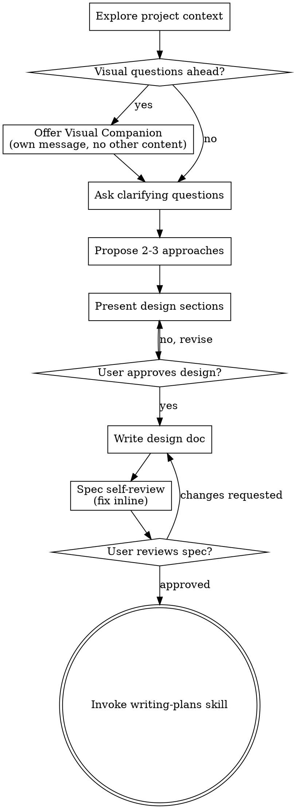
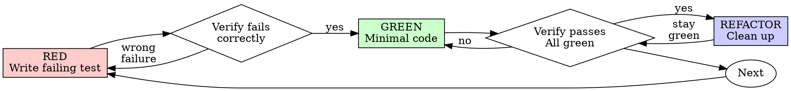

# Edit anchor style in dashboard table cells

**Session ID:** ses_1bf7e1e28ffe8Vde4ZjUxrweX9
**Created:** 5/19/2026, 4:51:54 PM
**Updated:** 5/19/2026, 4:57:34 PM

---

## User

@src\html.js iwant to edit style of a in td in dashbord page html

---

## Assistant (Build · gpt-5.5 · 11.6s)

**Tool: skill**

**Input:**
```json
{
  "name": "brainstorming"
}
```

**Output:**
```
<skill_content name="brainstorming">
# Skill: brainstorming

# Brainstorming Ideas Into Designs

Help turn ideas into fully formed designs and specs through natural collaborative dialogue.

Start by understanding the current project context, then ask questions one at a time to refine the idea. Once you understand what you're building, present the design and get user approval.

<HARD-GATE>
Do NOT invoke any implementation skill, write any code, scaffold any project, or take any implementation action until you have presented a design and the user has approved it. This applies to EVERY project regardless of perceived simplicity.
</HARD-GATE>

## Anti-Pattern: "This Is Too Simple To Need A Design"

Every project goes through this process. A todo list, a single-function utility, a config change — all of them. "Simple" projects are where unexamined assumptions cause the most wasted work. The design can be short (a few sentences for truly simple projects), but you MUST present it and get approval.

## Checklist

You MUST create a task for each of these items and complete them in order:

1. **Explore project context** — check files, docs, recent commits
2. **Offer visual companion** (if topic will involve visual questions) — this is its own message, not combined with a clarifying question. See the Visual Companion section below.
3. **Ask clarifying questions** — one at a time, understand purpose/constraints/success criteria
4. **Propose 2-3 approaches** — with trade-offs and your recommendation
5. **Present design** — in sections scaled to their complexity, get user approval after each section
6. **Write design doc** — save to `docs/superpowers/specs/YYYY-MM-DD-<topic>-design.md` and commit
7. **Spec self-review** — quick inline check for placeholders, contradictions, ambiguity, scope (see below)
8. **User reviews written spec** — ask user to review the spec file before proceeding
9. **Transition to implementation** — invoke writing-plans skill to create implementation plan

## Process Flow



**The terminal state is invoking writing-plans.** Do NOT invoke frontend-design, mcp-builder, or any other implementation skill. The ONLY skill you invoke after brainstorming is writing-plans.

## The Process

**Understanding the idea:**

- Check out the current project state first (files, docs, recent commits)
- Before asking detailed questions, assess scope: if the request describes multiple independent subsystems (e.g., "build a platform with chat, file storage, billing, and analytics"), flag this immediately. Don't spend questions refining details of a project that needs to be decomposed first.
- If the project is too large for a single spec, help the user decompose into sub-projects: what are the independent pieces, how do they relate, what order should they be built? Then brainstorm the first sub-project through the normal design flow. Each sub-project gets its own spec → plan → implementation cycle.
- For appropriately-scoped projects, ask questions one at a time to refine the idea
- Prefer multiple choice questions when possible, but open-ended is fine too
- Only one question per message - if a topic needs more exploration, break it into multiple questions
- Focus on understanding: purpose, constraints, success criteria

**Exploring approaches:**

- Propose 2-3 different approaches with trade-offs
- Present options conversationally with your recommendation and reasoning
- Lead with your recommended option and explain why

**Presenting the design:**

- Once you believe you understand what you're building, present the design
- Scale each section to its complexity: a few sentences if straightforward, up to 200-300 words if nuanced
- Ask after each section whether it looks right so far
- Cover: architecture, components, data flow, error handling, testing
- Be ready to go back and clarify if something doesn't make sense

**Design for isolation and clarity:**

- Break the system into smaller units that each have one clear purpose, communicate through well-defined interfaces, and can be understood and tested independently
- For each unit, you should be able to answer: what does it do, how do you use it, and what does it depend on?
- Can someone understand what a unit does without reading its internals? Can you change the internals without breaking consumers? If not, the boundaries need work.
- Smaller, well-bounded units are also easier for you to work with - you reason better about code you can hold in context at once, and your edits are more reliable when files are focused. When a file grows large, that's often a signal that it's doing too much.

**Working in existing codebases:**

- Explore the current structure before proposing changes. Follow existing patterns.
- Where existing code has problems that affect the work (e.g., a file that's grown too large, unclear boundaries, tangled responsibilities), include targeted improvements as part of the design - the way a good developer improves code they're working in.
- Don't propose unrelated refactoring. Stay focused on what serves the current goal.

## After the Design

**Documentation:**

- Write the validated design (spec) to `docs/superpowers/specs/YYYY-MM-DD-<topic>-design.md`
  - (User preferences for spec location override this default)
- Use elements-of-style:writing-clearly-and-concisely skill if available
- Commit the design document to git

**Spec Self-Review:**
After writing the spec document, look at it with fresh eyes:

1. **Placeholder scan:** Any "TBD", "TODO", incomplete sections, or vague requirements? Fix them.
2. **Internal consistency:** Do any sections contradict each other? Does the architecture match the feature descriptions?
3. **Scope check:** Is this focused enough for a single implementation plan, or does it need decomposition?
4. **Ambiguity check:** Could any requirement be interpreted two different ways? If so, pick one and make it explicit.

Fix any issues inline. No need to re-review — just fix and move on.

**User Review Gate:**
After the spec review loop passes, ask the user to review the written spec before proceeding:

> "Spec written and committed to `<path>`. Please review it and let me know if you want to make any changes before we start writing out the implementation plan."

Wait for the user's response. If they request changes, make them and re-run the spec review loop. Only proceed once the user approves.

**Implementation:**

- Invoke the writing-plans skill to create a detailed implementation plan
- Do NOT invoke any other skill. writing-plans is the next step.

## Key Principles

- **One question at a time** - Don't overwhelm with multiple questions
- **Multiple choice preferred** - Easier to answer than open-ended when possible
- **YAGNI ruthlessly** - Remove unnecessary features from all designs
- **Explore alternatives** - Always propose 2-3 approaches before settling
- **Incremental validation** - Present design, get approval before moving on
- **Be flexible** - Go back and clarify when something doesn't make sense

## Visual Companion

A browser-based companion for showing mockups, diagrams, and visual options during brainstorming. Available as a tool — not a mode. Accepting the companion means it's available for questions that benefit from visual treatment; it does NOT mean every question goes through the browser.

**Offering the companion:** When you anticipate that upcoming questions will involve visual content (mockups, layouts, diagrams), offer it once for consent:
> "Some of what we're working on might be easier to explain if I can show it to you in a web browser. I can put together mockups, diagrams, comparisons, and other visuals as we go. This feature is still new and can be token-intensive. Want to try it? (Requires opening a local URL)"

**This offer MUST be its own message.** Do not combine it with clarifying questions, context summaries, or any other content. The message should contain ONLY the offer above and nothing else. Wait for the user's response before continuing. If they decline, proceed with text-only brainstorming.

**Per-question decision:** Even after the user accepts, decide FOR EACH QUESTION whether to use the browser or the terminal. The test: **would the user understand this better by seeing it than reading it?**

- **Use the browser** for content that IS visual — mockups, wireframes, layout comparisons, architecture diagrams, side-by-side visual designs
- **Use the terminal** for content that is text — requirements questions, conceptual choices, tradeoff lists, A/B/C/D text options, scope decisions

A question about a UI topic is not automatically a visual question. "What does personality mean in this context?" is a conceptual question — use the terminal. "Which wizard layout works better?" is a visual question — use the browser.

If they agree to the companion, read the detailed guide before proceeding:
`skills/brainstorming/visual-companion.md`

Base directory for this skill: file:///C:/Users/moame/.cache/opencode/packages/superpowers@git+https_/github.com/obra/superpowers.git/node_modules/superpowers/skills/brainstorming
Relative paths in this skill (e.g., scripts/, reference/) are relative to this base directory.
Note: file list is sampled.

<skill_files>
<file>C:\Users\moame\.cache\opencode\packages\superpowers@git+https_\github.com\obra\superpowers.git\node_modules\superpowers\skills\brainstorming\visual-companion.md</file>
<file>C:\Users\moame\.cache\opencode\packages\superpowers@git+https_\github.com\obra\superpowers.git\node_modules\superpowers\skills\brainstorming\spec-document-reviewer-prompt.md</file>
<file>C:\Users\moame\.cache\opencode\packages\superpowers@git+https_\github.com\obra\superpowers.git\node_modules\superpowers\skills\brainstorming\scripts\stop-server.sh</file>
<file>C:\Users\moame\.cache\opencode\packages\superpowers@git+https_\github.com\obra\superpowers.git\node_modules\superpowers\skills\brainstorming\scripts\start-server.sh</file>
<file>C:\Users\moame\.cache\opencode\packages\superpowers@git+https_\github.com\obra\superpowers.git\node_modules\superpowers\skills\brainstorming\scripts\server.cjs</file>
<file>C:\Users\moame\.cache\opencode\packages\superpowers@git+https_\github.com\obra\superpowers.git\node_modules\superpowers\skills\brainstorming\scripts\helper.js</file>
<file>C:\Users\moame\.cache\opencode\packages\superpowers@git+https_\github.com\obra\superpowers.git\node_modules\superpowers\skills\brainstorming\scripts\frame-template.html</file>
</skill_files>
</skill_content>
```

---

## Assistant (Build · gpt-5.5 · 9.5s)

Using brainstorming to clarify the dashboard table link styling before changing code. I’ll first check the existing CSS so the change fits the current design.

**Tool: todowrite**

**Input:**
```json
{
  "todos": [
    {
      "content": "Explore project context",
      "status": "in_progress",
      "priority": "high"
    },
    {
      "content": "Offer visual companion if useful",
      "status": "pending",
      "priority": "low"
    },
    {
      "content": "Ask clarifying questions",
      "status": "pending",
      "priority": "high"
    },
    {
      "content": "Propose 2-3 approaches",
      "status": "pending",
      "priority": "medium"
    },
    {
      "content": "Present design for approval",
      "status": "pending",
      "priority": "high"
    },
    {
      "content": "Write design doc",
      "status": "pending",
      "priority": "low"
    },
    {
      "content": "Spec self-review",
      "status": "pending",
      "priority": "low"
    },
    {
      "content": "User reviews written spec",
      "status": "pending",
      "priority": "low"
    },
    {
      "content": "Transition to implementation plan",
      "status": "pending",
      "priority": "low"
    }
  ]
}
```

**Output:**
```
[
  {
    "content": "Explore project context",
    "status": "in_progress",
    "priority": "high"
  },
  {
    "content": "Offer visual companion if useful",
    "status": "pending",
    "priority": "low"
  },
  {
    "content": "Ask clarifying questions",
    "status": "pending",
    "priority": "high"
  },
  {
    "content": "Propose 2-3 approaches",
    "status": "pending",
    "priority": "medium"
  },
  {
    "content": "Present design for approval",
    "status": "pending",
    "priority": "high"
  },
  {
    "content": "Write design doc",
    "status": "pending",
    "priority": "low"
  },
  {
    "content": "Spec self-review",
    "status": "pending",
    "priority": "low"
  },
  {
    "content": "User reviews written spec",
    "status": "pending",
    "priority": "low"
  },
  {
    "content": "Transition to implementation plan",
    "status": "pending",
    "priority": "low"
  }
]
```

---

## Assistant (Build · gpt-5.5 · 7.7s)

**Tool: glob**

**Input:**
```json
{
  "pattern": "**/*.css"
}
```

**Output:**
```
C:\programing\nodeJs\json-reader-superpowers\src\assets\style.css
```

---

## Assistant (Build · gpt-5.5 · 7.9s)

**Tool: read**

**Input:**
```json
{
  "filePath": "C:\\programing\\nodeJs\\json-reader-superpowers\\src\\assets\\style.css"
}
```

**Output:**
```
<path>C:\programing\nodeJs\json-reader-superpowers\src\assets\style.css</path>
<type>file</type>
<content>
1: :root {
2:   color-scheme: light;
3:   font-family: Arial, Helvetica, sans-serif;
4:   background: #f5f7fb;
5:   color: #182033;
6:   line-height: 1.5;
7: }
8: 
9: * {
10:   box-sizing: border-box;
11: }
12: 
13: [hidden] {
14:   display: none !important;
15: }
16: 
17: body {
18:   margin: 0;
19:   background:
20:     radial-gradient(circle at top left, rgba(84, 112, 255, 0.16), transparent 32rem),
21:     #f5f7fb;
22: }
23: 
24: a {
25:   color: #2847c7;
26: }
27: 
28: input,
29: select {
30:   width: 100%;
31:   margin-top: 6px;
32:   border: 1px solid #c8d2e3;
33:   border-radius: 10px;
34:   padding: 10px 12px;
35:   color: #182033;
36:   background: #ffffff;
37:   font: inherit;
38: }
39: 
40: .page-shell {
41:   width: min(1120px, calc(100% - 32px));
42:   margin: 0 auto;
43:   padding: 32px 0;
44: }
45: 
46: .hero,
47: .panel,
48: .stat-card,
49: .slug-card,
50: .filter-panel,
51: .content-card {
52:   background: rgba(255, 255, 255, 0.94);
53:   border: 1px solid #dbe3ef;
54:   border-radius: 16px;
55:   box-shadow: 0 12px 30px rgba(24, 32, 51, 0.08);
56: }
57: 
58: .hero,
59: .panel,
60: .filter-panel,
61: .content-card {
62:   padding: 24px;
63:   margin-bottom: 20px;
64: }
65: 
66: .eyebrow {
67:   margin: 0 0 8px;
68:   color: #52607a;
69:   font-size: 0.78rem;
70:   font-weight: 700;
71:   letter-spacing: 0.08em;
72:   text-transform: uppercase;
73: }
74: 
75: h1,
76: h2 {
77:   margin: 0 0 16px;
78:   line-height: 1.15;
79: }
80: 
81: .stats-grid,
82: .slug-grid,
83: .content-grid {
84:   display: grid;
85:   grid-template-columns: repeat(auto-fit, minmax(220px, 1fr));
86:   gap: 16px;
87:   margin-bottom: 20px;
88: }
89: 
90: .stat-card,
91: .slug-card {
92:   display: grid;
93:   gap: 6px;
94:   padding: 18px;
95:   text-decoration: none;
96: }
97: 
98: .stat-card strong {
99:   font-size: 2.1rem;
100:   line-height: 1;
101: }
102: 
103: .slug-card:hover {
104:   border-color: #2847c7;
105:   transform: translateY(-1px);
106: }
107: 
108: .filter-panel {
109:   display: grid;
110:   grid-template-columns: 2fr 1fr 1fr 1.4fr;
111:   gap: 16px;
112:   align-items: end;
113: }
114: 
115: .content-card {
116:   display: grid;
117:   gap: 14px;
118: }
119: 
120: .content-card header p {
121:   margin: 0;
122:   color: #52607a;
123: }
124: 
125: .content-body {
126:   color: #243049;
127: }
128: 
129: .content-body > :first-child {
130:   margin-top: 0;
131: }
132: 
133: .content-body > :last-child {
134:   margin-bottom: 0;
135: }
136: 
137: .tags {
138:   display: flex;
139:   flex-wrap: wrap;
140:   gap: 8px;
141:   margin: 0;
142:   padding: 0;
143:   color: #52607a;
144:   list-style: none;
145: }
146: 
147: .tags li {
148:   border-radius: 999px;
149:   background: #e9edff;
150:   color: #2847c7;
151:   padding: 4px 10px;
152:   font-size: 0.86rem;
153:   font-weight: 700;
154: }
155: 
156: .empty-state {
157:   border: 1px dashed #9aa8bf;
158:   border-radius: 14px;
159:   padding: 20px;
160:   text-align: center;
161:   color: #52607a;
162: }
163: 
164: table {
165:   width: 100%;
166:   border-collapse: collapse;
167: }
168: 
169: th,
170: td {
171:   border-bottom: 1px solid #dbe3ef;
172:   padding: 10px;
173:   text-align: left;
174:   vertical-align: top;
175: }
176: 
177: th {
178:   color: #52607a;
179:   font-size: 0.82rem;
180:   letter-spacing: 0.04em;
181:   text-transform: uppercase;
182: }
183: 
184: @media (max-width: 680px) {
185:   .page-shell {
186:     width: min(100% - 20px, 1120px);
187:     padding: 16px 0;
188:   }
189: 
190:   .hero,
191:   .panel,
192:   .filter-panel,
193:   .content-card {
194:     padding: 18px;
195:   }
196: 
197:   .filter-panel,
198:   .stats-grid,
199:   .slug-grid,
200:   .content-grid {
201:     grid-template-columns: 1fr;
202:   }
203: 
204:   table,
205:   thead,
206:   tbody,
207:   tr,
208:   th,
209:   td {
210:     display: block;
211:   }
212: 
213:   thead {
214:     display: none;
215:   }
216: 
217:   td {
218:     border-bottom: 0;
219:     padding: 6px 0;
220:   }
221: 
222:   tr {
223:     border-bottom: 1px solid #dbe3ef;
224:     padding: 10px 0;
225:   }
226: }

(End of file - total 226 lines)
</content>
```

---

## Assistant (Build · gpt-5.5 · 9.2s)

**Tool: todowrite**

**Input:**
```json
{
  "todos": [
    {
      "content": "Explore project context",
      "status": "completed",
      "priority": "high"
    },
    {
      "content": "Offer visual companion if useful",
      "status": "completed",
      "priority": "low"
    },
    {
      "content": "Ask clarifying questions",
      "status": "in_progress",
      "priority": "high"
    },
    {
      "content": "Propose 2-3 approaches",
      "status": "pending",
      "priority": "medium"
    },
    {
      "content": "Present design for approval",
      "status": "pending",
      "priority": "high"
    },
    {
      "content": "Write design doc",
      "status": "pending",
      "priority": "low"
    },
    {
      "content": "Spec self-review",
      "status": "pending",
      "priority": "low"
    },
    {
      "content": "User reviews written spec",
      "status": "pending",
      "priority": "low"
    },
    {
      "content": "Transition to implementation plan",
      "status": "pending",
      "priority": "low"
    }
  ]
}
```

**Output:**
```
[
  {
    "content": "Explore project context",
    "status": "completed",
    "priority": "high"
  },
  {
    "content": "Offer visual companion if useful",
    "status": "completed",
    "priority": "low"
  },
  {
    "content": "Ask clarifying questions",
    "status": "in_progress",
    "priority": "high"
  },
  {
    "content": "Propose 2-3 approaches",
    "status": "pending",
    "priority": "medium"
  },
  {
    "content": "Present design for approval",
    "status": "pending",
    "priority": "high"
  },
  {
    "content": "Write design doc",
    "status": "pending",
    "priority": "low"
  },
  {
    "content": "Spec self-review",
    "status": "pending",
    "priority": "low"
  },
  {
    "content": "User reviews written spec",
    "status": "pending",
    "priority": "low"
  },
  {
    "content": "Transition to implementation plan",
    "status": "pending",
    "priority": "low"
  }
]
```

---

## Assistant (Build · gpt-5.5 · 32.2s)

**Tool: question**

**Input:**
```json
{
  "questions": [
    {
      "header": "Link style",
      "question": "How do you want the links inside the dashboard table cells to look?",
      "options": [
        {
          "label": "Button pills",
          "description": "Each slug link becomes a small rounded blue pill inside the table cell."
        },
        {
          "label": "Clean underlined",
          "description": "Keep normal text links, but improve spacing, underline, hover, and focus states."
        },
        {
          "label": "Badge chips",
          "description": "Use lighter chip-style badges matching the existing tag style."
        }
      ]
    }
  ]
}
```

**Output:**
```
User has answered your questions: "How do you want the links inside the dashboard table cells to look?"="Button pills". You can now continue with the user's answers in mind.
```

---

## Assistant (Build · gpt-5.5 · 12.7s)

For the dashboard table links, I found the anchors are generated in `src/html.js`, while the actual visual styling belongs in `src/assets/style.css`. I’ll keep the HTML change minimal, only adding a class if needed.

**Tool: todowrite**

**Input:**
```json
{
  "todos": [
    {
      "content": "Explore project context",
      "status": "completed",
      "priority": "high"
    },
    {
      "content": "Offer visual companion if useful",
      "status": "completed",
      "priority": "low"
    },
    {
      "content": "Ask clarifying questions",
      "status": "completed",
      "priority": "high"
    },
    {
      "content": "Propose 2-3 approaches",
      "status": "in_progress",
      "priority": "medium"
    },
    {
      "content": "Present design for approval",
      "status": "pending",
      "priority": "high"
    },
    {
      "content": "Write design doc",
      "status": "pending",
      "priority": "low"
    },
    {
      "content": "Spec self-review",
      "status": "pending",
      "priority": "low"
    },
    {
      "content": "User reviews written spec",
      "status": "pending",
      "priority": "low"
    },
    {
      "content": "Transition to implementation plan",
      "status": "pending",
      "priority": "low"
    }
  ]
}
```

**Output:**
```
[
  {
    "content": "Explore project context",
    "status": "completed",
    "priority": "high"
  },
  {
    "content": "Offer visual companion if useful",
    "status": "completed",
    "priority": "low"
  },
  {
    "content": "Ask clarifying questions",
    "status": "completed",
    "priority": "high"
  },
  {
    "content": "Propose 2-3 approaches",
    "status": "in_progress",
    "priority": "medium"
  },
  {
    "content": "Present design for approval",
    "status": "pending",
    "priority": "high"
  },
  {
    "content": "Write design doc",
    "status": "pending",
    "priority": "low"
  },
  {
    "content": "Spec self-review",
    "status": "pending",
    "priority": "low"
  },
  {
    "content": "User reviews written spec",
    "status": "pending",
    "priority": "low"
  },
  {
    "content": "Transition to implementation plan",
    "status": "pending",
    "priority": "low"
  }
]
```

---

## Assistant (Build · gpt-5.5 · 10.8s)

Recommended approach: add a class to the dashboard table slug links in `src/html.js`, then style that class in `src/assets/style.css` as small rounded blue button pills.

Other options:
- Style all `td a` links globally, but that may affect future table links unintentionally.
- Add wrapper markup around the slug links, but that is more HTML than needed.

Design:
- Change each published slug count link to `<a class="table-link-pill" ...>`.
- Add CSS for `.table-link-pill` with inline-flex layout, blue background, white text, rounded corners, padding, no underline, and hover/focus states.
- Keep links separated by the existing comma spacing.

Approve this design and I’ll implement it.

---

## User

i will go with Recommended approach

---

## Assistant (Build · gpt-5.5 · 12.7s)

**Tool: skill**

**Input:**
```json
{
  "name": "writing-plans"
}
```

**Output:**
```
<skill_content name="writing-plans">
# Skill: writing-plans

# Writing Plans

## Overview

Write comprehensive implementation plans assuming the engineer has zero context for our codebase and questionable taste. Document everything they need to know: which files to touch for each task, code, testing, docs they might need to check, how to test it. Give them the whole plan as bite-sized tasks. DRY. YAGNI. TDD. Frequent commits.

Assume they are a skilled developer, but know almost nothing about our toolset or problem domain. Assume they don't know good test design very well.

**Announce at start:** "I'm using the writing-plans skill to create the implementation plan."

**Context:** If working in an isolated worktree, it should have been created via the `superpowers:using-git-worktrees` skill at execution time.

**Save plans to:** `docs/superpowers/plans/YYYY-MM-DD-<feature-name>.md`
- (User preferences for plan location override this default)

## Scope Check

If the spec covers multiple independent subsystems, it should have been broken into sub-project specs during brainstorming. If it wasn't, suggest breaking this into separate plans — one per subsystem. Each plan should produce working, testable software on its own.

## File Structure

Before defining tasks, map out which files will be created or modified and what each one is responsible for. This is where decomposition decisions get locked in.

- Design units with clear boundaries and well-defined interfaces. Each file should have one clear responsibility.
- You reason best about code you can hold in context at once, and your edits are more reliable when files are focused. Prefer smaller, focused files over large ones that do too much.
- Files that change together should live together. Split by responsibility, not by technical layer.
- In existing codebases, follow established patterns. If the codebase uses large files, don't unilaterally restructure - but if a file you're modifying has grown unwieldy, including a split in the plan is reasonable.

This structure informs the task decomposition. Each task should produce self-contained changes that make sense independently.

## Bite-Sized Task Granularity

**Each step is one action (2-5 minutes):**
- "Write the failing test" - step
- "Run it to make sure it fails" - step
- "Implement the minimal code to make the test pass" - step
- "Run the tests and make sure they pass" - step
- "Commit" - step

## Plan Document Header

**Every plan MUST start with this header:**

```markdown
# [Feature Name] Implementation Plan

> **For agentic workers:** REQUIRED SUB-SKILL: Use superpowers:subagent-driven-development (recommended) or superpowers:executing-plans to implement this plan task-by-task. Steps use checkbox (`- [ ]`) syntax for tracking.

**Goal:** [One sentence describing what this builds]

**Architecture:** [2-3 sentences about approach]

**Tech Stack:** [Key technologies/libraries]

---
```

## Task Structure

````markdown
### Task N: [Component Name]

**Files:**
- Create: `exact/path/to/file.py`
- Modify: `exact/path/to/existing.py:123-145`
- Test: `tests/exact/path/to/test.py`

- [ ] **Step 1: Write the failing test**

```python
def test_specific_behavior():
    result = function(input)
    assert result == expected
```

- [ ] **Step 2: Run test to verify it fails**

Run: `pytest tests/path/test.py::test_name -v`
Expected: FAIL with "function not defined"

- [ ] **Step 3: Write minimal implementation**

```python
def function(input):
    return expected
```

- [ ] **Step 4: Run test to verify it passes**

Run: `pytest tests/path/test.py::test_name -v`
Expected: PASS

- [ ] **Step 5: Commit**

```bash
git add tests/path/test.py src/path/file.py
git commit -m "feat: add specific feature"
```
````

## No Placeholders

Every step must contain the actual content an engineer needs. These are **plan failures** — never write them:
- "TBD", "TODO", "implement later", "fill in details"
- "Add appropriate error handling" / "add validation" / "handle edge cases"
- "Write tests for the above" (without actual test code)
- "Similar to Task N" (repeat the code — the engineer may be reading tasks out of order)
- Steps that describe what to do without showing how (code blocks required for code steps)
- References to types, functions, or methods not defined in any task

## Remember
- Exact file paths always
- Complete code in every step — if a step changes code, show the code
- Exact commands with expected output
- DRY, YAGNI, TDD, frequent commits

## Self-Review

After writing the complete plan, look at the spec with fresh eyes and check the plan against it. This is a checklist you run yourself — not a subagent dispatch.

**1. Spec coverage:** Skim each section/requirement in the spec. Can you point to a task that implements it? List any gaps.

**2. Placeholder scan:** Search your plan for red flags — any of the patterns from the "No Placeholders" section above. Fix them.

**3. Type consistency:** Do the types, method signatures, and property names you used in later tasks match what you defined in earlier tasks? A function called `clearLayers()` in Task 3 but `clearFullLayers()` in Task 7 is a bug.

If you find issues, fix them inline. No need to re-review — just fix and move on. If you find a spec requirement with no task, add the task.

## Execution Handoff

After saving the plan, offer execution choice:

**"Plan complete and saved to `docs/superpowers/plans/<filename>.md`. Two execution options:**

**1. Subagent-Driven (recommended)** - I dispatch a fresh subagent per task, review between tasks, fast iteration

**2. Inline Execution** - Execute tasks in this session using executing-plans, batch execution with checkpoints

**Which approach?"**

**If Subagent-Driven chosen:**
- **REQUIRED SUB-SKILL:** Use superpowers:subagent-driven-development
- Fresh subagent per task + two-stage review

**If Inline Execution chosen:**
- **REQUIRED SUB-SKILL:** Use superpowers:executing-plans
- Batch execution with checkpoints for review

Base directory for this skill: file:///C:/Users/moame/.cache/opencode/packages/superpowers@git+https_/github.com/obra/superpowers.git/node_modules/superpowers/skills/writing-plans
Relative paths in this skill (e.g., scripts/, reference/) are relative to this base directory.
Note: file list is sampled.

<skill_files>
<file>C:\Users\moame\.cache\opencode\packages\superpowers@git+https_\github.com\obra\superpowers.git\node_modules\superpowers\skills\writing-plans\plan-document-reviewer-prompt.md</file>
</skill_files>
</skill_content>
```

---

## Assistant (Build · gpt-5.5 · 15.4s)

I'm using the writing-plans skill to create the implementation plan. I’ll keep it small because this is a focused styling change, then I’ll ask how you want me to execute it.

**Tool: glob**

**Input:**
```json
{
  "pattern": "docs/superpowers/plans/*.md"
}
```

**Output:**
```
C:\programing\nodeJs\json-reader-superpowers\docs\superpowers\plans\progress.md
C:\programing\nodeJs\json-reader-superpowers\docs\superpowers\plans\2026-05-19-json-reader-static-generator-design.md
C:\programing\nodeJs\json-reader-superpowers\docs\superpowers\plans\2026-05-19-json-reader-output-styling.md
C:\programing\nodeJs\json-reader-superpowers\docs\superpowers\plans\2026-05-19-json-reader-generated-pages.md
C:\programing\nodeJs\json-reader-superpowers\docs\superpowers\plans\2026-05-19-json-reader-errors-testing.md
C:\programing\nodeJs\json-reader-superpowers\docs\superpowers\plans\2026-05-19-json-reader-architecture-data.md
```

**Tool: glob**

**Input:**
```json
{
  "pattern": "package.json"
}
```

**Output:**
```
C:\programing\nodeJs\json-reader-superpowers\package.json
```

**Tool: glob**

**Input:**
```json
{
  "pattern": "test/**/*"
}
```

**Output:**
```
C:\programing\nodeJs\json-reader-superpowers\test\style.test.js
C:\programing\nodeJs\json-reader-superpowers\test\slug-page.test.js
C:\programing\nodeJs\json-reader-superpowers\test\integration.test.js
C:\programing\nodeJs\json-reader-superpowers\test\cli.test.js
C:\programing\nodeJs\json-reader-superpowers\test\generator.test.js
C:\programing\nodeJs\json-reader-superpowers\test\data-pipeline.test.js
C:\programing\nodeJs\json-reader-superpowers\test\reader.test.js
C:\programing\nodeJs\json-reader-superpowers\test\validator.test.js
```

**Tool: glob**

**Input:**
```json
{
  "pattern": "tests/**/*"
}
```

**Output:**
```
No files found
```

---

## Assistant (Build · gpt-5.5 · 9.7s)

The repo already has style tests, so the plan will cover a focused HTML assertion and CSS assertion before implementation.

**Tool: read**

**Input:**
```json
{
  "filePath": "C:\\programing\\nodeJs\\json-reader-superpowers\\package.json"
}
```

**Output:**
```
<path>C:\programing\nodeJs\json-reader-superpowers\package.json</path>
<type>file</type>
<content>
1: {
2:   "name": "json-reader-superpowers",
3:   "version": "1.0.0",
4:   "description": "Static JSON reader site generator",
5:   "main": "src/index.js",
6:   "scripts": {
7:     "build": "node src/index.js",
8:     "test": "node --test"
9:   },
10:   "license": "MIT"
11: }

(End of file - total 11 lines)
</content>
```

**Tool: read**

**Input:**
```json
{
  "filePath": "C:\\programing\\nodeJs\\json-reader-superpowers\\test\\style.test.js"
}
```

**Output:**
```
<path>C:\programing\nodeJs\json-reader-superpowers\test\style.test.js</path>
<type>file</type>
<content>
1: const assert = require('node:assert/strict');
2: const fs = require('node:fs/promises');
3: const test = require('node:test');
4: 
5: function escapeRegExp(value) {
6:   return value.replace(/[.*+?^${}()|[\]\\]/g, '\\$&');
7: }
8: 
9: test('stylesheet includes dashboard and slug page layout selectors', async () => {
10:   const css = await fs.readFile('src/assets/style.css', 'utf8');
11: 
12:   for (const selector of [
13:     '.stats-grid',
14:     '.stat-card',
15:     '.slug-grid',
16:     '.slug-card',
17:     '.filter-panel',
18:     '.content-grid',
19:     '.content-card',
20:     '.content-body',
21:     '.tags',
22:     '.empty-state',
23:     '@media (max-width: 680px)',
24:   ]) {
25:     assert.match(css, new RegExp(escapeRegExp(selector)));
26:   }
27: });
28: 
29: test('stylesheet has no external imports or remote asset references', async () => {
30:   const css = await fs.readFile('src/assets/style.css', 'utf8');
31: 
32:   assert.doesNotMatch(css, /@import/i);
33:   assert.doesNotMatch(css, /https?:\/\//i);
34: });
35: 
36: test('stylesheet hides filtered cards when scripts set the hidden attribute', async () => {
37:   const css = await fs.readFile('src/assets/style.css', 'utf8');
38: 
39:   assert.match(css, /\[hidden\]\s*{[^}]*display:\s*none\s*!important;[^}]*}/);
40: });

(End of file - total 40 lines)
</content>
```

**Tool: read**

**Input:**
```json
{
  "filePath": "C:\\programing\\nodeJs\\json-reader-superpowers\\docs\\superpowers\\plans\\2026-05-19-json-reader-output-styling.md",
  "limit": 80
}
```

**Output:**
```
<path>C:\programing\nodeJs\json-reader-superpowers\docs\superpowers\plans\2026-05-19-json-reader-output-styling.md</path>
<type>file</type>
<content>
1: # JSON Reader Output And Styling Implementation Plan
2: 
3: > **For agentic workers:** REQUIRED SUB-SKILL: Use superpowers:subagent-driven-development (recommended) or superpowers:executing-plans to implement this plan task-by-task. Steps use checkbox (`- [ ]`) syntax for tracking.
4: 
5: **Goal:** Harden output cleanup and stylesheet copying, then finish responsive offline styling for dashboard and slug pages.
6: 
7: **Architecture:** Keep output filesystem behavior in `src/generator.js` and visual design in the permanent source stylesheet `src/assets/style.css`. Tests assert that old generated files are removed, generated pages link only to local assets, and the stylesheet includes selectors used by both dashboard and slug pages.
8: 
9: **Tech Stack:** Node.js built-in `fs`, `path`, `node:test`, CommonJS modules, static CSS without dependencies.
10: 
11: ---
12: 
13: ## File Structure
14: 
15: - Modify: `src/generator.js` - keep output cleanup and stylesheet copying behavior explicit and tested.
16: - Modify: `src/assets/style.css` - complete dashboard cards, file table, slug filters, content cards, and mobile layout styling.
17: - Modify: `test/generator.test.js` - add cleanup and local asset assertions.
18: - Create: `test/style.test.js` - verify required CSS selectors and offline-friendly absence of external imports.
19: 
20: ### Task 1: Clean Output Behavior
21: 
22: **Files:**
23: - Modify: `test/generator.test.js`
24: 
25: - [ ] **Step 1: Add failing cleanup regression test**
26: 
27: Append to `test/generator.test.js`:
28: 
29: ```js
30: test('buildSite deletes old generated files before writing new output', async () => {
31:   const fixtureRoot = await fs.mkdtemp(path.join(os.tmpdir(), 'json-reader-clean-'));
32:   const dataDir = path.join(fixtureRoot, 'data');
33:   const outputDir = path.join(fixtureRoot, 'output');
34:   const assetSourcePath = path.join(fixtureRoot, 'src', 'assets', 'style.css');
35:   await fs.mkdir(dataDir, { recursive: true });
36:   await fs.mkdir(path.join(outputDir, 'assets'), { recursive: true });
37:   await fs.mkdir(path.dirname(assetSourcePath), { recursive: true });
38:   await fs.writeFile(path.join(outputDir, 'old.html'), 'stale');
39:   await fs.writeFile(path.join(outputDir, 'assets', 'old.css'), 'stale');
40:   await fs.writeFile(assetSourcePath, 'body { color: #111; }');
41: 
42:   await buildSite({ dataDir, outputDir, assetSourcePath });
43: 
44:   await assert.rejects(fs.readFile(path.join(outputDir, 'old.html'), 'utf8'), /ENOENT/);
45:   await assert.rejects(fs.readFile(path.join(outputDir, 'assets', 'old.css'), 'utf8'), /ENOENT/);
46:   assert.equal(await fs.readFile(path.join(outputDir, 'assets', 'style.css'), 'utf8'), 'body { color: #111; }');
47: });
48: ```
49: 
50: - [ ] **Step 2: Run test**
51: 
52: Run: `node --test test/generator.test.js`
53: 
54: Expected: PASS if the scaffold plan's `cleanOutput` already removes `output/` recursively; FAIL if output cleanup was not implemented exactly.
55: 
56: - [ ] **Step 3: Fix cleanup only if the test fails**
57: 
58: If the cleanup test fails, replace `cleanOutput` in `src/generator.js` with:
59: 
60: ```js
61: async function cleanOutput(outputDir) {
62:   await fs.rm(outputDir, { recursive: true, force: true });
63:   await fs.mkdir(path.join(outputDir, 'assets'), { recursive: true });
64: }
65: ```
66: 
67: - [ ] **Step 4: Run generator tests**
68: 
69: Run: `node --test test/generator.test.js`
70: 
71: Expected: PASS for cleanup, dashboard, stylesheet, and slug file tests.
72: 
73: - [ ] **Step 5: Commit**
74: 
75: ```bash
76: git add src/generator.js test/generator.test.js
77: git commit -m "test: cover output cleanup"
78: ```
79: 
80: ### Task 2: Offline Asset Links

(Showing lines 1-80 of 449. Use offset=81 to continue.)
</content>
```

---

## Assistant (Build · gpt-5.5 · 14.3s)

The required planning step is disproportionate for this small change, but I’ll keep the document minimal and won’t commit it because you did not ask for a commit.

**Tool: glob**

**Input:**
```json
{
  "pattern": "docs/superpowers/specs/*.md"
}
```

**Output:**
```
C:\programing\nodeJs\json-reader-superpowers\docs\superpowers\specs\2026-05-18-json-reader-static-generator-design.md
C:\programing\nodeJs\json-reader-superpowers\docs\superpowers\specs\2026-05-18-json-reader-output-styling.md
C:\programing\nodeJs\json-reader-superpowers\docs\superpowers\specs\2026-05-18-json-reader-generated-pages.md
C:\programing\nodeJs\json-reader-superpowers\docs\superpowers\specs\2026-05-18-json-reader-errors-testing.md
C:\programing\nodeJs\json-reader-superpowers\docs\superpowers\specs\2026-05-18-json-reader-architecture-data.md
```

**Tool: grep**

**Input:**
```json
{
  "pattern": "renderDashboard|Published slug counts|slugLinks",
  "include": "*.test.js"
}
```

**Output:**
```
Found 9 matches
C:\programing\nodeJs\json-reader-superpowers\test\generator.test.js:
  Line 11: const { renderDashboard } = require('../src/html');

  Line 33: test('renderDashboard returns an offline dashboard document', () => {

  Line 34:   const html = renderDashboard({

  Line 133: test('renderDashboard links slug cards and per-file slug counts', () => {

  Line 134:   const html = renderDashboard({

  Line 159: test('renderDashboard URL-encodes slug href path segments', () => {

  Line 160:   const html = renderDashboard({

  Line 186: test('renderDashboard encodes wildcard characters in slug href file names', () => {

  Line 187:   const html = renderDashboard({

```

---

## Assistant (Build · gpt-5.5 · 8.2s)

**Tool: read**

**Input:**
```json
{
  "filePath": "C:\\programing\\nodeJs\\json-reader-superpowers\\test\\generator.test.js",
  "offset": 120,
  "limit": 90
}
```

**Output:**
```
<path>C:\programing\nodeJs\json-reader-superpowers\test\generator.test.js</path>
<type>file</type>
<content>
120: 
121: test('cleanOutput rejects empty output directory', async () => {
122:   await assert.rejects(cleanOutput(''), /Unsafe output directory/);
123: });
124: 
125: test('buildSite rejects empty output directory', async () => {
126:   await assert.rejects(buildSite({ outputDir: '' }), /Unsafe output directory/);
127: });
128: 
129: test('buildSite rejects null output directory', async () => {
130:   await assert.rejects(buildSite({ outputDir: null }), /Unsafe output directory/);
131: });
132: 
133: test('renderDashboard links slug cards and per-file slug counts', () => {
134:   const html = renderDashboard({
135:     stats: {
136:       filesRead: 1,
137:       validObjects: 2,
138:       publishedObjects: 2,
139:       draftObjects: 0,
140:       uniquePublishedSlugs: 1,
141:       warningCount: 0,
142:     },
143:     warnings: [],
144:     slugGroups: new Map([['alpha', [{ title: 'A' }, { title: 'B' }]]]),
145:     fileSummaries: [{
146:       fileName: 'posts.json',
147:       validObjects: 2,
148:       publishedObjects: 2,
149:       draftObjects: 0,
150:       publishedSlugCounts: new Map([['alpha', 2]]),
151:     }],
152:   });
153: 
154:   assert.match(html, /href="alpha\.html"/);
155:   assert.match(html, /href="alpha\.html\?file=posts\.json"/);
156:   assert.match(html, /alpha \(2\)/);
157: });
158: 
159: test('renderDashboard URL-encodes slug href path segments', () => {
160:   const html = renderDashboard({
161:     stats: {
162:       filesRead: 1,
163:       validObjects: 1,
164:       publishedObjects: 1,
165:       draftObjects: 0,
166:       uniquePublishedSlugs: 1,
167:       warningCount: 0,
168:     },
169:     warnings: [],
170:     slugGroups: new Map([['javascript:alert(1)//', [{ title: 'Unsafe slug' }]]]),
171:     fileSummaries: [{
172:       fileName: 'posts & drafts.json',
173:       validObjects: 1,
174:       publishedObjects: 1,
175:       draftObjects: 0,
176:       publishedSlugCounts: new Map([['javascript:alert(1)//', 1]]),
177:     }],
178:   });
179: 
180:   assert.doesNotMatch(html, /href="javascript:alert\(1\)\/\/\.html"/);
181:   assert.match(html, /href="javascript%3Aalert\(1\)%2F%2F\.html"/);
182:   assert.match(html, /href="javascript%3Aalert\(1\)%2F%2F\.html\?file=posts%20%26%20drafts\.json"/);
183:   assert.match(html, />javascript:alert\(1\)\/\/ \(1\)<\/a>/);
184: });
185: 
186: test('renderDashboard encodes wildcard characters in slug href file names', () => {
187:   const html = renderDashboard({
188:     stats: {
189:       filesRead: 1,
190:       validObjects: 1,
191:       publishedObjects: 1,
192:       draftObjects: 0,
193:       uniquePublishedSlugs: 1,
194:       warningCount: 0,
195:     },
196:     warnings: [],
197:     slugGroups: new Map([['a*b', [{ title: 'Wildcard' }]]]),
198:     fileSummaries: [{
199:       fileName: 'posts.json',
200:       validObjects: 1,
201:       publishedObjects: 1,
202:       draftObjects: 0,
203:       publishedSlugCounts: new Map([['a*b', 1]]),
204:     }],
205:   });
206: 
207:   assert.match(html, /href="a%2Ab\.html"/);
208:   assert.match(html, /href="a%2Ab\.html\?file=posts\.json"/);
209: });

(Showing lines 120-209 of 357. Use offset=210 to continue.)
</content>
```

---

## Assistant (Build · gpt-5.5 · 20.7s)

I’ll save a short implementation plan for traceability, then execute inline since the approved change is one small task.

**Tool: apply_patch**

**Input:**
```json
{
  "patchText": "*** Begin Patch\n*** Add File: docs/superpowers/plans/2026-05-19-dashboard-table-link-pills.md\n+# Dashboard Table Link Pills Implementation Plan\n+\n+> **For agentic workers:** REQUIRED SUB-SKILL: Use superpowers:subagent-driven-development (recommended) or superpowers:executing-plans to implement this plan task-by-task. Steps use checkbox (`- [ ]`) syntax for tracking.\n+\n+**Goal:** Style published slug links inside the dashboard JSON files table as small button pills.\n+\n+**Architecture:** Keep generated dashboard markup in `src/html.js` and visual presentation in `src/assets/style.css`. Add one explicit class to per-file slug count links so only table slug links receive the pill treatment.\n+\n+**Tech Stack:** CommonJS, Node.js `node:test`, static HTML strings, static CSS.\n+\n+---\n+\n+## File Structure\n+\n+- Modify: `src/html.js` - add `class=\"table-link-pill\"` to per-file published slug count links in `renderDashboard`.\n+- Modify: `src/assets/style.css` - add pill, hover, and focus-visible styles for `.table-link-pill`.\n+- Modify: `test/generator.test.js` - assert dashboard per-file slug count links include the class.\n+- Modify: `test/style.test.js` - assert the stylesheet contains the table link pill selector.\n+\n+### Task 1: Dashboard Table Link Pills\n+\n+**Files:**\n+- Modify: `test/generator.test.js`\n+- Modify: `test/style.test.js`\n+- Modify: `src/html.js`\n+- Modify: `src/assets/style.css`\n+\n+- [ ] **Step 1: Write failing HTML assertion**\n+\n+In `test/generator.test.js`, update the `renderDashboard links slug cards and per-file slug counts` test to include:\n+\n+```js\n+assert.match(html, /<a class=\"table-link-pill\" href=\"alpha\\.html\\?file=posts\\.json\">alpha \\(2\\)<\\/a>/);\n+```\n+\n+- [ ] **Step 2: Write failing CSS assertion**\n+\n+In `test/style.test.js`, add `.table-link-pill` to the selector list in `stylesheet includes dashboard and slug page layout selectors`.\n+\n+- [ ] **Step 3: Run focused tests and verify failure**\n+\n+Run: `node --test test/generator.test.js test/style.test.js`\n+\n+Expected: FAIL because the class and CSS selector do not exist yet.\n+\n+- [ ] **Step 4: Add link class**\n+\n+In `src/html.js`, change the per-file slug link template to:\n+\n+```js\n+`<a class=\"table-link-pill\" href=\"${encodeSlugFileName(slug)}.html?file=${encodeURIComponent(file.fileName)}\">${escapeHtml(slug)} (${count})</a>`\n+```\n+\n+- [ ] **Step 5: Add pill styling**\n+\n+In `src/assets/style.css`, add:\n+\n+```css\n+.table-link-pill {\n+  display: inline-flex;\n+  align-items: center;\n+  margin: 0 4px 6px 0;\n+  border-radius: 999px;\n+  background: #2847c7;\n+  color: #ffffff;\n+  padding: 4px 10px;\n+  font-size: 0.86rem;\n+  font-weight: 700;\n+  text-decoration: none;\n+}\n+\n+.table-link-pill:hover,\n+.table-link-pill:focus-visible {\n+  background: #1d3395;\n+}\n+```\n+\n+- [ ] **Step 6: Run focused tests and verify pass**\n+\n+Run: `node --test test/generator.test.js test/style.test.js`\n+\n+Expected: PASS.\n+\n+- [ ] **Step 7: Run full test suite**\n+\n+Run: `npm test`\n+\n+Expected: PASS.\n*** End Patch"
}
```

**Output:**
```
Success. Updated the following files:
A docs/superpowers/plans/2026-05-19-dashboard-table-link-pills.md
```

---

## Assistant (Build · gpt-5.5 · 12.3s)

**Tool: skill**

**Input:**
```json
{
  "name": "test-driven-development"
}
```

**Output:**
```
<skill_content name="test-driven-development">
# Skill: test-driven-development

# Test-Driven Development (TDD)

## Overview

Write the test first. Watch it fail. Write minimal code to pass.

**Core principle:** If you didn't watch the test fail, you don't know if it tests the right thing.

**Violating the letter of the rules is violating the spirit of the rules.**

## When to Use

**Always:**
- New features
- Bug fixes
- Refactoring
- Behavior changes

**Exceptions (ask your human partner):**
- Throwaway prototypes
- Generated code
- Configuration files

Thinking "skip TDD just this once"? Stop. That's rationalization.

## The Iron Law

```
NO PRODUCTION CODE WITHOUT A FAILING TEST FIRST
```

Write code before the test? Delete it. Start over.

**No exceptions:**
- Don't keep it as "reference"
- Don't "adapt" it while writing tests
- Don't look at it
- Delete means delete

Implement fresh from tests. Period.

## Red-Green-Refactor



### RED - Write Failing Test

Write one minimal test showing what should happen.

<Good>
```typescript
test('retries failed operations 3 times', async () => {
  let attempts = 0;
  const operation = () => {
    attempts++;
    if (attempts < 3) throw new Error('fail');
    return 'success';
  };

  const result = await retryOperation(operation);

  expect(result).toBe('success');
  expect(attempts).toBe(3);
});
```
Clear name, tests real behavior, one thing
</Good>

<Bad>
```typescript
test('retry works', async () => {
  const mock = jest.fn()
    .mockRejectedValueOnce(new Error())
    .mockRejectedValueOnce(new Error())
    .mockResolvedValueOnce('success');
  await retryOperation(mock);
  expect(mock).toHaveBeenCalledTimes(3);
});
```
Vague name, tests mock not code
</Bad>

**Requirements:**
- One behavior
- Clear name
- Real code (no mocks unless unavoidable)

### Verify RED - Watch It Fail

**MANDATORY. Never skip.**

```bash
npm test path/to/test.test.ts
```

Confirm:
- Test fails (not errors)
- Failure message is expected
- Fails because feature missing (not typos)

**Test passes?** You're testing existing behavior. Fix test.

**Test errors?** Fix error, re-run until it fails correctly.

### GREEN - Minimal Code

Write simplest code to pass the test.

<Good>
```typescript
async function retryOperation<T>(fn: () => Promise<T>): Promise<T> {
  for (let i = 0; i < 3; i++) {
    try {
      return await fn();
    } catch (e) {
      if (i === 2) throw e;
    }
  }
  throw new Error('unreachable');
}
```
Just enough to pass
</Good>

<Bad>
```typescript
async function retryOperation<T>(
  fn: () => Promise<T>,
  options?: {
    maxRetries?: number;
    backoff?: 'linear' | 'exponential';
    onRetry?: (attempt: number) => void;
  }
): Promise<T> {
  // YAGNI
}
```
Over-engineered
</Bad>

Don't add features, refactor other code, or "improve" beyond the test.

### Verify GREEN - Watch It Pass

**MANDATORY.**

```bash
npm test path/to/test.test.ts
```

Confirm:
- Test passes
- Other tests still pass
- Output pristine (no errors, warnings)

**Test fails?** Fix code, not test.

**Other tests fail?** Fix now.

### REFACTOR - Clean Up

After green only:
- Remove duplication
- Improve names
- Extract helpers

Keep tests green. Don't add behavior.

### Repeat

Next failing test for next feature.

## Good Tests

| Quality | Good | Bad |
|---------|------|-----|
| **Minimal** | One thing. "and" in name? Split it. | `test('validates email and domain and whitespace')` |
| **Clear** | Name describes behavior | `test('test1')` |
| **Shows intent** | Demonstrates desired API | Obscures what code should do |

## Why Order Matters

**"I'll write tests after to verify it works"**

Tests written after code pass immediately. Passing immediately proves nothing:
- Might test wrong thing
- Might test implementation, not behavior
- Might miss edge cases you forgot
- You never saw it catch the bug

Test-first forces you to see the test fail, proving it actually tests something.

**"I already manually tested all the edge cases"**

Manual testing is ad-hoc. You think you tested everything but:
- No record of what you tested
- Can't re-run when code changes
- Easy to forget cases under pressure
- "It worked when I tried it" ≠ comprehensive

Automated tests are systematic. They run the same way every time.

**"Deleting X hours of work is wasteful"**

Sunk cost fallacy. The time is already gone. Your choice now:
- Delete and rewrite with TDD (X more hours, high confidence)
- Keep it and add tests after (30 min, low confidence, likely bugs)

The "waste" is keeping code you can't trust. Working code without real tests is technical debt.

**"TDD is dogmatic, being pragmatic means adapting"**

TDD IS pragmatic:
- Finds bugs before commit (faster than debugging after)
- Prevents regressions (tests catch breaks immediately)
- Documents behavior (tests show how to use code)
- Enables refactoring (change freely, tests catch breaks)

"Pragmatic" shortcuts = debugging in production = slower.

**"Tests after achieve the same goals - it's spirit not ritual"**

No. Tests-after answer "What does this do?" Tests-first answer "What should this do?"

Tests-after are biased by your implementation. You test what you built, not what's required. You verify remembered edge cases, not discovered ones.

Tests-first force edge case discovery before implementing. Tests-after verify you remembered everything (you didn't).

30 minutes of tests after ≠ TDD. You get coverage, lose proof tests work.

## Common Rationalizations

| Excuse | Reality |
|--------|---------|
| "Too simple to test" | Simple code breaks. Test takes 30 seconds. |
| "I'll test after" | Tests passing immediately prove nothing. |
| "Tests after achieve same goals" | Tests-after = "what does this do?" Tests-first = "what should this do?" |
| "Already manually tested" | Ad-hoc ≠ systematic. No record, can't re-run. |
| "Deleting X hours is wasteful" | Sunk cost fallacy. Keeping unverified code is technical debt. |
| "Keep as reference, write tests first" | You'll adapt it. That's testing after. Delete means delete. |
| "Need to explore first" | Fine. Throw away exploration, start with TDD. |
| "Test hard = design unclear" | Listen to test. Hard to test = hard to use. |
| "TDD will slow me down" | TDD faster than debugging. Pragmatic = test-first. |
| "Manual test faster" | Manual doesn't prove edge cases. You'll re-test every change. |
| "Existing code has no tests" | You're improving it. Add tests for existing code. |

## Red Flags - STOP and Start Over

- Code before test
- Test after implementation
- Test passes immediately
- Can't explain why test failed
- Tests added "later"
- Rationalizing "just this once"
- "I already manually tested it"
- "Tests after achieve the same purpose"
- "It's about spirit not ritual"
- "Keep as reference" or "adapt existing code"
- "Already spent X hours, deleting is wasteful"
- "TDD is dogmatic, I'm being pragmatic"
- "This is different because..."

**All of these mean: Delete code. Start over with TDD.**

## Example: Bug Fix

**Bug:** Empty email accepted

**RED**
```typescript
test('rejects empty email', async () => {
  const result = await submitForm({ email: '' });
  expect(result.error).toBe('Email required');
});
```

**Verify RED**
```bash
$ npm test
FAIL: expected 'Email required', got undefined
```

**GREEN**
```typescript
function submitForm(data: FormData) {
  if (!data.email?.trim()) {
    return { error: 'Email required' };
  }
  // ...
}
```

**Verify GREEN**
```bash
$ npm test
PASS
```

**REFACTOR**
Extract validation for multiple fields if needed.

## Verification Checklist

Before marking work complete:

- [ ] Every new function/method has a test
- [ ] Watched each test fail before implementing
- [ ] Each test failed for expected reason (feature missing, not typo)
- [ ] Wrote minimal code to pass each test
- [ ] All tests pass
- [ ] Output pristine (no errors, warnings)
- [ ] Tests use real code (mocks only if unavoidable)
- [ ] Edge cases and errors covered

Can't check all boxes? You skipped TDD. Start over.

## When Stuck

| Problem | Solution |
|---------|----------|
| Don't know how to test | Write wished-for API. Write assertion first. Ask your human partner. |
| Test too complicated | Design too complicated. Simplify interface. |
| Must mock everything | Code too coupled. Use dependency injection. |
| Test setup huge | Extract helpers. Still complex? Simplify design. |

## Debugging Integration

Bug found? Write failing test reproducing it. Follow TDD cycle. Test proves fix and prevents regression.

Never fix bugs without a test.

## Testing Anti-Patterns

When adding mocks or test utilities, read @testing-anti-patterns.md to avoid common pitfalls:
- Testing mock behavior instead of real behavior
- Adding test-only methods to production classes
- Mocking without understanding dependencies

## Final Rule

```
Production code → test exists and failed first
Otherwise → not TDD
```

No exceptions without your human partner's permission.

Base directory for this skill: file:///C:/Users/moame/.cache/opencode/packages/superpowers@git+https_/github.com/obra/superpowers.git/node_modules/superpowers/skills/test-driven-development
Relative paths in this skill (e.g., scripts/, reference/) are relative to this base directory.
Note: file list is sampled.

<skill_files>
<file>C:\Users\moame\.cache\opencode\packages\superpowers@git+https_\github.com\obra\superpowers.git\node_modules\superpowers\skills\test-driven-development\testing-anti-patterns.md</file>
</skill_files>
</skill_content>
```

---

## Assistant (Build · gpt-5.5 · 11.4s)

Using test-driven-development now: I’ll add the expected failing assertions first, run the focused tests to confirm they fail, then make the HTML/CSS changes.

**Tool: apply_patch**

**Input:**
```json
{
  "patchText": "*** Begin Patch\n*** Update File: test/generator.test.js\n@@\n   assert.match(html, /href=\"alpha\\.html\"/);\n   assert.match(html, /href=\"alpha\\.html\\?file=posts\\.json\"/);\n+  assert.match(html, /<a class=\"table-link-pill\" href=\"alpha\\.html\\?file=posts\\.json\">alpha \\(2\\)<\\/a>/);\n   assert.match(html, /alpha \\(2\\)/);\n });\n*** Update File: test/style.test.js\n@@\n     '.slug-card',\n+    '.table-link-pill',\n     '.filter-panel',\n*** End Patch"
}
```

**Output:**
```
Success. Updated the following files:
M test/generator.test.js
M test/style.test.js
```

---

## Assistant (Build · gpt-5.5 · 9.7s)

The failing tests are in place. I’ll run the focused test command now to confirm the failure is for the missing table link pill class/style.

**Tool: bash**

**Input:**
```json
{
  "command": "node --test test/generator.test.js test/style.test.js",
  "description": "Runs focused dashboard style tests",
  "timeout": 120000
}
```

**Output:**
```
TAP version 13
# Subtest: CLI entrypoint exports main and source stylesheet exists
ok 1 - CLI entrypoint exports main and source stylesheet exists
  ---
  duration_ms: 11.6461
  type: 'test'
  ...
# Subtest: CLI entrypoint finds bundled stylesheet from another cwd
ok 2 - CLI entrypoint finds bundled stylesheet from another cwd
  ---
  duration_ms: 79.061
  type: 'test'
  ...
# Subtest: renderDashboard returns an offline dashboard document
ok 3 - renderDashboard returns an offline dashboard document
  ---
  duration_ms: 0.3973
  type: 'test'
  ...
# Subtest: buildSite writes dashboard and stylesheet
ok 4 - buildSite writes dashboard and stylesheet
  ---
  duration_ms: 10.7886
  type: 'test'
  ...
# Subtest: buildSite rejects output directory that overlaps input data
ok 5 - buildSite rejects output directory that overlaps input data
  ---
  duration_ms: 5.5461
  type: 'test'
  ...
# Subtest: buildSite rejects output directory that contains data path with dot-dot prefix segment
ok 6 - buildSite rejects output directory that contains data path with dot-dot prefix segment
  ---
  duration_ms: 5.4826
  type: 'test'
  ...
# Subtest: cleanOutput rejects empty output directory
ok 7 - cleanOutput rejects empty output directory
  ---
  duration_ms: 0.2778
  type: 'test'
  ...
# Subtest: buildSite rejects empty output directory
ok 8 - buildSite rejects empty output directory
  ---
  duration_ms: 0.32
  type: 'test'
  ...
# Subtest: buildSite rejects null output directory
ok 9 - buildSite rejects null output directory
  ---
  duration_ms: 0.4672
  type: 'test'
  ...
# Subtest: renderDashboard links slug cards and per-file slug counts
not ok 10 - renderDashboard links slug cards and per-file slug counts
  ---
  duration_ms: 1.4257
  type: 'test'
  location: 'C:\\programing\\nodeJs\\json-reader-superpowers\\test\\generator.test.js:133:1'
  failureType: 'testCodeFailure'
  error: |-
    The input did not match the regular expression /<a class="table-link-pill" href="alpha\.html\?file=posts\.json">alpha \(2\)<\/a>/. Input:
    
    '<!doctype html>\n' +
      '<html lang="en">\n' +
      '<head>\n' +
      '  <meta charset="utf-8">\n' +
      '  <meta name="viewport" content="width=device-width, initial-scale=1">\n' +
      '  <title>JSON Reader Dashboard</title>\n' +
      '  <link rel="stylesheet" href="assets/style.css">\n' +
      '</head>\n' +
      '<body>\n' +
      '  <main class="page-shell">\n' +
      '    <header class="hero">\n' +
      '      <p class="eyebrow">Static JSON Reader</p>\n' +
      '      <h1>JSON Reader Dashboard</h1>\n' +
      '    </header>\n' +
      '    <section class="stats-grid" aria-label="Build statistics">\n' +
      '      <article class="stat-card"><strong>1</strong><span>1 JSON files read</span></article>\n' +
      '      <article class="stat-card"><strong>2</strong><span>valid objects</span></article>\n' +
      '      <article class="stat-card"><strong>2</strong><span>published objects</span></article>\n' +
      '      <article class="stat-card"><strong>0</strong><span>draft objects</span></article>\n' +
      '      <article class="stat-card"><strong>1</strong><span>unique published slugs</span></article>\n' +
      '      <article class="stat-card"><strong>0</strong><span>warnings</span></article>\n' +
      '    </section>\n' +
      '    <section class="panel">\n' +
      '      <h2>Published slugs</h2>\n' +
      '      <div class="slug-grid"><a class="slug-card" href="alpha.html"><strong>alpha</strong><span>2 published objects</span></a></div>\n' +
      '    </section>\n' +
      '    <section class="panel">\n' +
      '      <h2>Warnings</h2>\n' +
      '      <ul><li>No warnings.</li></ul>\n' +
      '    </section>\n' +
      '    <section class="panel">\n' +
      '      <h2>JSON files</h2>\n' +
      '      <table>\n' +
      '        <thead><tr><th>File name</th><th>Valid objects</th><th>Published</th><th>Drafts</th><th>Published slug counts</th></tr></thead>\n' +
      '        <tbody><tr><td>posts.json</td><td>2</td><td>2</td><td>0</td><td><a href="alpha.html?file=posts.json">alpha (2)</a></td></tr></tbody>\n' +
      '      </table>\n' +
      '    </section>\n' +
      '  </main>\n' +
      '</body>\n' +
      '</html>'
    
  code: 'ERR_ASSERTION'
  name: 'AssertionError'
  expected:
  actual: |-
    <!doctype html>
    <html lang="en">
    <head>
      <meta charset="utf-8">
      <meta name="viewport" content="width=device-width, initial-scale=1">
      <title>JSON Reader Dashboard</title>
      <link rel="stylesheet" href="assets/style.css">
    </head>
    <body>
      <main class="page-shell">
        <header class="hero">
          <p class="eyebrow">Static JSON Reader</p>
          <h1>JSON Reader Dashboard</h1>
        </header>
        <section class="stats-grid" aria-label="Build statistics">
          <article class="stat-card"><strong>1</strong><span>1 JSON files read</span></article>
          <article class="stat-card"><strong>2</strong><span>valid objects</span></article>
          <article class="stat-card"><strong>2</strong><span>published objects</span></article>
          <article class="stat-card"><strong>0</strong><span>draft objects</span></article>
          <article class="stat-card"><strong>1</strong><span>unique published slugs</span></article>
          <article class="stat-card"><strong>0</strong><span>warnings</span></article>
        </section>
        <section class="panel">
          <h2>Published slugs</h2>
          <div class="slug-grid"><a class="slug-card" href="alpha.html"><strong>alpha</strong><span>2 published objects</span></a></div>
        </section>
        <section class="panel">
          <h2>Warnings</h2>
          <ul><li>No warnings.</li></ul>
        </section>
        <section class="panel">
          <h2>JSON files</h2>
          <table>
            <thead><tr><th>File name</th><th>Valid objects</th><th>Published</th><th>Drafts</th><th>Published slug counts</th></tr></thead>
            <tbody><tr><td>posts.json</td><td>2</td><td>2</td><td>0</td><td><a href="alpha.html?file=posts.json">alpha (2)</a></td></tr></tbody>
          </table>
        </section>
      </main>
    </body>
    </html>
  operator: 'match'
  stack: |-
    TestContext.<anonymous> (C:\programing\nodeJs\json-reader-superpowers\test\generator.test.js:156:10)
    Test.runInAsyncScope (node:async_hooks:214:14)
    Test.run (node:internal/test_runner/test:1047:25)
    Test.processPendingSubtests (node:internal/test_runner/test:744:18)
    Test.postRun (node:internal/test_runner/test:1173:19)
    Test.run (node:internal/test_runner/test:1101:12)
    async Test.processPendingSubtests (node:internal/test_runner/test:744:7)
  ...
# Subtest: renderDashboard URL-encodes slug href path segments
ok 11 - renderDashboard URL-encodes slug href path segments
  ---
  duration_ms: 0.3133
  type: 'test'
  ...
# Subtest: renderDashboard encodes wildcard characters in slug href file names
ok 12 - renderDashboard encodes wildcard characters in slug href file names
  ---
  duration_ms: 0.1638
  type: 'test'
  ...
# Subtest: buildSite writes one page for each unique published slug
ok 13 - buildSite writes one page for each unique published slug
  ---
  duration_ms: 16.4872
  type: 'test'
  ...
# Subtest: buildSite writes encoded slug file names inside the output directory
ok 14 - buildSite writes encoded slug file names inside the output directory
  ---
  duration_ms: 13.5744
  type: 'test'
  ...
# Subtest: buildSite deletes old generated files before writing new output
ok 15 - buildSite deletes old generated files before writing new output
  ---
  duration_ms: 14.2639
  type: 'test'
  ...
# Subtest: generated HTML links only to the shared local stylesheet
ok 16 - generated HTML links only to the shared local stylesheet
  ---
  duration_ms: 50.3829
  type: 'test'
  ...
# Subtest: buildSite succeeds with missing data folder and generates only dashboard plus stylesheet
ok 17 - buildSite succeeds with missing data folder and generates only dashboard plus stylesheet
  ---
  duration_ms: 6.2765
  type: 'test'
  ...
# Subtest: buildSite generates no slug pages when there are no published objects
ok 18 - buildSite generates no slug pages when there are no published objects
  ---
  duration_ms: 14.4142
  type: 'test'
  ...
# Subtest: stylesheet includes dashboard and slug page layout selectors
not ok 19 - stylesheet includes dashboard and slug page layout selectors
  ---
  duration_ms: 9.0829
  type: 'test'
  location: 'C:\\programing\\nodeJs\\json-reader-superpowers\\test\\style.test.js:9:1'
  failureType: 'testCodeFailure'
  error: |-
    The input did not match the regular expression /\.table-link-pill/. Input:
    
    ':root {\n' +
      '  color-scheme: light;\n' +
      '  font-family: Arial, Helvetica, sans-serif;\n' +
      '  background: #f5f7fb;\n' +
      '  color: #182033;\n' +
      '  line-height: 1.5;\n' +
      '}\n' +
      '\n' +
      '* {\n' +
      '  box-sizing: border-box;\n' +
      '}\n' +
      '\n' +
      '[hidden] {\n' +
      '  display: none !important;\n' +
      '}\n' +
      '\n' +
      'body {\n' +
      '  margin: 0;\n' +
      '  background:\n' +
      '    radial-gradient(circle at top left, rgba(84, 112, 255, 0.16), transparent 32rem),\n' +
      '    #f5f7fb;\n' +
      '}\n' +
      '\n' +
      'a {\n' +
      '  color: #2847c7;\n' +
      '}\n' +
      '\n' +
      'input,\n' +
      'select {\n' +
      '  width: 100%;\n' +
      '  margin-top: 6px;\n' +
      '  border: 1px solid #c8d2e3;\n' +
      '  border-radius: 10px;\n' +
      '  padding: 10px 12px;\n' +
      '  color: #182033;\n' +
      '  background: #ffffff;\n' +
      '  font: inherit;\n' +
      '}\n' +
      '\n' +
      '.page-shell {\n' +
      '  width: min(1120px, calc(100% - 32px));\n' +
      '  margin: 0 auto;\n' +
      '  padding: 32px 0;\n' +
      '}\n' +
      '\n' +
      '.hero,\n' +
      '.panel,\n' +
      '.stat-card,\n' +
      '.slug-card,\n' +
      '.filter-panel,\n' +
      '.content-card {\n' +
      '  background: rgba(255, 255, 255, 0.94);\n' +
      '  border: 1px solid #dbe3ef;\n' +
      '  border-radius: 16px;\n' +
      '  box-shadow: 0 12px 30px rgba(24, 32, 51, 0.08);\n' +
      '}\n' +
      '\n' +
      '.hero,\n' +
      '.panel,\n' +
      '.filter-panel,\n' +
      '.content-card {\n' +
      '  padding: 24px;\n' +
      '  margin-bottom: 20px;\n' +
      '}\n' +
      '\n' +
      '.eyebrow {\n' +
      '  margin: 0 0 8px;\n' +
      '  color: #52607a;\n' +
      '  font-size: 0.78rem;\n' +
      '  font-weight: 700;\n' +
      '  letter-spacing: 0.08em;\n' +
      '  text-transform: uppercase;\n' +
      '}\n' +
      '\n' +
      'h1,\n' +
      'h2 {\n' +
      '  margin: 0 0 16px;\n' +
      '  line-height: 1.15;\n' +
      '}\n' +
      '\n' +
      '.stats-grid,\n' +
      '.slug-grid,\n' +
      '.content-grid {\n' +
      '  display: grid;\n' +
      '  grid-template-columns: repeat(auto-fit, minmax(220px, 1fr));\n' +
      '  gap: 16px;\n' +
      '  margin-bottom: 20px;\n' +
      '}\n' +
      '\n' +
      '.stat-card,\n' +
      '.slug-card {\n' +
      '  display: grid;\n' +
      '  gap: 6px;\n' +
      '  padding: 18px;\n' +
      '  text-decoration: none;\n' +
      '}\n' +
      '\n' +
      '.stat-card strong {\n' +
      '  font-size: 2.1rem;\n' +
      '  line-height: 1;\n' +
      '}\n' +
      '\n' +
      '.slug-card:hover {\n' +
      '  border-color: #2847c7;\n' +
      '  transform: translateY(-1px);\n' +
      '}\n' +
      '\n' +
      '.filter-panel {\n' +
      '  display: grid;\n' +
      '  grid-template-columns: 2fr 1fr 1fr 1.4fr;\n' +
      '  gap: 16px;\n' +
      '  align-items: end;\n' +
      '}\n' +
      '\n' +
      '.content-card {\n' +
      '  display: grid;\n' +
      '  gap: 14px;\n' +
      '}\n' +
      '\n' +
      '.content-card header p {\n' +
      '  margin: 0;\n' +
      '  color: #52607a;\n' +
      '}\n' +
      '\n' +
      '.content-body {\n' +
      '  color: #243049;\n' +
      '}\n' +
      '\n' +
      '.content-body > :first-child {\n' +
      '  margin-top: 0;\n' +
      '}\n' +
      '\n' +
      '.content-body > :last-child {\n' +
      '  margin-bottom: 0;\n' +
      '}\n' +
      '\n' +
      '.tags {\n' +
      '  display: flex;\n' +
      '  flex-wrap: wrap;\n' +
      '  gap: 8px;\n' +
      '  margin: 0;\n' +
      '  padding: 0;\n' +
      '  color: #52607a;\n' +
      '  list-style: none;\n' +
      '}\n' +
      '\n' +
      '.tags li {\n' +
      '  border-radius: 999px;\n' +
      '  background: #e9edff;\n' +
      '  color: #2847c7;\n' +
      '  padding: 4px 10px;\n' +
      '  font-size: 0.86rem;\n' +
      '  font-weight: 700;\n' +
      '}\n' +
      '\n' +
      '.empty-state {\n' +
      '  border: 1px dashed #9aa8bf;\n' +
      '  border-radius: 14px;\n' +
      '  padding: 20px;\n' +
      '  text-align: center;\n' +
      '  color: #52607a;\n' +
      '}\n' +
      '\n' +
      'table {\n' +
      '  width: 100%;\n' +
      '  border-collapse: collapse;\n' +
      '}\n' +
      '\n' +
      'th,\n' +
      'td {\n' +
      '  border-bottom: 1px solid #dbe3ef;\n' +
      '  padding: 10px;\n' +
      '  text-align: left;\n' +
      '  vertical-align: top;\n' +
      '}\n' +
      '\n' +
      'th {\n' +
      '  color: #52607a;\n' +
      '  font-size: 0.82rem;\n' +
      '  letter-spacing: 0.04em;\n' +
      '  text-transform: uppercase;\n' +
      '}\n' +
      '\n' +
      '@media (max-width: 680px) {\n' +
      '  .page-shell {\n' +
      '    width: min(100% - 20px, 1120px);\n' +
      '    padding: 16px 0;\n' +
      '  }\n' +
      '\n' +
      '  .hero,\n' +
      '  .panel,\n' +
      '  .filter-panel,\n' +
      '  .content-card {\n' +
      '    padding: 18px;\n' +
      '  }\n' +
      '\n' +
      '  .filter-panel,\n' +
      '  .stats-grid,\n' +
      '  .slug-grid,\n' +
      '  .content-grid {\n' +
      '    grid-template-columns: 1fr;\n' +
      '  }\n' +
      '\n' +
      '  table,\n' +
      '  thead,\n' +
      '  tbody,\n' +
      '  tr,\n' +
      '  th,\n' +
      '  td {\n' +
      '    display: block;\n' +
      '  }\n' +
      '\n' +
      '  thead {\n' +
      '    display: none;\n' +
      '  }\n' +
      '\n' +
      '  td {\n' +
      '    border-bottom: 0;\n' +
      '    padding: 6px 0;\n' +
      '  }\n' +
      '\n' +
      '  tr {\n' +
      '    border-bottom: 1px solid #dbe3ef;\n' +
      '    padding: 10px 0;\n' +
      '  }\n' +
      '}\n'
    
  code: 'ERR_ASSERTION'
  name: 'AssertionError'
  expected:
  actual: |-
    :root {
      color-scheme: light;
      font-family: Arial, Helvetica, sans-serif;
      background: #f5f7fb;
      color: #182033;
      line-height: 1.5;
    }
    
    * {
      box-sizing: border-box;
    }
    
    [hidden] {
      display: none !important;
    }
    
    body {
      margin: 0;
      background:
        radial-gradient(circle at top left, rgba(84, 112, 255, 0.16), transparent 32rem),
        #f5f7fb;
    }
    
    a {
      color: #2847c7;
    }
    
    input,
    select {
      width: 100%;
      margin-top: 6px;
      border: 1px solid #c8d2e3;
      border-radius: 10px;
      padding: 10px 12px;
      color: #182033;
      background: #ffffff;
      font: inherit;
    }
    
    .page-shell {
      width: min(1120px, calc(100% - 32px));
      margin: 0 auto;
      padding: 32px 0;
    }
    
    .hero,
    .panel,
    .stat-card,
    .slug-card,
    .filter-panel,
    .content-card {
      background: rgba(255, 255, 255, 0.94);
      border: 1px solid #dbe3ef;
      border-radius: 16px;
      box-shadow: 0 12px 30px rgba(24, 32, 51, 0.08);
    }
    
    .hero,
    .panel,
    .filter-panel,
    .content-card {
      padding: 24px;
      margin-bottom: 20px;
    }
    
    .eyebrow {
      margin: 0 0 8px;
      color: #52607a;
      font-size: 0.78rem;
      font-weight: 700;
      letter-spacing: 0.08em;
      text-transform: uppercase;
    }
    
    h1,
    h2 {
      margin: 0 0 16px;
      line-height: 1.15;
    }
    
    .stats-grid,
    .slug-grid,
    .content-grid {
      display: grid;
      grid-template-columns: repeat(auto-fit, minmax(220px, 1fr));
      gap: 16px;
      margin-bottom: 20px;
    }
    
    .stat-card,
    .slug-card {
      display: grid;
      gap: 6px;
      padding: 18px;
      text-decoration: none;
    }
    
    .stat-card strong {
      font-size: 2.1rem;
      line-height: 1;
    }
    
    .slug-card:hover {
      border-color: #2847c7;
      transform: translateY(-1px);
    }
    
    .filter-panel {
      display: grid;
      grid-template-columns: 2fr 1fr 1fr 1.4fr;
      gap: 16px;
      align-items: end;
    }
    
    .content-card {
      display: grid;
      gap: 14px;
    }
    
    .content-card header p {
      margin: 0;
      color: #52607a;
    }
    
    .content-body {
      color: #243049;
    }
    
    .content-body > :first-child {
      margin-top: 0;
    }
    
    .content-body > :last-child {
      margin-bottom: 0;
    }
    
    .tags {
      display: flex;
      flex-wrap: wrap;
      gap: 8px;
      margin: 0;
      padding: 0;
      color: #52607a;
      list-style: none;
    }
    
    .tags li {
      border-radius: 999px;
      background: #e9edff;
      color: #2847c7;
      padding: 4px 10px;
      font-size: 0.86rem;
      font-weight: 700;
    }
    
    .empty-state {
      border: 1px dashed #9aa8bf;
      border-radius: 14px;
      padding: 20px;
      text-align: center;
      color: #52607a;
    }
    
    table {
      width: 100%;
      border-collapse: collapse;
    }
    
    th,
    td {
      border-bottom: 1px solid #dbe3ef;
      padding: 10px;
      text-align: left;
      vertical-align: top;
    }
    
    th {
      color: #52607a;
      font-size: 0.82rem;
      letter-spacing: 0.04em;
      text-transform: uppercase;
    }
    
    @media (max-width: 680px) {
      .page-shell {
        width: min(100% - 20px, 1120px);
        padding: 16px 0;
      }
    
      .hero,
      .panel,
      .filter-panel,
      .content-card {
        padding: 18px;
      }
    
      .filter-panel,
      .stats-grid,
      .slug-grid,
      .content-grid {
        grid-template-columns: 1fr;
      }
    
      table,
      thead,
      tbody,
      tr,
      th,
      td {
        display: block;
      }
    
      thead {
        display: none;
      }
    
      td {
        border-bottom: 0;
        padding: 6px 0;
      }
    
      tr {
        border-bottom: 1px solid #dbe3ef;
        padding: 10px 0;
      }
    }
    
  operator: 'match'
  stack: |-
    TestContext.<anonymous> (C:\programing\nodeJs\json-reader-superpowers\test\style.test.js:26:12)
    async Test.run (node:internal/test_runner/test:1054:7)
    async startSubtestAfterBootstrap (node:internal/test_runner/harness:296:3)
  ...
# Subtest: stylesheet has no external imports or remote asset references
ok 20 - stylesheet has no external imports or remote asset references
  ---
  duration_ms: 2.6016
  type: 'test'
  ...
# Subtest: stylesheet hides filtered cards when scripts set the hidden attribute
ok 21 - stylesheet hides filtered cards when scripts set the hidden attribute
  ---
  duration_ms: 1.4578
  type: 'test'
  ...
1..21
# tests 21
# suites 0
# pass 19
# fail 2
# cancelled 0
# skipped 0
# todo 0
# duration_ms 335.4466

```

---

## Assistant (Build · gpt-5.5 · 12.8s)

The focused tests fail for the expected reasons: missing `table-link-pill` markup and CSS. I’ll now implement the minimal HTML and stylesheet changes.

**Tool: apply_patch**

**Input:**
```json
{
  "patchText": "*** Begin Patch\n*** Update File: src/html.js\n@@\n       const slugLinks = Array.from(file.publishedSlugCounts.entries())\n-        .map(([slug, count]) => `<a href=\"${encodeSlugFileName(slug)}.html?file=${encodeURIComponent(file.fileName)}\">${escapeHtml(slug)} (${count})</a>`)\n+        .map(([slug, count]) => `<a class=\"table-link-pill\" href=\"${encodeSlugFileName(slug)}.html?file=${encodeURIComponent(file.fileName)}\">${escapeHtml(slug)} (${count})</a>`)\n         .join(', ');\n*** Update File: src/assets/style.css\n@@\n th {\n   color: #52607a;\n   font-size: 0.82rem;\n   letter-spacing: 0.04em;\n   text-transform: uppercase;\n }\n+\n+.table-link-pill {\n+  display: inline-flex;\n+  align-items: center;\n+  margin: 0 4px 6px 0;\n+  border-radius: 999px;\n+  background: #2847c7;\n+  color: #ffffff;\n+  padding: 4px 10px;\n+  font-size: 0.86rem;\n+  font-weight: 700;\n+  text-decoration: none;\n+}\n+\n+.table-link-pill:hover,\n+.table-link-pill:focus-visible {\n+  background: #1d3395;\n+}\n \n @media (max-width: 680px) {\n*** End Patch"
}
```

**Output:**
```
Success. Updated the following files:
M src/html.js
M src/assets/style.css
```

---

## Assistant (Build · gpt-5.5 · 9.6s)

The HTML and CSS are updated. I’ll rerun the focused tests, then the full test suite if those pass.

**Tool: bash**

**Input:**
```json
{
  "command": "node --test test/generator.test.js test/style.test.js",
  "description": "Runs focused dashboard style tests",
  "timeout": 120000
}
```

**Output:**
```
TAP version 13
# Subtest: CLI entrypoint exports main and source stylesheet exists
ok 1 - CLI entrypoint exports main and source stylesheet exists
  ---
  duration_ms: 12.647
  type: 'test'
  ...
# Subtest: CLI entrypoint finds bundled stylesheet from another cwd
ok 2 - CLI entrypoint finds bundled stylesheet from another cwd
  ---
  duration_ms: 80.7367
  type: 'test'
  ...
# Subtest: renderDashboard returns an offline dashboard document
ok 3 - renderDashboard returns an offline dashboard document
  ---
  duration_ms: 0.4002
  type: 'test'
  ...
# Subtest: buildSite writes dashboard and stylesheet
ok 4 - buildSite writes dashboard and stylesheet
  ---
  duration_ms: 9.8763
  type: 'test'
  ...
# Subtest: buildSite rejects output directory that overlaps input data
ok 5 - buildSite rejects output directory that overlaps input data
  ---
  duration_ms: 5.251
  type: 'test'
  ...
# Subtest: buildSite rejects output directory that contains data path with dot-dot prefix segment
ok 6 - buildSite rejects output directory that contains data path with dot-dot prefix segment
  ---
  duration_ms: 7.2804
  type: 'test'
  ...
# Subtest: cleanOutput rejects empty output directory
ok 7 - cleanOutput rejects empty output directory
  ---
  duration_ms: 0.3007
  type: 'test'
  ...
# Subtest: buildSite rejects empty output directory
ok 8 - buildSite rejects empty output directory
  ---
  duration_ms: 0.3517
  type: 'test'
  ...
# Subtest: buildSite rejects null output directory
ok 9 - buildSite rejects null output directory
  ---
  duration_ms: 0.5023
  type: 'test'
  ...
# Subtest: renderDashboard links slug cards and per-file slug counts
ok 10 - renderDashboard links slug cards and per-file slug counts
  ---
  duration_ms: 0.7369
  type: 'test'
  ...
# Subtest: renderDashboard URL-encodes slug href path segments
ok 11 - renderDashboard URL-encodes slug href path segments
  ---
  duration_ms: 0.3407
  type: 'test'
  ...
# Subtest: renderDashboard encodes wildcard characters in slug href file names
ok 12 - renderDashboard encodes wildcard characters in slug href file names
  ---
  duration_ms: 0.1912
  type: 'test'
  ...
# Subtest: buildSite writes one page for each unique published slug
ok 13 - buildSite writes one page for each unique published slug
  ---
  duration_ms: 16.1502
  type: 'test'
  ...
# Subtest: buildSite writes encoded slug file names inside the output directory
ok 14 - buildSite writes encoded slug file names inside the output directory
  ---
  duration_ms: 13.778
  type: 'test'
  ...
# Subtest: buildSite deletes old generated files before writing new output
ok 15 - buildSite deletes old generated files before writing new output
  ---
  duration_ms: 14.4384
  type: 'test'
  ...
# Subtest: generated HTML links only to the shared local stylesheet
ok 16 - generated HTML links only to the shared local stylesheet
  ---
  duration_ms: 11.4974
  type: 'test'
  ...
# Subtest: buildSite succeeds with missing data folder and generates only dashboard plus stylesheet
ok 17 - buildSite succeeds with missing data folder and generates only dashboard plus stylesheet
  ---
  duration_ms: 7.7221
  type: 'test'
  ...
# Subtest: buildSite generates no slug pages when there are no published objects
ok 18 - buildSite generates no slug pages when there are no published objects
  ---
  duration_ms: 11.8454
  type: 'test'
  ...
# Subtest: stylesheet includes dashboard and slug page layout selectors
ok 19 - stylesheet includes dashboard and slug page layout selectors
  ---
  duration_ms: 7.6775
  type: 'test'
  ...
# Subtest: stylesheet has no external imports or remote asset references
ok 20 - stylesheet has no external imports or remote asset references
  ---
  duration_ms: 1.7302
  type: 'test'
  ...
# Subtest: stylesheet hides filtered cards when scripts set the hidden attribute
ok 21 - stylesheet hides filtered cards when scripts set the hidden attribute
  ---
  duration_ms: 1.405
  type: 'test'
  ...
1..21
# tests 21
# suites 0
# pass 21
# fail 0
# cancelled 0
# skipped 0
# todo 0
# duration_ms 304.5968

```

---

## Assistant (Build · gpt-5.5 · 9.0s)

Focused tests pass. I’ll run the full test suite for final verification.

**Tool: skill**

**Input:**
```json
{
  "name": "verification-before-completion"
}
```

**Output:**
```
<skill_content name="verification-before-completion">
# Skill: verification-before-completion

# Verification Before Completion

## Overview

Claiming work is complete without verification is dishonesty, not efficiency.

**Core principle:** Evidence before claims, always.

**Violating the letter of this rule is violating the spirit of this rule.**

## The Iron Law

```
NO COMPLETION CLAIMS WITHOUT FRESH VERIFICATION EVIDENCE
```

If you haven't run the verification command in this message, you cannot claim it passes.

## The Gate Function

```
BEFORE claiming any status or expressing satisfaction:

1. IDENTIFY: What command proves this claim?
2. RUN: Execute the FULL command (fresh, complete)
3. READ: Full output, check exit code, count failures
4. VERIFY: Does output confirm the claim?
   - If NO: State actual status with evidence
   - If YES: State claim WITH evidence
5. ONLY THEN: Make the claim

Skip any step = lying, not verifying
```

## Common Failures

| Claim | Requires | Not Sufficient |
|-------|----------|----------------|
| Tests pass | Test command output: 0 failures | Previous run, "should pass" |
| Linter clean | Linter output: 0 errors | Partial check, extrapolation |
| Build succeeds | Build command: exit 0 | Linter passing, logs look good |
| Bug fixed | Test original symptom: passes | Code changed, assumed fixed |
| Regression test works | Red-green cycle verified | Test passes once |
| Agent completed | VCS diff shows changes | Agent reports "success" |
| Requirements met | Line-by-line checklist | Tests passing |

## Red Flags - STOP

- Using "should", "probably", "seems to"
- Expressing satisfaction before verification ("Great!", "Perfect!", "Done!", etc.)
- About to commit/push/PR without verification
- Trusting agent success reports
- Relying on partial verification
- Thinking "just this once"
- Tired and wanting work over
- **ANY wording implying success without having run verification**

## Rationalization Prevention

| Excuse | Reality |
|--------|---------|
| "Should work now" | RUN the verification |
| "I'm confident" | Confidence ≠ evidence |
| "Just this once" | No exceptions |
| "Linter passed" | Linter ≠ compiler |
| "Agent said success" | Verify independently |
| "I'm tired" | Exhaustion ≠ excuse |
| "Partial check is enough" | Partial proves nothing |
| "Different words so rule doesn't apply" | Spirit over letter |

## Key Patterns

**Tests:**
```
✅ [Run test command] [See: 34/34 pass] "All tests pass"
❌ "Should pass now" / "Looks correct"
```

**Regression tests (TDD Red-Green):**
```
✅ Write → Run (pass) → Revert fix → Run (MUST FAIL) → Restore → Run (pass)
❌ "I've written a regression test" (without red-green verification)
```

**Build:**
```
✅ [Run build] [See: exit 0] "Build passes"
❌ "Linter passed" (linter doesn't check compilation)
```

**Requirements:**
```
✅ Re-read plan → Create checklist → Verify each → Report gaps or completion
❌ "Tests pass, phase complete"
```

**Agent delegation:**
```
✅ Agent reports success → Check VCS diff → Verify changes → Report actual state
❌ Trust agent report
```

## Why This Matters

From 24 failure memories:
- your human partner said "I don't believe you" - trust broken
- Undefined functions shipped - would crash
- Missing requirements shipped - incomplete features
- Time wasted on false completion → redirect → rework
- Violates: "Honesty is a core value. If you lie, you'll be replaced."

## When To Apply

**ALWAYS before:**
- ANY variation of success/completion claims
- ANY expression of satisfaction
- ANY positive statement about work state
- Committing, PR creation, task completion
- Moving to next task
- Delegating to agents

**Rule applies to:**
- Exact phrases
- Paraphrases and synonyms
- Implications of success
- ANY communication suggesting completion/correctness

## The Bottom Line

**No shortcuts for verification.**

Run the command. Read the output. THEN claim the result.

This is non-negotiable.

Base directory for this skill: file:///C:/Users/moame/.cache/opencode/packages/superpowers@git+https_/github.com/obra/superpowers.git/node_modules/superpowers/skills/verification-before-completion
Relative paths in this skill (e.g., scripts/, reference/) are relative to this base directory.
Note: file list is sampled.

<skill_files>

</skill_files>
</skill_content>
```

---

## Assistant (Build · gpt-5.5 · 10.0s)

Using verification-before-completion to make the final status evidence-based. I’m running the full test command now.

**Tool: bash**

**Input:**
```json
{
  "command": "npm test",
  "description": "Runs full test suite",
  "timeout": 120000
}
```

**Output:**
```

> json-reader-superpowers@1.0.0 test
> node --test

TAP version 13
# Subtest: main prints warnings to the provided logger
ok 1 - main prints warnings to the provided logger
  ---
  duration_ms: 54.065
  type: 'test'
  ...
# Subtest: collectBuildState validates objects and groups published slugs newest first
ok 2 - collectBuildState validates objects and groups published slugs newest first
  ---
  duration_ms: 83.5106
  type: 'test'
  ...
# Subtest: collectBuildState records invalid object warnings and file summaries
ok 3 - collectBuildState records invalid object warnings and file summaries
  ---
  duration_ms: 16.6501
  type: 'test'
  ...
# Subtest: collectBuildState counts drafts without creating published slug groups
ok 4 - collectBuildState counts drafts without creating published slug groups
  ---
  duration_ms: 24.2105
  type: 'test'
  ...
# Subtest: CLI entrypoint exports main and source stylesheet exists
ok 5 - CLI entrypoint exports main and source stylesheet exists
  ---
  duration_ms: 30.6755
  type: 'test'
  ...
# Subtest: CLI entrypoint finds bundled stylesheet from another cwd
ok 6 - CLI entrypoint finds bundled stylesheet from another cwd
  ---
  duration_ms: 153.3424
  type: 'test'
  ...
# Subtest: renderDashboard returns an offline dashboard document
ok 7 - renderDashboard returns an offline dashboard document
  ---
  duration_ms: 0.4804
  type: 'test'
  ...
# Subtest: buildSite writes dashboard and stylesheet
ok 8 - buildSite writes dashboard and stylesheet
  ---
  duration_ms: 13.3805
  type: 'test'
  ...
# Subtest: buildSite rejects output directory that overlaps input data
ok 9 - buildSite rejects output directory that overlaps input data
  ---
  duration_ms: 6.4989
  type: 'test'
  ...
# Subtest: buildSite rejects output directory that contains data path with dot-dot prefix segment
ok 10 - buildSite rejects output directory that contains data path with dot-dot prefix segment
  ---
  duration_ms: 7.9435
  type: 'test'
  ...
# Subtest: cleanOutput rejects empty output directory
ok 11 - cleanOutput rejects empty output directory
  ---
  duration_ms: 0.3505
  type: 'test'
  ...
# Subtest: buildSite rejects empty output directory
ok 12 - buildSite rejects empty output directory
  ---
  duration_ms: 0.5682
  type: 'test'
  ...
# Subtest: buildSite rejects null output directory
ok 13 - buildSite rejects null output directory
  ---
  duration_ms: 0.5613
  type: 'test'
  ...
# Subtest: renderDashboard links slug cards and per-file slug counts
ok 14 - renderDashboard links slug cards and per-file slug counts
  ---
  duration_ms: 0.8815
  type: 'test'
  ...
# Subtest: renderDashboard URL-encodes slug href path segments
ok 15 - renderDashboard URL-encodes slug href path segments
  ---
  duration_ms: 0.4563
  type: 'test'
  ...
# Subtest: renderDashboard encodes wildcard characters in slug href file names
ok 16 - renderDashboard encodes wildcard characters in slug href file names
  ---
  duration_ms: 0.4017
  type: 'test'
  ...
# Subtest: buildSite writes one page for each unique published slug
ok 17 - buildSite writes one page for each unique published slug
  ---
  duration_ms: 17.2304
  type: 'test'
  ...
# Subtest: buildSite writes encoded slug file names inside the output directory
ok 18 - buildSite writes encoded slug file names inside the output directory
  ---
  duration_ms: 14.6079
  type: 'test'
  ...
# Subtest: buildSite deletes old generated files before writing new output
ok 19 - buildSite deletes old generated files before writing new output
  ---
  duration_ms: 13.6343
  type: 'test'
  ...
# Subtest: generated HTML links only to the shared local stylesheet
ok 20 - generated HTML links only to the shared local stylesheet
  ---
  duration_ms: 11.1313
  type: 'test'
  ...
# Subtest: buildSite succeeds with missing data folder and generates only dashboard plus stylesheet
ok 21 - buildSite succeeds with missing data folder and generates only dashboard plus stylesheet
  ---
  duration_ms: 8.7041
  type: 'test'
  ...
# Subtest: buildSite generates no slug pages when there are no published objects
ok 22 - buildSite generates no slug pages when there are no published objects
  ---
  duration_ms: 11.0093
  type: 'test'
  ...
# Subtest: buildSite generates expected output for sample data
ok 23 - buildSite generates expected output for sample data
  ---
  duration_ms: 115.9422
  type: 'test'
  ...
# Subtest: readJsonFiles returns a warning when data folder is missing
ok 24 - readJsonFiles returns a warning when data folder is missing
  ---
  duration_ms: 14.3573
  type: 'test'
  ...
# Subtest: readJsonFiles reads a single object JSON file
ok 25 - readJsonFiles reads a single object JSON file
  ---
  duration_ms: 10.1751
  type: 'test'
  ...
# Subtest: readJsonFiles reads array JSON files
ok 26 - readJsonFiles reads array JSON files
  ---
  duration_ms: 5.4249
  type: 'test'
  ...
# Subtest: readJsonFiles skips invalid JSON files with warnings
ok 27 - readJsonFiles skips invalid JSON files with warnings
  ---
  duration_ms: 25.7794
  type: 'test'
  ...
# Subtest: readJsonFiles skips primitive JSON roots with warnings
ok 28 - readJsonFiles skips primitive JSON roots with warnings
  ---
  duration_ms: 10.6666
  type: 'test'
  ...
# Subtest: renderSlugPage shows slug heading, count, controls, and object cards
ok 29 - renderSlugPage shows slug heading, count, controls, and object cards
  ---
  duration_ms: 38.3484
  type: 'test'
  ...
# Subtest: renderSlugPage embeds only the provided slug objects as JSON data
ok 30 - renderSlugPage embeds only the provided slug objects as JSON data
  ---
  duration_ms: 0.5668
  type: 'test'
  ...
# Subtest: renderSlugPage script reads and updates the file query parameter
ok 31 - renderSlugPage script reads and updates the file query parameter
  ---
  duration_ms: 1.2357
  type: 'test'
  ...
# Subtest: stylesheet includes dashboard and slug page layout selectors
ok 32 - stylesheet includes dashboard and slug page layout selectors
  ---
  duration_ms: 13.4502
  type: 'test'
  ...
# Subtest: stylesheet has no external imports or remote asset references
ok 33 - stylesheet has no external imports or remote asset references
  ---
  duration_ms: 2.8453
  type: 'test'
  ...
# Subtest: stylesheet hides filtered cards when scripts set the hidden attribute
ok 34 - stylesheet hides filtered cards when scripts set the hidden attribute
  ---
  duration_ms: 2.1992
  type: 'test'
  ...
# Subtest: validateObject normalizes valid published objects
ok 35 - validateObject normalizes valid published objects
  ---
  duration_ms: 4.6377
  type: 'test'
  ...
# Subtest: validateObject accepts draft true and marks unpublished
ok 36 - validateObject accepts draft true and marks unpublished
  ---
  duration_ms: 0.314
  type: 'test'
  ...
# Subtest: validateObject rejects missing required strings
ok 37 - validateObject rejects missing required strings
  ---
  duration_ms: 0.3507
  type: 'test'
  ...
# Subtest: validateObject rejects impossible YYYY-MM-DD dates
ok 38 - validateObject rejects impossible YYYY-MM-DD dates
  ---
  duration_ms: 0.2448
  type: 'test'
  ...
# Subtest: validateObject rejects non-string tags
ok 39 - validateObject rejects non-string tags
  ---
  duration_ms: 0.2515
  type: 'test'
  ...
1..39
# tests 39
# suites 0
# pass 39
# fail 0
# cancelled 0
# skipped 0
# todo 0
# duration_ms 506.0495

```

---

## Assistant (Build · gpt-5.5 · 9.8s)

Implemented the recommended approach.

Changed:
- `src/html.js`: added `class="table-link-pill"` to dashboard table slug count links.
- `src/assets/style.css`: styled those links as rounded blue button pills with hover/focus state.
- `test/generator.test.js` and `test/style.test.js`: added coverage for the new markup/style.
- Added plan doc: `docs/superpowers/plans/2026-05-19-dashboard-table-link-pills.md`.

Verified:
- `npm test`
- Result: `39` tests passed, `0` failed.

---

